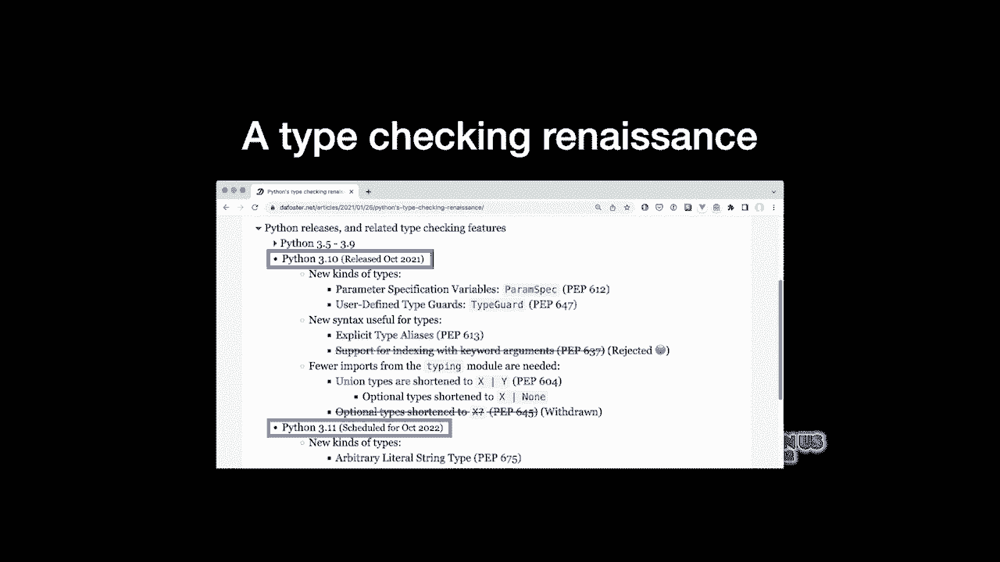
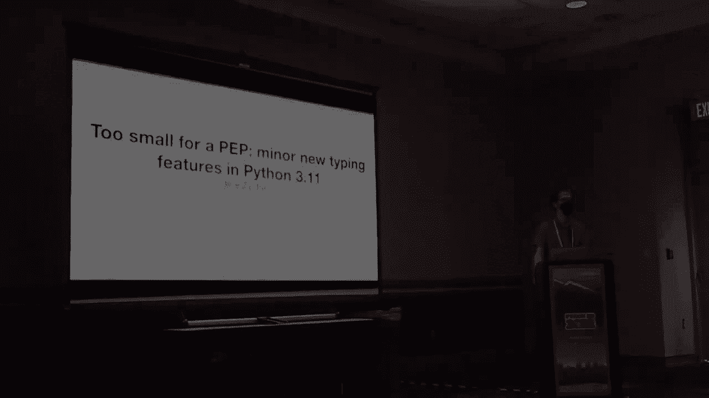
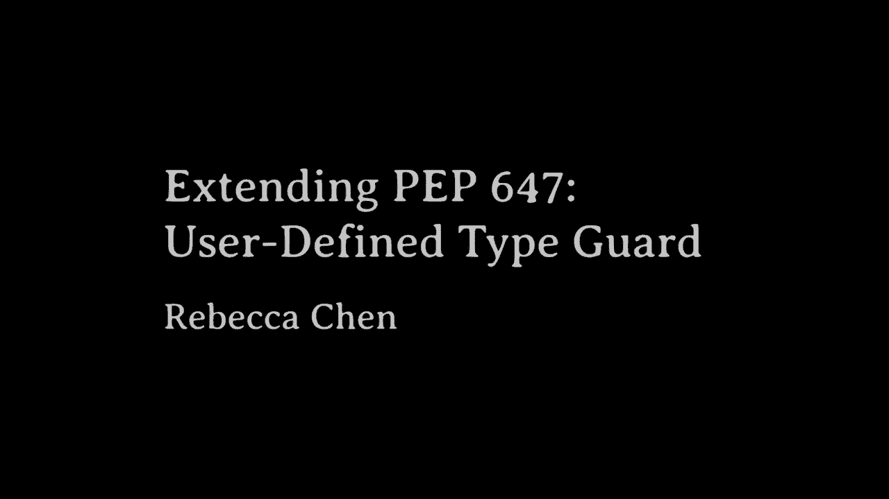
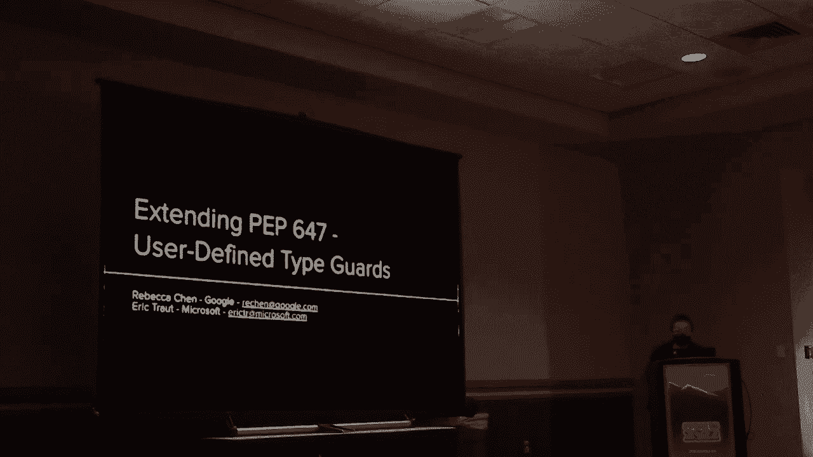
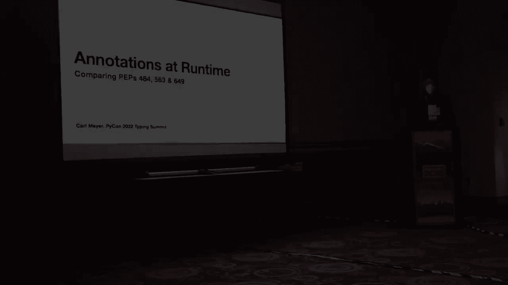
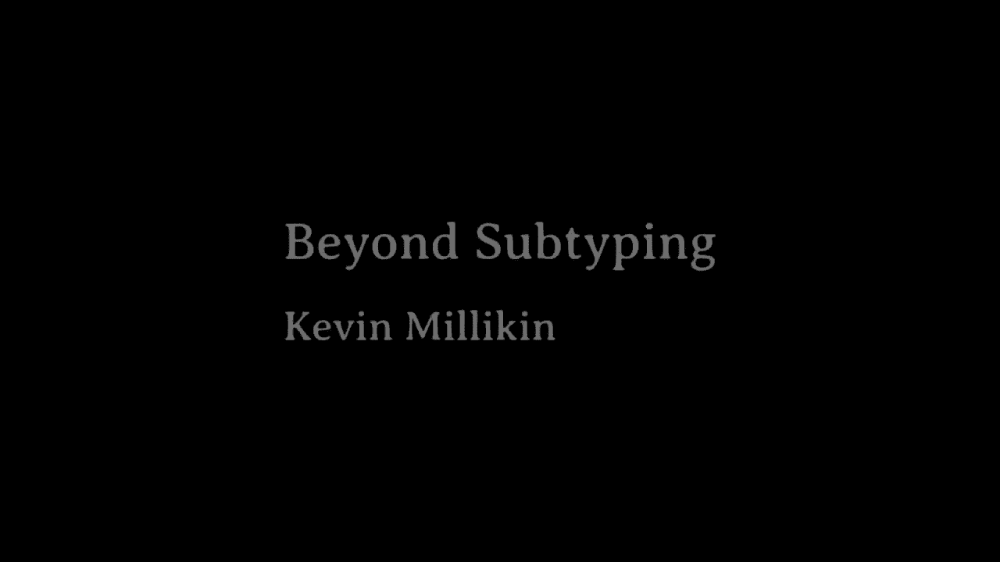
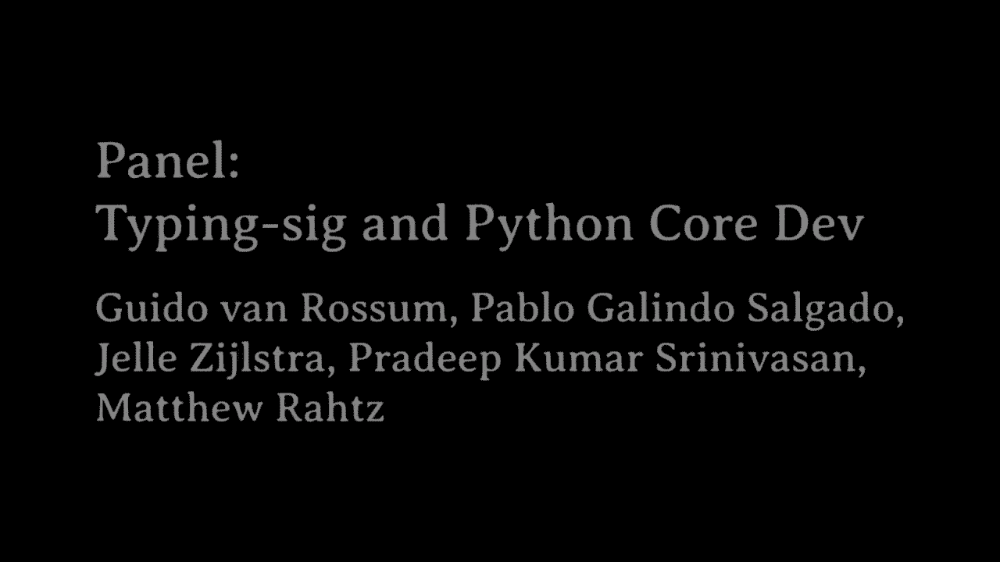

# Python 类型系统：P87：打字峰会内容整理



在本教程中，我们将学习 Python 类型系统的最新发展。我们将重点介绍 Python 3.10 中已发布的新类型功能，并预览即将在 Python 3.11 中推出的特性。内容基于 David Foster 在打字峰会上的演讲整理，旨在帮助初学者理解这些新概念。

## Python 3.10 中的新类型功能 🆕

上一节我们概述了本教程的内容，本节中我们来看看 Python 3.10 中引入的几个重要类型特性。这些特性旨在提升类型注释的表达能力和易用性。

### 参数规格 (ParamSpec)

参数规格对于注释装饰器特别有用。它可以作为任何参数集的占位符，使得为装饰器提供良好的类型注解成为可能。

**使用前示例**：装饰器的参数类型难以精确注解。
**使用后示例**：使用 `ParamSpec` 可以清晰地定义装饰器类型。
```python
from typing import TypeVar, Callable, ParamSpec

P = ParamSpec('P')
R = TypeVar('R')

def decorator(func: Callable[P, R]) -> Callable[P, R]:
    def wrapper(*args: P.args, **kwargs: P.kwargs) -> R:
        # 装饰器逻辑
        return func(*args, **kwargs)
    return wrapper
```

### 类型守卫 (TypeGuard)

类型守卫允许函数在返回 `True` 时，告知类型检查器其参数的类型已被收窄。这在处理类型检查器无法自动推断的类型时非常有用。

**使用前示例**：一个检查列表是否为字符串列表的函数，返回布尔值，但类型检查器无法据此收窄类型。
**使用后示例**：使用 `TypeGuard` 注解，类型检查器可以在条件为真时收窄类型。
```python
from typing import TypeGuard, List

def is_str_list(val: List[object]) -> TypeGuard[List[str]]:
    return all(isinstance(x, str) for x in val)

def process(data: List[object]) -> None:
    if is_str_list(data):
        # 在此分支中，`data` 的类型被收窄为 List[str]
        for s in data:
            print(s.upper())  # 类型安全
```

### 类型别名 (TypeAlias)

类型别名允许显式地声明一个变量是类型别名，提高了代码的清晰度，并支持前向引用。

**使用前示例**：将类型表达式赋值给变量是隐式别名，在某些情况下可能引起混淆。
**使用后示例**：使用 `TypeAlias` 显式声明。
```python
from typing import TypeAlias

# 显式类型别名
Vector: TypeAlias = list[float]
```

### 联合类型与可选类型的新语法

新语法允许使用管道运算符 `|` 来书写联合类型，并使用 `X | None` 代替 `Optional[X]`，减少了对 `typing` 模块的导入需求。

**使用前示例**：需要从 `typing` 模块导入 `Union` 和 `Optional`。
**使用后示例**：直接使用 `|` 运算符。
```python
# 旧方式
from typing import Union, Optional
def old_way(x: Union[int, str]) -> Optional[int]: ...

# 新方式 (Python 3.10+)
def new_way(x: int | str) -> int | None: ...
```




## Python 3.11 中的前瞻类型功能 🔮

上一节我们介绍了 Python 3.10 的稳定特性，本节中我们来看看预计在 Python 3.11 中引入的一些新功能。

### 字面字符串 (LiteralString)

字面字符串类型用于注解那些期望接收特定字符串字面量的 API，有助于防止命令注入等安全问题。

**使用场景**：SQL 查询、日志格式字符串等。
```python
from typing import LiteralString

def run_query(sql: LiteralString) -> None:
    # 确保 `sql` 是字面量，不是拼接的字符串
    ...

# 正确用法
run_query("SELECT * FROM users")
# 类型检查器可能报错的用法
query = "SELECT * FROM " + table_name
run_query(query)  # 可能引发类型错误
```

### 类型变量元组 (TypeVarTuple)

类型变量元组用于定义具有可变数量泛型参数的数组类型，例如 NumPy 的 ndarray 或 TensorFlow 的 Tensor，可以指定维度或数据类型。

**使用场景**：注解多维数组的维度。
```python
from typing import TypeVarTuple, Generic

Shape = TypeVarTuple('Shape')
class Array(Generic[*Shape]):
    def __init__(self, *shape: *Shape):
        self.shape = shape

# 可以定义特定维度的数组类型
Image = Array[int, int, 3]  # 高度，宽度，3个颜色通道
```

### Self 类型

Self 类型简化了返回实例自身（流式接口）的方法的类型注解。





**使用前示例**：需要使用复杂的泛型注解来声明返回 `self`。
**使用后示例**：直接使用 `Self` 类型。
```python
from typing import Self

class Builder:
    def add(self, value: int) -> Self:
        # ... 操作
        return self
```

### 数据类转换器 (dataclass_transform)

此装饰器允许库作者标记其元类（如 Pydantic 模型或 Attrs 类）的行为类似于数据类，无需为每个类型检查器编写专用插件。

**使用场景**：自定义类装饰器或元类，使其获得类似 `@dataclass` 的类型检查支持。
```python
from typing import dataclass_transform

@dataclass_transform
def my_model(cls):
    ... # 将类转换为模型的逻辑
    return cls

@my_model
class User:
    name: str
    age: int
```

### 类型字典 (TypedDict) 的扩展

扩展了 TypedDict，允许更简单地标记键为必需或非必需，而无需使用继承技巧。

**使用前示例**：通过继承 `Total=False` 来标记非必需键。
**使用后示例**：直接在定义中使用 `Required` 和 `NotRequired`。
```python
from typing import TypedDict




# Python 3.11 之前
class MovieOld(TypedDict, total=False):
    title: str
    year: int


# Python 3.11 新方式
from typing import Required, NotRequired
class MovieNew(TypedDict):
    title: Required[str]
    year: NotRequired[int]
    director: NotRequired[str]
```



## 总结与资源 📚

本节课中我们一起学习了 Python 3.10 和 3.11 中引入的一系列新类型功能。从提升装饰器类型的 `ParamSpec`，到收窄类型的 `TypeGuard` 和 `LiteralString`，再到增强泛型表达能力的 `TypeVarTuple` 和 `Self` 类型，这些特性共同使 Python 的类型系统更加强大和易用。


如果你想了解更多关于 Python 类型 PEP 的信息，可以搜索 “Python 的类型检查复兴” 这篇文章，其中整理了详细的 PEP 列表和链接。



大多数新功能会首先在 `typing_extensions` 模块中提供，这意味着即使你使用的是旧版 Python，也可以通过安装此模块来提前使用这些特性。