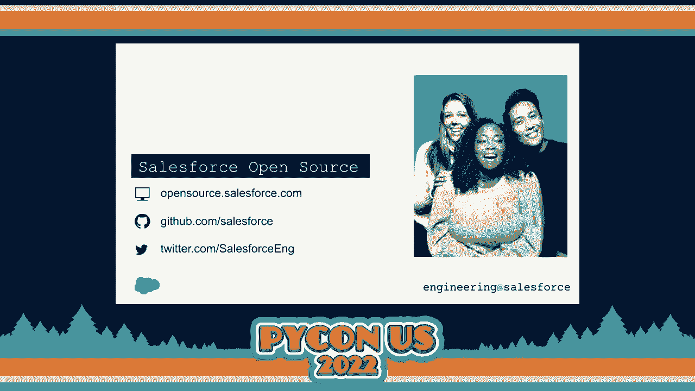
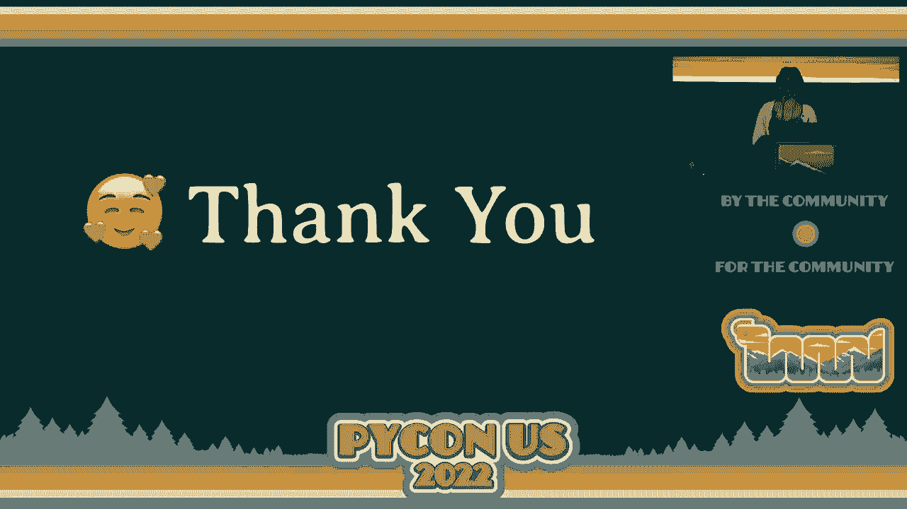
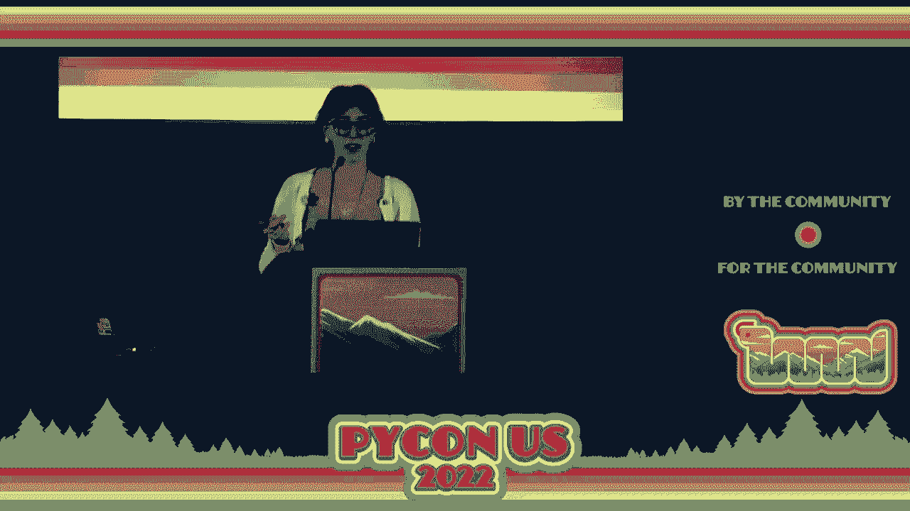
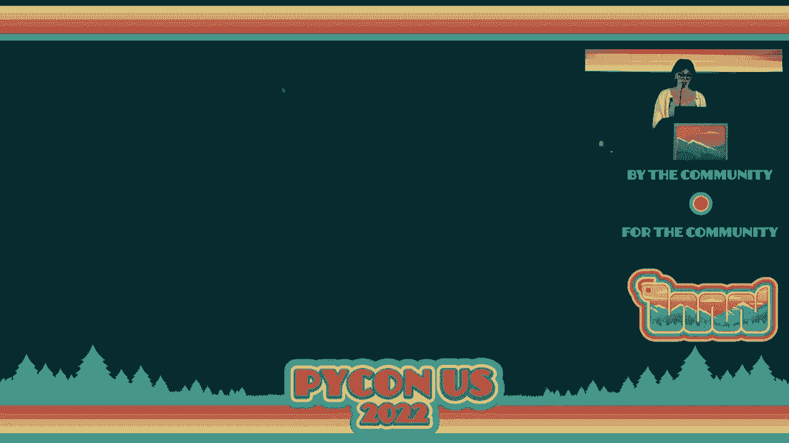
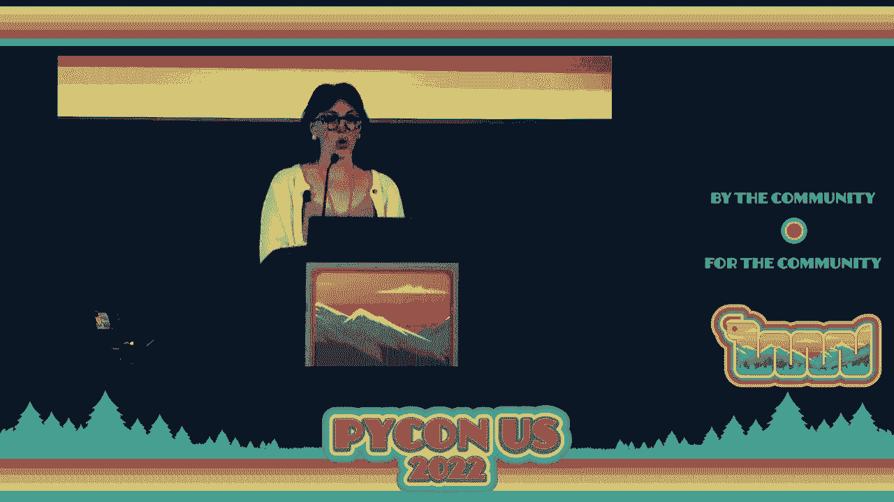
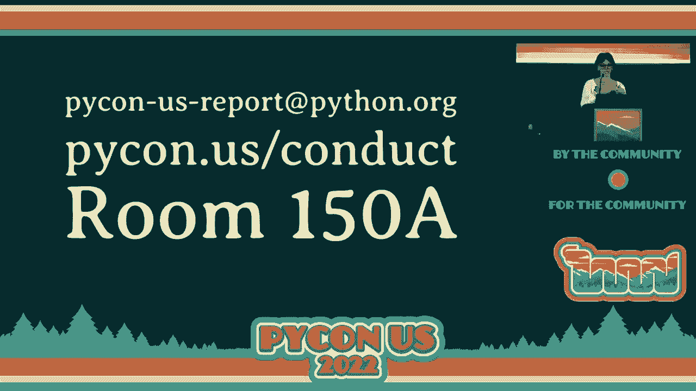

# P89：欢迎 - 艾米莉·莫尔豪斯 - VikingDen7 - BV1f8411Y7cP

好了，大家好，欢迎来到 PyCon 2022。

所以自从我们上次在一起以来已经过去了三年。我花了很多时间试图想象再次回到这里的感觉，我可以告诉你，任何我想象的都无法与现实相提并论。因此，自 2019 年以来发生了很多事情，我想我们都知道这一点。

我们经历了一些我们无法预见的事情，而生活在疫情期间以一种奇怪的方式继续着。

我们都经历了失落和挣扎，我第一次被邀请担任 PyCon 的主席是在 2018 年。因此，通常当你担任 PyCon 的主席时，你会共同担任一年，然后再担任两年。我记得 2018 年与当时的会议主席 E 的对话，我当时就说，我不知道几年后我会在哪里。

我真的无法想象疫情期间发生的那些事情。因此，我们社区中最宝贵的东西之一就是我们的包容性。在像这样的事件中你会看到这一点。我们能够转向在线并寻找其他方式继续保持社区的联系。我们愿意以开放的心态和创造性的解决方案参与其中。

但这一切真的无法与现场的感觉相比。在过去的三年中，时间似乎在一种奇怪的漩涡中流逝。很多事情发生了变化，但我们又在这里，仿佛什么都没有改变。所以我将见到一些我认识多年的朋友，或者是那些我只在网上见过的人。

Zoom 视频通话就像我们昨天才见过面。这正是我认为我们社区如此独特的原因。因此，我是艾米莉·莫尔豪斯。能够在过去三年中担任 PyCon 的管理者，我感到非常荣幸。我从心底里感激今天能和大家亲自相聚。

所以代表 PyCon 2022 的工作人员，我想先说声谢谢。

感谢所有志愿者让本次会议的每个方面得以实现。感谢 PyCon 软件基金会、它的董事会和员工承担此次会议的管理和财政责任。感谢所有在我们在线期间支持我们的赞助商，并再次回到现场赞助我们的每一个人。感谢所有前来分享他们工作的演讲者。

对于所有与会者，无论是现场的你们还是观看直播的你们，没有你们，我们将一无所获。所以欢迎来到盐湖城。我真的希望你们能抽时间去看看这个令人惊叹的城市所能提供的美景，绝对有适合每个人的东西，比如美食。

有很多户外活动可做，徒步旅行、博物馆、美丽的教堂。而且交通系统非常便利。我希望你能体验到会议墙外的城市风貌。那么我们来谈谈 PyCon。这是你第一次参加的 PyCon。

恭喜你，同时也很抱歉。因为 PyCon 已经成长为如此庞大的活动，我们无法在欢迎词中为你概述每一个活动。所以如果这是你第一次参加 PyCon，我希望你昨天能参加 Kojo Trey 和 Melanie 的新人导向活动。但对于那些没有参加的人，我们有这些小绿针供一些人佩戴。

佩戴“请问我”的徽章的人。所以如果你对会议有任何疑问，或者想要充分利用你在这里的体验，请找到这些人，我相信他们一定会非常高兴地告诉你所有关于 PyCon 的事情。从高层次来看，PyCon 分为三个部分。第一部分并不重要，因为它已经结束，那是我们的前两天教程。

从今天开始，我们将有三天主要的会议，之后是两天的冲刺活动。因此，稍微放大一点，今天和明天，你的一天将以主旨演讲或主旨演讲开始，然后是一天中的大部分讲座，最后以闪电演讲结束。周日，我们将有一点不同的日程安排。

我们将有几个讨论小组和一个早晨的主旨演讲，然后你将直接进入招聘会，下午将有一小部分讲座，最后是我们的闭幕主旨演讲和 PSF 年度报告。所以我们的主旨演讲，在此之后，我们将邀请 Wukash Langa。明天，我们将有 Sarah Isawam 和 Peter Wang。

周日将有 Python 指导委员会，周日我们将请 Naomi Steder 为我们闭幕。但请确保你周日早点到。我们仍将在早上 9 点开始，并且将有一个特殊的多样性与包容性工作组小组讨论，时间是早上 9 点。在今天的演讲之后，明天早上的主旨演讲之前，明天演讲结束后，以及周日早上的主旨演讲之前，你将会找到我们的闪电演讲。

这些都是迷人的小活动。如果你能的话，绝对可以来看看，或者如果你有兴趣进行闪电演讲，我们会有一个报名通道。这是一个可以谈论任何事情的机会，只要遵循我们的行为规范。它不一定要与 Python 相关，但当然可以，而且这是一个绝佳的地方。

分享所有那些超级奇怪的小想法或你上周学到的东西，你希望与他人分享。所以让我们花一点时间来熟悉一下我们所在的空间，因为我们有相当大的空间，并且有一些事情稍微分散。因此，现在你在大宴会厅，这里将举办我们的全体会议。

接下来的三天。右手边，我的左手边，通过这些门或那些门转个角。我们有我们的展览厅。它位于展览 CD 和 E。我们与另一个活动共享空间，这一点应该非常明显。所以一定要看看，确保在你去的任何地方都能看到与 Python 相关的标志。

但我们的车库门应该打开，以便你很明显地看到展览厅的位置。这将是会议的主要枢纽，包含了很多东西，下面让我们至少列出大部分。所有周日的餐食将在展览厅提供。请注意，在休息期间提供的咖啡和零食将位于。

就在顶层房间的直接外面。所以不要认为你必须从讲座跑回展览厅来喝咖啡。它们会离你非常近。如果你在注册时表示有任何过敏或饮食限制，请确保查看指示你去该区域的标志。

如果你对食材或食物有任何担忧，请务必找到会议工作人员并询问。同时请注意并留意在展览厅内的交通模式。我们尽量在很多空间中促进单向流动。有些区域会在地板上有箭头。请注意你与其他与会者互动的方式，因为我们仍然。

尽量保持尽可能多的健康和安全。你还会在展览厅的初创企业行找到所有赞助商展位。一定要看看我们的赞助商。他们正在做非常酷的事情。他们投入了很多努力和资金，搭建出非常棒的展位，并带来了很多赠品。

对每个人来说。老实说，这些人就是在过去几年中持续投资于 PyCon 和 PSF，使我们能够继续蓬勃发展的那些人。好的，然后是海报和招聘会。如果你在找工作或对海报感兴趣，这时展览厅将会过渡到这个环节。

所以展览厅将于周五和周六设置赞助商和展位，然后将过渡。过夜后，当你周日早上进来时，这将是一个全新的体验，我们将有所有的海报以及招聘会。好的，演讲将在会议空间的三个不同区域进行。

所以查尔茨将在这个楼层的一个我看不清的房间里，但还有另一张幻灯片上有房间号。否则我们所有的演讲将在第二层或第三层进行。再次查看这个 PyCon 标志，他们会引导你使用哪些电梯和扶梯，以及如何到达那些空间。今年我们实际上在头两天有五条演讲轨道，最后一天有四条。

今年的活动有 92 场，这非常惊人，因为这几乎是我们疫情前面对面活动的数量。但除非你有时间转换器，否则你只有 18 次机会观看演讲。不过不用担心，大部分演讲都会被录制并尽快在线提供。因此，安排时间时一定要考虑到这一点。

不要因为参加演讲而让自己疲惫不堪。确保你抽出时间照顾自己，并与其他与会者交流。我们也有开放空间，这是一种与其他与会者见面、分享和学习的绝佳机会，或许还能找到那些你也非常热爱的有趣话题。

你可以组织自己的活动或参加别人的活动。请查看这个网址，PyCon.us/os，那里会有最近的开放空间公告板的照片，但如果你想报名参加某个活动，请务必亲自查看那个公告板，位置在 150A 的堆叠室外。因此，PyCon 占用了这个会议中心的大部分区域，成为这个会议的最佳场所之一。

PyCon 和许多其他会议因走廊轨道而闻名的非正式活动。所以再次加入一张桌子，认识新朋友，打开笔记本电脑一起解决问题，找到你一直想见面的人，或者多年未见的朋友，只是想打个招呼。总是记得，当你站在一群人中时，留出空间给别人。

一个额外的人加入。这是来自空气文化的一句名言，实际上是一个非常优秀的方式来在我们的社区中展现包容性。所以如果你站在一群人中，有人走过来问“嘿，我可以和你们聊聊吗？”确保你自我介绍，打个招呼，也许问他们“这是你第一次参加 PyCon 吗？你对什么感到兴奋？”并开始一段对话。

好的，接下来是一些有趣的后勤事项。在整个会议中心有两个性别中立的卫生间。其中一个在这个楼层的急救室附近，距离性别卫生间只需转个弯，另一个在楼上 255 房间附近的上层房间旁边。还有母婴室，虽然它们的名称很糟糕。

它们几乎位于每个洗手间，但请注意有些在女性洗手间内，有些在外面，但它们确实对任何哺乳的人开放。那里配备了舒适的椅子、冰箱和水槽，如果这对你有用，来找我，我是一个新妈妈，想见见我的 PyCon 同伴们。

好的，如果你最终需要休息一下，专注于一些安静的工作或者只是深呼吸，我们有一个安静室，位于 151B，所以你只需沿着走廊向右走，进入右侧的小走廊里。外面有一个标志，所以如果你需要休息一下，请确保。

请考虑遵守这个房间的规则。请不要听音乐、在笔记本上播放视频、接电话等等。这里真的应该是一个让人们退后一步充电的安静空间。欢迎使用耳机，但请注意其他可能在使用的人。

你带上了这个空间。好的，我们最喜欢的活动之一是 Pylades 拍卖。拍卖将于明晚 6:30 在马里奥特酒店举行，就在对面街上。不要去那个远离 15 分钟的酒店，你不需要走那么远。请确保你去的是正确的马里奥特，但它确实就在街对面。

这是个乐趣无穷的活动，你可以竞标许多物品，享用一些食物，和人们一起聚会，这通常是一个非常好的时光，大家纷纷出价，支持一个非常好的事业。这个活动目前已经售罄，所以如果你有票但不打算参加，请考虑把票给其他人，以确保我们能用完所有的票。

这有助于减少我们的食物浪费，并确保我们能保持这个活动非常活跃。好吧，我们快到了。好的，正如你所见，今年 PyCon 上有很多活动。我们的指南应用程序是你查找会议最新信息、查看会场地图、创建自己日程的绝佳地方。

将所有这些信息离线保存到你的口袋里。所以一定要下载指南应用程序。你可以在 PyCon 的网站上很容易地获取到它，网址是 PyCon.us/guidebook。或者在 PyCon 网站上还有关于安装和获取访问权限的更多信息。

举办此次会议的财政责任。如果没有我们的 PSF 董事会和工作人员的努力，我们就不会在这里，所以如果你或你的公司能够的话，请考虑捐款，你可以访问这个网址，获取 PSF 赞助商页面的访问权限。我们还有我们的赠品领取。

我注意到有些人已经在外面拿他们的纪念品。今年我们只有贴纸，提前订购 T 恤的人现在可以领取。我们明天下午 1 点左右会有限量 T 恤出售，但如果你想购买而还没下单，你会有 T 恤。

你需要等到明天才能这样做。我们还有一个小的地点变更。查尔洛特的会议室不再在 253 A 和 B，现在在 151 DEF 和 G。这已经在你能找到信息的所有地方更新了。PyCon 网站、指南和标识也都已更新，但我们想特别提一下。

确保你去正确的地点。如果你正在拍摄活动，请注意，带有黄色点的与会者选择了不拍照。所以请注意不要发布任何有这些点的人的照片。此外，如果你想选择不拍照而还没有得到这些标识，随时可以联系。

在注册台可以获取。最后，如果你有任何需求，可以在会议上或通过 Twitter @staff@pycon 发推。我们会密切关注该账户，如果你想发布有关会议的内容，请使用标签#pyconus2022。现在，我们今天讨论的最重要的事情之一是健康与安全。

哦，显然我关于健康和安全的笔记不见了，这可不是好事。

发生这种情况。给我一秒钟，因为我想确保尽可能接近这个。好的，我们先回到幻灯片。我们想说我们对所有健康和安全政策的积极反馈感到无比感激，以及我们采取的严格措施，以确保 PyCon US 能够以最安全的方式进行。

我需要提醒大家，只有在积极吃东西或喝水时才能摘掉口罩，或者如果你是站在讲台上的发言人，请确保。

在你与可能对你有问题的参与者交谈之前，请确保你立即戴上口罩。但这真的就是为了确保我们以最安全的方式参与，保护在场的所有人。我们无法知道其他人有什么情况，对吧？有很多人有小孩，他们免疫系统较弱或有其他风险。

他们能够参加会议、平衡这种风险的方式之一就是我们共同达成的继续佩戴口罩的协议。所以这是你的口头警告。监控现在开始。如果你被发现没有戴口罩，工作人员会提醒你戴上。

会有一个小打孔器，他们会在你的证件上打一个小孔，以便你知道你已经得到了第一次警告。第二次警告将与工作人员讨论。如果我们发现你第二次没有佩戴口罩，我们将带你进入工作人员办公室进行对话，并确保下一次警告非常明确。

这是因为你的第三次警告意味着你将被请回家，直至会议结束。我们会愉快地将你转为在线票，这样你仍然可以参与并观看演讲等内容。然而，我们将不允许你再次进入会议或会议的任何外部活动。好的。就这样，非常有趣的公告。

我也想强调可及性。我们将为今年的所有演讲提供实时字幕。这与我现在的情况非常相似——哦，我实际上看不见它们。我想它们在——我希望我们有字幕。也许没有。哦，谢谢。嘿。看看这个。所以我们确实有字幕。因此，另外。

每个空间都将为轮椅使用者保留座位。这将在楼层上标明。一般来说，它会位于房间的中央。此外，会议符合 ADA 标准。然而，如果你有任何担忧或需要额外支持，请告知工作人员。我们还要对我们的字幕赞助商，Meta，表示由衷的感谢。

Red Hat、Coiled、Tide Lift、Source Craft、Cuddle Soft 和 Launched Darkly。这些都是为字幕提供资金支持的公司，不仅为我们的全体会议，还为我们五个分会场提供字幕，这太棒了。因此，我们最后一个也非常重要的事项是 PyCon 的行为守则。

因此，我们深切致力于为在场的每个人提供安全的环境和积极的体验。为了确保这一点，所有在场的人员，包括工作人员、与会者、演讲者、赞助商、志愿者，任何与此次 PyCon 活动相关的人都必须遵守我们的行为守则。绝对没有人例外。没有人高于法律。因此，绝不允许骚扰。

无论是口头还是身体上的歧视都不会被容忍。每个人在这里都将获得一个无骚扰的体验，无论性别、性别认同、表达、年龄、性取向、残疾、神经类型、外貌、身体大小、种族或宗教或缺乏宗教。我们对此非常认真，希望确保在场的每个人都能有一个尽可能安全的体验。

因此，你可以在行为守则中阅读更多内容，以及我们处理事件的程序链接以及我们的回应将如何展现，以及执法的情况。你可以在我们屏幕上的网址或 PyCon 网站的/about/code_of_conduct 中找到所有这些文件。如果你认为有人违反了行为守则。

鼓励您随时报告，无论严重程度如何。您可以通过发送电子邮件到 PyCon-US-report@pyCon.org 或在会议期间进行报告。您可以来到 150A 的工作人员办公室，我们会确保找到合适的人与您沟通。

适合您交流的正确人员。
