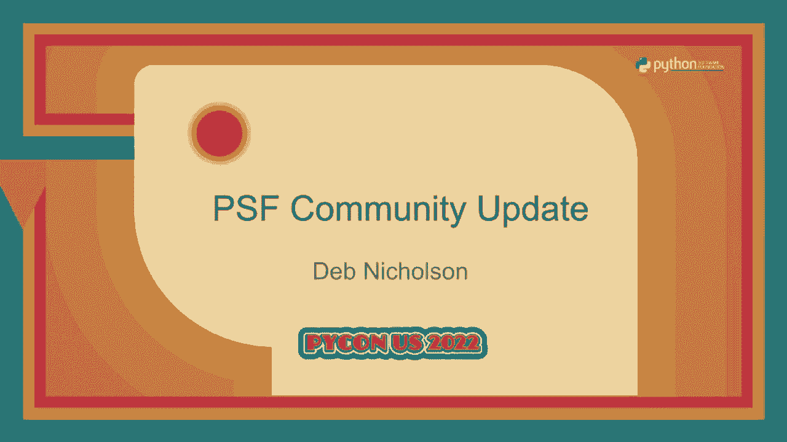
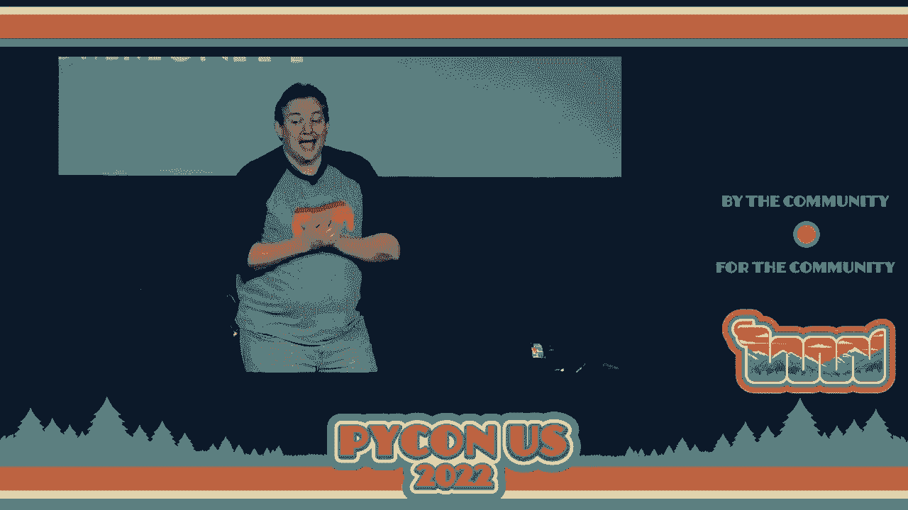
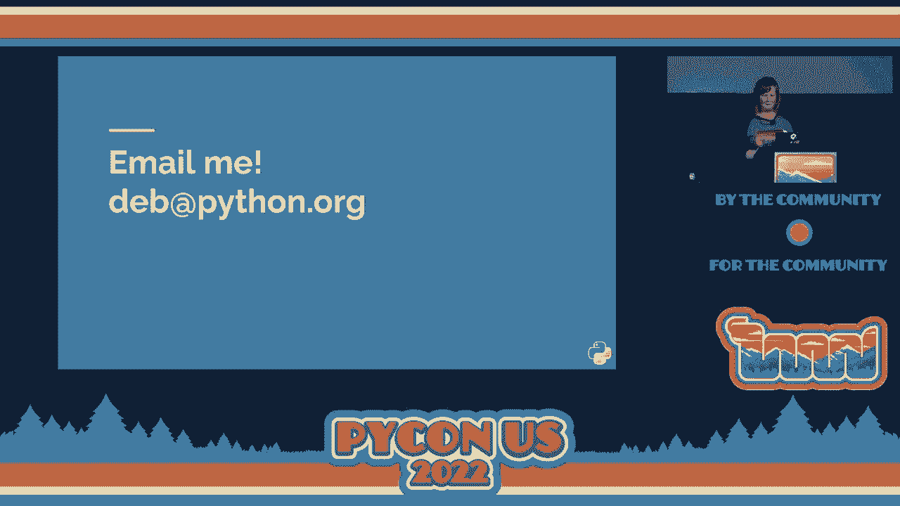

# P9：主题演讲 - Python 软件基金会更新 - VikingDen7 - BV1f8411Y7cP

\>\> 现在让我们欢迎 Thomas Waters 上台，启动我们的 PSF 更新。

\>\> 所以你们中有些人可能今天早上在舞台上看到我参与指导委员会。这不是那个。这是另一个角色。我还是 PSF 董事会的副主席。在过去的半年里，我担任了临时总经理，自从 Eva Yodlauska 去年离开 PSF。我相信你们很多人都听说过 Eva，她主持了 14 年的 PyCon。

她运营了 PSF 达 10 年。将 PSF 从一个由志愿者领导的组织，拥有一名员工，发展成为一个价值数百万美元的基金会，拥有七名全职员工和更多的合同工。抱歉，技术问题。

我只想说，是的，谢谢。我想代表大家感谢 Eva 的辛勤工作。许多年的服务。不幸的是，她无法到场。我知道她会观看录音，所以我想确保我们非常感激她的所有工作。Eva 离开后，她特别注意确保基金会继续运作。

没有她的帮助，我担任总经理职位只是为了确保员工拥有所需的一切，但真正工作的是员工，他们表现得很棒。所以也要感谢员工。董事会成立了一个搜索委员会，以找到下一任执行董事。我们与很多社区成员进行了交谈，他们告诉我们他们认为谁适合这个职位。

成为下一任执行董事。我们考虑了这个意见，但也聘请了一家搜索公司。我们关注了很多来自行业不同地方的候选人。最后，我们得到了几个非常优秀的候选人，并进行了良好的交谈，最终我们聘用了许多社区成员一开始就推荐的人。

我们从一开始就知道这次聘用是正确的。我对此完全有信心，因为我们做了尽职调查。所以，Deb Nicholson 是一位 Python 社区成员，拥有丰富的经验和开源社区的知识。欢迎 Deb。你好，我是你们的新执行董事。

我想感谢 Thomas 的精彩介绍。他让一切听起来像他只参加了一些额外的会议，但实际上他作为员工无偿工作了几个月，并帮助我找出一切，了解我应该参加哪些会议以及需要与谁交谈。

他做得非常出色。他可能不喜欢这样，但请给他一个掌声。看到你们脸部的上半部分真好。这真是一段奇怪的旅程。我想大家都这么说，对吧？但我真的想感谢大家让这个地方变得如此美好、安全、友好，以便在疫情尾声时回来。

所以感谢大家的到来，感谢你们让这里感觉成为一个安全的地方。我还想向所有参与远程的人问好。有人告诉我大约有 600 人正在观看直播。所以也许他们并不知道我们知道他们在那里。我们只是想说声你好。

感谢您的观看。我希望我们能让活动的混合版本更加互动，而不是单方面地感谢，知道你们在那里。所以我们将来会讨论这个。我还要对艾米莉·莫尔豪斯表达衷心的感谢。她是 Pecan 志愿者会议的主席。她注册参与 Pecan 已经两年了。

她进行了两年的远程工作，然后在我们回来时进行了第三年。她与我们所有的主旨演讲者合作。她设定了会议程序，正如许多人可能已经注意到的那样，她一直担任我们的主持人。所以非常感谢艾米莉·莫尔豪斯三年来的会议主席。我是 Python 软件基金会的执行董事。

有多少人知道 Python 软件基金会是什么？我看到大多数人举手，可能一半。好吧。我们可能会进行腾讯之旅。首先，我们组织了你们现在参加的 PyCon。所以显然这很棒。我不知道你们是否知道，我们通常有八名工作人员，而今年只有七名，因为我只在三周前加入。因此，我们有七名非常疲惫的工作人员与志愿者一起举办了整个活动。

以及供应商和其他一切。所以我也想对他们表示感谢。他们付出了很多努力。像是无数小时的工作，真是太惊人了。我不能碰麦克风。Python 软件基金会也是 Python 的非营利性中立组织。这使得 Python 能够保持一个由社区驱动的开源社区。

以及为社区服务。这使我们能够作为一个组织，接受任何人的补丁，接收建议并接受任何人的贡献。我认为这非常重要，并且与许多其他软件的写作方式完全不同。所以这也是我们所做的其他事情之一。

我们还为 Python 编程语言提供支持和基础设施。我们还支付一些非常优秀的人来从事 Python 的工作。可能你们中的很多人看到早些时候 WooCush 的主题演讲。他是我们的驻场开发者，专注于 CPython，并且正在进行优化工作。

我们的志愿者贡献。我们为 Python 工作的另一位人员是**Shimica Manihan**，她是我们的打包经理。她希望我告诉你们，我们正在制定一个宏伟的打包愿景，并将在下个月左右寻求社区的意见。所以我希望你们能关注这项调查以及信息和反馈的请求。

来自**Shimica**的消息。我们做的另一件事是捐钱，这非常有趣。今年我们捐出了 117,000 美元，这相当棒。由于疫情，金额比以前的年份略少。但我还希望的是，如果你知道一个很棒的 Python 项目、社区或需要资金的倡议，请告诉他们 PSF 可以帮助他们。

那么我们是如何做到这一切的？简短的回答是你。但长的回答也是你。我们之所以能够做到这一切，是因为你在生活中、社区中和工作场所谈论 Python。你帮助其他人学习 Python。你让我们出现在你的老板面前，老板为 PSF 写了一张支票。这也是非常重要的。

所以这就是我们是如何做到的。没有你们， 我们无法做到这一切。这是我们全新的年度报告。拍一张照片吧，它有很多页，所以你现在可能不想读，但它非常美丽，详细列出了我们在过去一年左右取得的所有成就。或者你可以相信我，我们是非常棒的。

这是筹款活动，你可以给我们更多的资金，除非你已经给过了，或者你可以再给一次。你是被允许的。我会接受。如果你有关于如何与你的老板联系以获取更多资金的想法，请告诉我们。那么，这就引出了社区服务奖。让我们看看。我们有三年的社区服务奖积压，因为我们很久没有见面了。

所以我将比我想的要快一点，如果你在进行一年。因为我希望你们明天能够参加冲刺。所以让我们谈谈社区服务奖。我将首先介绍那些没有亲自与我们在一起的人，然后再邀请在场的朋友们上台。

对于 2019 年的获奖者，我想感谢**Chris Angelico**、**Felipo de Marais**、**Jessica Upani**、**Minnie Young**、**Katie Bell**、**Lillian Ryan**和**Mark Zipiro**为社区所做的贡献。然后，如果**德博拉**在这里，我也想请她上台。所以**德博拉**非常出色。她与**Piper Zill**合作做了很多工作，也与**Pi Lady**一起做了很多工作。

她这个周末在查理的活动上发言。她是一位令人惊叹、引人入胜的演讲者，并参与了很多社区活动。所以谢谢你，**德博拉**，感谢你为 Python 社区所做的贡献。我们的 2020 年获奖者，感觉整整一年就像在`10 分钟`内发生了一样，或者整整两年、三年。

曼努埃尔·考夫曼，阿比盖尔·道格比，卡佳·莉拉，诺亚·阿鲁鲁，拉米·乔杜里，伊莱恩·黄，以及汉弗莱·布塔奥。非常感谢你们为 Python 社区的服务。然后我还想提到乔治·凯尔。她亲自到场。她在建立 Pi Lady 全球方面起到了重要作用。她是 Pi Lady 在曼谷的组织者。

记住 PSF 多元包容工作组，和泰国 PiCon 的组织者。她为今年的 Python 设计了我们的优秀主题。乔治，你在吗？

感谢你为社区的服务。谢谢你。我把……放哪里了。现在我们回到 2021 年。所以我想感谢杰西·诺勒，丹妮尔·普拉西塔，特蕾莎·奥约夫苏，多丽丝·扎帕里，西尔维亚·卡达尔，维基·图米利，丹妮尔·克拉西，铃木高野，高桥清川。抱歉。如果你亲自到场，你可以告诉我你的名字怎么发音，我保证。无论如何。

非常感谢你在 2021 年为社区的服务。最后，我想提到来自日本 PiCon 的两位朋友，PiCon JP 协会。他们组织地方和区域的 PiCon，监控我们的商标，特别是组织 PiCon JP 慈善演讲，筹集了超过 25,000 美元的资金。

感谢 PSF。非常感谢。铃木和 Manavu，请上台。非常感谢你们为 Python 社区的服务。谢谢。好的。你可以在这里了解我们杰出的社区服务奖得主以及如何提名更多人。如果你知道有人在做出色的工作，我们想听听他们的故事。

我们想请他们上台，表彰他们的杰出贡献。所以我想以一只小狗结束。这不是我的。几年前，我的一个朋友养了一只小狗，可能在两三天后，他对我说。我完全惊讶于我如此快速地爱上了一只狗。他说。

我真的很高兴能照顾这个小家伙。我不知道他为什么感到惊讶，因为小狗真的很棒，对吧？无论如何。我告诉你这些是因为这里的每个人，PSF 的工作人员，出色的志愿者，以及在场的你们，都非常棒，热情洋溢。说真的。

大家都不遗余力地与我分享他们的故事和观点，以及社区的历史。我想说的是，你们都是那只小狗。那只我没想到会立刻爱上的小狗，但我们在这里。我非常高兴能与你们一起照顾 Python 社区。

我想听听你们的想法，所以请联系我。我很高兴你们在 Python，也希望明年能再见到你们。[鼓掌]。

[沉默]。

