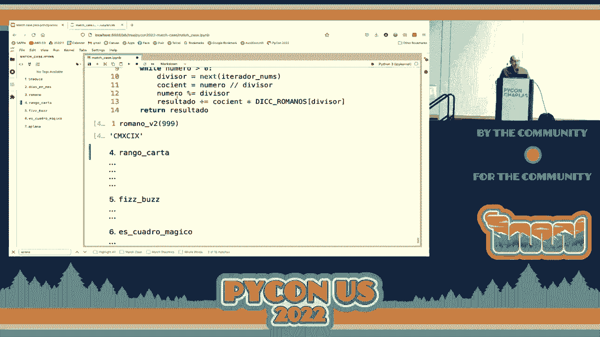
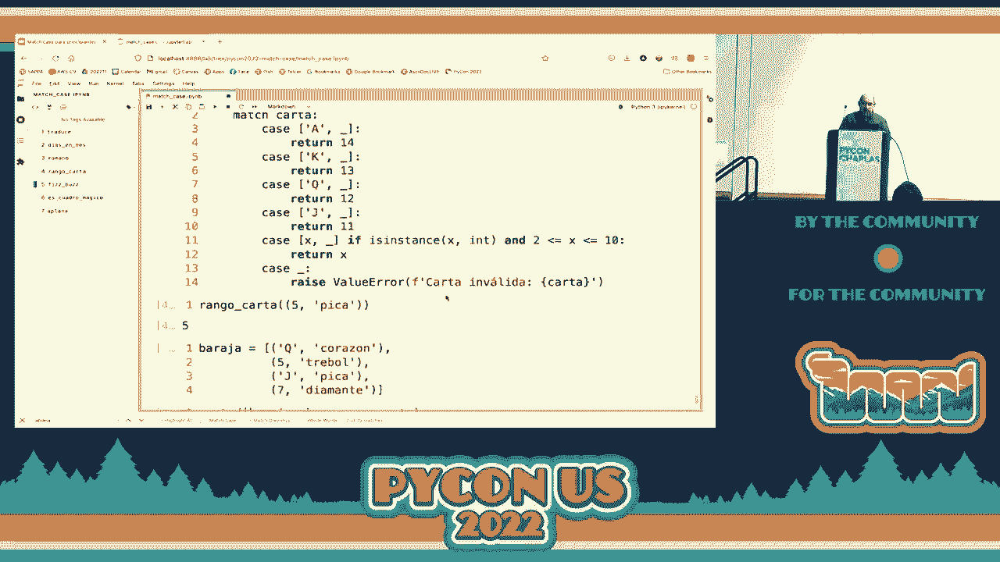
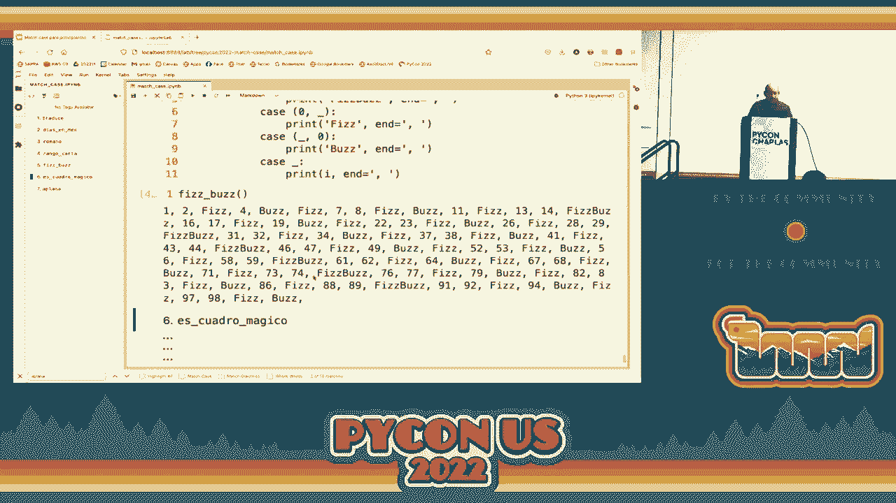
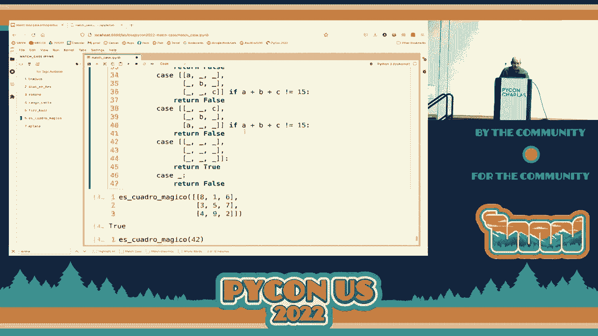

# 001：初学者的模式匹配 🧩


在本节课中，我们将要学习编程中一个非常基础但强大的概念：**模式匹配**。我们将通过简单的例子，理解它如何帮助我们更清晰、更安全地处理数据。

模式匹配就像是一个智能的“条件分发器”。它允许我们检查一个数据的结构，并根据其不同的“形态”来执行相应的代码。这比写一连串复杂的 `if-else` 语句要简洁和直观得多。


## 什么是模式匹配？🤔

上一节我们提到了模式匹配的概念，本节中我们来看看它的具体形式。


简单来说，模式匹配包含两个核心部分：一个待匹配的**表达式**，以及一个或多个**匹配分支**。每个分支由一个**模式**和与之关联的**代码**组成。系统会按顺序尝试将表达式与每个模式进行匹配，第一个匹配成功的分支，其代码将被执行。

其核心逻辑可以用以下伪代码描述：
```
match (expression) {
    pattern1 -> code_block1
    pattern2 -> code_block2
    ...
    _ -> default_code_block
}
```
其中，下划线 `_` 是一个通配符模式，可以匹配任何值，通常用作默认情况。



## 一个简单的例子：处理订单状态


让我们通过一个处理网上订单状态的例子来理解模式匹配。假设一个订单可能有几种状态：等待支付、已发货、已送达。

如果不使用模式匹配，我们可能会写很多 `if-else` 语句。而使用模式匹配，代码会变得非常清晰。



以下是使用模式匹配的代码示例：
```python
# 假设我们用字符串表示状态
order_status = "已发货"


match order_status:
    case "等待支付":
        print("请尽快完成支付。")
    case "已发货":
        print("商品已在途中，请注意查收。")
    case "已送达":
        print("感谢您的购买，期待再次光临！")
    case _:
        print("未知订单状态。")
```
运行这段代码，因为 `order_status` 是 `"已发货"`，所以会输出：`商品已在途中，请注意查收。`。



## 模式匹配的优势 ✨


通过上面的例子，我们可以看到模式匹配的一些优点。接下来，我们系统地总结一下。

以下是模式匹配带来的主要好处：
1.  **清晰直观**：代码结构直接反映了数据的可能形态，易于阅读和理解。
2.  **安全性**：编译器或解释器可以检查我们是否处理了所有可能的情况，避免遗漏。
3.  **简洁性**：避免了深层嵌套的 `if-else` 语句，让代码更扁平。
4.  **解构能力**：可以同时匹配并提取复杂数据（如元组、列表、对象）内部的部分值。




## 更强大的匹配：解构数据


上一节我们看到了基础匹配，本节中我们来看看模式匹配更强大的功能：**解构**。


解构允许我们在匹配的同时，将数据内部的值提取出来使用。例如，我们有一个表示坐标的点 `(x, y)`。

以下是解构匹配的示例：
```python
point = (3, 5)

match point:
    case (0, 0):
        print("点在原点")
    case (x, 0):
        print(f"点在X轴上，X坐标为 {x}")
    case (0, y):
        print(f"点在Y轴上，Y坐标为 {y}")
    case (x, y):
        print(f"点在位置 ({x}, {y})")
    case _:
        print("不是一个有效的点")
```
在这个例子中，`(x, y)` 这个模式不仅匹配了 `point`，还把元组里的第一个值赋给了变量 `x`，第二个值赋给了 `y`，让我们可以在对应的代码块中直接使用它们。

## 总结


本节课中我们一起学习了**模式匹配**这一核心概念。
我们了解到，模式匹配是一种根据数据的结构来执行不同代码逻辑的强大工具。它通过 `match-case` 语句实现，比传统的条件判断更清晰、更安全。我们从简单的值匹配开始，进而学习了如何解构元组等复杂数据，从中提取所需的值。掌握模式匹配，能让你的代码更加简洁和健壮。