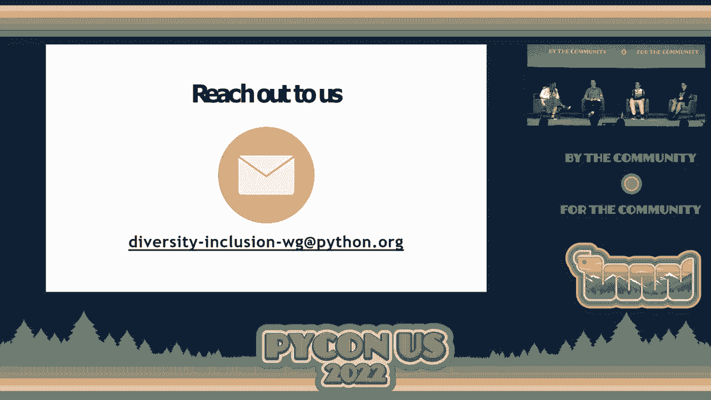

# 004：多样性与包容性工作组 🧑‍🤝‍🧑

在本节课中，我们将学习Python软件基金会（PSF）下属的“多样性与包容性工作组”的成立背景、目标、已取得的进展以及社区成员可以参与贡献的方式。我们将通过具体数据和实例，了解PSF在推动全球Python社区多样性与包容性方面所做的努力。

---

## 小组成员介绍

本次讨论的小组成员包括：
*   **Lorena Mesa**：Python软件基金会现任主席。
*   **Anthony Shaw**：来自澳大利亚的PSF会员。
*   **Reuben Lerner**：Python培训师。
*   **Georgie Kerr**：PSF社区成员。

---

## 工作组的成立与目标

上一节我们介绍了小组成员，本节中我们来看看这个工作组的由来。

多样性与包容性工作组于2020年11月成立，由Marlene领导，目前共有20名全球成员。工作组的目标是解决PSF及全球Python社区在代表性和参与度上面临的挑战。

---

## 问题的显现：2020年PSF董事会选举

那么，是什么问题促使了这个工作组的成立呢？让我们回顾一下2020年的PSF董事会选举情况。

2020年，PSF董事会有四个席位空缺。我们收到了26份提名，其地理分布如下：
*   北美：9份
*   南美：4份
*   欧洲：2份
*   非洲：6份
*   亚洲：5份

然而，选举结束后，所有四个当选席位都来自美国。更值得注意的是，在1151名有投票资格的成员中，只有**1%**（约40人）参与了投票。

---

## 进展与变化：2021年的情况

在了解了2020年的问题后，我们来看看2021年发生了哪些变化。

2021年，有三个董事会席位空缺，我们收到了19份提名。这次选举的结果体现了更多的地理多样性：一位来自南美，一位来自非洲，一位来自欧洲。尽管有七份提名来自亚洲，但仍未有亚洲成员当选。

在参与度方面，有1538名成员有资格投票，投票率提升至**39%**。此外，我们的文档在志愿者的帮助下被翻译成了10种语言，西班牙语翻译于2021年1月完成。

同时，数据显示全球Python开发者数量从820万增长到1010万，其中亚洲是开发者增长的主导市场。

---

## 核心挑战与讨论

基于以上事实，我们不禁要问：PSF在代表性和包容性上面临的核心挑战是什么？

PSF的使命是帮助建立一个与用户一样包容和多样化的社区。然而，董事会历史上对北美和欧洲人员存在偏见。随着全球Pythonista数量的增长，我们可能未能充分接触到全球社区面临的多样化问题。

一个关键点是，身处特定社区中的人最能阐述他们面临的独特挑战。因此，确保这些声音被听到至关重要。

---

## 扩大核心开发者的多样性

除了董事会代表性问题，另一个挑战是核心开发者群体的多样性。目前，主要的核心开发者仍多来自美国。

这并不意味着专业技能只存在于美国。全球各地都有极具才华的开发者。我们需要思考如何吸引和培养来自不同地区的核心开发者。

**指导（Mentorship）** 已被证明是培养新核心开发者的有效方式。现有核心开发者指导新人，已经成功帮助来自非洲和亚洲的新开发者融入。

然而，也存在一些障碍，例如“认识谁”的问题，以及许多开发者可能感到“能力不足”，不敢贡献。我们需要建立机制来发现、鼓励并支持这些潜在的贡献者。

---

## 提升社区认知与参与度

那么，我们如何能接触到更广泛的潜在贡献者呢？一个大问题是许多人对开源社区和PSF的认知不足。

很多人将开源软件简单地等同于“免费”，而没有意识到背后存在一个可以参与并施加影响的**社区（Community）**。因此，首要任务是更好地告知全球开发者：PSF是存在的，Python社区是活跃的，并且你可以通过代码、文档、翻译、教学等多种方式积极参与并影响其发展方向。

---

## 你可以如何提供帮助

在讨论了挑战之后，以下是你可以采取的四种具体行动来提供帮助：

1.  **提供反馈**：扫描现场二维码（或通过其他渠道）填写问卷，分享你对于PSF如何更好地实现全球代表性和帮助社区成长的看法。
2.  **注册成为PSF会员**：如果你还不是会员，请访问 `psf.org` 进行注册。
3.  **行使投票权**：如果你已经是PSF会员，请在每年的董事会选举中积极投票。
4.  **提名社区服务奖（CSA）**：如果你知道某个人或组织在Python社区中做出了杰出贡献，请写信给PSF提名他们。这是一个认可和鼓励社区工作的重要方式。

---

## 包容性的力量：一个社区故事

最后，让我们思考一下包容性的真正含义。有人这样描述：**多样性是被邀请参加派对，包容性是被邀请跳舞。**

工作组的项目源于我们作为一个社区所共同关心的事情。正如Brett Cannon所说：“我为语言而来，我为社区而留。”

一个生动的例子是Marlene（来自津巴布韦的PSF董事）。她通过教育年轻女性、参与Python Africa社区建设等工作，为Python社区带来了不可或缺的独特视角。她的故事始于社区成员间的相互认可和支持。这种支持可以是简单的鼓励，也可以是更正式的提名，但它能成为持续建设和扩大包容性社区的关键一步。

---

## 总结与呼吁

本节课中，我们一起学习了PSF多样性与包容性工作组的背景、目标以及面临的挑战。我们看到了PSF在提升全球代表性和参与度方面取得的进展，也认识到仍有很长的路要走。

**Python社区的活力依赖于每一个人的贡献**，无论大小。如果你在会议中或线上看到为社区做出贡献的人，请告诉他们，感谢他们。这种认可能鼓励更多人加入。

如果你有任何问题或想法，欢迎随时联系工作组的任何成员。请记住：注册、投票、提名、反馈。让我们共同努力，建设一个真正反映全球Python用户多样性的、可持续发展的包容性社区。

谢谢。

[掌声]