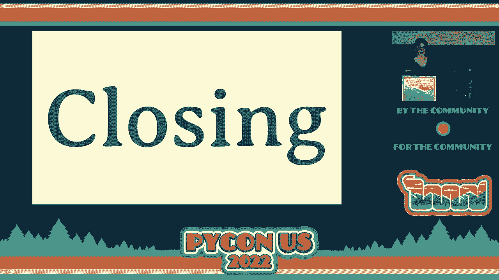
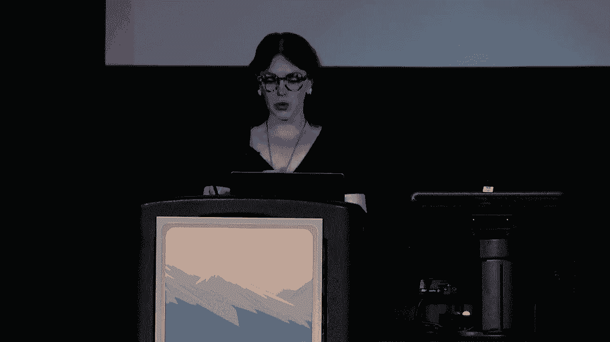
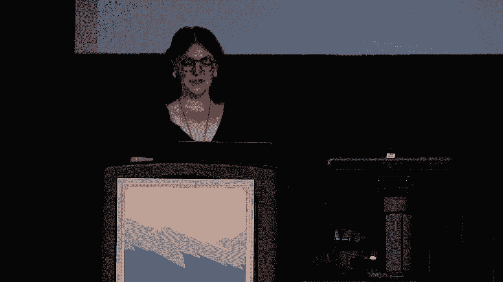
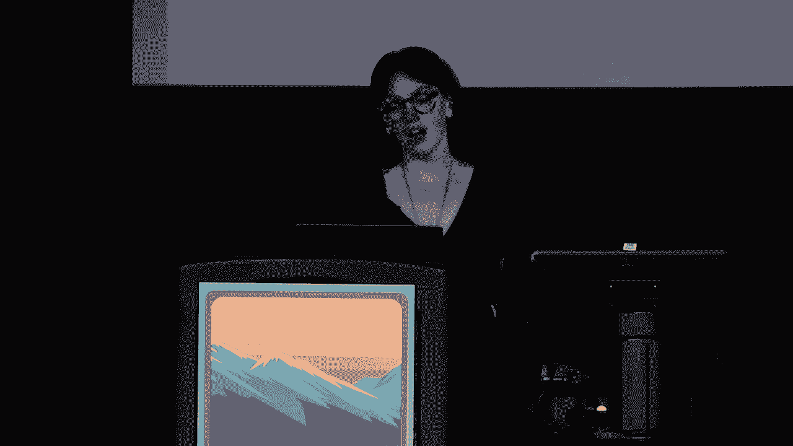
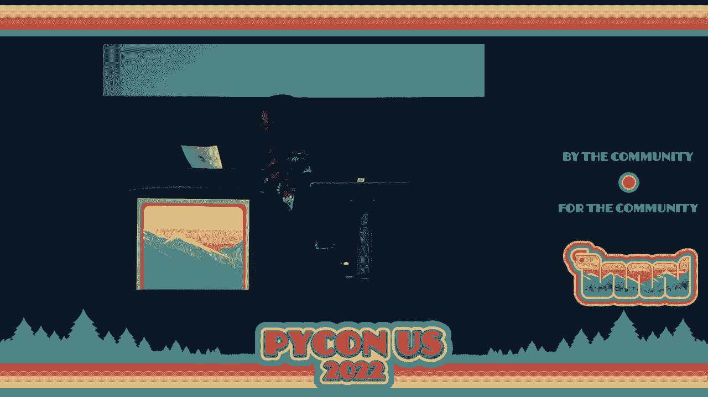
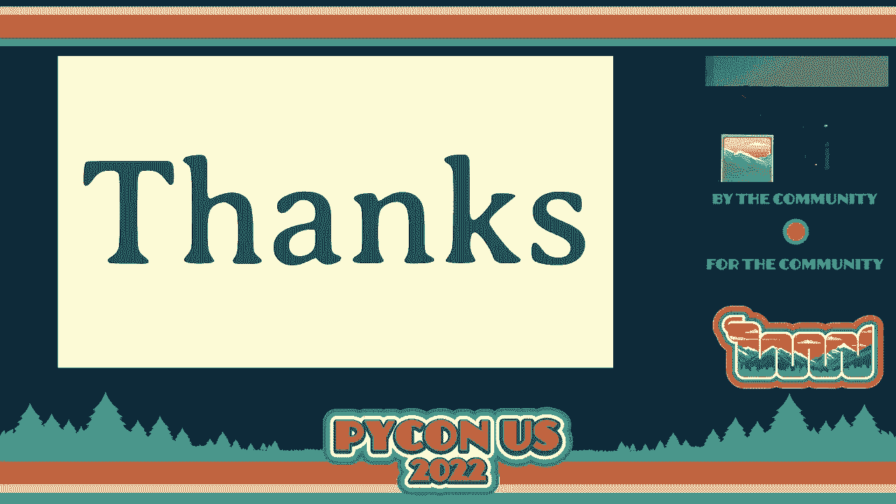
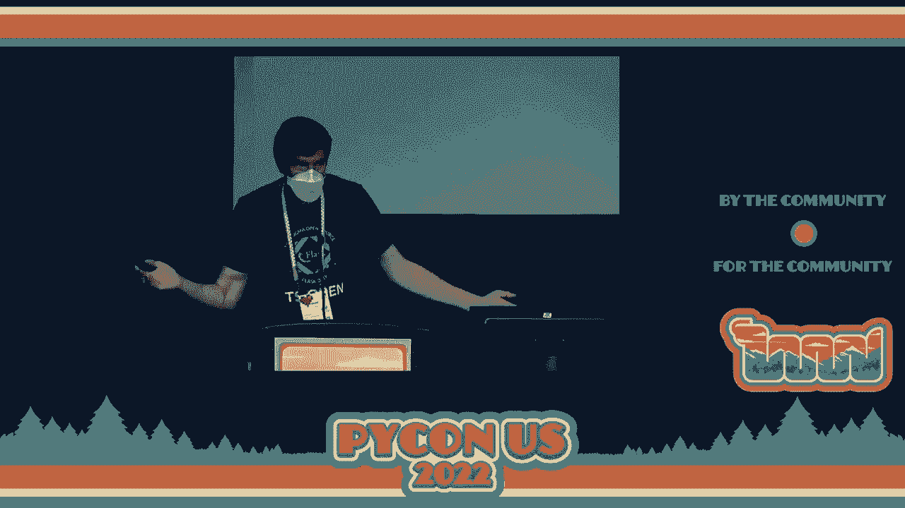

# 005：主题演讲 - 结束

在本节课中，我们将学习 PyCon US 2022 闭幕式的主要内容，包括会议总结、社区数据、未来展望以及最重要的环节——开源项目冲刺的介绍。我们将了解如何参与这些项目，为开源社区做出贡献。

---

## 会议总结与社区数据

PyCon US 2022 即将结束，但仍有重要活动安排。

我们的最后一个活动是**开源冲刺**。该活动将在 250 和 251 号房间举行，所有 PyCon US 注册者均可免费参加。请注意，这仍是 PyCon US 的重要活动，所有健康和安全指南依然适用。

活动期间将提供咖啡和午餐。更多信息请查看 [PyCon 官网](https://pycon.us/sprints)。活动结束后，我们将进行一个简短的介绍环节，展示所有可参与的项目。无需额外注册。介绍环节将在本活动结束后通过幻灯片展示。

为了让无法全程参与或晚到的朋友也能了解，如果你有兴趣展示自己的项目，请在舞台旁排队。五到十分钟后，我们将开始冲刺介绍。

同时，请注意会议中心各处设有垃圾桶，例如盐罐旁的主入口处。如果你不希望保留参会吊牌作为纪念，可以将其交回。这些吊牌将被当地艺术家集体回收并创作成艺术品。

接下来，我们回顾一下昨晚的 **PyLadies 慈善拍卖**。最终我们不得不从幻灯片中移除一些年份的数据，因为增长实在惊人。

昨晚我们为 PyLadies 筹集了 **$40,000**。然而，这个数字并不完全准确。当我们总计所有捐款、拍卖出价、门票、钥匙扣和 T 恤销售收入，以及额外的匹配捐款后，**总金额达到了 $53,267**。

我们由衷感谢会计部门的 Phyllis 和 Joe，他们负责了所有的款项计算和处理工作。

另一个令人印象深刻的数据是今年的参会人数。我们知道今年是线下活动缓慢恢复的一年。今年我们有 **655 名**活跃的在线参与者（实际登录系统的人），以及 **747 名**领取证件的现场参与者。

在这些与会者中，**389 名**在线参与者和 **1,149 名**现场参与者是首次参加 PyCon US。这意味着今年 **64%** 的与会者都是新朋友。

这充分证明了我们社区的吸引力。对于从未参加过 PyCon 的人来说，大家参与的热情是如此高涨。我们社区的氛围如此强大，以至于我们能像以往每届大会一样，欢迎如此多的新成员加入，并成功举办活动。

时光飞逝，大会即将结束，这令人感触颇深。

---

## 社区的力量与未来展望

在会议开始时，我看到一条推文（可惜找不到确切来源），来自一位首次参会者。他表示，在参加 PyCon 的头几个小时内，就对追求编程和职业方向感到更加坚定和自信。

我们的影响力有时远超自己的想象。我个人在与大家共度五天后，也感到动力十足、焕然一新。我们有时会困在自己的小圈子里，居家工作或仅进行数字互动。

Python 语言及其应用的广度和深度令人惊叹。然而，正如 Peter 在主题演讲中指出的，我们仍有巨大的拓展空间。这很惊人，因为我们已经取得了如此多的成就。

我感谢大家继续推进这项事业，继续为我们的社区做出贡献并共同成长。我无比感激大家在过去三年中让我担任你们的主席。

我的一位作家曾说：“我没有什么是原创的，我是我所认识的每一个人的共同努力。”感谢你们在 PyCon 上给予我机会，并持续给予他人超越自己所获的支持。我知道，没有你们每一个人，PyCon 不会是现在的样子，你们独特的视角也在与我们每一个人分享。

现在，在我的最后一项行动中，我想向大家介绍 **2023 至 2024 年的新任主席——Mariatta**。

---

## 新任主席致辞与未来会议信息

大家好，我是 Mariatta。很高兴在这里与大家见面。

我知道现在大家都有些情绪激动。这一周对我来说几乎也是完整的，我相信你们也有同感。我并不感到悲伤，因为我知道明年我们会在这里再次相见。

对于线上参会的朋友们，我真心希望你们明年能亲自加入我们。如果无法实现，我们仍会提供线上直播选项。我甚至在推特上看到有人仅通过 `#PyConUS2022` 标签就参与了大会，因为大家都在用这个标签进行直播，这太棒了。

我想请大家告诉你的朋友和同事关于 PyCon 的一切。告诉他们你在这里度过了多么精彩的时光，学到了多少东西，遇到了多少人。这样，他们明年才能亲自来体验这一切。

PyCon US 只是全球众多 PyCon 会议中的一个。事实上，如果你访问 `pycon.org`，可以看到全球各地的 PyCon 会议列表。

我收集了从现在到下一个 PyCon US 之间即将举行的地区性 PyCon 会议列表。实际上，几乎每个月都有不止一个会议。如果你住在这些地区，请去参加。如果不住，那也是一个很好的旅行机会。

所以，在参加完所有这些 PyCon 会议之后，我将在 **2023年4月19日**（不到一年后）在 **盐湖城** 与大家再见。之后，**2024年和2025年**的大会将移师 **匹兹堡**。

---

## 致谢志愿者

现在，让我们花一点时间来认可让本届 PyCon 得以实现的志愿者们。PyCon 是一个由社区运营的活动。因此，我真心希望我们能认可他们的贡献。

接下来，我将开始点名各个团队。如果你听到你所属的团队名称，请站起来并保持站立。我希望大家都能环顾四周，以便我们能为他们鼓掌致谢。

以下是需要感谢的团队列表：

*   PyCon 团队
*   PSF 成员
*   多样性与外联主席
*   程序委员会主席和评审
*   教程委员会和评审
*   讲座委员会和评审
*   闪电演讲组织者
*   旅行资助团队
*   休息室工作人员
*   屏幕协调员
*   开放空间团队
*   PyLadies 慈善拍卖组织者
*   教育峰会组织者和团队
*   语言峰会主席
*   维护者峰会组织者
*   导师、屏幕组织者
*   打包峰会组织者
*   类型峰会组织者
*   PyCon 新手组织者
*   启动行组织者和选定团队
*   字幕团队
*   音频和视频技术团队
*   新的相机定位团队
*   所有主题演讲者
*   多样性与包容性小组成员
*   指导委员会成员
*   所有演讲者、教程讲师、海报展示者
*   各峰会演讲者
*   所有现场志愿者、会议主持人、会议主席
*   拍卖会物品管理人员
*   登记信息台工作人员
*   “问我”徽章佩戴者

感谢你们的到来，感谢你们的付出。

明年盐湖城再见！

---

## 开源冲刺项目介绍

别急着离开！如果你明天要参加冲刺，或者你是项目维护者，请出来排队，介绍你的项目。维护者们将介绍他们正在做的事情，以便贡献者了解明天可以参与哪些项目。

每个项目介绍最多一分钟，类似于极限闪电演讲。请在介绍时告诉人们可以做什么，以及可能需要预先了解什么。如果你听到感兴趣的项目，可以在演讲者下台后与他们交流。你也可以在之前开放空间白板所在的走廊外找到冲刺项目板。

以下是一些即将进行冲刺的项目介绍：

*   **David Lord**：我将为所有项目冲刺，专注于研究新老贡献者可能遇到的问题，包括异步、自定义和自动化等。我将于早上8点开始，并提供甜甜圈。欢迎加入，为闪电演讲和调色板等项目做贡献。
*   **Christopher**：我们正在参与 **Pants** 构建系统及其维护的 **PEX** 项目。我们将有一系列适合初学者的任务。如果你有兴趣将你的代码库迁移到 Pants，我们也非常欢迎。
*   **Patrick**：我将专注于 **Channels** 库（基于 Django）。我们有很多适合初学者的问题，也欢迎处理文档。我们还与 FastAPI、Flask 等框架集成。
*   **（未具名）**：我正在开发 **Semgrep** 代码搜索工具。如果你想编写一个 linter 规则，我们可以在 5-10 分钟内将其写成一个半自动化规则。
*   **Nick Rinehart**：来自国家可再生能源实验室。我们最近发布了 **Partridge** 匹配代码包。我们将专注于使其更好、更健壮，涉及文档、新功能、测试等。
*   **Eric Matthes**：我将致力于 **Django 简单部署** 项目，目标是帮助初学者通过简单命令将项目部署到 Heroku 或 Azure 等平台。
*   **（未具名）**：我们将专注于 **Pyodide**（在浏览器中运行 Python）。目标是改进 Pyodide，使其更易于设计应用。你也可以为 CPython 的 WebAssembly 上游工作做贡献。
*   **Zach**：我是 **Hypothesis** 测试库的维护者。它可以为你编写测试并生成测试数据。明天我将冲刺一些优化新功能和 bug 修复。我有贴纸和搪瓷针作为贡献奖励。
*   **Eric**：来自 **Pyjanitor** 项目。这是一个数据清理函数库，与 Pandas 兼容。明天主要冲刺文档，但也欢迎贡献新的数据清理函数想法。该项目对初学者极其友好。
*   **Matt Wysniski**：我是 **Memray** 内存分析器的维护者之一。它可以跟踪 Python 和本地应用的内存使用。最有帮助的是有人尝试使用它并反馈文档问题或 bug。
*   **（未具名）**：明天将对 **Cloud Custodian**（云资源规则引擎）进行冲刺。如果你有兴趣评估云资源是否符合策略，或想熟悉项目、探索文档，欢迎加入。
*   **Cattney**：我将对 **CircuitPython**（运行在微控制器上的 Python）进行冲刺。我们有可用硬件，欢迎对库或核心进行贡献。
*   **Darata**：来自麻省理工学院。我正在研究 **Pagoda** 数据流引擎。这是一个小项目，我将致力于添加数据、支持计划任务等。
*   **Lauren**：我在 Meta 工作，我们正在进行 **Cinder**（Python 的优化版本）的开发。我们将查看一些具体的 Python 优化，并努力将部分工作推送到上游。

感谢所有的维护者！也感谢所有坐在观众席的未来贡献者们。祝大家晚上愉快，明天早上再见！

感谢 PSF 和所有组织者。再见。

---

本节课中，我们一起学习了 PyCon US 2022 闭幕式的核心内容：从大会总结、令人振奋的社区数据，到对无私奉献的志愿者的感谢，再到对新任主席和未来会议的展望。最重要的部分是详细介绍了多个即将开展冲刺的开源项目，为初学者和资深开发者提供了清晰的参与路径。这充分体现了 PyCon 社区“共建共享”的精神。