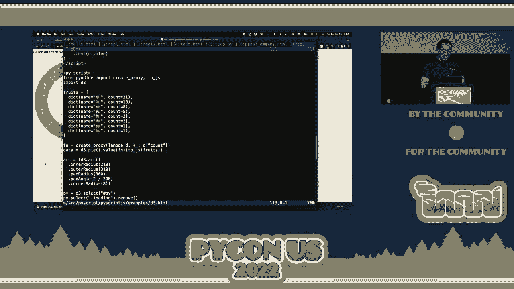
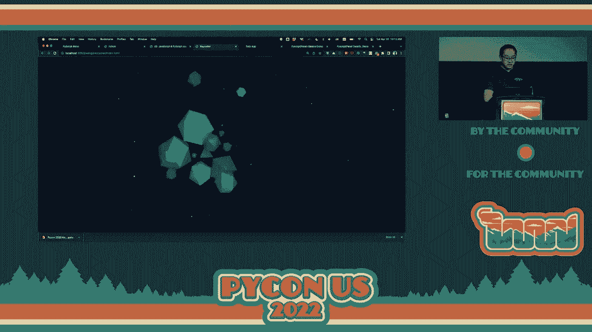
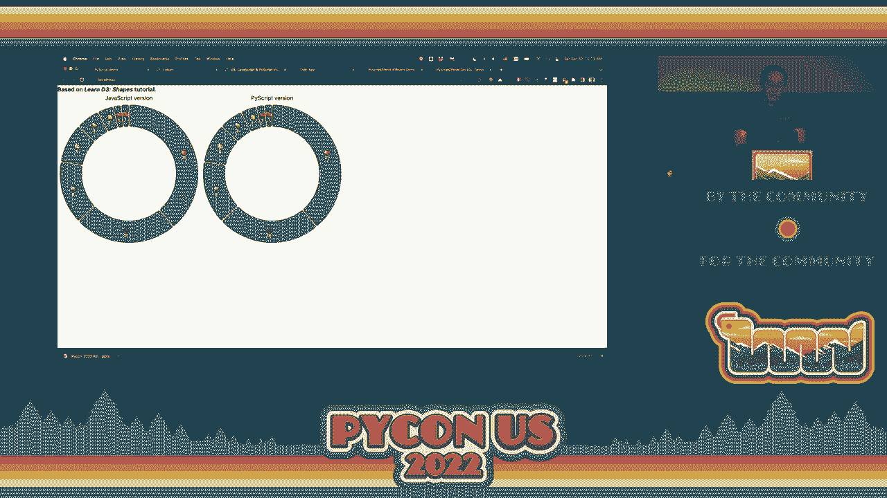
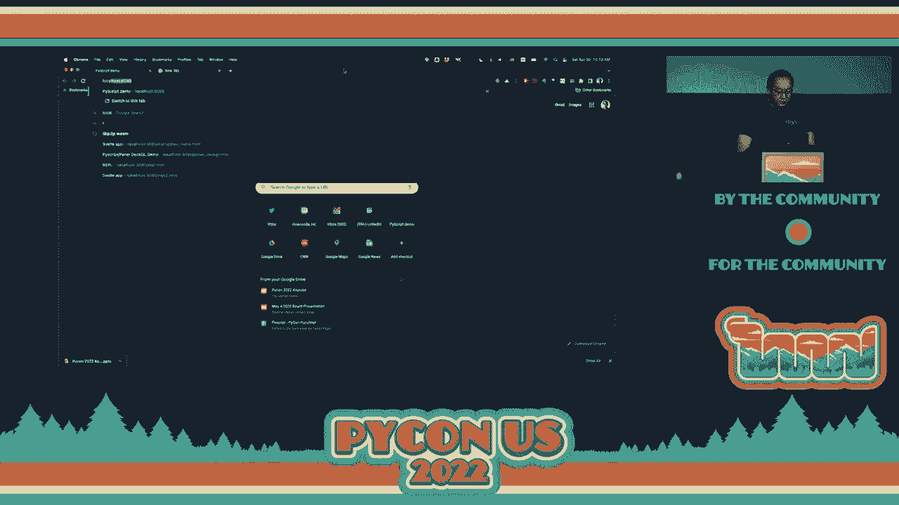
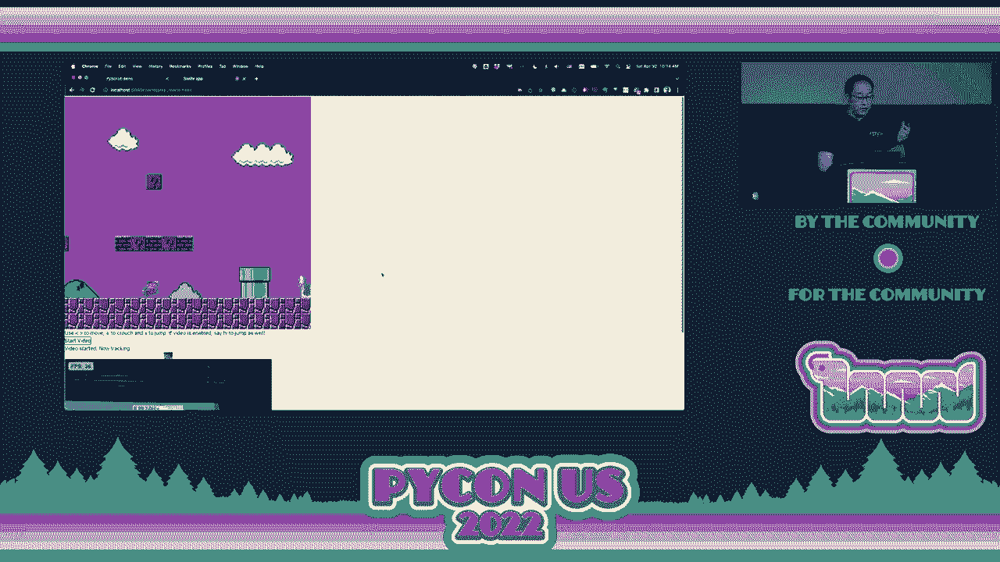
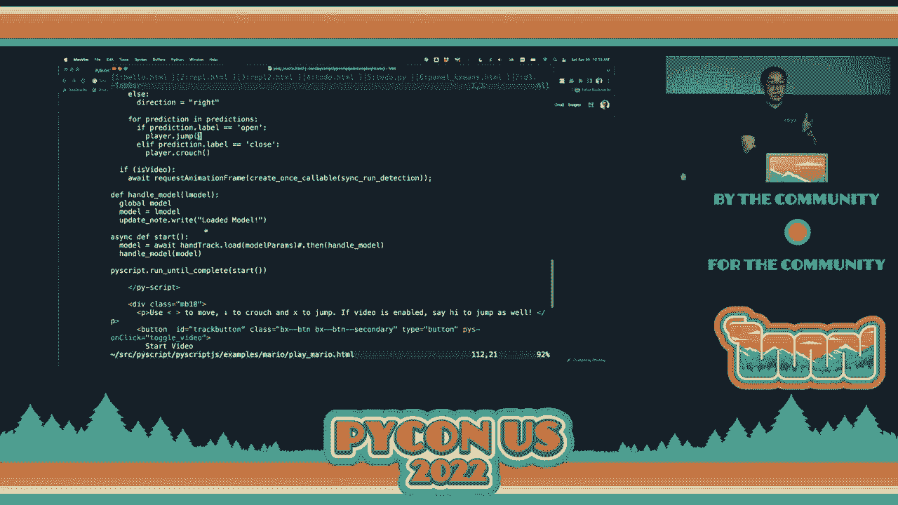
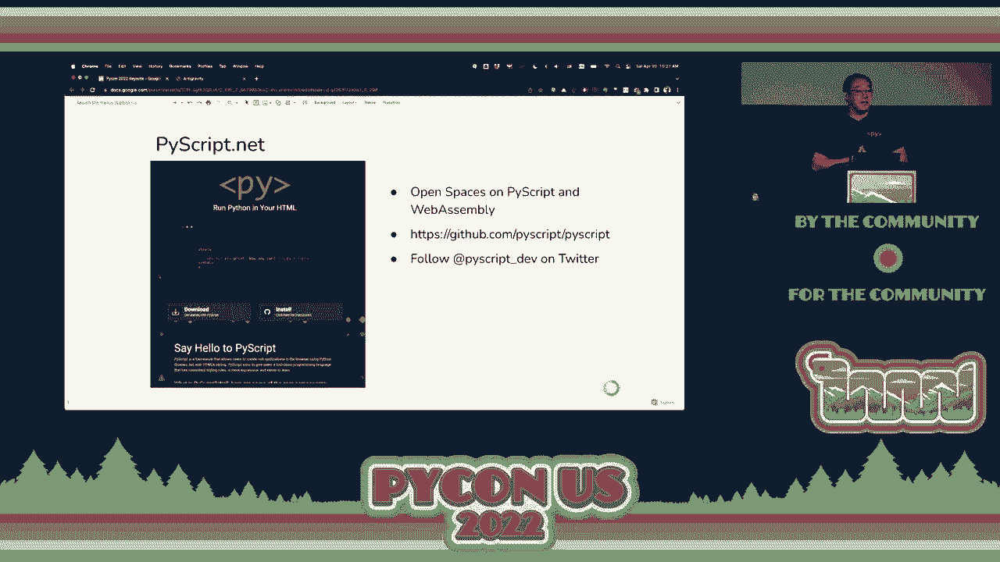

# 008：PyScript的愿景与实践


在本节课中，我们将学习Anaconda CEO Peter Wang在PyCon上的主题演讲。演讲的核心是探讨Python的现状、面临的挑战，并介绍一个名为PyScript的革命性项目。该项目旨在让Python代码直接在浏览器中运行，从而极大地降低编程门槛，实现“为每个人编程”的愿景。

## 概述：Python的现状与挑战

Python因其简洁、易读和强大的生态系统，已成为数据科学、教育和脚本编写等领域最受欢迎的语言之一。然而，尽管它取得了巨大成功，但在某些方面仍面临挑战。

上一节我们介绍了Python的流行地位，本节中我们来看看它面临的具体问题。

以下是Python当前面临的两个主要挑战：

1.  **打包与依赖管理**：Python拥有超过10万个库，但让这些库协同工作非常困难。现有的解决方案往往只能解决80%的问题，这意味着用户有20%的时间会遭遇不愉快的体验。
2.  **构建用户界面与分发应用**：作为世界上最流行的编程语言之一，Python却难以轻松构建具有用户界面的应用程序（如iOS应用、Windows桌面应用）。即使构建带有网页前端的应用，开发者也需要额外学习JavaScript、CSS和HTML。这使得分享和分发Python工作成果变得复杂。

## 核心理念：将Python从传统架构中解放出来

Python的成功部分源于它作为“胶水语言”的能力，能够粘合各种用C/C++等语言编写的底层库和系统。然而，这也意味着Python被束缚在几十年前设计的计算架构（如C语言、Unix进程模型）中。

为了触及更广泛的用户，我们需要让Python去人们所在的地方。如今，浏览器赢得了“操作系统之战”，而JavaScript因其是浏览器的原生语言而占据主导地位。因此，关键问题在于：**我们能否让Python在浏览器中本地运行？**

答案是肯定的，这要归功于 **WebAssembly**。

## 关键技术：WebAssembly简介

WebAssembly（简称Wasm）是一种为Web设计的、可移植的二进制指令格式。它允许用C/C++、Rust等语言编写的代码以接近原生的速度在浏览器中运行。

对于Python而言，这意味着：
*   CPython解释器本身是一个C程序。
*   NumPy、SciPy等核心科学计算栈也主要由C/C++编写。
*   因此，整个Python生态系统可以被编译成WebAssembly模块，从而在浏览器中运行。

近年来，Pyodide等项目已经成功将Python数据科学栈的大部分编译为WebAssembly。现在，官方CPython也即将把WebAssembly作为第二层支持的平台。

## 核心项目：PyScript是什么？

基于WebAssembly的能力，Anaconda团队创建了**PyScript**。PyScript是一个框架，允许开发者在HTML中直接嵌入Python代码，并使其在浏览器中完全运行。

它的核心思想非常简单：**在HTML文件中使用 `<py-script>` 标签来编写Python逻辑。**

以下是一个最基础的PyScript示例，它展示了如何在HTML中混合Python与JavaScript来操作网页内容：

```html
<!DOCTYPE html>
<html lang="en">
<head>
    <link rel="stylesheet" href="https://pyscript.net/alpha/pyscript.css" />
    <script defer src="https://pyscript.net/alpha/pyscript.js"></script>
</head>
<body>
    <div id="output"></div>
    <py-script>
        from js import document
        import asyncio

        output_div = document.getElementById("output")
        while True:
            output_div.innerHTML = "Hello, PyScript! 🌟"
            await asyncio.sleep(1)
            output_div.innerHTML = ""
            await asyncio.sleep(0.5)
    </py-script>
</body>
</html>
```

**代码解释**：
1.  我们引入了PyScript的CSS和JS文件。
2.  在HTML中定义了一个 `id` 为 `“output”` 的 `div` 容器。
3.  在 `<py-script>` 标签内，我们编写Python代码。
4.  通过 `from js import document`，我们可以直接访问浏览器的文档对象模型。
5.  代码实现了一个简单的闪烁文本效果，通过循环修改 `output` div的内容来实现。

将上述代码保存为 `.html` 文件，用浏览器打开即可看到效果，**无需安装Python或任何服务器**。

## PyScript的能力与演示



上一节我们看到了一个简单的“Hello World”示例，本节中我们来看看PyScript更强大的应用场景。





### 1. 交互式REPL（读取-求值-输出循环）



PyScript可以创建一个在浏览器中运行的Python交互式环境，类似于Jupyter Notebook的单个单元格，但完全在客户端运行。



### 2. 构建完整的Web应用



你可以用PyScript构建像“待办事项列表”这样的完整应用。所有应用逻辑（添加任务、标记完成）都用Python编写，并直接操作HTML DOM。这消除了传统Web开发中前后端分离的复杂性。

### 3. 运行复杂的数据科学栈

这是PyScript最激动人心的部分。由于Pyodide的支持，你可以在浏览器中直接导入和使用 **NumPy、Pandas、Scikit-learn、Matplotlib** 等库。

**示例概念**：你可以在一个HTML文件中加载纽约出租车数据集，使用Pandas进行数据筛选，用Scikit-learn运行一个简单的聚类算法，并用Matplotlib或基于JavaScript的Deck.gl库进行可视化呈现。所有计算和渲染都在用户的浏览器中完成，你只需分享这个HTML文件。

**优势**：
*   **零安装**：用户无需安装Python或任何包。
*   **易于分享**：应用就是一个HTML文件，可以通过邮件、网盘或USB驱动器分享。
*   **隐私保护**：敏感数据可以在客户端处理，无需上传到服务器。
*   **利用现有生态**：可以直接调用丰富的JavaScript可视化库（如D3.js, Deck.gl）。

## 愿景与未来：为下一亿Python开发者铺路

Peter Wang在演讲中提出了一个深刻的问题：世界上有多少软件开发者？数据表明，这个数字大约在2500万左右，不到全球人口的0.3%。而精通数据科学和AI的人则更少。

这种现状并不理想。我们创造技术，最终是为了服务所有人。PyScript的愿景就是**极大地降低编程和计算的门槛**。

想象一下：
*   一个学生可以在图书馆的公共电脑上，打开浏览器就开始学习Python和数据科学。
*   一位研究人员可以将其分析模型打包成一个交互式的HTML文件，直接发送给合作者审阅。
*   任何有创意的人都可以快速构建一个有趣的小工具并与世界分享，无需担心复杂的部署问题。

PyScript的目标是让网络重新成为一个“可黑客的”、友好的地方，激发每个人的创造力，将编程的快乐带给更广泛的人群。

## 总结

本节课中我们一起学习了Peter Wang关于Python未来和PyScript项目的分享。我们回顾了Python的成就与挑战，认识了**WebAssembly**这项让Python在浏览器中运行的关键技术，并深入了解了**PyScript**框架如何通过将Python代码嵌入HTML，实现真正的“无服务器”客户端计算。




PyScript目前仍处于早期阶段，但它代表了一个强大的愿景：**通过降低技术门槛，让编程和教育更加民主化，从而赋能下一个一亿Python开发者**。这不仅仅是关于一门语言或一个工具，更是关于如何利用技术促进计算素养，塑造一个更加开放和创新的未来。