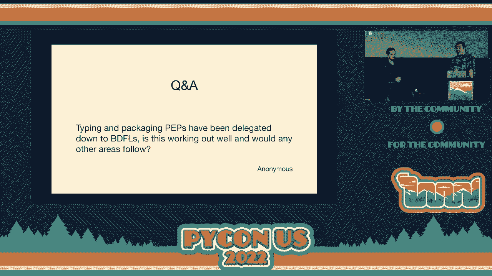

# 011：主题演讲 🎤


在本节课中，我们将学习Python指导委员会（Steering Council）的职责、工作方式，以及Python 3.11版本的一些重要新特性。我们将跟随一次主题演讲的内容，了解Python语言治理的幕后故事和技术发展的最新动态。

---

## 指导委员会简介

上一节我们介绍了课程概述，本节中我们来看看什么是Python指导委员会。

Python指导委员会根据PEP 13（Python增强提案第13号）定义，负责Python编程语言和CPython解释器的技术方向。它取代了之前的“终身仁慈独裁者”（BDFL）Guido van Rossum，后者于2019年退休。

指导委员会的核心原则是通过共识进行治理，而非专制控制。他们倾听核心开发者与社区的声音，并在此基础上做出决策。此外，委员会还负责促进社区与核心开发者之间的协作，确保志愿者能够顺利开展工作。

指导委员会也对Python增强提案（PEP）拥有最终决定权，尽管他们会将部分提案委托给更有相关经验或知识的个人进行评审。

---

## 日常工作与结构

上一节我们介绍了指导委员会的职责，本节中我们来看看他们的日常运作和人员构成。

指导委员会每周举行一次时长约一个半小时的会议，讨论各类事务并进行决策。成员们还需要在会议之外处理邮件沟通和准备工作。

需要明确的是，指导委员会与Python软件基金会（PSF）是分开的。指导委员会专注于语言的技术方向，而PSF则负责社区建设、筹款、举办会议（如本次PyCon）以及维护`pip`等基础设施。两者虽有重叠，但职能不同。

以下是指导委员会的一些运作细节：
*   指导委员会每月会在GitHub和`discuss.python.org`上发布工作更新。
*   公众可以通过`steering.council@python.org`邮箱联系他们。
*   委员会遵循利益冲突政策，例如，来自同一公司的成员不得超过两人。

目前委员会由五名成员组成，他们都是核心开发者，拥有丰富的经验，但成员背景的多样性（例如，均为在科技公司工作的男性）仍有改进空间。委员会希望未来能有非核心开发者加入，以带来更多元的视角。

---

## 年度工作亮点

上一节我们了解了指导委员会的日常，本节中我们来看看过去一年中的几项重要工作成果。

以下是过去一年的主要工作亮点：

1.  **迁移至GitHub Issues**：长期使用的`bugs.python.org`（基于Roundup）已完全迁移至GitHub Issues。这项工作历时多年，最终在社区贡献者和GitHub的支持下完成。所有历史问题和数据都已迁移，新的问题必须在GitHub上创建，这有助于利用GitHub的生态和社区知识。
2.  **聘请驻场开发者**：在谷歌的资助下，PSF聘请了长期核心开发者Łukasz Langa作为首位驻场开发者，全职投入CPython的开发工作。他的工作包括处理GitHub问题、审核拉取请求、指导贡献者等，显著提升了项目效率。Meta已承诺为下一年的该职位提供资金。
3.  **加速CPython**：多个团队和项目致力于提升Python的执行速度，例如微软的“Faster CPython”团队、Instagram的Cinder项目以及Sam Gross提出的移除全局解释器锁（GIL）的提案等。这些努力已经在Python 3.11中带来了显著的性能提升。

---

## Python 3.11 新特性预览 🚀

上一节我们回顾了年度工作，本节中我们将重点预览即将发布的Python 3.11版本带来的激动人心的新特性。

### 更快的CPython

Python 3.11在性能上取得了重大进展。根据官方基准测试，平均加速比约为25%。但实际效果取决于你的代码类型，例如面向对象代码会获得显著提升。

### 更清晰的错误信息

错误信息得到了持续改进。例如，对于某些语法错误，提示信息会更加明确。这是一个由社区积极贡献的领域。

### 更精确的错误定位（PEP 657）

回溯信息现在可以精确指出引发异常的表达式中的具体部分。
```python
# 示例：在复杂表达式中快速定位 None 值
result = some_dict[‘key‘][‘subkey‘].method()  # 如果中间某个环节是 None，回溯会明确指向它
```

### 异常组与 except*（PEP 654）

为了更好地处理并发编程中的多个异常，引入了`ExceptionGroup`和`except*`语法。
```python
# 示例：使用异常组
try:
    raise ExceptionGroup(
        “group“,
        [ValueError(1), TypeError(2)]
    )
except* ValueError as e:
    print(f“Caught ValueError: {e}“)
except* TypeError as e:
    print(f“Caught TypeError: {e}“)
```

### 类型系统增强

类型注解系统获得了多项改进：
*   **`Self`类型**：用于注解返回类实例的方法，在子类中能正确推断类型。
    ```python
    from typing import Self
    class Shape:
        def set_scale(self, scale: float) -> Self:
            self.scale = scale
            return self
    ```
*   **可变泛型（PEP 646）**：支持使用`*args`语法进行类型注解，用于表示多维数组等数据结构。
*   **字面字符串类型（PEP 675）**：允许标注参数必须是字符串字面量，有助于防止SQL注入等安全问题。
    ```python
    from typing import LiteralString
    def run_query(sql: LiteralString) -> None:
        ...
    # 合法
    run_query(“SELECT * FROM users“)
    # 类型检查器可能报错
    user_input = “DELETE FROM users“
    run_query(user_input)
    ```

### 标准库新增 TOML 支持

现在标准库内置了对TOML文件的解析支持（通过`tomllib`模块），可以方便地读取`pyproject.toml`等配置文件。
```python
import tomllib
with open(“pyproject.toml“, “rb“) as f:
    data = tomllib.load(f)
```

---

## 问答环节精选

上一节我们介绍了Python 3.11的新特性，本节中我们来看看社区向指导委员会提出的一些典型问题及其解答。

以下是精选的问答内容：

*   **问：对将Python引入浏览器（WebAssembly）有何计划？**
    **答**：指导委员会本身不主动推动此类项目，但欢迎并支持社区的工作（如Christian Heimes在CPython中集成Wasm构建版本）。委员会的角色是对成熟的提案进行评估和决策。

*   **问：CPython 3.11到底有多快？**
    **答**：平均性能提升约25%，但具体效果因程序而异。数字运算密集型或面向对象代码可能受益更大。团队持续通过基准测试监控和改进性能。

*   **问：聘请驻场开发者的效果如何？是否有扩招计划？**
    **答**：效果非常积极。Łukasz作为驻场开发者贡献巨大。指导委员会希望未来能聘请更多驻场开发者，正在积极寻求资金和合适的人选。

*   **问：移除GIL（全局解释器锁）的路线图是怎样的？**
    **答**：这是一个备受关注但极其复杂的变更。目前没有具体的官方路线图。任何相关提案都需要详尽的PEP、社区讨论、兼容性评估和实现计划。指导委员会对此持开放态度。

*   **问：如何改善Python的错误信息？**
    **答**：欢迎社区反馈！特别是教学场景中遇到的令人困惑的错误信息。贡献者可以提交问题报告，说明哪些错误信息难以理解，核心开发者会据此评估改进的优先级。

*   **问：核心开发者对指导委员会选举制度满意吗？**
    **答**：现行制度是每次大版本发布后重选整个委员会。有成员认为，采用交错任期制可能更有利于保持连续性和稳定性。但修改规则需要由全体核心开发者讨论决定，而非指导委员会自身。

---

## 总结




本节课中我们一起学习了Python指导委员会的职责与工作方式，回顾了过去一年的关键成就，并详细预览了Python 3.11版本在性能、错误信息、异常处理、类型系统和标准库方面的重要新特性。我们还通过问答环节了解了社区关注的热点问题及委员会的相应看法。Python的持续发展离不开开放的治理模式和活跃的社区贡献。