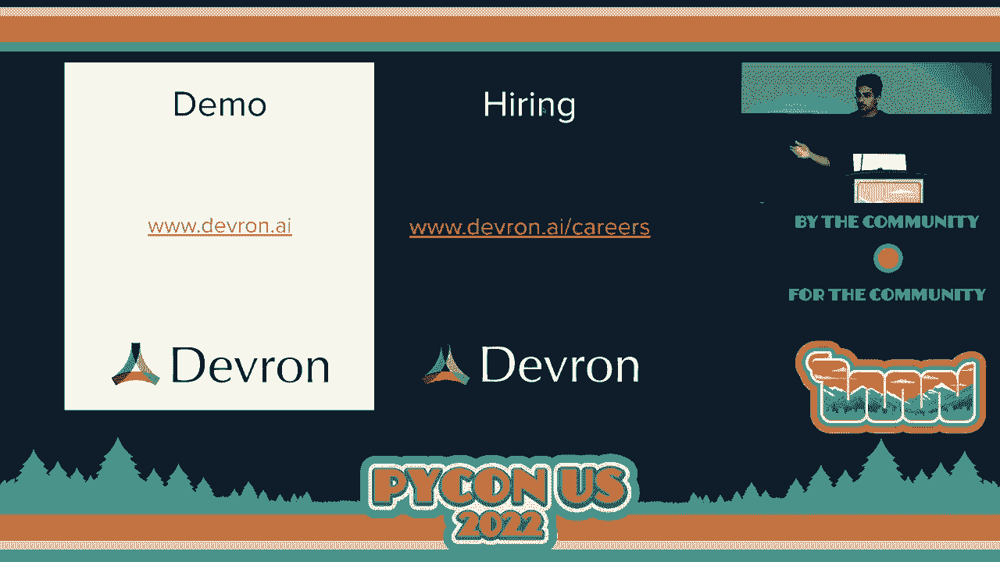
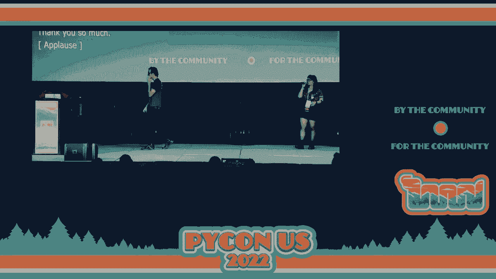
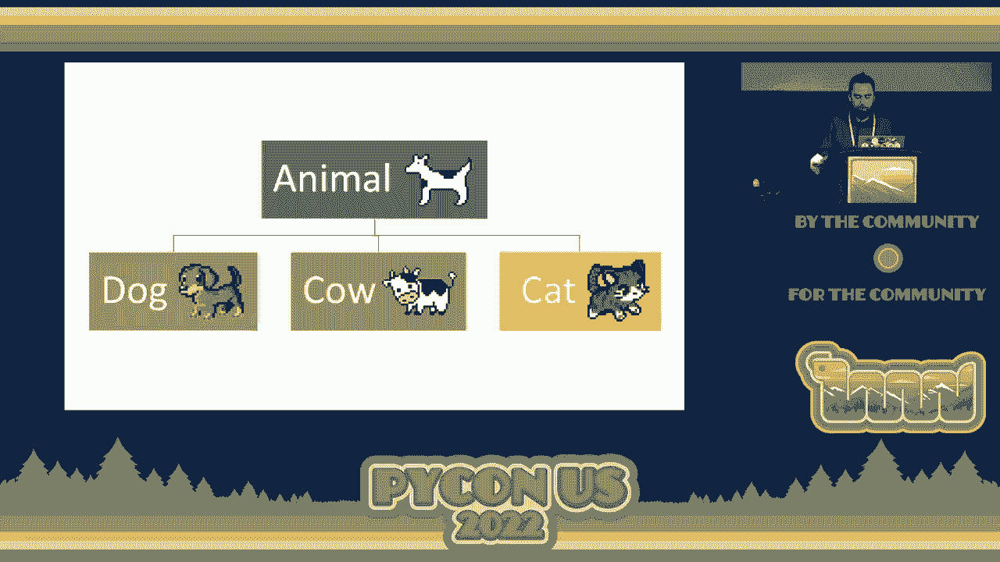
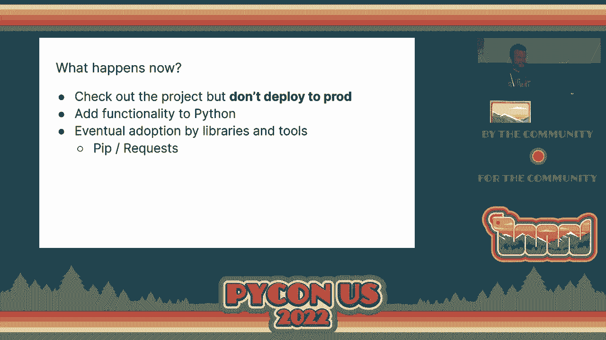
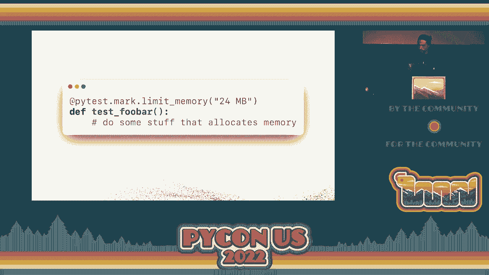
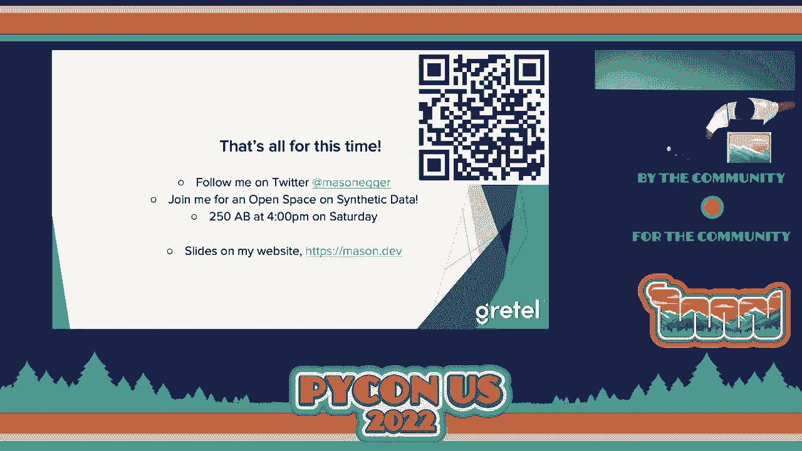
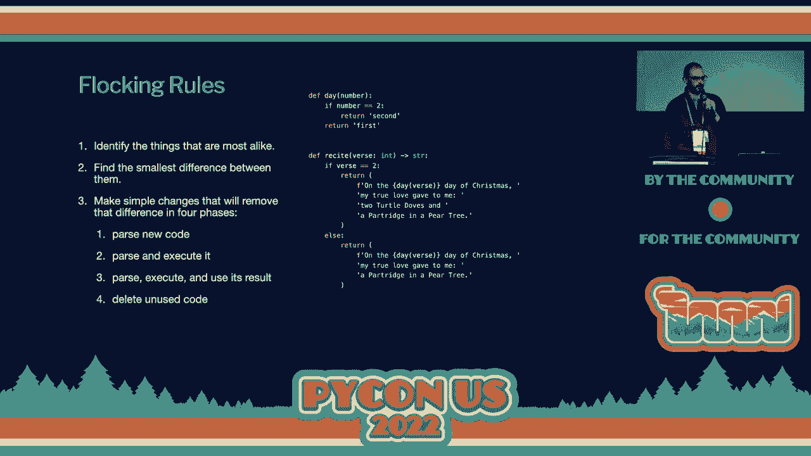
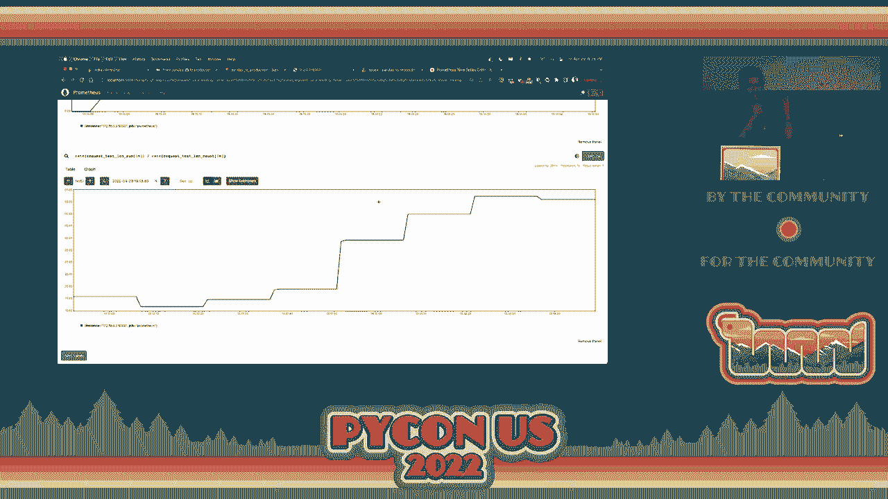

# 012：第一天


在本节课中，我们将一起回顾PyCon US第一天的闪电演讲内容。闪电演讲是一种快速分享想法的形式，每位演讲者有五分钟时间介绍一个主题。我们将整理并翻译这些演讲的核心内容，涵盖数据科学、Python开发、文化体验等多个方面。


## P12：闪电演讲规则与开场 🎤

首先，我们快速了解一下闪电演讲的运作规则。



我们将有一系列的演讲者，每人演讲五分钟或更短时间。演讲内容可以是他们建议的任何主题。


以下是计时规则：
*   当演讲者接近时间限制时，主持人会做“单指拍手”示意，声音很轻。
*   当演讲者非常接近结束时，主持人会做“双指拍手”，发出更大的声音作为提醒。
*   一旦达到五分钟，全场会以热烈的掌声感谢演讲者，并请下一位上台。


现在，让我们开始第一个演讲。

## P12：Samir - 缺乏数据的数据科学 🔍

接下来，萨米尔将和我们谈谈“缺乏数据的数据科学”。

大家好，我是萨米尔。我们来思考一下，什么是缺乏数据的数据科学？当我们没有数据时，我们真的能做些什么吗？一般来说，答案是否定的。数据是数据科学的起点。

那么，缺乏数据的数据科学是什么意思？它是否仅仅意味着“科学”？我想说，这门科学远不止眼前所见。如果你因为新兴的数据隐私法规而遇到数据访问问题，或者你的数据分散在多个不同的信任域中，又或者你想保留对数据的所有权但仍想利用这些数据，你可能会对我们（Deafron）的工作感兴趣。

如果你想了解更多，请来我们在初创企业区域的展位，我们可以给你演示。你也可以在线查找演示。如果你会说Python，我们也在招聘。谢谢。

## P12：Chuk - 我第一次参加PyCon US的文化冲击 🌍

上一节我们听了关于数据科学的分享，本节中我们来看看Chuk参加PyCon US的文化冲击体验。


这是我第一次亲自参加PyCon US。我在去午餐的第一天迷路了，这让我感到震惊。



以下是我感受到的文化冲击点：
*   **规模巨大**：会议场地、马路、酒店房间的床，一切都非常大。
*   **生活差异**：酒店房间里有茶，但没有烧水壶。我不得不自带旅行水壶。
*   **交通恐惧**：来之前我很担心需要开车，因为我驾驶技术不好。幸运的是，这个城市有电车和公交。
*   **活动差异**：在欧洲的Python会议上，有“冰淇淋冲刺”活动。我担心在这里会收到超速罚单而不是参加冲刺。

我不想让你在参加接下来的会议时感到同样的震惊。以下是一些给未来参会者的建议：
*   **天气与衣物**：英国天气较湿润，建议带防水衣物。
*   **出行**：在英国不需要开车，火车和公交（伦敦叫“Tube”）非常方便。
*   **饮食**：一定要尝试炸鱼薯条和“星期日烤肉”。
*   **小费**：在欧洲，小费是可选的。
*   **社交**：会议社交活动可能围绕酒吧展开，人们很友好。
*   **住宿**：酒店可能较贵，可以考虑Airbnb或学生宿舍，但要小心诈骗。

欢迎来英国参加PyCon活动！

## P12：Lukas - 协变、逆变与不变性 🧩

之前我们经历了一场文化之旅，现在回到技术概念。卢卡斯将快速讲解类型系统中的协变、逆变和不变性。

这是一个很多人难以理解的概念，因为缺少好的例子。而好例子的特点是用可爱的动物来解释。




想象一种抽象动物`Animal`，以及它的子类型，如`Dog`、`Cow`、`Cat`。协变、逆变和不变性是解释我们是否可以用一种类型替换另一种类型的概念。

**1. 协变**
协变是最直观的。它意味着当需要`Animal`的地方，我们可以放入`Cat`。
例如，在Python中，如果你有一个打印`Animal`的函数，你可以定义一个打印`Cat`的函数来调用它，一切正常。
公式表示：如果 `Cat` 是 `Animal` 的子类型，那么 `Sequence[Cat]` 可以替换 `Sequence[Animal]`。

**2. 逆变**
逆变则相反。它意味着在某些上下文中，你可以用通用的`Animal`替换具体的`Cow`。
这通常发生在可调用对象中。例如，一个可以打印任何`Animal`的函数，当然可以用于打印`Cat`。
公式表示：如果 `Cat` 是 `Animal` 的子类型，那么 `Callable[[Animal], ...]` 可以替换 `Callable[[Cat], ...]`。

**3. 不变**
不变性意味着你既不能用`Cow`替换`Animal`，也不能用`Animal`替换`Cow`。
例如，一个向列表添加`Animal`的函数，不能安全地用于一个只期望添加`Cat`的函数。因为前者可能添加非`Cat`的动物，从而破坏类型约束。
在Python中，容器不强制类型，但在NumPy或其他语言中，内存布局不同，这点更重要。

现在你理解了协变、逆变和不变性。

## P12：Seth - Python中Trust Store的未来 🔐

我们了解了类型系统的复杂性，现在转向另一个重要的实践话题：安全。塞斯将谈谈Python中Trust Store的未来。

大家好。今天我将谈谈Trust Store，以及它在Python中的未来。我是`requests`等库的维护者。这里的大部分工作也由大卫·格里克完成。

你们见过这个错误吗？`[SSL: CERTIFICATE_VERIFY_FAILED]`。如果你在企业代理环境中工作，可能见过。这通常是因为缺少根证书，无法验证证书链。



**什么是Trust Store？**
Trust Store是一组证书，你的系统在进行TLS握手时会使用它来验证服务器返回的证书。


**Python当前的状况**
在Python中，由于SSL API依赖OpenSSL，Trust Store通常是文件或证书目录。Linux发行版提供与OpenSSL兼容的包，但macOS和Windows不提供。所以在macOS和Windows上，我们使用`certifi`包。`certifi`将Mozilla的CA证书包重新打包并上传到PyPI。

**当前方案的问题**
使用OpenSSL和`certifi`存在一些问题：
*   `certifi`只包含其捆绑的证书，无法感知系统管理员安装的额外证书。
*   每个应用都有自己的信任库，难以维护，且不会自动更新。
*   PyPI成了CA证书的分发渠道，但这并非其本意。

**更好的方案：系统信任库**
系统信任库每个系统只有一个，由系统统一管理和更新，并能提供操作系统的高级功能。

**未来的愿景：`truststore`**
我们创建了一个新的实验性包`truststore`。它提供了一个SSL上下文API，在所有主要平台上工作，并调用本地系统信任库。
**重要提示**：这个包非常新，处于实验阶段，**请勿部署到生产环境**。

**未来的方向**
我们希望将这个功能添加到Python标准库中，让所有Python应用都能立即受益。渐进式的采用路径是通过库和工具。

## P12：Pablo - 内存分析器Memray 📊

从安全话题转向性能分析。巴勃罗将介绍他们公司开源的内存分析器Memray。

大家好。我是Pablo Calindo。今天我介绍我们公司（彭博社）开源的内存分析器Memray。

Python内存分析领域有很多优秀工具。但许多分析器只能看到Python解释器层面的分配，无法看到底层（如C扩展、NumPy）的分配。



**Memray的优势**
Memray不仅可以追踪Python中的分配，还能追踪C扩展中的分配。例如，使用`mmap`分配了90+MB内存，但`tracemalloc`只会报告分配了80字节的Python对象。Memray能正确报告这次9MB的分配。

**强大的调用栈追踪**
Memray可以生成火焰图，不仅显示Python代码的分配，还能深入显示其下的C代码执行情况。这对于使用数据科学库时特别有用。

**其他特性**
*   将信息转储到二进制文件，后续按需生成多种报告（统计、火焰图、表格）。
*   支持实时报告，观察运行中应用的内存行为。
*   提供API，可以只跟踪代码的特定部分，上下文管理器之外的代码没有额外开销。
*   集成测试套件，可以为测试添加内存断言，例如限制测试用例内存使用不超过25MB。

Memray是对现有分析器生态的补充。如果你想知道程序为何占用大量内存，可以尝试它。项目地址：`github.com/bloomberg/memray`。

## P12：Graham - 哀伤周期与数据泄露 😔

从技术工具转向更具人文关怀的话题。格雷厄姆将讨论数据安全漏洞中的哀伤周期。


这个标题可能有点大，但我想谈谈数据泄露后的心理影响。

**数据泄露与羞愧感**
在我进行研究时，发现与被黑客攻击相关的一个主要问题是**羞愧感**。人们实际上在经历一种**哀伤周期**（否认、愤怒、讨价还价、沮丧、接受），因为他们感到羞愧：“哦，我的数据被泄露了，是我的错。”

**对开发者的启示**
我们（Python社区）应该是帮助人们解决问题的人。未来，我们将构建塑造互联网体验的工具。因此，从整体视角看待这个问题非常重要。

**工作场所中的哀伤周期**
在工作场所、团队或客户中，可能有人正处于哀伤周期的“愤怒”阶段。向处于愤怒阶段的人推销产品是困难的。

**技术带来的可能性**
我认为机器学习，特别是强化学习，在推动我们理解社会动态方面潜力巨大。未来几年，社会变革建模可能会有所发展。例如，创建模型或聊天机器人来帮助冲突解决，帮助经历哀伤周期的人在与人交流前平复情绪。

我期待和大家一起努力，构建没有偏见、能真正推动积极变化的机器学习应用。感谢大家。

## P12：Mason - 什么是合成数据？ 🧪

我们讨论了数据泄露的心理影响，现在来看一个解决数据隐私和偏见的技术方案：合成数据。梅森将讲解合成数据。

大家好，我是梅森。今天讲合成数据。我找到的定义是：“合成数据是由计算机使用算法或模拟生成的人工注释信息，通常用作真实世界数据的替代品。”



**开发者面临的数据问题**
数据是当今开发者面临的最大问题之一：
1.  **获取困难**：生产数据可能涉及隐私（如社保号、信用卡号），无法让每个开发者访问。
2.  **数据集有限**：构建机器学习模型时，35%的时间花在数据收集上。数据不足影响模型性能。
3.  **数据偏见**：数据集往往不完整或有偏斜的视角。


**合成数据如何帮助**
合成数据几乎能在所有上述情况下提供帮助：
*   **使私有数据可访问**：通过生成器处理生产数据，产生一个统计属性相同但完全匿名化的新数据集，可以安全共享。
*   **扩展有限数据集**：可以从少量样本生成大量合成数据，用于模型训练。
*   **减少偏见**：通过调整原始数据比例并生成合成数据，可以平衡数据集。例如，一个心脏病预测模型的数据集男性占70%，女性占30%。通过合成数据平衡后，模型准确率从88%提升到了96%。

**合成数据 vs 假数据**
合成数据不是随机的“假数据”。假数据可能过于完美或不真实。合成数据在统计上与原始数据集一样准确，有时甚至更准确。

**应用领域与如何开始**
合成数据可用于汽车、金融、网络安全、医疗保健等领域。
如果你想开始使用，我工作的公司Gretel开源了我们的合成数据模型，并提供免费的云服务层，可以评估数据质量和隐私指标。

## P12：Sophia - HoloViz可视化生态系统 📈

从生成数据回到数据可视化。索菲亚将介绍她最喜欢的Python可视化生态系统HoloViz。

大家好，我叫索菲亚。今天我想谈谈HoloViz。HoloViz是我最喜欢的Python可视化生态系统，由七个库组成，包括Panel、hvPlot、HoloViews、GeoViews、Datashader、Param和Colorcet。它每月下载量超过十万次。

**我的工作流**
我的数据可视化工作流通常从hvPlot开始。我用hvPlot和Panel构建仪表板，用hvPlot和Datashader可视化大数据。


**1. hvPlot：类似Pandas的API**
hvPlot的外观和操作方式与`pandas.DataFrame.plot`非常相似。你可以选择不同的后端（如Matplotlib、Bokeh、Plotly）。


```python
# Pandas 方式
df.plot.scatter(x='x', y='y')
# hvPlot 方式
df.hvplot.scatter(x='x', y='y')
```

**2. 用hvPlot和Panel构建交互式仪表板**
你可以用Panel的交互式控件（部件）替换硬编码的值，轻松创建交互式表格和图表。

**3. 用hvPlot和Datashader可视化大数据**
当用Pandas绘制1100万个纽约出租车数据点时，你会得到一个模糊的团块。使用hvPlot并设置`rasterize=True`（后端使用Datashader），可以快速、有意义且交互式地绘制大数据。

想了解更多，请查看HoloViz.org上的文档，以及hvPlot、Panel和Datashader的文档。

## P12：Shavai - Robin：基于Rust的异步Python Web框架 ⚡

从数据可视化转向Web开发。沙瓦将介绍一个新兴的异步Python Web框架Robin。

大家好。我是Shavai。Robin是一个具有Rust前端的异步Python网络框架。

**Robin的起源**
Robin始于2021年4月，是创始人为大学最终论文准备的宠物项目。当时正值Rust重写热潮，他希望能有一个异步的、类似Flask的框架，于是基于Rust创建了Robin。

**优势：性能**
Python有全局解释器锁（GIL），限制了真正的并发。Rust本身支持多线程，因此Robin比其他纯Python或CPython扩展的框架更快。它内置了耦合的服务器，不依赖外部ASGI服务器。


**性能对比**
在一个简单的HTTP GET基准测试中（10,000个请求），Robin在不同负载下都是最快的框架之一。

**架构**
Robin将Python代码编译并与Rust运行时结合。路由生成后，工作被直接发送到线程池，并可根据CPU负载分配到不同核心，易于扩展。

**如何使用**
安装Robin的Python包后，你可以像使用Flask一样使用它，同时还拥有异步支持。

如果你对这个项目感兴趣，可以在GitHub上为其加星或加入社区。

## P12：Chris M. - 优雅代码的三个步骤（重构） ✨

我们了解了新的Web框架，现在关注代码本身的质量。克里斯将分享使代码优雅的三个步骤。

大家好。我将讨论如何使代码优雅。优雅的代码需要**重构**，因为很难第一次就写出完美、可维护的代码。



我们有数十年的重构工具和经验，比如“代码坏味道”（提示改进机会的模式）和具体的重构方法。但方法太多，如何理清？

《99 Bottles of OOP》一书的作者提出了“聚集规则”，这是一个简单的三步过程。让我们通过代码示例来理解。

**示例：生成《圣诞十二日》歌词**
假设我们有两段相似的歌词，唯一区别是“first”和“second”这两个词。

**步骤遵循聚集规则**
1.  **识别最相似的部分**：找到两段代码之间最小的差异。
2.  **消除差异**：创建一个抽象概念（例如“day_number”）来概括差异，并编写函数实现它。确保测试通过。
3.  **整合并删除冗余**：用新函数替换旧代码，删除不再使用的代码。测试通过后，代码变得更优雅。

**聚集规则的分形特性**
美妙之处在于，这个过程是分形的。无论你在代码的哪个层次，都可以应用这三个步骤，让代码持续变好。如果你在重构过程中被打断，你留下的仍然是可工作的代码，之后可以随时回来继续改进。

## P12：Chris H. - 追求100%测试覆盖率 ✅

从重构优雅代码，我们自然来到保证代码质量的下一环：测试。另一位克里斯将谈论达到100%测试覆盖率的意义和方法。

感谢大家。我将谈谈100%的测试覆盖率。这是指我们所有的代码行都被测试覆盖。

**100%覆盖率值得吗？**
我花了两年时间为一个叫Static Frame的开源项目实现100%覆盖率。起初我持怀疑态度，因为100%行覆盖率不等于100%行为覆盖率。但我现在相信，**这是值得的**。在Python中，未测试的代码根本不会被执行。它虽不保证正确性，但带来了很多好处。

**达到100%后的状态更稳定**
这是我的项目覆盖率时间线。在达到100%之前，覆盖率会波动并逐渐下降。但**一旦达到100%，保持它就变得容易得多**。

**为什么最后2%最难？**
最后的2%通常是代码中最难测试的部分。攻克它们往往会促使你有价值地重构和改善代码设计。这些地方也可能隐藏着真正的bug。

**不到100%为什么不够好？**
许多流行开源包覆盖率也不是100%。但不到100%意味着：
*   最难测试的代码（可能含bug）未被覆盖。
*   难以判断代码库在增长还是萎缩。
*   重构时信心降低。
*   难以判断Pull Request是否添加了足够的测试。


**如何达到100%覆盖率？**
1.  **集成到CI/CD**：使用`coverage`包和`pytest-cov`插件，在CI（如GitHub Actions）中运行测试并生成报告，上传到Codecov等服务。
2.  **明智地排除**：使用`# pragma: no cover`跳过真正无需覆盖的行（如未实现的抽象基类方法）。
3.  **添加注释**：在发现未覆盖的代码行时立即添加注释，便于后续补写测试。
4.  **专注完成**：暂停添加新功能，优先填补剩余的覆盖率缺口。

我恳请大家努力追求100%的测试覆盖率。

## P12：Indra - 从Pandas到生产：快速部署ML模型 🚀

作为压轴，让我们看看如何将机器学习模型快速投入生产。英德拉将分享一篇题为《Pandas到生产》的博文内容。

大家好。我是Indra。我喜欢那些能帮助数据科学家快速将模型从Jupyter笔记本转化为API服务的框架，如FastAPI、Kubeflow、MLflow。我使用过BentoML。

**问题**
在笔记本中构建模型原型很简单，但将其交付给DevOps/MLOps团队编写API并非易事，也不是所有公司都有相关工程师。

**解决方案：使用BentoML**
这是一个快速教程：
1.  **训练模型**：（此处跳过，假设已有一个训练好的情感分析模型）。
2.  **定义API服务**：编写一个类，继承自`bentoml.BentoService`。声明依赖包，定义模型工件，并实现一个`predict` API函数。这类似于编写一个简单的Flask端点。
3.  **打包与服务**：调用BentoML的打包命令，它会自动创建Docker环境、安装依赖，并启动一个提供API服务的容器。

**增强：监控与指标**
通过简单修改，可以集成错误跟踪（如Sentry）和性能指标（BentoML内置Prometheus）。你可以定义自定义指标，如请求延迟和文本长度。

这样，只需少量代码，就能将模型转化为具有生产级监控的API服务。

## P12：结束语与预告 🎉



本节课中我们一起学习了PyCon US第一天的多场闪电演讲，涵盖了从数据科学、Python类型系统、安全、性能分析、心理影响、合成数据、可视化、Web框架、代码重构、测试覆盖到模型部署的广泛主题。

这就是今晚的闪电演讲。如果你喜欢，明天早上、晚上和周日早上还有更多。如果你想成为演讲者，可以在公告板上报名参加明天晚上和周日早上的环节。任何人都可以进行五分钟的演讲。


祝大家晚上愉快，明天见！