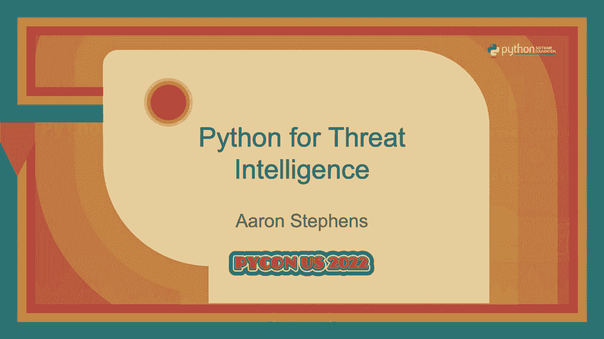

# 017：演讲 - 亚伦·史蒂文斯《威胁情报的 Python》




在本节课中，我们将学习亚伦·史蒂文斯关于威胁情报与Python结合的演讲内容。我们将了解威胁情报的基本概念、工作流程，以及如何利用Python工具和库来增强和自动化威胁情报分析过程，从而提升分析师的效率。

## 什么是威胁情报？🔍

威胁情报的核心是了解对手：他们是谁，他们做什么，以及他们如何做到。其目标是帮助防御者做出明智的决策。例如，客户可能会询问针对其行业最常见的威胁是什么，或者攻击者使用了哪些工具和技术。实现这一目标依赖于数据、专业知识和技术三者的结合。

## 威胁情报的工作流程🔄

威胁情报的工作流程是一个循环过程，主要包括数据收集、事件记录、上下文应用和模式识别。

### 数据收集
数据收集是流程的起点。分析师需要收集各种形式的取证证据，例如文件、事件日志和网络遥测数据。

### 事件记录
在收集数据的同时，分析师需要记录事件的发生。这不仅仅是收集数据，更是将数据组织起来，构建事件时间线，并进行数据建模，以揭示事件背后的完整图景。

### 上下文应用
随着事件图景逐渐清晰，分析师开始为数据应用上下文。这意味着深入分析已有信息，利用额外来源扩展信息，并从中推导出意义。例如，通过逆向工程一个文件来理解其功能。

### 模式识别
通过对多个调查应用上述流程，分析师可以识别出其中的模式。这些模式是分析的支柱，最终帮助我们对对手、他们的工具和目标做出评估。

上一节我们介绍了威胁情报的基本概念和工作流程，本节中我们来看看如何通过数据建模来具体实现这一流程。

## 数据建模示例🧩

数据建模是记录数据和分析的框架。通过一个例子可以更好地理解。

假设调查从一个看似无害的Word文档开始。分析发现，该文档包含一个宏，执行时会安装一个恶意文件。我们通过用“边”连接文档和恶意文件这两个“节点”来建立模型。

逆向工程分析显示，该恶意文件通过HTTPS与一个特定域名通信。我们继续扩展模型，加入文件的代码签名和域名的DNS解析记录。

最终，我们有足够的信息评估该文件属于“坏苹果”恶意软件家族。识别恶意软件家族是归因于特定对手的第一步。

进一步分析发现，该HTTPS通信使用的TLS证书与另一个已知归属于“邪恶博士”对手的证书存在模式上的“软关联”。通过遍历整个数据模型图，我们发现更多重叠证据，最终将此次攻击活动归因于“邪恶博士”。

通过对所有内容进行建模，团队积累的情报可以在未来的分析和调查中复用。

了解了数据建模后，我们来看看如何利用Python来增强和自动化威胁情报分析的各个环节。

## 使用Python赋能威胁情报分析🐍

考虑分析师的工作，我们可以用Python来增强或自动化流程中的特定部分。

*   **数据收集与组织**：由于数据量巨大，手动处理效率低下。我们可以用Python实现良好的I/O功能来自动化数据收集，并根据数据模型自动组织数据并发布到知识图谱中。
*   **上下文应用与模式识别**：我们可以为分析师提供便捷的数据源访问接口，自动提取和建模关键信息，并辅助生成检测规则。
*   **用户界面**：最终目标是赋能而非取代分析师。我们需要构建用户界面（UI），让分析师能轻松告诉我们他们的需求。

以下是我们在实践中常用的一些Python包和它们的功能。

### 1. 参数解析：`argparse`
我们使用`argparse`处理所有命令行输入。它是Python标准库的一部分，简单易用且文档完善。它提供了大量默认功能，同时保持足够的灵活性。

```python
import argparse
parser = argparse.ArgumentParser(description=‘描述你的工具’)
parser.add_argument(‘-v’, ‘--verbose’, action=‘store_true’, help=‘启用详细输出’)
args = parser.parse_args()
```
通过定义核心参数模块，我们可以在多个项目的参数解析器中复用相同的参数定义，确保一致性。

### 2. 日志记录：`logging` 包
我们在整个项目中频繁使用`logging`包。它帮助调试、排错，并让分析师能控制输出信息的详细程度。我们将其用于文件I/O、HTTP请求和错误处理。

```python
import logging
logging.exception(“发生了一个错误”) # 同时记录错误信息和完整堆栈跟踪
```

### 3. 控制台输出美化：`rich` 包
`rich`包为控制台输出提供了自动高亮、颜色、样式、表情符号、表格、Markdown渲染、更好的堆栈跟踪和进度条等功能。

我们可以自定义高亮规则，例如为威胁情报中常见的MD5哈希值设置高亮：
```python
from rich.highlighter import RegexHighlighter
class ThreatHighlighter(RegexHighlighter):
    base_style = “threat.”
    highlights = [r“\b[a-fA-F0-9]{32}\b”] # 匹配MD5
console = Console(highlighter=ThreatHighlighter())
console.print(“找到哈希：c4ca4238a0b923820dcc509a6f75849b”)
```
`rich`还提供了优秀的日志处理器，能保留所有高亮和格式化效果。

### 4. HTTP 请求：`httpx` 包
我们使用`httpx`进行HTTP请求，因为它同时支持同步和异步操作，且API与流行的`requests`库相似。

`httpx`的一个强大功能是事件钩子（event hooks），允许我们在请求发出或响应到达前对其进行处理。例如，可以自动为特定API请求添加认证令牌：
```python
import httpx
def add_auth_header(request):
    if “api.internal.com” in request.url.host:
        request.headers[“Authorization”] = f“Bearer {API_TOKEN}”
client = httpx.Client(event_hooks={‘request’: [add_auth_header]})
```

### 5. 数据建模实现
我们使用简单的类来表示数据模型中的节点和边。
```python
class Node:
    def __init__(self, type_, **attrs):
        self.type = type_
        self.attrs = attrs
        self.labels = []
    def add_label(self, label):
        self.labels.append(label)

class Edge:
    def __init__(self, source, relationship, target):
        self.source = source
        self.relationship = relationship
        self.target = target
```
然后，我们可以基于这些类构建更具体的数据模型，并实现验证逻辑。最后，将模型数据转换为JSON，通过认证后的`httpx`客户端提交到知识图谱API。

### 6. 文件分析：`pefile` 和 `asn1crypto`
对于常见的Windows可执行文件（PE文件），我们使用`pefile`包来解析其结构，提取编译时间戳、导入哈希等信息。
```python
import pefile
pe = pefile.PE(data=file_bytes)
compile_timestamp = pe.FILE_HEADER.TimeDateStamp
```
对于PE文件中的代码签名证书，我们可以结合`pefile`和`asn1crypto`包进行解析。
```python
from asn1crypto import x509
# 假设 cert_data 是从PE文件中提取的证书字节
cert = x509.Certificate.load(cert_data)
common_name = cert.subject.native[‘common_name’]
serial_number = cert[‘serial_number’].native
```

### 7. 生成检测规则：YARA
YARA规则是威胁情报领域的行业标准之一。本质上，YARA规则是字符串，因此我们可以用Python轻松生成。
```python
def generate_yara_rule(cert_serial, cert_cn):
    rule = f“““
rule CertMatch {{
    meta:
        description = “Detects PE files with specific certificate”
    strings:
        $serial = “{cert_serial}”
        $cn = “{cert_cn}”
    condition:
        pe.signatures[0].serial_number == $serial and pe.signatures[0].issuer contains $cn
}}
“““
    return rule
```
我们可以基于从文件中提取的特征（如证书序列号、Rich哈希）自动生成YARA规则，用于在数据集中搜索类似的恶意软件。

## 给非工程师的建议：从小处着手🚀

我的团队没有软件工程师，我们都是分析师。对于处于类似情况的人，我的建议是：

*   **从小处着手**：先自动化那些日常中重复、耗时但不需要太多思考的“无聊”任务。
*   **投资你的开发环境**：选择一个适合你的IDE（如VS Code、PyCharm），并利用自动格式化和代码检查工具（如`black`、`pylint`），这能让代码更规范、更易读。
*   **生产力优于完美**：我们不是要发布完美的产品。流程中的任何小改进都是胜利，节省下来的时间能让我们更专注于需要人类专业知识的复杂分析。


本节课中我们一起学习了威胁情报的核心概念、循环工作流程以及数据建模的方法。更重要的是，我们探讨了如何利用一系列强大的Python库（如`argparse`、`logging`、`rich`、`httpx`、`pefile`）来收集数据、美化输出、进行网络请求和文件分析，从而有效增强和自动化威胁情报分析过程。记住，目标是通过工具赋能分析师，提升效率，将人力专注于最具价值的分析环节。