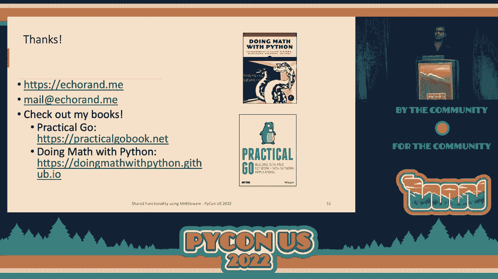

# 019：使用中间件实现共享功能 🧩


## 概述
在本节课中，我们将要学习中间件（Middleware）在Python Web开发中的应用。中间件是连接应用程序不同部分的“胶水”，用于实现跨多个端点的共享功能，如日志记录、错误处理和缓存。我们将探讨在Flask、Django框架中如何使用中间件，并深入了解与框架无关的WSGI和ASGI中间件标准。

---

## 中间件的核心概念

上一张幻灯片与我们今天要讨论的内容大相径庭。


我发现的一些关键思想，确实与我产生共鸣，并且表达了中间件本质的术语，如“胶水”。这是硬件与传输层之上但应用程序环境之下之间的接口。我无法真正表达为什么，但某些地方这些术语给了我中间件本质的感觉。

今天我们真正使用中间件。当然，我们不是在谈论硬件，而是一般地作为我们应用程序不同部分之间的胶水。今天考虑一个包含一个或多个 API 端点或视图的 web 应用程序。你编写的代码实现了一个或多个端点或视图中共同的功能。示例包括页面浏览计数、集中式错误处理、缓存等许多其他功能。

WSGI规范PEP333将中间件描述为提供扩展API、内容转换、导航和其他有用功能的一种方式。这引出了我们演讲的第二个主题，针对WSGI应用程序的中间件。

---

## Flask框架中的中间件

我将从讨论Flask应用程序开始。考虑一个非常简单的Flask应用程序，我们创建一个蓝图并定义一个处理所有请求的单一路由，我们称之为视图函数。当然，我省略了一些与此上下文无关的内容。

要在Flask中定义中间件，我们使用装饰器。一个我们使用的装饰器例子是`@app.before_request`。当你创建一个函数并用`@app.before_request`装饰器装饰它时，这个函数总是在视图函数被调用之前被调用。

当响应已生成，你用`@app.after_request`装饰器装饰它。当然，我在这里展示了蓝图的例子，但这同样适用于非蓝图应用程序。

这里显示了一个典型的例子，作为你可能想要使用此功能的用例。因此，假设你想记录你页面渲染的延迟。你所做的是在`before_request`的函数中使用Flask的`g`全局变量来启动计时器，然后在`after_request`的函数中找到当前时间和你在请求开始时记录的时间之间的差异，这将给你页面渲染的延迟。

现在，定义不止一个，而是多个这样的`before_request`函数是很常见的。对于我在这里指定的`before_request`函数，顺序是重要的，它们的定义顺序就是它们被调用的顺序。对于`after_request`函数，它们的调用顺序是相反的。因此，当从视图函数生成响应时，你最后定义的函数首先被调用。

**Flask中间件顺序示例：**
```python
@app.before_request
def before_request_f1():
    # 第一个被执行的中间件逻辑
    pass

@app.before_request
def before_request_f2():
    # 第二个被执行的中间件逻辑
    pass

@app.after_request
def after_request_f1(response):
    # 倒数第二个被执行的中间件逻辑
    return response

@app.after_request
def after_request_f2(response):
    # 最后一个被执行的中间件逻辑
    return response
```

---

## Django框架中的中间件

上一节我们介绍了Flask中的装饰器中间件，本节中我们来看看Django如何处理中间件。这是一个我称之为`index`的简化视图函数，它接受一个参数`request`，表示当前正在处理的请求。请记住，这将是我们接下来几张幻灯片的关键。

在Django中，你可以使用两种方法定义中间件：你可以定义一个类或者定义一个函数。现在我这里的第一个示例是基于类的方法，你定义一个类，定义一个构造函数，该构造函数接受一个参数`get_response`。这个参数表示要调用的下一个视图函数或下一个中间件。真正的魔法发生在`__call__`方法中。

因此，这里首先要注意的是`__call__`所接受的参数。它接受一个参数`request`，表示当前正在处理的请求。这正是视图函数作为参数接受的内容。现在在`__call__`方法中，我们实现我们的中间件。在这种情况下，我们实现的中间件处理异常。此处的期望行为是，如果没有异常，我们将原样返回响应。如果我们遇到异常，我们希望返回自定义响应。

**Django基于类的中间件示例：**
```python
class SimpleMiddleware:
    def __init__(self, get_response):
        self.get_response = get_response

    def __call__(self, request):
        # 在视图被调用之前的代码
        response = self.get_response(request)
        # 在视图被调用之后的代码
        return response
```

基于函数的中间件如下所示。我们定义了一个名为`latency_reporter`的函数，因为我正在使用这个中间件来测量请求的延迟。这里的关键是`latency_reporter`函数接受一个参数`get_response`，该参数指向下一个中间件或将为请求调用的视图函数。现在这个函数返回一个闭包。这个闭包再次接收参数`request`，并且在处理请求时，Django中间件机制会调用这个函数。

**Django基于函数的中间件示例：**
```python
def latency_reporter(get_response):
    def middleware(request):
        request_begin = time.time()  # 记录开始时间
        response = get_response(request)
        latency = time.time() - request_begin  # 计算延迟
        print(f"Request took {latency} seconds.")
        return response
    return middleware
```

现在一旦你定义了你的中间件，这就是在Django中激活这些中间件的方式。你需要更新你的`settings.py`，并更新`MIDDLEWARE`列表，这是一个模块级别的设置变量，传递给你想要激活的中间件。这里的顺序再次很重要。

考虑我们有一个中间件A，B，然后是你的应用处理程序或你的视图函数。当请求被处理时，基本上是请求进入你的应用程序时，首先调用中间件A，然后调用你的中间件B，最后调用你的视图函数。一旦生成了响应，响应会先进入中间件B，然后再进入中间件A，最后到达客户端。

Flask和Django中间件之间一个关键的区别是，在Flask中，你的中间件可能不会在请求的两个部分都被调用，即在请求时和响应时，因为你通过`before_request`和`after_request`的装饰器来控制这一点。在Django中则不同。你定义的每个中间件都会获得请求和响应。这取决于你的中间件，你可以选择忽略请求或忽略响应。

简单回顾一下，使用中间件，你定义自定义代码在请求处理之前和之后运行。中间件的工作方式是框架特定的细节。

---

## 框架无关的WSGI中间件

正如我们所见，我们为Django应用程序编写了中间件，也为Flask应用程序编写了中间件，而我们这样做的方式是相当不同的，原因在于每个框架实现了自己的机制。现在我的问题是，你能以框架无关的方式编写中间件吗？结果我们可以。这毕竟是WSGI框架，这意味着它们定义了WSGI应用程序，答案就在这里，正如我们接下来要看到的那样。

因此，我将退后一步，定义什么是一个瞬时的WSGI应用程序。我知道这样的东西是如何定义WSGI应用程序的，但在我这样做之前我对此毫无头绪。但这就是一个WSGI应用程序的样子，仅此而已。你不需要做其他事情。

**一个简单的WSGI应用：**
```python
def simple_app(environ, start_response):
    """
    environ: 包含描述当前请求的键值对的字典。
    start_response: 一个函数，用于发送响应状态和头部回客户端。
    """
    # 处理请求的逻辑...
    status = '200 OK'
    headers = [('Content-Type', 'text/plain')]
    start_response(status, headers)  # 调用start_response
    return [b'Hello World!']  # 响应体必须是可迭代的字节串
```

它接受一个名为`environ`的字典和一个函数`start_response`作为两个参数。字典环境包含描述当前请求的键值对，而`start_response`是一个函数，你用它将响应发送回客户端。注释的行是你在处理程序中进行处理的地方，然后当你准备好发送响应时，首先用两个参数调用`start_response`。第一个是包含HTTP状态的字符串，第二个是你想要添加到响应中的头部列表，然后你发送响应本身。响应需要是一个可迭代的字节串属性。

让我们看看如何编写一个WSGI中间件层。它看起来非常类似于Django中间件，但有某些差异。事实上，如果你查看`__call__`方法，我们将忽略`__init__`，因为在这里并不相关。`__call__`方法签名和WSGI应用程序签名是完全相同的。

我们在这里做的再次是我最喜欢的例子之一，似乎是处理异常。因此，在`__call__`方法中，我调用了自我属性`self.wsgi_app`，它指向原始的WSGI应用程序。如果没有异常，响应将按WSGI应用程序本身返回。如果发生异常，我将调用带有500状态的`start_response`、自定义头部，然后我返回一个自定义响应，表示发生了错误。这真的很有用，因为你可以将内部异常细节隐藏在客户端面前。

**WSGI中间件示例（异常处理）：**
```python
class ExceptionMiddleware:
    def __init__(self, wsgi_app):
        self.wsgi_app = wsgi_app

    def __call__(self, environ, start_response):
        try:
            return self.wsgi_app(environ, start_response)
        except Exception:
            # 发生异常时，返回自定义错误页面
            status = '500 Internal Server Error'
            headers = [('Content-Type', 'text/html')]
            start_response(status, headers)
            return [b'<h1>An error occurred.</h1>']
```

你如何将WSGI应用程序与中间件集成？看起来是这样的。你创建一个`ExceptionMiddleware`类型的对象，这是我们定义的中间件，然后你传入WSGI应用程序本身，这就是你的WSGI应用，你可以使用像`gunicorn`这样的服务器来运行它。就这样，你的WSGI应用程序正在与中间件一起运行。我将把这称为为WSGI定义中间件的包装技术。

所以让我们再暂停一下。框架实现了自己的机制来定义中间件，正如我们所见。现在，WSGI是另一个WSGI应用程序。这意味着如果我们使用WSGI中间件实现功能，它们就是框架无关的。

---

## 使用第三方WSGI中间件

让我们看看它们是如何工作的。这是OpenTelemetry WSGI中间件，它是一个来自OpenTelemetry项目的开源中间件。这并不是特别重要，所以我不会详细说明OpenTelemetry本身是什么，但这是我熟悉的一个WSGI中间件的例子。所以这是中间件的源代码，你可以看到它与我们在这里定义的中间件的相似性。如果忽略特定功能，它几乎是一样的。

那么我们如何在Flask中使用它呢？当你定义一个Flask应用程序时，有一个属性`wsgi_app`指向WSGI应用程序。你可以在这里将该属性设置为OpenTelemetry中间件对象的类型，方法是将原始的WSGI应用作为参数传递。所以这导致OpenTelemetry中间件包装了我们原始的WSGI应用程序。这基本上为你的Flask应用程序提供了OpenTelemetry中间件所提供的功能。

**在Flask中使用WSGI中间件：**
```python
from flask import Flask
from opentelemetry.instrumentation.wsgi import OpenTelemetryMiddleware

app = Flask(__name__)
app.wsgi_app = OpenTelemetryMiddleware(app.wsgi_app)  # 包装WSGI应用
```

现在，对于Django，如果你查看项目中的`wsgi.py`文件，你会发现这段代码，其中有一个顶级变量叫做`application`，它被设置为函数`get_wsgi_application`的返回值，它指向你底层的WSGI应用程序。记得我提到过这个框架抽象了很多这些内容，但在某处确实有一个WSGI应用程序。所以这就是WSGI应用程序。我们使用OpenTelemetry中间件的方式与Flask类似。我们创建一个OpenTelemetry中间件对象，传入原始的WSGI应用程序。然后我们更新`application`的值，也就是模块级变量，指向那个对象，这就是使用WSGI中间件所需的一切。

**在Django中使用WSGI中间件：**
```python
# 在 wsgi.py 中
from django.core.wsgi import get_wsgi_application
from opentelemetry.instrumentation.wsgi import OpenTelemetryMiddleware

application = get_wsgi_application()
application = OpenTelemetryMiddleware(application)  # 包装WSGI应用
```

所以这听起来像是个胜利，对吧？你可以编写一个WSGI中间件，并且可以以框架无关的方式使用它。现在我不确定这样做是否会有任何陷阱，尽管我还没有深入探索过。不过，也许这是你可以回家探索的内容。

---

## 中间件的迁移应用

好吧，让我们看一个最后的例子，看看如何使用中间件。假设你有一个Django应用程序，并且你将一些后端迁移到Flask。你可以定义一个中间件，将Flask应用程序嵌入到你的Django应用程序中。如果这听起来像魔法，那就是我实际实现时的感觉。

所以你定义一个类，你可以随意命名，但我叫它`FlaskAppWrapper`。关键再次是特殊的`__call__`方法。所以在这里我首先调用Flask应用的WSGI方法。你知道，我传递`environ`和`start_response`，然后我把它传递给Flask应用。如果我得到一个非404的响应，我就会原样返回数据，这表明请求处理正确。如果我得到404响应，我会退回到Django应用程序，这是一种方式。你可以使用中间件来帮助你在项目中的迁移。

**在Django中嵌入Flask应用的中间件：**
```python
class FlaskAppWrapper:
    def __init__(self, flask_app, django_app):
        self.flask_app = flask_app
        self.django_app = django_app

    def __call__(self, environ, start_response):
        # 尝试让Flask应用处理请求
        response = self.flask_app(environ, start_response)
        # 检查Flask是否返回了404
        # (这里需要解析响应状态，逻辑简化)
        if not is_404_response:
            return response
        else:
            # 如果Flask返回404，则回退到Django应用
            return self.django_app(environ, start_response)
```

这就是你如何使用它。它看起来非常类似于你使用OpenTelemetry的中间件。所以结果是，当你请求`/polls/v2`路径时，Flask应用程序会被调用。当你请求`/polls`路径时，Django应用程序会被调用。

所以回顾一下，Flask和Django实现了自定义机制，允许用户定义中间件。然而，正如你所看到的，当我们定义一个WSGI中间件时，它们变得独立于框架。我们使用包装技术来使用这个WSGI中间件。

---

## ASGI与FastAPI中的中间件

大约有多少个？七个还是八个？所以我认为这会是一个快速的部分，但让我们看看。这是一个ASGI应用的重新应用。它类似于我们在WSGI应用中看到的。你定义一个异步函数。它接受三个参数，一个`scope`，一个`receive`函数和一个`send`函数。因此，基本上描述了当前请求，你可以把它想象成当前请求的生命周期。`receive`函数用于获取任何请求数据，然后你使用`send`函数发送任何响应。所以记住这个签名。这就是本节所需的全部内容。

现在让我们考虑一个FastAPI应用程序。这是我们定义一个非常简单的FastAPI应用程序的方式。你创建一个顶层对象，类型为`FastAPI`。我们定义一个根，`expensive`。它是一个超级昂贵的根，我们睡10秒钟然后返回一个响应。现在假设我想写一个中间件，比如说缓存。我想缓存这些昂贵的结果。我不想每次都计算结果。

所以我做的就是定义一个中间件。我定义了一个`__init__`方法。它接受两个参数。第一个参数是应用本身，第二个参数是排除的部分。这是你中间件需要接受的任何自定义参数。我们可以在这里指定任意数量的参数。我这里只有一个。这里的关键再次是特殊的`__call__`方法。它应该是一个异步函数。它接受三个参数，`scope`、`receive`和`send`，正如我们在这里的ASGI函数一样。在这个函数中，我们定义中间件的逻辑。如果有缓存，我们就返回缓存的响应。然而，如果我们没有得到缓存，我们使用原始参数调用原始应用。

**FastAPI ASGI中间件示例（缓存）：**
```python
from fastapi import FastAPI, Request
from starlette.middleware.base import BaseHTTPMiddleware
import time

app = FastAPI()

class CacheMiddleware(BaseHTTPMiddleware):
    def __init__(self, app, excluded_paths=[]):
        super().__init__(app)
        self.cache = {}
        self.excluded_paths = excluded_paths

    async def dispatch(self, request: Request, call_next):
        # 检查路径是否在排除列表中
        if request.url.path in self.excluded_paths:
            return await call_next(request)

        # 检查缓存
        cache_key = request.url.path
        if cache_key in self.cache:
            return self.cache[cache_key]

        # 没有缓存，调用下一个应用并缓存结果
        response = await call_next(request)
        self.cache[cache_key] = response
        return response

# 添加中间件到应用
app.add_middleware(CacheMiddleware, excluded_paths=['/chat'])
```

因此，再次强调，你已经定义了中间件。你如何在FastAPI中添加它？它提供了一个辅助方法，`add_middleware`。你首先定义想要添加的中间件的类。然后指定任何额外的参数。在这种情况下，我有一个叫`excluded_paths`的参数，它是一个我不想缓存的部分列表。

因此，这个中间件实际上运作得很好，你知道。它既适用于HTTP应用，也适用于WebSocket应用。关键在于`scope`持续的时间与WebSocket连接保持开放的时间一致。所以当你调用`await serve.app`时，那个函数在WebSocket连接期间不会返回，连接保持开放。因此，我在下面有一些日志，你可以看到请求持续了30秒，这就是WebSocket连接保持开放的时间。

所以现在如果你注意到，比较WSGI框架和ASGI框架的默认行为，我非常喜欢FastAPI的默认行为。因为它允许你直接定义ASGI中间件。实际上，这是他们文档中推荐的第一件事。他们稍后在文档中讨论了一种更具体的方法。但我很喜欢他们让你只需编写一个通用的ASGI中间件。这意味着如果还有其他ASGI框架，你可以将中间件与那些框架一起使用。我很喜欢FastAPI这一点。

所以你将要看到的最后一个中间件示例是如何将WSGI应用嵌入到某些ASGI应用中。这是最神奇的部分。所以你可以做的是定义一个FastAPI应用，然后FastAPI提供一个特殊的中间件，称为WSGIMiddleware。你调用`mount`方法，任何以`/v1`开头的部分将被传递给WSGIMiddleware，因此传递给WSGI应用。

**在FastAPI中挂载WSGI应用（如Flask）：**
```python
from fastapi import FastAPI
from fastapi.middleware.wsgi import WSGIMiddleware
from flask import Flask as FlaskApp

# 创建Flask应用
flask_app = FlaskApp(__name__)
@flask_app.route("/v1/hello")
def hello():
    return "Hello from Flask!"

# 创建FastAPI应用
app = FastAPI()
@app.get("/v2/hello")
async def hello_fastapi():
    return {"message": "Hello from FastAPI!"}

# 将Flask应用挂载到FastAPI的/v1路径下
app.mount("/v1", WSGIMiddleware(flask_app))
```

结果是，我有一个简要的示例。所以当你调用以`/v1`开头的任何内容时，你会从Flask那里得到`hello world`，因为那是经过处理的。另一方面，当你调用以`/v2`开头的任何内容时，你会从FastAPI那里获得响应。如果你查看Starlette源代码，WSGIMiddleware的实现看起来像这样。我相信你现在开始看到这个模式了。所以你查看`__call__`方法，它接受三个参数，然后有特殊的`WSGIResponder`类，如果你深入研究，会定义一个`__call__`方法，它接受两个参数：一个`environ`和`start_response`。因此，你的WSGI应用本质上被适配到了ASGI接口。

---

## 总结与练习

本节课中我们一起学习了中间件在Python Web开发中的强大作用。

**关键要点：**
*   中间件一般可以定义为WSGI应用或ASGI应用，或者特定于Web框架。
*   中间件是既充当客户端（对于下游应用）又充当服务器（对于上游客户端或中间件）的代码。
*   中间件使得非功能性需求（如日志、缓存、错误处理）的解耦和共享成为可能。
*   它还帮助我们在应用框架之间迁移，包括WSGI和ASGI框架。

因此，我给你一个练习。回去吧，不是今天，可能在你恢复之后。查看内置中间件和社区贡献的中间件的源代码。你会很容易看到模式，希望这次演讲能给你足够的内容，深入理解这些，并了解它们的工作原理。

深入了解中间件在WSGI和ASGI应用中的内部运作，并让你的大脑形成一些新的神经通路。




[掌声]，[热烈掌声]。