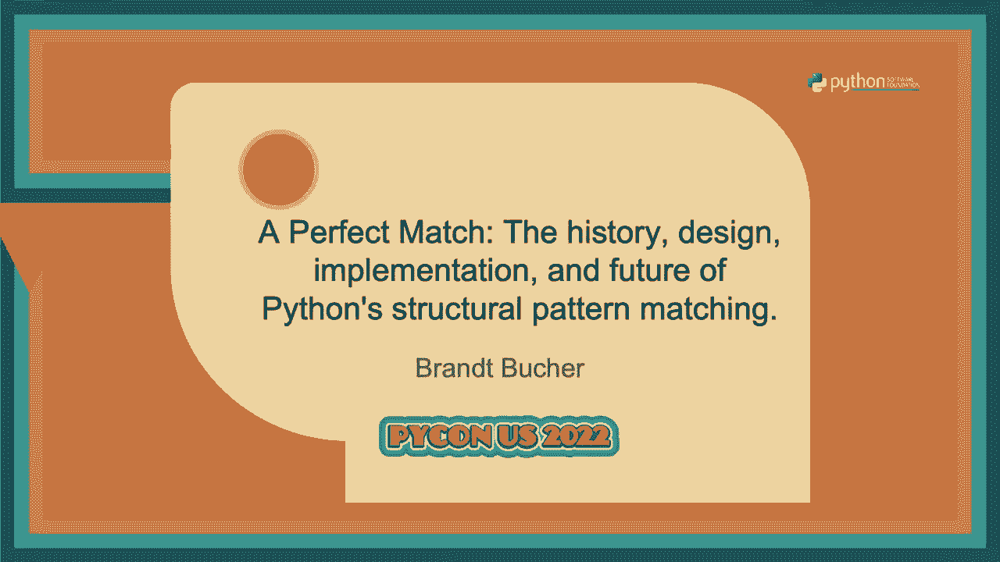

# 026：演讲 - 布兰特·布赫 _ 完美契合 历史、设计、实施和未来




在本教程中，我们将学习Python 3.10引入的**结构模式匹配**特性。我们将回顾其历史背景、核心设计理念、实现细节，并展望其未来优化方向。本教程旨在帮助初学者理解这一强大工具，并学会如何在自己的代码中应用它。

## 历史背景：从构想到实现

上一节我们介绍了本教程的概述，本节中我们来看看结构模式匹配这一特性是如何在Python中诞生的。

该特性的起点是Python创始人吉多·范罗苏姆在疫情期间发出的一封电子邮件，提议为Python添加匹配语句。这最终发展成了**PEP 622**。最初的提案内容庞大，目标受众不明确，因此Python指导委员会要求作者团队进行重写。

于是，提案被拆分为三个独立的PEP，分别面向不同的受众：
*   **PEP 634**：功能规范，主要为语言维护者提供实施细节。
*   **PEP 635**：设计原理说明，向指导委员会阐述该功能的价值和设计决策。
*   **PEP 636**：面向开发者的教程，通过编写一个文本冒险游戏来教授如何使用模式匹配。**这是学习该功能最推荐的资料。**

整个开发过程在一个公开的GitHub仓库（`gvanrossum/patma`）中进行协作，包含了问题追踪、草案讨论、原型实现和实际应用测试，所有决策过程都有迹可循。

最终，该提案获得批准，并随**Python 3.10**版本发布。

## 核心设计：超越Switch语句

上一节我们回顾了模式匹配的历史，本节中我们来深入探讨其核心设计理念。

首先需要明确一个关键概念：**结构模式匹配不是Switch语句**。虽然外观相似，但其能力远不止于此。将其简单视为Switch语句会限制其潜力并可能导致困惑。

结构模式匹配的本质是**控制流**与**解构**的结合。
*   **控制流**：根据数据的值或“形状”（如序列长度）进行分支。
*   **解构**：将结构化数据（如序列、映射、对象）拆解为独立部分。

结构模式匹配允许你在**分支的同时进行解构**，或者在**解构的同时进行分支**，从而形成一种强大的声明式编程风格。

### 初识匹配语句

以下是匹配语句的基本语法：

```python
match meal:
    case [entree, side]:
        print(f“主菜是{entree}，配菜是{side}。”)
```

`match` 后跟一个表达式（称为“主题”），`case` 后跟一个**模式**（而非普通表达式）。上面的 `[entree, side]` 是一个**序列模式**，它尝试将 `meal` 匹配为一个长度为2的序列，并将元素分别绑定到变量 `entree` 和 `side`。`entree` 和 `side` 被称为**捕获模式**。

### 基础模式类型

以下是几种基础模式：

1.  **通配符模式**：使用单个下划线 `_` 匹配任何值但不进行绑定（即忽略该值）。
    ```python
    match meal:
        case [_, side]:
            print(f“配菜是{side}。”)
    ```

2.  **值模式**：使用字面量（字符串、整数、布尔值、`None`等）进行基于相等性的匹配。
    ```python
    match meal:
        case [“spam“, side]:
            print(f“主菜是spam，配菜是{side}。”)
    ```

3.  **或模式**：使用 `|` 匹配多个模式之一。
    ```python
    match meal:
        case [“spam“ | “eggs“, side]:
            print(f“主菜是spam或eggs，配菜是{side}。”)
    ```

### 更强大的模式

结构模式匹配还支持更复杂的模式，这也是其强大之处：

*   **映射模式**：用于解构字典等映射类型。
*   **类模式**：用于解构对象实例，根据对象的类及其属性值进行匹配。这是实现运行时类型参数化的强大工具，特别适用于处理AST（抽象语法树）或复杂数据结构（如红黑树）。
*   **守卫**：在 `case` 语句中使用 `if` 添加任意条件判断。

这些模式的设计借鉴了函数式编程语言约50年的实践经验（如Haskell、OCaml、Rust、Scala），但最终形态力求符合Python的风格。

## 实现细节：编译器如何工作

上一节我们了解了模式匹配的设计与语法，本节中我们来看看Python编译器是如何实现它的。

一个重要的实现特性是 **`match` 和 `case` 是软关键字**。这意味着在Python 3.10及以后版本中，它们仅在 `match` 语句的上下文中被视为关键字。你现有的使用 `match` 或 `case` 作为变量名或函数名的代码不会因此被破坏，保持了完全的向后兼容性。

从编译器的角度看，将模式匹配作为原生语法特性，使得编译器能深度理解代码意图，并生成高度优化的字节码。

例如，一个匹配序列长度的操作，编译器会使用专门的 `MATCH_SEQUENCE` 和 `GET_LEN` 等操作码，这些操作码在C语言层面执行快速的类型标志检查和长度查询，其效率远高于等效的纯Python代码（如多次调用 `isinstance()` 和 `len()`）。

这种优化是库或装饰器无法实现的，它体现了原生语法特性的价值：开发者可以信任编译器为声明式的模式匹配代码生成高效的底层指令。

## 未来展望：优化与改进

上一节我们探讨了当前的实现，本节中我们展望一下该特性未来可能的优化方向。

未来的一个主要优化方向是 **决策树优化**。目前，每个 `case` 分支是独立编译和依次尝试的，这可能导致冗余检查。

考虑以下代码：
```python
match meal:
    case [“spam“, side]:
        ...
    case [“eggs“, side]:
        ...
    case [_, side]:
        ...
```
当前编译器会三次检查 `meal` 是否为序列以及其长度是否为2。优化后的编译器可以合并这些重叠检查：首先检查是否为长度为2的序列，然后根据第一个元素的值进行分支，最后再绑定 `side` 变量。这种优化能显著提升性能。

决策树优化还能带来更好的 **可达性分析**。编译器可以检测出永远不会被匹配到的 `case` 分支（例如，由于前面的模式已经覆盖了所有情况），并可能在未来版本中提供警告，帮助开发者避免逻辑错误。

## 总结

本节课中我们一起学习了Python的结构模式匹配。

我们从其诞生历史开始，了解了它如何从PEP 622演变为三个独立的PEP。我们明确了其核心设计是**控制流与解构的结合**，而**非简单的Switch语句**。我们学习了基础的模式类型，如序列模式、捕获模式、通配符模式和值模式，并提及了更强大的映射模式、类模式和守卫。

我们还探讨了其实现细节，包括软关键字的作用以及编译器如何生成优化字节码。最后，我们展望了未来可能的决策树优化和可达性检查改进。


要深入掌握这一特性，强烈建议阅读 **PEP 636** 教程。结构模式匹配为处理复杂数据结构和控制流提供了全新、清晰且强大的范式，值得你在合适的场景中尝试和应用。