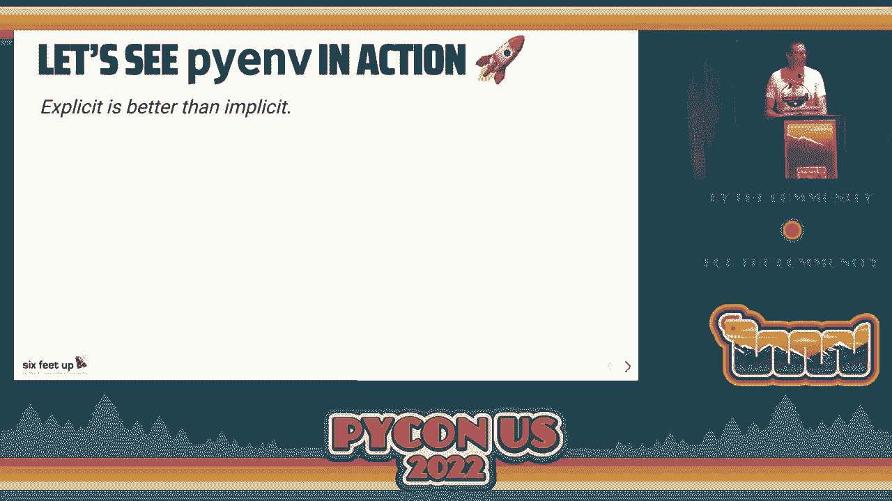
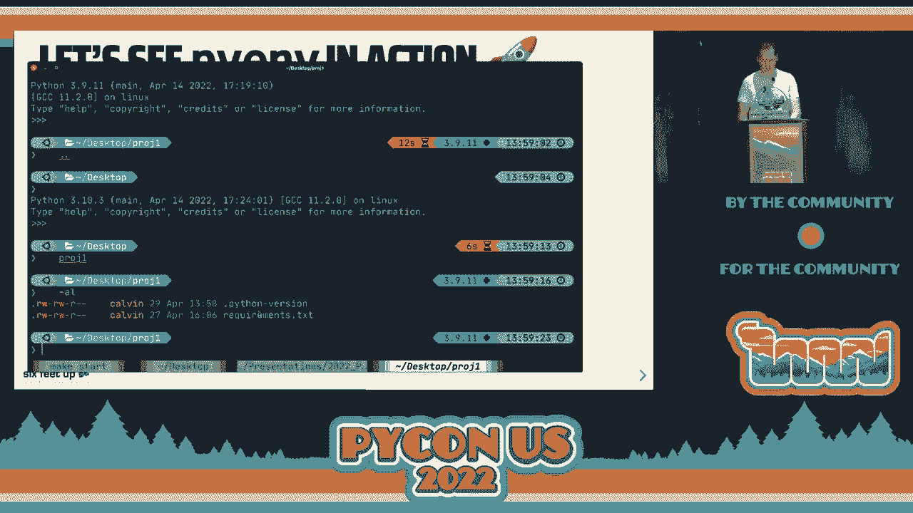
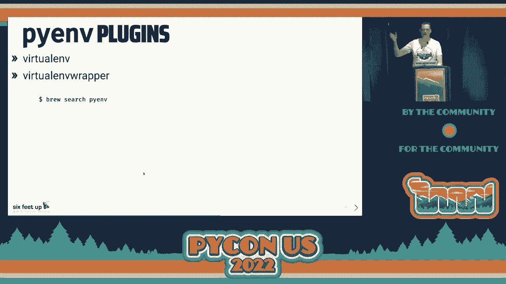
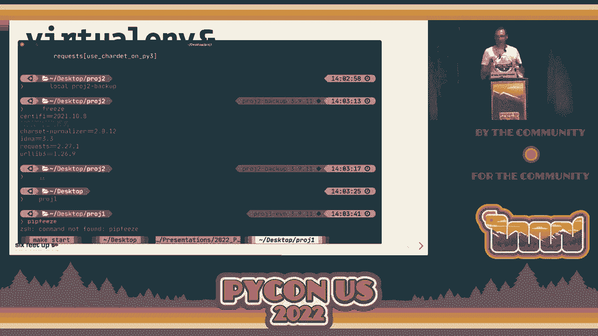
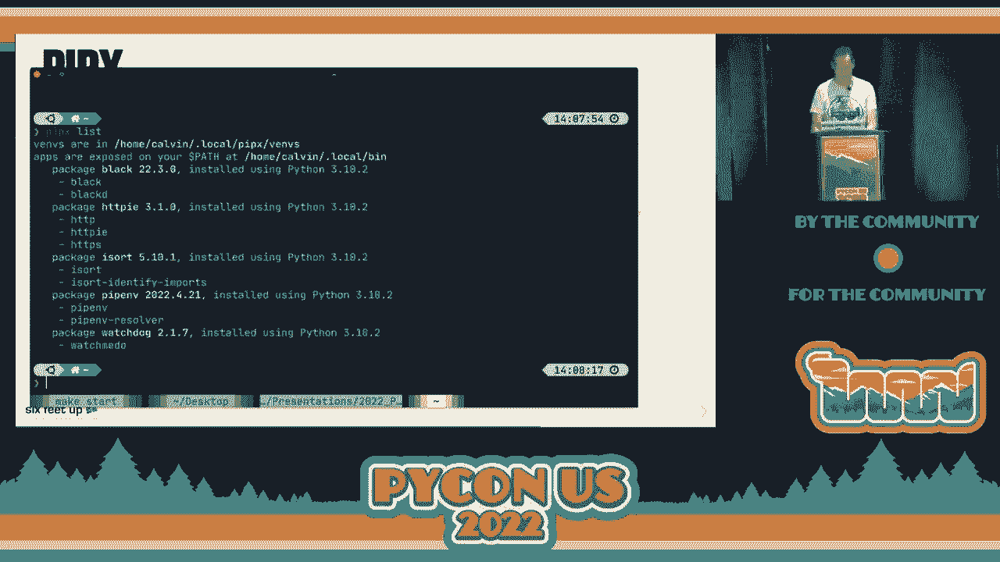
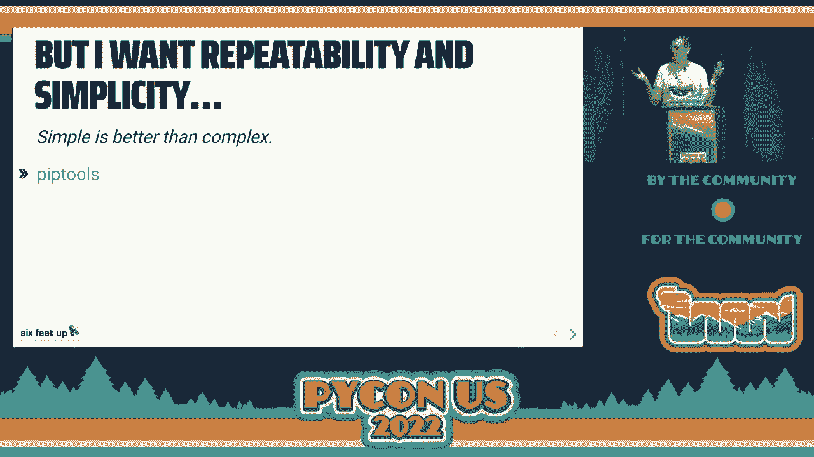
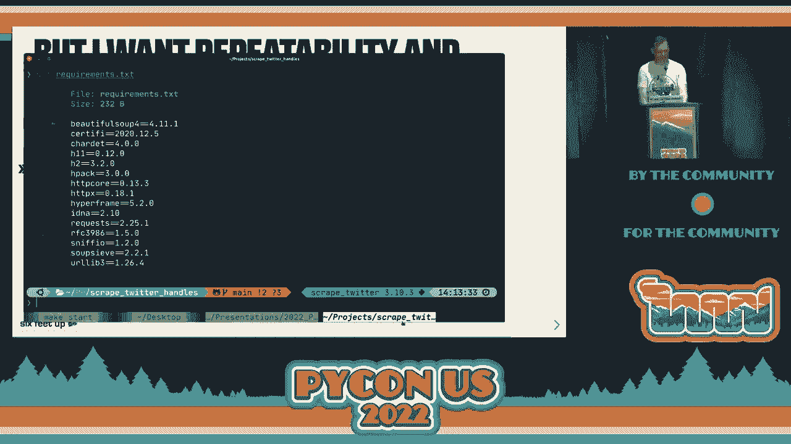
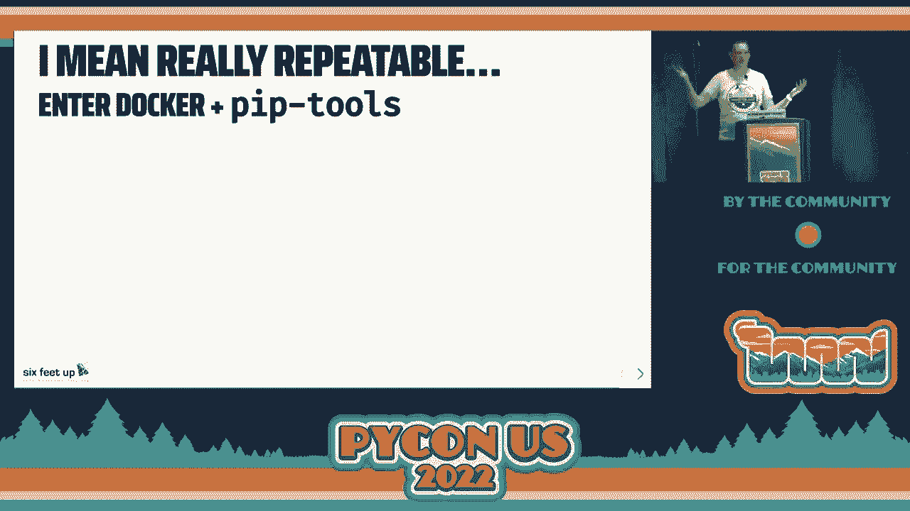

# 029：启动你的本地 Python 环境 🐍


在本节课中，我们将学习如何正确、高效地设置和管理本地 Python 开发环境。我们将探讨常见的陷阱、最佳实践，并介绍一系列工具，帮助你构建一个清晰、可重复且强大的 Python 工作流。

---

## 概述 📋

正确配置 Python 环境是高效开发的基础。许多开发者，无论是初学者还是经验丰富者，都曾遇到过环境混乱、依赖冲突等问题。本次教程旨在帮助你建立一套明确、简单的规则和工具链，让你的电脑成为得心应手的开发工具。

---

## 为什么环境管理很重要？🤔

Python 存在于系统的许多地方。它可能由操作系统预装，也可能通过应用商店、官方网站或包管理器安装。这种多样性容易导致混乱：你不知道正在使用的是哪个 Python 解释器，也不清楚 `pip` 将包安装到了何处。

上一节我们概述了环境管理的目标，本节中我们来看看 Python 之禅给我们的启示。

Python 之禅中的几条原则尤其适用于环境管理：
*   **显式胜于隐式**：明确知道使用的是哪个 Python 版本和哪些依赖。
*   **简单胜于复杂**：简化配置，直到无法再简化为止。
*   **优美胜于丑陋**：如果某个设置让你感觉“不对劲”，那它很可能就是错的。

遵循这些原则，我们可以避免许多常见问题。

---

## 核心规则：安全与明确 🛡️

在开始使用工具之前，我们必须确立一些基本规则，以确保环境的安全和可控。

### 规则一：永不使用 `sudo`

在与 Python 交互时，无论是安装 Python 本身、安装包还是其他工具，都**不应该**使用 `sudo` 或管理员权限。

```bash
# 错误做法
sudo pip install some-package

# 正确做法
pip install some-package  # 在正确的虚拟环境中
```

使用 `sudo` 可能会将包安装到系统 Python 目录，这可能导致系统脚本依赖的包被意外升级或破坏，进而使系统不稳定。

### 规则二：不要使用系统 Python

你的操作系统（如 macOS 或 Linux）自带的 Python 不属于你。它是供系统本身运行脚本和进行维护任务使用的。

**系统 Python 仅供操作系统使用。** 如果你在其下安装或升级包，可能会影响系统功能。你应该为自己安装独立的 Python 版本。

---

## 工具推荐：`pyenv` - Python 版本管理器 🔧

既然不能使用系统 Python，我们该如何管理多个 Python 版本呢？`pyenv` 是一个出色的工具，它允许你轻松安装、切换和管理多个 Python 版本。



以下是 `pyenv` 的主要优势：
*   **全局版本控制**：可以设置一个默认的全局 Python 版本。
*   **本地版本控制**：可以为特定项目目录指定使用的 Python 版本。
*   **自动切换**：进入项目目录时自动切换到指定的 Python 版本。

### 安装与使用 `pyenv`

你可以通过包管理器（如 Homebrew）安装 `pyenv`。

```bash
# 使用 Homebrew 安装（macOS/Linux）
brew install pyenv
```

安装后，你可以查看可用的 Python 版本并安装它们。

```bash
# 列出所有可安装的版本
pyenv install --list

# 安装特定版本的 Python，例如 3.9.11
pyenv install 3.9.11

# 查看已安装的版本
pyenv versions

# 设置全局默认 Python 版本
pyenv global 3.10.3

# 为当前目录设置本地 Python 版本
pyenv local 3.9.11
```

执行 `pyenv local` 后，会在当前目录生成一个 `.python-version` 文件，明确记录此项目使用的 Python 版本。当你进入该目录时，`pyenv` 会自动切换环境。



---

## 创建隔离环境：虚拟环境 🏝️



即使为每个项目指定了 Python 版本，我们仍然需要隔离项目的依赖。虚拟环境（Virtual Environment）就是为每个项目创建一个独立的“沙箱”，其中包含独立的 Python 解释器和包目录。

### 使用 `pyenv-virtualenv` 插件

`pyenv` 有一个强大的插件叫 `pyenv-virtualenv`，它可以无缝管理虚拟环境。

```bash
# 安装 pyenv-virtualenv 插件（通过 Homebrew）
brew install pyenv-virtualenv

# 基于 Python 3.9.11 创建一个名为 `myproject-env` 的虚拟环境
pyenv virtualenv 3.9.11 myproject-env

# 在项目目录中激活这个虚拟环境
pyenv local myproject-env
```

激活后，你的命令行提示符通常会变化（显示环境名），并且所有 `pip` 安装的包都会被隔离在该环境中，不会影响其他项目或全局环境。

### 使用 Python 内置的 `venv`

从 Python 3.3 开始，标准库内置了 `venv` 模块，可以创建轻量级虚拟环境。

```bash
# 创建虚拟环境
python -m venv .venv

# 激活虚拟环境（Linux/macOS）
source .venv/bin/activate



# 激活虚拟环境（Windows）
.venv\Scripts\activate

# 停用虚拟环境
deactivate
```

使用 `python -m pip` 可以确保调用的是当前虚拟环境中的 `pip`。

---


## 管理命令行工具：`pipx` 🧰

有些 Python 包是作为全局命令行工具使用的，例如代码格式化工具 `black`、HTTP 客户端 `httpie` 等。我们不希望将它们安装到虚拟环境或用户目录，以免引起冲突。

`pipx` 专门用于安装和管理这类工具。它会为每个工具创建一个独立的虚拟环境，然后将其命令行入口暴露给你的系统。

```bash
# 安装 pipx
brew install pipx
pipx ensurepath

# 使用 pipx 安装全局工具，例如 httpie
pipx install httpie

# 现在可以直接在终端使用 http 命令
http https://httpbin.org/get
```



---

## 管理项目依赖：`pip-tools` 与可重复性 📦

对于项目依赖，我们需要可重复性和精确性。`requirements.txt` 文件是常见的依赖记录方式，但手动维护版本和子依赖非常繁琐。

`pip-tools` 提供了 `pip-compile` 命令，可以帮助你管理依赖。

1.  创建一个 `requirements.in` 文件，列出你的**直接依赖**（不包含版本号或使用宽松的版本范围）。
    ```
    # requirements.in
    Django>=4.0, <5.0
    requests
    ```
2.  运行 `pip-compile` 生成一个包含所有**精确版本和哈希值**的 `requirements.txt` 文件。
    ```bash
    pip-compile requirements.in
    ```
3.  使用 `pip-sync` 安装依赖，它会确保你的虚拟环境与 `requirements.txt` 完全一致。
    ```bash
    pip-sync requirements.txt
    ```

这种方法确保了项目在任何时候、任何机器上都能获得完全相同的依赖环境，极大地增强了可重复性。

---

## 终极可重复性：容器化 🐳

如果你追求极致的环境一致性，可以考虑使用 Docker。通过 Docker 容器，你可以将 Python 版本、系统依赖和项目代码全部打包在一起。

```dockerfile
# Dockerfile 示例
FROM python:3.9-slim

WORKDIR /app

COPY requirements.txt .
RUN pip install --no-cache-dir -r requirements.txt

COPY . .



CMD [“python”, “app.py”]
```

使用 Docker，你可以确保开发、测试和生产环境完全一致，彻底解决“在我机器上能运行”的问题。

---

## 总结 🎯



本节课中我们一起学习了如何构建一个清晰、强大的本地 Python 开发环境。我们强调了以下核心要点：

1.  **确立规则**：永不使用 `sudo`，绝不触碰系统 Python。
2.  **管理版本**：使用 `pyenv` 来安装和切换多个 Python 版本。
3.  **隔离环境**：为每个项目使用虚拟环境（`pyenv-virtualenv` 或 `venv`）来隔离依赖。
4.  **管理工具**：使用 `pipx` 来安装全局命令行工具，避免冲突。
5.  **锁定依赖**：使用 `pip-tools` 来生成可重复的、精确的依赖列表。
6.  **追求一致**：对于复杂项目，考虑使用 Docker 实现终极环境一致性。



遵循“显式、简单、优美”的原则，并利用这些工具，你可以告别环境混乱，建立一个高效、可靠的 Python 开发工作站。祝你编码愉快！