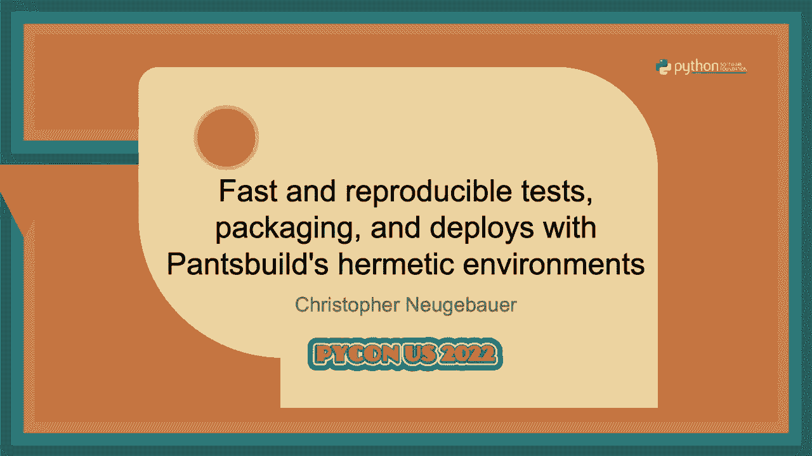
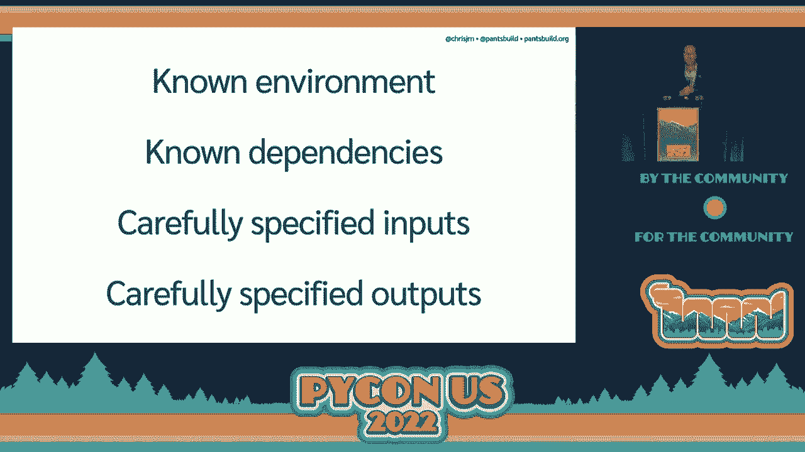
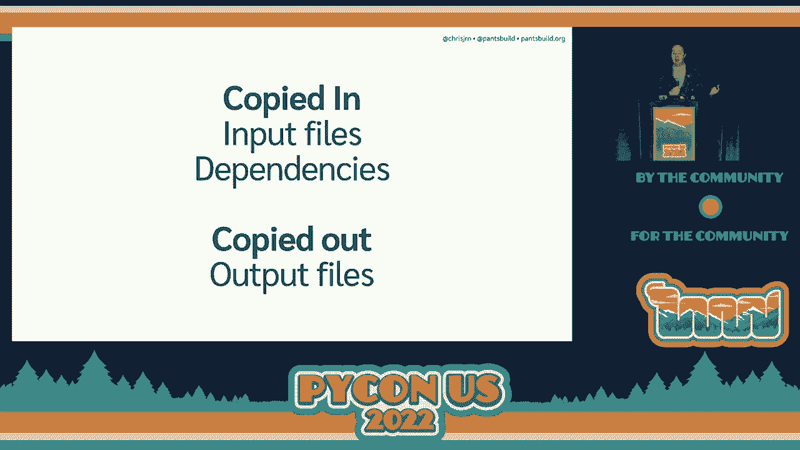

# 032：快速且可重复的测试、打包和部署 🚀

在本节课中，我们将要学习如何利用Pants构建系统来实现快速且可重复的测试、打包和部署。我们将探讨“密闭环境”的概念，了解它如何帮助我们对构建过程进行可预测的建模，从而实现高效的缓存和并行执行，最终节省开发时间。

---

## 概述 📋

本次课程内容基于PyCon 2022中克里斯托弗·诺伊格鲍尔关于Pants构建系统的演讲。Pants是一个构建系统，它起源于编译语言，旨在协调与代码交互的所有工具，包括测试、类型检查、代码格式化、打包等。我们的核心目标是理解如何通过创建“密闭环境”来确保构建过程的可重复性，从而解锁缓存、并行化等高级功能，让开发工作流更加高效。

---

## P32：1：Pants构建系统简介

首先，我们来快速介绍一下Pants构建系统以及它旨在解决的一些问题。

Pants是一个构建系统，其理念源于编译语言。在这些语言中，你需要以特定顺序运行许多程序才能使代码工作。Pants协调所有与代码交互的工具，涵盖了从代码检查、测试到为部署构建软件包的全过程。

即使在Python这样不需要显式编译步骤的语言中，Pants仍然可以帮助协调诸如PyTest、MyPy、Flake8和Black等工具，让你能更高效地运行它们，并且只需与一个工具交互。

在进入核心概念前，我们需要明确几个Pants中的关键术语：
*   **目标**：用户要求Pants完成的事情，例如运行测试或打包库。
*   **规则**：Pants为完成目标而需要执行的独立步骤。
*   **进程**：Pants所协调的实际底层工具（如`pytest`）的运行实例。

本次讨论聚焦于Pants 2，这是一个由开源社区从头构建的新版本，特别考虑了Python开发者的体验。Pants的目标是能够伴随代码库一起成长，支持多语言，并且在大型代码库中保持高效。

Pants的一个关键优势是智能化地运行任务。例如，当你修改一个文件后再次运行测试时，Pants通过静态分析理解代码依赖关系，只会重新运行受影响的测试，而不是整个测试套件。这能显著加快开发迭代速度。

为了进一步扩展效率，Pants致力于支持远程缓存和远程执行。这意味着如果团队中一个成员运行了某个特定规则，其他成员需要相同结果时可以直接从缓存获取，无需重复运行。这引出了一个核心问题：**我们如何确保规则的结果是可靠且可重复的？** 如果可以确信再次运行同一规则会产生完全相同的结果，那么缓存才安全有效。

---

## P32：2：理解可重复性

上一节我们介绍了Pants的目标和缓存带来的效率提升，本节中我们来看看实现这一切的基础：可重复性。

可重复性是指，如果你运行相同的规则，你将会得到相同的结果。这听起来简单，但“相同”的含义需要明确。在开源领域，你可能听说过“可重现构建”，它追求密码学级别的保证，确保二进制包严格对应一组源文件。

然而，对于大多数内部开发团队而言，我们并不需要这种级别的绝对保证。我们更关心的是**有用的正确性**和**开发速度**。对我们来说，可重复性意味着能够确保无论规则是顺序运行还是并行运行，你都无法获得不同的结果。

从数学模型上看，我们将每个规则视为一个纯函数：相同的输入应产生相同的输出。对于完全在Pants内部Python代码中实现的规则，这很容易保证。真正的挑战在于**进程**——那些由Pants协调的底层工具（如`pytest`）的运行实例。进程受依赖版本、操作系统特性等多种因素影响，难以建模。

因此，我们需要让进程的执行变得可预测。我们无法依赖“在我机器上能工作”这种不可重现的情况。我们需要确保，只要从相似的环境开始，就不会得到错误的结果。那么，什么是“相似的环境”呢？

对于Python工具，环境主要由四个方面构成：
1.  **操作系统**（包括架构）。
2.  **Python解释器版本**。
3.  **依赖项版本**（通过锁定文件精确指定）。
4.  **工具本身的配置**。

在传统工作流中，逐步添加依赖可能导致本地环境与代码库指定的环境发生偏离。为了获得可预测性，最好的方法是为**每个进程**创建一个全新的、符合要求的干净环境。这样做的好处是：
*   可以独立管理不同工具的版本和依赖。
*   避免了进程间因共享环境而产生的副作用干扰。

如果我们允许进程保留副作用，那么进程的行为就会依赖于它们运行的顺序，这使得建模和缓存变得极其复杂。相反，密闭环境将每个进程的副作用隔离，只捕获我们真正关心的输出。

---

## P32：3：实现密闭环境与沙箱技术

上一节我们探讨了可重复性的重要性以及密闭环境的概念，本节中我们来看看如何实际创建这些密闭环境，这涉及到沙箱技术。

沙箱的目标是将进程彼此隔离，确保它们的执行不会相互干扰。最彻底的隔离方式包括使用专用机器、容器（如Docker）或chroot监狱。Docker能提供很好的隔离，但对于需要频繁创建和销毁环境的构建任务来说，其性能开销可能过大。

因此，所有沙箱方法都需要在**隔离级别**和**构建速度**之间进行权衡。关键在于，我们实际需要多少隔离？对于Pants运行的构建工具，我们不需要像运行不受信代码那样严格的安全隔离。因为这些工具本身是受信的，并且它们的工作量是可预测的——通常只读取指定文件，并输出到指定位置。

所以，Pants采用的是一种更轻量级的隔离方式。它不会在完全隔离的容器中运行进程，而是在主操作系统中运行。但是，Pants会将进程的工作目录设置在一个全新的临时目录中，并从头设置环境变量（类似于虚拟环境`venv`的做法，但更彻底）。Pants运行的工具通常是“行为良好”的，它们会遵从配置，从指定位置加载依赖，而不会随意访问系统其他部分。

为了创建这个环境，Pants会将所需的输入文件和依赖项复制到这个临时目录中。进程完成后，Pants只将构建产物（我们关心的输出文件）复制出来，然后丢弃整个临时环境。这样就实现了进程间的隔离。

---

## P32：4：Pants的核心机制：摘要与缓存

上一节我们了解了Pants如何利用轻量级沙箱创建密闭环境，本节中我们深入探讨Pants实现高效缓存的核心机制：内容可寻址存储和“摘要”。

缓存规则结果的前提是，计算缓存键的成本必须低于重新运行规则的成本。如果为了准备环境而进行大量的文件复制，导致过程变慢，用户是无法接受的。因此，Pants需要一种高效的方式来回答“我们是否已经运行过这个特定任务？”这个问题。

在密闭环境中，这个问题等价于：如果我们有相同的输入文件、相同的配置和相同的依赖，我们是否会得到相同的结果？直接比较文件系统上的文件是缓慢且不可靠的，因为文件是可变的。

Pants通过使用**内容可寻址存储**（底层使用LMDB）来解决这个问题。它允许我们以一种不受文件系统限制的方式来推理文件。对于规则作者和Pants内部来说，操作的基本单元不是单个文件，而是称为**摘要**的东西。

**摘要**是对一组文件的轻量级、不可变的引用。它基于文件内容生成，因此内容相同的文件集会得到相同的摘要。摘要非常轻量，使得它们作为缓存键的成本极低。

以下是Pants中进程执行模型的关键步骤：
1.  进程的输入（源文件、依赖项）被表示为摘要。
2.  当需要运行进程时，Pants检查缓存中是否存在由“命令、环境变量、输入摘要”等参数构成的键。
3.  如果存在，则直接返回缓存的结果。
4.  如果不存在，Pants才会将摘要所代表的文件**物化**到临时目录中，然后运行进程，并将输出捕获为新的摘要存入缓存。

这种方法的美妙之处在于，我们只在绝对必要时（即缓存未命中且需要实际运行进程时）才进行文件I/O操作。摘要的合并、比较等操作都在内存中高效完成，这极大地降低了协调任务和计算缓存键的开销。

---

## 总结 🎯

本节课中我们一起学习了Pants构建系统如何通过“密闭环境”来实现快速且可重复的构建。

我们首先了解到，通过对构建过程进行可预测的建模，可以智能地运行或跳过任务，从而节省时间。然后，我们探讨了实现可预测性的核心——创建密闭环境，它将每个进程隔离，只保留我们关心的输出。接着，我们看到了Pants如何利用轻量级的沙箱技术（而非重型容器）在性能和隔离之间取得平衡。最后，我们深入了解了Pants高效缓存机制的核心：使用内容可寻址存储和“摘要”来廉价、可靠地表示和比较文件集，这使得缓存查询变得快速，从而让“不运行”任务成为最快的选择。

通过结合密闭环境、轻量级沙箱和基于摘要的缓存，Pants构建系统能够为Python项目（以及多语言项目）提供高效、可靠且可扩展的开发工作流。