# 034：为什么我在游戏引擎中重新实现 Trio 🎮


在本教程中，我们将学习如何在游戏引擎中应用“结构化并发”的概念。我们将从传统的游戏循环开始，逐步探讨如何利用协程和任务来组织游戏逻辑，最终理解为何要借鉴 Trio 库的思想来构建更清晰、更健壮的游戏代码。

## 概述：游戏循环与场景图 🔄

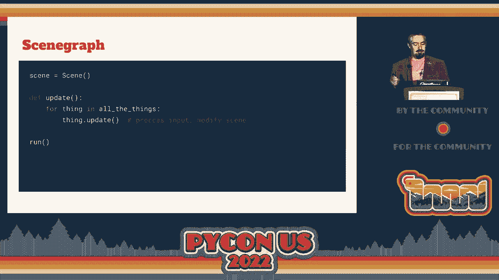

大多数游戏引擎的核心是一个事件循环。这个循环会以固定的频率（例如每秒60次）调用两个主要函数：`update` 和 `draw`。

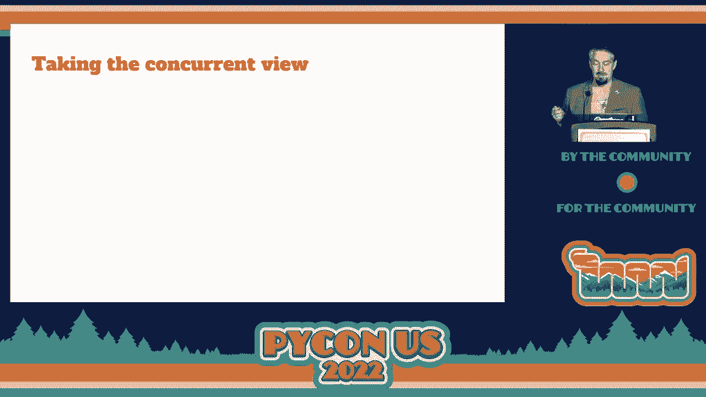

*   **`update`** 函数负责更新所有游戏逻辑。
*   **`draw`** 函数负责将内容绘制到屏幕上。

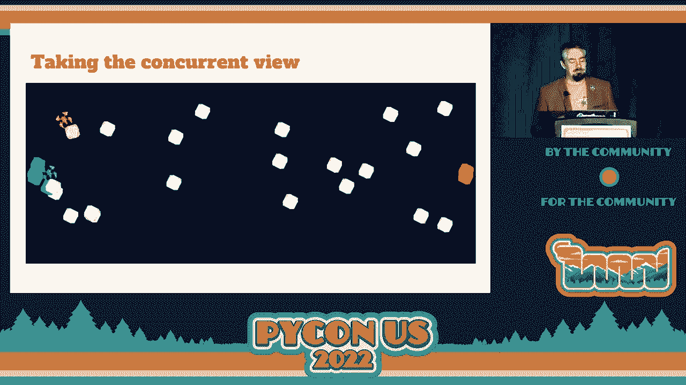

许多游戏引擎（如 PyGame Zero、Wasabi2D）会封装这个事件循环，提供一个简单的 `run` 函数，开发者只需传入 `update` 和 `draw` 函数即可。

接下来，一个常见的优化是引入**场景图**。场景图是一个数据结构，用于表示屏幕上需要绘制的内容。引擎负责高效地绘制场景图，例如剔除不可见的对象。此时，`update` 函数的职责就变成了更新场景图中的数据，以便 `draw` 函数能正确渲染。

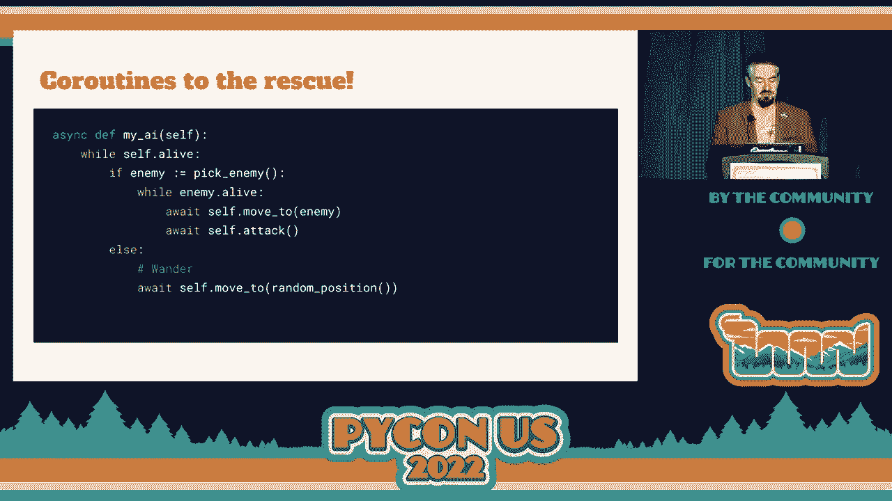

从本节开始，我们将假设场景图已经存在，并专注于游戏逻辑的组织。

## 游戏中的并发需求 🤹

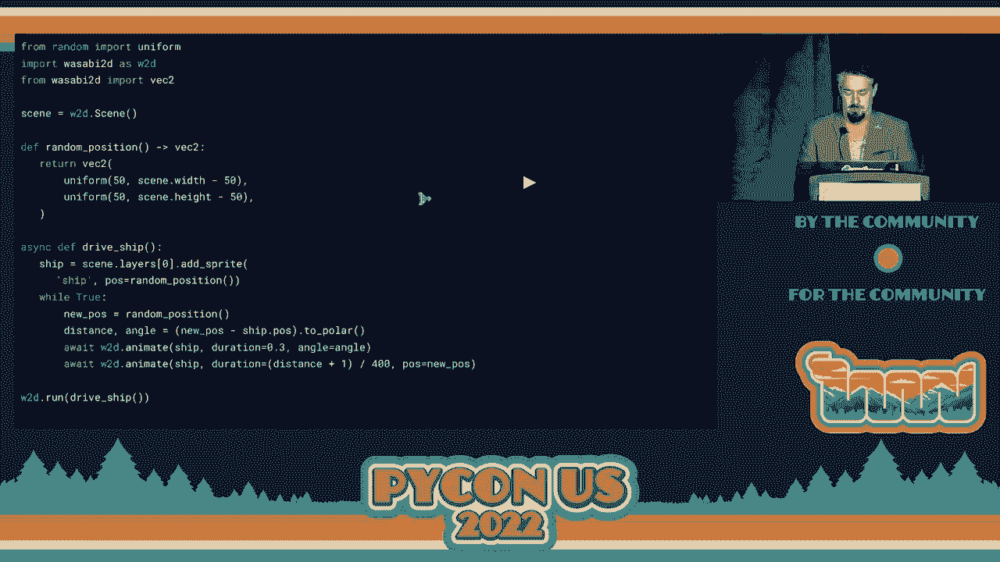

现在，让我们看看游戏中并发编程的现状。考虑以下两种情况：

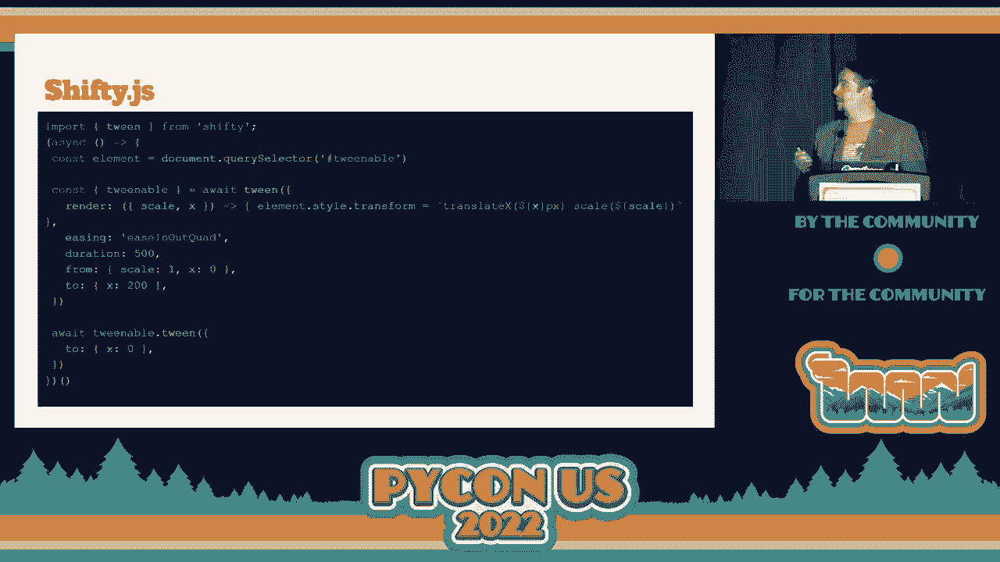

1.  **大量物体同时移动**：例如，屏幕上成百上千的粒子以相同模式运动。这可以写成一个向量化的函数来高效处理。
2.  **多个角色独立行为**：例如，游戏中的两个角色执行完全不同的动作序列。这更容易被视为两个独立的任务或协程，它们只是恰好在同一个游戏循环中运行。

传统的 `update` 函数在处理复杂并发逻辑时会变得混乱：它包含大量状态变量，逻辑交织在一起，难以阅读和重构。当某些行为暂时不活跃时，函数中还会出现“空转”的提前返回。

## 协程：更清晰的解决方案 ✨

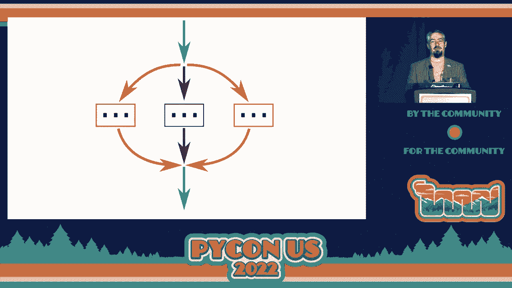

协程提供了一种更优雅的解决方案。在 Python 中，使用 `await` 关键字可以暂停一个函数的执行，将控制权交还给事件循环，稍后再恢复执行。

协程的优势在于：
*   一个任务的当前状态由其局部变量和程序计数器位置自动保存。
*   一个协程函数可以完整地描述一个对象从开始到结束的行为，代码可读性更高。

以下是 Wasabi2D 中的一个示例，它展示了一个驱动小船移动的协程：

```python
async def drive_ship():
    ship = scene.add_sprite('ship', pos=random_position())
    while True:
        target = random_position()
        await ship.animate_angle_to(target, duration=0.5) # 转向目标
        await ship.animate_pos_to(target, duration=2.0)   # 移动到目标
```

在这个例子中，`drive_ship` 协程清晰地表达了“小船永远循环：选择一个随机目标，转向它，然后移动过去”这一完整行为。我们将这个协程传递给引擎的 `run` 函数，它就成了我们的游戏逻辑本身。

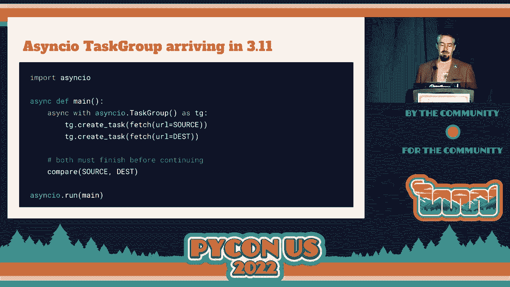

## 什么是结构化并发？ 🌳

我们已经看到了使用协程实现并发的能力。那么，什么是**结构化并发**呢？

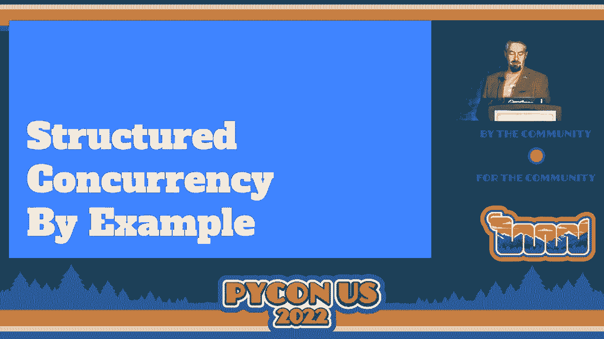

其核心思想是：**每当控制流分裂成多个并发路径时，必须确保它们最终能重新汇聚。** 换句话说，并发任务的生命周期应该被嵌套在一个明确的作用域内。

我们可以借用 Trio 库作者 Nathaniel Smith 的比喻：想象一个绿色任务（父任务）启动了几个蓝色子任务。在结构化并发中，所有蓝色子任务都必须在绿色任务继续执行之前完成。

以下是 Trio 中的代码示例：

```python
async def fetch_two():
    async with trio.open_nursery() as nursery:
        nursery.start_soon(fetch, ‘url1‘)
        nursery.start_soon(fetch, ‘url2‘)
    # 只有上面两个任务都完成后，才会执行到这里
    print(“Both fetches complete”)
```

`async with` 块定义了一个“育儿室”（nursery）作用域。在这个作用域内启动的任务，会在退出该作用域时（即 `async with` 块结束时）被自动等待。这保证了任务的生命周期是结构化的、可预测的。

相比之下，标准的 `asyncio.gather` 虽然也能等待多个任务，但它缺乏严格的“所有权”概念。任务可以在 `gather` 之外创建和存活，如果一个任务抛出异常，其他任务可能不会自动取消，这可能导致资源泄漏或不可预期的状态。

Wasabi2D 和 Python 3.11+ 的 `asyncio.TaskGroup` 都采用了类似 Trio 的结构化并发模型。

## 结构化并发在游戏中的应用 🚀

结构化并发如何让游戏编程受益呢？让我们通过一个“无尽敌舰波次”的游戏例子来说明。

以下是核心逻辑的简化表示：

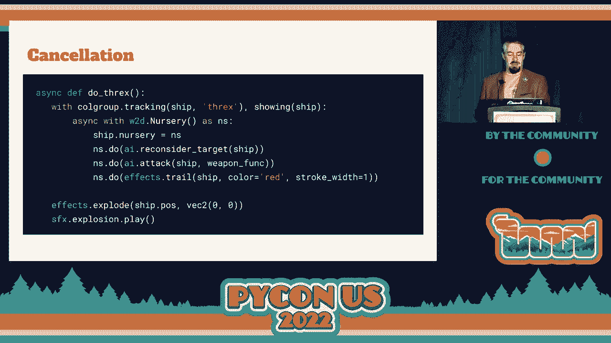

```python
async def level():
    for wave_number in tools.count(): # 无限波次
        await sleep(2) # 每波开始前暂停
        async with nursery() as wave_nursery:
            for _ in range(10):
                wave_nursery.start_soon(spawn_enemy_ship())
        # 只有当这波所有敌舰都被击败后，才会进入下一波
```


在这个模型中：
*   **行为被分解为任务**：每艘敌舰、每个子弹、每个动画效果都可以是育儿室中运行的一个独立协程任务。
*   **取消是关键原语**：育儿室可以被取消。取消一个育儿室会向其内部所有正在运行的任务抛出取消异常，从而干净地终止整个子树的任务。例如，当敌舰被子弹击中时，我们可以取消运行该敌舰行为的育儿室，然后播放爆炸动画。
*   **简化资源管理**：结合 Python 的上下文管理器（`async with`），可以确保资源（如图形效果、碰撞检测器）在任务退出时被正确清理，无论任务是正常完成还是被取消。
*   **提升代码可读性与可重构性**：每个协程都描述了一个自包含的行为。你可以轻松地组合、调用或替换它们，因为它们是结构化的、生命周期明确的任务。

## 同步与通信：事件对象 📨

除了取消，任务间还需要通信。Trio 和 Wasabi2D 提供了**事件对象**（`Event`）来实现同步。

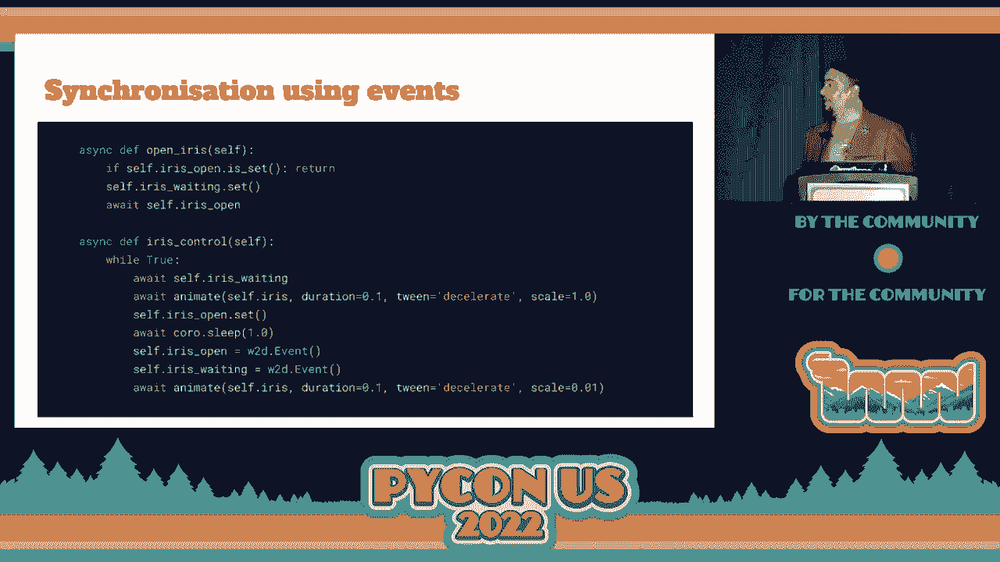

例如，在一个游戏中，有一个“能量提升”生成器：
1.  生成器协程创建一个能量道具，并设置一个“未被收集”的事件。
2.  然后它等待这个事件。
3.  当玩家碰撞收集到这个道具时，另一个协程会“设置”该事件。
4.  生成器协程被唤醒，关闭道具的灯光，然后重新开始循环。

这种基于事件的通信方式，使得不同任务能清晰地协调，而无需共享复杂的可变状态。

## 为什么在游戏引擎中重新实现？ ⚙️

既然 Trio 如此优秀，为什么要在游戏引擎（Wasabi2D）中重新实现类似的概念呢？主要原因是**调度模型和时间概念的差异**。

1.  **调度顺序**：
    *   **Trio (I/O)**：当多个任务就绪时，Trio 的调度策略可能是随机的，以避免用户依赖某种特定顺序。
    *   **游戏引擎**：需要确定性。Wasabi2D 选择按任务创建顺序来运行，确保每一帧内所有逻辑更新的顺序一致，避免因调度抖动导致的视觉或逻辑问题。

2.  **时间模型**：
    *   **Trio (连续时间)**：时钟是连续的，`await` 可能在任何时刻恢复。
    *   **游戏引擎 (离散时间)**：时间是按帧离散前进的。在一帧之内，时钟“凝固”。所有 `update` 逻辑必须在本帧内完成，然后才会推进时间并绘制下一帧。这保证了游戏状态在帧与帧之间是同步的。

因此，虽然共享核心的结构化并发理念，但游戏引擎需要一套在离散时间、确定性帧循环下工作的并发原语。

## 总结 📝

在本节课中，我们一起学习了：

1.  **从游戏循环到协程**：传统的 `update` 函数在复杂逻辑下会变得混乱，而协程能以更清晰、线性的方式描述对象行为。
2.  **结构化并发**：通过“育儿室”（Nursery/TaskGroup）将并发任务的生命周期约束在明确的作用域内，确保任务能正确启动、汇聚和清理。
3.  **在游戏中的应用**：结构化并发允许我们将游戏对象的行为拆分为独立、可组合的协程任务。**取消**机制成为管理对象生命周期（如敌舰死亡）的强大工具，结合上下文管理器能有效避免资源泄漏。
4.  **引擎的特别考量**：由于游戏对确定性和离散时间步长的要求，需要在游戏引擎内实现一套适配的、基于结构化并发理念的运行时，而不是直接使用为 I/O 设计的异步库。

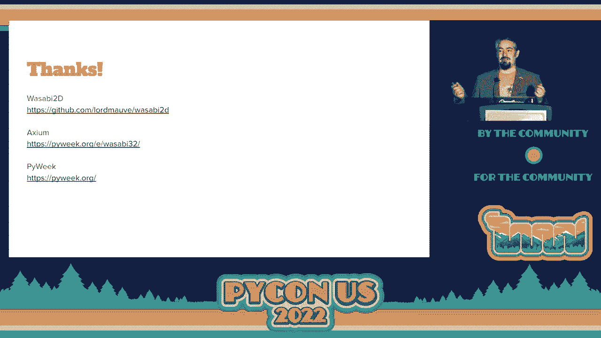

最终，在游戏引擎中采用结构化并发，带来了一种几乎可以消除状态管理错误的编程模型。它让添加动画、编写复杂对象行为、以及重构代码都变得更加简单和可靠，因为每个任务都是自包含且生命周期得到严格管理的。