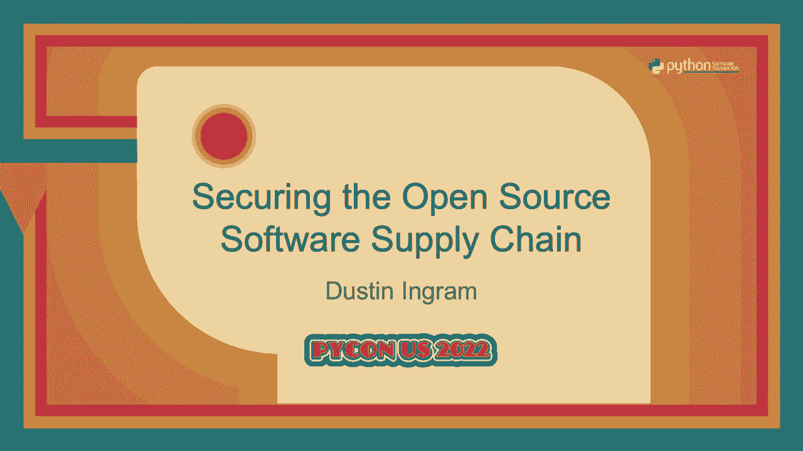
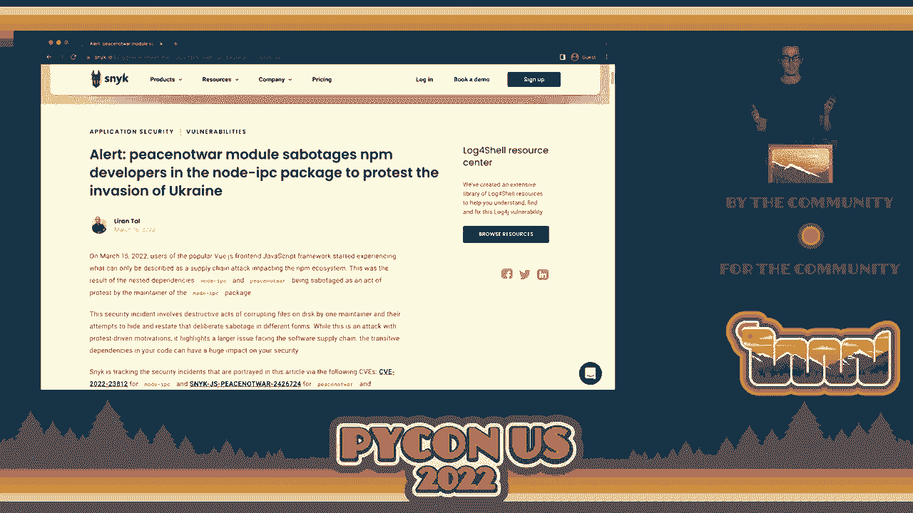
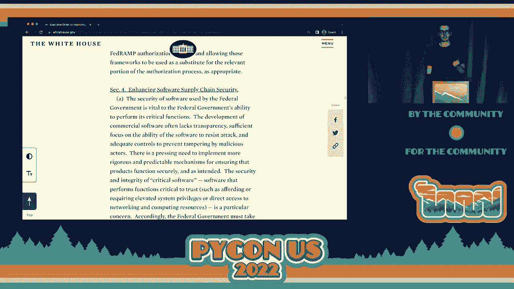
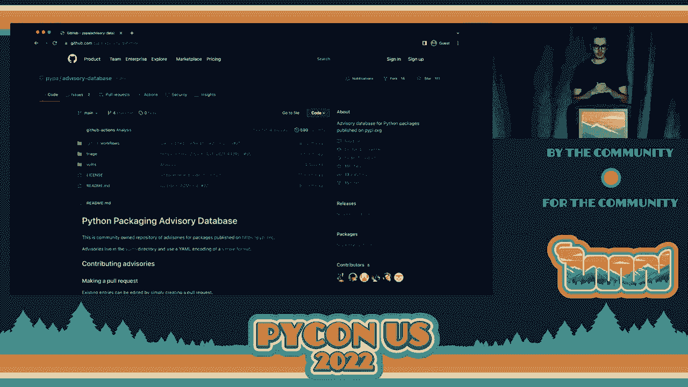
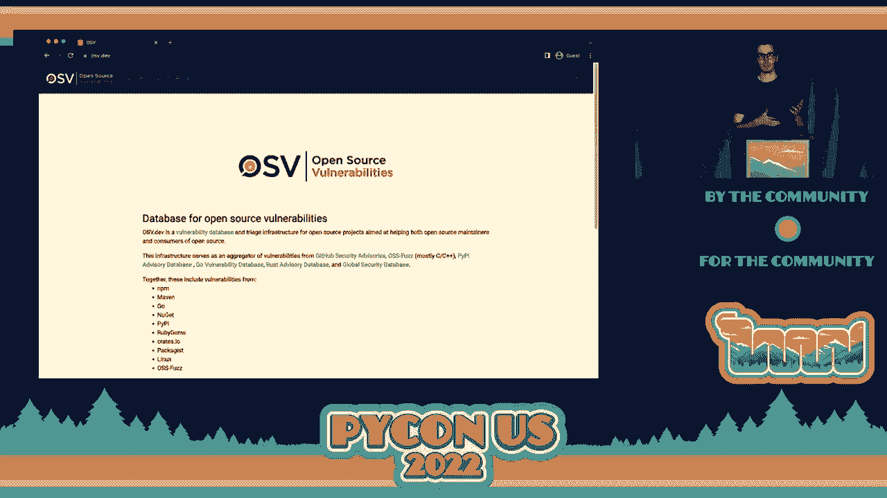
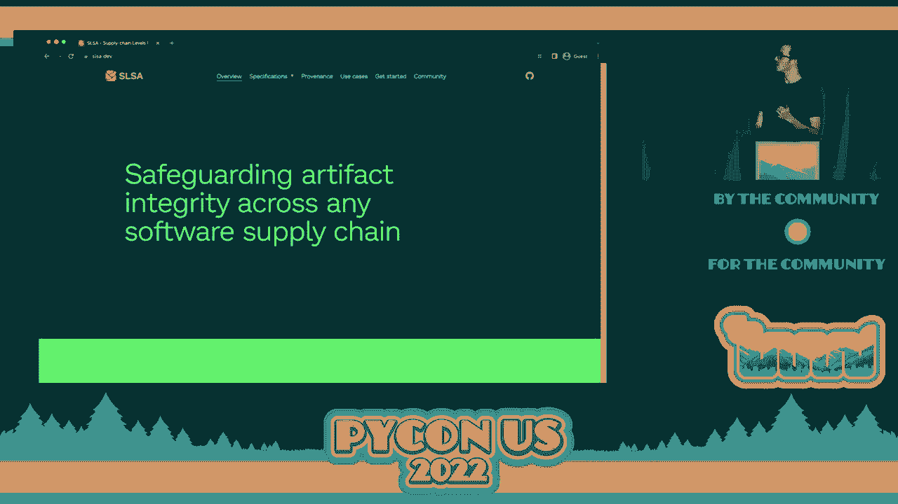
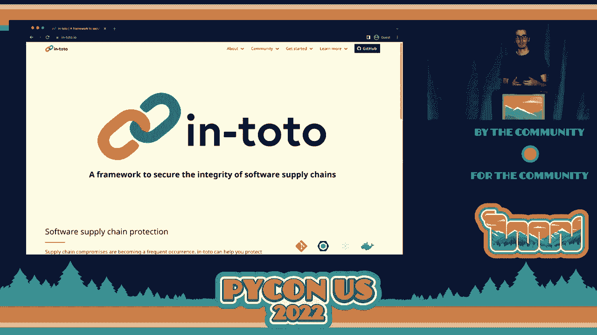

# 036：演讲 - 达斯汀·英格拉姆



## 概述

在本节课中，我们将学习如何保障开源软件供应链的安全。课程内容基于达斯汀·英格拉姆（谷歌开源安全团队软件工程师）的演讲，涵盖了开源安全的核心概念、当前面临的挑战以及一系列新兴的工具和实践。我们将从基本术语开始，逐步深入到具体的安全措施和未来展望。

## 第一部分：核心概念与背景

### 开源软件供应链安全：P36.1：引言与核心问题

开源软件是现代软件开发的基础。达斯汀·英格拉姆作为谷歌开源安全团队的成员，将探讨如何保障这一庞大供应链的安全。


使用开源软件安全吗？答案是肯定的。每天都有海量的开源软件被成功部署和使用。然而，这并不意味着开源软件已经达到了其可能的最佳安全状态。安全与否，很大程度上取决于**如何使用它**以及你的**威胁模型**。



因此，更准确的问题是：**我们如何安全地使用开源软件？**


### 开源软件供应链安全：P36.2：为什么供应链安全至关重要

要理解如何保障安全，首先需要理解什么是软件供应链。**软件供应链**是创建和使用软件所涉及的一切，包括所有代码、库、工具和基础设施。

那么，为什么软件供应链安全现在成为一个重大问题？



几乎所有人都在使用开源软件。过去，我们对开源软件的创建、分发和消费做出了一些错误的假设，认为事情不会出错。然而，近期发生的一系列安全事件改变了这一看法。

以下是近期一些备受关注的供应链安全事件：
*   **恶意库**：在公共软件包仓库（如PyPI、npm）上发布了包含恶意代码的库。
*   **新型供应链攻击**：针对大型企业的复杂攻击。
*   **Log4Shell漏洞**：一个广泛使用的Java日志库中存在的严重远程代码执行漏洞，影响巨大。
*   **Protestware**：一类出于政治或社会抗议目的而修改行为的软件。
*   **SolarWinds事件**：一次极其复杂、针对美国政府的国家级网络攻击。

目前对开源软件供应链安全高度关注的一个主要推动力，是美国**总统行政命令14028**，该命令旨在改善国家的网络安全。这项命令为整个软件行业（而不仅仅是政府）设定了更高的安全标准，产生了广泛的“良性病毒”效应。

## 第二部分：安全供应链核心概念解析

上一节我们介绍了供应链安全的重要性，本节中我们将深入理解其核心概念。我们将采用“AVC”的方式，梳理关键术语。

### 开源软件供应链安全：P36.3：从A到Z的关键术语

以下是构建安全软件供应链所需理解的核心概念：

**A - 工件 (Artifact)**
工件是独特的数据块，例如一个文件。在Python生态中，PyPI上的每个`.whl`或`.tar.gz`文件都可以被视为一个工件。公式表示为：`Artifact = Unique(Data)`。

**A - 认证 (Attestation)**
认证是加密安全且可验证的元数据，用于证明某个事件或状态的发生。它本质上是经过数字签名的声明。

**A - 安全公告 (Advisory)**
安全公告是对一个或多个工件中已知漏洞的公开披露。例如CVE（公共漏洞与暴露）。它只涵盖我们已知的漏洞。

**B - 构建 (Build)**
构建是将源代码（如Git仓库）转换为可分发工件的过程。构建环境的安全性至关重要。

**C - 证书 (Certificate)**
证书是从受信任的根证书颁发机构建立信任的基石。在现代供应链中，证书用于验证身份和签名。

**D - 摘要 (Digest)**
摘要通常指哈希摘要（如SHA-256），它是一个唯一且不可逆的数值，用于代表特定数据块。`Digest = Hash(Data)`。

**E - 短暂性 (Ephemeral)**
在密钥上下文中，短暂性指密钥是临时生成、使用后即丢弃的。这与需要长期保管的私钥形成对比。

**F - 模糊测试 (Fuzzing)**
模糊测试是一种安全测试技术，通过向程序输入大量畸形或意外的数据来发现潜在漏洞。

**I - 身份 (Identity)**
身份不仅指个人（如邮箱、GitHub账号），也包括自动化实体（如GitHub Actions工作流）。这些身份可用于进行数字签名。

**K - 密钥 (Key)**
非对称加密中的公钥和私钥对。私钥用于生成签名，公钥用于验证签名。`Verify(Signature, PublicKey) == True`。

**L - 锁定文件 (Lockfile)**
锁定文件是应用程序所依赖的确切工件的完整清单，包括版本和哈希值。例如`Pipfile.lock`。

**O - OpenID Connect (OIDC)**
OIDC是建立在OAuth 2.0之上的身份层。它允许服务（如CI/CD平台）为工作流提供可验证的身份，这在自动化签名中非常有用。

**P - 来源证明 (Provenance)**
来源证明是描述工件完整历史的可验证记录，包括其来源、构建者、构建环境等信息。

**P - 策略 (Policy)**
策略是描述安全期望或要求的规则集合，可以针对代码库、组织或依赖项进行定义和评估。

**S - 签名 (Signature)**
签名是使用私钥对数据（如工件）进行加密处理的结果，提供可验证的批准证明。





**T - 透明日志 (Transparency Log)**
透明日志是已签名元数据的公共、不可变的记录。任何人都可以查看和审计，确保日志内容不被篡改。

**V - 漏洞 (Vulnerability)**
漏洞是软件中的安全缺陷。它们可以是已知的（有安全公告）或未知的（零日漏洞）。

## 第三部分：实践安全使用开源软件

理解了基本概念后，我们来看看如何将这些概念付诸实践，安全地使用开源软件。

### 开源软件供应链安全：P36.4：漏洞管理与审计


保障供应链安全的第一步是管理已知风险。以下是相关工具和实践：


**社区安全公告数据库**
这是一个集中式的、针对特定生态系统的公共漏洞信息库。Python生态系统的公告数据库是[PyPI Advisory Database](https://github.com/pypa/advisory-database)。它的目标是让报告和发现漏洞变得更加容易。

**OSV（开源漏洞）数据库**
OSV是一个中立的聚合器，它从各个生态系统的公告数据库（包括PyPI的）中收集漏洞信息，并通过统一的API提供。

**漏洞审计工具：pip-audit**
`pip-audit`是一个开源工具，它使用OSV数据库的API来扫描Python环境或`requirements.txt`文件，检查是否存在已知漏洞。


你可以通过以下方式使用它：
```bash
# 安装
pip install pip-audit

# 扫描当前环境
pip-audit

# 扫描指定的requirements文件
pip-audit -r requirements.txt

# 自动修复（升级到安全版本）
pip-audit --fix
```
运行后，它会列出发现的漏洞、受影响的包以及建议的修复版本。

### 开源软件供应链安全：P36.5：工件签名与身份验证

传统的GPG签名因密钥管理复杂和信任建立困难而难以普及。新兴的**Sigstore**项目提供了一种全新的解决方案。


Sigstore的核心创新点包括：
1.  **短暂密钥**：每次签名都生成新的密钥对，用后即弃，无需长期管理私钥。
2.  **基于身份的签名**：使用OIDC身份（如GitHub账户、Google账户）进行签名，解决了“谁签的名”的信任问题。
3.  **证书颁发**：一个证书颁发机构（CA）将短暂的公钥与签名者的OIDC身份绑定，颁发短期有效的证书。
4.  **透明日志**：每次签名记录都会发布到公共的、不可篡改的透明日志（Rekor）中，供所有人验证。



对于Python用户，可以使用`sigstore-python`库来签署和验证工件。
```bash
# 安装
pip install sigstore


# 使用GitHub Actions环境身份签署一个文件
sigstore sign my-package.whl
```



### 开源软件供应链安全：P36.6：构建安全与策略执行

**SLSA（软件工件的供应链级别）**
SLSA是一个安全框架，用于评估和提升软件构建过程的安全性。它定义了从SLSA 0到SLSA 3的级别，级别越高，构建过程的可信度和安全性越高。

**In-Toto框架**
In-Toto是一个提供供应链完整性的框架。它通过生成**来源证明**，记录并验证软件从源码到产物的每一步操作，确保构建过程未被篡改。

**GitHub安全策略执行：Allstar**
Allstar是一个GitHub应用程序，用于为仓库或整个组织设置和执行安全策略。例如，它可以强制要求分支保护、检查是否禁用了危险设置、或确保使用了双因素认证等。

### 开源软件供应链安全：P36.7：PyPI的增强安全措施

Python包索引（PyPI）正在引入多项重要的安全增强功能：
*   **强制双因素认证（2FA）**：对于下载量前1%的关键项目及其维护者，将强制启用2FA。
*   **硬件安全密钥赠送**：为了支持强制2FA，谷歌将向符合条件的PyPI维护者赠送数千个Titan安全密钥。
*   **无凭证发布**：未来将支持通过OIDC身份（如GitHub Actions工作流身份）直接向PyPI发布包，无需使用密码或API令牌。
*   **仓库元数据签名**：通过PEP 458（TUF）和PEP 480（开发者签名）等提案，为PyPI的元数据和工件提供端到端的签名验证。

## 第四部分：总结与未来展望

### 开源软件供应链安全：P36.8：协作、行动与总结

**如何共同推进供应链安全**
1.  **供应商中立的协作**：通过**OpenSSF（开源安全基金会）** 等组织，各大公司可以协作推进像Sigstore、SLSA这样的公共安全项目。
2.  **资金与赞助**：对Python软件基金会（PSF）、OpenSSF等进行经济赞助，支持其安全计划。
3.  **参与和贡献**：作为用户，积极使用新的安全工具；作为开发者，为这些开源安全项目贡献代码或反馈。

**对未来的预测**
*   对于开源仓库、安装器或维护者，将迎来更多的关注和资源投入。
*   开源维护者将被要求采用新的安全实践（如2FA）。
*   开源用户需要主动提升相关知识，以适应日益增强的安全生态。

**总结**
在本节课中，我们一起学习了开源软件供应链安全的完整图景：
*   我们探讨了供应链安全为何至关重要，并理解了核心术语。
*   我们介绍了管理已知漏洞的工具（如`pip-audit`）和数据库。
*   我们深入了解了基于身份的现代签名方案**Sigstore**，它解决了传统GPG签名的痛点。
*   我们了解了提升构建过程安全性的框架**SLSA**和**In-Toto**。
*   我们展望了PyPI即将推出的关键安全增强功能。
*   最后，我们认识到通过**OpenSSF**等组织的协作以及社区的广泛参与，是构建更安全开源生态的关键。


保障开源软件供应链安全是一个持续的过程，需要工具、实践和社区共同努力。现在，是开始行动的时候了。