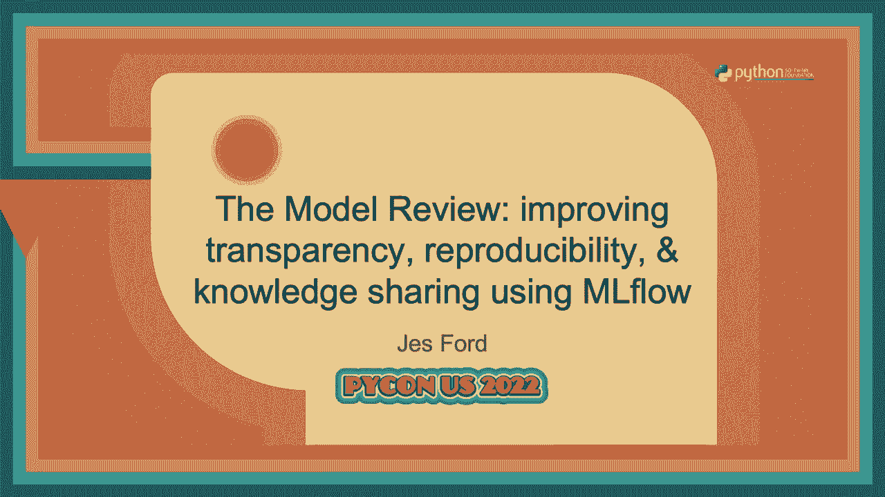
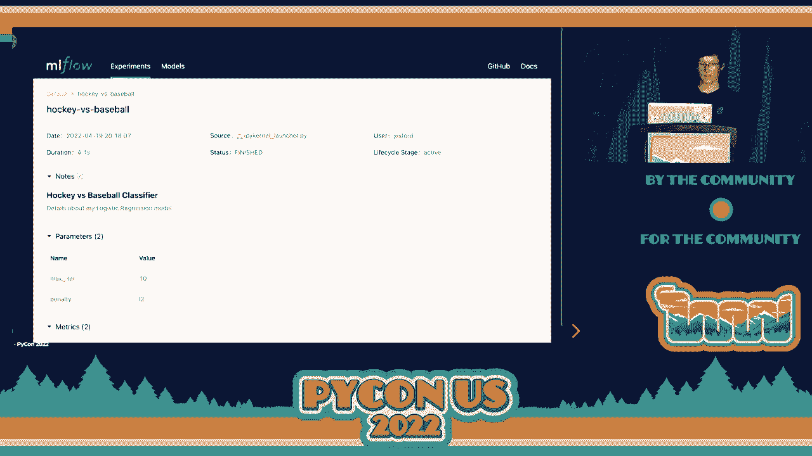
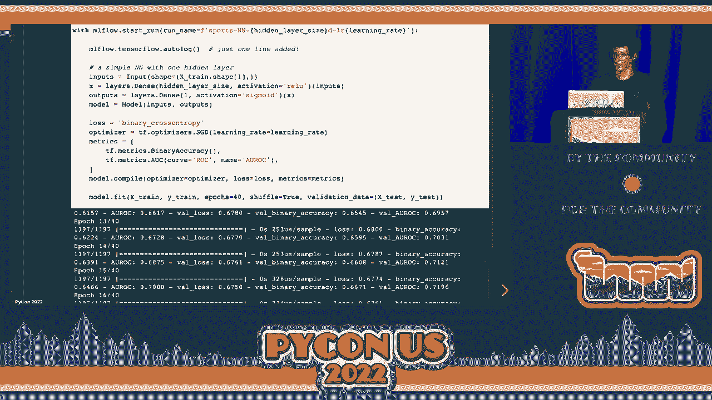
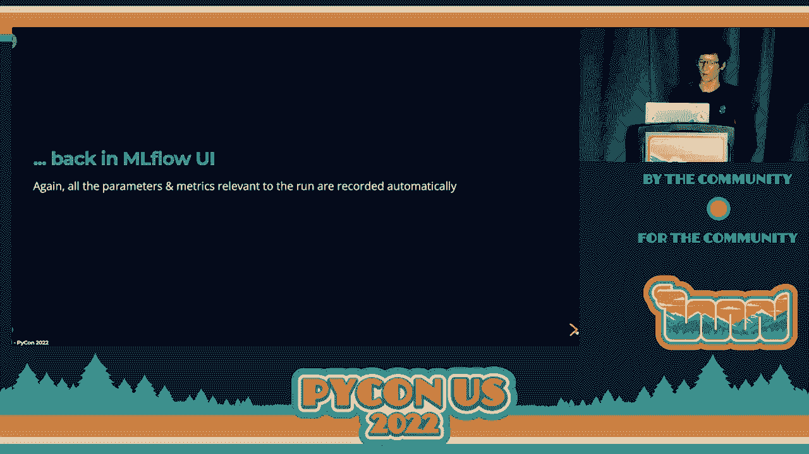
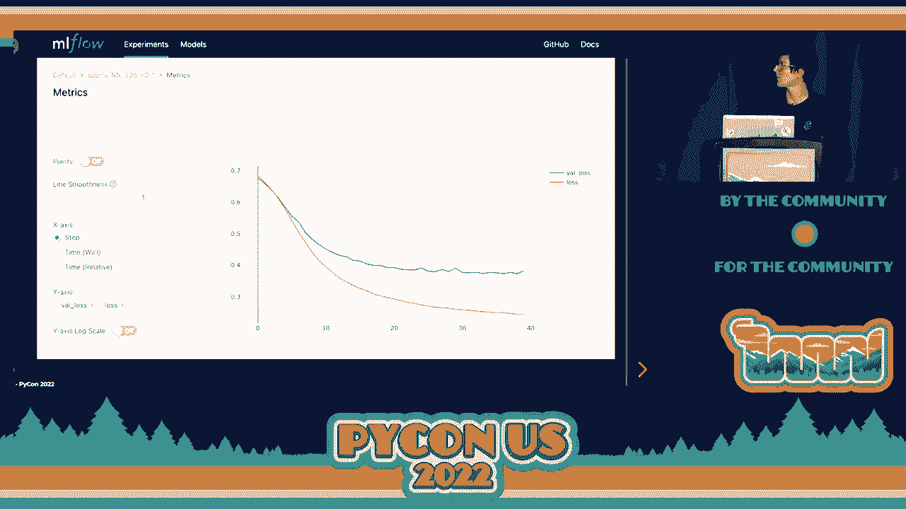
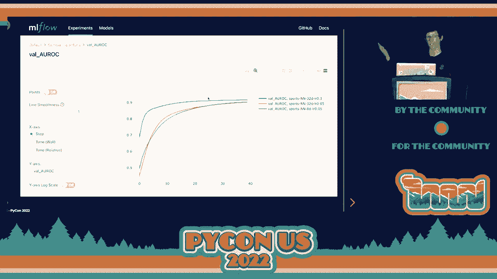

# 043：使用MLflow进行模型审核以提高透明度、可重复性与知识共享 🧠




在本节课中，我们将学习如何通过引入模型审核流程，并利用MLflow这一工具，来提升机器学习项目的透明度、可重复性和团队知识共享的效率。我们将从模型审核的必要性讲起，然后详细介绍MLflow的核心功能，最后展示如何将其整合到实际工作流程中。

## 模型审核的必要性

上一节我们介绍了课程目标，本节中我们来看看为什么需要模型审核。随着团队规模的扩大和模型部署频率的增加，缺乏系统化的记录会引发一系列问题。

在生产环境中，我们可能不清楚模型是如何被训练的，或者哪些建模技巧在特定领域效果最佳。当需要重新训练模型，或有新成员希望在前人工作基础上继续开发时，信息缺失会成为障碍。例如，部署前模型的准确率应该是多少？这类问题的答案往往依赖于个人对Jupyter笔记本的管理，虽然有人会将其提交到GitHub，但这并非一种健壮可靠的记录方式。

因此，我们需要为新流程设定明确的目标：
*   **透明度**：对模型训练和部署过程有清晰的记录。
*   **可重复性**：确保过去的实验能够被复现，便于他人或在后续工作中继续构建。
*   **知识共享**：建立一种格式，让团队成员能够相互学习，帮助新成员快速上手。
*   **自动化**：在实现上述目标的同时，尽可能减少额外的手动工作量。

模型审核与代码审查有相似之处，但也有其特殊性。代码审查关注代码本身，而模型审查则需要关注更广泛的上下文，这包括：
*   **模型性能**：在测试集上的表现，这并未硬编码在训练脚本中。
*   **数据**：使用了什么数据以及进行了哪些处理。
*   **实验过程**：在得到最终模型前尝试过的所有方法。

由于这些原因，我们不能仅通过审查代码来评估模型，这促使我们寻找像MLflow这样的专门工具。

## MLflow 简介

上一节我们探讨了模型审核的挑战，本节中我们来认识解决这些问题的核心工具——MLflow。MLflow是一个用于管理端到端机器学习生命周期的开源平台，它包含几个独立组件：
*   **Tracking（跟踪）**：用于记录机器学习实验。
*   **Projects（项目）**：以特定格式打包代码，便于重复运行。
*   **Models（模型）**：以标准格式保存模型，便于在各种环境中部署。
*   **Model Registry（模型注册表）**：管理模型的生命周期。

MLflow的优势在于它对编程语言和机器学习库没有特定要求，并提供了多种语言的API，非常灵活。本节课我们将重点介绍其**Tracking（跟踪）**功能。

### 开始使用 MLflow Tracking

MLflow Tracking 允许你轻松记录几乎任何内容。在机器学习场景下，这通常包括参数、指标、图表、文本文件等（这些文件在MLflow中被称为**Artifacts**），以及代码版本和训练数据信息。

你可以通过 `pip install mlflow` 来安装。让我们从一个简单的例子开始：

```python
import mlflow

# 记录一个参数和一个指标，MLflow会自动开始一次“运行”
mlflow.log_param("learning_rate", 0.01)
mlflow.log_metric("accuracy", 0.95)
```

在这里，`log_param` 和 `log_metric` 用于记录键值对。第一次记录内容时，MLflow会自动启动一次**运行**。你可以将一次运行视为一组有意义的、被记录在一起的实验数据。

更常见的做法是显式地开始一次运行，这提供了更好的控制：

```python
import mlflow

# 使用上下文管理器显式开始一次运行，并为其命名
with mlflow.start_run(run_name="log_artifacts_example"):
    mlflow.log_param("epochs", 10)
    mlflow.log_metric("loss", 0.2)
    
    # 记录一个Artifact（例如，一个文本文件）
    with open("output.txt", "w") as f:
        f.write("Hello MLflow!")
    mlflow.log_artifact("output.txt")
```

### 查看记录结果

运行上述代码后，记录的数据去了哪里？你可以在终端执行 `mlflow ui` 命令来启动一个本地Web服务器。在浏览器中打开提供的URL，你将看到MLflow的实验页面。

以下是默认的MLflow UI界面展示：


这个表格列出了你所有的MLflow运行。点击某次运行，例如名为“log_artifacts_example”的运行，可以进入详情页：


详情页展示了该次运行的元数据（如时间、持续时间）、所有记录的参数和指标，以及Artifacts列表。你可以直接点击Artifact文件在浏览器中查看。


默认情况下，所有数据都记录在本地。为了团队协作和集中比较，你可以设置一个**远程跟踪服务器**，让所有成员将日志记录到同一位置。

## 在机器学习项目中使用 MLflow

上一节我们了解了MLflow的基础操作，本节中我们将其应用于一个实际的机器学习示例。我们将使用scikit-learn构建一个简单的文本分类器，区分关于“冰球”和“棒球”的新闻。

核心训练代码可能如下所示（数据加载和预处理步骤已省略）：

```python
import mlflow
import mlflow.sklearn
from sklearn.linear_model import LogisticRegression
from sklearn.metrics import accuracy_score, precision_recall_curve
import matplotlib.pyplot as plt

# 加载并预处理数据 (X_train, y_train), (X_test, y_test) ...

with mlflow.start_run(run_name="hockey_vs_baseball"):
    # 1. 训练模型
    model = LogisticRegression(C=0.1)
    model.fit(X_train, y_train)
    
    # 2. 预测与评估
    y_pred = model.predict(X_test)
    train_acc = accuracy_score(y_train, model.predict(X_train))
    test_acc = accuracy_score(y_test, y_pred)
    
    # 3. 记录参数和指标
    mlflow.log_param("C", 0.1)
    mlflow.log_metric("train_accuracy", train_acc)
    mlflow.log_metric("test_accuracy", test_acc)
    
    # 4. 记录图表（Artifact）
    precision, recall, _ = precision_recall_curve(y_test, y_pred_proba)
    plt.figure()
    plt.plot(recall, precision)
    plt.savefig("pr_curve.png")
    mlflow.log_artifact("pr_curve.png")
    
    # 5. 记录模型本身（关键步骤！）
    mlflow.sklearn.log_model(model, "model")
```

训练完成后，在MLflow UI中查看这次运行，你会发现除了参数和指标，还记录了图表和模型：




MLflow以一种标准格式保存模型，其中包含模型文件、环境依赖（如`conda.yaml`）和一个说明模型类型的`MLmodel`文件。UI甚至会贴心地生成加载模型并进行预测的代码片段。

此外，不要忽略运行详情页顶部的**备注**部分，你可以在这里用Markdown格式记录任何额外的上下文信息，例如业务背景、尝试过但未成功的思路等，这对未来的回顾至关重要。

## MLflow 自动日志记录


上一节我们手动记录了各种信息，本节中我们来看看MLflow一个能极大提升效率的功能——**自动日志记录**。只需一行代码，MLflow就能为你自动记录与模型训练相关的大量有用信息。

目前，自动日志记录支持包括scikit-learn、TensorFlow、Keras、PyTorch等多个主流库。


**Scikit-learn 示例：**
```python
import mlflow
from sklearn.ensemble import RandomForestClassifier


mlflow.sklearn.autolog() # 关键的一行代码

model = RandomForestClassifier(n_estimators=100)
model.fit(X_train, y_train)
# MLflow会自动记录参数、指标、模型甚至图表！
```
运行后，UI中会自动记录所有可配置的参数、多种评估指标（准确率、F1值等）以及混淆矩阵、ROC曲线等图表：




**TensorFlow/Keras 示例：**
```python
import mlflow
import tensorflow as tf



mlflow.tensorflow.autolog() # 启用TensorFlow自动日志

with mlflow.start_run(run_name=f"sports_nn_{hidden_dim}_{lr}"):
    model = tf.keras.Sequential([...])
    model.compile(optimizer=..., loss=..., metrics=['accuracy', tf.keras.metrics.AUC()])
    model.fit(X_train, y_train, epochs=40, validation_data=(X_val, y_val))
```
对于TensorFlow，自动日志不仅记录超参数和指标，还会记录模型结构摘要、TensorBoard日志，并在UI中提供训练曲线的可视化：


## 比较与分析实验

MLflow的真正威力在于能够轻松比较多次实验。假设我们训练了多个不同超参数（如隐藏层维度、学习率）的神经网络，MLflow的表格视图可以让我们像看排行榜一样对所有运行进行排序：




勾选多个运行并点击“Compare”，可以进入对比视图。该视图并排显示不同运行的参数和指标，并高亮显示差异，使得分析变得非常直观：


你还可以点击某个指标（如“损失”）进入指标对比页面，在这里，不同模型的训练曲线会被绘制在同一张图上，方便观察收敛速度与性能差异：


## 整合模型审核流程

了解了MLflow的强大功能后，本节中我们来看看如何将其系统化地整合到团队的模型审核流程中。



首先，团队需要建立和维护一套**共享的训练基础设施代码**。这套代码应足够灵活以应对不同用例，并在此过程中**嵌入MLflow跟踪**。关键是实现自动化，让跟踪成为训练过程不可或缺的一部分，而不是需要额外记忆的任务。

我们需要自动记录以下核心内容：
*   **训练参数**：包括指向所用数据集的指针。
*   **评估指标**：团队一致关心的性能指标。
*   **环境信息**：如Docker镜像、代码版本。
*   **训练脚本/笔记本**：实际执行的代码。
*   **训练好的模型**及部署所需的附加工件。
*   **自定义分析图表**：用于理解模型局限性和进行调试。
*   **备注**：记录业务问题、失败的尝试等任何有价值的上下文。

当一个模型达到部署标准时，我们启动**模型审核**流程。具体步骤如下：
1.  模型开发者将与此次训练对应的**MLflow运行链接**分享给团队。
2.  指定几位审查者，他们需要仔细阅读相关代码和MLflow记录。
3.  召开一个简短的评审会议（例如30分钟），讨论模型细节、提出问题或给出改进建议。

通过这一流程，我们实现了最初设定的目标：
*   **透明度**：通过可共享的MLflow链接，所有模型细节一目了然。
*   **可重复性**：记录了一切复现实验或基于此模型继续开发所需的信息。
*   **知识共享**：评审过程本身以及日常通过MLflow链接进行的交流，都极大地促进了团队学习。

## 总结与扩展

本节课中我们一起学习了如何利用MLflow进行模型审核。MLflow是一个轻量级但功能强大的机器学习实验跟踪工具，其自动日志功能能让初学者快速受益。

我们主要聚焦于MLflow的**Tracking**组件，但它还有更多强大功能值得探索：
*   **Projects**：将代码打包，使复现运行更加简单。
*   **Models**：提供标准的模型打包和部署方式。
*   **Model Registry**：管理模型的版本、阶段转换和生命周期。

模型审核流程是一个持续演进的过程。不同的团队可以根据自身情况调整实践。最重要的是，通过引入这样的工具和流程，我们能够更系统、更协作地管理机器学习项目，确保其长期的可维护性和成功。

> **提示**：本教程的演示基于Jupyter Notebook，相关代码可在GitHub上找到。MLflow的自动日志记录是快速入门的绝佳方式，建议从它开始你的MLflow之旅。

---
**本节课中我们一起学习了**：
1.  **模型审核**的必要性及其目标（透明度、可重复性、知识共享）。
2.  **MLflow**的核心概念与架构，特别是其**Tracking**功能。
3.  如何使用MLflow手动和自动地记录参数、指标、图表、模型及环境信息。
4.  如何利用MLflow UI查看、比较和分析多次实验。
5.  如何将MLflow系统化地整合到团队的实际模型审核工作流程中。


通过掌握这些内容，你可以开始构建一个更规范、更高效的机器学习开发环境。🚀