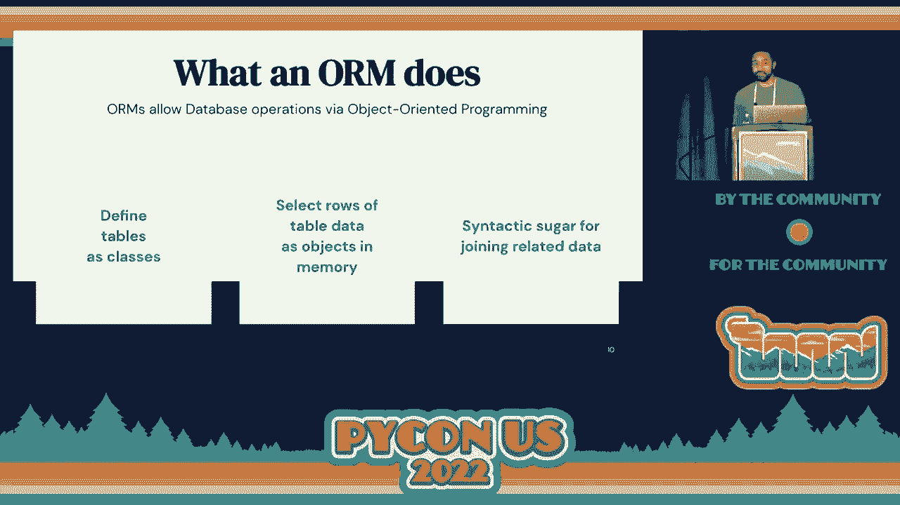
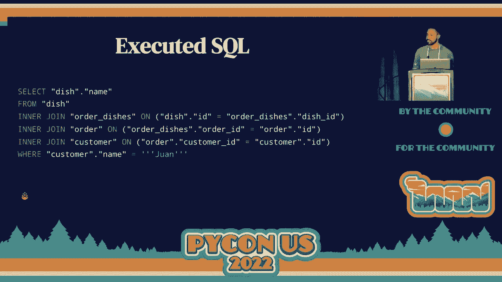
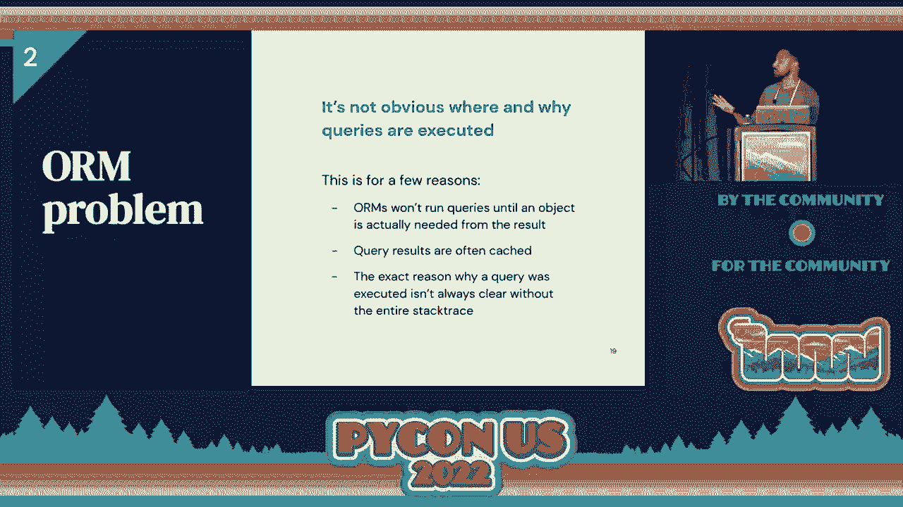
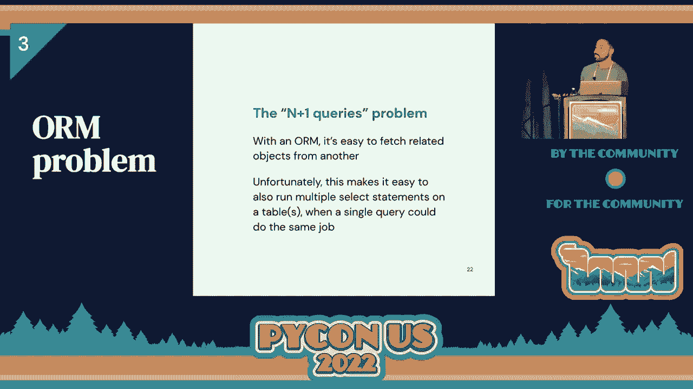
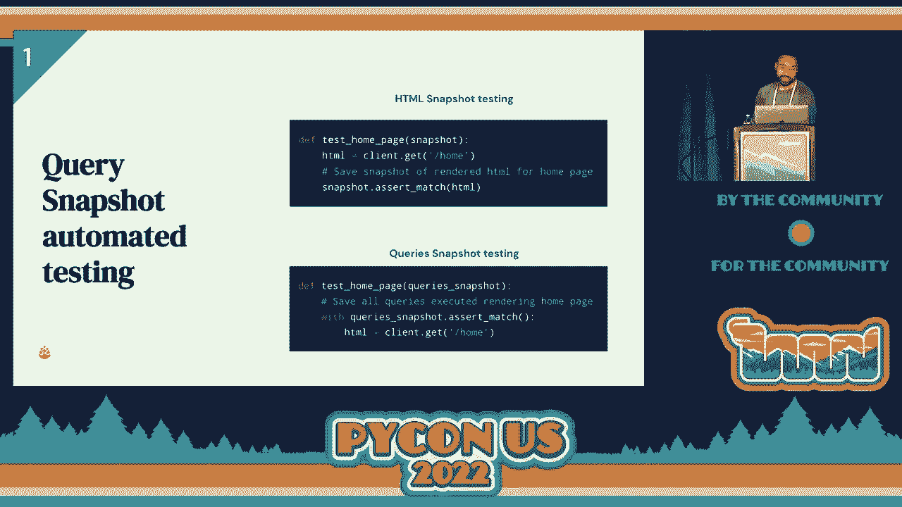

# 048：通过快照提高应用性能 🚀


在本节课中，我们将学习如何通过查询优化和快照测试来提升数据库驱动的应用性能，避免单纯依赖昂贵的基础设施扩展。


---

## 概述


大家好，我是胡安·冈萨雷斯。本次演讲将探讨应用性能优化，特别是数据库瓶颈的解决方案。许多应用在快速增长时都会遇到数据库性能问题。虽然垂直扩展（升级硬件）和水平扩展（如分片、读写分离）是常见方法，但**查询优化**是一种能直接降低数据库负载和基础设施成本的有效途径。

然而，在使用了对象关系映射（ORM）的Python应用（如Django）中进行查询优化颇具挑战。接下来，我们将分析这些挑战，并介绍一个名为“Snapchat queries”的开源工具，它通过查询快照帮助我们高效地进行性能调优。

---

## 数据库性能问题的根源

许多应用最初都采用单服务器数据库模型。这虽然简单，但也使数据库成为**单点故障**和性能瓶颈。数据库的大量输入/输出（I/O）操作本质上是缓慢的。因此，当应用变慢时，数据库往往是首要怀疑对象。


---


## 性能优化的两大方向



改善数据库性能主要分为两类。


### 1. 基础设施扩展
这包括两种方式：
*   **垂直扩展**：增强单一数据库服务器的能力，例如升级CPU、增加RAM或使用更快的磁盘。
    *   公式：`性能提升 ≈ (新CPU能力 + 新RAM) / 旧配置`
*   **水平扩展**：将数据库拆分开来，例如：
    *   添加只读副本处理查询。
    *   进行数据库分片，将数据分布到多个服务器。

### 2. 查询优化
查询优化是指重写SQL查询，使其以更高效的方式完成相同工作，从而减轻数据库负担。与需要额外花钱的基础设施扩展不同，查询优化能直接**降低运营成本和系统复杂性**。


然而，查询优化非常困难，因为没有适用于所有应用的通用步骤。每个应用的查询都是独特的，需要深入分析。


---

## ORM带来的挑战

在Python生态中，Django、SQLAlchemy等ORM（对象关系映射）工具非常流行。它们允许开发者用面向对象的方式操作数据库，但同时也让查询优化变得更复杂。



上一节我们介绍了查询优化的价值，本节中我们来看看使用ORM时具体会面临哪些难题。



以下是使用ORM（以Django为例）进行查询优化时常见的三个问题：

1.  **代码与SQL的差异**：ORM生成的SQL可能远比对应的Python代码复杂。开发者看到的Python代码可能只暗示操作一个表，但实际执行的SQL可能涉及多个表的连接。
    *   代码示例（Django）：
        ```python
        # Python代码：获取客户“Juan”订购的所有菜品
        dishes = Dish.objects.filter(order__customer__name='Juan')
        ```
    *   实际可能生成的SQL（简化）：
        ```sql
        SELECT * FROM dish
        INNER JOIN order ON dish.order_id = order.id
        INNER JOIN customer ON order.customer_id = customer.id
        WHERE customer.name = 'Juan';
        ```


2.  **查询触发点不明确**：在复杂的Python调用链中，很难确定ORM查询具体在何时、何地以及为何被触发。开发者需要清晰的堆栈跟踪来定位问题源头。



3.  **N+1查询问题**：ORM使得关联查询变得容易，但也极易意外地触发“N+1查询”问题。即，先执行1次查询获取主对象列表，然后为列表中的每个对象再执行1次查询获取关联数据。
    *   **低效代码示例**：
        ```python
        orders = Order.objects.filter(dish__code='beef')  # 查询1：获取所有牛肉订单
        for order in orders:
            print(order.customer.name)  # 为每个订单触发一次查询，获取客户名
        ```
    *   **高效代码示例（使用`select_related`或`prefetch_related`）**：
        ```python
        orders = Order.objects.filter(dish__code='beef').select_related('customer')
        for order in orders:
            print(order.customer.name)  # 关联数据已预先获取，无额外查询
        ```

这些问题使得查询优化看起来令人生畏，但通过合适的工具，这个过程可以变得简单。

---

## 解决方案：查询快照工具

面对这些挑战，我们开发并开源了一个名为 **Snapchat queries** 的工具。它的核心目标是：在本地开发的任何阶段（而不仅限于浏览器调试），都能清晰地捕获、展示和分析由ORM执行的每一个查询。


该工具是一个上下文管理器，基本用法如下：
```python
from snapchat_queries import snapshot_queries

with snapshot_queries() as queries:
    # 执行你的ORM代码
    customer = Customer.objects.get(name='Juan')
    order = Order.objects.create(customer=customer)
    # ...

# 退出上下文后，可以分析捕获到的所有查询
for query in queries:
    print(query.sql, query.duration, query.stack_trace)
```

---

## 工具的核心特性

以下是该工具提供的五个关键特性，按实用性升序排列：

### 特性五：基础查询捕获
捕获代码块内执行的所有查询，并提供每条查询的SQL、执行时间和触发它的**单行Python代码**。

### 特性四：美观的终端输出
将捕获的查询以格式清晰、带颜色高亮的方式打印到终端，快速提供性能快照。

### 特性三：完整的堆栈跟踪
提供触发查询的完整Python调用堆栈。这对于理解在复杂的代码库中查询是如何被触发的至关重要。

### 特性二：相似查询检测与分组
自动检测并分组除了参数值不同外完全相同的SQL查询。这是发现和解决 **N+1查询问题** 的利器。
```python
# 工具会提示：检测到X个相似的查询，可能存在N+1问题。
similar_groups = queries.group_similar()
```

### 特性一（最强）：查询快照测试
这是受前端“HTML快照测试”启发而产生的功能。我们将热点代码路径执行的查询（包括SQL和堆栈信息）保存为“快照”文件。在后续的测试运行中，会重新执行代码并对比快照。
*   **如果快照未变**：测试通过，说明性能特征稳定。
*   **如果快照变化**：测试失败，并显示差异。这能立即警示开发者是否有新的、可能低效的查询被引入。

这项功能将性能回归测试自动化，成为了我们保障代码质量、安心部署的日常实践。

---

## 总结

本节课中我们一起学习了：
1.  应用性能瓶颈常源于数据库，优化有**基础设施扩展**和**查询优化**两条路径。
2.  在使用了ORM的Python应用中进行查询优化面临三大挑战：代码与SQL脱节、触发点不明、易产生N+1查询。
3.  通过 **Snapchat queries** 这类查询快照工具，我们可以有效地捕获、分析和监控ORM查询，使查询优化过程变得可视化、可管理。
4.  特别是**查询快照测试**功能，能够像单元测试一样，持续守护应用的性能基线，防止性能回归。

查询优化虽难，但借助正确的工具和方法，它可以成为提升应用性能、降低成本的强大手段。

---



**工具链接**：`https://github.com/[组织名]/snapchat-queries` （请扫描演讲中的二维码获取）
**关于我们**：如果你对CDER感兴趣，欢迎访问 `cedar.com/careers` 查看职位机会。

感谢大家！


[掌声]