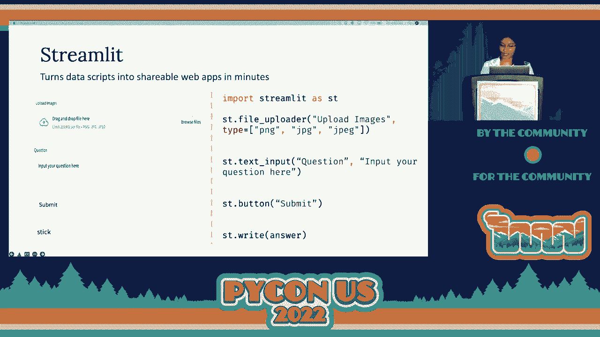
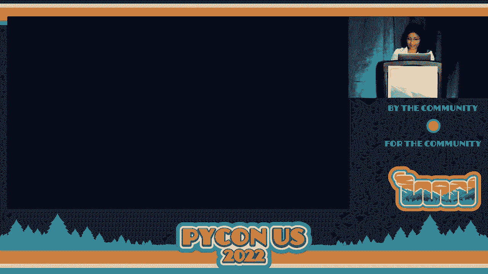
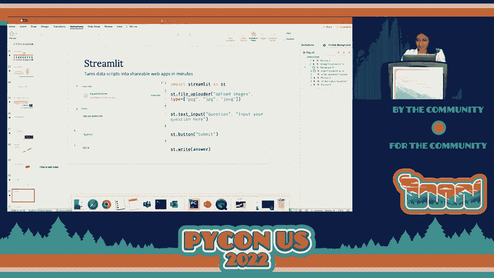
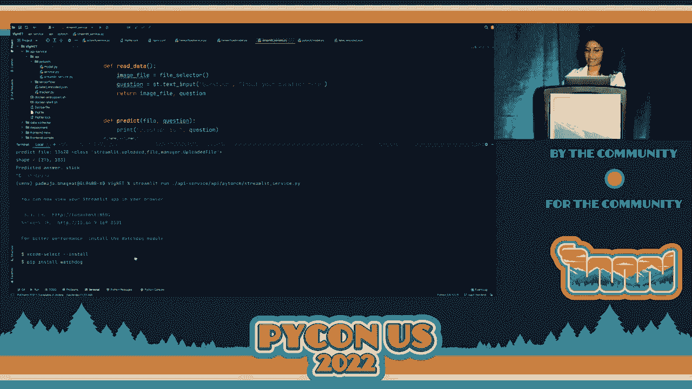
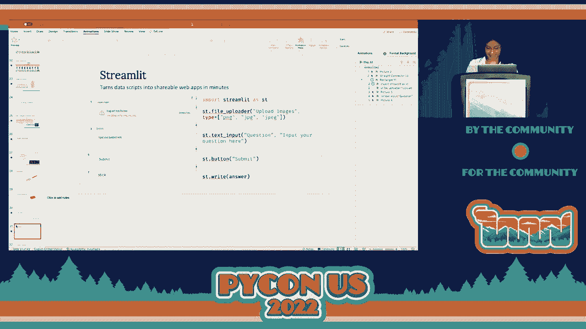
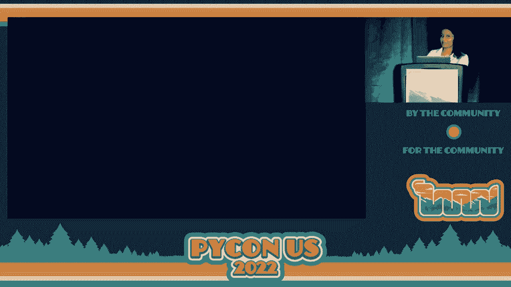
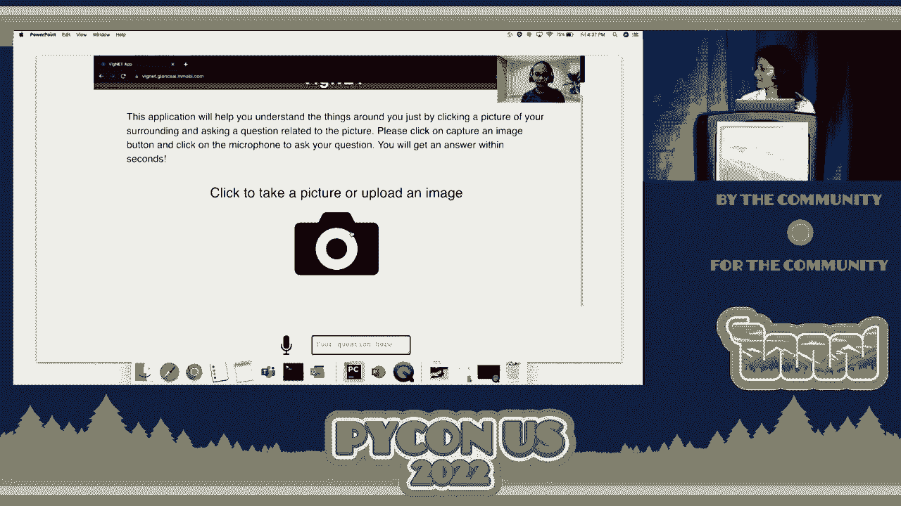
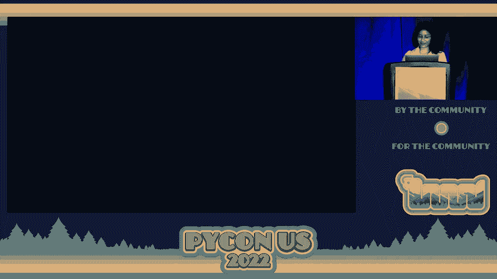
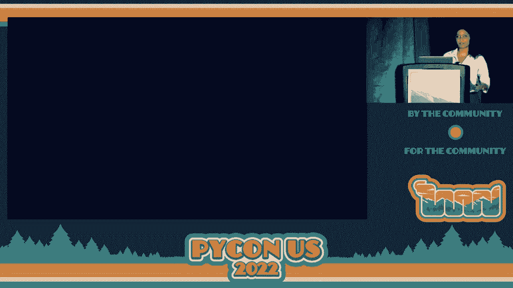
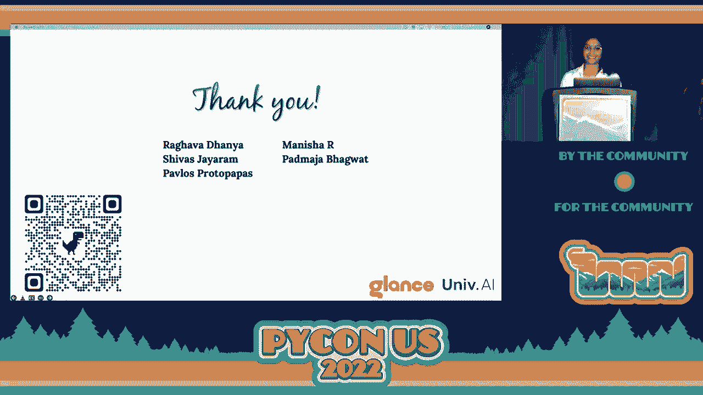

# 066：VigNET智能相机应用开发教程


## 📖 概述
在本教程中，我们将学习如何构建一个名为 **VigNET** 的端到端深度学习应用程序。这是一个基于视觉问答（VQA）的智能相机应用，旨在帮助视觉障碍人士理解周围环境。我们将从核心模型构建开始，逐步介绍快速原型开发、前端服务构建以及生产化部署的全过程。

---

## 🧠 第一部分：理解应用核心——视觉问答模型

上一节我们介绍了VigNET应用的目标。本节中，我们来看看实现该应用的核心技术：视觉问答模型及其背后的数据和模型架构。

### 1.1 问题背景与数据集
全球有超过2.53亿人受到视觉障碍的影响。对他们而言，识别物体、阅读文字等日常任务可能非常困难。因此，我们决定构建一个能将视觉世界转化为可听体验的应用程序。

视觉问答（VQA）模型接收一张图像和一个与该图像相关的问题，然后输出一个文本答案。例如，对一张小狗的照片提问“小狗在吃什么？”，模型应回答“棍子”。

我们使用公开可用的 **VQA V2** 数据集来训练模型。该数据集包含以下内容：
*   超过 **120,000** 张图像。
*   超过 **600,000** 个问题。
*   每张图像至少对应三个问题。
*   每个问题有十个由人工标注的正确答案。

该数据集的特点是图像和问题都具有多样性，要求模型能够理解复杂的视觉场景和自然语言。

### 1.2 核心模型：视觉语言变换器 (ViLT)
我们的模型需要同时理解图像和文本两种模态。我们采用的核心模型是 **视觉语言变换器**。

首先，我们看看模型如何处理文本输入。其原理类似于 **BERT** 模型。
1.  **分词**：将输入句子（如“小狗在吃什么”）拆分为更小的单元，称为 **标记**。
2.  **添加特殊标记**：在句子开头添加 `[CLS]` 标记，在结尾添加 `[SEP]` 标记。
3.  **向量化**：将每个标记转换为机器可理解的数字向量。
4.  **位置编码**：为每个向量添加位置信息，以保留单词在句子中的顺序。
5.  **变换器编码**：将带有位置信息的向量输入到变换器编码器中。编码器通过自注意力机制学习单词之间的上下文关系，最终预测被掩盖的单词。

**代码示例：BERT分词概念**
```python
# 概念性代码，展示BERT处理流程
sentence = “小狗在吃什么”
tokens = [“[CLS]”, “小狗”, “在”, “吃”, “什么”, “[SEP]”] # 分词
token_vectors = convert_to_vectors(tokens) # 向量化
vectors_with_position = add_position_encoding(token_vectors) # 添加位置编码
output = transformer_encoder(vectors_with_position) # 变换器编码
```

接下来，我们将相同的变换器思想应用于图像处理，这就得到了 **视觉变换器**。
1.  **分块**：将输入图像分割成多个小块，称为 **图像块**。
2.  **向量化**：将每个图像块转换为向量。
3.  **位置编码**：为每个图像块向量添加位置信息。
4.  **变换器编码**：将处理后的向量输入变换器编码器，学习图像的整体表示。

**公式/概念**：视觉变换器将图像视为一系列图像块，就像BERT将句子视为一系列单词。

最后，我们将文本和图像处理流程结合起来，就构成了 **视觉语言变换器**。
*   文本侧：生成**单词嵌入**。
*   图像侧：生成**图像块嵌入**。
*   **模态交互层**：将两种嵌入一起输入变换器编码器。模型通过同时关注文本和图像的上下文信息，进行联合学习。

我们使用在VQA V2数据集上预训练好的ViLT模型，这极大地简化了开发流程。

**代码示例：使用Hugging Face库加载ViLT模型**
```python
from transformers import ViltProcessor, ViltForQuestionAnswering
import torch

# 1. 初始化处理器和模型
processor = ViltProcessor.from_pretrained(“dandelin/vilt-b32-finetuned-vqa”)
model = ViltForQuestionAnswering.from_pretrained(“dandelin/vilt-b32-finetuned-vqa”)

# 2. 准备输入
image = Image.open(“dog.jpg”) # 输入图像
question = “小狗在吃什么？” # 输入问题

# 3. 处理并获取答案
encoding = processor(image, question, return_tensors=“pt”)
outputs = model(**encoding)
logits = outputs.logits
idx = logits.argmax(-1).item()
answer = model.config.id2label[idx]
print(answer) # 输出答案，例如 “stick”
```

凭借这几行代码，我们应用程序的核心推理部分就准备就绪了。

---

## ⚡ 第二部分：快速原型开发与前端构建

上一节我们介绍了应用的核心模型。本节中，我们来看看如何快速构建一个可交互的Web应用原型，并最终打造一个功能完善的前端。

### 2.1 使用Streamlit快速原型开发
对于数据科学家而言，拥有一个可演示的Web应用原型，比只展示代码更能有效地与利益相关者沟通。

使用 **Streamlit** 库，我们可以在几分钟内将Python脚本转化为Web应用。它无需编写复杂的HTML/CSS代码。

以下是构建VQA应用原型所需的几个核心Streamlit组件：

**代码示例：构建Streamlit应用界面**
```python
import streamlit as st
from PIL import Image





# 1. 标题
st.title(“VigNET 智能相机”)



# 2. 图像上传组件
uploaded_file = st.file_uploader(“请上传一张图片...”, type=[“jpg”, “jpeg”, “png”])



# 3. 文本输入框（用于提问）
question = st.text_input(“请输入关于图片的问题：”)

# 4. 提交按钮
if st.button(“获取答案”):
    if uploaded_file is not None and question:
        # 5. 调用模型逻辑（此处为伪代码）
        image = Image.open(uploaded_file)
        answer = get_vqa_answer(image, question) # 调用上一节的模型函数
        # 6. 显示答案
        st.write(f”**答案：** {answer}”)
    else:
        st.warning(“请上传图片并输入问题。”)
```

运行上述脚本后，一个功能完整的Web应用就会在本地浏览器中启动。用户可以上传图片、输入问题并立即获得答案。





### 2.2 构建生产级前端（React）
虽然Streamlit原型开发迅速，但对于最终面向用户（特别是视觉障碍用户）的生产环境，我们需要更强大、更定制化的前端。

我们选择使用 **React** 来构建生产级前端，因为它能提供：
*   **丰富的用户界面**：设计美观、交互流畅。
*   **组件化开发**：代码可复用，易于维护。
*   **高性能**：页面渲染速度快，用户体验好。

针对VigNET应用，React前端需要实现以下关键功能：
1.  **图像捕获/上传**：通过手机摄像头拍照或从相册选择。
2.  **语音输入**：允许用户通过语音提问。
3.  **答案输出**：以清晰的**大字体文本**和**语音播报**两种形式呈现答案。
4.  **无障碍支持**：确保应用对屏幕阅读器等辅助工具友好。

前端通过调用后端API服务来获取模型的计算结果。

---

## 🔗 第三部分：连接前后端——API服务与部署

上一节我们完成了前端界面的构建。本节中，我们来看看如何通过API服务将前端与深度学习模型连接起来，并最终部署整个应用。

### 3.1 使用FastAPI构建API服务
API服务是连接前端界面和后台模型逻辑的桥梁。我们使用 **FastAPI** 框架来构建它，因为它快速、现代，并且能自动生成交互式API文档。

**代码示例：使用FastAPI创建预测端点**
```python
from fastapi import FastAPI, File, UploadFile, Form
from PIL import Image
import io
# 导入之前定义好的模型处理函数



app = FastAPI(title=“VigNET API”)

@app.post(“/predict/“)
async def predict(
    image: UploadFile = File(...), # 接收上传的图片文件
    question: str = Form(...) # 接收表单中的问题文本
):
    # 1. 读取图像
    image_data = await image.read()
    image_pil = Image.open(io.BytesIO(image_data))

    # 2. 调用核心模型函数（来自第一部分）
    answer = get_vqa_answer(image_pil, question)

    # 3. 返回JSON格式的答案
    return {“answer”: answer}
```

启动FastAPI应用后，访问 `http://localhost:8000/docs`，你会看到自动生成的Swagger UI界面。你可以在这个界面中直接测试 `/predict/` 接口，上传图片和问题，查看返回的答案。这为开发和调试提供了极大便利。

### 3.2 应用演示与集成计划
将ViLT模型、React前端和FastAPI后端整合后，就得到了完整的VigNET应用。



**应用工作流程演示**：
1.  用户打开React前端应用。
2.  拍摄或上传一张图片（例如一个交通标志）。
3.  通过语音或文字输入问题：“这个标志表示什么？”
4.  前端将图片和问题发送到FastAPI后端。
5.  后端调用ViLT模型进行处理，得到答案：“停止。”
6.  后端将答案返回给前端。
7.  前端以**大号文字**显示答案，并用**语音播报**出来：“停止。”

我们计划将此应用集成到 **Glance** 平台。Glance是一个拥有超过1.5亿日活跃用户的锁屏内容平台。集成后，用户只需在手机锁屏界面右滑启动相机，拍照后点击“询问Glance”，即可直接获得语音答案，极大提升了可访问性和便利性。




### 3.3 部署与尝试
本项目所有代码均已开源。你可以克隆代码仓库，在本地或云平台（如Google Cloud Platform）上部署整个应用栈。

**部署简要步骤**：
1.  准备Python环境，安装依赖（PyTorch, Transformers, FastAPI, Streamlit等）。
2.  启动FastAPI后端服务。
3.  构建并启动React前端应用。
4.  配置前后端连接。
5.  （可选）使用Docker容器化或部署到云服务器。

---

## ✅ 总结
在本教程中，我们一起学习了构建端到端深度学习应用 **VigNET** 的完整流程：

1.  **核心模型**：我们使用了**视觉语言变换器** 作为核心，它能够出色地理解图像和文本，完成视觉问答任务。我们利用Hugging Face的 `transformers` 库，仅用数行代码就加载了预训练模型。
2.  **快速原型**：我们使用 **Streamlit** 在几分钟内构建了一个可交互的Web应用原型，用于验证想法和进行演示。
3.  **生产前端**：为了更好的用户体验和无障碍支持，我们使用 **React** 构建了功能丰富、性能强大的前端界面。
4.  **后端服务**：我们使用 **FastAPI** 创建了REST API服务，作为连接前端和模型的高效桥梁，并便于生产部署。
5.  **集成与部署**：我们展示了完整应用的工作流程，并讨论了将其集成到大型平台（Glance）的计划。所有代码均已开源，可供学习和部署。



通过结合先进的ViLT模型、高效的FastAPI后端以及用户友好的React前端，我们成功构建了一个旨在帮助视觉障碍人士的实用智能相机应用。希望本教程能为你构建自己的深度学习应用提供清晰的路径和灵感。