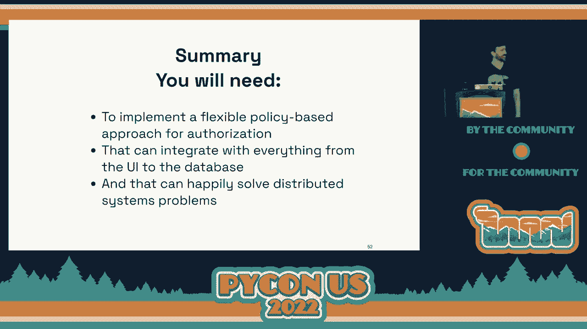
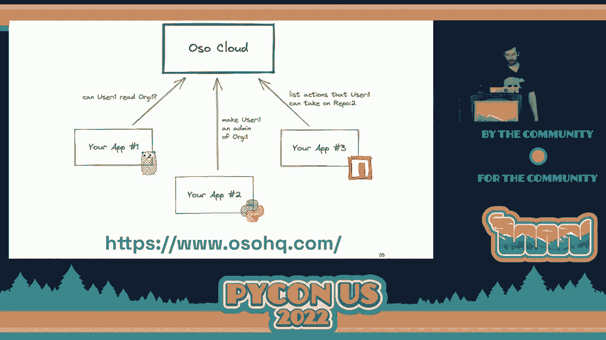

# 074：为什么授权很有趣


在本课程中，我们将学习应用程序授权的核心概念、挑战以及如何让它变得有趣。授权决定了用户登录后能在应用内做什么，是产品体验和安全性的基石。

## 概述

授权是应用程序开发中至关重要但常被忽视的部分。它不仅仅是简单的“是/否”检查，而是一个涉及逻辑、数据和架构的复杂系统。本节课将带你了解授权建模、执行和架构的核心知识，帮助你理解其复杂性并找到简化它的方法。

---

## 授权建模：定义规则与数据

上一节我们介绍了授权的基本概念，本节中我们来看看如何为你的应用程序定义授权规则，即“建模”。

授权建模的核心是回答一个问题：**用户能否对特定资源执行特定操作？** 这通常可以抽象为一个函数：`can(user, action, resource)`，返回布尔值。

### 核心组件：逻辑与数据

任何授权模型都由两部分构成：
1.  **逻辑**：定义规则的抽象部分（例如，“管理员可以做任何事”）。
2.  **数据**：驱动这些规则的具体信息（例如，用户的“管理员”属性存储在数据库中）。

### 常见授权模型示例

以下是几种常见的授权模型实现：

**1. 简单管理员模型**
逻辑是“管理员拥有一切权限”。数据可能来自用户对象的属性。
```python
# 逻辑：管理员可以做任何事
def can(user, action, resource):
    return user.is_admin  # 数据：来自用户对象的 is_admin 字段
```

**2. 基于角色的访问控制**
这是一种非常常见的模式，通过“角色”来分组权限。例如，GitHub 仓库有“读取”、“分类”、“管理员”等角色。
```python
# 定义角色权限矩阵（逻辑）
ROLE_PERMISSIONS = {
    “read”: [“read_repo”, “clone_repo”],
    “triage”: [“read_repo”, “clone_repo”, “close_issue”],
    “admin”: [“do_anything”]
}

# 检查逻辑
def can(user, action, resource):
    user_role = get_user_role(user, resource) # 数据：获取用户在该资源上的角色
    return action in ROLE_PERMISSIONS.get(user_role, [])
```

**3. 复杂的现实模型**
实际产品（如GitHub）的模型要复杂得多，涉及资源层级（组织->仓库->问题）和混合规则（角色+所有权）。
```python
def can(user, action, issue):
    # 检查组织级角色
    if user.has_org_role(issue.repo.organization, “owner”):
        return True
    # 检查仓库级角色
    if action in ROLE_PERMISSIONS.get(get_user_repo_role(user, issue.repo), []):
        return True
    # 检查问题创建者
    if action == “edit” and user == issue.creator:
        return True
    return False
```
随着模型变复杂，代码容易变成难以维护的“泥球”。这时，使用为授权设计的**专用声明式语言**会更有优势，它能让开发者更专注于定义“产品应该做什么”，而非“如何实现”。

---

## 授权执行：将规则融入应用

上一节我们学习了如何定义授权模型，本节中我们来看看如何在实际应用中执行这些规则。

执行不仅仅是简单的“检查与拦截”，更关乎提供流畅的用户体验。我们需要在三个层面应用授权：**API/路由层**、**数据层**和**用户界面层**。

### 1. 基础执行：路由守卫
这是在请求入口处进行的典型检查，防止未授权访问。
```python
# Flask 路由示例
@app.route(‘/document/<doc_id>’)
def get_document(doc_id):
    document = Document.query.get(doc_id)
    if not authorize(user, “read”, document): # 执行检查
        raise PermissionDeniedError(“无权访问此文档”)
    return render_template(‘document.html’, document=document)
```
但这会导致用户直接看到错误页面，体验不佳。

### 2. 进阶执行：数据过滤
更好的方法是在数据查询层面就进行过滤，使用户根本“看不到”无权限的资源。这就像GitHub对未登录用户隐藏私有仓库。
*   **框架集成**：例如在Django中，可以重写模型管理器，自动注入权限查询。
    ```python
    # 返回已应用授权过滤的查询集
    authorized_docs = Document.objects.for_user(request.user)
    ```
*   **数据库原生**：使用如PostgreSQL的**行级安全性**特性，在数据库层面实现过滤。

### 3. 用户体验执行：界面适配
最优雅的执行是在用户界面上动态展示或隐藏功能。例如，GitHub根据你的权限决定是否显示“关闭问题”按钮。
这通常通过以下方式实现：
*   API响应中包含用户的**权限位**（例如 `{“permissions”: {“triage”: true, “admin”: false}}`）。
*   前端根据这些权限位控制UI元素的显示状态。
```javascript
// 前端逻辑示例
if (repo.permissions.triage) {
    showButton(‘close-issue-button’);
}
```

将授权逻辑推送到前端和数据库，可以创造无缝的用户体验，避免用户碰壁。这要求建模、执行和架构紧密协作。

---

## 授权架构：分布式系统的挑战

上一节我们探讨了在单个应用中如何执行授权，本节中我们来看看当系统发展为多个微服务时，授权架构面临的挑战。

在单体应用中，授权逻辑和数据集中在一处。但在微服务架构中，多个服务可能需要共享同一套授权逻辑和数据，这就带来了分布式系统设计的经典难题。

### 架构决策框架

选择如何设计授权架构，主要围绕两个维度的权衡：**逻辑的集中/分散** 和 **数据的集中/分散**。

以下是几种常见的模式：

**1. 逻辑分散，数据分散**
*   **描述**：每个服务独立实现自己的授权逻辑，并管理所需的数据（如用户角色）。
*   **优点**：简单，服务间解耦。
*   **挑战**：逻辑重复，难以保持跨服务的一致性更新。

**2. 逻辑集中，数据分散**
*   **描述**：授权逻辑定义在中心位置（如一个共享库或配置中心），但每个服务持有自己的数据副本或从专属服务查询。
*   **优点**：逻辑统一，易于修改。
*   **挑战**：需要同步逻辑更新；服务可能需要频繁进行服务间调用来获取授权数据（如“用户角色服务”），增加延迟和复杂性。

**3. 逻辑集中，数据集中**
*   **描述**：构建一个中央授权服务（如Google的Zanzibar），它拥有所有授权逻辑和全局数据。其他服务通过API查询该服务。
*   **优点**：下游服务极其简单，授权策略高度一致。
*   **挑战**：构建和维护这样一个高可用、低延迟、海量数据处理的分布式系统是巨大的工程挑战（需要专门的团队和多年的投入）。

### 权衡与建议

*   **简单起步**：对于初创应用，从逻辑和数据都分散的模式开始是合理的。
*   **应对增长**：当逻辑重复成为负担时，考虑集中逻辑（共享库）。当服务间数据查询成为性能瓶颈时，评估数据集中或使用加密令牌（如JWT）携带少量关键数据。
*   **慎重选择集中化**：构建全能的中央授权服务是最高收益但也最高成本的路径，适合像Google、Airbnb这样规模的公司。

从根本上说，分布式授权是一个权衡问题：在开发便利性、运行时性能、系统复杂度和团队协作成本之间找到平衡点。

---

## 总结与资源



本节课中我们一起学习了授权的三个核心领域：
1.  **建模**：授权关乎逻辑（规则）和数据（事实），核心问题是 `can(user, action, resource)`。模型会从简单变得复杂，使用声明式语言可以更好地管理这种复杂性。
2.  **执行**：好的执行应贯穿整个应用栈，从UI适配、API守卫到数据过滤，旨在提供无缝的用户体验，而非简单的拦截报错。
3.  **架构**：在微服务环境中，需要在逻辑和数据的集中与分散之间做出权衡，没有完美的解决方案，只有适合当前阶段的折中方案。


授权是一个深刻而有趣的问题，它结合了产品思维、安全工程和分布式系统设计。如果你对此充满热情，可以深入探索如何构建授权语言和系统。如果你更希望专注于核心业务，也可以寻求像OSO这样专业解决方案的帮助。

**延伸资源**：
*   **授权学院**：一系列关于授权模式、权衡和最佳实践的中立性技术指南。
*   **专业工具**：考虑使用专业的授权即服务产品或开源框架，以大幅降低自行构建和维护的复杂度。



希望本教程能帮助你更清晰地理解授权，并更有信心地在你的项目中实施它。