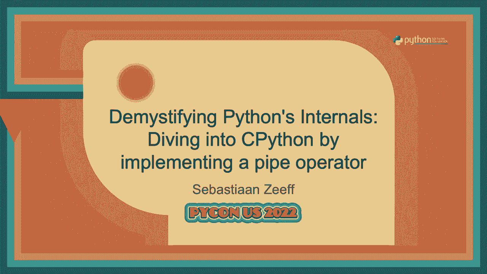
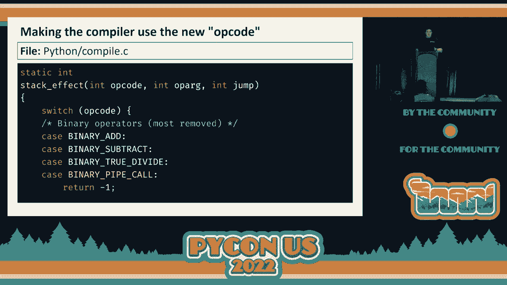
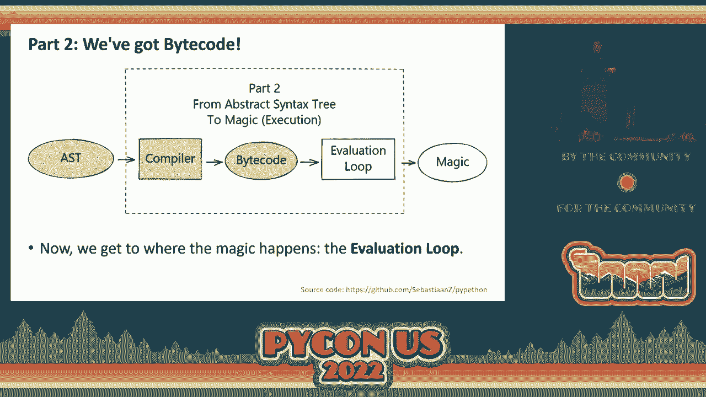
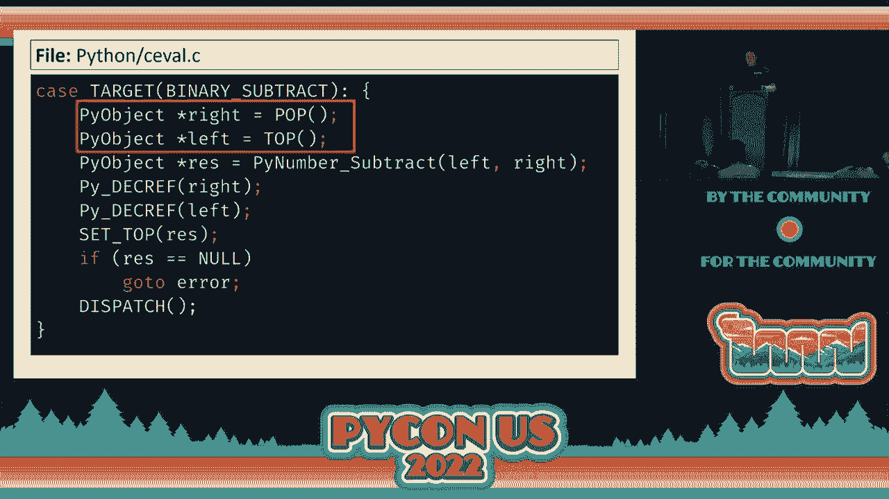
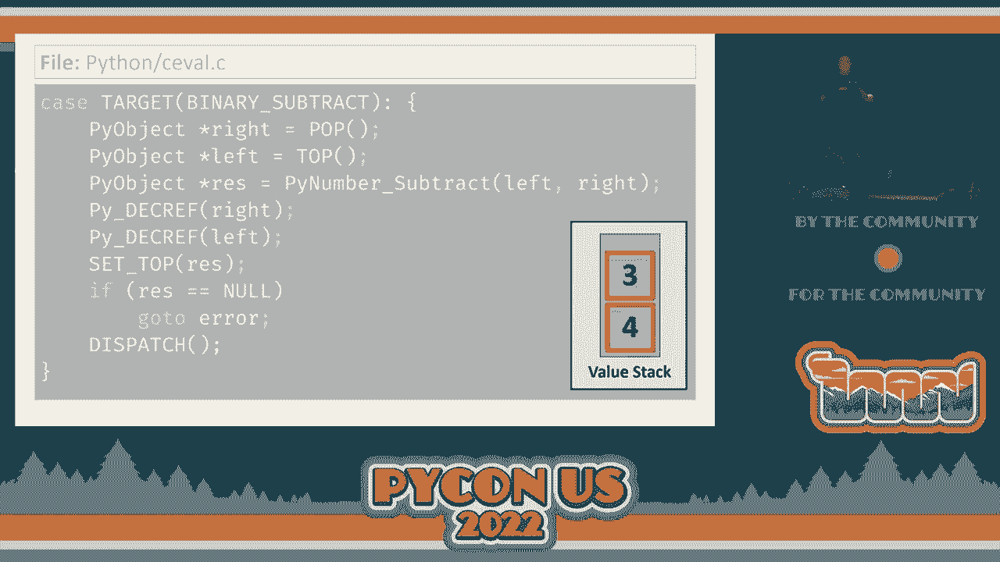
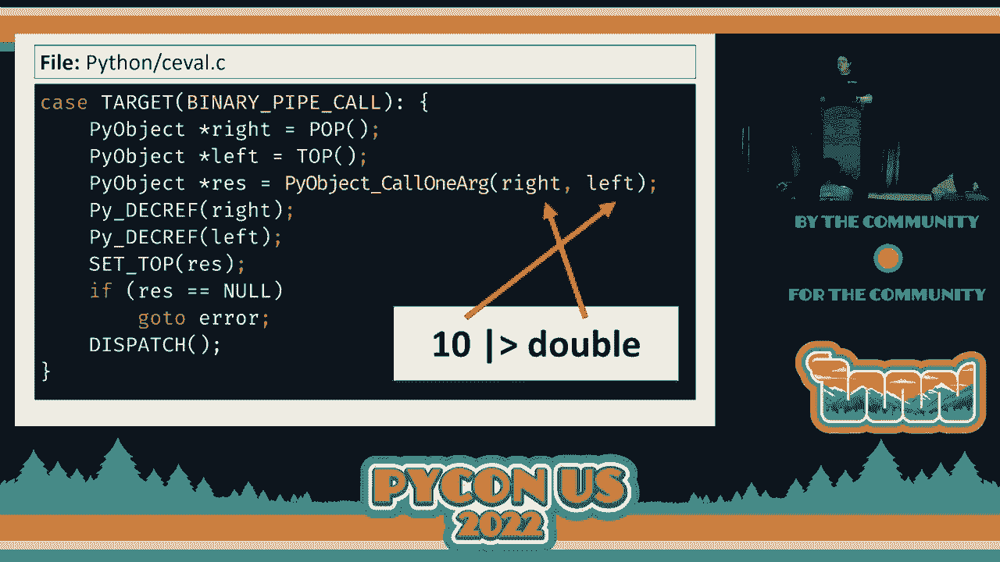
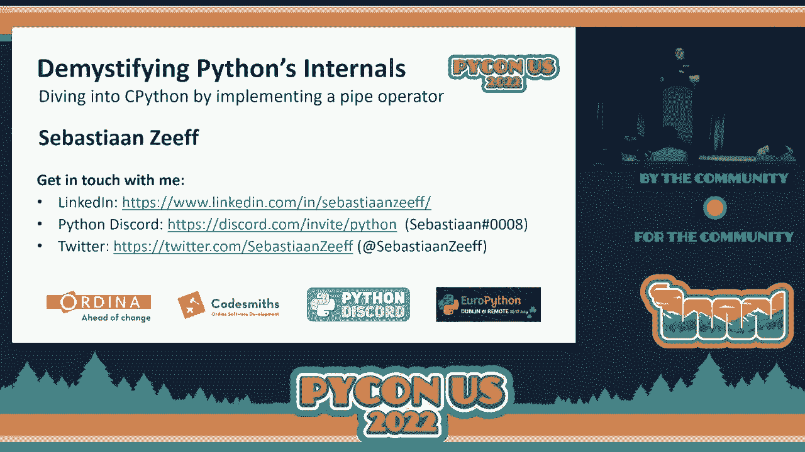

# 076：通过实现管道运算符深入理解




在本教程中，我们将跟随 Sebastiaan Zeeff 的演讲，学习如何通过为 Python 实现一个新的管道运算符（`|>`），来深入理解 CPython 从源代码到执行的完整内部流程。我们将从词法分析开始，经过语法解析、抽象语法树生成、编译，最终到达执行循环。

## 概述

我们将要学习 CPython 解释器如何处理一段 Python 代码。具体来说，我们会通过添加一个新的二元运算符 `|>`，来探索以下核心环节：
1.  **词法分析**：将源代码字符流转换为令牌流。
2.  **语法解析**：使用 PEG 解析器将令牌流解析为抽象语法树。
3.  **编译**：将抽象语法树转换为字节码指令。
4.  **执行**：在评估循环中解释执行字节码。

通过这个实践，你将清晰地看到 Python 代码是如何一步步变成计算机可以执行的指令的。

---

## 1：词法分析 - 从字符到令牌

首先，CPython 需要理解源代码中的基本单元。这个过程称为词法分析，由词法分析器完成。

词法分析器读取源代码的字符流，并将其分割成一系列有意义的“令牌”。例如，对于代码 `10 |> double`，人类能轻易识别出数字 `10`、名称 `double` 和一个操作符 `|>`。但对解释器而言，初始状态这只是12个字符（包含空格）。

为了让词法分析器识别我们的新操作符 `|>`，我们需要将其定义为一个新的令牌。

### 以下是修改令牌定义的步骤：

1.  定位到 CPython 源代码中的 `Grammar/Tokens` 文件。这个文件定义了所有令牌名称及其对应的字符序列。
2.  在文件中添加一行，定义我们的新令牌。按照惯例，我们将其命名为 `VBAR_GREATER`。
    ```
    VBAR_GREATER ‘|>‘
    ```
3.  保存文件后，需要重新生成词法分析器相关的代码。在 Linux/Mac 上，运行命令 `make regen-token`；在 Windows 上，运行 `PCbuild\build.bat --regen`。

完成这一步后，词法分析器就能将 `|>` 识别为一个独立的令牌，并将其加入到输出的令牌流中，为下一阶段的语法解析做好准备。

---

## 2：语法解析与抽象语法树生成

上一节我们让解释器识别了新的令牌，本节我们来看看如何让解析器理解这个令牌在语法结构中的含义。

解析器接收词法分析器产生的令牌流，并根据 Python 的语法规则，将其构建成树形结构，即抽象语法树。Python 3.9+ 使用了基于 PEG 的新解析器，可以直接生成 AST。

### 以下是添加新语法规则的步骤：

1.  **定义语法规则**：打开 `Grammar/python.gram` 文件。我们需要添加一条名为 `pipe` 的新规则。这条规则应该是递归的，以支持链式调用（如 `x |> f |> g`）。
    ```peg
    pipe[expr_ty]:
        | a=pipe ‘|>’ b=sum { _PyAST_BinOp(a, b, CallPipe, EXTRA) }
        | sum
    ```
    这条规则表示：一个 `pipe` 表达式可以是一个 `pipe` 后接 `|>` 和 `sum`，或者直接就是一个 `sum`。`CallPipe` 是我们即将定义的 AST 节点类型。
2.  **引用新规则**：为了让新规则生效，需要修改现有语法中表达式（如 `shift_expr`）的定义，使其最终指向我们的 `pipe` 规则。
3.  **定义 AST 节点**：打开 `Parser/Python.asdl` 文件。在 `operator` 枚举中添加我们的新操作符 `CallPipe`。
    ```
    operator = … | CallPipe
    ```
4.  **重新生成解析器与 AST 代码**：运行 `make regen-pegen` 和 `make regen-ast`（或相应的 Windows 命令）来应用所有更改。

现在，解析器已经能够理解 `|>` 语法，并将其转换为一个类型为 `BinOp`、操作符为 `CallPipe` 的 AST 节点。

---

## 3：编译 - 从 AST 到字节码

现在我们已经有了代码的树形表示（AST），本节中我们将看看编译器如何将 AST 转换为虚拟机可以执行的字节码。

编译器遍历 AST，为每个节点生成对应的字节码指令。字节码是一种低级、基于栈的中间表示。

### 以下是教编译器处理新操作符的步骤：

1.  **定义操作码**：打开 `Lib/opcode.py` 文件。添加一个新的操作码，例如 `BINARY_PIPE_CALL`，并为其分配一个数值（如 90）。需要确保后续操作码的数值依次递增。
    ```python
    def_op(‘BINARY_PIPE_CALL‘, 90)  # 操作数消耗：2 -> 1
    ```
    注释 `# 2 -> 1` 表示这个操作会从值栈中弹出两个值，然后压入一个结果值。
2.  **关联 AST 节点与操作码**：打开 `Python/compile.c` 文件。找到 `compiler_visit_expr` 函数，在处理二元操作（`BinOp`）的 `case` 中，添加对 `CallPipe` 操作符的判断，使其生成 `BINARY_PIPE_CALL` 操作码。
    ```c
    case CallPipe:
        ADDOP(c, BINARY_PIPE_CALL);
        break;
    ```
3.  **声明栈效果**：在同一个文件的 `stack_effect` 函数中，为 `BINARY_PIPE_CALL` 操作码添加处理逻辑，指明其栈效果为 `(2, 1)`，即消耗2个栈元素，产生1个结果。

完成这些修改后，编译器就能将类似 `10 |> double` 的 AST 节点编译为一系列字节码指令，其中包含我们新定义的 `BINARY_PIPE_CALL`。

---

## 4：执行 - 评估循环中的魔法

最后，我们来到了最核心的部分：执行字节码。本节我们将看到评估循环如何解释执行 `BINARY_PIPE_CALL` 指令，让代码真正运行起来。

评估循环是 CPython 虚拟机的心脏，它是一个巨大的 `switch` 语句，每个 `case` 对应一个操作码，并执行该操作码对应的具体操作。

### 以下是实现新操作码执行逻辑的步骤：

1.  **定位评估循环**：主要逻辑在 `Python/ceval.c` 文件的 `_PyEval_EvalFrameDefault` 函数中。
2.  **添加操作码处理 Case**：在巨大的 `switch (opcode)` 语句中，添加 `case BINARY_PIPE_CALL:` 的处理逻辑。
3.  **实现操作逻辑**：模仿现有的二元操作（如 `BINARY_SUBTRACT`）的实现。
    *   从值栈顶部弹出右操作数（函数对象）。
    *   获取左操作数（传递给函数的参数值）。
    *   使用 C API 函数 `PyObject_CallOneArg(func, arg)` 调用函数。
    *   将调用结果压回值栈顶部。
    ```c
    case TARGET(BINARY_PIPE_CALL): {
        PyObject *right = POP();        // 弹出函数
        PyObject *left = TOP();         // 获取参数
        PyObject *res = PyObject_CallOneArg(right, left); // 调用
        SET_TOP(res);                   // 结果放回栈顶
        Py_DECREF(right);
        Py_DECREF(left);
        if (res == NULL)
            goto error;
        DISPATCH();
    }
    ```
4.  **重新编译 CPython**：使用 `make -j2` 或相应的命令重新编译整个 CPython 解释器。

现在，所有工作都已完成。你可以启动新编译的 Python 解释器，测试新的管道运算符：
```python
def double(x):
    return x * 2



result = 10 |> double
print(result)  # 输出：20



# 链式调用
result = 5 |> double |> double
print(result)  # 输出：20
```



---



## 总结

在本教程中，我们一起学习了 CPython 解释器从源代码到执行的全过程，并通过实现一个管道运算符 `|>` 进行了实践。我们经历了四个主要阶段：



1.  **词法分析**：在 `Grammar/Tokens` 中添加新令牌，将 `|>` 识别为基本单元。
2.  **语法解析与 AST**：在 `Grammar/python.gram` 中添加语法规则，在 `Parser/Python.asdl` 中定义 AST 节点，让解析器能构建出包含新操作符的语法树。
3.  **编译**：在 `Lib/opcode.py` 中定义新操作码，在 `Python/compile.c` 中教编译器如何为 `CallPipe` 节点生成该操作码。
4.  **执行**：在 `Python/ceval.c` 的评估循环中实现 `BINARY_PIPE_CALL` 操作码的逻辑，完成函数调用。

这个流程揭示了 Python 作为一门解释型语言，其内部同样包含编译的步骤（生成字节码）。希望这次深入 CPython 内部的旅程，能帮助你更好地理解你所编写的 Python 代码是如何被执行的。



> **注意**：本教程中的修改仅为教学目的，展示了最直接的实现路径，可能未考虑性能优化或与所有 Python 特性的兼容性。实际向 CPython 贡献代码需要遵循更严格的规范和流程。