# 085：教程概述


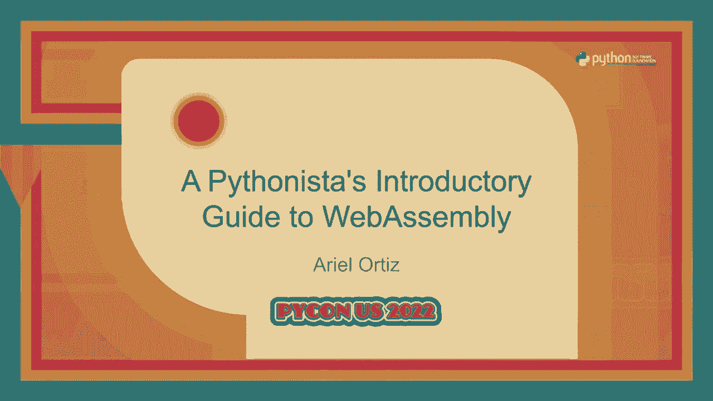


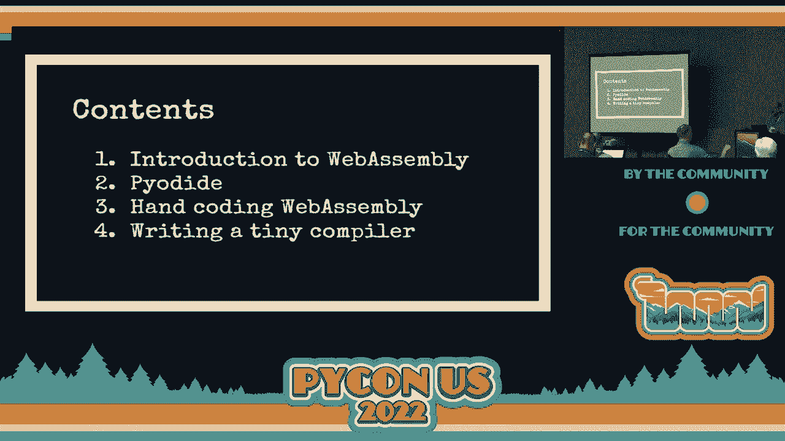

在本教程中，我们将学习 WebAssembly 的基础知识。WebAssembly 是一种高性能的虚拟机二进制指令格式，旨在实现客户端和服务器端应用程序。我们将从概述开始，然后通过 Pyodide 在浏览器中运行 Python，接着手动编写 WebAssembly 代码，最后编写一个简单的编译器来生成 WebAssembly。

---

## 1：什么是 WebAssembly？🚀

WebAssembly 是一种虚拟机的二进制指令格式，被称为基于栈的虚拟机。它是一种指令集，类似于 x86、ARM 或 Java 虚拟机的指令集。WebAssembly 被设计为一种可移植的编译器目标语言，用于实现高性能的应用程序。

WebAssembly 的主要特点包括：
*   **安全性**：使用与 JavaScript 相同的沙箱环境。
*   **可移植性**：可在 Web 浏览器和各种设备上运行。
*   **高性能**：为计算密集型任务设计，运行速度接近本地代码。
*   **开放标准**：由 W3C 维护，是开放网络的第四种语言。

需要注意的是，WebAssembly 并非 JavaScript 的替代品，而是互补技术。它目前主要支持数值类型（整数和浮点数），没有内置的垃圾回收机制，也不能直接访问文档对象模型。

---

## 2：准备工作与环境设置 🛠️

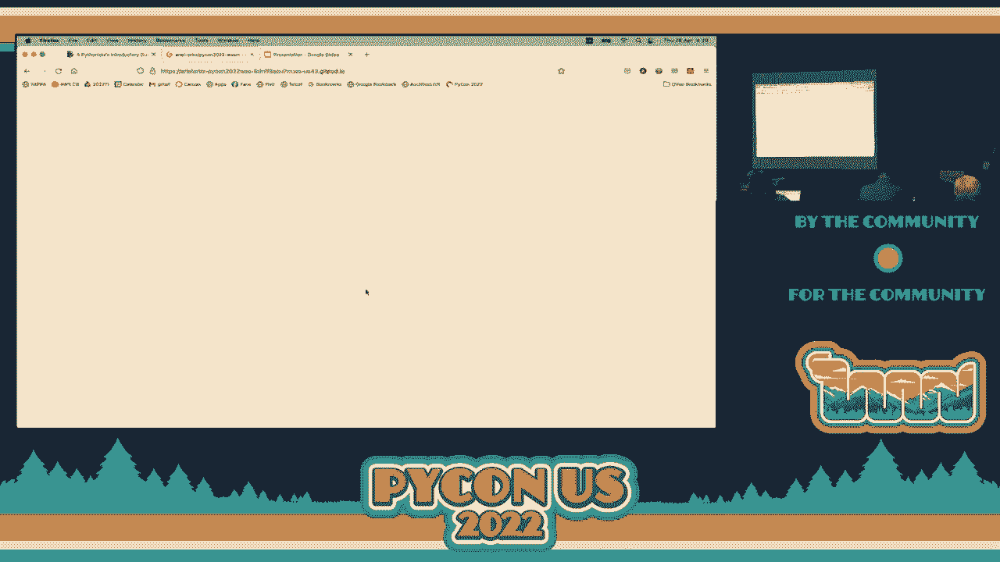

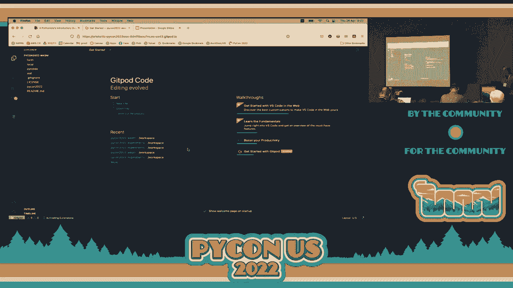

上一节我们介绍了 WebAssembly 的基本概念，本节中我们来看看如何设置我们的开发环境。

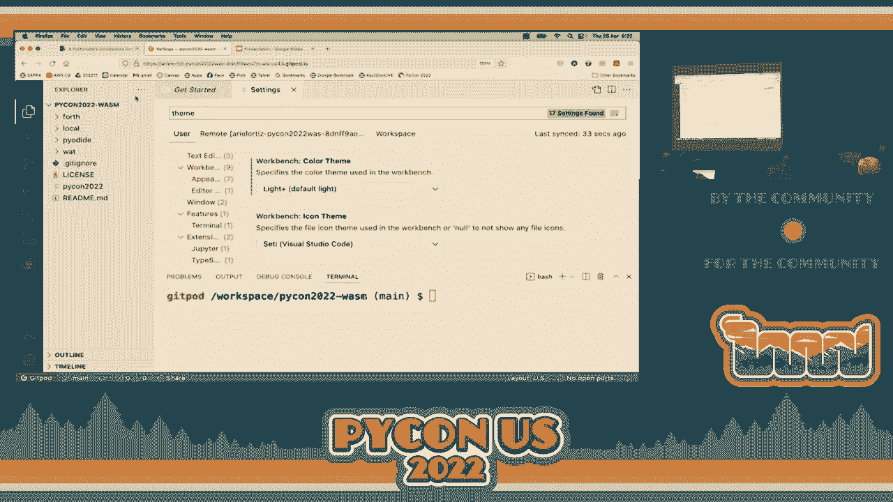

我们将使用 Gitpod 在线开发环境。请确保你拥有一个 GitHub 账户。

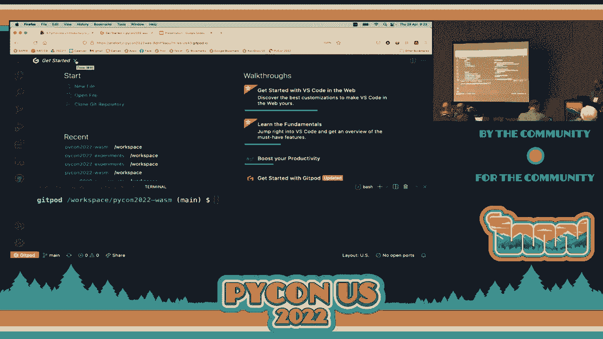

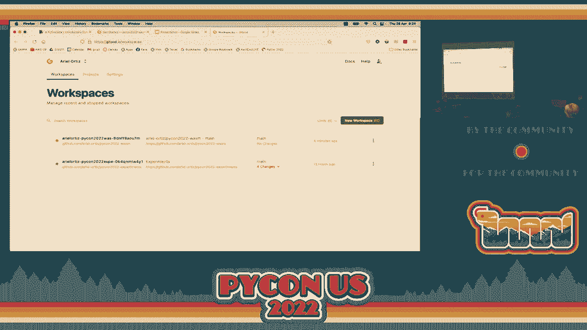

以下是环境设置步骤：
1.  点击教程笔记中的链接，打开 Gitpod 工作区。
2.  工作区基于 Visual Studio Code，你可以根据需要调整主题和字体大小。
3.  使用 `Ctrl+J`（Windows/Linux）或 `Cmd+J`（Mac）打开终端。
4.  每次打开新终端时，需要执行 `source PyCon2022` 命令来设置环境变量。
5.  环境中已预装 Python、WebAssembly 工具包（如 `wat2wasm`）、Wasm3 解释器和 Wasmer for Python。

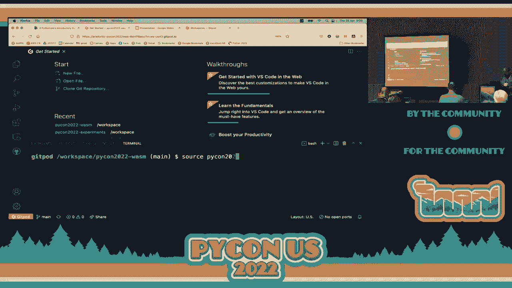

关于 Gitpod 的注意事项：
*   免费开源计划每月提供 50 小时使用时间。
*   工作区在 30 分钟不活动后会自动停止。
*   建议在 Gitpod 仪表板中“固定”重要的工作区，以防被自动删除。

---

## 3：使用 Pyodide 在浏览器中运行 Python 🐍

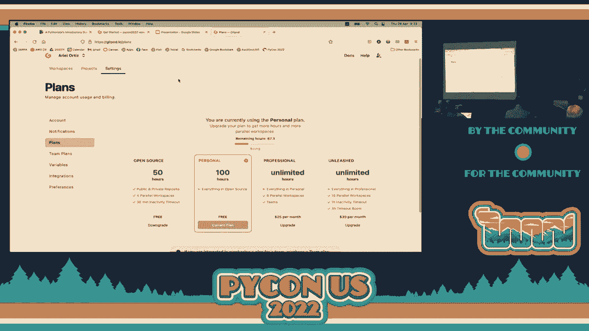

上一节我们完成了环境设置，本节中我们来看看如何利用 Pyodide 技术在浏览器中直接运行 Python。

Pyodide 是通过 Emscripten 将 CPython 编译为 WebAssembly 的产物。它允许我们在浏览器中运行标准的 Python 代码及其科学计算库（如 NumPy）。

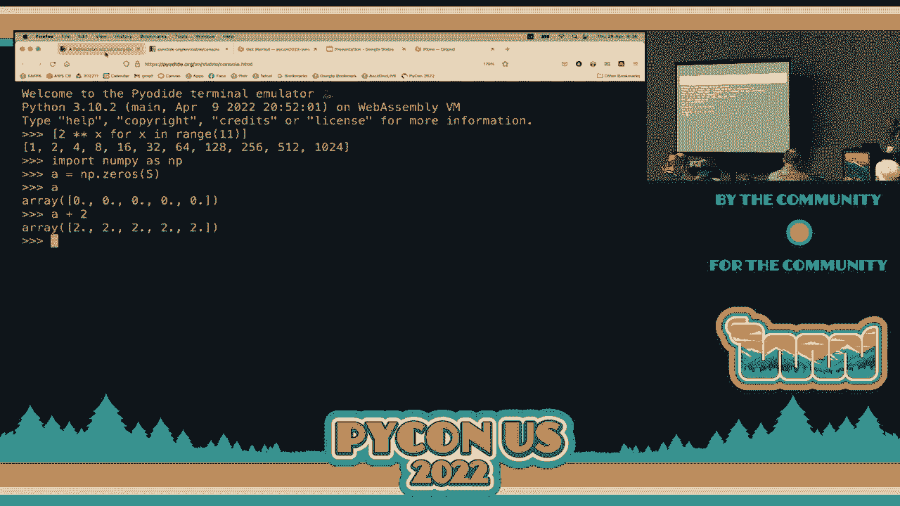

### 3.1：第一个 Pyodide 示例

以下是一个简单的示例，演示如何将 Python 函数集成到网页中。

我们有一个 Python 文件 `some_python_code.py`，其中包含几个函数：
```python
# some_python_code.py
import random
from datetime import datetime

def get_version():
    return f"Python {sys.version}"

def get_date_and_time():
    now = datetime.utcnow()
    return now.isoformat()

def get_quote():
    quotes = ["Hello, World!", "WebAssembly is cool!", "Python in the browser!"]
    return random.choice(quotes)
```

对应的 HTML 文件 `index.html` 通过 JavaScript 加载 Pyodide 并调用这些 Python 函数：
```html
<!-- index.html 部分代码 -->
<script type="module">
    import { loadPyodide } from 'https://cdn.jsdelivr.net/pyodide/v0.21.3/full/pyodide.js';
    async function main() {
        let pyodide = await loadPyodide();
        await pyodide.loadPackage("micropip");
        // 加载并运行我们的 Python 代码
        await pyodide.runPythonAsync(await (await fetch('some_python_code.py')).text());
        // 调用 Python 函数并更新 DOM
        document.getElementById('version').innerHTML = pyodide.globals.get('get_version')();
        document.getElementById('datetime').innerHTML = pyodide.globals.get('get_date_and_time')();
        document.getElementById('quote').innerHTML = pyodide.globals.get('get_quote')();
    }
    main();
</script>
```

要运行此示例，请在 `pyodide` 目录下启动一个 HTTP 服务器：
```bash
python -m http.server 8080
```
然后在浏览器中访问相应的地址。

### 3.2：练习 A - 修改 Python 函数

以下是需要完成的练习内容。

请修改 `some_python_code.py` 文件中的 `get_date_and_time` 函数。在返回结果前，根据今天是否是您的生日，将结果与不同的祝福字符串连接。
*   如果是生日，连接 `" Happy Birthday!"`。
*   如果不是生日，连接 `" Have a very happy birthday!"`。

**提示**：`datetime` 对象有 `.day` 和 `.month` 属性。修改后，在本地使用 Python 解释器测试，然后在浏览器中刷新页面查看效果。

---

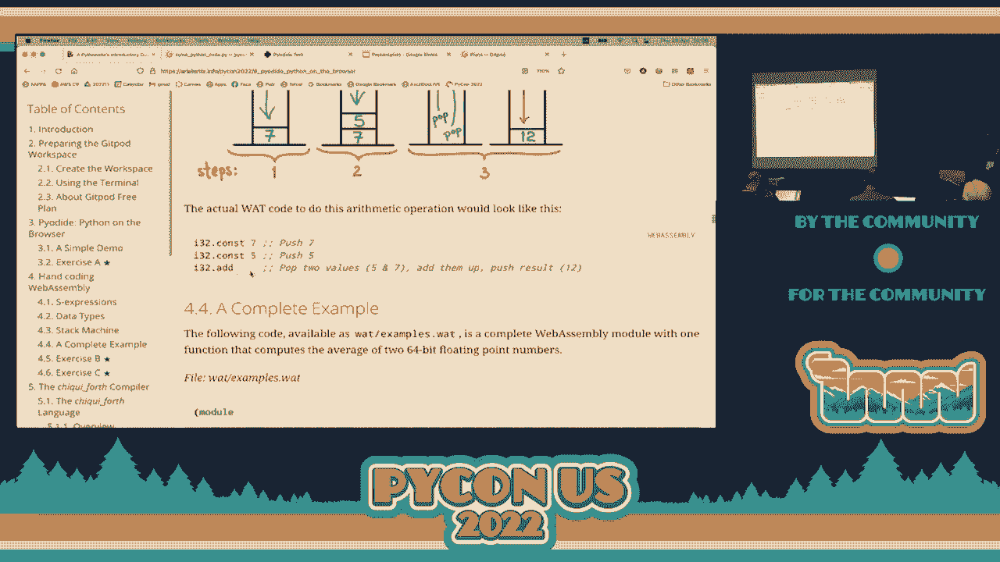

## 4：手动编写 WebAssembly ✍️

上一节我们使用了高级工具，本节中我们来看看 WebAssembly 的底层细节，并尝试手动编写代码。

WebAssembly 有两种表示形式：
*   **Wasm**：二进制格式（`.wasm`）。
*   **Wat**：文本格式（`.wat`），使用 S-表达式。

WebAssembly 是一种基于栈的虚拟机。所有操作都通过向栈中压入（push）和弹出（pop）值来完成。它主要支持四种数据类型：`i32`、`i64`、`f32`、`f64`。

### 4.1：栈机器工作原理

栈是一种后进先出（LIFO）的数据结构。执行运算 `7 + 5` 的步骤如下：
1.  将 `7` 压入栈。
2.  将 `5` 压入栈。
3.  执行 `i32.add` 指令：弹出栈顶的两个值（`5` 和 `7`），计算 `7 + 5`，然后将结果 `12` 压回栈顶。

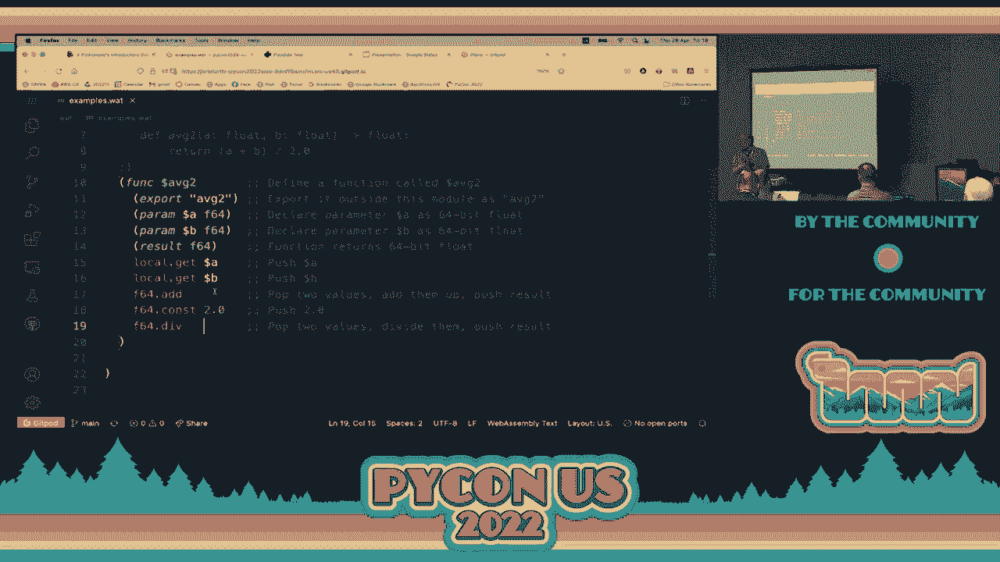

### 4.2：第一个 Wat 程序

让我们查看一个计算两个数平均值的 Wat 程序示例 `examples.wat`：
```lisp
;; examples.wat
(module
  (func $avg2 (param $a f64) (param $b f64) (result f64)
    local.get $a
    local.get $b
    f64.add
    f64.const 2
    f64.div)
  (export "avg2" (func $avg2))
)
```
*   `(module ...)` 定义一个模块。
*   `(func ...)` 定义一个函数。`$avg2` 是局部名称，`(param ...)` 定义参数和类型，`(result ...)` 定义返回值类型。
*   `local.get $a` 将参数 `$a` 的值压入栈。
*   `f64.add` 弹出栈顶两个值相加，结果压栈。
*   `f64.const 2` 将常量 `2` 压栈。
*   `f64.div` 弹出栈顶两个值相除（`(a+b)/2`），结果压栈。
*   `(export ...)` 将函数 `$avg2` 以名称 `"avg2"` 导出，供外部调用。

### 4.3：编译与运行 Wat

我们需要将文本格式（`.wat`）编译为二进制格式（`.wasm`），然后才能执行。


切换到 `wat` 目录，执行以下命令：
```bash
# 1. 将 Wat 编译为 Wasm
wat2wasm examples.wat -o examples.wasm

# 2. 使用 Wasm3 解释器运行
wasm3 --repl examples.wasm
```
在 Wasm3 的 REPL 中，调用导出的函数：
```
wasm3> avg2 5 10
7.5
```

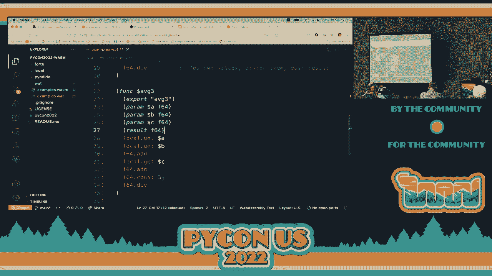


### 4.4：练习 B - 编写 avg3 函数

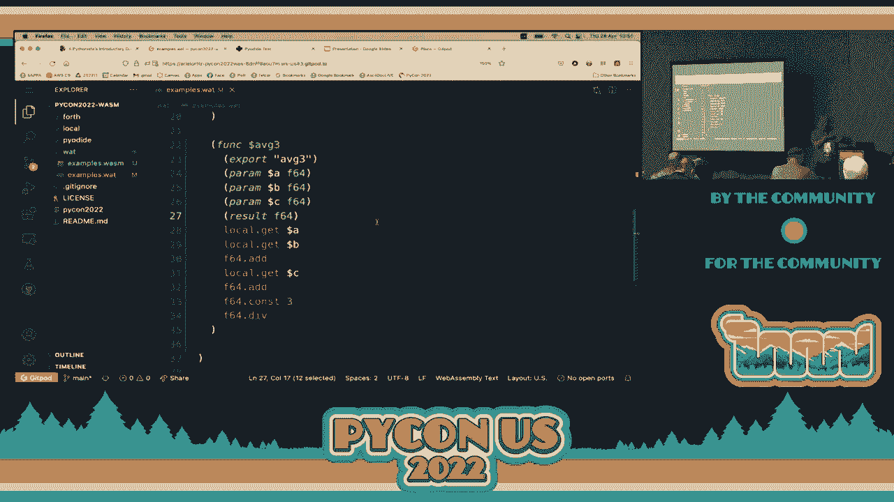

以下是需要完成的练习内容。

请在 `examples.wat` 文件中添加一个新函数 `avg3`，用于计算三个 `f64` 类型参数的平均值。请参照 `avg2` 函数的结构，并记得导出该函数。

完成后，重新编译并测试：
```bash
wat2wasm examples.wat -o examples.wasm
wasm3 --repl examples.wasm
# 测试 avg3 函数
wasm3> avg3 1 2 3
2
```

### 4.5：练习 C - 编写 f_to_c 函数

以下是需要完成的练习内容。

请在 `examples.wat` 文件中添加一个新函数 `f_to_c`，用于将华氏温度转换为摄氏温度。转换公式为：
**`C = (F - 32) * 5 / 9`**
函数应接收一个 `f64` 参数 `$f`，并返回一个 `f64` 结果。

完成后，重新编译并使用 Wasm3 测试你的函数。

---

## 5：编写一个简单的编译器 🧑‍💻

上一节我们手动编写了 WebAssembly，本节中我们来看看更典型的用法：编写一个编译器，将高级语言代码编译成 WebAssembly。

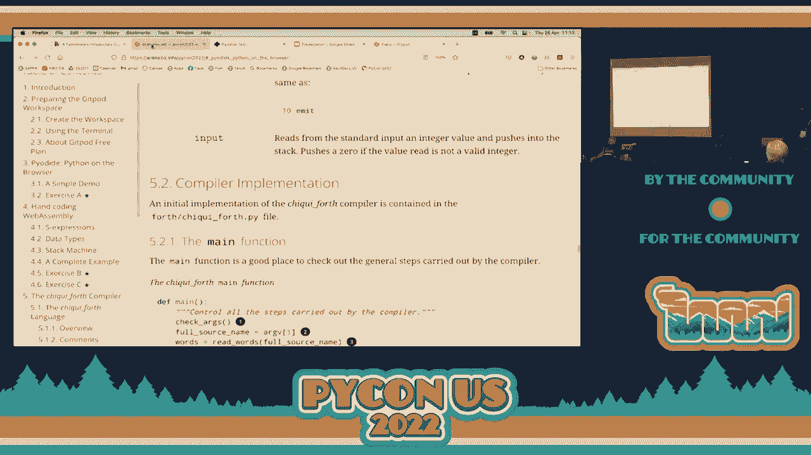

我们将为一个名为 **ChickyForth** 的微型语言编写编译器。Forth 是一种基于栈的语言，其语义与 WebAssembly 非常相似，因此编译过程相对直接。

### 5.1：ChickyForth 语言简介

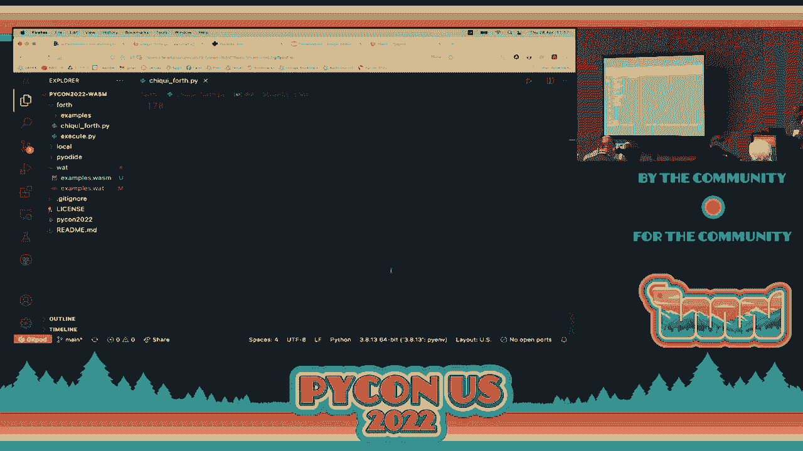

ChickyForth 程序由空格分隔的“单词”组成。
*   **数字**：如 `1`、`2`，会被压入栈。
*   **运算符**：如 `+`、`*`，从栈顶弹出所需数量的操作数，运算后将结果压栈。
*   **变量**：
    *   `x`：读取变量 `x` 的值并压栈。
    *   `x!`：从栈顶弹出一个值，并赋值给变量 `x`。
*   **输入/输出**：
    *   `.`：弹出栈顶整数并打印，后跟空格。
    *   `emit`：弹出栈顶整数，将其作为 Unicode 码点打印对应字符。
    *   `nl`：打印换行符（等价于 `10 emit`）。
    *   `input`：从标准输入读取一个整数并压栈。
*   **注释**：括号内的内容为注释，如 `( 这是一个注释 )`。

**示例**：程序 `1 2 + 3 4 + * .` 会计算 `(1+2)*(3+4)` 并打印结果 `21`。

### 5.2：编译器实现概览

编译器 `chicky_forth.py` 的核心流程如下：
1.  **读取源文件**：将文件内容按空格分割成单词列表。
2.  **移除注释**：删除所有括号内的注释单词。
3.  **声明变量**：找出程序中使用的所有变量，在生成的 Wat 代码中为它们声明局部变量（如 `(local $x i32)`）。
4.  **代码生成**：遍历每个单词，将其翻译成对应的 WebAssembly 指令序列。
    *   数字 -> `i32.const <value>`
    *   运算符 `+` -> `i32.add`
    *   变量 `x` -> `local.get $x`
    *   变量赋值 `x!` -> `local.set $x`
    *   ...
5.  **组装与输出**：将生成的指令包裹在模块头尾，连接成完整的 Wat 字符串，然后使用 `wat2wasm` 工具将其编译为 `.wasm` 文件。

### 5.3：运行编译器与执行程序

我们使用一个 Python 脚本 `execute.py` 作为宿主环境来加载并运行编译后的 Wasm 模块。该脚本提供了 Wasm 模块所需导入的 `print`、`input`、`emit` 函数的具体实现。

以下是如何编译并运行一个 ChickyForth 程序：
```bash
# 1. 切换到 fourth 目录
cd fourth

# 2. 使用编译器编译 .4th 源文件
./chicky_forth.py examples/numbers.4th
# 这会生成 examples/numbers.wat 和 examples/numbers.wasm

# 3. 使用宿主环境执行编译后的 Wasm 文件
python execute.py examples/numbers.wasm
```

### 5.4：练习 D - 添加更多运算符

以下是需要完成的练习内容。

当前编译器的 `OPERATIONS` 字典只支持少数运算符。请扩展该字典，添加对以下运算符的支持：
*   `-` (减法)
*   `/` (除法)
*   `=` (等于)
*   `<>` (不等于)
*   `<` (小于)
*   `<=` (小于等于)
*   `>` (大于)
*   `>=` (大于等于)

**提示**：参考 WebAssembly 指令手册。例如，有符号整数除法指令是 `i32.div_s`，相等比较是 `i32.eq`。请将每个 ChickyForth 单词映射到正确的 WebAssembly 指令字符串列表。

修改完成后，使用 `operators.4th` 文件测试你的编译器，确保输出与预期一致。

### 5.5：练习 E - 实现 do-loop 循环

以下是需要完成的练习内容。

为了实现更复杂的逻辑，我们需要在 ChickyForth 中添加 `do`-`?`-`loop` 循环结构，其语义类似于其他语言的 `while` 循环：
```
x 1 = x!          ( 将 x 初始化为 1 )
do
    x 10 <= ?     ( 条件：x <= 10 吗？真为1，假为0 )
    x . nl        ( 循环体：打印 x 并换行 )
    x 1 + x!      ( 循环体：x 增加 1 )
loop
```
*   `do`：标记循环开始。
*   `?`：检查栈顶值。如果为 0（假），则跳出循环；如果非 0（真），则继续执行循环体。
*   `loop`：标记循环结束，并跳回 `do` 之后的位置。

请在 `OPERATIONS` 字典中添加这三个单词的实现。你需要使用 WebAssembly 的 `block`、`loop` 和 `br_if` 指令来控制流程。

**提示**：
*   `do` 对应开始一个 `block` 和一个 `loop`。
*   `?` 对应 `br_if 0`（如果栈顶为0，跳出 block）和 `br 1`（无条件跳回 loop 开始）。
*   `loop` 对应结束 `loop` 和结束 `block`。

实现后，使用 `1_to_10.4th`、`triangle.4th` 和 `pow2.4th` 等示例程序测试你的编译器。

---

## 总结与资源 📚

本节课中我们一起学习了 WebAssembly 的核心概念。我们从了解其作为高性能、可移植的虚拟机指令集开始，通过 Pyodide 体验了在浏览器中运行 Python 的能力。接着，我们深入底层，手动编写了 WebAssembly 文本格式代码，理解了基于栈的计算模型。最后，我们实现了一个简单的编译器，将 ChickyForth 语言编译为 WebAssembly，完成了从高级语言到低级指令的完整旅程。

希望本教程为你打开了 WebAssembly 世界的大门。虽然我们只触及了表面，但你已经掌握了进一步探索的基础。

**延伸阅读资源**：
*   **《The Art of WebAssembly》** by Rick Battagline：一本实用的入门指南。
*   **《WebAssembly: The Definitive Guide》** by Brian Sletten：更深入的技术概述。
*   **官方资源**：
    *   [WebAssembly 官方网站](https://webassembly.org/)
    *   [MDN WebAssembly 文档](https://developer.mozilla.org/en-US/docs/WebAssembly)
    *   [Pyodide 文档](https://pyodide.org/)
    *   [Wasmer (Python) 文档](https://github.com/wasmerio/wasmer-python)

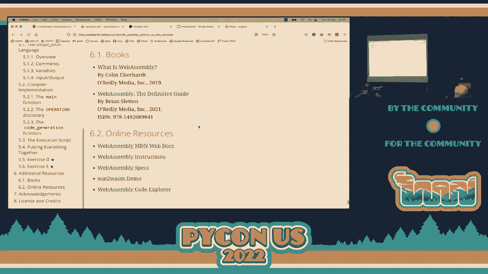

祝你探索愉快！