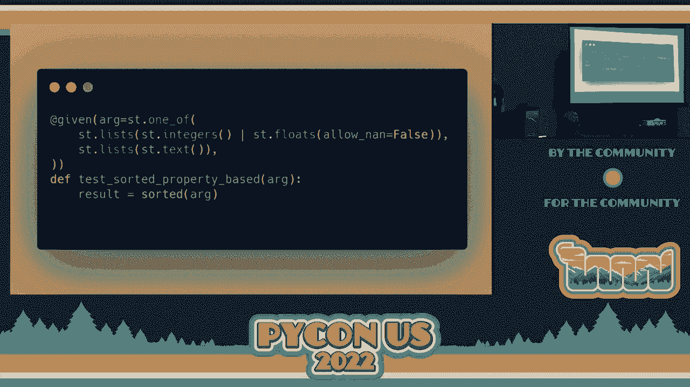
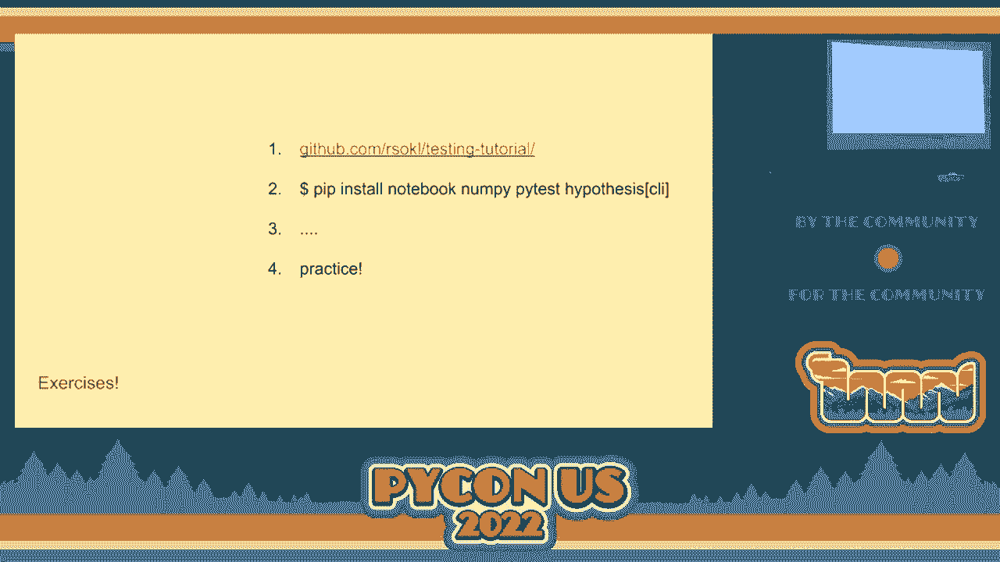
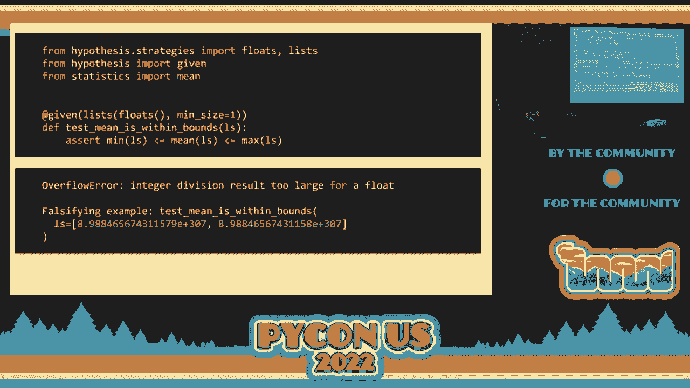
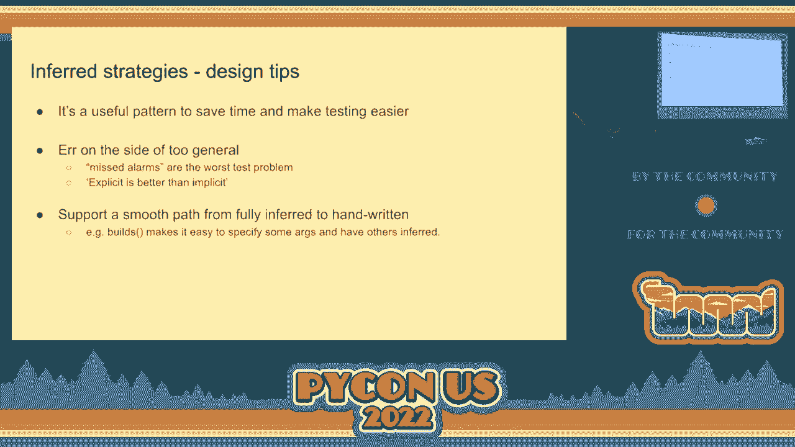
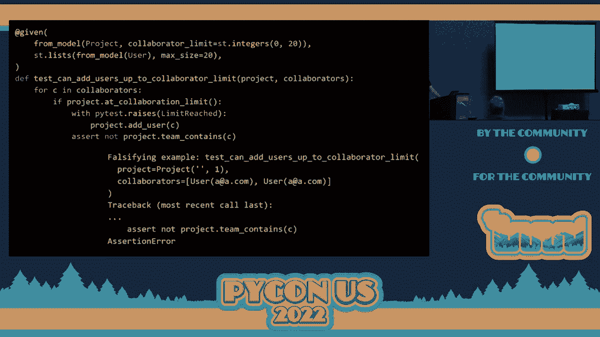
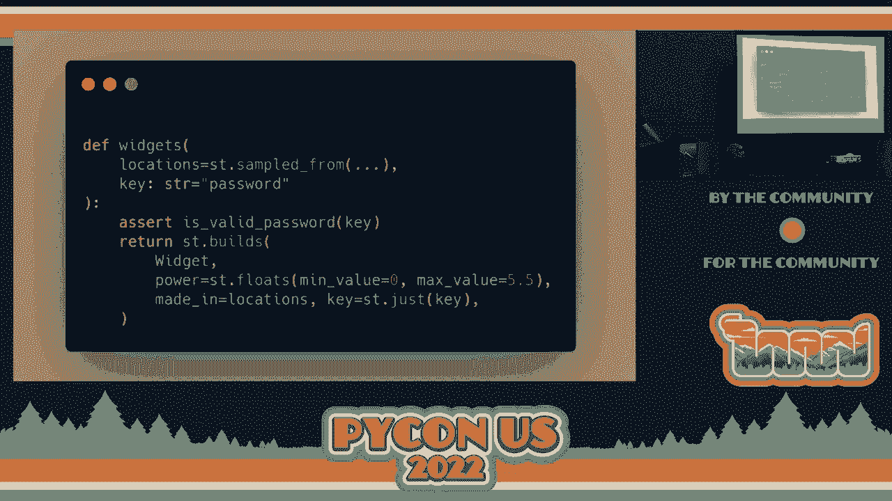
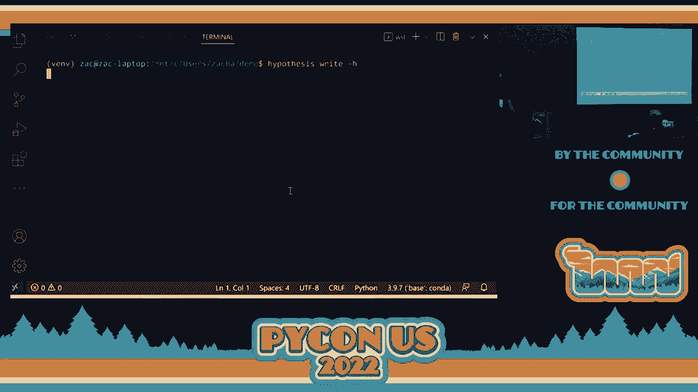
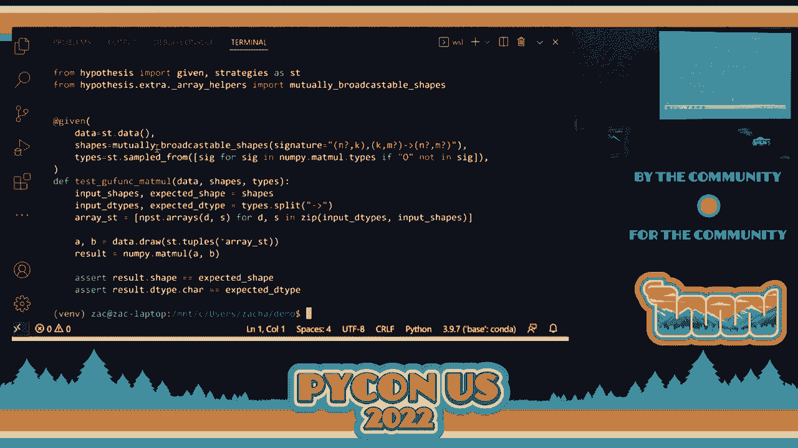
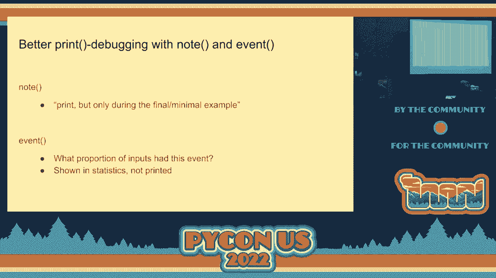
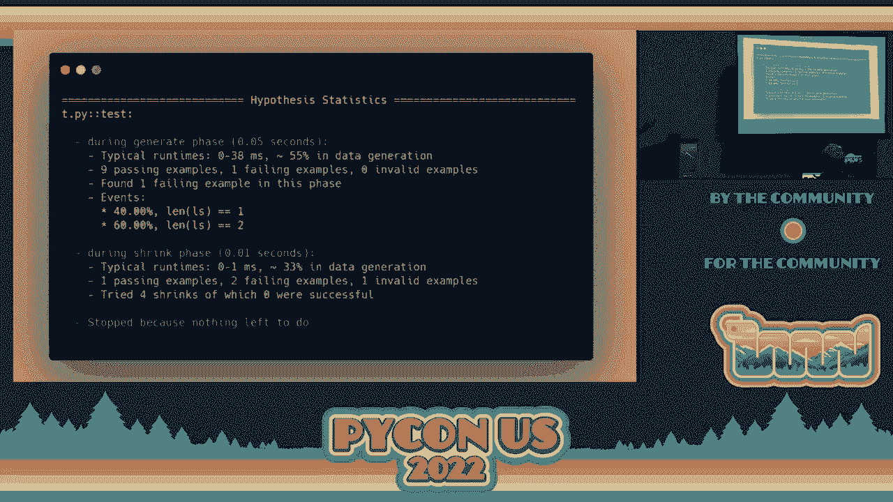

# 088：教程 - Zac Hatfield-Dodds 介绍 - VikingDen7 - BV1f8411Y7cP


## 概述

在本教程中，我们将学习什么是基于属性的测试，以及如何使用 Python 库 Hypothesis 来编写这类测试。我们将从基本概念开始，逐步深入到如何描述测试数据、设计测试策略，并最终将其应用到实际项目中。

---

## 什么是基于属性的测试？


测试是运行代码并检查其行为是否符合预期的艺术与科学。在 Python 中，这通常意味着运行代码，如果没有引发异常，则视为良好；如果结果符合预期，则更好。

有多种测试类型，例如：
*   **单元测试**：测试较小的代码单元。
*   **集成测试**：测试更大的代码单元。
*   **快照测试**：保存输出以便未来比较。
*   **模糊测试**：向软件输入随机数据，观察是否崩溃。
*   **基于属性的测试**：检查代码是否满足某些通用属性。

基于属性的测试的核心思想是，我们定义代码应始终满足的通用属性或规则，然后让测试框架自动生成大量输入来验证这些属性。

---

## 一个经典示例：测试排序函数

假设我们需要测试一个排序函数。传统的单元测试可能如下所示：

```python
def test_sort():
    assert sort([1, 1, 2, 3]) == [1, 2, 3]
    assert sort([3.0, 2.0, 1.0]) == [1.0, 2.0, 3.0]
    assert sort(['c', 'a', 'b']) == ['a', 'b', 'c']
```



参数化测试可以简化这个过程：

```python
@pytest.mark.parametrize('input, expected', [
    ([1, 1, 2, 3], [1, 2, 3]),
    ([3.0, 2.0, 1.0], [1.0, 2.0, 3.0]),
    (['c', 'a', 'b'], ['a', 'b', 'c']),
])
def test_sort(input, expected):
    assert sort(input) == expected
```

然而，这些测试只覆盖了我们能想到的少数案例。基于属性的测试则更进一步。我们不需要知道每个输入的确切输出，但我们可以定义排序结果必须满足的属性：




1.  **输出是有序的**：对于排序后的列表，任意相邻元素都应满足 `前一个元素 <= 后一个元素`。
2.  **输出是输入的排列**：排序后的列表应包含与输入列表完全相同的元素（包括重复项）。

任何满足这两个属性的函数，从数学上讲都是一个正确的排序函数。使用 Hypothesis，我们可以这样编写测试：

```python
from hypothesis import given
from hypothesis.strategies import lists, integers

@given(lists(integers()))
def test_sort_properties(input_list):
    output = sort(input_list)
    # 属性1：输出是有序的
    for i in range(len(output) - 1):
        assert output[i] <= output[i + 1]
    # 属性2：输出是输入的排列（元素集合相同）
    assert sorted(output) == sorted(input_list)
```

Hypothesis 会自动生成大量随机整数列表（包括空列表、长列表、包含重复项的列表等）来运行这个测试，试图找到一个违反上述属性的反例。

---

## 基于属性测试的优势

*   **生成意想不到的输入**：它能自动生成开发者可能想不到的边缘情况，而这些恰恰是 bug 容易隐藏的地方。
*   **无需知道确切答案**：即使我们不知道函数的确切输出，也可以检查其是否满足某些不变量或属性。
*   **发现理解偏差**：有时测试发现的不是代码错误，而是我们对问题或库合约理解的错误。
*   **简单的有效性检查**：一个非常有效的属性是“对有效输入不引发异常”。Hypothesis 生成的各种奇怪但合法的输入，常常能触发代码内部的错误。

---

## 如何使用 Hypothesis 描述测试数据？

上一节我们介绍了基于属性测试的概念，本节我们将学习如何使用 Hypothesis 的核心工具——**策略**——来描述和生成测试数据。



策略定义了如何生成特定类型的值。Hypothesis 提供了多种内置策略。

### 标量值策略

用于生成基本的单值数据。

*   `none()`: 生成 `None`。
*   `booleans()`: 生成 `True` 或 `False`。
*   `integers(min_value=0, max_value=10)`: 生成整数，可指定范围。
*   `floats()`: 生成浮点数。
*   `text(max_size=6)`: 生成字符串，可指定最大长度、字符集或正则表达式模式。
*   `binary()`: 生成字节数据。
*   `datetimes()`: 生成日期时间。

**示例**：测试一个函数处理二进制数据时是否崩溃。

```python
@given(binary())
def test_decode_no_crash(data):
    # 假设 is_binary_string 是一个处理二进制数据的函数
    result = is_binary_string(data)
    # 测试不会崩溃就是一个有效的属性
```

### 集合策略

用于生成列表、字典等集合数据。

*   `lists(elements=integers(), min_size=1, max_size=10)`: 生成整数列表，可指定大小范围和元素唯一性。
*   `dictionaries(keys=text(), values=integers())`: 生成字典。
*   `tuples(integers(), text())`: 生成固定长度的元组，需要为每个位置指定策略。
    *   若要生成可变长度元组，可使用 `lists(...).map(tuple)`。

**示例**：测试列表的最小值、平均值和最大值之间的关系。



```python
@given(lists(floats(), min_size=1))
def test_min_avg_max(lst):
    assert min(lst) <= sum(lst) / len(lst) <= max(lst)
```
**注意**：这个测试在极端情况下（如浮点数溢出）可能会失败，这正体现了属性测试的价值。

### 通过映射和过滤修改策略



你可以对策略生成的值进行转换或筛选。



*   **`.map()`**: 对生成的值应用一个函数。
    ```python
    integers().map(str)  # 生成整数的字符串表示
    lists(integers()).map(sorted).map(tuple)  # 生成已排序的整数元组
    ```
*   **`.filter()`**: 只保留满足条件的值。
    ```python
    integers().filter(lambda x: x != 0)  # 生成非零整数
    ```
    *注意*：过滤条件拒绝过多数据（如超过80%）会影响性能，应尽量使用 `.map()` 来构造所需数据。

### 特殊策略

*   `just(value)`: 总是生成指定的值。
*   `sampled_from([‘read‘, ‘write‘, ‘execute‘])`: 从给定列表中抽样。
*   `one_of(strategy_a, strategy_b)`: 从多个策略中任选一个生成值。
*   `builds(MyClass, arg1=strategy1, arg2=strategy2)`: 构建自定义类的实例。如果类有类型注解，Hypothesis 可以自动推断参数策略。
*   `recursive(base, extension)`: 生成递归数据结构，如 JSON。
    ```python
    json = recursive(
        none() | booleans() | floats() | text(),
        lambda children: lists(children) | dictionaries(text(), children)
    )
    ```


### 复合策略与数据生成


当数据内部存在依赖关系时（例如，一个值必须基于另一个值），可以使用 `@composite` 装饰器。



```python
from hypothesis.strategies import composite

@composite
def sorted_tuple(draw):
    # `draw` 是一个函数，用于从策略中“抽取”一个值
    a = draw(integers())
    b = draw(integers())
    return tuple(sorted((a, b)))
```

你也可以编写返回策略的普通函数，这在项目中被多次重用时非常方便。

---

## 常见的测试策略与模式

在了解了如何生成数据后，本节我们来看看如何为你的代码设计有效的基于属性的测试。我们将探讨几种常见且强大的测试模式。

### 1. 模糊测试 / “不崩溃”测试

最简单的属性是：对于所有有效输入，代码不应引发意外异常。这通常能发现许多边界情况错误。

```python
@given(valid_input_strategy)
def test_does_not_crash(input_data):
    my_function(input_data)  # 如果没有异常抛出，测试通过
```

### 2. 往返属性

这是最强大、最常用的模式之一。如果你有一个操作和它的逆操作（如编码/解码、序列化/反序列化、保存/加载），那么组合操作应该是一个恒等操作。

```python
@given(complex_data)
def test_roundtrip(data):
    # 序列化然后反序列化，应该得到原始数据
    serialized = serialize(data)
    deserialized = deserialize(serialized)
    assert deserialized == data
```
往返测试之所以重要，是因为数据持久化和转换是应用的基础，且涉及的格式复杂，容易在边界情况下出错。


### 3. 等价函数测试

如果你有两个实现方式不同但功能应该相同的函数，可以测试它们在相同输入下是否产生相同输出。

*   **新旧版本对比**：重构前后。
*   **不同算法对比**：简单实现与优化实现。
*   **不同调用顺序**：某些操作应具有交换律或结合律。

```python
@given(input_data)
def test_functions_equivalent(data):
    result1 = old_function(data)
    result2 = new_function(data)
    assert result1 == result2
```

### 4. 不变性与合理性检查

检查输出是否满足一些基本的数学或逻辑约束。

*   概率值应在 0 到 1 之间。
*   物理模拟中的能量应守恒。
*   字符串不应包含非法字符。
*   排序后的列表长度不变。

```python
@given(list_of_numbers)
def test_output_in_range(numbers):
    output = calculate_probability(numbers)
    assert 0 <= output <= 1
```

### 5. 基于模型的测试（状态测试）

对于有状态的系统（如 API、数据库交互），你可以定义一个状态机模型。Hypothesis 会随机生成一系列操作命令，并验证系统状态是否符合预期。这是一个更高级的主题，本教程不深入展开。

### 6. 变形关系

当你甚至不知道单个输入的正确输出时，可以检查输入变化与输出变化之间的关系。例如，如果你将所有输入翻倍，输出是否也相应翻倍？这在科学计算和工程模拟中非常有用。

```python
@given(input_data)
def test_scaling(data):
    result1 = simulation(data)
    result2 = simulation([x * 2 for x in data])
    # 检查 result2 是否近似等于 result1 * 2
    assert are_close(result2, result1 * 2)
```



**核心建议**：对于大多数项目，从“不崩溃”测试和“往返”测试开始，就能获得巨大价值。无需一开始就追求复杂的属性。

---

## 实践应用与配置

最后，我们将讨论如何在实际项目中应用基于属性的测试，并介绍一些重要的配置和最佳实践。



### 集成到测试套件中



*   **并非所有测试都必须是基于属性的**：根据项目情况，基于属性的测试可能占 10% 到 90%。将其作为对传统示例测试的补充。
*   **创建共享策略**：如果项目中有常用的复杂数据类型，可以创建并导出对应的 Hypothesis 策略，供所有测试文件导入使用。这提高了代码复用性和一致性。
*   **使用 `register_type_strategy`**：为自定义类型注册全局生成策略，这样在任何地方使用 `builds()` 或推断时都会自动采用。

### 调试与洞察

*   `hypothesis.note(value)`: 在测试运行中打印信息，但仅针对最终（尤其是失败的）示例打印，避免输出泛滥。
*   `hypothesis.event(description)`: 记录事件，用于生成测试运行的统计信息，帮助你了解生成了哪些类型的输入。

```python
@given(lists(integers()))
def test_some_list(ls):
    hypothesis.event(f“length-{len(ls)}“)  # 统计不同长度列表的比例
    ...
```

### 重要配置

可以通过装饰器 `@settings(...)` 或在 `hypothesis.settings` 模块中设置全局配置。

*   **`deadline`**：单个测试用例允许运行的最长时间（默认约200毫秒）。对于较慢的测试（如涉及数据库），可以调高此值。
*   **`max_examples`**：测试每个函数时运行的最大随机示例数（默认100）。在持续集成（CI）中可设置为较低值以保证速度，在夜间构建中可提高以发现更深层的错误。
*   **`derandomize`**：设为 `True` 可使测试具有确定性，适用于希望每次运行都相同的场景。

### 处理不稳定性与重现失败

*   **本地数据库**：Hypothesis 会在 `.hypothesis` 目录下保存导致测试失败的示例。重新运行测试时，会首先重放这些示例，确保调试周期快速，并确认错误是否已被修复。
*   **`@example` 装饰器**：用于添加你特别关心的具体测试用例，它们每次都会运行。
    ```python
    @given(text())
    @example(““)  # 总是测试空字符串
    @example(“special@case.com“) # 总是测试这个特殊值
    def test_something(s):
        ...
    ```
*   **CI 集成**：在 CI 环境中，可以通过设置 `print_blob=True`，将失败用例编码后打印出来。你可以将其复制到本地进行重放。
*   **共享数据库**：对于团队项目，可以配置 Hypothesis 使用共享的网络存储（如 Redis）来保存失败用例，方便整个团队重现和修复问题。

### 测试生成与优化

*   **`hypothesis write` 命令**：Hypothesis 可以尝试为指定函数自动生成测试代码框架，这是一个很好的起点。
*   **覆盖引导**：Hypothesis 可以集成覆盖引导的模糊测试技术，利用代码覆盖率反馈来更智能地生成输入。
*   **目标函数**：你可以定义一个“目标”（如误差大小、队列长度），Hypothesis 会尝试优化输入以使这个目标值最大化，这对于发现数值计算中的极端情况很有帮助。

### 更新与部署

Hypothesis 项目活跃更新，并采用持续部署。你可以选择固定版本或定期更新以获得新功能和错误修复。

---

## 总结

在本教程中，我们一起学习了基于属性测试的核心思想。我们从理解“属性”的概念开始，通过排序函数的例子，看到了如何用通用规则代替具体的输入输出对。

接着，我们深入探讨了 Hypothesis 库，学习了如何使用各种**策略**来灵活描述和生成测试数据，从简单的标量到复杂的递归结构。

然后，我们转向测试设计，介绍了几种强大的**测试模式**，如“往返测试”、“等价函数测试”和“不变性检查”，这些模式能帮助我们为各种代码编写有效的属性测试。

最后，我们讨论了如何将基于属性的测试**集成到实际项目**中，包括配置管理、调试技巧以及处理不稳定测试和团队协作的最佳实践。


基于属性的测试是一个强大的工具，它能以相对较少的代码发现大量的潜在问题。建议从简单的属性（如不崩溃、往返正确）开始，逐步将其融入你的测试工作流中。