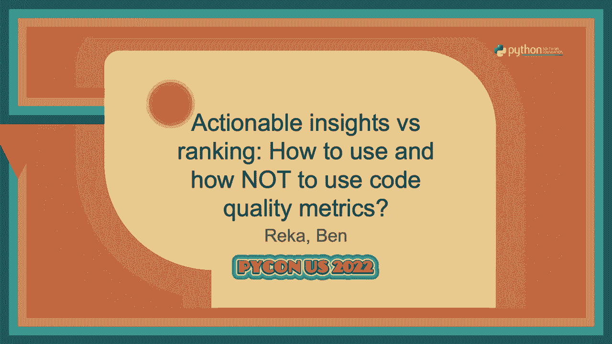
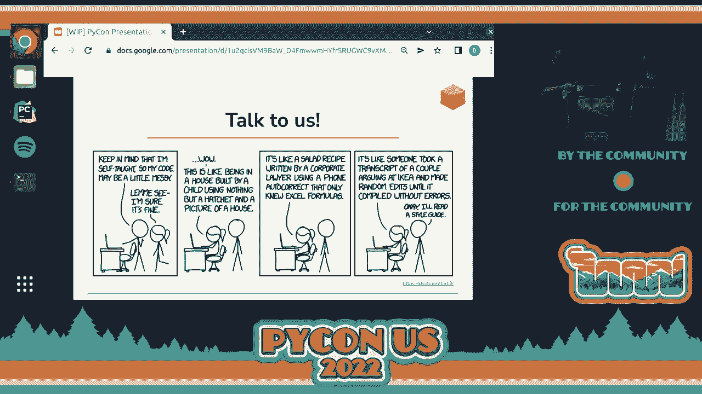

# 090：如何使用以及如何不使用代码

在本节课中，我们将学习代码质量指标。我们将探讨几个核心指标，了解它们如何帮助我们更客观地评估代码，并讨论如何正确使用这些指标，同时避免常见的陷阱。

## 概述

代码审查是软件开发中的常见实践，但我们的判断往往带有主观性。本节课将介绍一系列代码质量指标，如函数长度、圈复杂度、认知复杂度和工作记忆，它们可以为代码审查引入客观性。我们将学习如何从这些指标中获取见解，并理解它们的局限性。

---

## 代码审查与客观性

上一节我们提到了代码审查的主观性，本节中我们来看看如何引入客观性。

大多数开发者都会进行代码审查，无论是审查自己的代码还是他人的代码。然而，很少有人会认为自己的审查是完全客观的。因此，我们需要一些工具来为代码审查引入客观性。

我们将介绍一些指标，并展示如何从这些指标中获得见解。同时，讨论这些指标的陷阱也非常重要。

---

## 第一个指标：函数长度

让我们从一个简单的例子开始，直观感受代码质量的差异。

以下是两个代码片段，在不深入阅读的情况下，你更喜欢哪一个？

*   左边的代码片段？
*   右边的代码片段？

大多数参与者选择了右边的代码片段。一个常见的原因是它更短。这引出了我们的第一个指标：**函数长度**。

在Python中，计算代码行数非常简单，这通常能近似反映语句的数量。函数长度可以让我们对代码的复杂性有一个初步的感觉。

**核心概念**：`函数长度 ≈ 代码行数`

即使你只记住这个简单的指标，它也已经是一种让代码讨论更具体、更数字化的方式。

当然，这个指标有其局限性。追求最短的解决方案并不总是好事。

---

## 第二个指标：圈复杂度

接下来，我们看另一组代码片段，它们的区别不在于大小，而在于结构。

以下是两个复杂度不同的代码片段，你更喜欢哪一个？

*   左边的代码片段？
*   右边的代码片段？

这里的区别引出了我们的下一个指标：**圈复杂度**。

圈复杂度本质上是代码中分支数量的衡量标准。每个 `if` 语句、`try-except` 块等都会增加圈复杂度。

**核心概念**：`圈复杂度 = 分支数量 + 1`

这个指标在70年代被开发出来，当时代码的可测试性至关重要。代码中的分支越多，测试时需要覆盖的情况就越多。因此，圈复杂度与可测试性密切相关。

然而，圈复杂度也有其局限性，它不关心分支的嵌套深度。

---

## 第三个指标：认知复杂度

上一节我们介绍了圈复杂度，本节我们来看看它的一个改进版本。

以下两个代码片段的圈复杂度都是3，但结构明显不同。

*   左边的代码片段有嵌套结构。
*   右边的代码片段有三个顶级分支。

你更喜欢哪一个？

圈复杂度无法区分这两者，但 **认知复杂度** 可以。认知复杂度不仅惩罚新分支，还特别惩罚嵌套结构。

**核心概念**：认知复杂度在圈复杂度的基础上，增加了对**嵌套**和**递归**的惩罚，同时鼓励使用推导式等“简短结构”。

认知复杂度于2016年被提出，更侧重于代码的可读性和可维护性。它试图更贴近人类理解代码的认知负荷。

---

## 第四个指标：工作记忆

为了引出下一个指标，我们先做一个小练习。

屏幕上会依次出现一组数字，请尝试记住它们。
*   3个数字：大多数人能记住。
*   7个数字：约一半人能记住。
*   13个数字：几乎没人能记住。

这是一个已知的心理现象：人类的短期工作记忆容量有限，通常在7±2个信息块左右。这激励了我们的下一个指标：**工作记忆**。

工作记忆指标试图量化阅读代码时需要同时保存在脑海中的信息量。它计算每个语句中正在使用和即将使用的变量数量，并考虑上下文（如条件分支）。

**核心概念**：`工作记忆 ≈ 峰值（同时活跃的变量数 + 上下文分支数）`

这个指标的局限性在于，它难以精确量化“需要知道什么”，因为这取决于阅读者的专业知识和对代码库的熟悉程度。

---

## 指标总结与关联

我们已经看到了四种不同的指标：
1.  **函数长度**：衡量代码大小。
2.  **圈复杂度**：衡量以代码为中心的分支复杂性。
3.  **认知复杂度**：衡量以人为中心的嵌套和递归复杂性。
4.  **工作记忆**：衡量阅读代码时的瞬时认知负荷。

它们从不同角度描述了代码质量：
*   **大小** vs **复杂性**
*   **以代码为中心** vs **以人为中心**

改善代码质量意味着：
*   缩短函数（减少大小）。
*   减少分支（降低圈复杂度）。
*   避免深层嵌套（降低认知复杂度）。
*   控制变量作用域（减少工作记忆）。

有时这些指标可能相互矛盾，因此实践中可能会使用加权平均值（如可维护性指数）来获得一个综合分数。

---

## 在真实代码库中应用指标

上一节我们学习了理论指标，本节我们来看看如何将它们应用到真实的代码库中。

我们可以使用箱线图等工具来可视化一个代码库中所有函数的指标分布。例如，分析多个流行Python库的函数长度后发现：

*   函数长度的**中位数**普遍在5到6行之间。这表明，对于可维护的开源代码，5行左右的函数是一个良好的风格指南。
*   存在一些**异常值**（超过100行的函数），这些是需要重点关注的区域。

同样，分析认知复杂度和工作记忆时也发现：
*   大多数函数的工作记忆中位数在9左右，这恰好落在人类工作记忆容量（7±2）的范围内。这表明好的代码在实践中无意间符合了认知理论。
*   认知复杂度通常略高于圈复杂度，这与预期一致。

---

## 追踪代码库的演变

指标不仅可以用于静态分析，还可以用于追踪代码库随时间的变化。

通过绘制某个代码库在不同版本中的平均认知复杂度，我们可以观察到：
*   在版本0.8附近有一次大规模重写，显著降低了复杂度。
*   之后随着新功能加入，复杂度偶有上升，但通过后续重构得以降低。

另一种视图显示，虽然平均复杂度在下降，但**异常值**（复杂度极高的函数）的数量可能增加。这表明即使整体质量在改善，新的技术债务也可能被引入。

---

## 如何使用代码质量指标

代码质量指标就像测试覆盖率：高覆盖率不一定代表测试好，但低覆盖率通常意味着测试差。同样，良好的质量指标分数不代表代码一定优秀，但糟糕的分数通常预示着问题。

以下是代码质量指标的几个典型用途：

**1. 辅助决策（如重构 vs 重写）**
当团队争论是重构旧代码还是重写时，指标可以提供客观数据。例如，如果一个库大部分函数质量良好，但存在少数复杂度极高的异常值，那么重点重构这些异常值可能是更经济的选择。

**2. 指导重构方向**
指标间的差异能提示重构方向。例如，如果一个模块的函数平均长度很短（~3行），但平均工作记忆很高（>13），这可能意味着代码中挤满了太多变量，缺乏适当的抽象。此时引入新的数据结构或类会很有帮助。

**3. 识别风险区域**
复杂度高的函数更可能隐藏错误，是需要增加测试覆盖率和代码审查重点关注的区域。

**4. 建立代码风格检查**
可以基于指标设定团队标准，例如“函数长度不超过20行”、“认知复杂度低于15”等。

---

## 如何不使用代码质量指标

上一节我们看到了指标的正面用途，本节我们必须强调其误用可能带来的危害。

**1. 切勿将其作为开发者绩效评估工具**
指标是**有偏见**的，它们反映的是某种特定的编码风格，而这种风格并非放之四海而皆准。用它来给开发者排名会鼓励“应试”编程，损害代码质量和团队合作。

**2. 警惕“平均值”陷阱**
对于这些通常呈长尾分布（有很多小值，少数极大值）的指标，平均值往往没有代表性。真正有价值的信息藏在**异常值**里。关注平均排名会误导方向。

**3. 它们不是代码质量的完整定义**
代码质量包含许多未被这些指标捕捉的方面：
*   **命名**：变量、函数名是否清晰、一致？
*   **项目结构**：模块划分是否合理？依赖关系是否清晰？
*   **API设计**：是否易于使用和理解？
*   **正确性**：指标完全无法证明代码逻辑正确。

**4. 指标可以被操纵**
就像可以写出不包含任何断言的测试来凑覆盖率一样，也可以写出符合所有指标但完全不可读、不可维护的代码。指标是工具，不是目标。

---

## 总结

本节课中，我们一起学习了代码质量指标。

我们探讨了四个核心指标：**函数长度**、**圈复杂度**、**认知复杂度**和**工作记忆**。它们从代码大小、分支复杂性、嵌套结构以及认知负荷等不同角度，帮助我们更客观地评估代码。

我们看到了这些指标的用途：
*   为代码审查和团队讨论提供客观输入。
*   建立代码风格指南。
*   识别高风险、需要改进的代码区域（异常值）。
*   辅助重构、重写等复杂决策。

更重要的是，我们强调了其局限性：
*   它们**不是**代码质量的完整度量。
*   **绝不能**用于开发者绩效排名。
*   需要警惕对“平均值”的误读。
*   指标本身可能被操纵。

最终，代码质量指标只是一个**工具**。它可以帮助我们写出更好的代码，但无法保证代码的正确性。正确实现功能、满足用户需求，始终是我们最重要的目标。

就像漫画里那个应用，它可能拥有完美的“四星评级”和“良好的界面”，但如果它不能警告用户关于龙卷风的信息，那它依然是失败的。工具服务于目标，而非相反。

---
*感谢所有相关指标的研究者和开发者。如果你想了解更多，可以查阅SonarSource关于认知复杂度的论文，或访问 RepoAnalyses.com 查看对开源库的分析。*