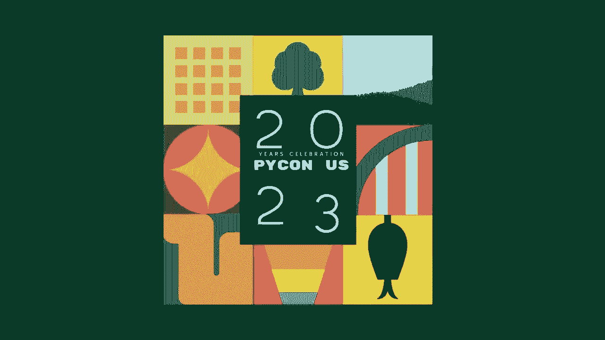
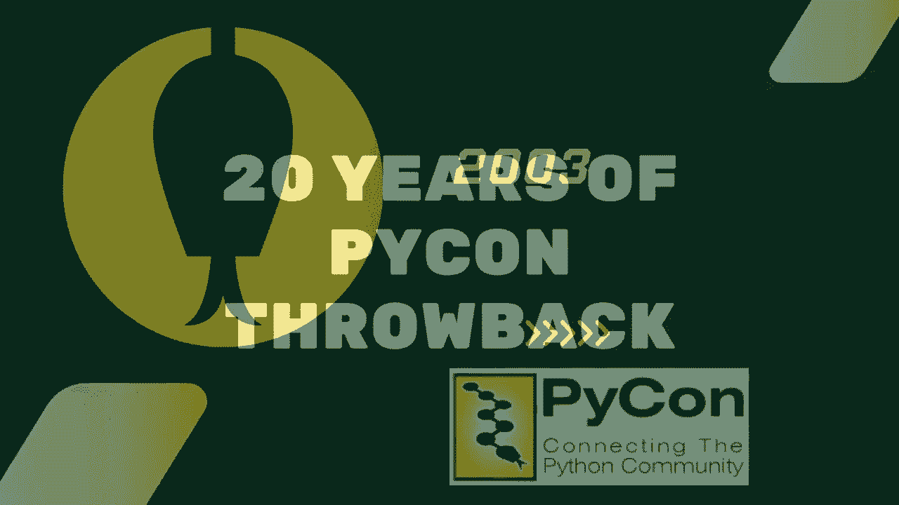
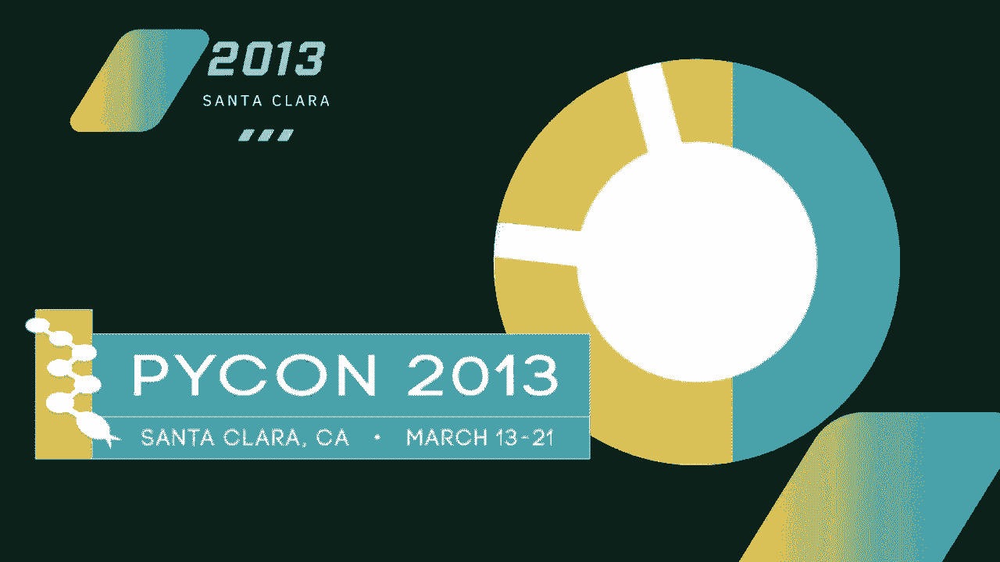
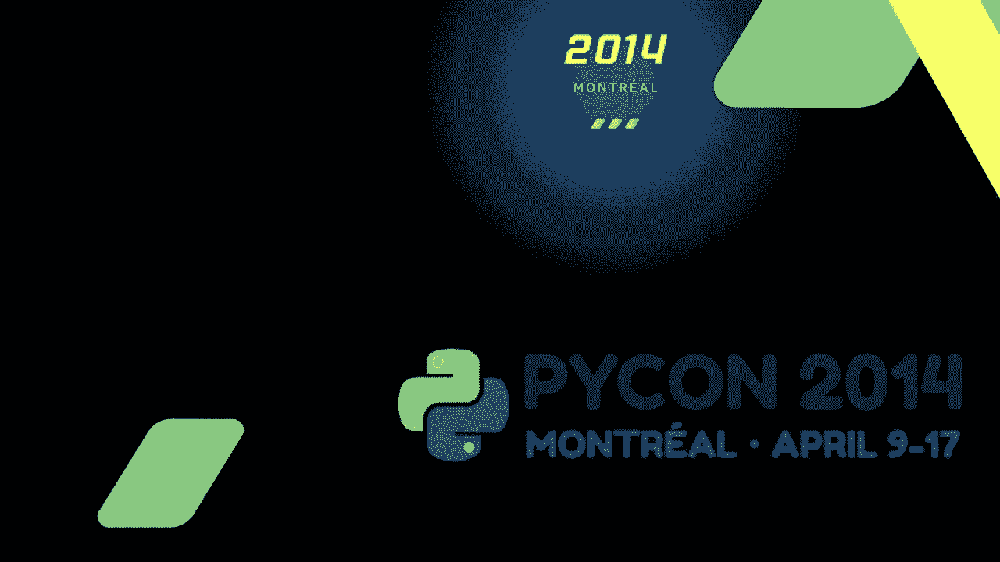
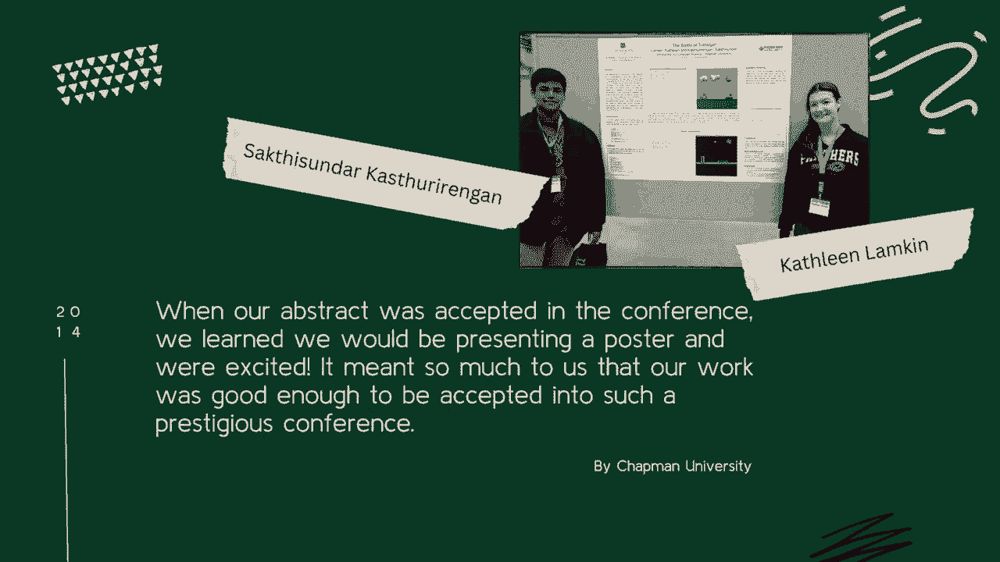
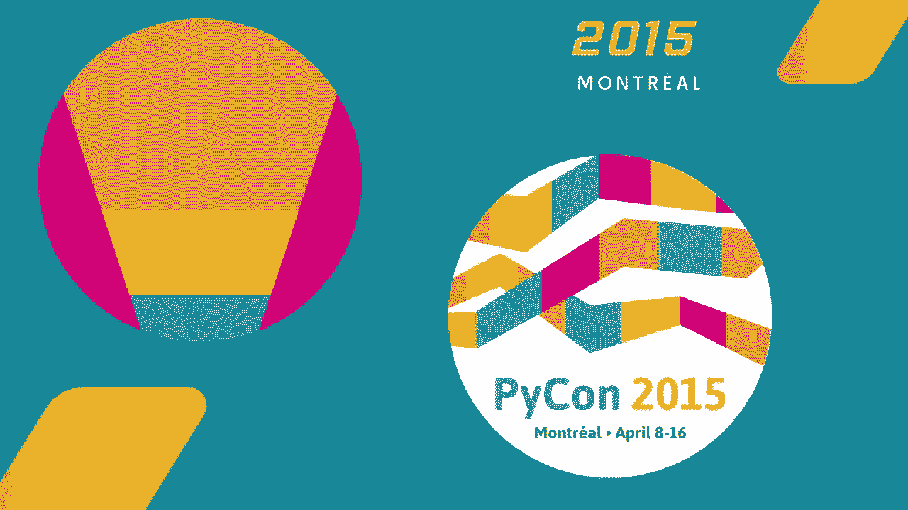
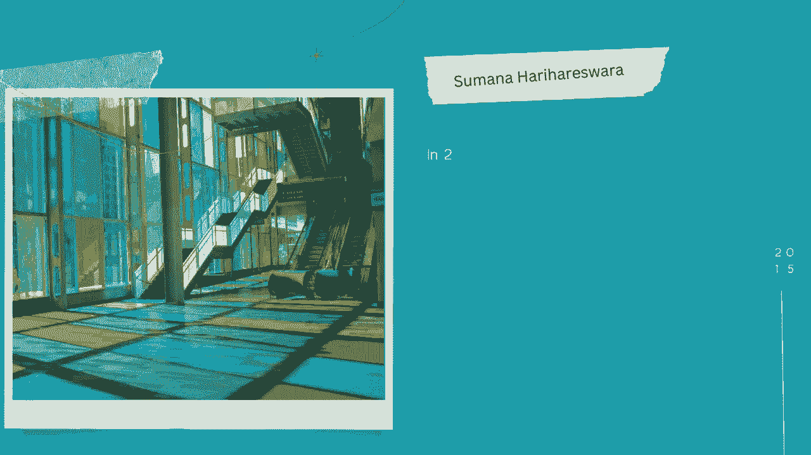
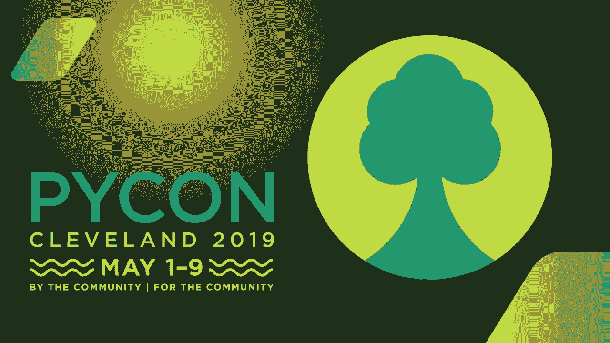
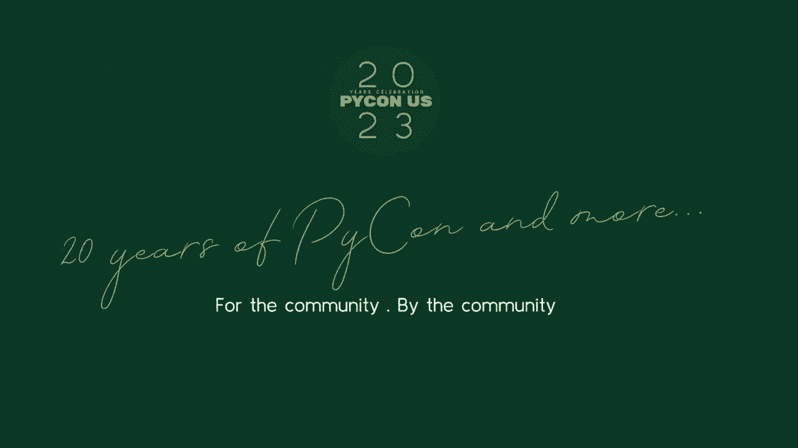

# Python 入门：P1：Python 基础与环境搭建 🐍



在本节课中，我们将要学习 Python 编程语言的基础概念，并完成开发环境的搭建。这是开启 Python 学习之旅的第一步。



## 什么是 Python？ 🤔

Python 是一种高级、解释型的编程语言。它以其简洁清晰的语法和强大的功能而闻名，非常适合初学者入门，同时也被广泛应用于科学计算、数据分析、人工智能和网络开发等领域。



Python 的设计哲学强调代码的可读性和简洁性。一个核心特点是使用缩进来定义代码块，而不是像其他语言那样使用花括号。

## 搭建 Python 开发环境 ⚙️



上一节我们介绍了 Python 的基本概念，本节中我们来看看如何准备一个可以编写和运行 Python 代码的环境。

要开始编写 Python 程序，你需要在你的计算机上安装 Python 解释器。解释器是能够读取并执行你写的 Python 代码的程序。



以下是安装 Python 的步骤：



1.  **访问官方网站**：打开浏览器，访问 Python 的官方网站 `python.org`。
2.  **下载安装包**：在网站首页找到下载链接，选择适合你操作系统（如 Windows、macOS 或 Linux）的最新稳定版本进行下载。
3.  **运行安装程序**：下载完成后，运行安装程序。在安装过程中，请务必勾选 **“Add Python to PATH”** 这个选项，这能让你在系统的任何地方都能方便地使用 Python。
4.  **验证安装**：安装完成后，打开命令行工具（在 Windows 上是命令提示符或 PowerShell，在 macOS 或 Linux 上是终端）。输入命令 `python --version` 并按下回车。如果安装成功，命令行会显示你安装的 Python 版本号，例如 `Python 3.9.7`。

## 编写你的第一个 Python 程序 ✨



环境搭建好后，我们就可以尝试编写第一个程序了。我们将从一个经典的“Hello, World!”程序开始。


你可以使用任何文本编辑器来编写代码，但为了更好的体验，推荐使用专为编程设计的编辑器，如 **VS Code** 或 **PyCharm**。

创建一个新文件，将其命名为 `hello.py`。在文件中输入以下代码：

```python
print("Hello, World!")
```



这行代码使用了 Python 的内置函数 `print()`，它的作用是将括号内的内容输出到屏幕上。

## 运行 Python 程序 🚀


代码写好后，我们需要运行它来看到结果。

以下是运行 Python 程序的两种常用方法：


*   **方法一：使用命令行**
    打开命令行工具，使用 `cd` 命令切换到你的 `hello.py` 文件所在的目录。然后输入命令 `python hello.py` 并按下回车。你将在屏幕上看到输出：`Hello, World!`。


*   **方法二：使用集成开发环境**
    如果你使用的是 PyCharm 或 VS Code 等 IDE，通常编辑器内部会有一个“运行”按钮。点击它，程序就会在编辑器集成的终端中执行，并显示结果。

运行成功后，你就完成了第一个 Python 程序的完整流程：编写、保存、执行。


## 总结 📝



本节课中我们一起学习了 Python 的基础知识和环境搭建。我们了解了 Python 语言的特点，完成了 Python 解释器的安装与验证，并成功编写和运行了第一个程序。

记住，`print()` 是你向世界输出信息的第一个工具。准备好你的环境是开始任何编程项目的第一步。在接下来的课程中，我们将深入探索变量、数据类型和控制流等更丰富的 Python 知识。