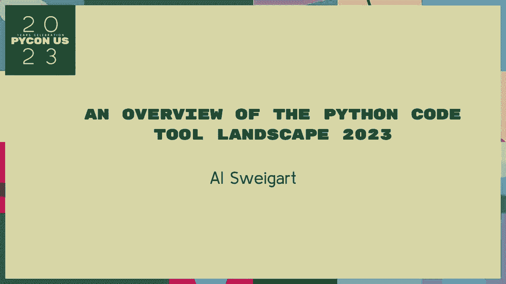
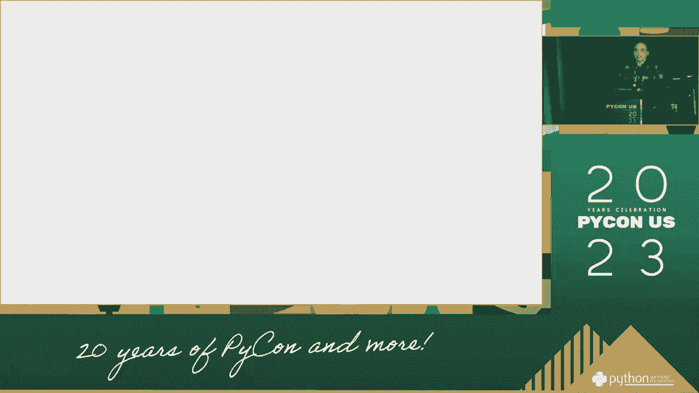
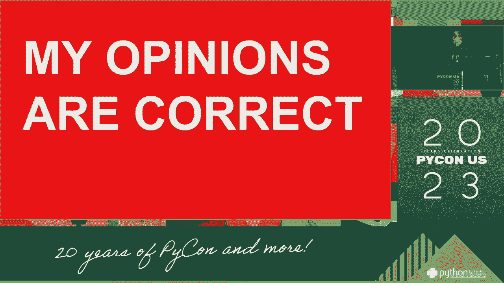
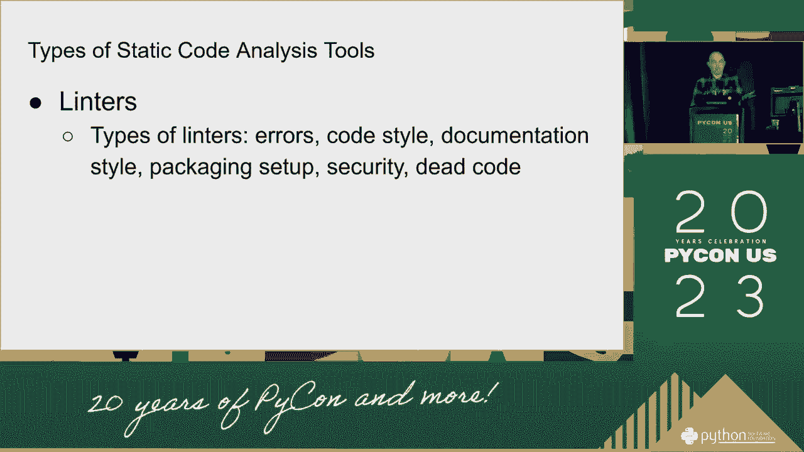
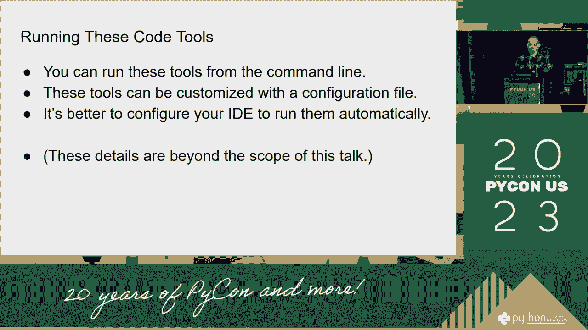
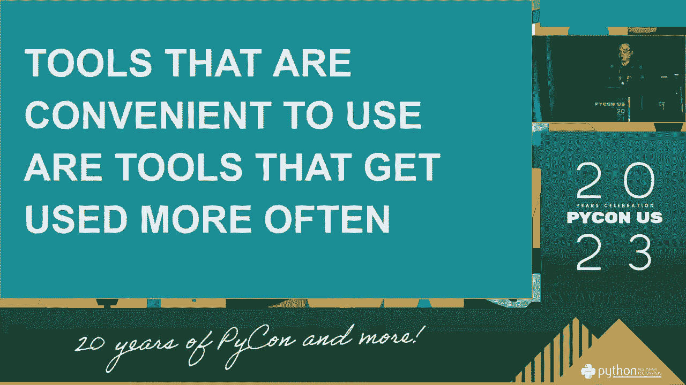
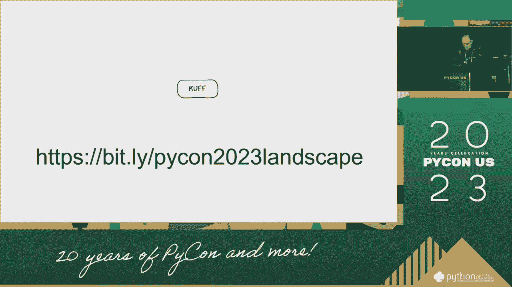

# Python代码工具概述：P10：谈话 - 阿尔·斯维加特

在本节课中，我们将要学习一段关于Python代码工具发展的谈话内容。这段内容来自阿尔·斯维加特，他分享了对近期Python工具生态变化的观察和思考。我们将整理并解读其中的核心信息，帮助你了解Python社区的发展动态。

## 概述 🗣️

谈话从一个关于帮助接触航班的场景开始。演讲者（阿尔·斯维加特）在分享近期重要工作时，提到了一个关于“卫星工作航班”的比喻，用以描述Python工具生态的快速迭代。

演讲者为此前的跑题表示歉意。

他继续为能进行这次谈话表示感谢。他原本在谈论近期完成的一些更重要的工作，但在谈话中联想到了自己曾经参与的“卫星工作航班”。这个比喻指的是工具版本回退到1.4，并且几乎完全改变了整个工作流程。目前，社区仍在保持快速的开发节奏和进展。

因此，演讲者必须等待社区的发展速度放缓。之后，工具会达到一个稳定状态。工具达到稳定状态后，用户大约会有两个小时的时间来适应。接着，用户又必须回归到日常的开发工作中。此时，另一件重要的事情发生了：演讲者爱上了一个美丽的陌生人，这个比喻类似于彼得·雷德福的故事。

他在等待这个“陌生人”（可能指代某个新工具或新理念）能够达到成熟阶段。他觉得整个旧的工作流程就像一架人类驾驶的飞机，直到开发者真正理解并接纳了新工具的核心（比喻为“父亲和母亲”），转变才会发生。

随后，新工具迎来了它的“白天”，达到了“山上”的成熟高度。接着，它正式进入了工作流程。演讲者认为，自己也将要进入这个新的工作流程。此后，新工具被反复、大量地应用于各个工作流程中，象征着其被广泛采纳和集成。

这个过程持续进行，新工具不断地被应用到每一个工作环节。

应用过程仍在继续。

工具的应用达到了一个密集的阶段。

随后，工具的应用进入了稳定和重复的周期，标志着它已成为标准流程的一部分。

应用过程持续进行。

最终，工具被完全整合，工作流程达到了新的稳定状态。

工具整合完成。

## 核心解读 🔍

上一节我们概述了谈话的叙事过程，本节中我们来解读其中的核心比喻和含义。

这段谈话使用了一系列诗意的比喻来描述Python开发工具的演进过程。我们可以将其核心思想总结为以下几点：

以下是谈话中揭示的关键阶段：

1.  **快速迭代与破坏性更新**：工具生态（“航班”）发展迅猛，版本回退（“回到1.4”）和巨大改变给开发者带来适应压力。
2.  **等待与观察**：开发者需要等待社区节奏（“人们放慢速度”）放缓，以看清工具的真正价值和稳定状态。
3.  **新工具的“诞生”与“成熟”**：新工具或理念（“美丽的陌生人”）出现，经历发展期（“到达山上”）后变得成熟可用。
4.  **理解与接纳**：只有深入理解新工具的设计哲学（“父亲和母亲”），开发者才能完全接纳并实现工作流的转变。
5.  **全面集成**：新工具被反复、大量地应用到各个场景中，标志着它被社区广泛采纳，并成为新的标准。

这个比喻生动地描绘了开源工具从出现、争议、成熟到最终成为基础设施的过程。

## 总结 📝

本节课中我们一起学习了阿尔·斯维加特的一段谈话。他通过“卫星工作航班”和“美丽的陌生人”等比喻，形象地描述了Python代码工具生态的快速变化、开发者面临的适应挑战以及新工具最终被广泛集成的工作流程。这段谈话提醒我们，在技术快速演进中，保持耐心、深入理解工具背后的设计思想，是顺利适应变化的关键。