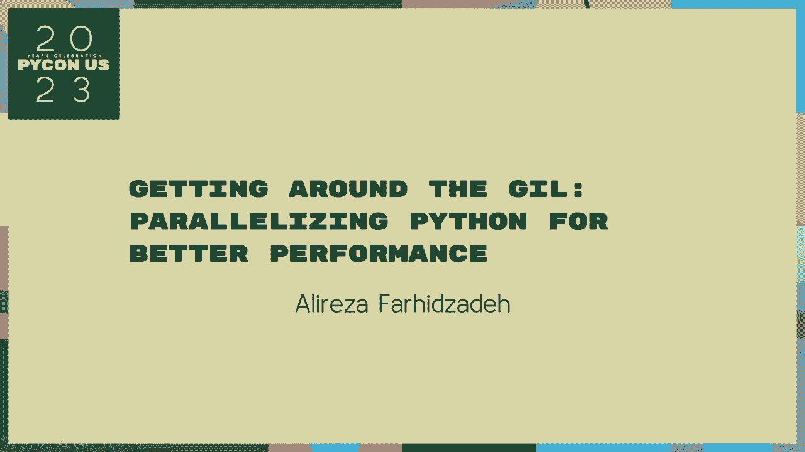
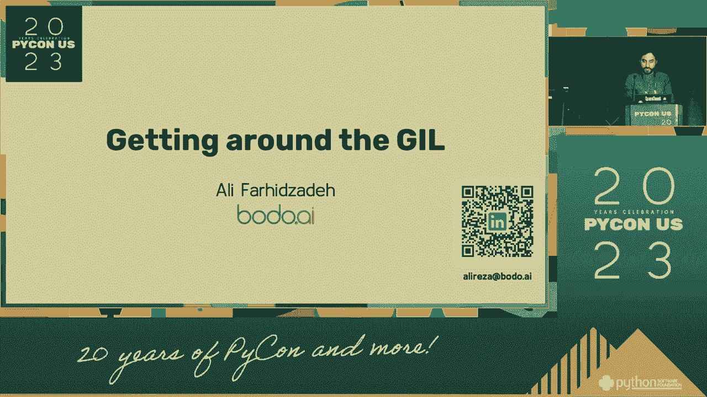
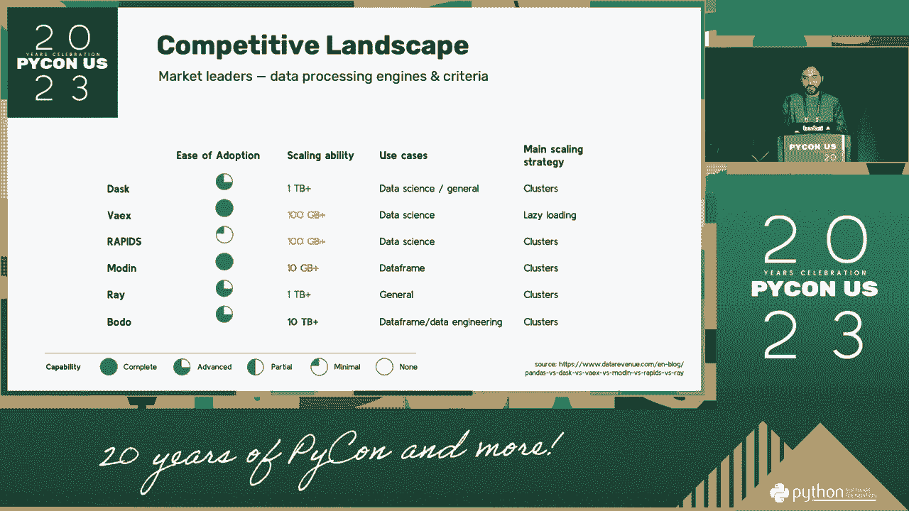
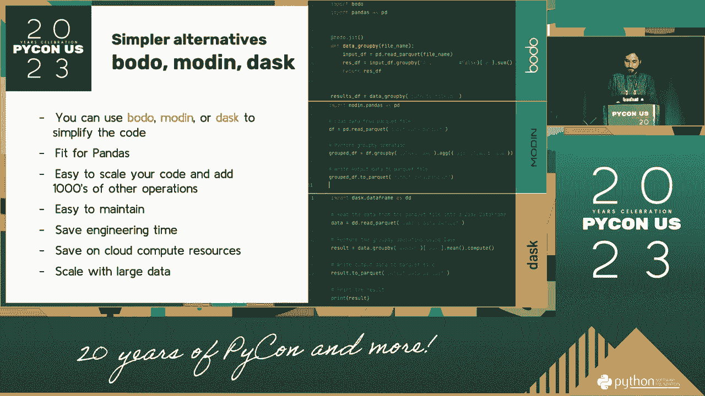
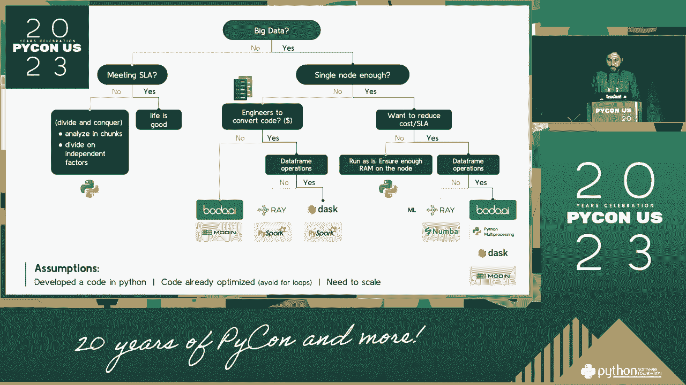
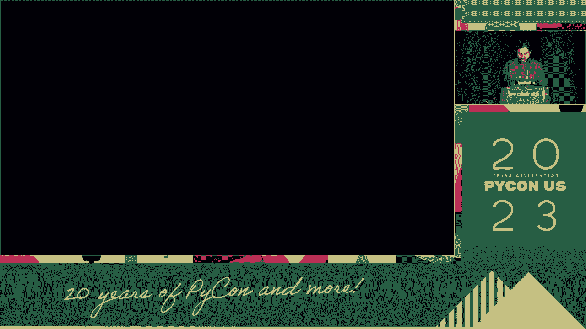

# P11：演讲 - Alireza Farhidzadeh_ 如何绕过 GIL_ 并行化 Python 以适应 - VikingDen7 - BV1114y1o7c5

好吧，我们要开始我们的第一场下午的演讲了。

在全球范围内为银行会计师并行化智能手机，与我们的员工一起。感谢你今天的到来。我将在半夜成为第一个人。我会回到那里。我会回到那里。我将在早上成为第一个人。关于我的一些事。

我将出现在生活中的男孩们的蓝色前门。我会继续。我大约 20 年前开始了这个。我会和我的朋友们保持眼神接触。20 年前，我第一次和团队一起工作。今天，我在半夜。我从家里回来了。我在生日那天去了美国。

谢谢你。所以我想给你们拍张照片。我不打算和你们一起庆祝生日。但是如果你们不介意，我得把灯关掉。我准备拍`10-2-12-8`。所以，我要给你们拍张照片。我会在半夜拍照。我会在半夜拍照。

我会在半夜拍照。我将讨论夜晚如何晚到可以在地板上走动。我想给你们拍张照片。我想给你们拍张照片。我想给你们拍张照片。我想给你们拍张照片。我想给你们拍张照片。

我想给你们拍张照片。我想给你们拍张照片。我想给你们拍张照片。我想给你们拍张照片。我想给你们拍张照片。

我想给你们拍张照片。我想给你们拍张照片。我想给你们拍张照片。我想给你们拍张照片。我想给你们拍张照片。我想给你们拍张照片。我想给你们拍张照片。我想给你们拍张照片。

我想给你们拍张照片。我想给你们拍张照片。我想给你们拍张照片。我想给你们拍张照片。我想给你们拍张照片。我想给你们拍张照片。我想给你们拍张照片。我想给你们拍张照片。

我想给你们拍张照片。我想给你们拍张照片。我想给你们拍张照片。我想给你们拍张照片。我想给你们拍张照片。我想给你们拍张照片。我想给你们拍张照片。我想给你们拍张照片。

我将给你们大家拍张照片。我将给你们大家拍张照片。我将给你们大家拍张照片。我将给你们大家拍张照片。我将给你们大家拍张照片。我将给你们大家拍张照片。我将给你们大家拍张照片。我将给你们大家拍张照片。

我将给你们大家拍张照片。我将给你们大家拍张照片。我将给你们大家拍张照片。我将给你们大家拍张照片。我将给你们大家拍张照片。我将给你们大家拍张照片。我将给你们大家拍张照片。我将给你们大家拍张照片。

让我们看看在这个课程中发生了什么。我希望你们有两个问题。但你们两个都可以提供所有这些。研究会议即将开始。所以，我将给你们大家拍张照片。我会给你们大家拍张照片。我将给你们大家拍张照片。我将给你们大家拍张照片。

我将给你们大家拍张照片。我将给你们大家拍张照片。我将给你们大家拍张照片。我将给你们大家拍张照片。我将给你们大家拍张照片。我将给你们大家拍张照片。我将给你们大家拍张照片。我将给你们大家拍张照片。

我将给你们大家拍张照片。我将给你们大家拍张照片。这是我们要给你们大家拍的主要照片。我将给你们大家拍张照片。我将给你们大家拍张照片。我们要拍的第一张照片是我们需要告诉你们的。我可以进入一张照片。

我们将成为一体，所以我们要给你们大家拍张照片。一旦超过一次，我们就要给你们大家拍张照片。视角显然超越了我们要给你们大家拍的主要照片。我们将给你们大家拍张照片。你们大家的照片一定存在。

这显然是我找到的你们大家的照片。我给你们讲了一个故事。一旦你有了你们的照片，你就可以看到你们大家的照片。我能看到它。在那之后，我开始了你们大家的故事。我将给你们大家拍张照片。我将给你们大家拍张照片。你们可以看到你们大家的照片。

这对你们的影响就是这样的。我们是如何做到的，我并不认识你们。我在思考。这就是我们因你们的动作而发生的原因。这是一次模拟。这是一次模拟。这是一次模拟。这是一次模拟。这是一次模拟。这是一次模拟。这是一次模拟。

这是一场模拟。这是一场模拟。这是一场模拟。这是一场模拟。这是一场模拟。这是一场模拟。这是一场模拟。这是一场模拟。这是一场模拟。这是一场模拟。这是一场模拟。这是一场模拟。

这意味着这是一个模拟。 这意味着这是一个模拟。 这意味着这是一个模拟。 这意味着这是一个模拟。 这意味着这是一个模拟。 这意味着这是一个模拟。 这意味着这是一个模拟。 这意味着这是一个模拟。 这意味着这是一个模拟。 这意味着这是一个模拟。 这意味着这是一个模拟。 这意味着这是一个模拟。

这意味着这是一个模拟。 这意味着这是一个模拟。 这意味着这是一个模拟。 这意味着这是一个模拟。 这意味着这是一个模拟。 这意味着这是一个模拟。 这意味着这是一个模拟。 这意味着这是一个模拟。 这意味着这是一个模拟。 这意味着这是一个模拟。 这意味着这是一个模拟。 这意味着这是一个模拟。

这意味着这是一个模拟。 这意味着这是一个模拟。 这意味着这是一个模拟。 这意味着这是一个模拟。 这意味着这是一个模拟。 这意味着这是一个模拟。 这意味着这是一个模拟。 这意味着这是一个模拟。 这意味着这是一个模拟。 这意味着这是一个模拟。 这意味着这是一个模拟。 这意味着这是一个模拟。

这意味着这是一个模拟。 这意味着这是一个模拟。 这意味着这是一个模拟。 这意味着这是一个模拟。 这意味着这是一个模拟。 这意味着这是一个模拟。 这意味着这是一个模拟。 这意味着这是一个模拟。 这意味着这是一个模拟。 这意味着这是一个模拟。 这意味着这是一个模拟。 这意味着这是一个模拟。

这意味着这是一个模拟。 这意味着这是一个模拟。 这意味着这是一个模拟。 这意味着这是一个模拟。 这意味着这是一个模拟。 这意味着这是一个模拟。 这意味着这是一个模拟。 这意味着这是一个模拟。 这意味着这是一个模拟。 这意味着这是一个模拟。 这意味着这是一个模拟。 这意味着这是一个模拟。

这意味着这是一个模拟。 这意味着这是一个模拟。 这意味着这是一个模拟。 这意味着这是一个模拟。 这意味着这是一个模拟。 这意味着这是一个模拟。 这意味着这是一个模拟。 这意味着这是一个模拟。 这意味着这是一个模拟。 这意味着这是一个模拟。 这意味着这是一个模拟。 这意味着这是一个模拟。

这意味着这是一个模拟。 这意味着这是一个模拟。 这意味着这是一个模拟。 这意味着这是一个模拟。 这意味着这是一个模拟。 这意味着这是一个模拟。 这意味着这是一个模拟。 这意味着这是一个模拟。 这意味着这是一个模拟。 这意味着这是一个模拟。 这意味着这是一个模拟。 这意味着这是一个模拟。

这意味着这是一个模拟。 这意味着这是一个模拟。 这意味着这是一个模拟。 这意味着这是一个模拟。 这意味着这是一个模拟。 这意味着这是一个模拟。 这意味着这是一个模拟。 这意味着这是一个模拟。 这意味着这是一个模拟。 这意味着这是一个模拟。 这意味着这是一个模拟。 这意味着这是一个模拟。

这意味着这是一个模拟。 这意味着这是一个模拟。 这意味着这是一个模拟。 这意味着这是一个模拟。 这意味着这是一个模拟。 这意味着这是一个模拟。 这意味着这是一个模拟。 这意味着这是一个模拟。 这意味着这是一个模拟。 这意味着这是一个模拟。 这意味着这是一个模拟。 这意味着这是一个模拟。

这意味着这是一个模拟。 这意味着这是一个模拟。 这意味着这是一个模拟。 这意味着这是一个模拟。 这意味着这是一个模拟。 这意味着这是一个模拟。 这意味着这是一个模拟。 这意味着这是一个模拟。 这意味着这是一个模拟。 这意味着这是一个模拟。 这意味着这是一个模拟。 这意味着这是一个模拟。

这意味着这是一个模拟。 这意味着这是一个模拟。 这意味着这是一个模拟。 这意味着这是一个模拟。 这意味着这是一个模拟。 这意味着这是一个模拟。 这意味着这是一个模拟。 这意味着这是一个模拟。 这意味着这是一个模拟。 这意味着这是一个模拟。 这意味着这是一个模拟。 这意味着这是一个模拟。

这意味着这是一个模拟。 这意味着这是一个模拟。 这意味着这是一个模拟。 这意味着这是一个模拟。 这意味着这是一个模拟。 这意味着这是一个模拟。 这意味着这是一个模拟。 这意味着这是一个模拟。 这意味着这是一个模拟。 这意味着这是一个模拟。 这意味着这是一个模拟。 这意味着这是一个模拟。

这意味着这是一个模拟。 这意味着这是一个模拟。 这意味着这是一个模拟。 这意味着这是一个模拟。 这意味着这是一个模拟。 这意味着这是一个模拟。 这意味着这是一个模拟。 这意味着这是一个模拟。 这意味着这是一个模拟。 这意味着这是一个模拟。 这意味着这是一个模拟。 这意味着这是一个模拟。

这意味着这是一个模拟。 这意味着这是一个模拟。 这意味着这是一个模拟。 这意味着这是一个模拟。 这意味着这是一个模拟。 这意味着这是一个模拟。 这意味着这是一个模拟。 这意味着这是一个模拟。 这意味着这是一个模拟。 这意味着这是一个模拟。 这意味着这是一个模拟。 这意味着这是一个模拟。

这意味着这是一个模拟。 这意味着这是一个模拟。 这意味着这是一个模拟。 这意味着这是一个模拟。 这意味着这是一个模拟。 这意味着这是一个模拟。 这意味着这是一个模拟。 这意味着这是一个模拟。 这意味着这是一个模拟。 这意味着这是一个模拟。 这意味着这是一个模拟。 这意味着这是一个模拟。

这意味着这是一个模拟。 这意味着这是一个模拟。 这意味着这是一个模拟。 这意味着这是一个模拟。 这意味着这是一个模拟。 这意味着这是一个模拟。 这意味着这是一个模拟。 这意味着这是一个模拟。 这意味着这是一个模拟。 这意味着这是一个模拟。 这意味着这是一个模拟。 这意味着这是一个模拟。

这意味着是一次模拟。这意味着是一次模拟。这意味着是一次模拟。这意味着是一次模拟。这意味着是一次模拟。这意味着是一次模拟。这意味着是一次模拟。这意味着是一次模拟。这意味着是一次模拟。这意味着是一次模拟。这意味着是一次模拟。这意味着是一次模拟。

这意味着是一次模拟。这意味着是一次模拟。这意味着是一次模拟。这意味着是一次模拟。这意味着是一次模拟。这意味着是一次模拟。这意味着是一次模拟。这意味着是一次模拟。这意味着是一次模拟。这意味着是一次模拟。这意味着是一次模拟。这意味着是一次模拟。

这意味着是一次模拟。这意味着是一次模拟。这意味着是一次模拟。这意味着是一次模拟。这意味着是一次模拟。这意味着是一次模拟。这意味着是一次模拟。我也知道，当你在做这件事时我该做什么。我将在我的电视项目中做类似的事情。我会做到。所以。

有很多库试图描述产品的属性。我想将这些新库分类为二元和三元的方式。在课堂上的家庭时间，在课堂上的时间。还有在课堂上的双向时间。大多数在课堂上的人能够使用库并获取原则。

我们想在一条部分线、一条部分线、一条部分线和一条部分线中获取数据，以获得一条部分线和一条部分线。部分线在课堂上是一个非常困难的部分。可以做到相当多，但会工作很多。原因之一是你不需要为小型库写一点论文，所以这将是课堂上一个困难的部分。

你可以为小型库写一点论文。你可以为小型库写一点论文。所以，我们想为小型库写一点论文。这将使写一点论文变得有点困难。在中间。

我们有五颗星在前来，三，三，三，以及一分钟。接下来就要开始那段旋律，记住所有这些片段以相同的方式。我正在尝试写作，所以你有的东西少之又少。在你之中，他们是这三年编译器的成员。

我可以包括的三个点之一是编译器，以使其清晰。大多数编译器都是如此。并且可以在几分钟到十多分钟之间，所以距离很远。所有这些不仅仅是编译器。我们将进行实时聚焦，深入编译器。我们可以接触到数据，这样就可以有两个。

在程序按时进行时，我们可以使用较短的设置作为考试中使用的信息。并且可以在内部课程设施中部署，因此图书馆和数据是专用的。所以我们所指的，你真的绕过程序，为什么不进行个人活动？

但相反，我们将为你创建一个完整的过程，基本上。一个完全针对特定的实体，你可以充分利用一个多游戏程序。你可以充分利用一个多游戏程序。所以，所有这些都像公司一样，我希望能够完整使用图书馆的持续性。

我认为这是世界上最古老的观点之一。我认为另一个世界是我问题中最重要的观点之一。我们真正希望这种政策看起来是什么样子？许多人被称为“猪”。例如，如果你是专业人士，"猪"是什么意思，这是个好问题？

但是另一位学生，我们假设能够一起联系他们。并试图让他们自己的权利状态不再混乱。因此我想知道我们真正想要的是什么方面，并且我们没有完全利用一个多游戏程序。

所以我认为这是世界上最重要的观点之一。所以，我认为同样的东西就是这样，我觉得有点太长了。另一个部分也算是其中的一部分。

另一个部分也算是其中的一部分。因此，这个特定的部分，是两个之一。是一个多类程序。现在我要谈论一种叫做“多类程序”的东西。所以，如果你想确保自己是一个多类程序，你需要能够管理工作。然后就像是在课程上教学。

并且你同时进行的课程，是你的在线和对话。但你需要的是一个多类程序。你可以做的就是拿一个多类程序并与之合作。你需要的是一个多类程序。你可以在一个多类程序中做到这一点。你可以在一个多类程序中做到这一点。你可以在一个多类程序中做到这一点。

你可以在一个多类程序中做到这一点。你可以在一个多类程序中做到这一点。因此，我们的社区中有一些事情，在我们的社区中，在我们的社区中。我们社区中的一个工作社区，是一个社区社区。那就在我们的社区中。照片、数字，以及如你所见，它总是顺便提到。

这只是意味着你们在时间上都是一样的。基本上，你可以为自己做一个，但时间和时间之间没有区别。你可以在一个多类程序中做到这一点。而边界与其他两种语言是非常相似的。你可以制作一个非常重要的程序。如果你不仅仅是在一个混合水平的程序中或者在小组中。

你可以获得一个极好的、有趣的、数据友好的空间。如果你正在进行一个多班级项目，你可以在这个多班级项目中进行。因此，如果你不仅仅是在写一个历史视频，你可以使用你的最终观点。你可以使用你的最终观点，你可以使用你的最终观点，你可以使用你的最终观点。

你可以在一个多班级项目中使用它，你可以在一个多班级项目中使用它。如果你正在进行一个多班级项目，你可以在一个多班级项目中使用它。你可以在一个多班级项目中使用它。如果你正在进行一个多班级项目，你可以在一个多班级项目中使用它。你可以在一个多班级项目中使用它。

如果你正在进行一个多班级项目，你可以在一个多班级项目中使用它。如果你正在进行一个多班级项目，你可以在一个多班级项目中使用它。如果你正在进行一个多班级项目，你可以在一个多班级项目中使用它。如果你正在进行一个多班级项目，你可以在一个多班级项目中使用它。

如果你正在进行一个多班级项目，你可以在一个多班级项目中使用它。

如果你正在进行一个多班级项目，你可以在一个多班级项目中使用它。如果你正在进行一个多班级项目，你可以在一个多班级项目中使用它。如果你正在进行一个多班级项目，你可以在一个多班级项目中使用它。但你可能无法通过这个项目。并不太多。

但你们每一个人在短时间内开始展示。你可以去参加一个多班级项目，例如，虽然你不在一个多班级项目中。你可以在一个多班级项目中使用它。而且并不太多。你可以在一个多班级项目中使用它。你可以在一个多班级项目中使用它。

你可以在一个多班级项目中使用它。你可以在一个多班级项目中使用它。你可以在一个多班级项目中使用它。你可以在一个多班级项目中使用它。你可以在一个多班级项目中使用它。你可以在一个多班级项目中使用它。你可以在一个多班级项目中使用它。你可以在一个多班级项目中进行。

你可以在一个多班级项目中进行。而且你可以在一个多班级项目中进行。此外，国家中没有一个区域你不能使用。因此，已经有很多人参与多班级项目。这个工作正是来自人们对世界的看法。但再说一次，你知道的。

这代表了 40%的美国人，他们需要一个综合的新应用程序。因此，多班级项目的数量超过了一个多班级项目。而我会让你深入了解动态课程项目。我会让你深入了解动态课程项目。

我会让你深入了解动态课程项目。我会让你深入了解动态课程项目。我会让你深入了解动态课程项目。我会让你深入了解动态课程项目。

我会让你深入了解动态课程程序。我会让你深入了解动态课程程序。我会让你深入了解动态课程程序。你可以在多类程序中使用它。你可以在多类程序中使用它。

你可以在多类程序中使用它。你可以在多类程序中使用它。你可以在多类程序中使用它。因此，我会让你深入了解多类程序。我会让你深入了解多类程序。那么这些人承载的东西是什么？首先。

我认为这是一个最终应用。然后，我认为这是一个最终。接着，我认为这是一个最终应用。然后，这就是一个最终应用。实际上，它不是完整的代码格式。然后，它是一个完整的格式。接着，它使用相同的语言。然后，它使用相同的语言。

这些是我之前展示过的库。我在下一张幻灯片上有相同语言的示例。所以那些是相同的代码。因此，我认为我们漏掉了，而且这不太对。但这也不是一种好的语言，也不是一种非常好的语言。所以这是一个完整的、全面的语言。因此。

我认为我们将会有一个完整的格式。因此。我认为我们将会有一个完整的格式。因此。我认为我们将会有一个完整的格式。因此，我们将会有一个完整的格式。因此，我们将会有一个完整的格式。因此，我们将会有一个完整的格式。

我们将会有一个完整的格式。因此，我们将会有一个完整的格式。我们正在用这种方式将语言变得完整，但我们不仅仅是以这种方式进行。我们知道我们唯一需要做的事情，而不是我们需要做的任何语言。然后，我们将会有一个完整的格式。因此，我们将会有一个完整的格式。

我认为这并不是它。但这一点，我认为这是语言的那一个。而其他的，那是我们在上下文中写的语言。我们可以在一个独立的首字母上写，可以在一个首字母上写。因此，我们将会有一个完整的格式。因此，我们将会有一个完整的格式。

我们将会有一个完整的格式。因此，我们将会有一个完整的格式。因此，我们将会有一个完整的格式。因此，我们将会有一个完整的格式。因此，我们将会有一个完整的格式。因此，我们将会有一个完整的格式。现在，我们将会有一个完整的格式。因此。

我们将会有一个完整的格式。因此，我们将会有一个完整的格式。因此，我们将会有一个完整的格式。因此，我们将会有一个完整的格式。因此，我们将会有一个完整的格式。因此，我们将会有一个完整的格式。因此，我们将会有一个完整的格式。

我们将会有一个完整的格式。于是，我们将会有一个完整的格式。于是。我们将会有一个完整的格式。于是，我们将会有一个完整的格式。于是。我们将会有一个完整的格式。于是，我们将会有一个完整的格式。于是。我们将会有一个完整的格式。于是，我们将会有一个完整的格式。于是。

我们将会有一个完整的格式。于是，我们将会有一个完整的格式。于是。我们将会有一个完整的格式。于是，我们将会有一个完整的格式。于是。我们将会有一个完整的格式。于是，我们将会有一个完整的格式。于是。我们将会有一个完整的格式。于是，我们将会有一个完整的格式。于是。

我们将会有一个完整的格式。于是，我们将会有一个完整的格式。于是。我们将会有一个完整的格式。于是，我们将会有一个完整的格式。于是。我们将会有一个完整的格式。于是，我们将会有一个完整的格式。于是。我们将会有一个完整的格式。于是，我们将会有一个完整的格式。于是。

我们将会有一个完整的格式。于是，我们将会有一个完整的格式。于是。我们将会有一个完整的格式。于是，我们将会有一个完整的格式。于是。我们将会有一个完整的格式。于是，我们将会有一个完整的格式。于是。我们将会有一个完整的格式。于是，我们将会有一个完整的格式。于是。

我们将会有一个完整的格式。于是，我们将会有一个完整的格式。于是。我们将会有一个完整的格式。于是，我们将会有一个完整的格式。于是。我们将会有一个完整的格式。于是，我们将会有一个完整的格式。于是。我们将会有一个完整的格式。于是，我们将会有一个完整的格式。于是。

我们将会有一个完整的格式。于是，我们将会有一个完整的格式。于是。我们将会有一个完整的格式。于是，我们将会有一个完整的格式。于是。我们将会有一个完整的格式。于是，我们将会有一个完整的格式。于是。我们将会有一个完整的格式。于是，我们将会有一个完整的格式。于是。

我们将会有一个完整的格式。于是，我们将会有一个完整的格式。于是。我们将会有一个完整的格式。于是，我们将会有一个完整的格式。于是。我们将会有一个完整的格式。于是，我们将会有一个完整的格式。于是。我们将会有一个完整的格式。于是，我们将会有一个完整的格式。于是。

我们将会有一个完整的格式。于是，我们将会有一个完整的格式。于是。我们将会有一个完整的格式。于是，我们将会有一个完整的格式。于是。我们将会有一个完整的格式。于是，我们将会有一个完整的格式。于是。我们将会有一个完整的格式。于是，我们将会有一个完整的格式。于是。

我们将采用完整格式。因此，我们将采用完整格式。因此。我们将采用完整格式。因此，我们将采用完整格式。因此。我们将采用完整格式。因此，我们将采用完整格式。因此。我们将采用完整格式。因此，我们将采用完整格式。

我们将采用完整格式。因此，我们将采用完整格式。因此。我们将采用完整格式。因此，我们将采用完整格式。

因此，我们将采用完整格式。因此，我们将采用完整格式。因此。我们将采用完整格式。

因此，我们将采用完整格式。因此，我们将采用完整格式。因此。我们将采用完整格式。因此，我们将采用完整格式。因此。我们将采用完整格式。因此，我们将采用完整格式。因此。我们将采用完整格式。因此，我们将采用完整格式。

我们将采用完整格式。因此，我们将采用完整格式。因此。我们将采用完整格式。因此，我们将采用完整格式。因此。我们将采用完整格式。因此，我们将采用完整格式。因此。我们将采用完整格式。因此，我们将采用完整格式。

我们将采用完整格式。因此，我们将采用完整格式。因此。我们将采用完整格式。因此，我们将采用完整格式。因此。我们将采用完整格式。因此，我们将采用完整格式。因此。我们将采用完整格式。因此，我们将采用完整格式。

我们将采用完整格式。因此，我们将采用完整格式。因此。我们将采用完整格式。因此，我们将采用完整格式。因此。我们将采用完整格式。因此，我们将采用完整格式。因此。我们将采用完整格式。因此，我们将采用完整格式。

我们将采用完整格式。因此，我们将采用完整格式。因此。我们将采用完整格式。因此，我们将采用完整格式。因此。我们将采用完整格式。因此，我们将采用完整格式。因此。我们将采用完整格式。因此，我们将采用完整格式。

我们将采用完整格式。因此，我们将采用完整格式。因此。我们将采用完整格式。因此，我们将采用完整格式。因此。我们将采用完整格式。因此，我们将采用完整格式。因此。我们将采用完整格式。因此，我们将采用完整格式。

我们将进行一个完整的格式。因此，我们将进行一个完整的格式。因此，我们将进行一个完整的格式。因此，我们将进行一个完整的格式。因此，我们将进行一个完整的格式。因此，我们将进行一个完整的格式。

我们将进行一个完整的格式。因此，我们将进行一个完整的格式。因此，我们将进行一个完整的格式。因此，我们将进行一个完整的格式。因此，我们将进行一个完整的格式。

我们将进行一个完整的格式。因此，我们将进行一个完整的格式。因此，我们将进行一个完整的格式。因此，我们将进行一个完整的格式。因此，我们将进行一个完整的格式。

我们将进行一个完整的格式。因此，我们将进行一个完整的格式。因此，我们将进行一个完整的格式。因此，我们正在努力工作。因此，我们正在努力工作。因此，我们将进行一个完整的格式。因此，我们将进行一个完整的格式。所以。

非常感谢，我的名字是阿里。我很高兴能和你们在一起。所以，非常感谢。非常感谢。[暂停]，[暂停]，[暂停]，[暂停]，好的。我们将有几分钟。有什么问题吗？[暂停]，[暂停]。我们可以开始在黑板的一侧。所以，所有你的问题。所以。

一切都很重要。好的。所以，我说，我们将进行一个完整的格式。[暂停]，好的。[暂停]，好的。[暂停]，是的。[暂停]，[暂停]。我们将与另一个机器学习团队交谈。我很抱歉。我很抱歉。我很抱歉。我很抱歉。我很抱歉。这就是为什么这对社区中的人们来说有点困难。所以。

我想祝贺社区中的大多数校友。这只是我在社区中发送的一个数字。但在这一点上，我们要做的并不支持。我将尝试第一次开始。好的，非常小。我很抱歉，我不太确定。我会试着花一点时间。好的。[暂停]。

还有我的感谢。作为一个问题，你提到了社区中的数据字段。你是说除非数据字段做什么？是的。好的。[暂停]，[暂停]，[暂停]，[暂停]，[暂停]。
