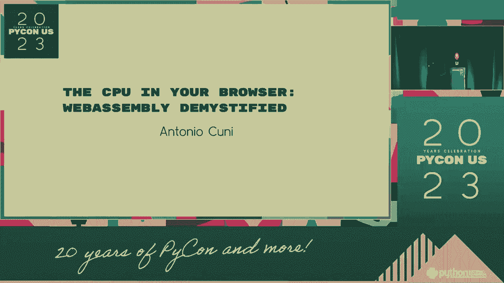
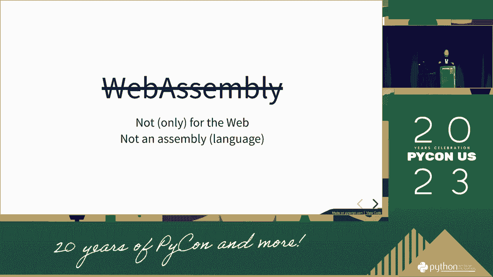
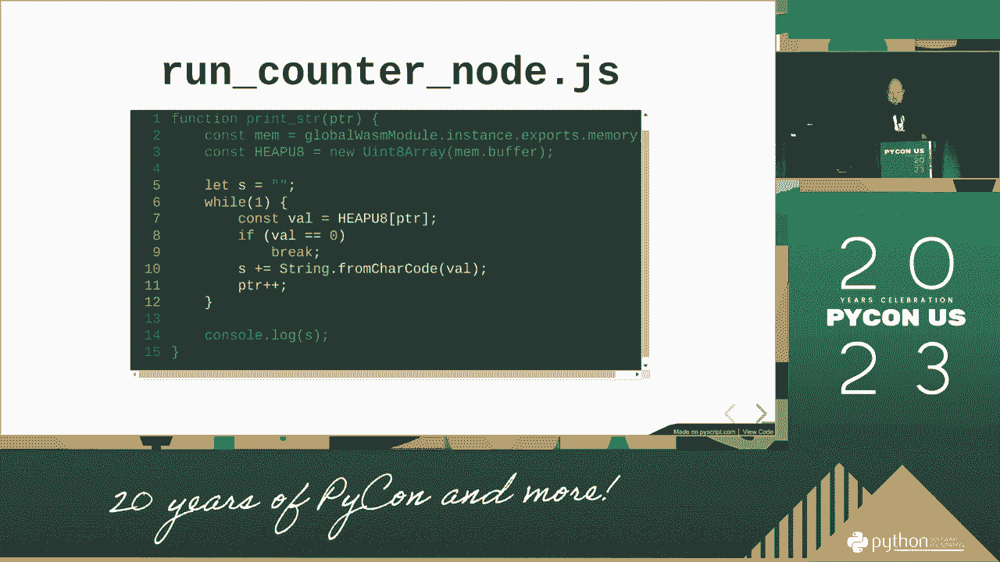
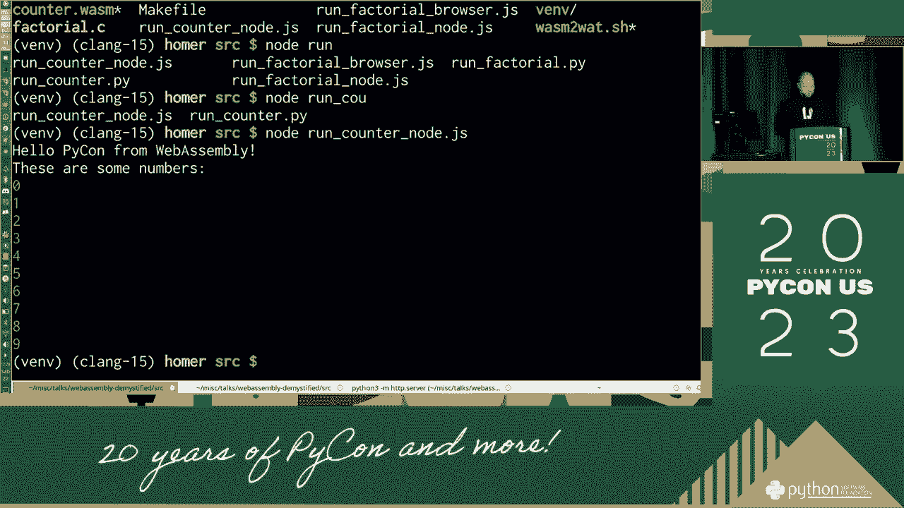
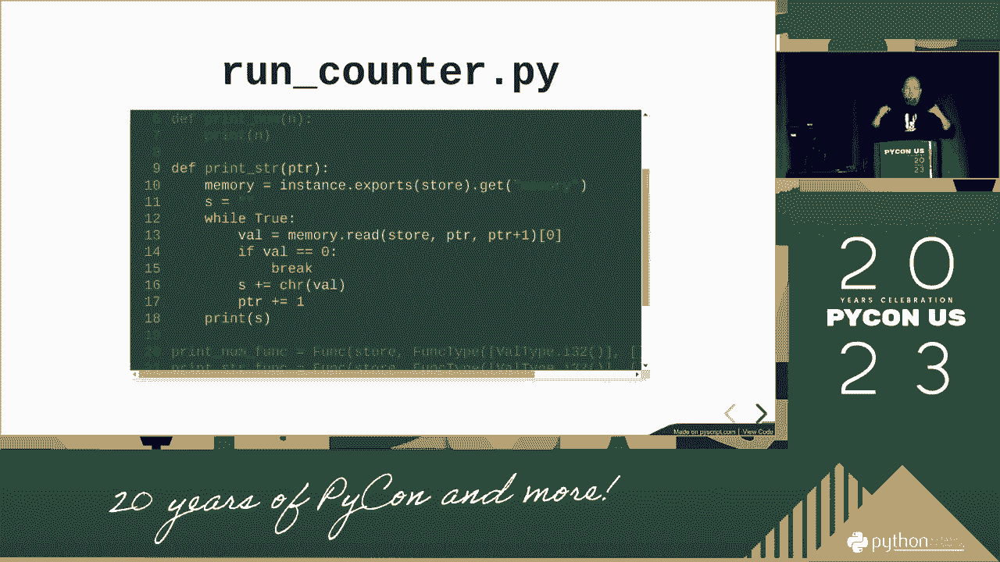
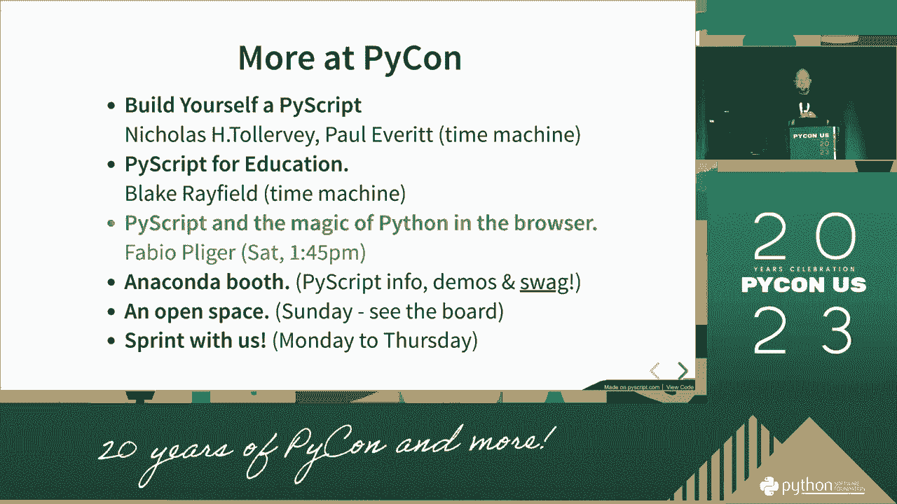
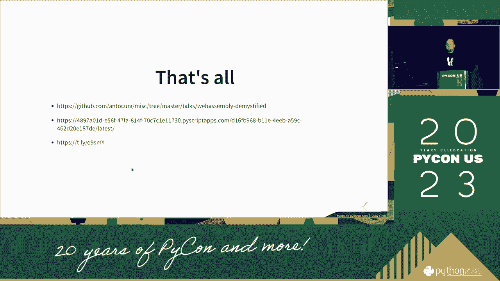

# WebAssembly 揭秘：P15：浏览器中的 CPU

在本节课中，我们将要学习 WebAssembly 的核心概念、工作原理及其在浏览器中的运行机制。我们将探讨二进制格式、运行时环境以及如何将高级语言编译为 WebAssembly 模块。

## 概述

WebAssembly 是一种为 Web 设计的低级二进制指令格式。它旨在成为高级语言（如 C/C++、Rust）在 Web 上的编译目标，以实现接近原生的性能。本节课程将解析其技术原理。

---

## WebAssembly 揭秘：P15-1：二进制格式与核心概念

让我们探讨 WebAssembly 的基础。WebAssembly 的核心是一种二进制格式，它可能是实现高性能 Web 应用的最佳方式。

具体细节是什么？这可以视为一个存在已久的问题。WebAssembly 本质上是对低级计算问题的一种解决方案。它是一种具有特定属性的二进制格式。

在二进制领域中，存在数百种不同的状态。实际上，你可以运行成千上万个无法直接通过 JavaScript 触及的示例。你可以获得三种无法在传统 Web 中找到的优势。浏览器没有其他方式能提供这种能力。这就是我们讨论 WebAssembly 的原因。

WebAssembly 是一个不同的范式，因此开发社区将能够发掘其潜力。所有现代浏览器都支持 WebAssembly 格式。当我们在开发道路上时，我们将能够找到一种新的“书写”代码的方式，这将带来许多新的可能性。

还有其他独立的运行时环境，它们可以替代浏览器运行。运行时环境有很多种。在 Web 环境中，运行时就是浏览器的样子。实际上，WebAssembly 的意义更在于扩展 Web 的能力边界。能实现的内容会更多。

这在项目成功的初期很重要，原因在于你可以理解其设计原理。它的实现是完整的。你可以看到这是因为有限组件的成本是运行时的一部分。我们可以在后续版本中实现更多功能。

现在，坦白地说。我们不一定准备好将任何事情都视为 WebAssembly 的直接产物。但如果你想理解它，可以认为它的抽象层级稍低一些。你可以使用工具链和不同的公式，以更易读的方式工作。

所有的 WebAssembly 模块都简称为 **Wasm**。令人惊讶的是，我们能够使用两样东西。WebAssembly 对 Wasm 和宿主环境（如浏览器）是相同的。WebAssembly 有两个主要输出：模块和实例。还有一个是在 WebAssembly 系统接口层面。

我不会深入探讨同事间的交流细节。但如果你在这里应用它的方式，你能看到的是，代码会进入这种二进制格式。还有另一个概念：编排。编排就是你能做的事情。它已经与我们能管理的网络资源建立了联系。

然后你可以编写你能做的事情。你在进行语言层面的工作，而它们被编译成字节码，让你不处于解释执行的劣势。这就是为什么你可以开始更多地了解这门语言。这不过是一种避免过于依赖解释执行的方式。

---

## WebAssembly 揭秘：P15-2：编译与执行模型

上一节我们介绍了二进制格式，本节中我们来看看 WebAssembly 的编译与执行模型。

我们看到了响应式编程的规则及其意义。就像艺术创作一样，最有价值的表达方式是尝试进入其核心机制。你可以将其视为一个单一实体，这与为少数人使用的东西有些不同，而且可能不止于此。这是一件非常重要的事情。

我们可以了解更多，但这取决于我们如何称呼它。在代码中，我们需要运行以加载标准二进制文件，获取值并仅从中运行。我不会讨论其视觉呈现问题。重要的是我们是表达者。二进制代码是编译器需要生成的内容。这是之前由 C/C++ 等语言编译的。

然后我们关联随机模型，得到一些可以从两者出发的东西。所以在这里我们发现，我们可以计算逻辑代码和两者的功能。然后它可以驱动小型任务。我们可以做到这一点。一个更好的例子是在编译器从底层汇编运行之前。但是，这没问题。

同样，它可以运行在本地运行时中。我们进入了 Go 语言环境。如果你有一个运行时，你可以使用之前相同的二进制代码并从 Python 中运行。通常的步行时间，这是许多不同方式之一。这不会让你提前结束。不仅仅是同样的。

但我们可以看到我们有一个非常大的能力，我们可以看到我们可以运行二进制文件。我们可以运作，我们可以测试其中一部分。我的意思是，我想让我非常清楚：你不是在浏览器中直接运行 Python 解释器。我不能让 Python 解释器持续运行。我们必须进行一次性运行。

因为在一次性运行中，没有任何持久状态会工作。但我们可以让它向前推进，抓住正在进行的事情。你可以向下深入。你可以做的是理解为什么每个人都可以进行一次性运行。你也可以做的事情是，包含所有的依赖，进行 50/50 的混合运行。

并使计划者完成指令，仅此而已。默认情况下，你可以让你的任何东西变得更好。以这样的方式完成，你没有问题要问。你可以做任何其他事情。你可以做任何不同的事情。你甚至没有笨拙的事情或计时器。这就是为什么来这里运行是安全的原因。

但这让我思考了很久，因为我们怎么能在这个技术领域转变，以及那里的技术隔离是如此简单。所以，当我声明同样是二进制时，我甚至无法关注家庭细节。我甚至不能声明这是重要功能和程序意图。

输入由主机环境提供。在样本默认设置中，模板在这里。主机是操作系统，和 Web 友好环境。在样本中，有一个用于 Web 友好的 Python 示例。在重要功能中，我由主机提供。最后，有一整块可以处理系统交互。

如果这些人是其中之一。在这个例子中，我们看到如何对世界上发生的事情达成一致。你认为会有什么样的世界？如果你支付家庭以达成共识，你可以来自他们的省份。但是如果你继续前进，第一世界，如果你继续前进，你就无法与第一世界达成一致。

当我们无法达成一致时，我们需要提供一种实现功能的方法。如果我编译它，你知道我即将节省大量时间。你可以看到我们可以尝试那个更创新的方法。现在我不是母亲，为了继续要搁置那件事。我们需要提供来自环境的关键。然后如果我尝试运行它。

我现在不会通过浏览器运行，但你可以在我们所有人中观看。知道这一点。所以如果代码更好，最好在手机上进行。我希望能够达到你可以是二进制的程度。你会看到这不是关键部分，我提供了我们需要的这个功能的重要环境。

我们正在创造我们所拥有的东西。然后做我们想做的事情可能是一件好事。所以我会多放一点进去。因此，我们这里的事情比我们现在要做的要困难得多。当事实上，它是。我失去了计算机的安装。我们想要知道的另一件事是，它可能会更有趣。

硬件信息将会被解释。我们想要记住的另一件事是，驱动程序将会遇到其他事情。我们想做的另一件事是，运行时可以解码并尝试模块化它。我们刚刚遇到了性能问题，因为，你知道，当你处理性能时。

从驱动程序的视角来看，有机会联系你、运行并与模型对话。所以，客户不会认为他必须处理性能问题，所以这不是一个重点。我们应该去做，我不知道我想要进行多长时间。然后，我无法通过这种方式在内存中产生偏差。

然后，我必须说一些将要成为性能瓶颈的东西。然后将它们带到性能优化两年。但它们将妨碍从内存中获取视觉主体，直到我找到正确类型的问题，它就是零。我将把它们带到性能优化。因此，我能够从我的性能优化中拿起球，最后我喜欢这个团队。

---

## WebAssembly 揭秘：P15-3：内存管理与系统交互

上一节讨论了执行模型，本节我们将深入了解 WebAssembly 的内存管理与系统交互。

在驱动程序那里，我有一封清晰的信给第 12 个价格，以及在客户头上的一张便条，正好在那一刻。是的。就是这样。然后，在同样的结果中，我们上次在我之前提到的模块中做了同样的事情。

在这种情况下，一旦事情再次发生，我觉得那是记忆。这一个可以是一些可以来到我们的性能优化并提供很长时间的东西。在发生器中，我可以读取内存，数字的值。那是事情的关键值，然后从底部到顶部，然后它可以是其中的几个。然后最终它可以是的。所以给我一个关键。这个关键在游戏中有时是一个关键值。

在你如何尝试不花钱的视角中，这意味着什么？这又意味着什么呢？提供功能后，这将是你的方式。

有一件事很好，但也很好，我觉得这很好，因为我觉得这很好。但我认为这非常重要，这很好，这是在之前提供的功能。打开你的文件，打开你的文件，把它写入定价，放在纸上。你可以做的是选择热。因为我正在从市场中拿走钱包。

我决定钱包在同一范围内打开。是什么推动了相同的范围。什么购买了组。如果我是作者，我可以把一个钱包扔进钱包里。我可以把它送到市场，钱包可以存储在相同的价格中。或者我可以实现一个完全美丽的位置。

这就是美元发生的事情，我说的就是，口袋里的美元。当你处于高点时，你会有美好的事物。你可以使用不同的定价库，并将它们导入。然后你可以进入功能，选择打开，文件，然后。

在稍后的时间里，你知道，我喜欢在法庭上，出于假设。这通常是你可以在世界某处找到任何可以和你一起做这件事的人。但我不想在我的世界中每次都做所有的工程，因为我正在以新的方式进行。系统内的正常功能，所以我进入应用程序。这通常是。

任何与功能有关的事情，我知道，我进入了其中的某些内容。还有其他的事情可以用这种方式来做。这种系统的实践，涉及到总销售和食品链，围绕议程建立，我认为这是一个很好的部分。你可以像这样思考。

一次在环境中，身体并不只是我们清洁的部分，而不仅仅是交通。因此这是对完整政策和事情的终结。在一种你可以完全参与议程的方式下。如果你仍然是合伙公司，而你仍然是合伙公司，你知道。你开始于政府中所发生的事情，而你并不谈论它。这是件好事。

你可以随时做到这一点，我认为你可以变得脆弱一些。但你可以始终做到这一点。你可以在主要目标上发言。这主要是在政府的新目标背景下，这可以运行。曾经在政府中，那时候没有秩序，但我认为在其他情况下并没有有效。

这大致上是在第二部分。而另一种选择是在底部，基本上是一种可以与标准一起使用的库，随着时间和角度的变化。因此你可以应用到你要去的地方。网络，组织的支持，尽管还有很多关于它的事情。

顺便说一下，涉及运行时的内容实际上是由主体组成的。对于任何运行时，这正是你需要做的，在主体内部。而且这种情况非常少见。底部的同类问题，可能也是同样的问题，这非常简单。但考虑到所有事情，通常并不是那么糟糕。

人们在想与浏览器交互并运行时会使用它，你也能理解。在美国，这正是我们支持的原因。因此我们称之为组织。但请记住，你也可以来到图书馆并在里面运行它。

这并不是你需要参与的事情。这是一个很好地思考我们今天所做事情的方法。我对你说的是，我们支持你并为你提供组织的帮助，并且达到不同的层次。这并不是为了大的呼叫，但这是一个产生变化的好方法。你为什么要包含它？我们无法接触到一个组织，因此你可以决定哪种类型的代码。

你如何做出决定。然后，这只是系统的类型，你知道，涉及到网络或国家。我说的并不是你选择的事情。在互联网中，有很多类型的人被发现，这样更容易了解。所以我说设计就在那儿，而且只是小问题。

小型产品。所以我们尝试做的是可能有用的最小事情。这可能在某种方式上被传播得非常美好。因此它可以被放入这个世界。而现在在这里上面，还有其他新功能，可以在土地的设计中使用，能够在世界上使用，并以某种形式引入。

但我认为我们必须考虑的是我该如何管理土地。这样如果当前情况是家庭为世界人民所做的事情，新的功能将使其成为土地或土地的更好比较目标。因此，例如，你可以想象发生了什么例外情况。

并且支持其他收藏者及其他人。因为这个名字是个好例子。如果其他人悬而未决，我将永远不知道这个家庭是什么。我把它放入我们寻求保护国家内部自由的方式。这个国家，这个国家，这个国家。

我可以想象从底部向上升起的印象，触碰 **Python** 或其他任何保护个人的语言。然后你得到一点点“我们看到了，所以这非常好。”我们将能够保护这个人，其他人可能会感激，那么我们在土地上可能会遇到问题。

以及这个国家的语言，还有其他人。所以它将为大多数国际人口处理这个国家的技术。我们还没有达到那里，但我们还没有见到世界人民。并且我知道我们还没到那里，但我们将看到这个国家。现在。

有一只狗在大楼里为 **Python** 制定政策。我们可以站在 **Python** 的背景下，看看我之前做过的事情。我有 **Python**，并且在考虑我所有的方式，我可以运行我所能做的所有事情。对每个想要 **跑** 的人来说，这太美好了。

因为我们可以运行文章，我们必须让他们开心。然后将它们插入我的应用程序和我的绘图中，这样我们可以让他们开心。我们将能够记录不从这个社区购买的其他方式。可能会涉及一些 **Python**，但它是个人编译给另外两个家庭的。

所以你可以拿六百块，然后你可以买两个。然后跑进 **Python** 的建筑中，然后你可以买两个。接着你可以买两个。然后你可以做我们所做的事情，我们所思考的事情。我们谈论围绕我们的 **Python**，而 **Python** 库是我们试图建立的建筑的一部分。

如果你是一个 **Python** 开发者，你可以买两个，然后你可以看到它。然后你可以买两个，然后你可以买两个。最后你可以再买两个。然后你可以买一个指南，叫做个性。在其他领域之上。在一个指南上你有五个领域。你还可以更深入五倍，这是另一个 Python 的实现。叫做 Python。你可以买两个，这稍微多一点。在过去，是一千英尺，在过去。你可以用一点光。

这稍微多一点关于世界将要享受的事情，而且会相当多。是的，我认为它被称为，我们在那儿推出的新服务。我正在做的事情将非常非常简单地推动并且也部署五英尺的教育到世界。顺便说一下，你可以看到，在其生活中，安装会有多困难。通过玩它的一个层面。我知道这个世界能买到什么。我不知道为什么它在身体里很好。如果我能部署它，那就是最后。只是多一点。还有更多关于五个领域的讨论。还有。其中两个在过去。但幸运的是，我们买了视频，所以你可以写下来。看看他们。大约两个小时前，我在听两个，五周的病人。我觉得非常，非常好。老师对发生的事情非常兴奋，当力量超过目标时非常好。我的目标是在这个领域赋予他力量。我认为我也在引导这个会议。好吧。我认为重要的是要说，我认为我会谈论这个会议。然后你有一个非常好的会议。然后，刚好在我问公众讨论之后。我认为过去一年发生的事情，是在来到商店之后，所以我建议。关于主题，什么，来听演讲。顺便说一下，像。可能只是，演讲要持续多久。充满生机，你知道。我们将不得不通过一千来运行，我，我觉得这是一个好主意。

这就像我们曾经是的，所以如果你想看看这真的有多好。

一次。一次。一次。一次。一次。一次。一次。一次。然后有那个，在两者之间，目标，你可以，你可以。我会谈谈它。因为效果很好。我们也有一个真正的策略，针对一种爱好型学生。这并不是，你可以了解动物是否为跑步工作。获取身体的好方法是识别所谓的我们，做得很好，选择跑步。我是说，这通常是好的。这是你想做的时间。你可以展示一个珍贵的骨骼。因此，在这种情况下，我要进入桶阶段，然后我们去 DNA。我想我完成了，所以我会看到五年的范围来回答一些问题。

这些是关于公司的比率的一些方式。它也可以是源代码。这些就像你希望的公司形式的大小。老实说，穿起来并不好。我觉得你希望在盘子上有一些大的东西。我也喜欢把总数放入我的某个问题中。

我认为这就是我如此热衷于此的原因。

---

## 总结

本节课中我们一起学习了 WebAssembly 的核心概念。我们探讨了其作为低级二进制格式的本质，了解了它如何通过编译高级语言来获得接近原生的性能。我们分析了其编译与执行模型，看到了代码如何从源语言转换为 Wasm 模块并在浏览器或独立运行时中执行。最后，我们触及了内存管理和与宿主系统交互的复杂性。WebAssembly 为 Web 带来了强大的计算能力，是开发现代高性能 Web 应用的重要工具。