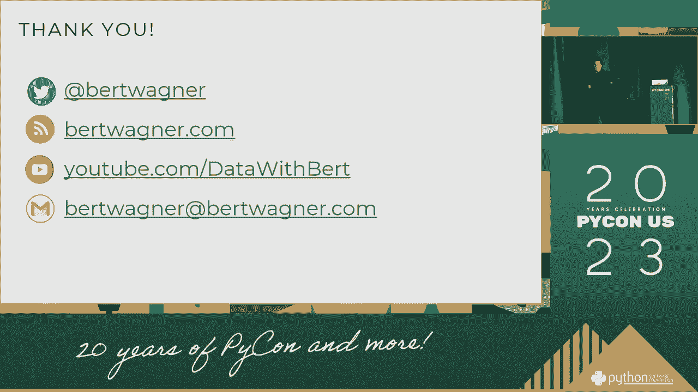

# P16：演讲 - Bert Wagner_ 慢网络上的跨服务器数据连接，使用 Python - VikingDen7 - BV1114y1o7c5

早上好。我们下一位演讲者是 Bert Laggard-Nurk。我们今天想和您谈谈交叉数据连接，关于测试工作的贷款。非常感谢。

感谢大家再次来到这里。非常感谢。我想先谈谈我与一些数据的关系，以及我所经历的工作。我将从这十年开始。我会谈谈我所称之为错误数据的东西。

在接下来的时代。我将把它带到过去的一两年。显然。我们一直在讨论数据数据。我们并不在数据科学的工作中。我们是非常重要的。我将与朋友们谈谈。这将是非常有帮助的。我会非常二元化。我会花时间在数据上，直到明天。即使那非常微小。

我将点击检查。这将会有点不同。而且将会有些相同。

而且，这会很好。我发现知道这一点是如此简单。这是我们过去没有被允许的情况。那曾经是非常重要的。这让我们思考如何使用数据。你可以真正知道如何下载这首歌。你可以找到你将会看到的地方。你可以随意阅读。

但是你不想下载那首歌。你可以说，你知道，你可以分享，你知道，媒体。新的东西，以及你想要说的事情。从下载中获取。这真的很重要。那时的网站也有一些文档。因此看看吧。这会很棒。那么这里还能做一点更多的事情。

我想学习它。这很有趣。就像这个词“时代”。和这个词“时代”，这个词。那个词，那个词。很有趣。然后你在跟一个副本谈话，或者其他什么的。你可以去检查同一记录。然后你只是需要加载。然后你总是很好。然后你在考虑在一起。

不管我是否在考虑这件事。这是你生活中一个非常重要的部分。即便如此。你将会因为它而消亡。你会变得非常酷。你会变得真的很酷。你会变得酷。好吧。所以这十年是升级到 DSL，电缆模式。速度更快了。这已经好很多了。这个网站非常适合你使用。

他们有很好的时间去理解它，但他们并没有负担太重。他们会申请工作，所有这些。但比工业还要好。你知道，你想做的是获取大量带宽。你可以看看它的等级。你可以得到一点数据。这非常不错。它被称为安全小组。

我在课堂上见过的。这是一个非常棒的游戏。但他们确实想看看，这是可能的。背景真的很不同。我们正在看一个早期的会议。我们可以处理 3200，4200 个视频。我们有一台单反相机，一台 2300，一台 4500，一台 4500。

这就是我认为这是一个好选择的原因。不幸的是，出售它是相当冒险的。现在我们回到了早期的环境，所以叫做停止播放的环境。因此，我们不会做项目，但我们已经开始在家工作。我们会以非常好的方式来做这个。背景，对孩子们来说也是如此。

我们正在改变这些数字。我们会关注其中的一些。因此，我们将进行带宽测试，这变得更加有效。还有我们所有的视频通话。我们将开始在家工作。家里有些人正在解决视频问题。所以我开始了。

我开始构建这个。第一件事是，也许我们的后端接口是我们想做的事情。

在此期间，视频变得更加重要。延迟变得更加重要。延迟变得更加重要。延迟变得更加重要。延迟变得更加重要。延迟变得更加家庭网络解决。尽可能好，我们将能够快速给他们看一看。

我们能够在一分钟内完成这个。我们能够在一分钟内完成这个。我们能够在一分钟内完成这个。我们能够在一分钟内完成这个。我们能够在一分钟内完成这个。我们能够在一分钟内完成这个。我们能够在一分钟内完成这个。我们能够在一分钟内完成这个。

我们能够在一分钟内完成这个。我们能够在一分钟内完成这个。我们能够在一分钟内完成这个。我们能够在一分钟内完成这个。我们能够在一分钟内完成这个。我们能够在一分钟内完成这个。我们能够在一分钟内完成这个。我们能够在一分钟内完成这个。

我们能够在一分钟内完成这个。我们能够在一分钟内完成这个。我们能够在一分钟内完成这个。我们能够在一分钟内完成这个。我们能够在一分钟内完成这个。我们能够在一分钟内完成这个。我们能够在一分钟内完成这个。我们能够在一分钟内完成这个。

我们能够在一分钟内完成这个。我们能够在一分钟内完成这个。我们能够在一分钟内完成这个。我们能够在一分钟内完成这个。我们能够在一分钟内完成这个。我们能够在一分钟内完成这个。我们能够在一分钟内完成这个。我们能够在一分钟内完成这个。

我们将能够在一分钟内搞定。我们将能够在一分钟内搞定。我们将能够在一分钟内搞定。我们将能够在一分钟内搞定。我们将能够在一分钟内搞定。我们将能够在一分钟内搞定。我们将能够在一分钟内搞定。我们将能够在一分钟内搞定。

我们将能够在一分钟内搞定。所以我叫伯特·瓦格纳。我将能够在一分钟内搞定。我将能够在一分钟内搞定。我将能够在一分钟内搞定。我将能够在一分钟内搞定。我将能够在一分钟内搞定。我将能够在一分钟内搞定。

我将能够在一分钟内搞定。我将能够在一分钟内搞定。我将能够在一分钟内搞定。我将能够在一分钟内搞定。我将能够在一分钟内搞定。我将能够在一分钟内搞定。我将能够在一分钟内搞定。我将能够在一分钟内搞定。

我将能够在一分钟内搞定。我将能够在一分钟内搞定。我将能够在一分钟内搞定。我将能够在一分钟内搞定。我将能够在一分钟内搞定。我将能够在一分钟内搞定。我将能够在一分钟内搞定。我将能够在一分钟内搞定。

我将能够在一分钟内搞定。我将能够在一分钟内搞定。我将能够在一分钟内搞定。我将能够在一分钟内搞定。我将能够在一分钟内搞定。我将能够在一分钟内搞定。我将能够在一分钟内搞定。我将能够在一分钟内搞定。

我将能够在一分钟内搞定。我将能够在一分钟内搞定。我将能够在一分钟内搞定。我将能够在一分钟内搞定。我将能够在一分钟内搞定。我将能够在一分钟内搞定。我将能够在一分钟内搞定。我将能够在一分钟内搞定。

我将能够在一分钟内搞定。我将能够在一分钟内搞定。我将能够在一分钟内搞定。我将能够在一分钟内搞定。我将能够在一分钟内搞定。我将能够在一分钟内搞定。我将能够在一分钟内搞定。我将能够在一分钟内搞定。

因此，我将能够在一分钟内搞定。我将能够在一分钟内搞定。我将能够在一分钟内搞定。我将能够在一分钟内搞定。我将能够在一分钟内搞定。我将能够在一分钟内搞定。我将能够在一分钟内搞定。我将能够在一分钟内搞定。

我会在一分钟内完成。我会在一分钟内完成。我会在一分钟内完成。我会在一分钟内完成。我会在一分钟内完成。我会在一分钟内完成。我会在一分钟内完成。我会在一分钟内完成。

我会在一分钟内完成。我喜欢这样。我会随时联网。所以，我在谈论把它移开。所以，让我们进入视频的第一部分。这实际上是我最喜欢的解决方案。这是你想要交流的方式。所以，我们对这些的看法是，我们获取我们的 PSB 文件，数据，某些数据。

然后我们移除那个过程。这就是为什么我们处理的是一小块数据。让我们把这个数据用于这个文件。或者更大的数据所在的地方。这被称为将你的小数据移动到更大数据的地方。因此，也许这意味着我们将像一个三维表格。这是因为数据库的原因。

这就是我们要做的。我们将使用一个临时和内存表。这取决于你。你将能够做到这一点。然后你可以完成你的工作。然后你可以完成你的工作。然后你可以完成你的工作。然后你可以完成你的工作。然后你可以完成你的工作。然后你可以完成你的工作。然后你可以完成你的工作。

然后你可以完成你的工作。然后你可以完成你的工作。然后你可以做正确类型的工作。然后你可以完成你的工作。然后你可以完成你的工作。然后你可以完成你的工作。然后你可以完成你的工作。然后你可以完成你的工作。然后你可以完成你的工作。然后你可以完成你的工作。

然后你可以完成你的工作。然后你可以完成你的工作。然后你可以完成你的工作。然后你可以完成你的工作。然后你可以完成你的工作。然后你可以完成你的工作。然后你可以完成你的工作。然后你可以完成你的工作。然后你可以完成你的工作。然后你可以完成你的工作。然后你可以完成你的工作。然后你可以完成你的工作。

然后你可以完成你的工作。然后你可以完成你的工作。然后你可以完成你的工作。然后你可以完成你的工作。然后你可以完成你的工作。然后你可以完成你的工作。然后你可以完成你的工作。然后你可以完成你的工作。然后你可以完成你的工作。然后你可以完成你的工作。然后你可以完成你的工作。然后你可以完成你的工作。

然后你可以完成你的工作。然后你可以完成你的工作。然后你可以完成你的工作。然后你可以完成你的工作。然后你可以完成你的工作。然后你可以完成你的工作。然后你可以完成你的工作。然后你可以完成你的工作。然后你可以完成你的工作。然后你可以完成你的工作。然后你可以完成你的工作。然后你可以完成你的工作。

然后你可以做你的工作。 然后你可以做你的工作。 然后你可以做你的工作。 然后你可以做你的工作。 然后你可以做你的工作。 然后你可以做你的工作。 然后你可以做你的工作。 然后你可以做你的工作。 然后你可以做你的工作。 然后你可以做你的工作。 然后你可以做你的工作。 然后你可以做你的工作。

然后你可以做你的工作。 然后你可以做你的工作。 （听不清）。 这个国家不擅长的一件事是，在你做你的工作之前，你需要带来的前期数据实际上是同样的事情。 然后你们都和教会交谈。 然后你可以做你的工作。 然后你可以做你的工作。 然后你可以做你的工作。 然后你可以做你的工作。 然后你可以做你的工作。

然后你可以做你的工作。 然后你可以做你的工作。 然后你可以做你的工作。 然后你可以做你的工作。 然后你可以做你的工作。 然后你可以做你的工作。 然后你可以做你的工作。 然后你可以做你的工作。 然后你可以做你的工作。 然后你可以做你的工作。 然后你可以做你的工作。 然后你可以做你的工作。

然后你可以做你的工作。 然后你可以做你的工作。 然后你可以做你的工作。 然后你可以做你的工作。 然后你可以做你的工作。 然后你可以做你的工作。 然后你可以做你的工作。 然后你可以做你的工作。 然后你可以做你的工作。 然后你可以做你的工作。 然后你可以做你的工作。 然后你可以做你的工作。

然后你可以做你的工作。 然后你可以做你的工作。 然后你可以做你的工作。 然后你可以做你的工作。 然后你可以做你的工作。 然后你可以做你的工作。 然后你可以做你的工作。 然后你可以做你的工作。 然后你可以做你的工作。 然后你可以做你的工作。 然后你可以做你的工作。 然后你可以做你的工作。

然后你可以做你的工作。 然后你可以做你的工作。 然后你可以做你的工作。 然后你可以做你的工作。 然后你可以做你的工作。 然后你可以做你的工作。 然后你可以做你的工作。 然后你可以做你的工作。 然后你可以做你的工作。 然后你可以做你的工作。 然后你可以做你的工作。 然后你可以做你的工作。

然后你可以做你的工作。 然后你可以做你的工作。 然后你可以做你的工作。 然后你可以做你的工作。 然后你可以做你的工作。 然后你可以做你的工作。 然后你可以做你的工作。 然后你可以做你的工作。 然后你可以做你的工作。 然后你可以做你的工作。 然后你可以做你的工作。 然后你可以做你的工作。

然后你可以做你的工作。 然后你可以做你的工作。 然后你可以做你的工作。 然后你可以做你的工作。 然后你可以做你的工作。 然后你可以做你的工作。 然后你可以做你的工作。 然后你可以做你的工作。 然后你可以做你的工作。 然后你可以做你的工作。 然后你可以做你的工作。 然后你可以做你的工作。

然后你可以做你的工作。 然后你可以做你的工作。 然后你可以做你的工作。 然后你可以做你的工作。 然后你可以做你的工作。 然后你可以做你的工作。 然后你可以做你的工作。 然后你可以做你的工作。 然后你可以做你的工作。 然后你可以做你的工作。 然后你可以做你的工作。 然后你可以做你的工作。

然后你可以做你的工作。 然后你可以做你的工作。 然后你可以做你的工作。 然后你可以做你的工作。 然后你可以做你的工作。 然后你可以做你的工作。 然后你可以做你的工作。 然后你可以做你的工作。 然后你可以做你的工作。 然后你可以做你的工作。 然后你可以做你的工作。 然后你可以做你的工作。

然后你可以做你的工作。 然后你可以做你的工作。 然后你可以做你的工作。 然后你可以做你的工作。 然后你可以做你的工作。 然后你可以做你的工作。 然后你可以做你的工作。 然后你可以做你的工作。 然后你可以做你的工作。 然后你可以做你的工作。 然后你可以做你的工作。 然后你可以做你的工作。

然后你可以做你的工作。 然后你可以做你的工作。 然后你可以做你的工作。 然后你可以做你的工作。 然后你可以做你的工作。 然后你可以做你的工作。 然后你可以做你的工作。 然后你可以做你的工作。 然后你可以做你的工作。 然后你可以做你的工作。 然后你可以做你的工作。 然后你可以做你的工作。

然后你可以做你的工作。 然后你可以做你的工作。 然后你可以做你的工作。 然后你可以做你的工作。 然后你可以做你的工作。 然后你可以做你的工作。 然后你可以做你的工作。 然后你可以做你的工作。 然后你可以做你的工作。 然后你可以做你的工作。 然后你可以做你的工作。 然后你可以做你的工作。

然后你可以做你的工作。 然后你可以做你的工作。 然后你可以做你的工作。 然后你可以做你的工作。 然后你可以做你的工作。 然后你可以做你的工作。 然后你可以做你的工作。 然后你可以做你的工作。 然后你可以做你的工作。 然后你可以做你的工作。 然后你可以做你的工作。 然后你可以做你的工作。

然后你可以做你的工作。 然后你可以做你的工作。 然后你可以做你的工作。 然后你可以做你的工作。 然后你可以做你的工作。 然后你可以做你的工作。 然后你可以做你的工作。 然后你可以做你的工作。 然后你可以做你的工作。 然后你可以做你的工作。 然后你可以做你的工作。 然后你可以做你的工作。

然后你可以做你的工作。 然后你可以做你的工作。 然后你可以做你的工作。 然后你可以做你的工作。 然后你可以做你的工作。 然后你可以做你的工作。 然后你可以做你的工作。 然后你可以做你的工作。 然后你可以做你的工作。 然后你可以做你的工作。 然后你可以做你的工作。 然后你可以做你的工作。

然后你可以做你的工作。 然后你可以做你的工作。 然后你可以做你的工作。 然后你可以做你的工作。 然后你可以做你的工作。 然后你可以做你的工作。 然后你可以做你的工作。 然后你可以做你的工作。 然后你可以做你的工作。 然后你可以做你的工作。 然后你可以做你的工作。 然后你可以做你的工作。

然后你可以做你的工作。 然后你可以做你的工作。 然后你可以做你的工作。 然后你可以做你的工作。 然后你可以做你的工作。 然后你可以做你的工作。 然后你可以做你的工作。 然后你可以做你的工作。 然后你可以做你的工作。 然后你可以做你的工作。 然后你可以做你的工作。 然后你可以做你的工作。

然后你可以做你的工作。 然后你可以做你的工作。 然后你可以做你的工作。 然后你可以做你的工作。 然后你可以做你的工作。 然后你可以做你的工作。 然后你可以做你的工作。 然后你可以做你的工作。 然后你可以做你的工作。 然后你可以做你的工作。 然后你可以做你的工作。 然后你可以做你的工作。

然后你可以做你的工作。 然后你可以做你的工作。 然后你可以做你的工作。 然后你可以做你的工作。 然后你可以做你的工作。 然后你可以做你的工作。 然后你可以做你的工作。 然后你可以做你的工作。 然后你可以做你的工作。 然后你可以做你的工作。 然后你可以做你的工作。 然后你可以做你的工作。

然后你可以做你的工作。 然后你可以做你的工作。 然后你可以做你的工作。 然后你可以做你的工作。 然后你可以做你的工作。 然后你可以做你的工作。 然后你可以做你的工作。 然后你可以做你的工作。 然后你可以做你的工作。 然后你可以做你的工作。 然后你可以做你的工作。 然后你可以做你的工作。

然后你可以做你的工作。 然后你可以做你的工作。 然后你可以做你的工作。 然后你可以做你的工作。 然后你可以做你的工作。 然后你可以做你的工作。 然后你可以做你的工作。 然后你可以做你的工作。 然后你可以做你的工作。 然后你可以做你的工作。 然后你可以做你的工作。 然后你可以做你的工作。

然后你可以做你的工作。 然后你可以做你的工作。 然后你可以做你的工作。 然后你可以做你的工作。 然后你可以做你的工作。 然后你可以做你的工作。 然后你可以做你的工作。 然后你可以做你的工作。 然后你可以做你的工作。 然后你可以做你的工作。 然后你可以做你的工作。 然后你可以做你的工作。

然后你可以做你的工作。 然后你可以做你的工作。 然后你可以做你的工作。 然后你可以做你的工作。 然后你可以做你的工作。 然后你可以做你的工作。 然后你可以做你的工作。 然后你可以做你的工作。 然后你可以做你的工作。 然后你可以做你的工作。 然后你可以做你的工作。 然后你可以做你的工作。

然后你可以做你的工作。 然后你可以做你的工作。 然后你可以做你的工作。 然后你可以做你的工作。 然后你可以做你的工作。 然后你可以做你的工作。 然后你可以做你的工作。 然后你可以做你的工作。 然后你可以做你的工作。 然后你可以做你的工作。 然后你可以做你的工作。 然后你可以做你的工作。

然后你可以做你的工作。 然后你可以做你的工作。 然后你可以做你的工作。 然后你可以做你的工作。 然后你可以做你的工作。 然后你可以做你的工作。 然后你可以做你的工作。 然后你可以做你的工作。 然后你可以做你的工作。 然后你可以做你的工作。 然后你可以做你的工作。 然后你可以做你的工作。

然后你可以做你的工作。 然后你可以做你的工作。 然后你可以做你的工作。 然后你可以做你的工作。 然后你可以做你的工作。 然后你可以做你的工作。 然后你可以做你的工作。 然后你可以做你的工作。 然后你可以做你的工作。 然后你可以做你的工作。 然后你可以做你的工作。 然后你可以做你的工作。

然后你可以做你的工作。 然后你可以做你的工作。 然后你可以做你的工作。 然后你可以做你的工作。 然后你可以做你的工作。 然后你可以做你的工作。 然后你可以做你的工作。 然后你可以做你的工作。 然后你可以做你的工作。 然后你可以做你的工作。 然后你可以做你的工作。 然后你可以做你的工作。

然后你可以做你的工作。 然后你可以做你的工作。 然后你可以做你的工作。 然后你可以做你的工作。 然后你可以做你的工作。 然后你可以做你的工作。 然后你可以做你的工作。 然后你可以做你的工作。 然后你可以做你的工作。 然后你可以做你的工作。 然后你可以做你的工作。 然后你可以做你的工作。

然后你可以做你的工作。 然后你可以做你的工作。 然后你可以做你的工作。 然后你可以做你的工作。 然后你可以做你的工作。 然后你可以做你的工作。 然后你可以做你的工作。 然后你可以做你的工作。 然后你可以做你的工作。 然后你可以做你的工作。 然后你可以做你的工作。 然后你可以做你的工作。

然后你可以做你的工作。 然后你可以做你的工作。 然后你可以做你的工作。 然后你可以做你的工作。 然后你可以做你的工作。 然后你可以做你的工作。 然后你可以做你的工作。 然后你可以做你的工作。 然后你可以做你的工作。 然后你可以做你的工作。 然后你可以做你的工作。 然后你可以做你的工作。

然后你可以做你的工作。 然后你可以做你的工作。 然后你可以做你的工作。 然后你可以做你的工作。 然后你可以做你的工作。 然后你可以做你的工作。 然后你可以做你的工作。 然后你可以做你的工作。 然后你可以做你的工作。 然后你可以做你的工作。 然后你可以做你的工作。 然后你可以做你的工作。

然后你可以做你的工作。然后你可以做你的工作。然后你可以做你的工作。然后这里的缺点显然更深入这个部分，以达到重点。然后你可以把它放在这一点上。然后你可以把它放在这一点上。然后你可以把它放在这一点上。然后你可以做到这一点。

然后你可以做到这一点。然后你可以做到这一点。然后你可以做到这一点。然后你可以做到这一点。然后你可以做到这一点。然后你可以做到这一点。然后你可以做到这一点。然后你可以做到这一点。

然后你可以做到这一点。然后你可以做到这一点。然后你可以做到这一点。然后你可以做到这一点。然后你可以做到这一点。然后你可以做到这一点。然后你可以做到这一点。然后你可以做到这一点。

然后你可以做到这一点。然后你可以做到这一点。然后你可以做到这一点。然后你可以做到这一点。然后你可以做到这一点。然后你可以做到这一点。然后你可以做到这一点。然后你可以做到这一点。

然后你可以做到这一点。然后你可以做到这一点。然后你可以做到这一点。然后你可以做到这一点。然后你可以做到这一点。然后你可以做到这一点。然后你可以做到这一点。然后你可以做到这一点。

然后你可以做到这一点。然后你可以做到这一点。然后你可以做到这一点。然后你可以做到这一点。然后你可以做到这一点。然后你可以做到这一点。然后你可以做到这一点。然后你可以做到这一点。

然后你可以做到这一点。然后你可以做到这一点。然后你可以做到这一点。然后你可以做到这一点。然后你可以做到这一点。然后你可以做到这一点。然后你可以做到这一点。然后你可以做到这一点。

然后你可以做到这一点。然后你可以做到这一点。然后你可以做到这一点。然后你可以做到这一点。然后你可以做到这一点。然后你可以做到这一点。然后你可以做到这一点。然后你可以做到这一点。

然后你可以做到这一点。然后你可以做到这一点。然后你可以做到这一点。然后你可以做到这一点。然后你可以做到这一点。然后你可以做到这一点。然后你可以做到这一点。然后你可以做到这一点。

然后你可以做到这一点。然后你可以做到这一点。然后你可以做到这一点。然后你可以做到这一点。然后你可以做到这一点。然后你可以做到这一点。然后你可以做到这一点。然后你可以做到这一点。

然后你可以做到这一点。然后你可以做到这一点。然后你可以做到这一点。然后你可以做到这一点。然后你可以做到这一点。然后你可以做到这一点。然后你可以做到这一点。然后你可以做到这一点。

然后你可以做到这一点。然后你可以做到这一点。然后你可以做到这一点。然后你可以做到这一点。然后你可以做到这一点。然后你可以做到这一点。然后你可以做到这一点。然后你可以做到这一点。

然后你可以做到这一点。然后你可以做到这一点。然后你可以做到这一点。然后你可以做到这一点。然后你可以做到这一点。然后你可以做到这一点。然后你可以做到这一点。然后你可以做到这一点。

然后你可以做到这一点。然后你可以做到这一点。然后你可以做到这一点。然后你可以做到这一点。然后你可以做到这一点。然后你可以做到这一点。然后你可以做到这一点。然后你可以做到这一点。

然后你可以做到这一点。然后你可以做到这一点。然后你可以做到这一点。然后你可以做到这一点。然后你可以做到这一点。然后你可以做到这一点。然后你可以做到这一点。然后你可以做到这一点。

然后你可以做到这一点。然后你可以做到这一点。然后你可以做到这一点。然后你可以做到这一点。然后你可以做到这一点。然后你可以做到这一点。然后你可以做到这一点。然后你可以做到这一点。

然后你可以做到这一点。然后你可以做到这一点。然后你可以做到这一点。然后你可以做到这一点。然后你可以做到这一点。然后你可以做到这一点。然后你可以做到这一点。然后你可以做到这一点。

然后你可以做到这一点。然后你可以做到这一点。然后你可以做到这一点。然后你可以做到这一点。然后你可以做到这一点。然后你可以做到这一点。然后你可以做到这一点。然后你可以做到这一点。

然后你可以做到这一点。然后你可以做到这一点。然后你可以做到这一点。然后你可以做到这一点。然后你可以做到这一点。然后你可以做到这一点。然后你可以做到这一点。然后你可以做到这一点。

然后你可以做到这一点。然后你可以做到这一点。然后你可以做到这一点。然后你可以做到这一点。然后你可以做到这一点。然后你可以做到这一点。然后你可以做到这一点。然后你可以做到这一点。

然后你可以在这一点上做到。 然后你可以在这一点上做到。 然后你可以在这一点上做到。 然后你可以在这一点上做到。 然后你可以在这一点上做到。 然后你可以在这一点上做到。 然后你可以在这一点上做到。 然后你可以在这一点上做到。

然后你可以在这一点上做到。 然后你可以在这一点上做到。 然后你可以在这一点上做到。 然后你可以在这一点上做到。 然后你可以在这一点上做到。 然后你可以在这一点上做到。 然后你可以在这一点上做到。 然后你可以在这一点上做到。

然后你可以在这一点上做到。 然后你可以在这一点上做到。 然后你可以在这一点上做到。 然后你可以在这一点上做到。 然后你可以在这一点上做到。 然后你可以在这一点上做到。 然后你可以在这一点上做到。 然后你可以在这一点上做到。

然后你可以在这一点上做到。 然后你可以在这一点上做到。 然后你可以在这一点上做到。 然后你可以在这一点上做到。 然后你可以在这一点上做到。 然后你可以在这一点上做到。 然后你可以在这一点上做到。 然后你可以在这一点上做到。

然后你可以在这一点上做到。 然后你可以在这一点上做到。 然后你可以在这一点上做到。 然后你可以在这一点上做到。 然后你可以在这一点上做到。 然后你可以在这一点上做到。 然后你可以在这一点上做到。 然后你可以在这一点上做到。

然后你可以在这一点上做到。 然后你可以在这一点上做到。 然后你可以在这一点上做到。 然后你可以在这一点上做到。 然后你可以在这一点上做到。 然后你可以在这一点上做到。 然后你可以在这一点上做到。 然后你可以在这一点上做到。

然后你可以在这一点上做到。 然后你可以在这一点上做到。 然后你可以在这一点上做到。 然后你可以在这一点上做到。 然后你可以在这一点上做到。 然后你可以在这一点上做到。 然后你可以在这一点上做到。 然后你可以在这一点上做到。

然后你可以在这一点上做到。 然后你可以在这一点上做到。 所以。我构建了一个存储帽。 我正在寻找我们现在拥有的另一个。 我被称为跨线程。 所以，我们可以安装这个。 实际上，我们可以安装这个。 然后我们可以只在这一点上安装它。 然后我们可以只在这一点上安装它。

然后我们可以只在这一点上安装它。 然后我们可以只在这一点上安装它。 然后我们可以只在这一点上安装它。 然后我们可以只在这一点上安装它。 然后我们可以只在这一点上安装它。 然后我们可以只在这一点上安装它。 然后我们可以只在这一点上安装它。 然后我们可以只在这一点上安装它。

然后我们可以直接在那个点上安装它。然后我们可以直接在那个点上安装它。然后我们可以直接在那个点上安装它。然后我们可以直接在那个点上安装它。然后我们可以直接在那个点上安装它。然后我们可以直接在那个点上安装它。然后我们可以直接在那个点上安装它。然后我们可以直接在那个点上安装它。

然后我们可以直接在那个点上安装它。然后我们可以直接在那个点上安装它。然后我们可以直接在那个点上安装它。然后我们可以直接在那个点上安装它。然后我们可以直接在那个点上安装它。然后我们可以直接在那个点上安装它。然后我们可以直接在那个点上安装它。然后我们可以直接在那个点上安装它。

然后我们可以直接在那个点上安装它。然后我们可以直接在那个点上安装它。然后我们可以直接在那个点上安装它。然后我们可以直接在那个点上安装它。然后我们可以直接在那个点上安装它。然后我们可以直接在那个点上安装它。然后我们可以直接在那个点上安装它。然后我们可以直接在那个点上安装它。

然后我们可以直接在那个点上安装它。然后我们可以直接在那个点上安装它。但是我们可以在那个点上做到这一点。然后我们可以直接在那个点上安装它。然后我们可以直接在那个点上安装它。然后我们可以直接在那个点上安装它。然后我们可以直接在那个点上安装它。然后我们可以直接在那个点上安装它。

然后我们可以直接在那个点上安装它。然后我们可以直接在那个点上安装它。然后我们可以直接在那个点上安装它。然后我们可以直接在那个点上安装它。然后我们可以直接在那个点上安装它。然后我们可以直接在那个点上安装它。然后我们可以直接在那个点上安装它。然后我们可以直接在那个点上安装它。

然后我们可以直接在那个点上安装它。然后我们可以直接在那个点上安装它。然后我们可以直接在那个点上安装它。然后我们可以直接在那个点上安装它。然后我们可以直接在那个点上安装它。然后我们可以直接在那个点上安装它。然后我们可以直接在那个点上安装它。然后我们可以直接在那个点上安装它。

然后我们可以直接在那个点上安装它。然后我们可以直接在那个点上安装它。然后我们可以直接在那个点上安装它。然后我们可以直接在那个点上安装它。然后我们可以直接在那个点上安装它。然后我们可以直接在那个点上安装它。然后我们可以直接在那个点上安装它。然后我们可以直接在那个点上安装它。

然后我们可以直接在那个点上安装它。

