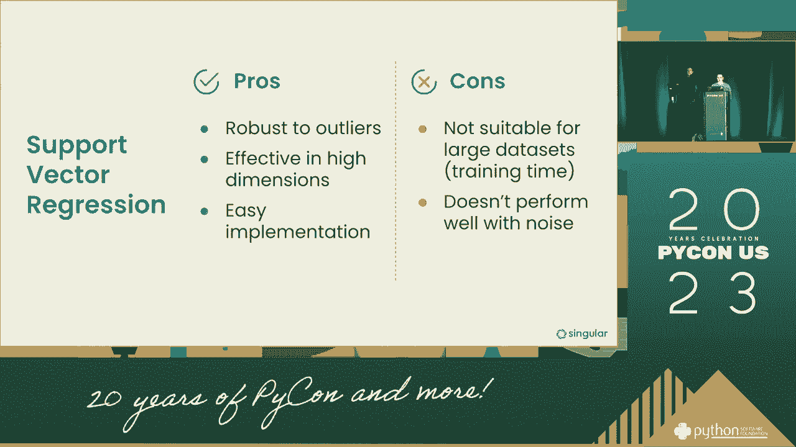
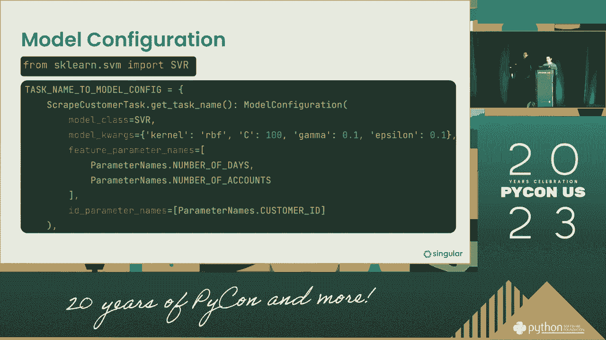
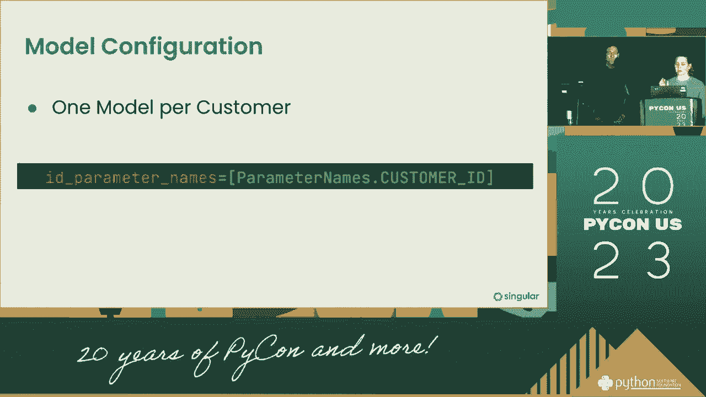
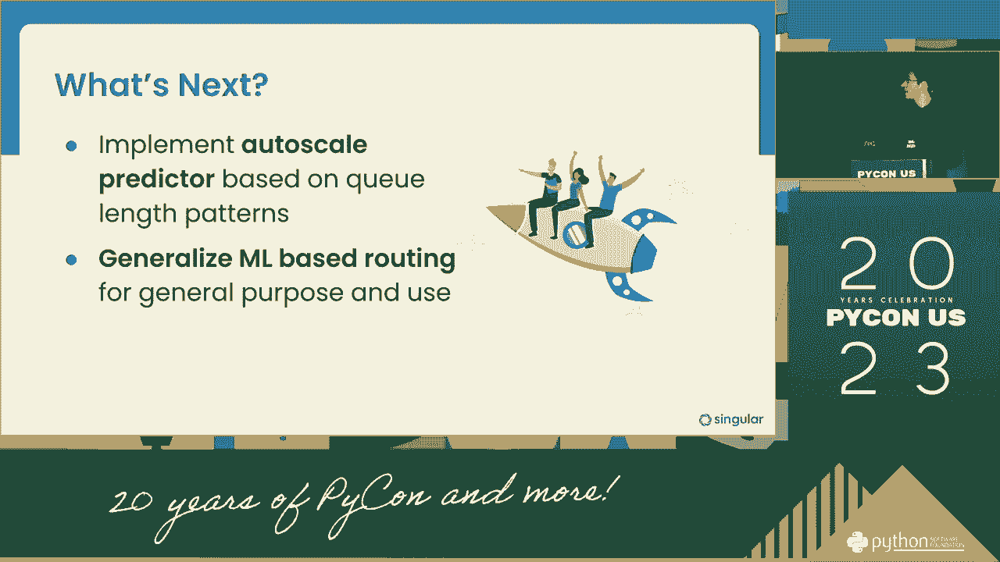

# 机器学习提升管道效率：P19：演讲内容整理与教程


在本教程中，我们将学习如何利用机器学习技术来提升数据处理管道的效率。我们将基于一次技术演讲的内容，整理出核心概念、实践步骤和架构考量，旨在帮助初学者理解如何构建更智能、更高效的数据工作流。

## 概述

数据处理管道是现代数据科学和机器学习项目的核心。然而，随着数据量的增长和模型复杂度的提升，传统的管道可能面临效率瓶颈。本节课我们将探讨如何通过引入机器学习模型和自动化策略来优化管道性能，涵盖从模型构建、测试到部署和监控的全过程。

---

## 1：核心问题与目标设定 🎯

在开始优化之前，首先需要明确我们面临的核心问题以及优化的目标。

上一节我们概述了课程内容，本节中我们来看看如何定义优化目标。一个低效的管道通常表现为处理速度慢、资源消耗高或结果准确性不稳定。我们的目标是构建一个能够**智能调整资源**、**自动执行测试**并**持续优化模型性能**的管道。

以下是设定目标时需要考虑的几个关键点：
*   **性能指标**：明确衡量管道效率的指标，例如处理时间、CPU/内存使用率、模型预测准确率。
*   **可扩展性**：确保管道能够应对数据量或任务复杂度的增长。
*   **自动化程度**：减少人工干预，实现测试、部署和监控的自动化。



---



## 2：构建与集成机器学习模型 🤖




明确了目标后，下一步是构建能够提升管道效率的机器学习模型。

上一节我们讨论了目标设定，本节中我们来看看模型的核心作用。我们可以训练模型来预测任务执行时间、资源需求或结果质量，从而指导资源分配和任务调度。

一个基础的预测模型可以用以下公式表示：
`y = f(X)`
其中，`y` 是我们要预测的目标（如任务执行时间），`X` 是特征向量（如数据大小、任务类型、历史性能数据），`f` 是我们的机器学习模型（如线性回归、随机森林）。

在实践中，模型构建流程通常包含以下步骤：
1.  **数据收集**：收集管道运行的历史数据，包括输入特征和对应的结果。
2.  **特征工程**：从原始数据中提取对预测目标有用的特征。
3.  **模型训练**：使用机器学习算法（如 `scikit-learn` 库中的模型）在数据上训练预测模型。
    ```python
    # 示例：使用随机森林回归进行训练
    from sklearn.ensemble import RandomForestRegressor
    model = RandomForestRegressor()
    model.fit(X_train, y_train)
    ```
4.  **模型评估**：使用测试集评估模型的预测性能。

---

## 3：自动化测试与持续集成 ⚙️

模型构建完成后，需要将其无缝集成到现有管道中，并通过自动化测试确保其可靠性。

上一节我们介绍了模型构建，本节中我们来看看如何通过自动化测试来保障管道质量。自动化测试是确保每次代码或模型更新后，管道仍能正确、高效运行的关键。

一个高效的测试框架应包含以下组件：
*   **单元测试**：验证管道中单个函数或模块的正确性。
*   **集成测试**：验证多个模块组合在一起是否能协同工作。
*   **性能测试**：验证管道在负载下的表现，确保其满足性能指标。

我们可以将测试过程自动化，并将其作为持续集成/持续部署流水线的一部分。例如，每当有新的模型或代码提交时，自动触发测试套件。

---

## 4：监控、反馈与动态调整 📊

一个智能的管道不仅需要自动化，还需要能够根据运行状态进行动态调整。

上一节我们探讨了自动化测试，本节中我们来看看如何建立监控与反馈循环。通过实时监控管道的运行指标（如延迟、错误率、资源利用率），我们可以及时发现问题。

监控系统可以触发以下动态调整策略：
*   **自动扩缩容**：当任务队列积压或资源使用率持续高位时，自动增加处理单元（如Kubernetes Pod）；当负载降低时，自动减少资源以节省成本。
*   **模型重训练**：当监控到模型预测性能下降（例如，由于数据分布变化），自动触发模型的重训练流程。
*   **告警与干预**：当出现异常时（如错误率飙升），及时通知相关人员或执行预设的补救脚本。

这种“监控-分析-执行”的闭环使得管道具备了自我优化的能力。

---

## 5：架构设计与工具选型 🏗️



实现上述智能管道需要一个稳固且灵活的技术架构。


上一节我们介绍了监控与调整机制，本节中我们来看看支撑这些功能的底层架构。一个典型的云原生架构可能包含以下层次：

以下是构建高效管道架构的核心组件：
*   **计算层**：使用容器化技术（如Docker）和编排平台（如Kubernetes）来运行管道任务和模型服务，便于管理和扩缩容。
*   **数据层**：可靠的数据存储和消息队列（如云存储、Apache Kafka），用于处理输入数据和中间结果。
*   **编排与调度层**：工作流编排工具（如Apache Airflow, Kubeflow Pipelines），用于定义、调度和监控复杂的任务依赖关系。
*   **监控与可观测层**：集成监控工具（如Prometheus, Datadog），收集指标、日志和追踪信息，为动态调整提供数据支持。

选择合适的工具组合，并确保它们之间能够良好集成，是成功构建智能管道的基石。

---

## 总结

在本节课中，我们一起学习了如何利用机器学习提升数据处理管道的效率。我们从**定义明确的优化目标**开始，逐步深入到**构建预测模型**、**实现自动化测试**、**建立监控与动态调整机制**，最后探讨了支撑这一切的**云原生架构与工具选型**。

核心在于构建一个具备感知、决策和执行能力的智能系统，使其能够自动适应变化、优化资源利用并保障任务执行的效率与可靠性。通过将机器学习融入管道生命周期的各个环节，我们可以让数据工作流变得更加智能和强大。