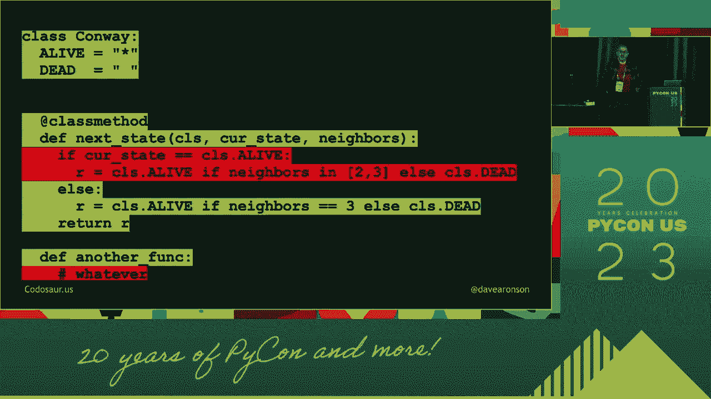

# 软件测试：P28：突变测试入门指南 🧬


在本节课中，我们将要学习一种名为“突变测试”的高级软件测试技术。我们将了解它的核心思想、工作原理、如何执行以及它的优缺点。通过学习，你将能够理解如何利用突变测试来评估和改进你的测试套件的质量。


## 什么是突变测试？🤔


上一节我们介绍了课程概述，本节中我们来看看突变测试的基本定义。



突变测试是一种评估测试套件质量的测试方法。它通过故意在源代码中引入小错误（称为“突变”），然后运行现有的测试套件，来检查这些测试是否能发现这些错误。

它的核心思想是：**一个好的测试套件应该能够“杀死”绝大多数被故意引入的缺陷**。如果测试套件无法检测到某个突变（即突变“存活”了），则说明测试套件存在不足，可能遗漏了某些场景的测试。


## 突变测试如何工作？⚙️

理解了基本概念后，我们深入了解一下突变测试的具体工作流程。


突变测试的过程可以概括为以下几个步骤：


1.  **创建原始程序**：从一个被认为是正确的程序开始。
2.  **生成突变体**：使用“突变算子”自动在原始程序中制造小的、语法正确的变化，从而创建出许多有缺陷的程序版本，每个版本称为一个“突变体”。例如，将 `>` 改为 `<`，或将 `+` 改为 `-`。
3.  **运行测试套件**：对每一个生成的突变体，运行你为原始程序编写的测试套件。
4.  **分析结果**：
    *   如果针对某个突变体的测试**失败**了，则称该突变体被“杀死”。这表明测试套件检测到了这个缺陷。
    *   如果针对某个突变体的测试**全部通过**，则称该突变体“存活”了。这表明测试套件未能发现这个缺陷，存在测试漏洞。


一个测试套件的有效性可以通过**突变分数**来衡量，其公式为：


**突变分数 = (被杀死的突变体数量 / 总突变体数量) * 100%**


分数越高，说明测试套件发现缺陷的能力越强。

## 常见的突变算子 🔧

我们已经知道了突变测试的流程，那么具体有哪些制造缺陷的方法呢？以下是几种常见的突变算子示例：

*   **算术运算符替换**：例如，将 `+` 替换为 `-`，`*` 替换为 `/`。
    ```java
    // 原始代码
    result = a + b;
    // 突变后代码
    result = a - b;
    ```
*   **关系运算符替换**：例如，将 `>` 替换为 `>=`，`==` 替换为 `!=`。
    ```java
    // 原始代码
    if (x > y) { ... }
    // 突变后代码
    if (x >= y) { ... }
    ```
*   **逻辑运算符替换**：例如，将 `&&` 替换为 `||`。
*   **常量值修改**：例如，将数字 `1` 改为 `0`，或将 `true` 改为 `false`。
*   **语句删除**：直接删除某一行代码。

## 突变测试的价值与挑战 ⚖️

了解了如何执行突变测试后，我们来客观地分析一下它的优点和面临的挑战。


### 主要优点


以下是突变测试带来的核心价值：

*   **评估测试有效性**：它直接衡量测试套件发现真实缺陷的能力，而不仅仅是代码执行覆盖率。
*   **发现测试用例的盲点**：存活的突变体明确指出哪些代码变化未被测试覆盖，帮助开发者编写更有针对性的测试。
*   **提高代码质量意识**：促使开发者思考代码的健壮性和各种边界条件。

### 主要挑战

然而，突变测试也并非完美，以下是它面临的一些挑战：

*   **计算成本高**：需要为每个突变体运行整个测试套件，对于大型项目，可能生成成千上万个突变体，非常耗时。
*   **等价突变问题**：有些突变体在功能上与原始程序完全等价，导致它们永远无法被杀死，这会干扰分数计算的准确性。
    ```java
    // 示例：一个等价突变
    // 原始代码
    int x = 0;
    // 突变后代码 (将 0 改为 1-1，功能等价)
    int x = 1 - 1;
    ```
*   **需要专业的工具支持**：需要借助特定的突变测试框架（如 Java 的 PITest，Python 的 MutPy）来自动化整个过程。

## 总结 📝


本节课中我们一起学习了突变测试的核心知识。我们了解到，突变测试是一种通过故意引入缺陷（突变）来评估测试套件有效性的强大技术。它通过生成突变体、运行测试并计算突变分数来工作，能够有效地揭示测试用例的不足。尽管它存在计算成本高和等价突变等挑战，但它为衡量和提升测试质量提供了一个独特的、以缺陷为中心的视角。将突变测试作为传统测试覆盖率的补充，可以帮助我们构建更可靠、更健壮的软件系统。