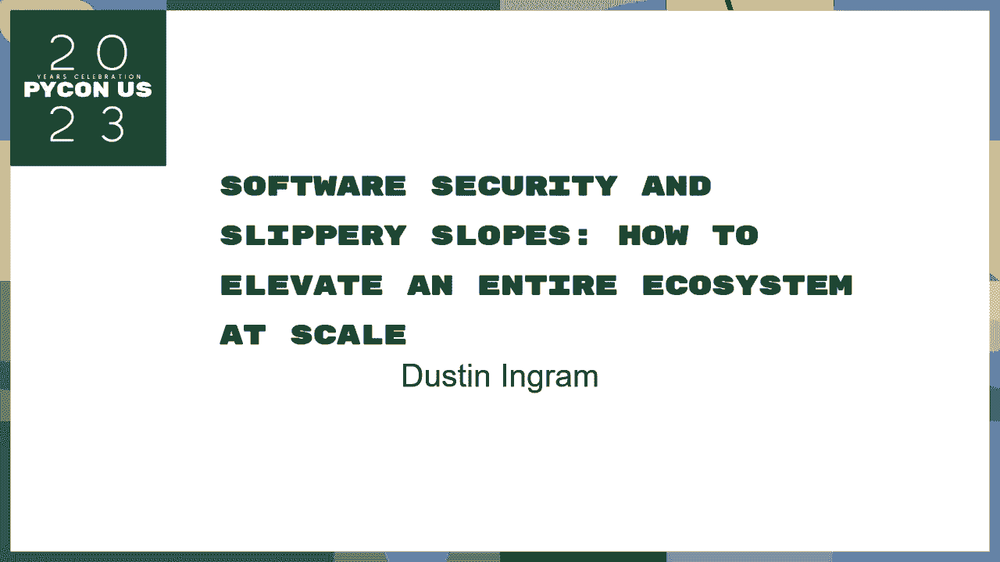
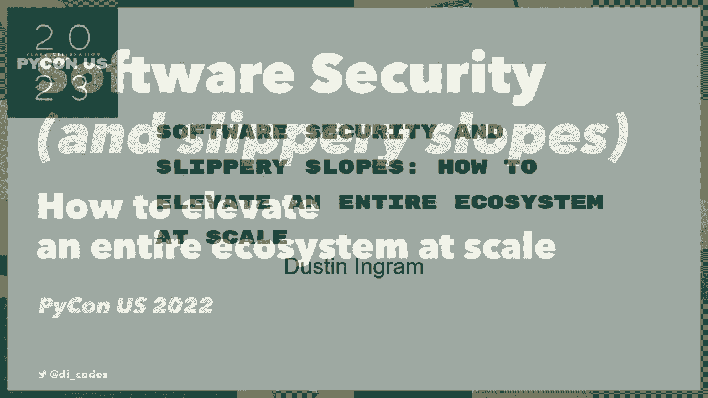
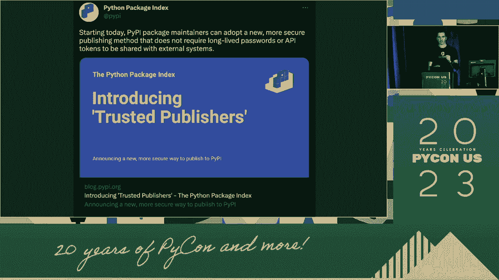
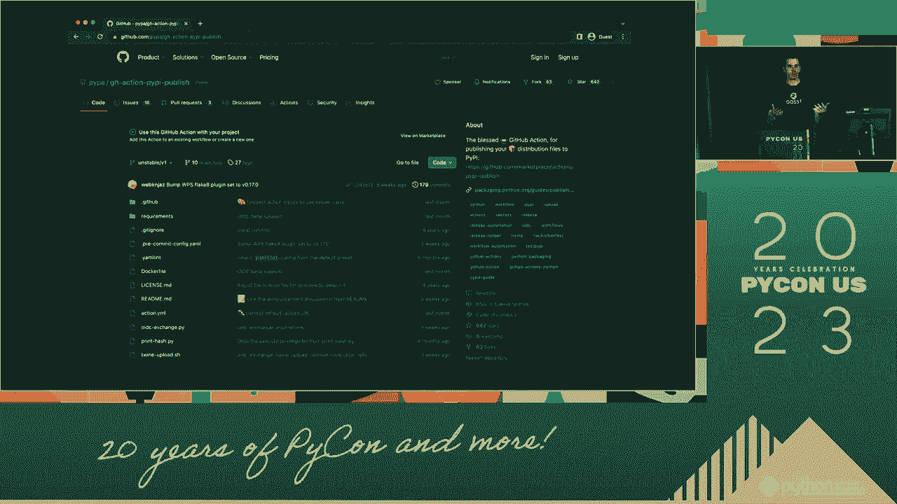
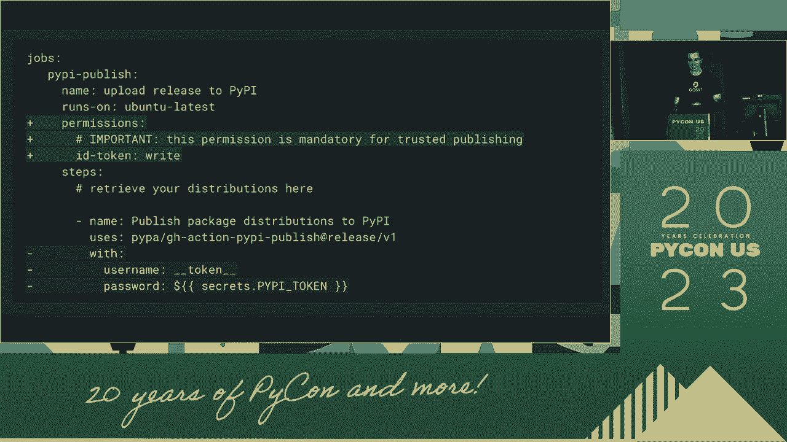
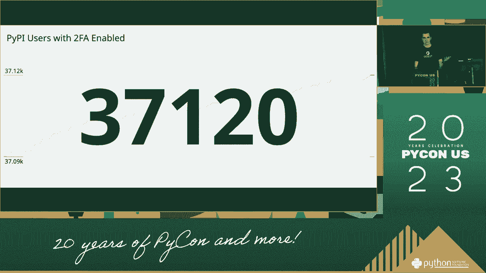
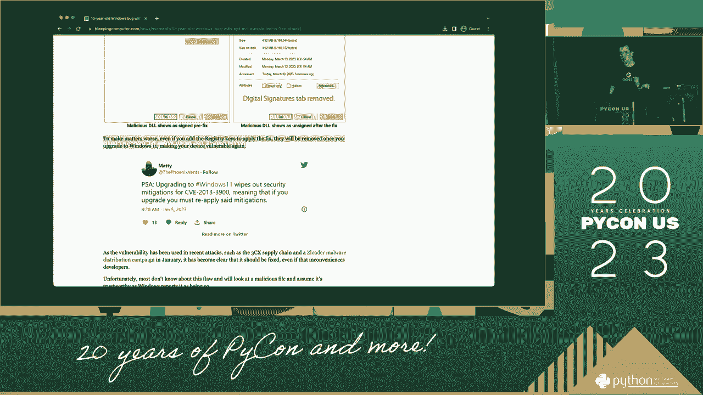
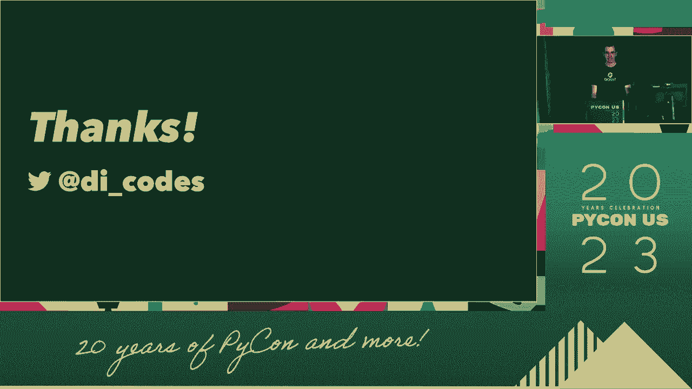

# 软件安全与滑坡：P30：如何提升整个系统的安全性 🔒





在本节课中，我们将要学习软件安全中的一个核心概念——“滑坡效应”，并探讨如何通过系统性的方法来提升整个软件项目的安全性。我们将从理解问题的重要性开始，逐步深入到具体的实践方法。

---

## 概述 📋

软件安全不仅仅是修复漏洞，更是一个需要贯穿整个开发周期的系统性工程。本节课程将引导你理解安全问题的本质，学习如何评估风险，并掌握构建更安全软件的基本策略。

---

## P30：1：为什么软件安全很重要？🤔

首先，我们需要理解软件安全为何至关重要。软件中的安全缺陷可能导致数据泄露、服务中断甚至财务损失。忽视安全问题，就如同在松软的斜坡上建造房屋，微小的疏忽可能导致灾难性的“滑坡”。

一个安全的软件产品是其成功的基础。它能够保护用户数据，维持业务连续性，并建立用户信任。因此，理解安全是什么以及它需要做什么，是我们处理所有后续问题的基础。

---

## P30：2：理解安全风险与“滑坡效应” ⚠️

上一节我们介绍了安全的重要性，本节中我们来看看核心的安全风险模型——“滑坡效应”。这个概念描述了系统中一个微小的、低优先级的漏洞，如何可能像雪球一样滚下山坡，最终引发严重的、高影响的安全事件。

我们可以用一个简单的公式来评估风险：
**风险 = 可能性 × 影响**

以下是基于此模型的风险分类：
*   **低可能性，低影响**：这类问题通常可以稍后处理。
*   **高可能性，低影响**：需要关注，可能影响用户体验。
*   **低可能性，高影响**：必须高度重视，尽管发生概率低，但后果严重。
*   **高可能性，高影响**：最高优先级，需要立即解决。

我们的目标是在问题处于“低可能性、低影响”的早期阶段就识别并处理它们，防止其演变成高风险的“滑坡”。

---

## P30：3：如何系统性提升安全性？ 🛠️

理解了风险模型后，我们来看看如何在实际工作中提升安全性。提升安全性并非一蹴而就，而是需要融入开发流程的每一个环节。

关键在于建立一个**共享的技术语言和沟通框架**。当团队中的每个人——开发者、测试人员、项目经理——都能使用相同的术语和逻辑来讨论安全问题时，识别和修复漏洞的效率将大大提高。

以下是构建这种系统性安全方法的几个要点：
*   **从小处着手**：可以从一个具体的、小的安全改进点开始实践，例如在代码审查中加入安全检查项。
*   **建立通用设计**：为常见的安全问题（如输入验证、身份认证）制定团队内通用的解决方案和代码规范。
*   **利用新工具与平台**：采用能够提供安全洞察的自动化工具，例如静态代码分析（SAST）或依赖项扫描工具。
*   **持续沟通与教育**：在团队内部持续讨论安全问题，将安全视为产品功能的一部分，而非事后补救措施。

通过这种方式，我们可以为我们的问题建立一个强大的技术防御系统。

---

## P30：4：实践：从概念到产品 🚀

上一节我们讨论了系统性的方法，本节我们将关注如何将这些概念落地到具体的产品开发中。将安全思维融入产品生命周期，意味着从项目伊始就考虑安全。

首先，在项目启动阶段，就需要识别可能的安全需求。你可以通过建立一个“威胁模型”来探讨系统可能面临的风险。这有助于在架构设计阶段就做出更安全的选择。

在开发过程中，坚持使用我们建立的共享安全语言和框架。例如，在代码中：
```python
# 不安全的做法：直接拼接用户输入
query = “SELECT * FROM users WHERE id = ” + user_input






# 更安全的做法：使用参数化查询
query = “SELECT * FROM users WHERE id = %s”
cursor.execute(query, (user_input,))
```




这种实践降低了安全漏洞被引入代码库的可能性。最终，一个安全的软件产品是通过无数个这样的正确决策累积而成的。




---



## 总结 🎯

本节课中我们一起学习了软件安全中的“滑坡效应”及其重要性。我们了解到，安全风险可以通过**可能性 × 影响**的模型进行评估。要提升整个系统的安全性，关键在于建立团队共享的安全语言和系统性的实践方法，包括从小处着手、制定通用设计、利用工具以及持续沟通。



记住，软件安全是一个持续的过程，而非一个最终状态。通过将安全思维融入每一天的开发工作，我们可以有效地防止“滑坡”，构建出更可靠、更值得信赖的软件产品。