# Skynet 101：P31：如何避免机器学习代码出错 🛡️


在本节课中，我们将学习如何避免机器学习代码中常见的错误。我们将探讨从数据准备到模型部署的整个流程中可能遇到的问题，并提供实用的检查清单和最佳实践，帮助你构建更健壮、更可靠的机器学习系统。

## 数据准备与检查 📊


数据是机器学习项目的基石。错误或不一致的数据会导致模型性能低下甚至完全失败。因此，在开始建模之前，必须对数据进行彻底的检查和预处理。

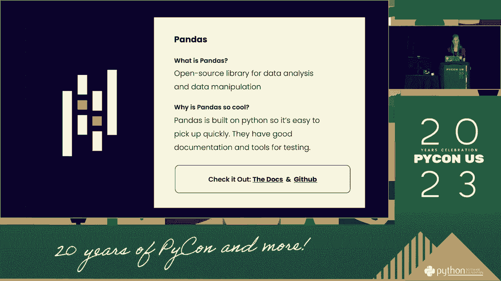

上一节我们介绍了课程概述，本节中我们来看看数据准备阶段的关键步骤。

以下是数据准备阶段必须执行的核心检查项：

*   **检查数据完整性**：确认数据集中没有缺失值。如果存在缺失，需要决定是删除、填充还是采用其他处理方式。
*   **验证数据格式**：确保所有特征的数据类型符合预期（例如，数值型、分类型、日期时间型）。
*   **检测异常值**：识别并处理那些远离数据主体分布的极端值，它们可能代表录入错误或特殊情况。
*   **确保标签一致性**：对于分类任务，检查所有样本的标签都来自预定义的类别集合。

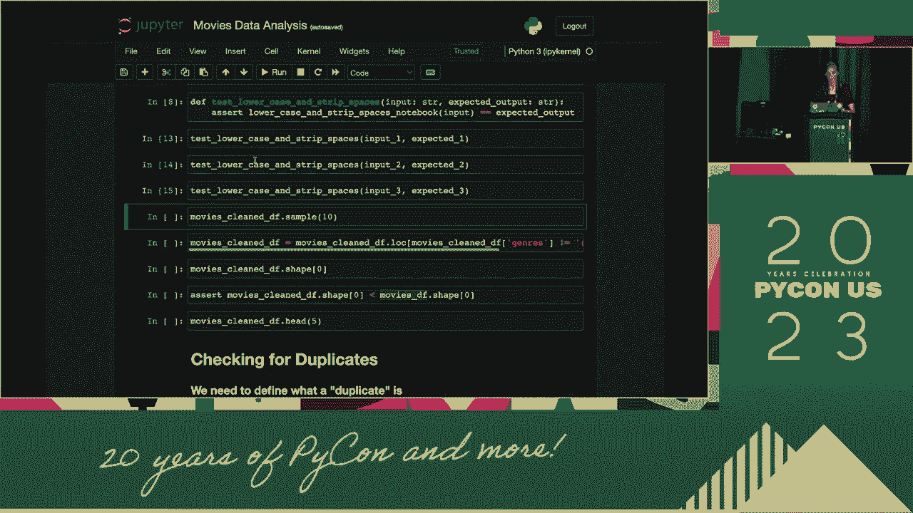

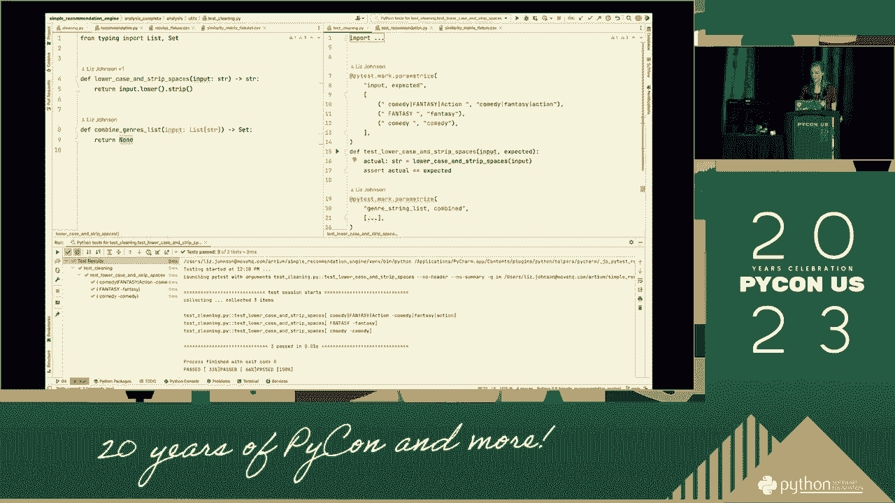

## 特征工程与选择 🔧

特征工程是将原始数据转化为更能代表预测模型潜在问题的特征的过程。好的特征能够显著提升模型性能。

在确保数据质量之后，我们需要将原始数据转化为有效的特征。本节中我们来看看特征工程中的注意事项。

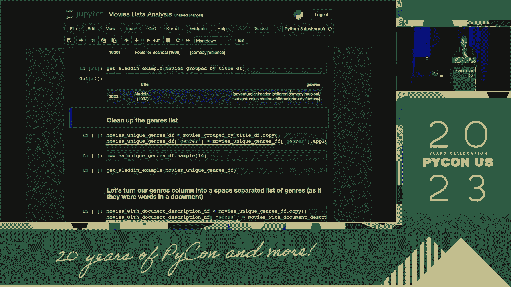

以下是进行特征工程时需要关注的重点：

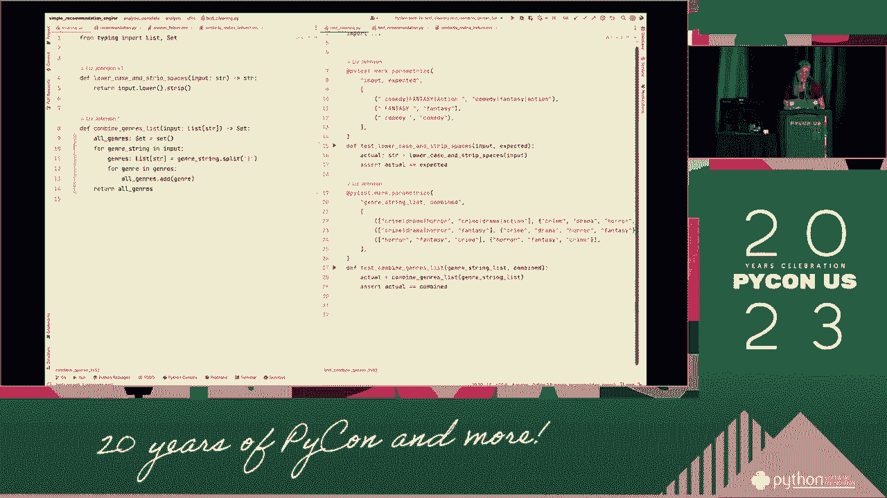

*   **避免数据泄露**：确保在生成特征时没有使用到未来的信息或测试集的信息。这通常要求严格按时间顺序划分数据或在交叉验证中小心处理。
*   **进行特征缩放**：对于基于距离的算法（如SVM、KNN）或使用梯度下降的模型，将特征缩放到相近的范围（如[0, 1]或均值为0，方差为1）非常重要。常用方法包括`MinMaxScaler`和`StandardScaler`。
*   **处理分类变量**：将非数值的类别变量转换为模型可以理解的数值形式，例如使用独热编码（One-Hot Encoding）或标签编码（Label Encoding）。
*   **评估特征重要性**：使用模型（如随机森林）或统计方法评估各个特征对预测的贡献度，并考虑移除不重要的特征以防止过拟合。

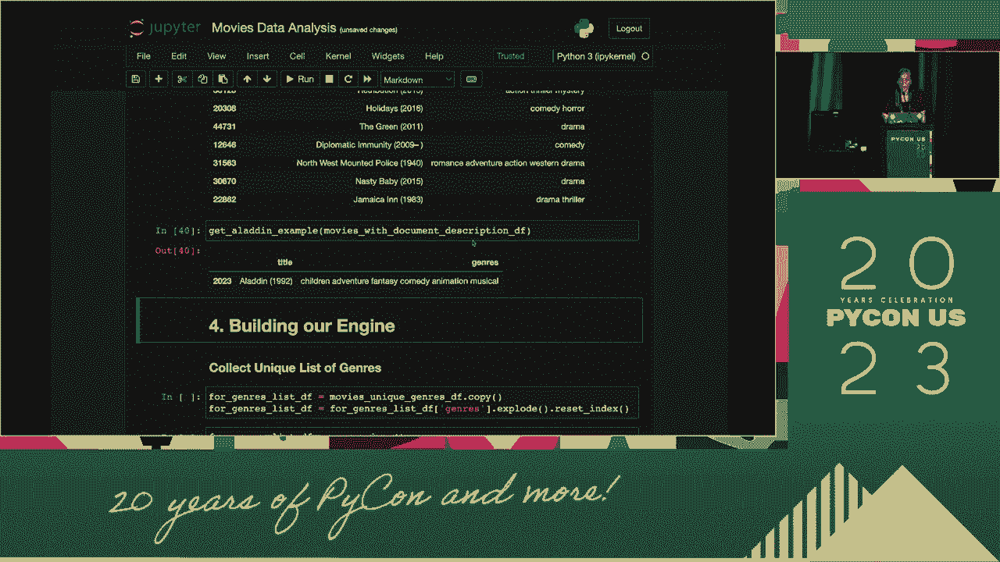

## 模型训练与验证 🧪

模型训练是机器学习流程的核心。在此阶段，我们需要选择合适的算法，调整其参数，并客观地评估其性能。

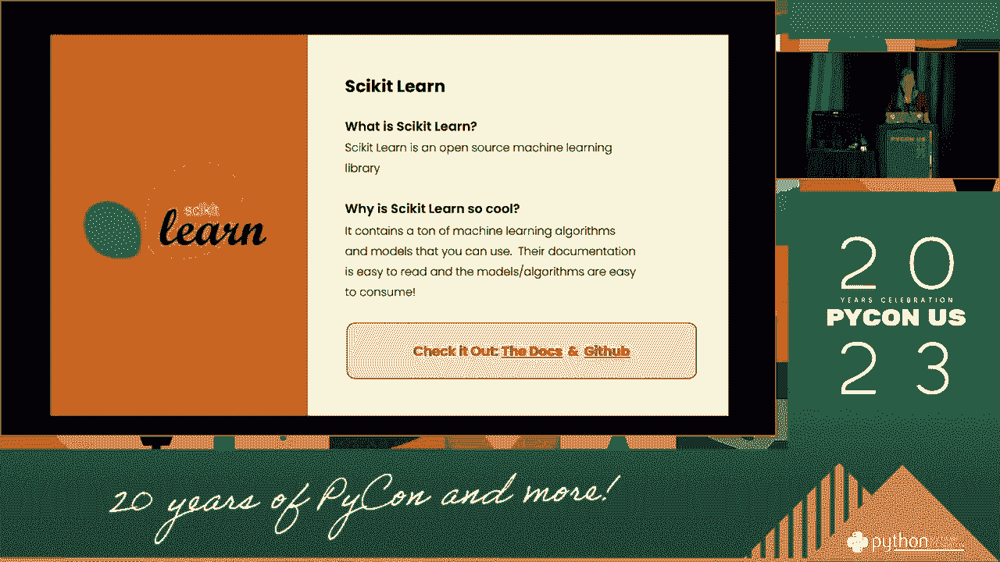

准备好特征后，下一步就是训练模型。本节中我们来看看如何正确地进行模型训练与验证。

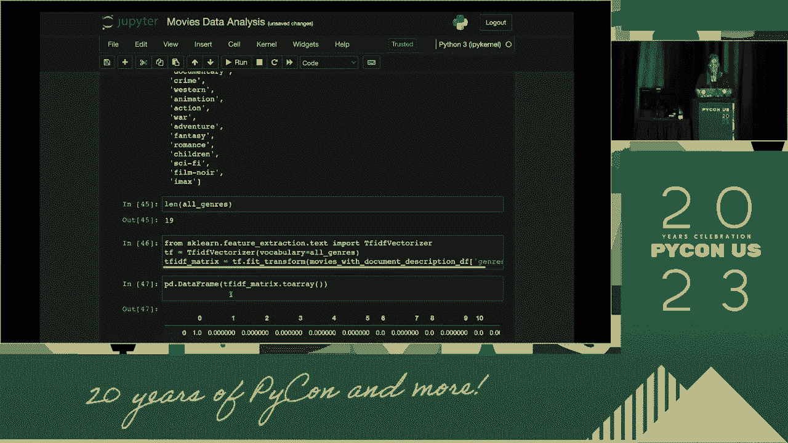

以下是模型训练与验证阶段的关键实践：

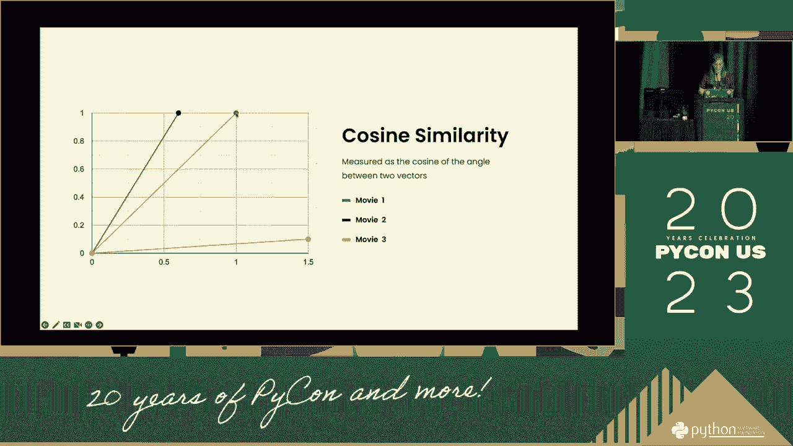

*   **划分数据集**：始终将数据划分为**训练集**、**验证集**和**测试集**。训练集用于训练模型，验证集用于调整超参数，测试集用于最终评估模型在未见数据上的表现。常用比例是60%/20%/20%或70%/15%/15%。
*   **使用交叉验证**：当数据量有限时，使用K折交叉验证（K-Fold Cross Validation）可以更稳健地评估模型性能。它将训练集分成K份，轮流将其中一份作为验证集，其余作为训练集。
*   **监控过拟合与欠拟合**：通过观察训练集和验证集上的损失（Loss）或准确率（Accuracy）曲线来判断。如果训练集性能远好于验证集，可能是过拟合；如果两者都很差，可能是欠拟合。
*   **保存随机种子**：为了结果的可复现性，在代码开头固定随机种子（Random Seed）。例如在Python中：
    ```python
    import numpy as np
    import random
    import torch
    np.random.seed(42)
    random.seed(42)
    torch.manual_seed(42)
    ```


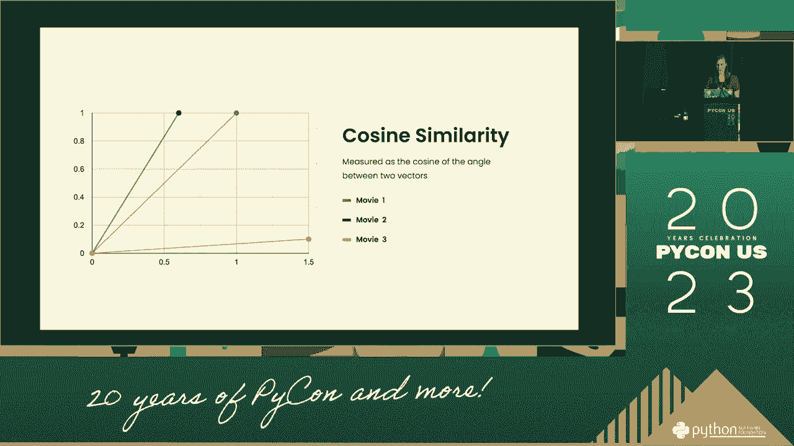

## 代码质量与部署 🚀

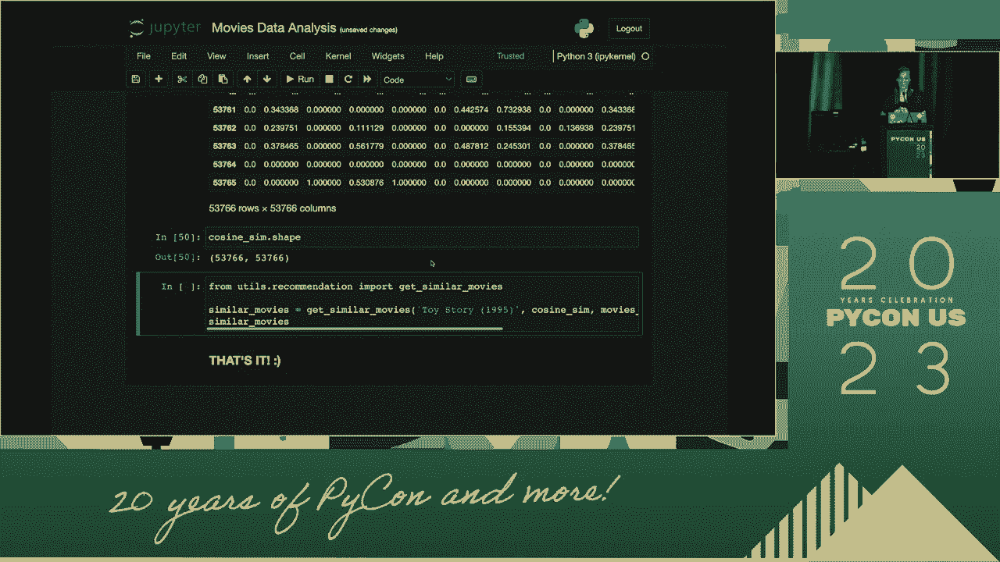

写出清晰、可维护的代码并成功部署模型，是项目从实验走向应用的最后一步。

在模型通过验证后，我们需要考虑如何将其转化为可用的产品。本节中我们来看看代码质量与部署的要点。

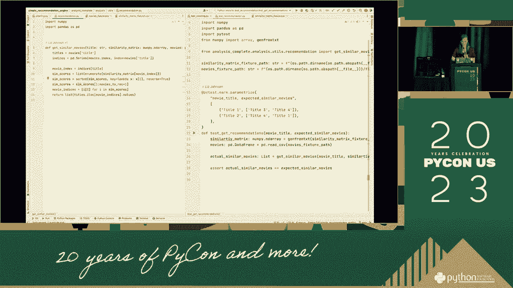

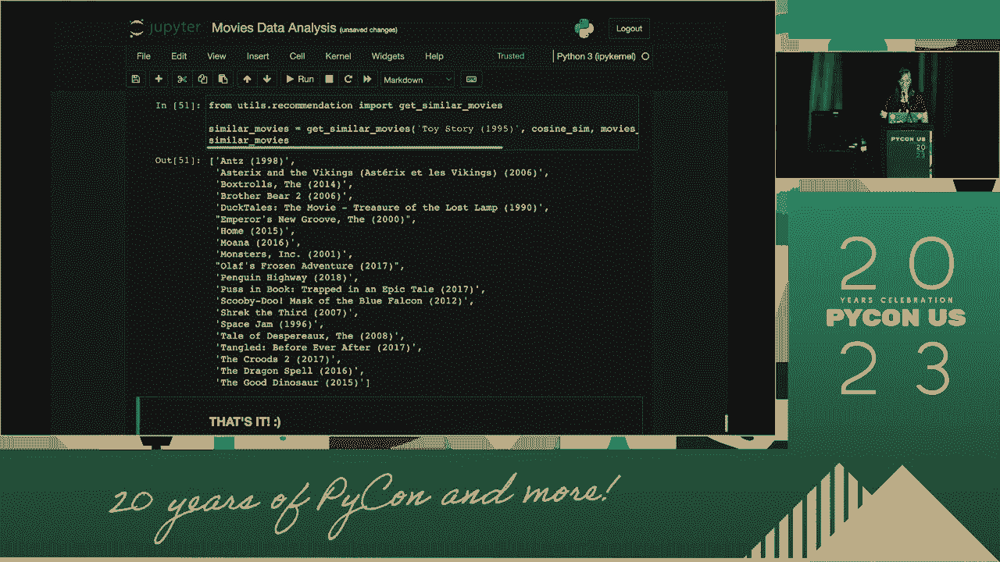

以下是确保代码质量和顺利部署的建议：

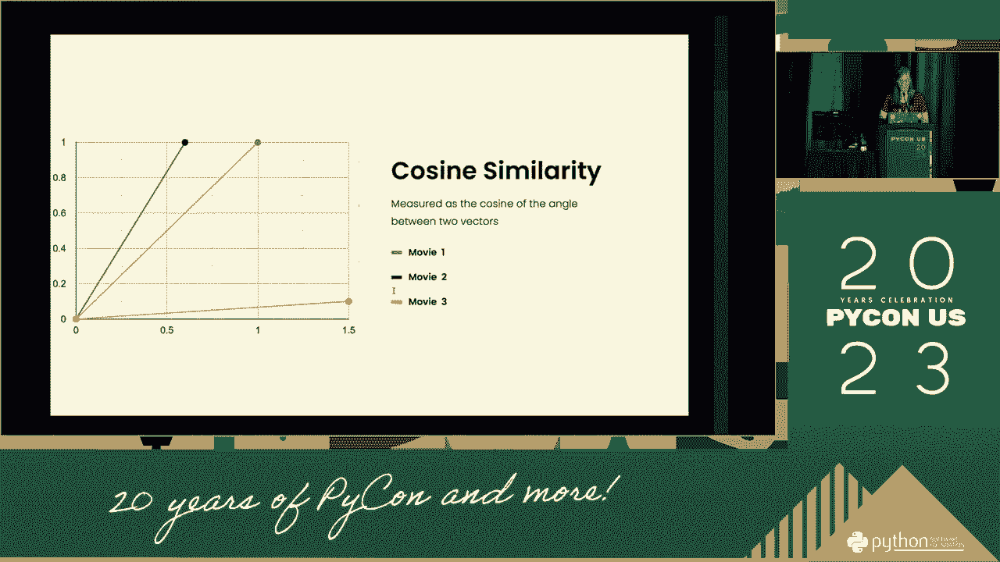

*   **编写模块化代码**：将数据加载、预处理、训练、评估等步骤封装成独立的函数或类，提高代码的可读性和复用性。
*   **添加日志与异常处理**：在关键步骤记录日志，并捕获可能出现的异常（如文件不存在、网络错误），使调试和监控更容易。
*   **进行单元测试**：为数据处理、特征工程和模型推理等核心函数编写测试，确保它们在不同情况下都能正确工作。
*   **版本控制**：使用Git等工具对代码、模型和重要的数据集进行版本管理。
*   **模型序列化与加载**：使用如`pickle`、`joblib`或框架自带的保存方法（如PyTorch的`torch.save`）将训练好的模型保存到磁盘，并确保在部署环境能正确加载。
*   **考虑线上服务**：如果模型需要提供实时预测，可以考虑使用Web框架（如Flask、FastAPI）将其封装成API服务，或使用专门的机器学习部署平台。


## 总结 📝


本节课中我们一起学习了如何系统性地避免机器学习代码出错。我们从**数据准备**开始，强调了检查数据质量和一致性的重要性；接着探讨了**特征工程**，提醒注意数据泄露和特征缩放；然后深入**模型训练与验证**，讲解了数据集划分、交叉验证和过拟合监控；最后，我们关注了**代码质量与部署**，包括编写可维护的代码、添加测试以及模型上线的注意事项。


记住，构建可靠的机器学习系统是一个迭代和严谨的过程。遵循这些最佳实践，建立完整的检查清单，将帮助你更早地发现错误，节省调试时间，并最终交付更高质量的模型。