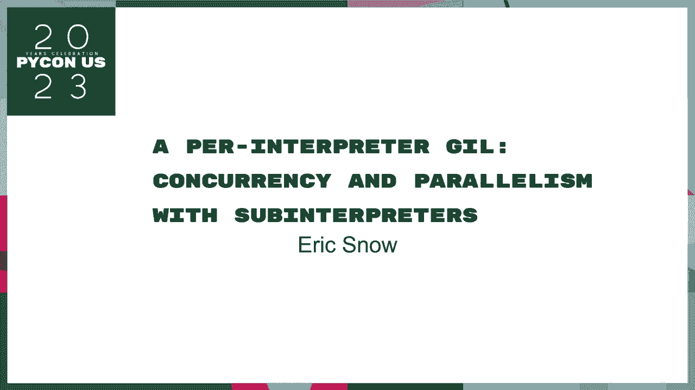
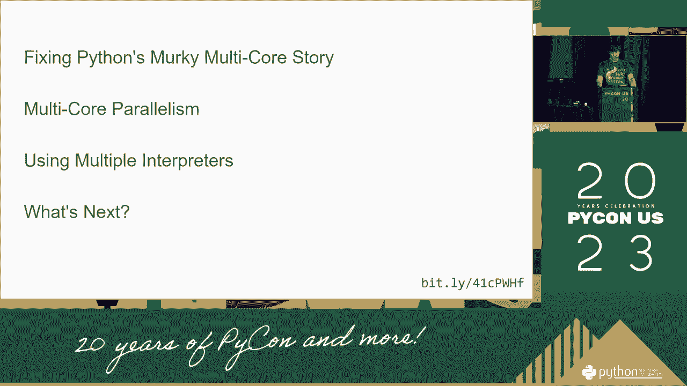

# Python并发编程：P32：每个解释器的GIL与并发并行

## 概述

在本节课中，我们将要学习Python中一个核心但常被误解的概念——全局解释器锁（GIL）。我们将探讨GIL是什么，它如何影响Python的并发与并行执行，以及“每个解释器一个GIL”这一新特性如何为解决相关问题提供了新的思路。课程内容将力求简单直白，适合初学者理解。

---



## 什么是GIL？🔒

全局解释器锁（GIL）是CPython解释器（Python最常用的实现）中的一个机制。它的核心作用是**确保同一时刻只有一个线程可以执行Python字节码**。

这听起来可能有些限制，它的设计初衷是为了简化CPython的内存管理，因为CPython使用引用计数来管理内存。如果没有GIL，多个线程同时修改同一个对象的引用计数会导致数据竞争和不一致。

我们可以用一个简单的公式来理解GIL的核心约束：

**在任意时刻 t， 执行中的Python线程数 ≤ 1**

这意味着，即使在多核CPU上运行多线程Python程序，这些线程也无法真正地**并行**执行（即同时利用多个CPU核心）。它们只能**并发**地执行（即快速切换，看起来像是在同时运行）。

上一节我们介绍了GIL的基本定义，本节中我们来看看它带来的具体影响。

---

## 并发 vs. 并行 🏃‍♂️🏃‍♀️

理解GIL的关键在于区分“并发”和“并行”这两个概念。

*   **并发**：指系统具有处理多个任务的能力。这些任务在时间上重叠，通过快速切换来执行，但在任一**瞬间**可能只有一个任务在实际占用CPU。这就像一位厨师同时照看几口锅。
*   **并行**：指系统具有**同时**执行多个任务的能力，这通常需要多个CPU核心。这就像多位厨师同时烹饪不同的菜肴。

在带有GIL的标准CPython中，多线程可以实现**并发**，但无法实现真正的**并行**。对于I/O密集型任务（如网络请求、文件读写），线程在等待I/O时会释放GIL，因此多线程依然能显著提升程序效率。但对于CPU密集型任务（如科学计算、图像处理），多线程无法充分利用多核优势，性能提升有限甚至可能因切换开销而下降。

以下是两种任务类型的简单示例：

**I/O密集型任务示例（多线程有效）**
```python
import threading
import time

def download(url):
    time.sleep(2)  # 模拟网络I/O等待
    print(f"Downloaded {url}")

urls = ["url1", "url2", "url3", "url4"]
threads = []
for url in urls:
    t = threading.Thread(target=download, args=(url,))
    t.start()
    threads.append(t)

for t in threads:
    t.join()
# 四个任务并发执行，总时间约2秒，而非8秒。
```

**CPU密集型任务示例（多线程受GIL限制）**
```python
import threading

def calculate():
    sum = 0
    for i in range(100000000):  # 大量计算
        sum += i

threads = []
for _ in range(4):
    t = threading.Thread(target=calculate)
    t.start()
    threads.append(t)

for t in threads:
    t.join()
# 由于GIL存在，四个线程无法并行计算，总执行时间可能接近单线程的4倍。
```

---

## “每个解释器的GIL”新模型 🆕

传统CPython中，整个进程只有一个GIL，这是多线程并行计算的根本瓶颈。Python 3.12引入了一项重要特性（通过`--disable-gil`编译标志或C-API）：**支持每个子解释器拥有独立的GIL**。

这意味着什么呢？我们可以创建多个子解释器，每个子解释器都有自己的GIL和独立运行环境。由于GIL不再共享，绑定在不同子解释器上的线程就可以实现真正的**并行**执行。

这个概念可以用以下模型表示：

**旧模型（单GIL）**：
`进程（1个GIL） <- 绑定 -> 线程1， 线程2， 线程3...（串行执行字节码）`

**新模型（多GIL）**：
```
进程
├── 子解释器1（拥有GIL-1） <- 绑定 -> 线程A（可并行）
├── 子解释器2（拥有GIL-2） <- 绑定 -> 线程B（可并行）
└── 子解释器3（拥有GIL-3） <- 绑定 -> 线程C（可并行）
```

上一节我们看到了GIL对并行的限制，本节中我们来看看“每个解释器的GIL”如何打开新局面。

---

## 如何利用“每个解释器的GIL”

要利用此特性，通常需要使用`_xxsubinterpreters`模块（或相应的C-API）来创建和管理子解释器。以下是一个高度简化的概念流程：

1.  **创建子解释器**：在主解释器中，创建多个新的子解释器。每个都是一个隔离的Python运行环境。
2.  **在线程中运行**：将不同的线程分别绑定到不同的子解释器上。
3.  **并行执行**：由于每个子解释器有自己的GIL，这些线程现在可以绕过全局GIL的限制，在多个CPU核心上真正并行执行Python代码。
4.  **通信**：子解释器之间的内存是隔离的，需要通过特殊的通道（Channel）机制来传递数据，不能直接共享对象。



以下是关键步骤的代码示意：

```python
# 注意：此为概念性代码，实际API可能更复杂
import _xxsubinterpreters as interpreters
import threading

def worker(interp_id):
    # 在该子解释器中运行代码
    interpreters.run_string(interp_id, "print('Running in parallel!')")

# 创建两个子解释器
interp1 = interpreters.create()
interp2 = interpreters.create()

# 创建两个线程，分别绑定到不同的解释器
t1 = threading.Thread(target=worker, args=(interp1,))
t2 = threading.Thread(target=worker, args=(interp2,))


t1.start()
t2.start()
t1.join()
t2.join()
# 两个线程中的Python代码可能在不同CPU核心上并行执行。
```

---


## 总结

本节课中我们一起学习了Python全局解释器锁（GIL）的核心机制。我们明确了GIL导致CPython多线程只能实现**并发**而非**并行**，尤其影响CPU密集型任务。接着，我们探讨了Python 3.12及以后版本中“每个解释器一个GIL”的新模型，它通过创建多个拥有独立GIL的子解释器，为实现真正的多线程并行计算提供了可能。虽然这需要更复杂的编程模型（隔离内存、显式通信），但它标志着Python在克服历史性瓶颈、拥抱现代多核架构道路上迈出了关键一步。

对于初学者，当前在CPU密集型任务中，使用`multiprocessing`（多进程）模块仍然是更简单直接的并行化方案。而“每个解释器的GIL”特性则为库开发者和高阶用户提供了新的强大工具。