# P35：谈话 - Glyph_ 如何保守秘密 - VikingDen7 - BV1114y1o7c5

这个问题由每个人或演讲者来讨论，如何保持贴纸也一样。欢迎 lue，称之为这个。

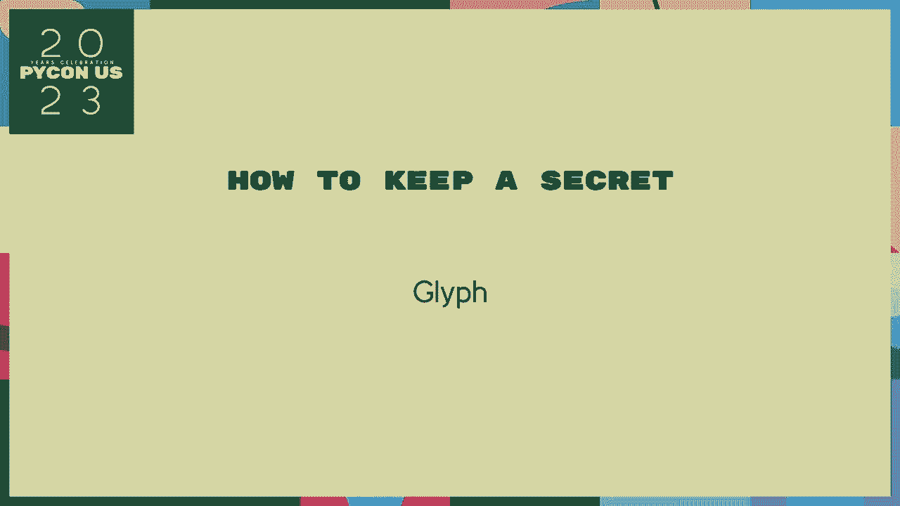

嗨，大家好，我是 gp，今天我将谈论 ikesecrets，以及你放在 pit secret 上。这个话题很庞大，我们这里只有三十分钟。因此在我开始之前，我想明确我的具体目标，我主要想讨论如何做到这一点。作为作者，软件会 ex，然而，你必须讨论这个，我也需要谈谈我们的用户。

为了获取一些内容，考虑讨论一下安全领域。我不会和你讨论太多，也不会讨论椅子，我不会讨论这些。通常，对于证书来说，30，我想专注的秘密是一种。并不意味着人类的事情，比如护照，呃，我不是在谈论一个关键的阿拉伯语。

他们说，为了做到这一点，你需要某种毁灭，关键是做得真的很压迫。因此你需要知道如何处理这些短语，谈论我叙述中的安全特性。角色和动机提升了兴趣水平。然而，这是一个教育性的故事，更像是现代寓言和历史寓言。

谁在谈论 porphic，动物教他们。但是现代人需要在严峻的环境中拥有他们的主要教训。通过与故事结合，常常以道德为基础。也许一开始有人治愈，真正的本质将会显露，这是我们的实践。

Tonist 努力理解这种情况，他们将被释放以成熟。Lelist 在 le 的层次保留，所以好吧，如果你看到了这些词。那天早上出现在幻灯片上时感到紧张，不用担心，没有什么昂贵的。但我确实想指出关于这个故事的某些事情，适用于所有在债务中的人。

如果我想让你知道，我们需要你，你可能会听到你正在做的事情。然后一些可怕的三种，或公司用户的做法。考虑这一点一遍又一遍，他真的影响到了整个事情。成为安全工程师并不意味着仅仅是专业人士。

你必须不断思考，保持最坏的状态。可能会一遍又一遍地经历的事情。因此，重要的是要注意并对攻击区域表示同情，这些区域描述得很少。许多事情需要相当极端的努力和资源。

还有很多人正在为你辩护，抵御这些文本，你的操作系统。Inventor ot，他们都在不断努力帮助你，保护你，他们在整个范围内受到攻击。Bringe 的漏洞，而 secretms 真的很重要，但我们必须谈论的一个重要方面是攻击者的实践，在 pyon 上注册美味的包，这种类型是可能的。

它们确实定期发生，但即使你对你的 p 完全陌生，派对项目也会定期通知，而这只是一个防御，单独对抗不幸的税务行动，现在我们完美，所以那种谨慎有其方法。其后的二代 jack tro 有一个为你准备十亿的想法，美元的蓝色，这是我对计算机的指南，独特的蓝色。

还没有其他人在使用，但对于他们的公司或项目 greendo。这里的想法是花费开放核心，为你提供开放源代码的移动。如果他与企业版本的紫色合作，你可以销售托管，供词也可以生成紫色。

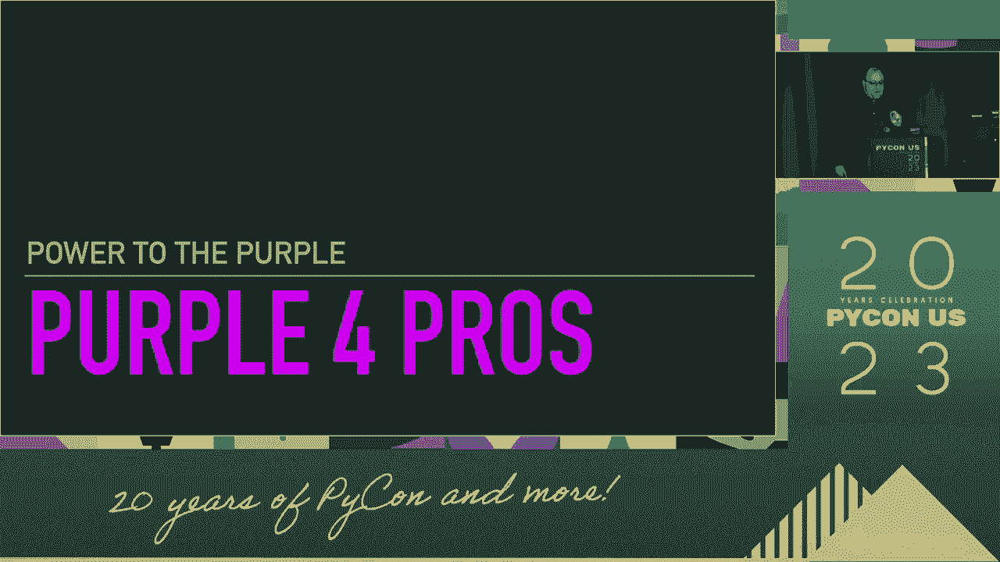

这是一个简短的元素，除了一个酷酷的颜色，呃，酸葡萄。这一个不得不复制倾向不幸。

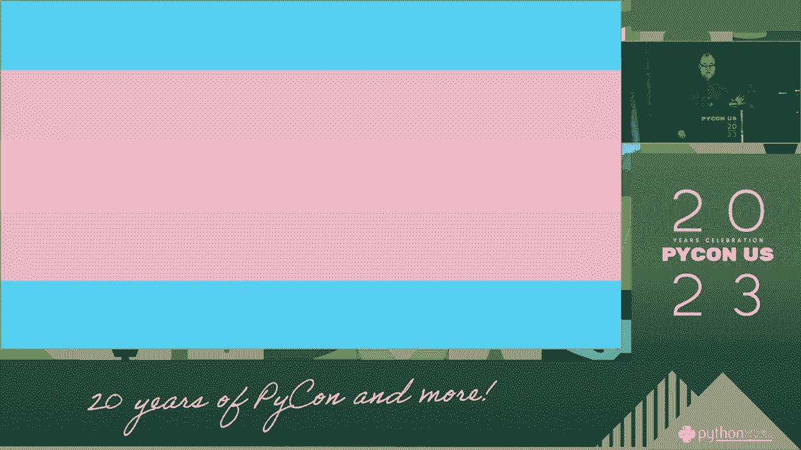

重新持有你的开发东西，那些开发受到他们的关注。第一次为本地 utai，Lgd，Ptwest 慈善事业的捐赠道歉，我要做的事情。这里叫做在退役安全中的威胁模型。我们将枚举前和在妥协中的情况，哪个链条会尝试构造。

一套尊重的着装和案例，所以让我们开始火焰重建杰斯，你的方式向上。让你的朋友们获取反馈，让网站开始测试它。各种请求不断按压新的蓝色，他的笔记本电脑在各种按压中关闭，播客在你为蓝色社区的革命中。

当然对他的计划没有用，他将专业紫色，这一天他的笔记本电脑就是这样。因此，账户旁边，像，这个是个忙碌的人。甚至不需要记住顶部的密码，所以你只需使用字符串。现在叙述者的隐喻像你，这个姿势，没有像大人物一样的。

你可以在这里学习和因素，但确实，有一个很酷的新网站。与几个密码交叉引用，你的通行数据，泄露也一样。他们接管了他整个云顶，如果有一百万个服务器。他们可能为你提供加密货币蓝色，并且所有做的都破产。现在是早上。

这是你已经有的卫生间，你帮他吹啊，但我们可以获取密码的方式。你应该获得两个 ui，我强烈推荐一个密码源项目。但你的网页中可能内置了一个。

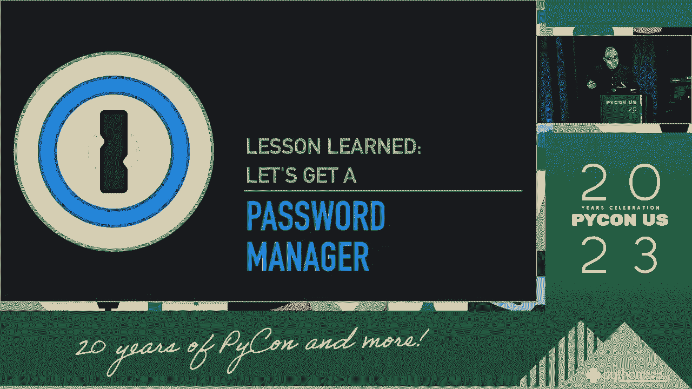

浏览器对这件事情进行推测，得到了某些牧师经理。

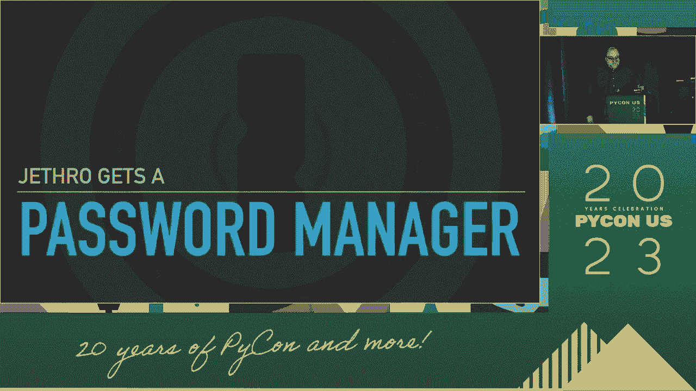

这是一个新的好安全功能，然后他立刻忘记了那个密码，他失去了对所有东西的访问。他去重置，建议不当，但无法达到那个目标。一个密码是其余安全的来源，所以这不可能。他已经为你访问，这是早上，风暴的秘密只是关于愚蠢。

Spes 和酷和加密，这也是实际责任中的备份。因此我现在想谈谈一些东西，叫做 CIA 三重实现。相信你可能已经对学院有最强的关联，CIA 在纹理安全中。

但没有。

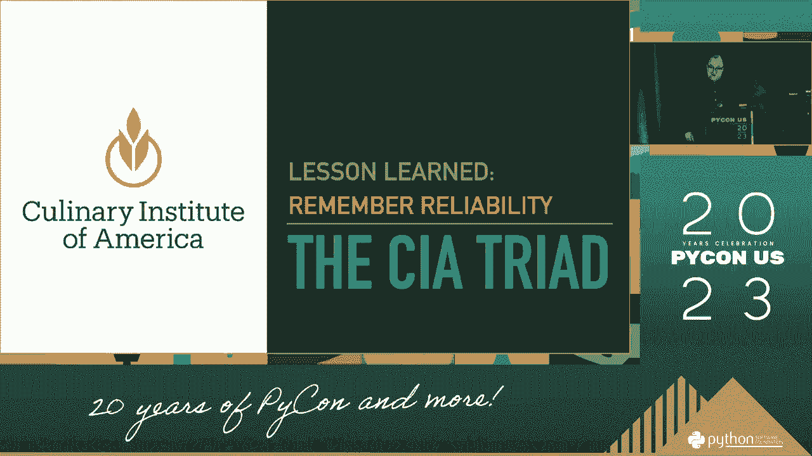

但在这种情况下字母实际上代表着，我的保密性，纸质棉花。那个乐园教我们如何获得职业性传播，但另外两个字母很重要。如果没有它们，你就无法与那个人交谈。A 指的是你不能让打包者更改数据，这不是超级无聊吗，这次谈话。

因为移动最终的 reh 数据像密码，这导致重要的事。那就是可用性，你的系统可用，你的秘密管理系统不可用。你可以获取主密码，仔细制定计划，我实际上有点害羞。他们可以帮助生成，我们将发布，核心密码实际上是你在手机上的。

在你的主类中，单词叫做 ptsl 拉夫斯，现在只有在这一点上，所以每秒一次。手势比大米更小心，你的密码，这些东西。所有网站密码都在设置后，这样弹出窗口会解释。因为他可以进行安全检查，点击链接并尝试登录出于某种原因。

他的 sha 新密码管理器是一个艺术家，我喜欢你，再次提到叙述者的好处。你是否在外部注入宇宙，你可能可以做到，这正在进行中。但她不这样做，她打开他的密码，复制粘贴，手动。并将其粘贴到网站上，现在是早晨，实际上工作的问题就是。

不是他的类型提供者安全网站，这是一个狮子安全网络的问题。此时对于他们的叙述，告诉你，你永远不应该在 2023 年点击。当我们的工作将延续五个百分点时，生活在链接上。其余的 25%就像我所说的，所以我们只希望我们不在意帽子。

对的密码管理器，实际上并没有真正存在，他们只会在正确的大小上自动填充你的密码。因此不要覆盖，如果你发现自己处于过去并非所有的消化者。许多公司经常会发生这种情况，拥有许多不同域的动物。你可能需要使用相同的密码，嗯，你应该做的是打开密码管理器。

找到密码的入口，问题并手动为你锁定，复制是攻击者。他们已经准备好利用你的业务，就像进入 webpack 一样，手动完成。然后它仍然不匹配，许多考虑的技术和助手，天猫都没去，甚至比密码更好。村民，单独是一个难题，使用网络努力，实际上是身体上不可能的。

还有两件很酷的事情可以做，所以杰夫学到了这个教训，生成速度更快。成员们来了，Jr 是准备覆盖的时候，他开始包装重置设置。代码通过作物文件提供者与开发厨房尝试启动。你提供的服务器，但云 vk 无法读取他的网络浏览器的想法。

他查看医生的文档和他提供者的示例，改变显示的秘密让人高兴。好的，现在是时候真正探索工作了，你应该出现，有一阵微风。请为你在业务中，这是推动代码的好时机。嗯，你可以直接去旋转源文件，这就是反向开源。

自从我们开放项目，杰夫意识到，错误仅在一分钟后。但当他努力找出正确的系列时，干净的 git 提交者重写历史并清除 githua。库中的自动化掠夺者已经掌握了钥匙， cryptocurrency 矿工们已经开始比赛。

杰夫在这里唤醒了你们中的一些人，可能正在站着，我知道我们正在悬置怀疑。情感叙述的要点，出于这个原因使用技能。但我只是开始让你们知道，我知道我只是告诉你放你的 API 和你的部分是对的。但现在这个人非常简单，但不幸的是，现在实际上相当友好。

我不想特别接手这些提供者。但只是想展示这些大型严肃公司一般都有非常好的安全性。某些 prepoli 条纹管在 mikuan，例如，他们字面上只是展示一些 papi 密钥的发布。

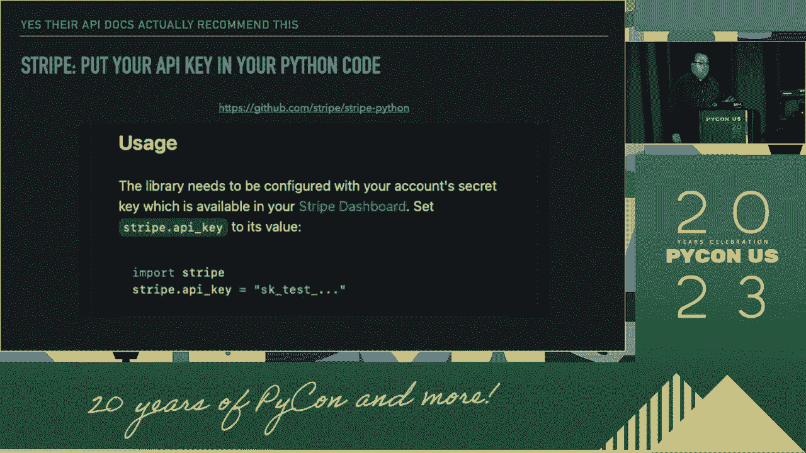

很少有关于我的英语的信息，乳液，嗯，我有文档，今晚选择一个导出。但你应该把应用程序放入你的镜头中。

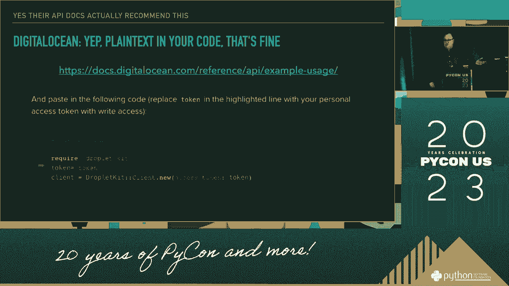

再次玩 Dota，没什么警惕，除非是 Python 的简短性，他们必须来和你谈钱。没有转变自我谈话，这关乎我的饼。我有这些更高级的特性来建模，但有一个特定的滑动引起了我的注意。如果你看这个，因为它是他们的词，承诺这是一个使用幻灯片表达的好地方。

我对狗的感觉建立了内心，使用秘密和源点，所以你知道。这就是我为什么有动力去获取巧克力，如果你足够感兴趣去结束，这个谈话你可能已经知道，比这更好，但对于初学的开发者，他们会看到与 toto 认证到你的服务。

这是人们会做的第一件事，他们购买定义。这就是为什么如果你要写呈现，像那样为你留口袋，这个结束的谈话。如果你感到无聊，因为你已经知道了所有的宠物，他们会遵循你的指示。别告诉用户，所以这可能会对你不利，但你该做的就是设定。

我们正处于中间的偏好，你在桌子尽头找到西方以重新加入我们的商店。导演唤醒了无人，试着做些不同的事情，草稿箱的秘密。边界到步骤，当这些手指粘贴到舍兰时，博客文章有一天。他试着把这个代码游戏放进去，但这次他们却忽视了。

特殊文件没有在后来被发送，你可能不小心，输入他的内容。作为编辑，有你文件的给予，专注于此，然后他尝试使用他的 faust，环境变量。并读取它到 alastle，不幸的是在我们图书馆的过程中。他们把你的日志放在 gist todthe 输出中，好吧，所以让我们更小心地销毁它们。

这次在他们拥有源代码之后，他们看到。只需将任何内容专注于诚实，你可能能够逃脱。私人的心脏上破解文件毕竟是私密的。当你要做的时候，你可以稍微相信这一点，因为你会发现很难做到。

更重要的是已经对我产生了拒绝，不像我们，生活在宇宙中。被任性的工作支配，专注于你，只学习一个非常特定的教训，真是糟糕。举个例子，试着使用备份服务备份他的笔记本电脑，只要他能达到。自从那盒子，二十六，用户抓取一个备份海，尽管姿态尝试了。

把他的备份放在硬盘上，但随后硬盘被盗而无法读取。杰弗决定，他甚至没有在休息后更改笔记本。但请记住，可用性是一种力量，冲击他的生活是攻击者。不要让他们的加密货币和实体，因为在他眼中加密是完整的。

你把备份驱动器推得太远，就像现在一样，我们有备份而且它们是加密的。他真的开始认真对待，寻找实际上存储的最佳方式，历史的目的。他开始进行微软件开发的季节策略，进入遥远的链条。这个链条是经过加密的，我真的想要强调这一点，不是想的这次谈话。

这实际上只是直接使用这里，我们将探索更多。杰斐逊和国家在片刻间，然后给我们机会，新经验，可能只是使用。称呼那个密码保存某些东西，称之为获取任何应用程序的密码，你只需放手。通过边缘给你几个东西，咀嚼 fs，使用操作系统，凭证星。

这意味着你获得所有集体智慧。并告诉你关于仍然存在的威胁是什么，什么地方是与这些相处的最佳场所。即使它实际上没有提供更好的安全性。这也意味着你或你的用户去哪里审查关注。

你可以在他们面前使用标准的应对方式，多个备份。可以利用听到的秘密来找出更多的应用。安全的地方只是他的听觉是在第八次，第八次的谈话中。因为你可能会记得杰弗的生活是由水平的力量和安全控制的。

所以他必须应对一些稍微更多的东西，语气是某种东西。你可能想要考虑一下，记住我们开始获得更多的东西。我们迄今为止所做的一切，自从慷慨的计算机以来，正在遵循他的指令。但在一些邪恶的事情中发生了什么，想要做一个秘密，而它已经从他的写下。

即使是与打包网站一起，然而他不涉及流动支付。Hipi 是你计算机上的足球者，因为你用它访问 polyfi。Ipi 没有任何获利的方式，每一件新的 cathy，关于你要小心的事情。你安装的每一天，Jector 尝试剪切，而 ST 意外地用所有垫子做了 pit。

马克斯不幸地在作为管理者的注入宇宙中。稍微少一点快动恶意软件，这次报告，所以这实际上属于攻击它。第二条杰夫的线路在每一部分的凯因·格拉姆斯上，自动访问秘密。因为这就是从法国商店的课程，你可以在后台请求东西。

这次杰弗里·黄，文档非常小心，这是我们记忆的转折点，我们可以获得 p。一个标题的质量，错误不可避免，必须让杰弗准备好。

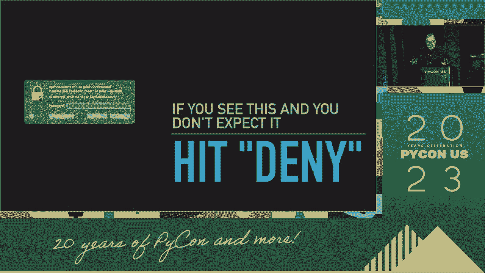

但或许没有，呃，在每一个最后一个，听到 grance，和杰弗的 coconusing 窗口。故事再次相同。

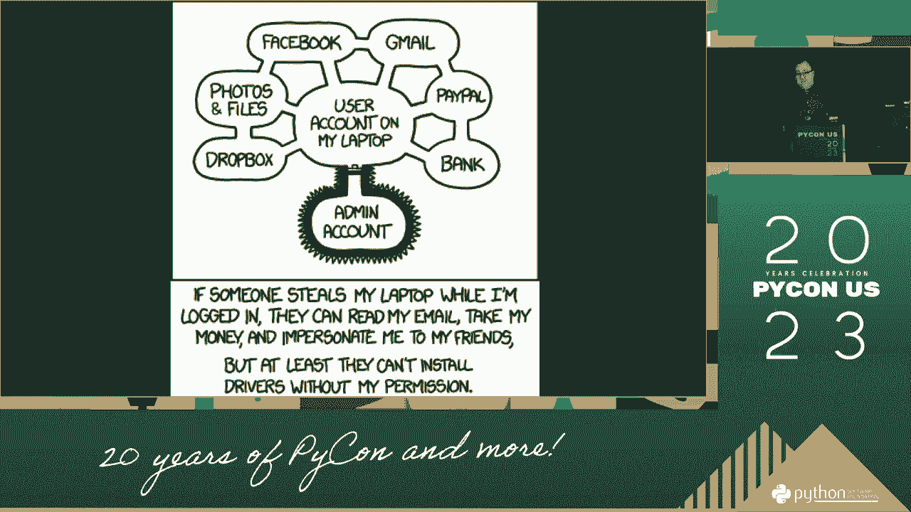

此时，耶稣的一段日期，治愈了毁灭，他响起，点数自定义回来。应该由用户指定，即使应用程序也不了解它们。所以手势可以控制，发生什么以确保安全，巴伦·科利塞克，具体的手势，新 b。

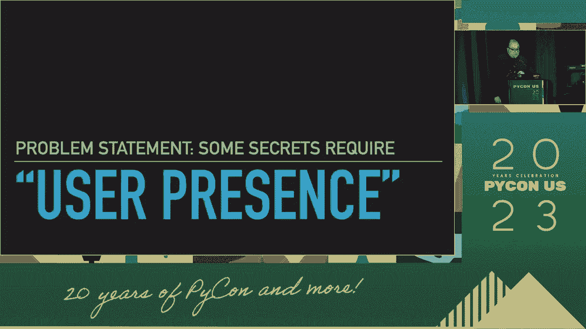

网络冒犯有特定的术语，但它被称为用户，它很长，我可以使用 coconvicator。你需要发布，Produdan 物理触摸，我在这里一次为他的提取秘密。正如我之前提到的，这种硬令牌的分数可以用来形成一个网络。网站的认证是一个很好的安全选项，所以已经有了。

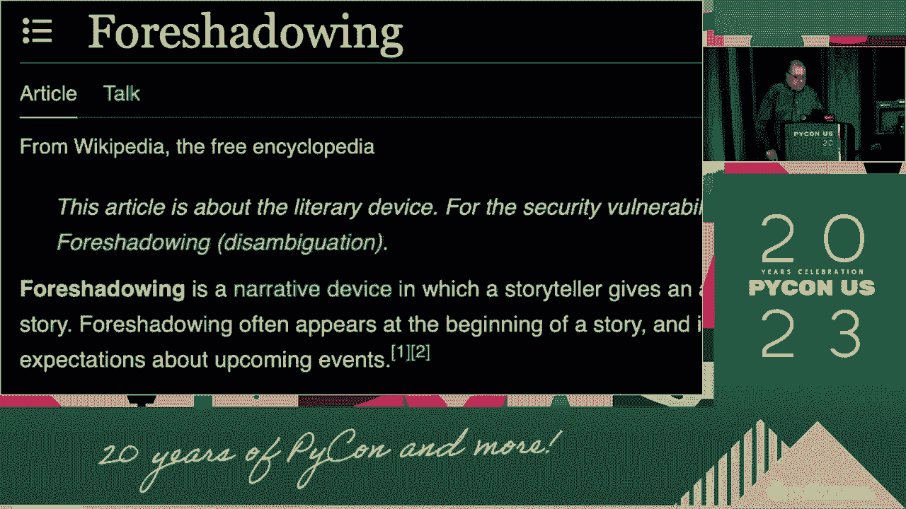

你不一定想要使用这种愤怒，某种秘密。但有些秘密比其他秘密更强大，你应该保护一些秘密。可以在后台处理诸如你的电子邮件的事情，并且你需要他们获得用户访问权限。因为如果你一直这样做，他不想碰你的硬件。

当触碰到意外的东西时，你不会注意到，属性总是可以预期的，因此耶稣的。一个软件，习惯于反馈，最终使用部分的哈普肯协议。至于网络令牌，无法让他的秘密暴露，未被发现，除非。这令牌是安全的问题，我们称之为，这不是版权侵犯。

来自平行宇宙。

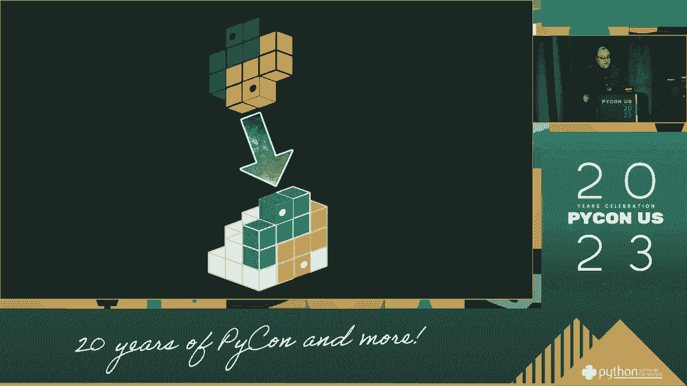

我从这个迭代中抓取门，为 projeter 重置事实而及时。自从我太多时间做一个 pickle guy，毁掉别人的生活。我不想给 demo gus 机会做同样的事情，所以这是一个实时恶魔。但这是几个小时前在学生那里，杰弗的代码和重置是宇宙。

由于我更快的编码，释放我在这个点上在 py 上注意到。我正在使用 tokyrka east tok。

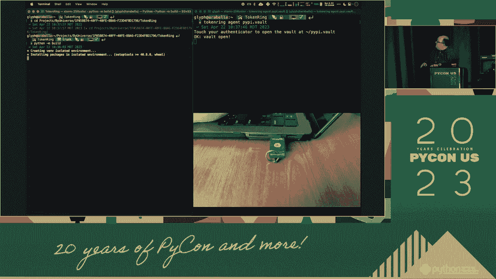

所以，当事情要停止，完成构建，只是想。那是 hipi 的标准上传，所以如果你有一些高安全性的应用程序。像是保护，一个 bellp 演唱会经理，你可以拿到 spoor manife。和 jean 一个相当不错的地方，而我 cser 秘密在他的笔记本上销毁，或者极其安全。

仅可访问，什么硬件，他结构化的每个访问要求是，现在部署一个零。Flix zero davies 是笔记本电脑，等到触摸你的钥匙，密封，秘密内存，但是我，在这一点上。你失去他将在在线课程中保护你的秘密。他在风险投资中筹集了一亿美元。

他雇佣了千名安全引擎的主题，他们过来，给人家好。他们公司资金耗尽，关闭，从未产生，甚至没有一个蓝色，放在上面。如果早上，你最喜欢的，第二个区块嘴唇，你觉得这个教训只是关于无限的吗？小心你的秘密，那是你的觉醒，感谢他意识到的所有部分。

她只是没有反应一次，永远在与最后一次抗争，没有办法逃脱。如果你在他们的力量和影响下感到几乎无能为力，所以来听听桶和复审。我把它回到适当的地方，错过了为所有这些攻击而演奏的机会。可以把它写下来给联合创始人，任何新员工或贡献者。

当攻击再次爆发时，我们走，如何 char 上下文提供显示他的门的安全性。你只需那种按钮，超出你的恢复服务。攻击新闻在某个地方恢复。他已经将当天的包裹打包起来，太缺乏，它感染了，这是四月的早晨。除了 jeter，唤醒攻击，在这个谈话中，似乎已经足够长了。

这段时间，我无法审查，杰弗如何保护他的秘密，你也需要。另一个我没有时间讲的重要规则是你应该了解力量。所以拿最糟糕的部分，你最终仍然需要将它们存储在某个地方。你仍然会有一些 ha 秘密，但它不必是，仅仅为了一个 wo。

杀死它啊，两个热门的，你可以查看我们的 gumpress。他们也需要把秘密放进你的 cir，privors 有 api 为此。而特别可能是其中之一，可能有专门的动作。还有一个叫 beat back 的 python 库，算是这样。

这是一个用于 hay corbt 服务的客户端，它除了豆类共享服务外。还请注意，如果你的应用程序已经在使用 keing，并且你开始与这样的工具集成，你可以更改 kiling 回调。对于基本的秘密访问，你只需考虑更改配置，非常感谢，所以呃。

我是玻璃，我们可以在互联网上找到我，Potplist 在各个地方。你只剩下几分钟时间来回答一个问题。

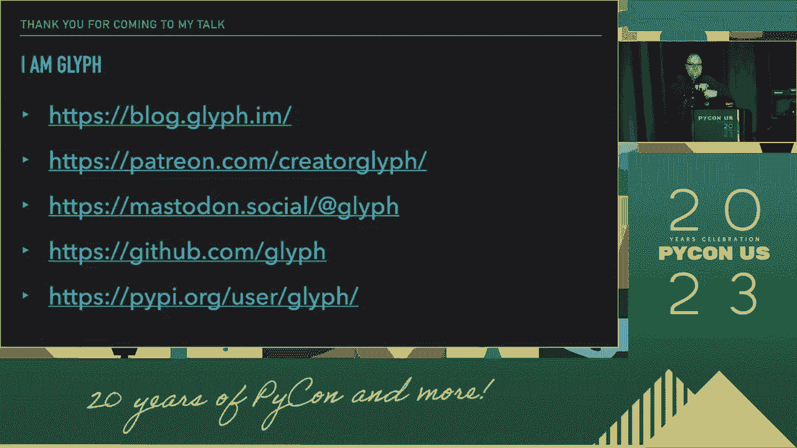
