# 可重复的分子模拟：P38：使用 Python 进行可重复的分子模拟 🧪

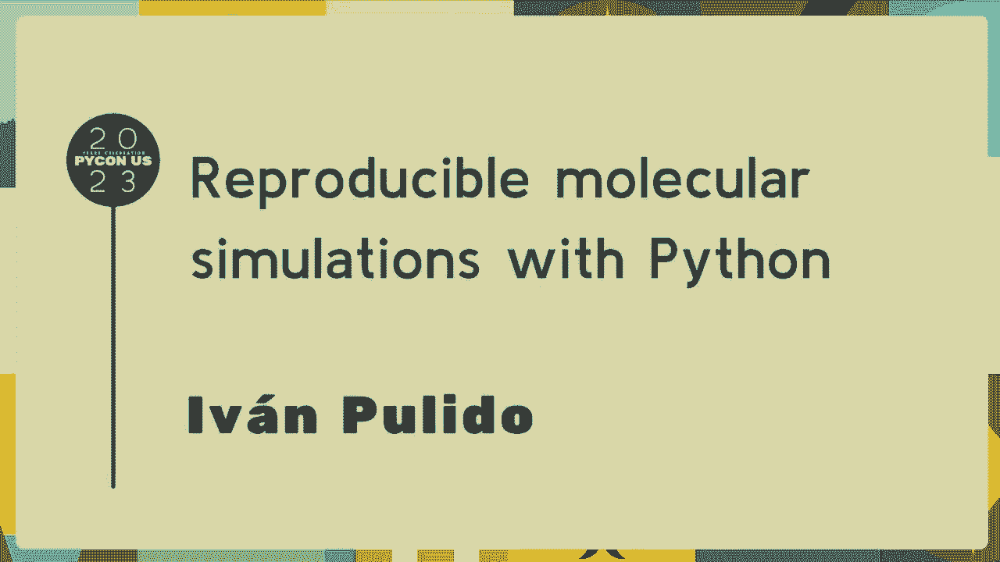

在本教程中，我们将学习如何使用 Python 实现可重复的分子模拟。我们将探讨确保模拟结果可重复性的核心概念、关键步骤以及实用的代码示例。通过本教程，你将理解如何设置随机种子、管理依赖库版本以及记录实验参数，从而让每一次模拟都能被精确复现。

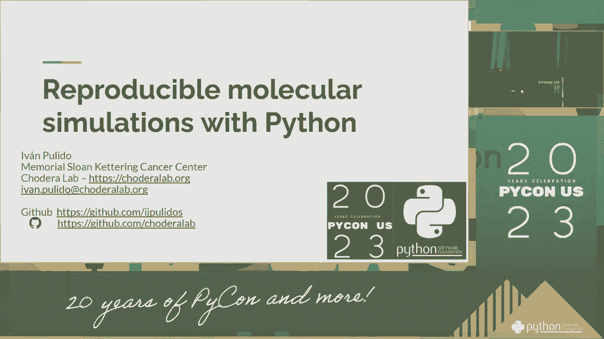

## 1：理解可重复性 🔍

在科学研究中，可重复性意味着其他人能够使用相同的输入数据和代码，得到与你完全一致的结果。对于分子模拟而言，这至关重要，因为它确保了研究发现的可靠性和可信度。

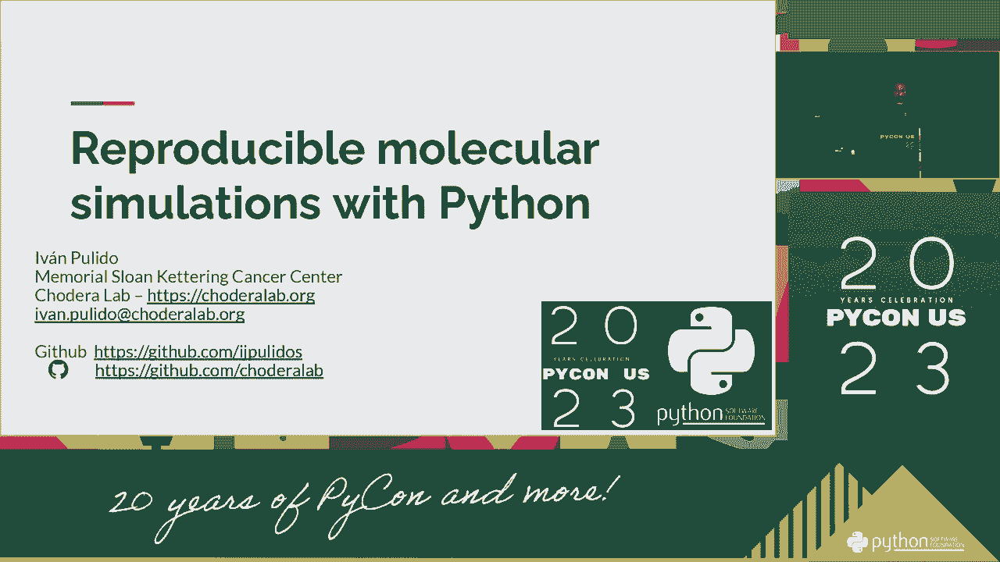

上一节我们介绍了可重复性的重要性，本节中我们来看看在分子模拟中，哪些因素会影响结果的可重复性。

以下是影响分子模拟可重复性的几个关键因素：
*   **随机数生成器**：许多模拟算法（如蒙特卡洛方法）依赖随机数。如果随机种子不同，结果就会不同。
*   **软件版本**：不同版本的模拟软件或依赖库可能产生不同的数值结果。
*   **系统环境**：操作系统、编译器甚至硬件架构的细微差异都可能影响浮点数计算。
*   **输入参数**：模拟的初始条件、力场参数等必须被完整、准确地记录。

## 2：设置随机种子 🔢

确保可重复性的第一步是控制随机性。在 Python 中，我们可以通过设置随机数生成器的种子来实现这一点。这能保证每次运行程序时，生成的随机数序列完全相同。

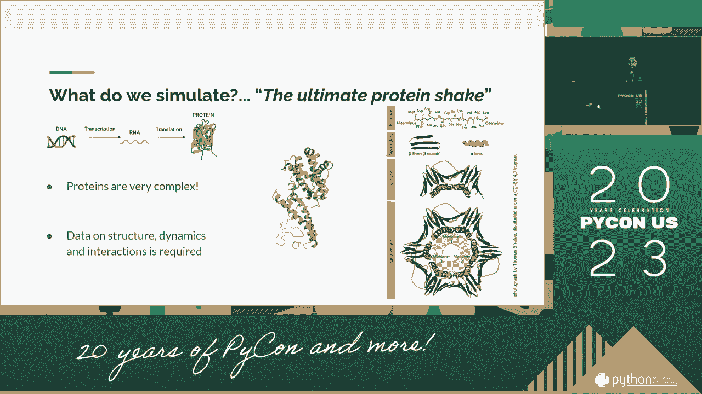

以下是设置随机种子的代码示例，适用于常见的科学计算库：
```python
import random
import numpy as np

# 设置Python内置random模块的种子
random.seed(42)

# 设置NumPy的随机种子
np.random.seed(42)

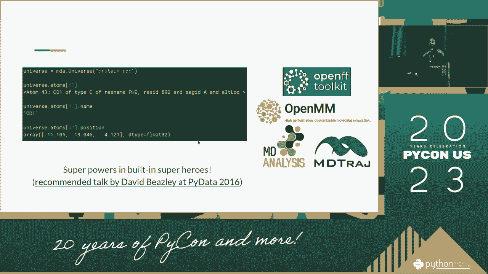

# 如果你使用其他库（如TensorFlow或PyTorch），也需要分别设置
# import torch
# torch.manual_seed(42)
```

## 3：管理依赖与环境 📦

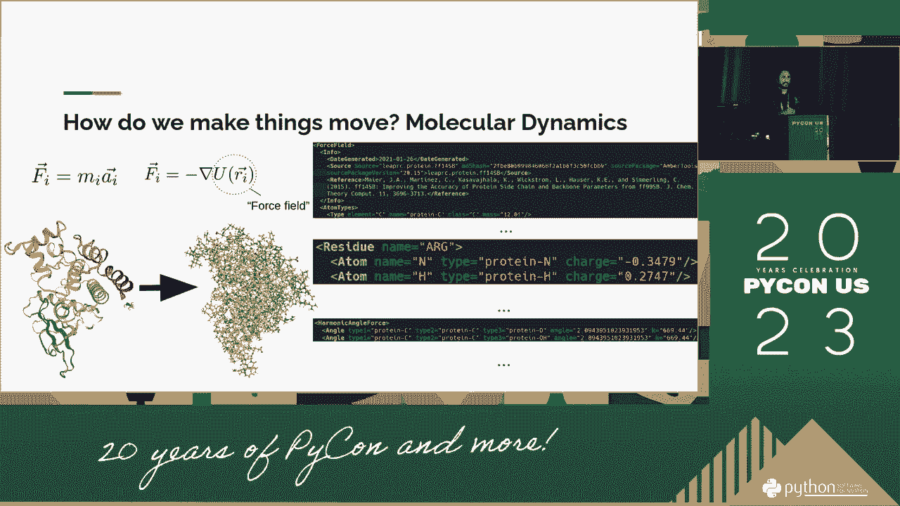

仅仅固定随机种子还不够。如果运行代码的软件环境（例如库的版本）发生变化，模拟结果仍可能不同。因此，我们需要精确记录和管理项目依赖。

上一节我们固定了随机种子，本节中我们来看看如何管理项目依赖以确保环境一致性。

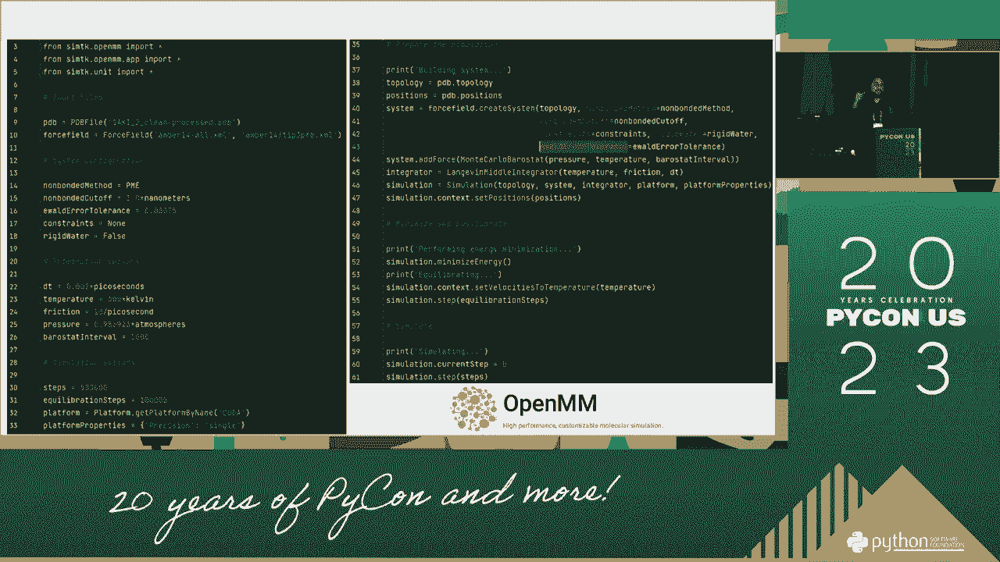

以下是管理Python项目依赖的推荐方法：
*   **使用`requirements.txt`文件**：列出所有依赖包及其精确版本。
    ```
    numpy==1.21.0
    scipy==1.7.0
    mdtraj==1.9.5
    ```
*   **使用虚拟环境**：为每个项目创建独立的Python环境（如`venv`或`conda`），避免包冲突。
*   **考虑容器化技术**：使用Docker等工具可以将整个操作系统环境（包括库、编译器）打包，实现最高级别的可重复性。

## 4：记录实验参数与元数据 📝

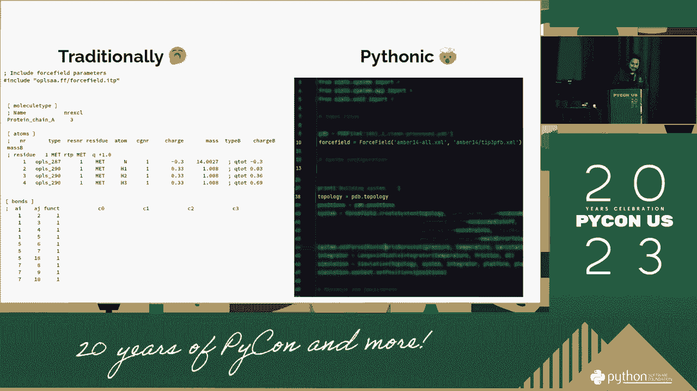

完整的可重复性要求记录模拟的所有输入参数和条件，这些信息被称为元数据。没有这些记录，即使有代码和固定种子，也无法复现实验。

以下是应该记录的关键元数据示例：
*   **模拟输入文件**：初始结构坐标、拓扑文件、配置文件。
*   **力场参数**：使用的力场名称、版本及所有修改。
*   **模拟参数**：温度、压力、积分步长、模拟时长等。
*   **硬件信息**：CPU型号、GPU型号（如果使用）、内存大小（可选，但对性能分析有用）。

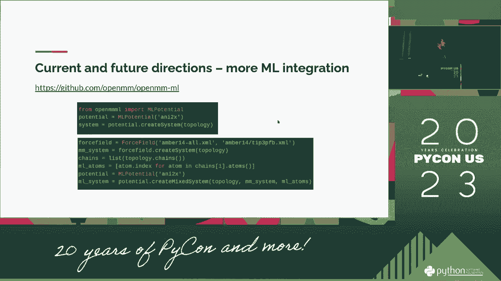

一个简单的做法是创建一个`metadata.json`文件与结果数据一起保存：
```python
import json
import datetime

metadata = {
    "simulation_date": str(datetime.datetime.now()),
    "random_seed": 42,
    "software_versions": {
        "numpy": np.__version__,
        "simulation_package": "1.0.0"
    },
    "parameters": {
        "temperature_k": 300,
        "timestep_fs": 2.0,
        "num_steps": 1000000
    }
}

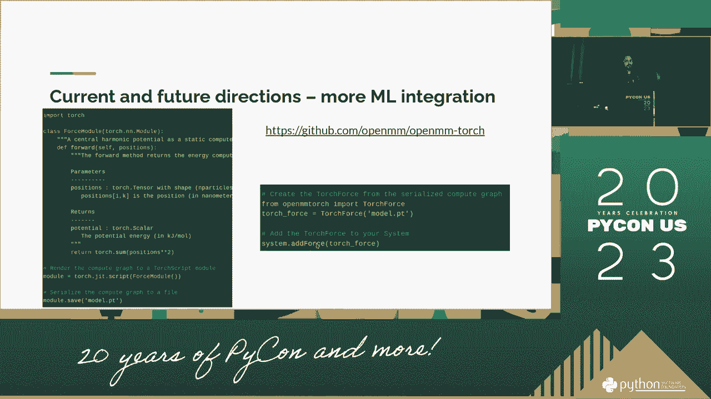

with open('simulation_metadata.json', 'w') as f:
    json.dump(metadata, f, indent=4)
```

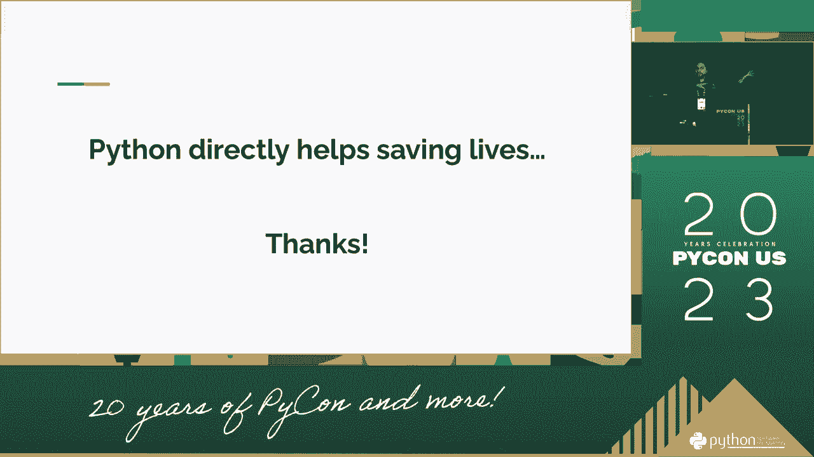

## 5：完整的可重复模拟工作流 ⚙️

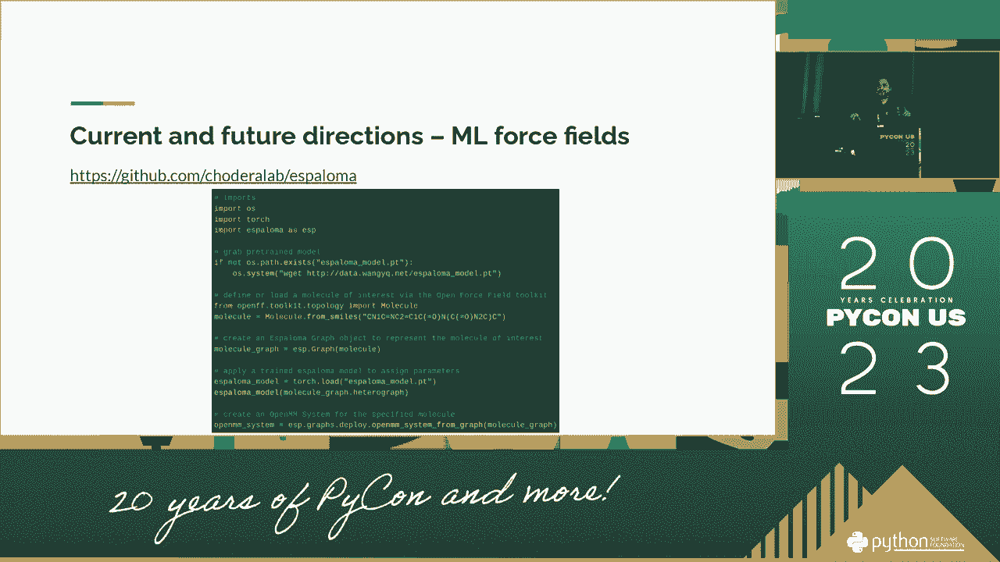

现在，让我们将以上所有步骤整合到一个完整的工作流中。一个健壮的可重复模拟流程应该像运行一个配方，每次都能产出相同的结果。

以下是实现可重复分子模拟的推荐工作流步骤：
1.  **项目初始化**：创建虚拟环境，并使用`requirements.txt`或`environment.yml`文件安装固定版本的依赖。
2.  **参数配置**：将所有模拟参数（如温度、步长）写入一个清晰的配置文件（如`config.yaml`）。
3.  **设置种子**：在模拟脚本的开头，明确设置所有相关随机数生成器的种子。
4.  **运行模拟**：执行模拟代码，该代码读取配置文件并运行。
5.  **保存结果与元数据**：将输出数据（轨迹、能量等）和包含所有输入参数、版本、种子的元数据文件一起保存。

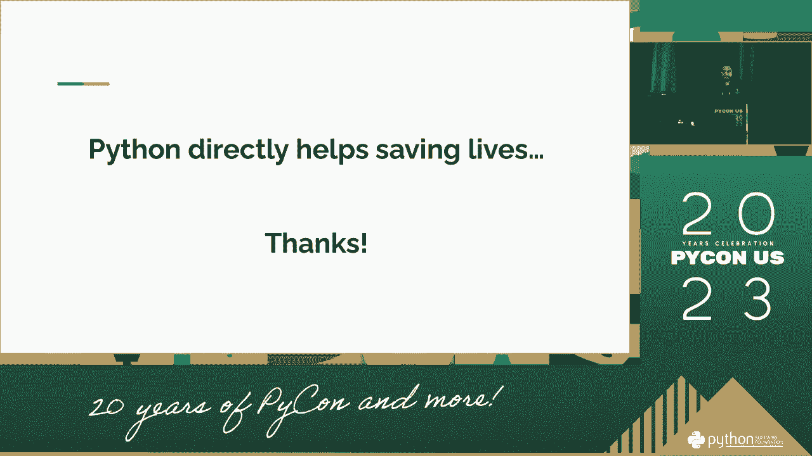

## 总结 🎯

本节课中我们一起学习了如何使用 Python 实现可重复的分子模拟。我们了解到，可重复性建立在三个支柱之上：**控制随机性**（通过设置随机种子）、**固化环境**（通过管理依赖和版本）以及**完整记录**（通过保存所有输入参数和元数据）。通过遵循本教程中的工作流和最佳实践，你可以确保你的分子模拟研究是可靠、透明且可被他人验证的。