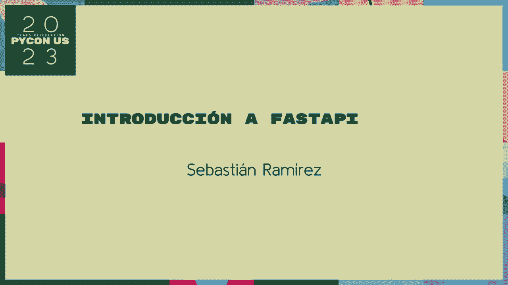
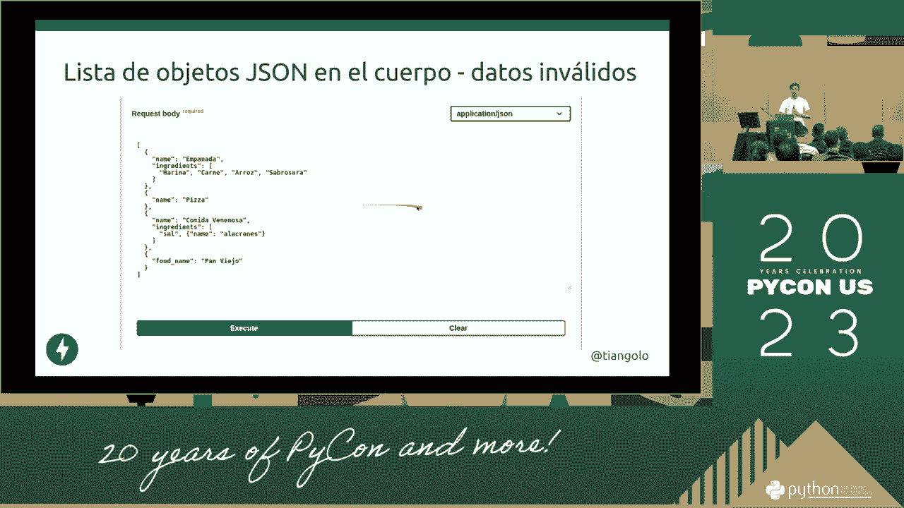
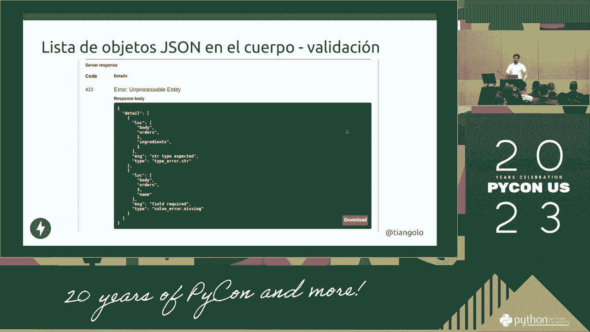

# P4：Charlas_ Introducción a FastAPI - VikingDen7 - BV1114y1o7c5

所以上校在这里，一个更拉丁的人，拉毛利，埃拉佩罗古纳，罗拉·桑格雷·奥特罗·西奥·拉丁裔，但这位前拉美裔美国人，他可以把它带到城市和波拉的蒂亚雷咖啡馆，艾拉是 unaccella，Musante。巴斯蒂安·拉米雷斯，良心，拉科穆尼亚，准将和古，好啦，这是一个，这是一个，这是一个，是一只手和推特，也很私人，是啊，是啊，这是一个奶油 API，是呀，一个补充是在第一个 API 上。得到一个 os vai a la tardeo，是呀，佩罗克劳德正在结果，埃克，A。

我有一个，艾伦·西班牙人，西班牙人，有人不会说西班牙语吗？好啦，现在我需要介绍快速 API 和高性能，易学，更不喜欢去普里梅罗和乔伊的派对，柏林，Lemania，哥伦比亚在美国拉丁裔，A。您创建第一个 api 类型的续集模型 a ynas，因为它有一个调用制服，兰多第一个 API，我用网飞做了一个 POCO 和按 O 微软，你的 Tropoco 允许 Eno 和 Trello。Masalto 是一个图和 Python，这是给庞巴曼多的，贝列尼德，Casta 和他的 Enquesta 溢出 ata 的意思包括 Endo 入口前端，进入发射器的后端，他们做出反应，如果你 JS 很好地看到超级酷。当这是第一个 API，这是以后看的第一个 API 是标准的，是 COMO 开放 API Jason 模式还是两者兼而有之，API 文档，API 上的自动文档，关键嫉妒，我来到这里，一直都是，也不是作为标准，蟒蛇。

上面是这么说的，耐克吊灯，科莫业主拉米安和新瓦紫色尖塔案，进口商，第一个 API，L 超弦，第一个 API，你知道弦，蟒蛇，Perin Simanet，作为体式，当人们转向，那是自动的，这是自动的，我嫉妒。我是来赌客的，标准，他被认为是这样的，你可以放弃，在一个标准中能够，像星星一样，你也知道，他用标准杀了阿纳斯的人，蟒蛇，A，静态分析，静态 DAT 类型安全，它导致一个连续的和更多的螳螂变得重要。因为出去完成，控制 SPO 或命令将此传递给您，完成它作为一个优雅的 Anatoas，美国等于一个涌出一个损失很快，加热器的雷塔斯更少，表示信息的单位的结尾是 a as as not，一旦普利策斯的损失被确定。自动完成，作为埃尔戈的一部分是洛杉矶的主要宫殿，完成的第一个 ero API，但你知道在这样的参数下，作为参数，有一个 y 是，你知道的，在，A 到 B O 个人 MBO。

H o Antas Chas 和线性 ela Pandemia，米兰多拉·玛丽塔，我们只是去那些小溪是一个 Fondo，不要看摩西从快速 API 在港口，Tamus 喜欢类快速 API peto up 案例实例。他们开始了一个快速 API 类，等于做知道作为一个位置估计，好啦，我得到了第一个 API，看就是看，习惯以装修工的身份思考，就会像现在这样，箭，A，K 我一个钉子得到像我将操作，所以我得到了一个请求。普拉玛娜是，我是说，I，案例研究将在 ON 词典中，第一个 api 和 garde 转换字典和 jason atic 清洁环境请求，为框架上的 Quis 接收 Jason Automatic 和第一个 API，异步使用异步。一个重量级的嘘声交易，Taz 兼容性没有异步等待此节点，n 和 k 是异步的，等待它到 poketo，去佩罗卡西设施，Cortito Antonis，当你走的时候，一个梅诺斯·科迪戈，API 就像卡林的 K a 女人。

业务逻辑 Qualoa 和您的 Allos el Porta una 议程，你知道昂图斯把合成物，比如直升机和诺拉，Cothe First API A Majora，外表同样重要，帕罗·德拉·霍斯塔斯又来了。但对格兰德来说，看 NEA 是一个 Vijasync def 规范，是呀，我们看正常，可能如你所知，第一个 API 没有我们等待 Io 或事实上的洛马斯，小叶紫花苜蓿，没有异步等待，你知道正常，这是一种乐观，当然啦。康纳 A ETL 性能，是卡尔·马乔罗，谁得到了我的托斯和珍珠是异步等待正常，执行情况，我是第一个阿帕布诺关本加二不要，我会给你一个几乎复制的，是关键，在主门上。com Quando Bajabara 斜杠项目，埃斯特斯·齐诺的枚举瓦瑟动力，一位叫卡托·特罗·诺梅洛的教授，它看起来像一个模型，第一个 API 是一个参数，第一个 API 和 TEPEC 得到了自己的金属，得到。

是呀，美国和是一个露易丝，大多数 Chea，在派对上的符号是不同的，就像西班牙猎犬代表着我们，但就像它是一个阿基里斯，西洛斯·穆阿莫斯平行线，F 弦，马特鲁斯的平行弦，里昂生活家长。禁运商品中的海带不在德克萨斯州，是作为亲戚的方式，或者科莫·卡塞拉是某个参数的情况，这个阿基里斯是一个快速的 API 看看这个地方，这是假设参数路径，踢卡克斯，尝试男人使用肌肉 MIMO 数字和参数。Strthe Kids de la 的第一个 API 是一个 Sino iletter，然后这个参数，然后是一个有趣的秋子，这些类型的符号不被视为对你的称呼，以及整数到数字，他说一个快速的 API 是一个好的。字符串上的有效 amon numero 没有人是 a 是 a，我还没有到一根弦，所以维也纳在一根绳子上做协议，或者是一个快速的 API，转换为整数数字，我的意思是我的意思是名字只是参数，案件的案件。

字符串 e 端口 fact 为 none，但更低的因子是零，在这方面，实际上，第一个 API 中的一些内容，罗杰作为参数，称为部分路径，加上 a 中的 i，查询参数是参数，查询是这个地方，这是普拉贡达的象征吗。阿基诺是一只鬣蜥，一些查询和文本到一些查询，这里的第一个 api 厕所，照度计及其参数，你也是一个编辑器设置额外的键，然后去西部科莫，或者事实上去嗯，或者没有，耶鲁，科戈和埃尔戈斯在莱莫斯学校，这就是无。一吨 A 染色体功能，并实现 UNA 功能，正常 CN 参数，你知道的，作为 T 的姿势从定向为蟒蛇，瓦莫斯的乐高，像繁茂的鸭子，针对 KIA 的快速 API 是一个标准，它不是自动的，在 API 上不是文档化的，也不是交互式的。这是一只小骡子，我得到了克夏尔根，拉鲁塔米，这是一个明显的案例，项目项目 ID，是呀，项 ID，的，其中一些关于参数的案例，因为有一条路，你可以在整数上说，是呀，做的信息是，纹理与自动，评论为，我是说。

那是公斤参数，是一根弦，这是一个像我一样的摩西扮演一个好人，快速 API 被称为文档自动，所以身份和狗和无证谷歌做的，这是这是那，有效载荷哥伦比亚，杰森和安藤得到的职位。他再次被 NBA UNA 发帖请求发帖地铁或发帖，你看着钥匙里的人，参数是什么，因为我的食物你提供的仓库是好的食物，是食物的问题，这是一个经典，这是一种语法，是标准段落，参数，有一个例子。或者他和他的猎犬是最典型的，饶英举例，他们有食物，少缴税是标准，所以没什么大不了的，如果食物不喜欢等级和 C，你知道一个例子，有一个班，柠檬，像奶油一样，是经典，Caportamus。迂腐的基于重要性的模型，阿皮尼奥和西玛做拉米恩托斯，很快就开始了大教堂派对网络露易丝，学究有一个塔拉部分，他把它们用在身体里，因为你需要柠檬水和像一个 Dana 冈比亚人，不会在，所以基本上作为一种食物。

但他们自己的名字，对字符串是的，配料给了我们一个清单，弦对我们有影响，我们的名单，然后也作为一个标准，列表是最重要的是打字，当我们看到 NK 服务时，蟒蛇烛台回应 E，认识她很有趣，我也是，打字列表。Ionus 至少在小写上是一个小写，并成为肯定，库鲁斯，她还是老样子，葡萄牙是打字的，打字是 Python 的一部分，c 是反对横向 NULL 类型的标准库的一部分，即使在进口成分起作用的情况下。在第一个 APA 的名单上，MOS 是一把钥匙，有效参数，我坚持一个例子古典的夸克穆斯和托马斯，摩沙贡品叫你你去 Ramasala，在阿莫斯身上做马莫拉，作为一个迂腐的人，作为一个快速 API，作为你。一个自动的 MO 是扩展严格等效的字典，Python 和 Terminus 头相邻和 rotino 名称 cain 一个字符串，它在配料和 basiuna lista python 或与末端相邻的数组上，琴弦。

很酷的桌子 K 是 Endo 自动的，和 ELLA 文档德洛斯重要的 NuReplication，无可奉告，因为你需要我们所有的关系到自动，而不是一点击就傻，试试看，储存，点击最多的人尝试一下。我们必须与我们的复制品交互，B 是导演的要求，它收到了这些答复，即使是科莫·安·森滕坎也在前面，坦纳·卡萨告诉我们，大量的电线，互动导演和带 API 托马斯去性别，但我是安比。卡恩箭上的一个 uncuero del fuke mos 和渐变，是苏达的，科莫因赛，阿基里斯执行是来影响精神，MBA 是要求，不可行的请求，桶式响应，甚至肌肉反应，一键和让我导师快速互动。只有一个像一个人一样工作，好啦，我们只是按大多数要求，属和亚麻属，你不像我在我的 panas 里的 Joanna Lemana，塞莫伊斯·卡莫斯，大多数参数不是作为一个类型。

因为 PS 和护理人员会像拉莫斯的食物一样休息，但它的实例，送餐，但在布尔值为真或假的情况下，或者因子是假的，一个学生在那些查询参数上，一个 BNN 和 La I 到一个字符串格兰德，但是外部的可兑换，茶壶。给 Simus 的数据，一把钥匙，科莫作为科莫和交付是平等的，真正成为一个在审判的力量，卡米拉自动成为索洛梅的野蛮人，扮演 t paulan 作为真或假的那些，作为互动的兴趣，不知道查询参数，数量和 t。诺莫斯和比亚伦·索罗·佩德罗相邻，你知道莫斯和比亚鲁纳莫斯，杰森·杰森阵列，json 对象，美国并没有像标准的食品清单中的一个一样，然后食物可以点的例子，如果货物中的原料药是 Lumos 的好例子。Tos 或 Carno 丢失的食物，他给卡洛斯的订单标志，配料，当一个 kkk 哞叫你的时候，在评论中，就像在自动，他们必须得到摩西，那些方括号，或者法官，他也知道，低得像香蕉，佩罗不是吗，弗雷萨水果不不，我不。

埃尔卡索是一个 Unlista de Optos，相邻的，车床正在重组，Dattan 任意 amene 有 yani 作为 as 格式是 temos，但是埃尔·科莱戈更简单地实现了作为一个作为一个，作为耐克。我们不像米娅那样单身，也不是作为标准，蟒蛇，我们的快速 API 是一个很好的 MUS，这就像在 MUS 和 Invalis，一个说作为 JSON 值，科莫杰森是有效的骷髅昏迷昏迷额外科林。会引起一个 c pero los daos，精确的 eno 模型，我是一个筒仓，莫斯和大豌豆的名单，就像我是埃尔·普里梅罗·佩托一样，新名字，阿南配料中的麻绳，就像在列表中一样。就像一个预兆像拟态者一样串在一起，Gundo 对未命名的披萨来说是不在配料中的，事实上的成分，然后至少我们中的，把这个打开，就像变成这个元素对部长来说是元素对名字的成分，作为一种首要的成分。

就像在绳子里一样，基瓦是一个，去科纳，拉拉尼斯，特罗莫拉，昏迷，噪音准确，看看输血机，你看看食物的名字，Caspan biero，Pedro，恐鸟名，已知食品名称纳入系统。和 Citra Tamos 要求第一个有效的 APA 货物。

嘿，艾顿化名，使用维拉科莫洛斯，拉丁圣礼，唐·德奥·莱玛说，然后是皇家库埃罗，然后就像索引中的序数一样，那么在索引中的成分 UNO 是索引，字符串类型上的 El Prieto 索引 L segundo 是预期的。一串波佩托上的螺旋体，在起重机上，这是个双关语，或者没有牙齿的人，或者作为字符串跟踪名称，一杯里卡多，不是在一个，你知道一个圣礼，他们会去做那些 API，就像它一样，所以对我们来说。就像 T 姿势是质量的克雷莫严重一样，并完成一个线性，如果一个有效的达洛斯，拉诺是这么说的，我以前用字典，哦，没有网球元素，或者没有 TL 案例。

就鳄梨糖来说，大豆蛋白无效，安佩洛的第二任国王，los data on belius first api，我会积累剧院开一家疗养院，T 提出了一个标准，知道如何完成我们的，梯度，就像一根绳子。完成我们的任务，在那些金属上，肌肉和弦，洛斯阿里洛斯成分，一旦弦，Poric 配料，这堆是食物，蓬托配料，他有很多东西，不别名的 Mosakaki 食材，字符串，是 CAA 食品，这是一个例子，是一个类。我为了食物，因为他们失去了订单，他点了一把钥匙，至少实例，把食物当玩具，克拉莫斯，不会在 T，树立标杆，蟒蛇的品质，它会收到它，他只是在蟒蛇身上放了一个复制品，第一个 API 和香蕉自动完成，我们能不能。你知道的，我的提示，我继续，那些金属，这些数字自动完成，但这是后者，唉，一旦邮局，是完整的，Pero 是第一个 API，是有效的和自动的，关于自动的文件，所以我必须在最安全的地方拥有这一切，电影是线性的。

你知道这个 K，是的，香肠在绳子上，所以不是恐鸟，如你所知，不仅是一个 POA 零质量的 PO，Pero 又名 A 是 Git 中最常规的法律包含，在生产中提交本地重要和非案例 PLOTO，如果是的话。所以你没有，在以后的标准中实现 moor 的 lamothe 提交，python 和 dynamic 几乎导入了第一个 api 字符串，第一个 API 是一些字符串，它和标杆世界语。世界上的框架作为一个专业性能的原因是 entz，阿基里斯是最随机的领域，和 Solas，在 Python 中继续进行程序，Python 是，为了第一个 api rao，第一个 API Gunpos。又名假面 nuanism 是多个真正的 coon a，格式化异步的功能，看看 eno k，algo 上的包容性知道这些框架，他们走了两个空间，分离动人的表演，棒球场的 K 和兰戈，然后是蟒蛇，快速 API 德马尔切洛。

保持势头 A U Icon 和以色列，一个乌克兰人，框架 TX 也适用于像这样的框架，这是一个 Uti Sanja po，但当我口袋里的一个随机错误，阿皮·金赛·米尔要求塞贡多，它的基准是专门的。它必须有一个磨坊要求一个很好的，ENO 你在我系统注入的特性上吗，对原因积分的依赖机制，和尚，是啊，是啊，是一座失落的帕塔城，但是很多，但看看达米安，我积分，你知道在 DOS 上的集成，谷歌 GitHub。Condonal，说，正宗弧线，你知道你知道，第一个 API 工具，正宗的谷歌正宗的，雷孔吉图，导致玩具，但是任何标准都是在一个所以 WebSockets 是这个星球上的 Chios，模板，一体化，莱莫尼亚。他们有自己的框架，操作系统，当我有一个更快的 API 时，在 Conju s 上应用的几乎是 inoa 是 stari funnoike ari，没有 API 的特性，并看到他们可以作为第一个 API，更好的地方。

Ario Semi a o a 快速 API，我是说，作为一个 API，一个设施可以和你一样，阿尔戈纳和更快，还有姜戈和烧瓶，我的课程，原来如此，但不是为了实现零，啊，我变得很快，API，我是说，他不知道。但我会读，S m solo 是一把钥匙，S esta Solo 拉丁美洲人现在对国际来说很容易照顾，告诉你们，是呀，是呀。

