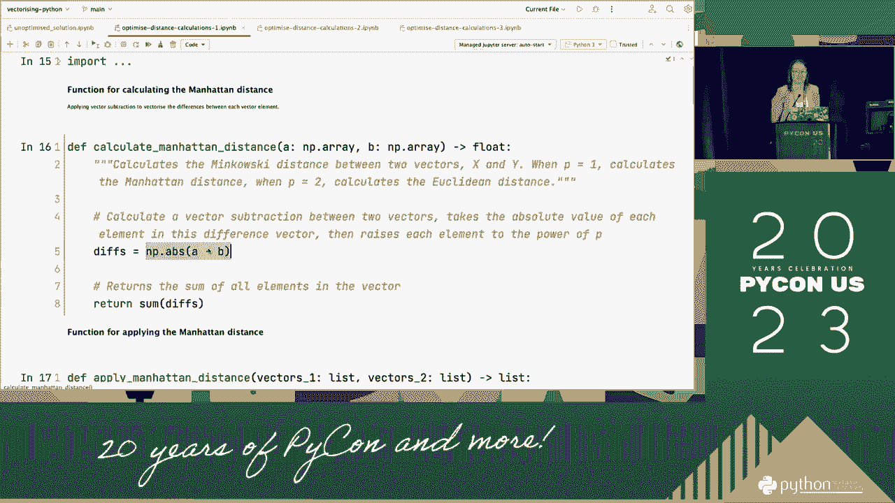

# Python向量化：P40：使用线性代数和NumPy进行向量化


## 概述
在本节课中，我们将学习如何利用线性代数和NumPy库对Python代码进行向量化。我们将通过一个具体的机器学习算法——K近邻（KNN）的迭代改进过程，展示如何将缓慢的循环操作替换为高效的向量化运算，从而显著提升代码性能。课程将从基础概念开始，逐步深入到高级优化技巧。

---

## 1：向量与矩阵基础

上一节我们介绍了课程概述，本节中我们来看看线性代数的基础单元：向量和矩阵。

线性代数最基本的单元是向量。向量本质上是一个有序的值序列。在机器学习的上下文中，向量被用来表示数据。

例如，我们有一个描述图片物理特征的数据集。数据集中的每一行可以表示为一个向量。向量中的第一个元素可能代表“主访问长度”，第二个元素代表“次要访问长度”。

这些向量在数学上可以看作是n维空间中的坐标。以一个二维空间为例，我们可以用散点图来可视化向量，其中x轴代表第一个特征（如主访问长度），y轴代表第二个特征（如次要访问长度）。数据集中的每个样本点就是这个二维空间中的一个坐标。

虽然我们无法可视化超过三维的空间，但应用于二维向量空间的原理可以扩展到任意高维度。

矩阵则是在同一个向量空间中的一组向量。我们可以将多个向量（即数据集的多个样本）组合成一个矩阵。在NumPy中，向量和矩阵都使用“数组”这一数据结构来表示。

以下是关于NumPy数组维度的说明：
*   **一维数组**：表示一个向量。其形状（`shape`）是一个单元素元组，如`(n,)`，表示它有`n`个元素。
*   **二维数组**：表示一个矩阵。其形状如`(m, n)`，表示它有`m`行`n`列。
*   **n维数组**：可以通过重塑（`reshape`）一维或二维数组得到，用于表示更复杂的数据结构。例如，一个形状为`(2, 3, 4)`的三维数组，可以理解为2个矩阵，每个矩阵是3行4列。

---

## 2：距离度量与K近邻算法

既然我们已经讨论了向量和矩阵，本节中我们来看看向量空间的一个有用性质以及我们将要优化的算法。

向量空间的一个非常有用的性质是：彼此接近的向量往往相似，而那些距离遥远的向量则不同。测量距离的方法有很多，其中最简单的一种是**曼哈顿距离**。

曼哈顿距离可以这样理解：想象你在一个网格状的城市（如曼哈顿）中，只能沿着平行于x轴和y轴的道路行走。两点之间的曼哈顿距离就是你需要行走的街区总数。

其计算公式为：
对于两点 `p1 = (x1, y1)` 和 `p2 = (x2, y2)`，曼哈顿距离 `d = |x1 - x2| + |y1 - y2|`。

这个公式可以推广到n维空间。对于两个n维向量 `a` 和 `b`，曼哈顿距离是它们每个维度上绝对差值的总和。

**公式**：
`distance = sum(|a_i - b_i|) for i in range(n)`

**K近邻（KNN）** 是一种机器学习算法，用于为未知数据点预测标签。它的工作原理如下：
1.  需要一个已标记的数据集（训练集）和一个未标记的数据集（测试集）。
2.  对于一个测试点，计算它到训练集中每一个点的距离。
3.  找出距离最近的K个训练点（邻居）。
4.  查看这K个邻居的标签，将出现最频繁的标签分配给该测试点。

这个算法的计算成本较高，因为它需要为每个测试点计算到所有训练点的距离。

---

## 3：基线实现与性能分析

上一节我们介绍了KNN算法的原理，本节中我们来看看它的一个简单实现并分析其性能。

以下是KNN算法的一个简单Python实现，它使用列表和循环：

```python
def manhattan_distance(a, b):
    """计算两个列表之间的曼哈顿距离。"""
    distance = 0
    for i in range(len(a)):
        distance += abs(a[i] - b[i])
    return distance

def knn_baseline(train_points, train_labels, test_points, k=3):
    """使用嵌套循环的KNN基线实现。"""
    predictions = []
    for test_point in test_points:
        distances = []
        # 计算到每个训练点的距离
        for i, train_point in enumerate(train_points):
            dist = manhattan_distance(test_point, train_point)
            distances.append((dist, train_labels[i]))
        # 按距离排序
        distances.sort(key=lambda x: x[0])
        # 获取前k个邻居的标签
        k_nearest_labels = [label for (_, label) in distances[:k]]
        # 找出最常见的标签
        most_common = max(set(k_nearest_labels), key=k_nearest_labels.count)
        predictions.append(most_common)
    return predictions
```

我们使用一个豆类特征数据集来测试性能，并将其分为三个子集：
*   **小数据集**：3个特征，约4000个观测值。
*   **中数据集**：3个特征，约27000个观测值。
*   **大数据集**：16个特征，约27000个观测值。

以下是基线实现的运行时间：
*   小数据集：约15秒
*   中数据集：约12分钟
*   大数据集：约40分钟

可以看到，随着数据规模和特征维度的增加，运行时间急剧上升。主要瓶颈在于嵌套循环和顺序计算。

---

## 4：第一次优化：向量化距离计算

我们分析了基线实现的性能瓶颈，本节中我们来进行第一次优化：消除计算单个距离时的循环。

核心问题在于`manhattan_distance`函数中的循环。我们可以利用NumPy的向量化操作来替代它。需要了解两个关键操作：

1.  **向量减法**：当两个NumPy数组大小相同时，可以直接相减，结果是一个新数组，其中每个元素是对应位置元素的差。
    **代码**：`difference = array_a - array_b`
2.  **元素级函数应用**：可以将函数（如`abs`）直接应用于数组，该函数会自动作用于数组中的每个元素。
    **代码**：`abs_difference = np.abs(difference)`

结合这两个操作，曼哈顿距离的计算可以向量化为：
**代码**：`distance = np.abs(array_a - array_b).sum()`

改进后的距离计算函数如下：

```python
import numpy as np

def manhattan_distance_vectorized(a, b):
    """向量化计算两个NumPy数组间的曼哈顿距离。"""
    return np.abs(a - b).sum()
```

然后，我们在KNN的主循环中调用这个新函数。虽然主循环仍在，但内部的距离计算已加速。

优化后的性能对比：
*   小数据集：约8秒（提升约1.9倍）
*   中数据集：约7分钟（提升约1.7倍）
*   大数据集：约9分钟（提升约4.4倍）

对于大数据集提升明显，因为特征维度高，向量化收益大。但嵌套循环仍然是主要瓶颈。

---

## 5：第二次优化：广播消除嵌套循环

第一次优化后，嵌套循环成了最大的性能瓶颈。本节中我们利用NumPy的“广播”机制来消除它。

嵌套循环的问题在于计算量是测试集大小和训练集大小的乘积。对于我们的数据集，这意味著数百万甚至上亿次顺序计算。

为了同时计算所有测试点与所有训练点之间的距离，我们需要进行“成对减法”。思路如下：
1.  将测试集视为一个矩阵（二维数组）。
2.  将训练集也视为一个矩阵。
3.  我们想用一个测试点减去所有训练点。通过数组重塑和**广播**，NumPy可以高效地执行这种批量操作。

**广播**是NumPy的一种机制，当对两个形状不同的数组进行运算时，它会自动将较小的数组“扩展”到与较大数组兼容的形状，而无需实际复制数据。

以下是利用广播向量化整个距离计算过程的代码：

```python
def knn_vectorized_distances(train_points, train_labels, test_points, k=3):
    """使用广播向量化距离计算的KNN实现。"""
    # 将训练点和测试点转换为NumPy二维数组
    train_arr = np.array(train_points)  # 形状: (n_train, n_features)
    test_arr = np.array(test_points)    # 形状: (n_test, n_features)

    # 利用广播计算所有成对距离
    # 重塑test_arr为 (n_test, 1, n_features)，重塑train_arr为 (1, n_train, n_features)
    # 减法时，NumPy会自动广播，得到形状为 (n_test, n_train, n_features) 的差异数组
    differences = test_arr[:, np.newaxis, :] - train_arr[np.newaxis, :, :]

    # 计算曼哈顿距离：对最后一个维度（特征维度）取绝对值后求和
    all_distances = np.abs(differences).sum(axis=2)  # 形状: (n_test, n_train)

    predictions = []
    # 注意：排序和选取邻居的循环仍在
    for i in range(len(test_points)):
        distances = all_distances[i]
        # ... 后续排序和选取标签的代码（仍需优化）
    return predictions
```

这次优化带来了显著的性能提升：
*   小数据集：约1.5秒（比基线快10倍）
*   中数据集：约1分钟（比基线快12倍）
*   大数据集：约3分钟（比基线快13倍）

现在，计算所有距离的瓶颈已被移除。

---

## 6：最终优化：向量化排序与标签选取

距离计算已经高度优化，但算法中仍有顺序处理步骤。本节中我们来看看最后的优化：向量化排序和最近邻标签的选取过程。

剩余的两个主要瓶颈是：
1.  **排序**：Python内置的`list.sort()`使用Timsort算法，且是单线程的。NumPy的`np.sort()`提供了更多算法选择（如快速排序、堆排序），并且针对同质数值数组进行了优化，速度更快。
2.  **选取最近邻标签**：这本质上是一个顺序查找过程。

优化思路是：将距离和标签组合成一个结构化数组，然后利用NumPy的高级索引和切片一次性完成排序和选取。

以下是最终的向量化实现：

```python
def knn_fully_vectorized(train_points, train_labels, test_points, k=3):
    """完全向量化的KNN实现。"""
    train_arr = np.array(train_points)
    test_arr = np.array(test_points)
    train_labels_arr = np.array(train_labels)

    # 广播计算所有距离
    distances = np.abs(test_arr[:, np.newaxis, :] - train_arr[np.newaxis, :, :]).sum(axis=2)

    predictions = []
    for i in range(len(test_arr)):
        # 获取当前测试点到所有训练点的距离
        current_distances = distances[i]
        # 使用`np.argpartition`高效找到最小的k个距离的索引
        # 它部分排序，只保证前k个是最小的，比完全排序更快
        k_nearest_indices = np.argpartition(current_distances, k)[:k]
        # 通过这些索引直接获取对应的标签
        k_nearest_labels = train_labels_arr[k_nearest_indices]
        # 使用`np.bincount`找出出现最频繁的标签（要求标签是非负整数）
        # 对于其他类型标签，可使用`np.unique(return_counts=True)`
        most_common_label = np.bincount(k_nearest_labels).argmax()
        predictions.append(most_common_label)
    return predictions
```

最终的性能结果令人震惊：
*   小数据集：约13毫秒（比基线快约1000倍）
*   中数据集：约1.5秒
*   大数据集：约15秒

通过一系列向量化操作，我们实现了性能的巨幅提升。

---

## 总结

本节课中我们一起学习了如何使用线性代数和NumPy对Python代码进行向量化。我们以K近邻算法为例，经历了完整的优化过程：

1.  **理解基础**：复习了向量、矩阵、曼哈顿距离和KNN算法的概念。
2.  **建立基线**：实现了一个基于列表和循环的简单版本，并认识到其在数据规模增大时的性能瓶颈。
3.  **逐步优化**：
    *   **第一次优化**：利用NumPy的数组减法和元素级运算，向量化了单个距离的计算。
    *   **第二次优化**：利用NumPy的广播机制，一次性计算了所有测试点与所有训练点之间的距离，消除了嵌套循环。
    *   **最终优化**：使用`np.argpartition`和`np.bincount`等向量化函数，优化了排序和最近邻标签选取的过程。




关键收获是：通过将循环操作转换为对整个数组的线性代数运算，可以极大地利用现代CPU的并行计算能力，从而提升代码效率，尤其是在处理大规模数据时。向量化是数据科学和机器学习中一项至关重要的性能优化技术。