# MQTT入门教程：P41：对连接协议的Python式介绍 🚀

在本教程中，我们将学习MQTT协议的基础知识。MQTT是一种轻量级的消息传输协议，专为物联网设备设计。我们将了解其核心概念、工作原理，并通过Python示例来理解其应用。

## 概述 📖

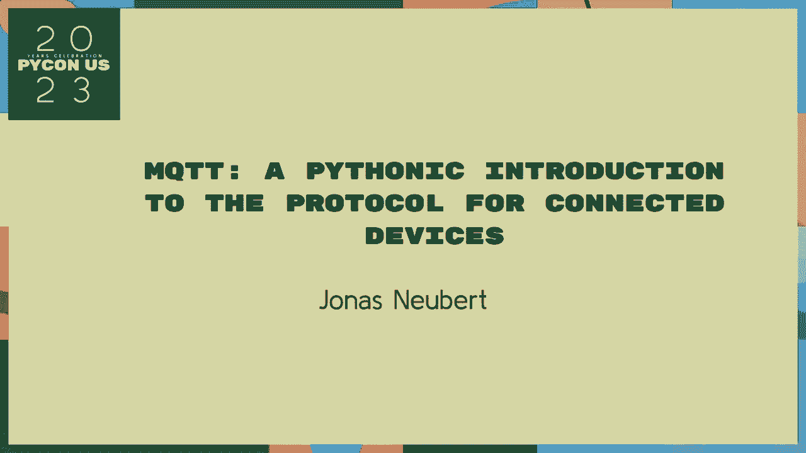

MQTT是一种基于发布/订阅模式的轻量级消息传输协议。它设计用于在低带宽、高延迟或不稳定的网络环境中进行高效通信。协议的核心在于一个**代理服务器**，它负责接收和转发消息。

## MQTT的核心概念 💡

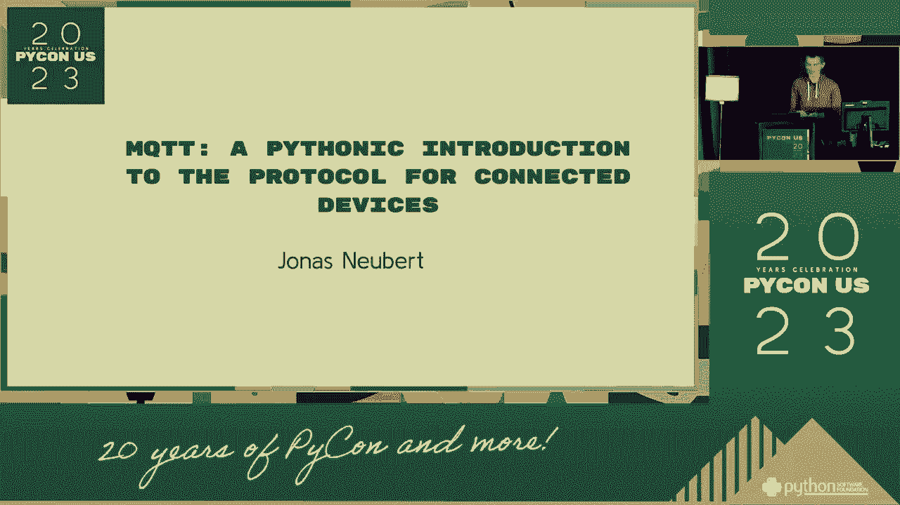

### 发布/订阅模式

MQTT采用发布/订阅模式，而非传统的客户端-服务器模式。在这种模式下，设备不直接相互通信，而是通过一个称为**代理**的中间服务器。

*   **发布者**：向特定主题发送消息的设备。
*   **订阅者**：订阅特定主题以接收消息的设备。
*   **代理**：接收所有消息，并根据主题将其过滤并分发给相关订阅者的服务器。

这种模式实现了通信双方的**解耦**，发布者无需知道订阅者的存在，反之亦然。

### 主题

主题是消息的地址或路由路径。它是一个分层结构的字符串，使用斜杠 `/` 分隔层级。例如：`home/livingroom/temperature`。

订阅者可以使用通配符订阅多个主题：
*   `+`：单层通配符。例如 `home/+/temperature` 可以匹配 `home/livingroom/temperature` 和 `home/bedroom/temperature`。
*   `#`：多层通配符。例如 `home/#` 可以匹配所有以 `home/` 开头的主题。

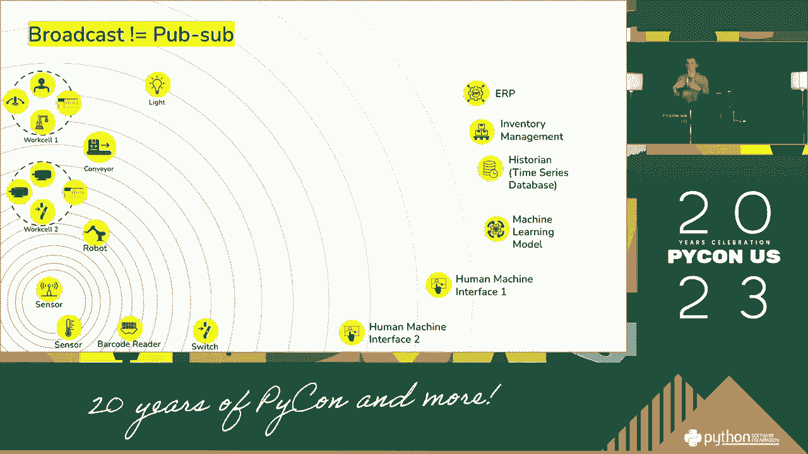

### 服务质量

QoS定义了消息传递的可靠性级别，共有三个等级：

1.  **QoS 0：最多一次**。消息发送一次，不确认，可能丢失。
2.  **QoS 1：至少一次**。消息确保送达，但可能重复。
3.  **QoS 2：恰好一次**。消息确保只送达一次，最可靠但开销最大。

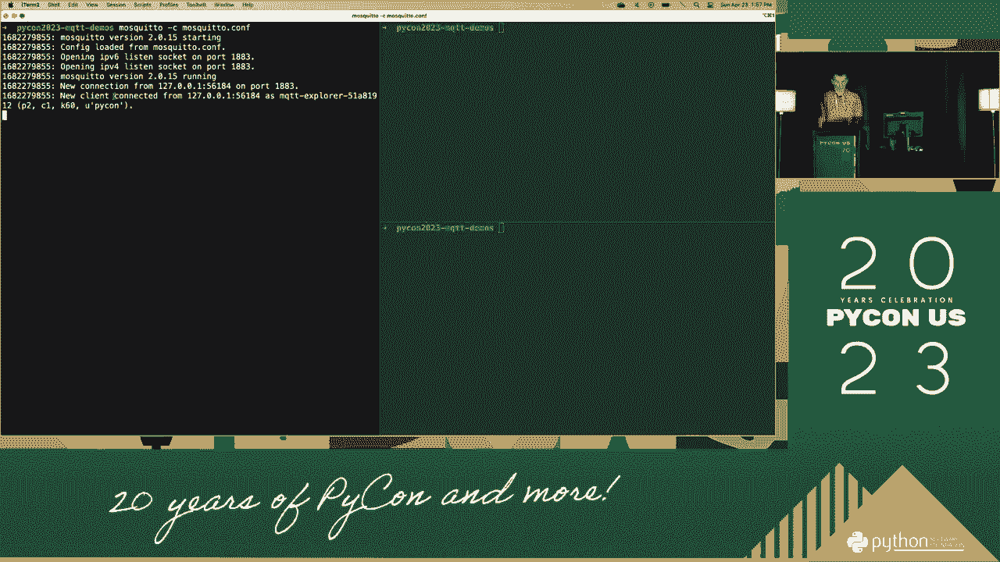

## MQTT的工作原理 ⚙️

上一节我们介绍了MQTT的核心概念，本节中我们来看看这些概念如何协同工作。

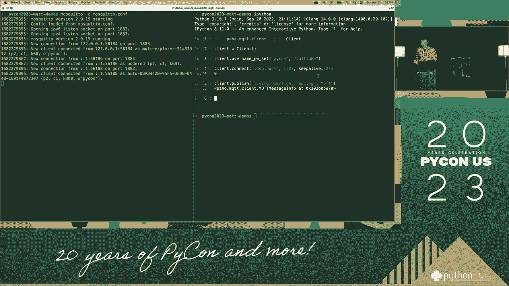

连接建立后，客户端可以发布消息到某个主题，或订阅感兴趣的主题。代理负责将发布到某个主题的消息，转发给所有订阅了该主题的客户端。

以下是MQTT通信的基本流程：
1.  客户端连接到代理服务器。
2.  订阅者向代理订阅一个或多个主题。
3.  发布者向代理的某个主题发布消息。
4.  代理将消息转发给所有订阅了该主题的客户端。

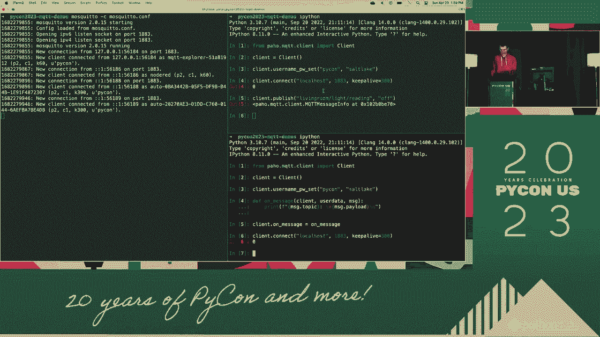

## 使用Python实践MQTT 🐍

理解了理论之后，让我们通过Python代码来实践。我们将使用流行的 `paho-mqtt` 库。

首先，需要安装客户端库：
```bash
pip install paho-mqtt
```

### 发布者示例

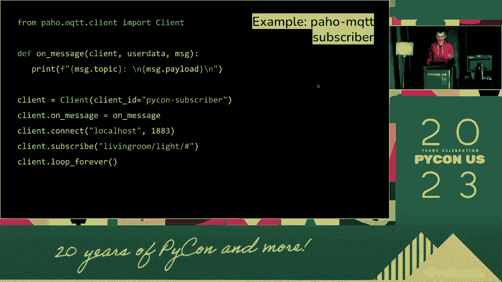

以下是一个简单的MQTT发布者代码，它连接到公共代理并向主题发送消息。

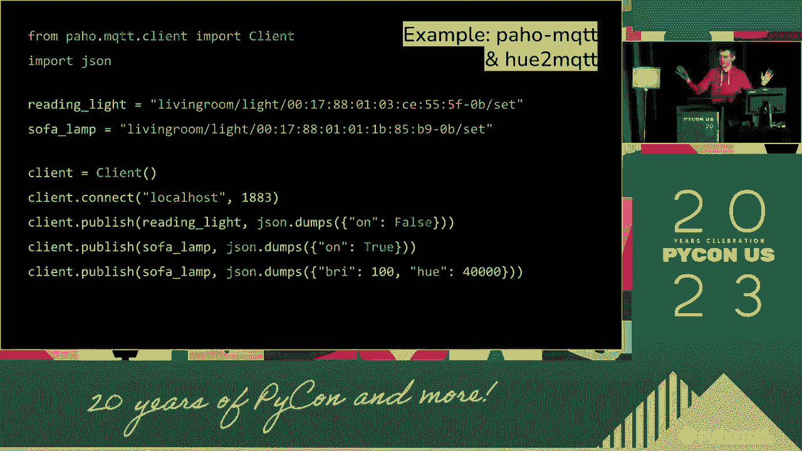

```python
import paho.mqtt.client as mqtt

# 定义回调函数
def on_connect(client, userdata, flags, rc):
    print(f"连接结果代码: {rc}")
    # 连接成功后发布消息
    client.publish("test/topic", "Hello MQTT!")

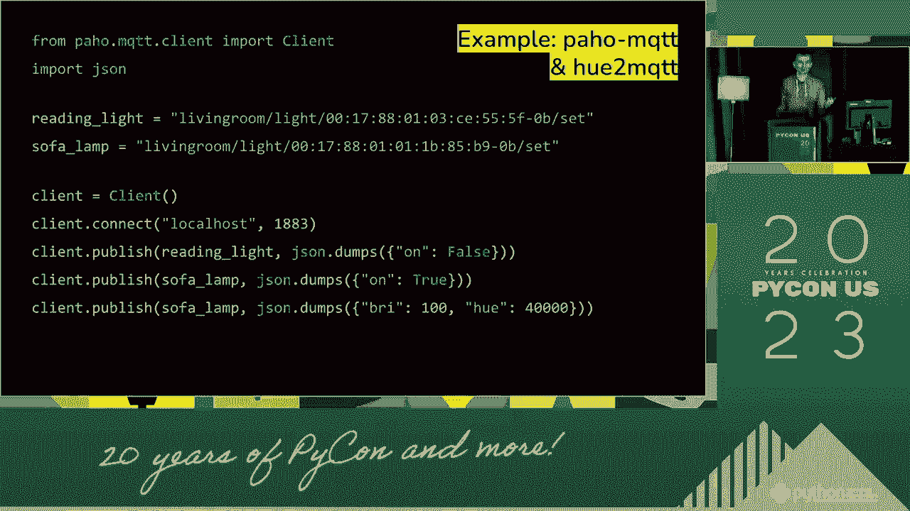

# 创建客户端实例
client = mqtt.Client()
client.on_connect = on_connect

# 连接到公共MQTT代理（例如：test.mosquitto.org）
client.connect("test.mosquitto.org", 1883, 60)

# 启动网络循环，处理通信
client.loop_forever()
```

### 订阅者示例

以下是一个订阅者代码，它订阅相同的主题并打印收到的消息。

```python
import paho.mqtt.client as mqtt

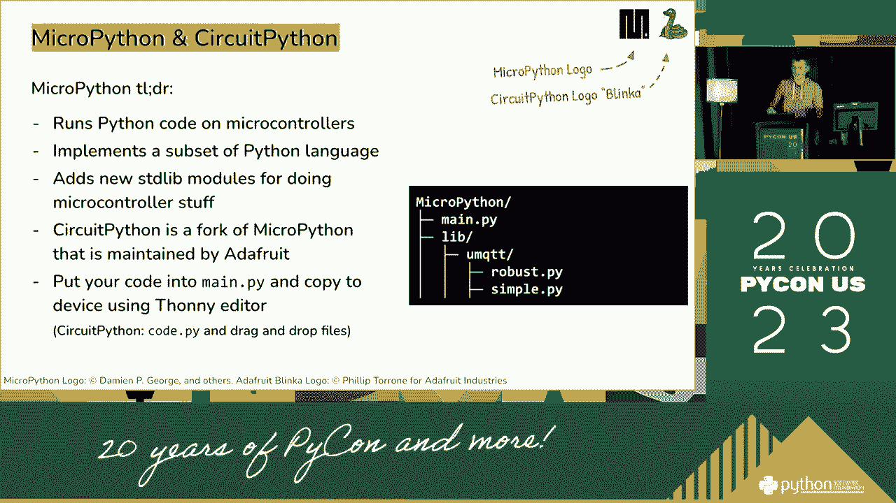

# 定义连接回调函数
def on_connect(client, userdata, flags, rc):
    print(f"连接结果代码: {rc}")
    # 连接成功后订阅主题
    client.subscribe("test/topic")

# 定义消息接收回调函数
def on_message(client, userdata, msg):
    print(f"主题: {msg.topic}, 消息: {msg.payload.decode()}")

# 创建客户端实例
client = mqtt.Client()
client.on_connect = on_connect
client.on_message = on_message

# 连接到公共MQTT代理
client.connect("test.mosquitto.org", 1883, 60)

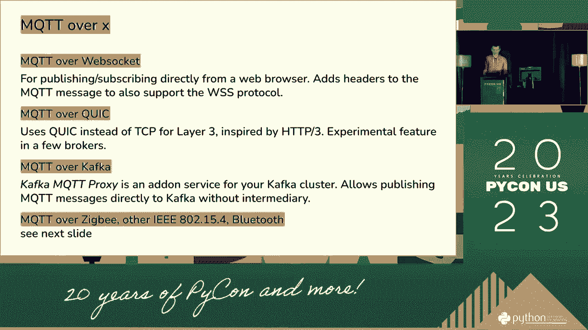

# 启动网络循环
client.loop_forever()
```

## 总结 🎯

本节课中我们一起学习了MQTT协议。我们了解到MQTT是一种基于发布/订阅模式的轻量级消息协议，核心组件包括**发布者**、**订阅者**和**代理**。消息通过**主题**进行路由，并可以通过**服务质量**等级来控制传递的可靠性。最后，我们通过Python代码示例演示了如何创建简单的MQTT发布者和订阅者客户端。掌握这些基础知识，你就可以开始构建自己的物联网或消息传递应用了。