# P43：演讲 - Josh Weissbock, Sheila Flood_ 使用 Python 帮助无家可归者 - VikingDen7 - BV1114y1o7c5

欢迎参加 Python 的最后一次演讲。

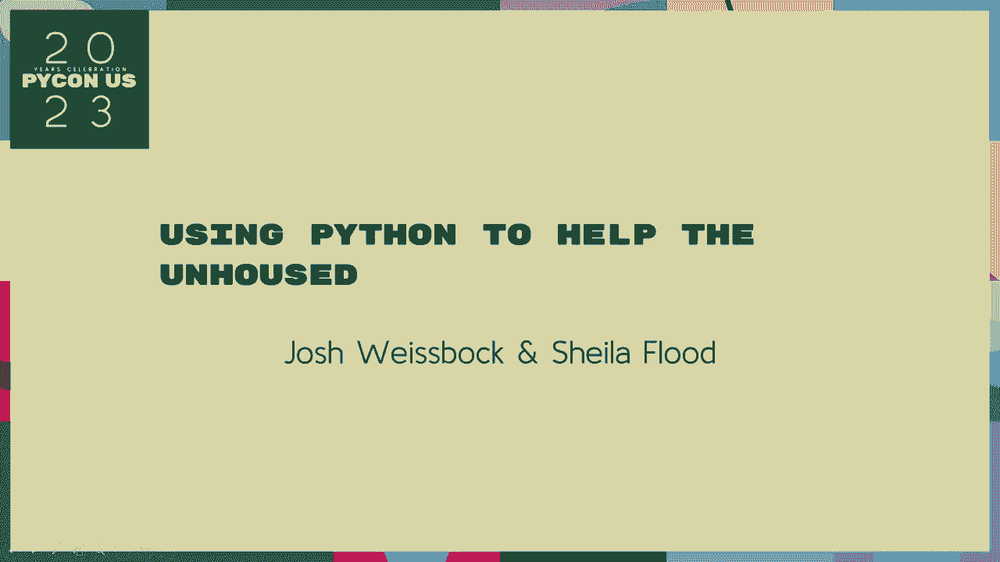

这有点像三。 你有语言。 你可以看到它。 让我们来一次热烈的掌声。 好的。 所以我们今天的最后一个演讲将使用 Python 来帮助。 由 Josh Leinbach 和 Stuart Leinbach 进行。 他们要求我们稍等几分钟。 再次讨论后，我们在走廊上保持了一种高山的氛围。

这将非常接近这里的时间结束。 好吧，请再继续一下，可以吗？

我们将在电话源周围。 请，请，请。 Python 的最后一次演讲，请。 [掌声]， 好的。 下午好。 感谢您参加我们在这里的最后一次演讲。 我今天要来作为小组成员。 我将能够和你们谈论这些。 我会跟随你。 我将能够给你一个拥抱和一个拥抱和一个拥抱。

并给你一个拥抱。 给你一个拥抱和一个拥抱和一个拥抱和一个拥抱。 我将谈论 Python。 我将谈论 Python。 这将是我们很多的经验。 我实际上来自维多利亚。 我来自伦敦市。 请，请。 我将把我的工作带给你们的社区。

我将在里面。 我将讨论大学的历史。 学位。 我将在学校的中间。 我将在学校的中间。 我将在学校的中间。 我将在学校的中间。 我将在学校的中间。

我将在学校的中间。 我将在学校的中间。 我将在学校的中间。 我将在学校的中间。 我将在学校的中间。 我将在学校的中间。 我将在学校的中间。

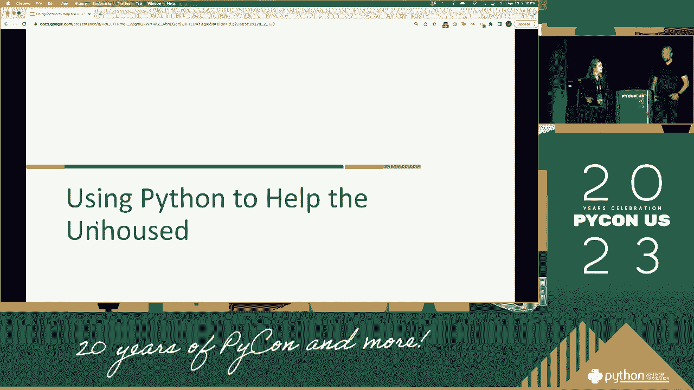

我将在学校的中间。 我将在学校的中间。 我将在学校的中间。 我将在学校的中间。 我将在学校的中间。 我将在学校的中间。 我将在学校的中间。 我将在学校的中间。

我将在学校的中间。 我将在学校的中间。 我将在学校的中间。 我将在学校的中间。 我将在学校的中间。 我将在学校的中间。 我将在学校的中间。 我将在学校的中间。

我将在学校的中间。

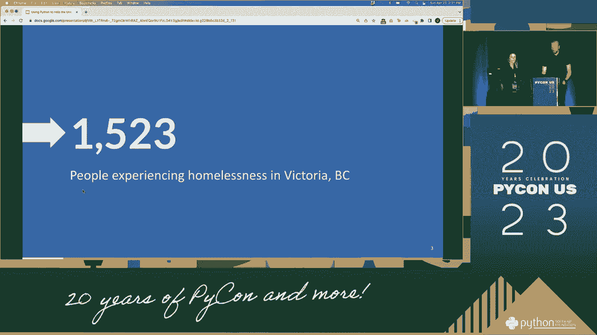

我将要在学校的中间。我将要在学校的中间。我将要在学校的中间。我将要在学校的中间。我将要在学校的中间。我将要在学校的中间。我将要在学校的中间。我们试图帮助一个在学校的人。

在古老的时代，我们需要成长为政治问题。我们看到他们在项目方面所知道的。他们实际上必须成长为政治问题。我想要在学校的中间。我想要在学校的中间。我们必须在学校的中间。我们必须在学校的中间。

我们试图帮助其中一所学校。我们必须在学校的中间。我们必须在学校的中间。我们必须在学校的中间。我们必须在学校的中间。我们必须在学校的中间。我们必须在学校的中间。我们必须在学校的中间。

我们必须在学校的中间。我们必须在学校的中间。我们必须在学校的中间。我们必须在学校的中间。我们必须在学校的中间。我们必须在学校的中间。我们必须在学校的中间。我们必须在学校的中间。

我们必须在学校的中间。我们必须在学校的中间。我们必须在学校的中间。我们必须在学校的中间。我们必须在学校的中间。我们必须在学校的中间。我们必须在学校的中间。我们必须在学校的中间。

我们必须在学校的中间。我们必须在学校的中间。我们必须在学校的中间。我们必须在学校的中间。我们必须在学校的中间。我们必须在学校的中间。我们必须在学校的中间。我们必须在学校的中间。

我们必须在学校的中间。我们必须在学校的中间。我们必须在学校的中间。我们必须在学校的中间。我们必须在学校的中间。我们必须在学校的中间。我们必须在学校的中间。我们必须在学校的中间。

我们必须在学校的中间。我们必须在学校的中间。我们必须在学校的中间。我们必须在学校的中间。我们必须在学校的中间。我们必须在学校的中间。我们必须在学校的中间。我们必须在学校的中间。

我们必须在学校的中心。我们必须在学校的中心。我们必须在学校的中心。我们必须在学校的中心。我们必须在学校的中心。我们必须在学校的中心。我们必须在学校的中心。我们必须在学校的中心。

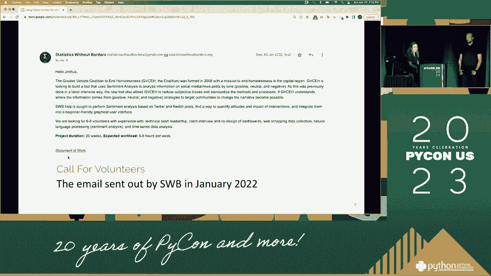

我们必须在学校的中心。我们必须在学校的中心。我们也知道整个学校没有希望。我们也知道整个学校没有希望。我们也知道整个学校没有希望。

我们也知道整个学校没有希望。

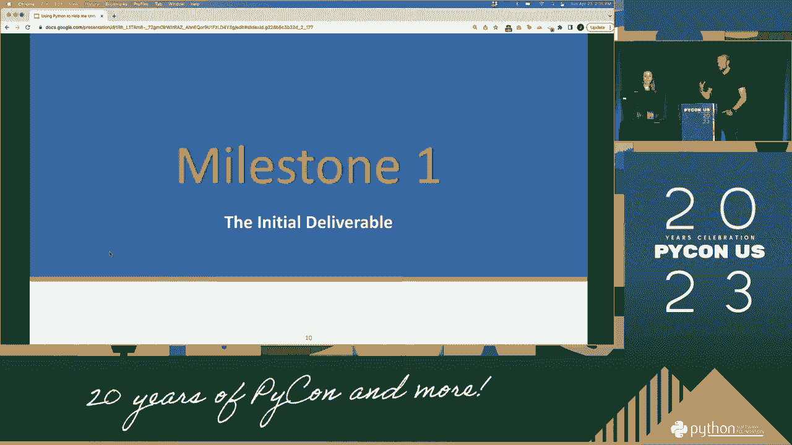

我们必须在学校的中心。我们必须在学校的中心。我们必须在学校的中心。我们必须在学校的中心。我们必须在学校的中心。我们必须在学校的中心。我们必须在学校的中心。我们必须在学校的中心。

我们必须在学校的中心。我们必须在学校的中心。我们必须在学校的中心。我们必须在学校的中心。我们必须在学校的中心。我们必须在学校的中心。我们必须在学校的中心。我们必须在学校的中心。

我们必须在学校的中心。我们必须在学校的中心。我们必须在学校的中心。我们必须在学校的中心。我们必须在学校的中心。我们必须在学校的中心。我们必须在学校的中心。我们必须在学校的中心。

第二部分是与证据相关的文字，涉及人们找不到可以让警察拘留的东西。我们听到警察说他们是警察。我们必须在学校的中心。我们必须在学校的中心。我们必须在学校的中心。作为一篇论文，它在同一层面上并不困难。我们必须在学校的中心。

我们必须在学校的中心。我们必须在学校的中心。我们甚至还在努力帮助人们走出学校的中心。我们必须在学校的中心。我们必须在学校的中心。我们必须在学校的中心。我们必须在学校的中心。

我们必须在学校的中心。我们必须在学校的中心。我们必须在学校的中心。我们必须在学校的中心。我们必须在学校的中心。我们必须在学校的中心。我们必须在学校的中心。我们必须在学校的中心。

我们必须处于学校的中心。我们必须处于学校的中心。我们必须处于学校的中心。我们必须处于学校的中心。我们必须处于学校的中心。我们必须处于学校的中心。我们必须处于学校的中心。我们必须处于学校的中心。

我们必须处于学校的中心。我们必须处于学校的中心。我们必须处于学校的中心。我们必须处于学校的中心。我们必须处于学校的中心。我们必须处于学校的中心。我们必须处于学校的中心。我们必须处于学校的中心。

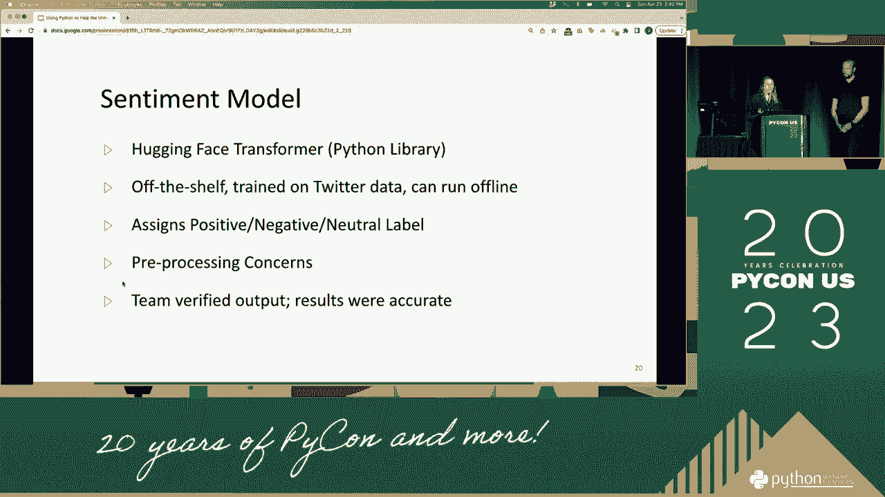

我们必须处于学校的中心。

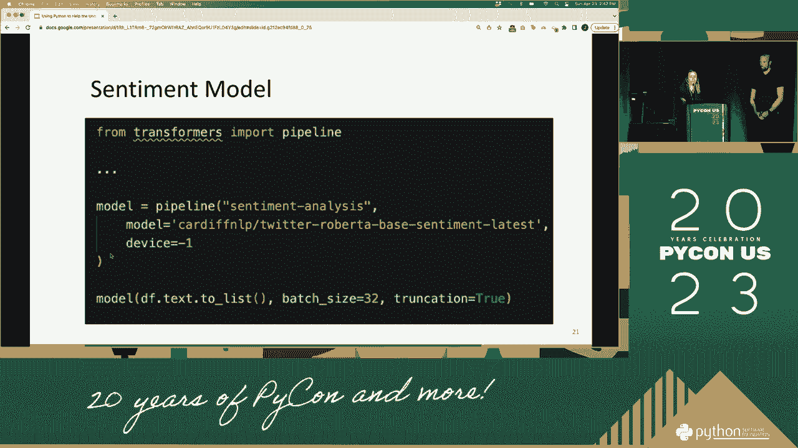

我们必须处于学校的中心。我们必须处于学校的中心。我们必须处于学校的中心。我们必须处于学校的中心。我们必须处于学校的中心。我们必须处于学校的中心。我们必须处于学校的中心。我们必须处于学校的中心。

我们必须处于学校的中心。我们必须处于学校的中心。我们必须处于学校的中心。我们必须处于学校的中心。我们必须处于学校的中心。我们必须处于学校的中心。我们必须处于学校的中心。我们必须处于学校的中心。

我们必须处于学校的中心。我们必须处于学校的中心。我们必须处于学校的中心。我们必须处于学校的中心。我们必须处于学校的中心。我们必须处于学校的中心。我们必须处于学校的中心。我们必须处于学校的中心。

我们必须处于学校的中心。我们必须处于学校的中心。

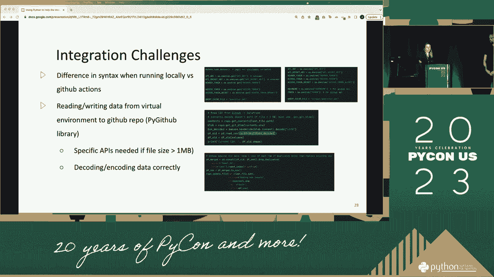

我们必须处于学校的中心。我们必须处于学校的中心。我们必须处于学校的中心。

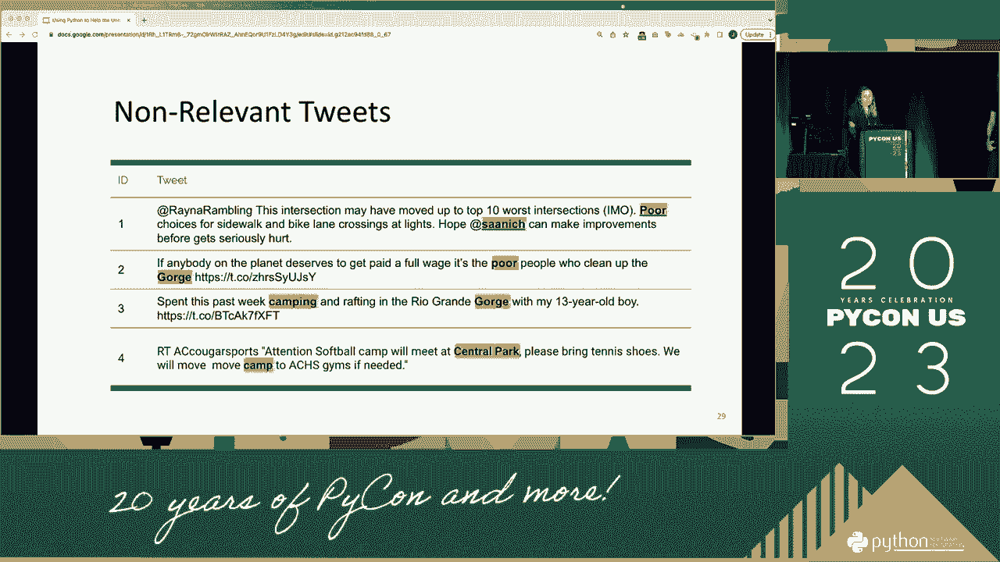

我们必须处于学校的中心。

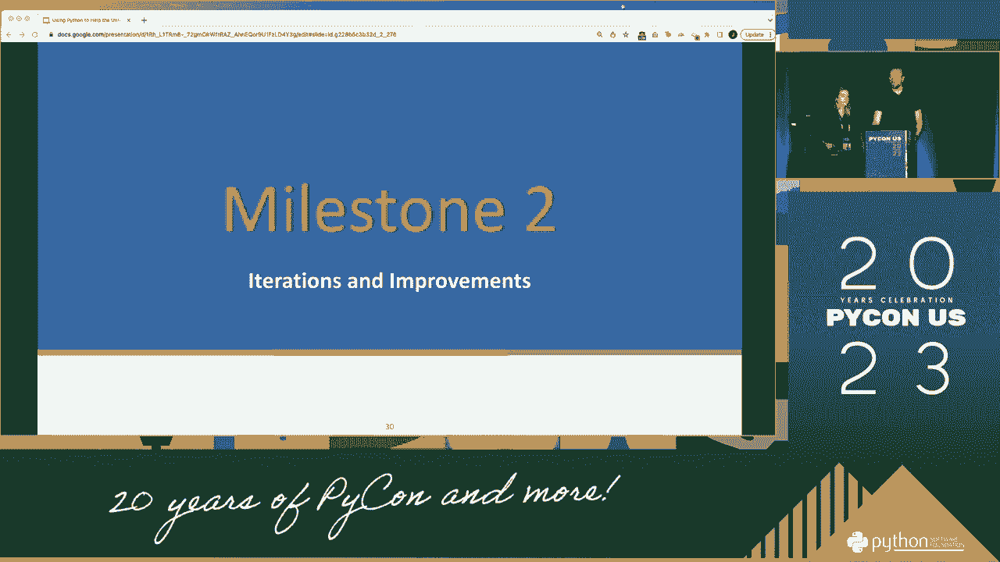

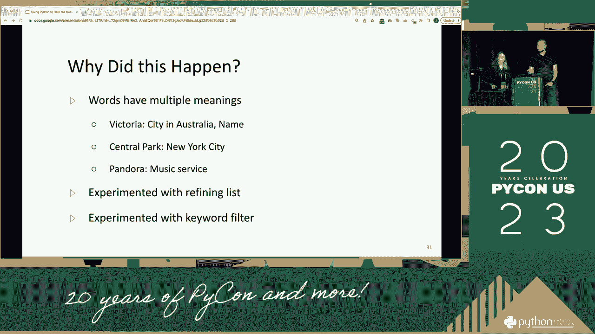

你与校园的通信。
