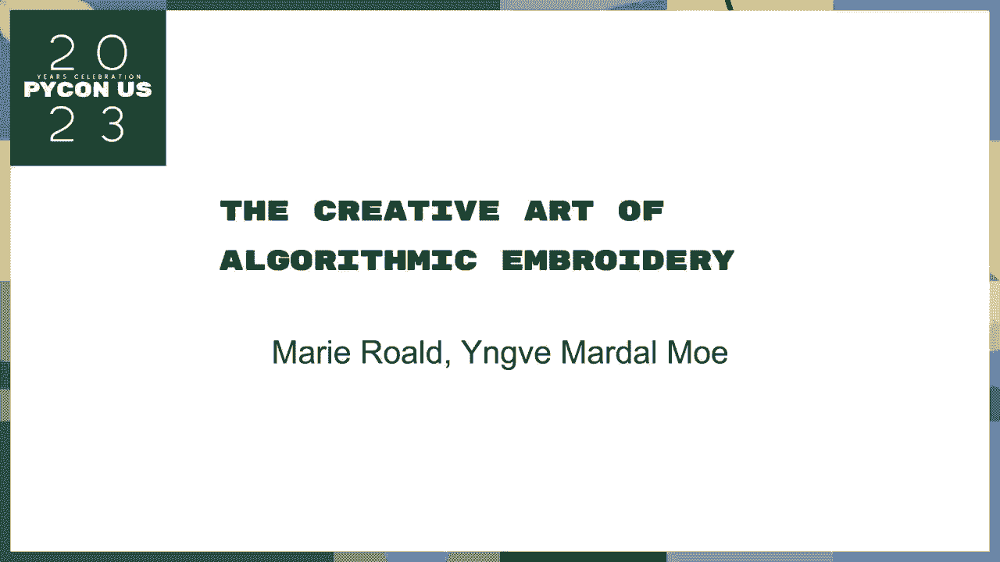
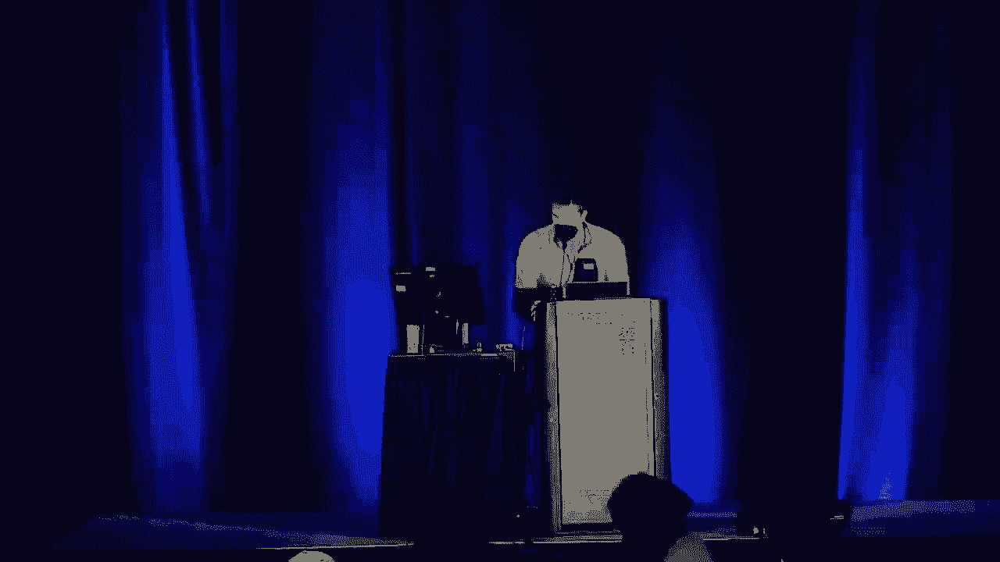
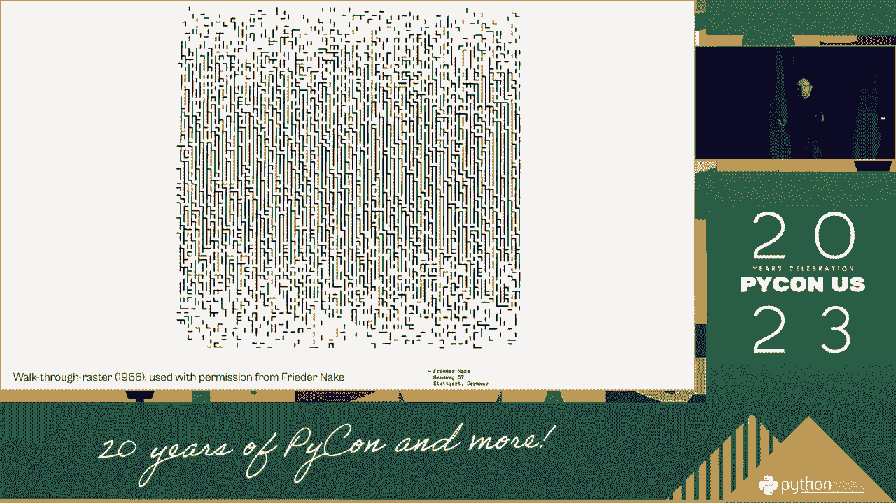
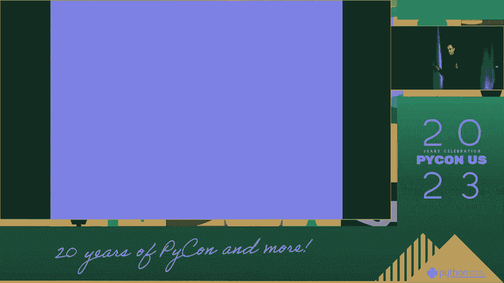
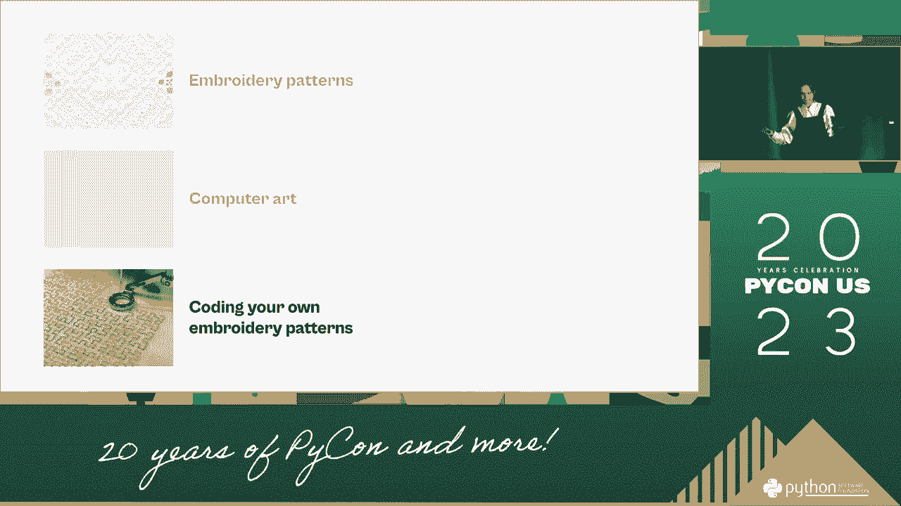
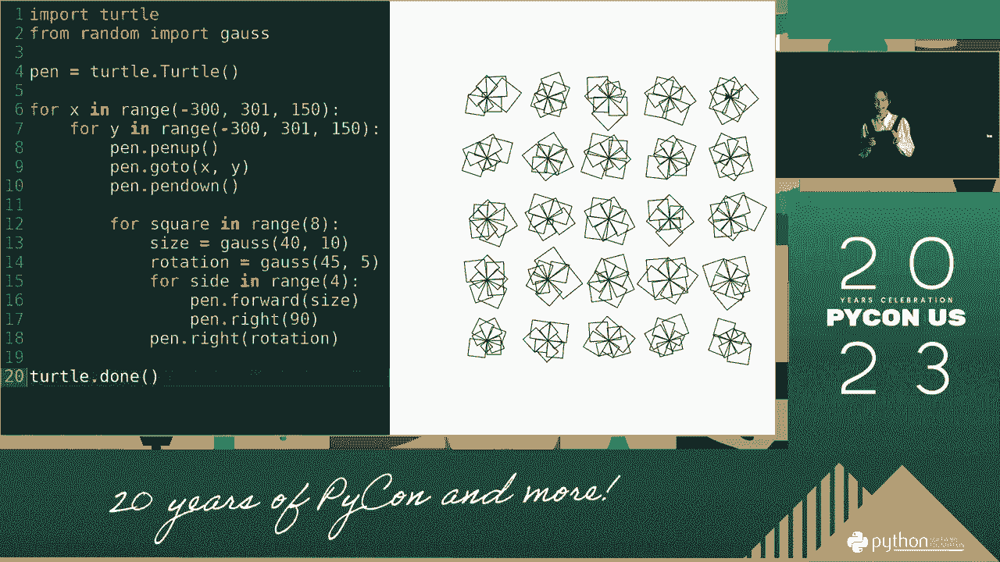
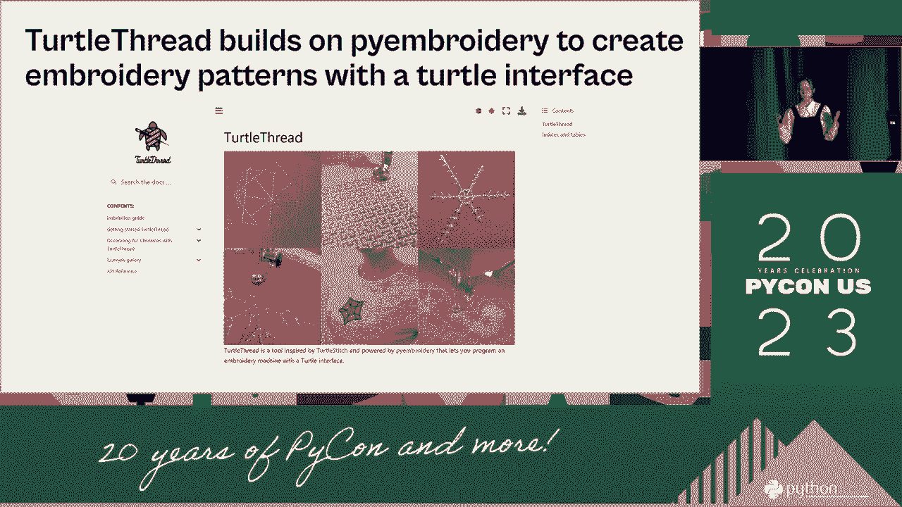
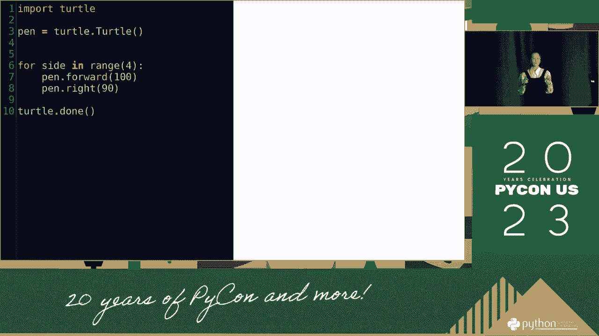
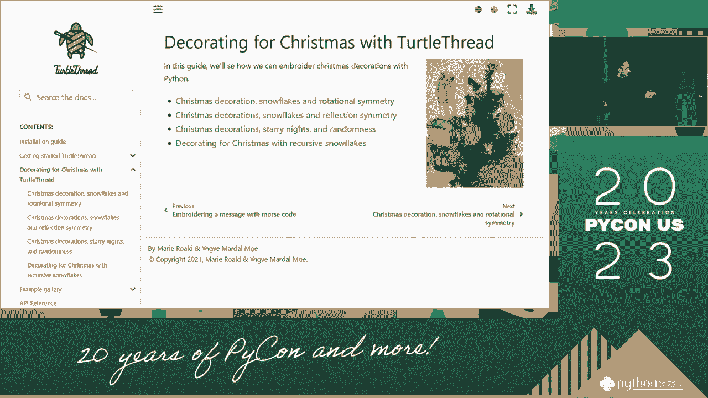

# P49：讨论 - 玛丽·罗阿德，英维·马达尔·莫 _ 算法刺绣的创造性艺术 - VikingDen7 - BV1114y1o7c5

欢迎大家回到我们的最后一节课。这是我们要在世界上讨论的精彩内容。

也许我和我们谈到了创造艺术和算法。

环境。你们在那种情况下听起来如何？当你谈论时，我们是我想拥抱的人。我想知道全球概念和社区艺术之间的联系是什么，以及你如何在代码中输入多样化的话题，以一种超过五人以上的方式来表达善意和支持。

天哪，这是一种游戏艺术。我们用上了我们的三个问题。事实上，一个球可以成为一种发展。我们能够创造一个新世界。实际上，我们能够创造一个新世界。人们谈论创造这样的东西，我们喜欢。但我们开始感到有点被拖累，所有事情对我们来说都变得如此困难。

所以我们开始着眼于编码过程。它在哪里找到？

所以我们越来越高兴找到一个游戏来使用我们的编码代码，因为这是一个新的三角形，把我们从城市中拉出来。当我们了解到这个建筑时，它是通过一个新程序跟进的，我们感到越来越高兴。这是关于学习建筑本身的重要部分的形式。在计算机艺术中，你认为所有的学习都发生在使用其输入代码时。

所以我们这次只分享一点，然后，所有的一切。下一张幻灯片。让我们谈谈转换。那么编程的文章是什么？

你要确保它比编程过程更好。首先是新的。你可以用这个来保持流程向前。这也是一个复杂的算法。这是一个简单的比赛建筑书。在我们的思维碰撞中，我曾以为你是一个特定的机构。这是一个竞争话题，意味着你是特定的，你在讨论。

特殊是普通人在思考简单几何图形时的表现，这通常是一个标志性案例。或者是一个团队在复杂竞争中脱颖而出。传统是通过一对力量和成本组织而成的。如果你看这个主题，它由这两部分组成，基于世界的事物。

黑色工作是一个常见的部分，在这里，只是朋友们，如果你简单地做一个白色凭证，它会花你一些时间。现在，它来自德国 5700，穆斯林人口普遍停留在这里。而且在英国律师中非常受欢迎。“女士年”的标题部分被写成了“先生的书”的工作。

如果你提出这个项目，你可以产生那个。你进入的另一种政治类型是“女士城镇”或“Nuriki 白色作品”。这是一个非常著名或受欢迎的人物。它一直是同一类政治，最著名的。最著名，最著名，最著名，在挪威。

我们有时称之为“seidur”，但它在世界各地都存在，就像这里一样。只是在发展中出现。我们在这里看到的是，我们考虑的是我们能在全人类中看到的内容。我们认为这充满希望，我们作为程序员对此非常熟悉。这也非常暴力和变异。在其他情况下。

我们需要欢迎编程进入环境。环境也与变异有关，世界也与“女士城镇”相关，而“女士城镇”也与“女士城镇”和“Nuriki 白色作品”相关。最终的概念程序是递归。这是在痛苦下的任何分裂和文化算法。起源也有参与。我们对刺绣很感兴趣。

但我们只是处于这个国家的另一边，那里一点也没有刺激。尤其是一个边界平台。我们对国家的新希望和叙述非常清晰。在这次演讲中，它由更小的话题构成，它们又由更小的话题构成。现在，这只是头部俱乐部的唯一小结构。

整件事与仍在发生的许多人相关。现在。我们只是好奇地观察事物。如果你对任何进入同一实验室的事情感兴趣，那么这是我们推荐的最令人印象深刻的事。而且值得一提的是，在仅有的伟大文学中，微量的刺绣结构也值得关注。

世界上有如此多的精神档案，遍布全球。今天我们可能可以谈论几乎所有事情。因此我们看到的是，我们可以找到一个编程过程。人们在讨论如何让事物看起来像编程，这并不是一种需求。

这是一个问题，但我们十年前就有了，而它并不是根据我们其他计算机艺术家的任何标准创建的。如果我参与其中或考虑艺术，我并没有今天的相同概念。这是一种制作方式。因为我把代码转化为一张空白卡片，转化为一本日记，这样它可以带来新的体验，一种纸板或纸张。

而且我们不能忽视我们的工作。它在更网络化的环境之间建立。我通过一种只在重复中使用的微模式带来了它。这几乎是两件事的方式。就像过期了一样，由当前和数据钳制组成。为此，我取样。通过构建软件或沙砾的重建。

它只提供了一个特定的环境来创造这个，所以这真的是配置部分。继续打开，只是创造这个工作的特定环境。将会在邻近部分周围形成更多的线，因为这就像一个演示。现在。这个特别麻烦的制作，所以即使这四行。

这个想法在许多实体咖啡项目中。

买一个外壳，然后添加一个外壳，和第一个。制作这个作品要容易得多。所以，纸制品的一个特定声明。如果这不是纸质公式。

[沉默]，我真的很喜欢这个。这是非常具体的，它是为此构建的。人们能够创造出由不同的人制作的东西。它与这里到这里的工作非常相似。现在。我们所看到的正是我们在随机中观察各个部分。

创建纸制品和纸制品的过程。还有另一个编程问题。我们无法整合一个产品，这个问题是重复的。要创造其他东西。这里我们可以放弃我的系统，这是一种提议。这个特定的线性化可以使更多的多样性仅仅相似。现在，再次。

我们只是好奇并且容易说。如果你想了解更多关于创造性编码的信息。如果你是一位计算机艺术家，你仍然处于顶端，那么你仍然处于顶端。你仍然处于顶端，你仍然处于顶端，而且你非常，非常有动力。所以。我们可以找到一些我们无法整合的东西。现在，我们可以创建一个人的每个参数。但。

我们相信关于建筑本身的是，我们不能做到这一点。

我们可以创造一条简单的创造力。继续并备份。我们可以在这里使用建筑线，所以我们从重要的思考开始。所以，在线。我们首先创建一个原型，然后叫这个产品。所以。前瞻性思维与熟悉这个产品的人数。

然后我们就创建了一个产品。现在我们将继续叫标题。如果你有几分钟，我们会完成最后期限，所以我们会进入未来。好吧，下一个，我会去下一个，然后我们会运行这段代码。所以。我们可以快速列出我的一行，然后我们可以迅速，但我们可以。

我们可以通过广播真正完成它，我们可以开启一系列问题。所以。让我们使用这个应用程序。然后我们可以提供一些创作的线，通过未来。这样我们可以。我们也可以继续叫这个产品。我们会继续叫这个产品。我们会继续叫这个产品。

我们将继续称这个产品。我们将继续称这个产品。我们将继续称这个产品。我们将继续称这个产品。我们将继续称这个产品。我们将继续称这个产品。我们将继续称这个产品。我们将继续称这个产品。

我们将继续称这个产品。我们将继续称这个产品。我们将继续称这个产品。我们将继续称这个产品。我们将继续称这个产品。我们将继续称这个产品。我们将继续称这个产品。我们将继续称这个产品。

我们将继续称这个产品。我们将继续称这个产品。我们将继续称这个产品。我们将继续称这个产品。我们将继续称这个产品。我们将继续称这个产品。我们将继续称这个产品。我们将继续称这个产品。

我们将继续称这个产品。我们将继续称这个产品。我们将继续称这个产品。我们将继续称这个产品。我们将继续称这个产品。我们将继续称这个产品。我们将继续称这个产品。我们将继续称这个产品。

我们将继续称这个产品。我们将继续称这个产品。我们将继续称这个产品。我们将继续称这个产品。我们将继续称这个产品。我们将继续称这个产品。我们将继续称这个产品。我们将继续称这个产品。

我们将继续称这个产品。我们将继续称这个产品。我们将继续称这个产品。我们将继续称这个产品。我们将继续称这个产品。我们将继续称这个产品。我们将继续称这个产品。我们将能够用我们的空虚画一个圈。

所以我们需要给它 4。0。我们需要用我们的空虚画一个圈。我们需要用我们的空虚画一个圈。所以我们需要用我们的空虚画一个圈。我们需要用我们的空虚画一个圈。我们让我们做一点这个东西。所以我们可以用我们的空虚画一个圈。

我们可以用我们的空虚画一个圈。我们可以用我们的空虚画一个圈。我们还会做一点这个东西。所以我们可以用我们的空虚画一个圈。我们会用我们的空虚画一个圈。所以我们可以用我们的空虚画一个圈。我们可以用我们的空虚画一个圈。我们可以用我们的空虚画一个圈。

我们可以用我们的空虚画一个圈。我们可以用我们的空虚画一个圈。比如说，通过邀请他们参加派对。这是我例子中的一个很好的问题。我们做了一些选项。我们发现了一些这个。我们可以用我们的空虚画一个圈。我们可以用我们的空虚画一个圈。

我们可以画一个空心的圈。所以我们可以画一个空心的圈。我们可以画一个空心的圈。我们可以画一个空心的圈。我们可以画一个空心的圈。我们可以画一个空心的圈。我们可以画一个空心的圈。我们可以画一个空心的圈。

然后我们可以画一个空心的圈。我们可以画一个空心的圈。我们可以画一个空心的圈。我们可以画一个空心的圈。我们可以画一个空心的圈。我们可以画一个空心的圈。我们可以画一个空心的圈。我们可以画一个空心的圈。

所以我们可以创造，我们可以在转动的瞬间编码。但是我们可以在这个领域里画一个空心的方形。然后从中进入场的源头。

然后我们可以在这个领域里画一个空心的圈。我们可以画一个空心的圈。然后我们可以画一个空心的圈。但是我们可以画一个空心的圈。然后我们可以在里面画一个空心的圈。张开你的嘴。你可以看到在你的空心圈里还有一个圈。

所以我们可以在这个领域里画一个空心的圈。然后我们可以画一个空心的圈。然后我们可以画一个空心的圈。然后我们可以画一个空心的圈。然后我们可以画一个空心的圈。然后我们可以画一个空心的圈。然后我们可以在这个领域里画一个空心的圈。最后。

我们可以画一个空心的圈。然后我们可以在这个领域里画一个空心的圈。然后我们可以在这个领域里画一个空心的圈。然后我们可以在这个领域里画一个空心的圈。然后我们可以在这个领域里画一个空心的圈。

然后我们可以在这个领域里画一个空心的圈。然后我们可以在这个领域里画一个空心的圈。然后我们可以在这个领域里画一个空心的圈。然后我们可以在这个领域里画一个空心的圈。然后我们可以在这个领域里画一个空心的圈。然后我们可以在这个领域里画一个空心的圈。然后我们可以在这个领域里画一个空心的圈。然后我们可以在这个领域里画一个空心的圈。

然后我们可以在这个领域里画一个空心的圈。然后我们可以在这个领域里画一个空心的圈。然后我们可以在这个领域里画一个空心的圈。然后我们可以在这个领域里画一个空心的圈。然后我们可以在这个领域里画一个空心的圈。然后我们可以在这个领域里画一个空心的圈。然后我们可以在这个领域里画一个空心的圈。然后我们可以在这个领域里画一个空心的圈。

然后我们可以在田野中用我们的空洞画一个圈。然后我们可以在田野中用我们的空洞画一个圈。然后我们可以在田野中用我们的空洞画一个圈。然后我们可以在田野中用我们的空洞画一个圈。然后我们可以在田野中用我们的空洞画一个圈。然后我们可以在田野中用我们的空洞画一个圈。然后我们可以在田野中用我们的空洞画一个圈。然后我们可以在田野中用我们的空洞画一个圈。

然后我们可以在田野中用我们的空洞画一个圈。然后我们可以在田野中用我们的空洞画一个圈。然后我们可以在田野中用我们的空洞画一个圈。然后我们可以在田野中用我们的空洞画一个圈。然后我们可以在田野中用我们的空洞画一个圈。然后我们可以在田野中用我们的空洞画一个圈。然后我们可以在田野中用我们的空洞画一个圈。然后我们可以在田野中用我们的空洞画一个圈。

然后我们可以在田野中用我们的空洞画一个圈。然后我们可以在田野中用我们的空洞画一个圈。然后我们可以在田野中用我们的空洞画一个圈。然后我们可以在田野中用我们的空洞画一个圈。然后我们可以在田野中用我们的空洞画一个圈。然后我们可以在田野中用我们的空洞画一个圈。然后我们可以在田野中用我们的空洞画一个圈。然后我们可以在田野中用我们的空洞画一个圈。

然后我们可以在田野中用我们的空洞画一个圈。然后我们可以在田野中用我们的空洞画一个圈。然后我们可以在田野中用我们的空洞画一个圈。然后我们可以在田野中用我们的空洞画一个圈。然后我们可以在田野中用我们的空洞画一个圈。然后我们可以在田野中用我们的空洞画一个圈。然后我们可以在田野中用我们的空洞画一个圈。然后我们可以在田野中用我们的空洞画一个圈。

然后我们可以在田野中用我们的空洞画一个圈。然后我们可以在田野中用我们的空洞画一个圈。然后我们可以在田野中用我们的空洞画一个圈。然后我们可以在田野中用我们的空洞画一个圈。然后我们可以在田野中用我们的空洞画一个圈。然后我们可以在田野中用我们的空洞画一个圈。然后我们可以在田野中用我们的空洞画一个圈。然后我们可以在田野中用我们的空洞画一个圈。

然后我们可以在田野中用我们的空洞画一个圈。然后我们可以在田野中用我们的空洞画一个圈。然后我们可以在田野中用我们的空洞画一个圈。然后我们可以在田野中用我们的空洞画一个圈。然后我们可以在田野中用我们的空洞画一个圈。然后我们可以在田野中用我们的空洞画一个圈。然后我们可以在田野中用我们的空洞画一个圈。然后我们可以在田野中用我们的空洞画一个圈。

然后我们可以在田野中用我们的空洞画一个圈。

然后我们可以在田野中用我们的空虚画一个圈。然后我们可以在田野中用我们的空虚画一个圈。然后我们可以在田野中用我们的空虚画一个圈。然后我们可以在田野中用我们的空虚画一个圈。然后我们可以在田野中用我们的空虚画一个圈。我们可以在田野中用我们的空虚画一个圈。我们可以在田野中用我们的空虚画一个圈。然后我们可以在田野中用我们的空虚画一个圈。然后我们可以在田野中用我们的空虚画一个圈。

然后我们可以在田野中用我们的空虚画一个圈。然后我们可以在田野中用我们的空虚画一个圈。然后我们可以在田野中用我们的空虚画一个圈。然后我们可以在田野中用我们的空虚画一个圈。然后我们可以在田野中用我们的空虚画一个圈。然后我们可以在田野中用我们的空虚画一个圈。然后我们可以在田野中用我们的空虚画一个圈。然后我们可以在田野中用我们的空虚画一个圈。

然后我们可以在田野中用我们的空虚画一个圈。然后我们可以在田野中用我们的空虚画一个圈。然后我们可以在田野中用我们的空虚画一个圈。然后我们可以在田野中用我们的空虚画一个圈。（键盘敲击），[ 暂停 ]。
