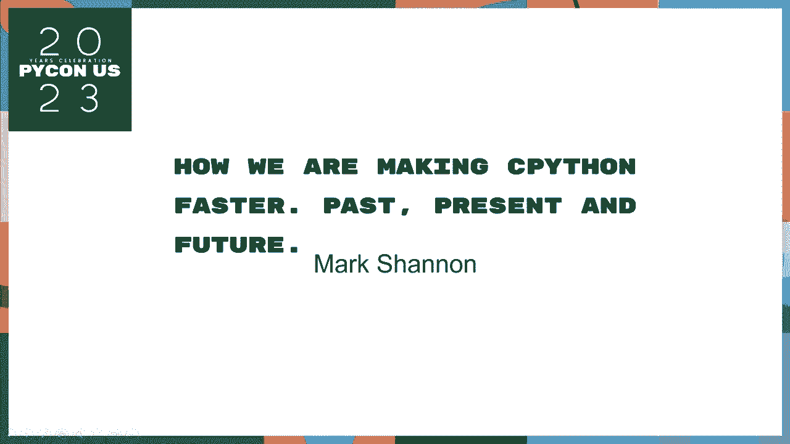
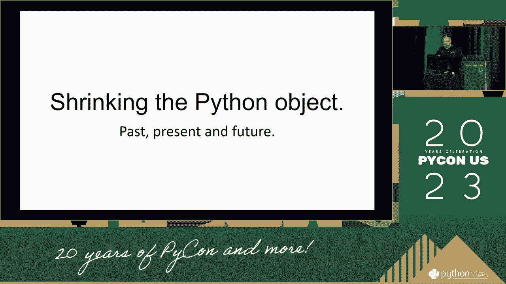
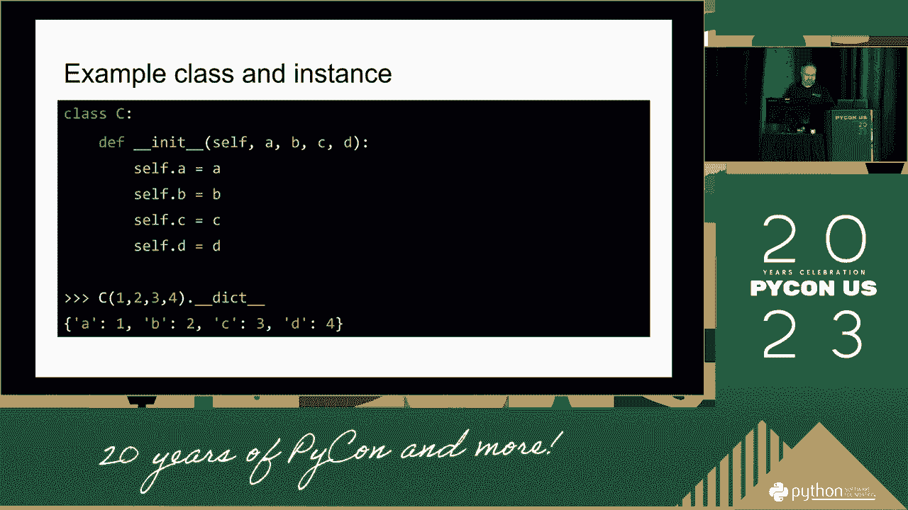
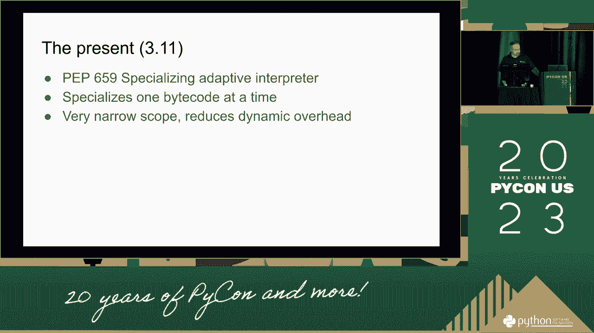
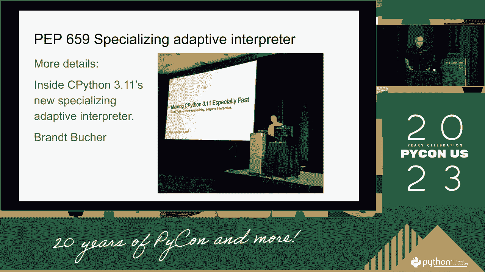
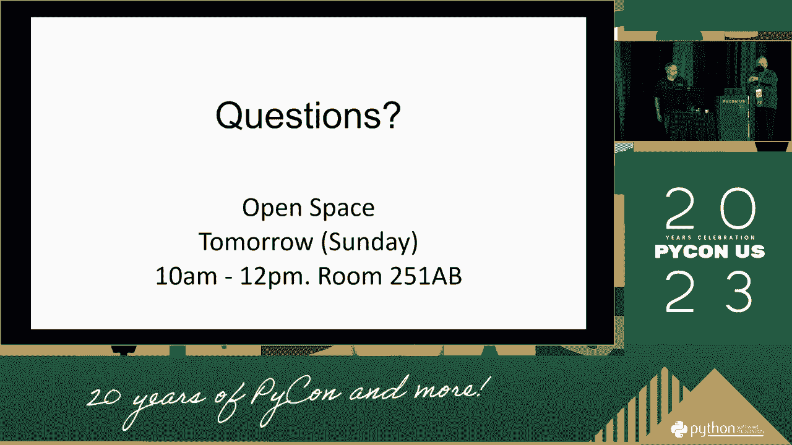
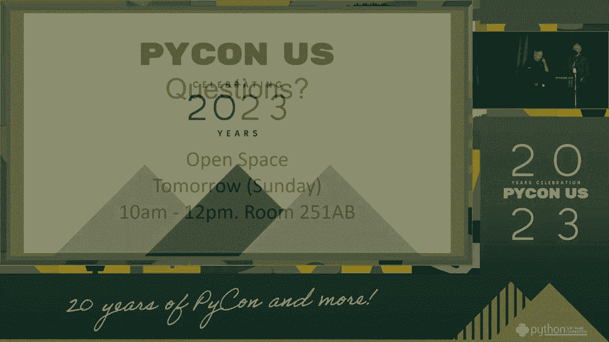

# P51：谈话 - 马克·香农 _ 我们如何让 CPython 更快。过去，现在和未来 - VikingDen7 - BV1114y1o7c5

这不是一个很好的时间，你知道吗，可能的次数越多，对呀，所以只是一部分，我的工作必须达到，那是件事，哈哈哈，目标。

从来没有，马上就要，只是不要给，第一个，我去叫其他人，一张印刷品，所以你。

你在看这个。

没关系，我们不必，那是个问题，这是一个点，我们得到了，如何。

