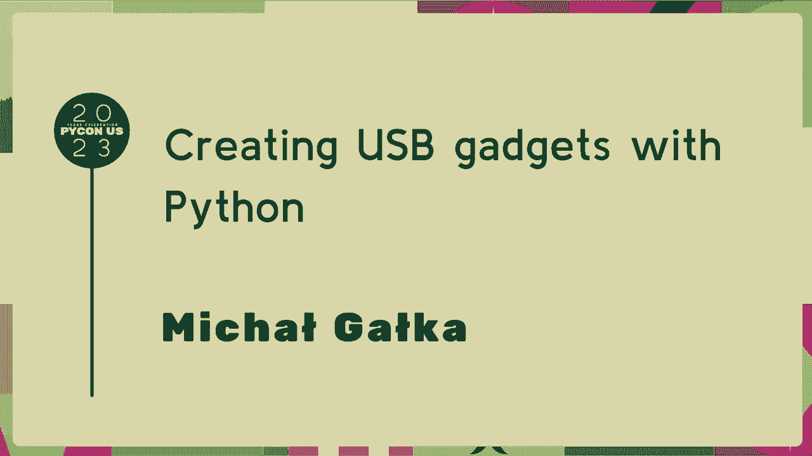
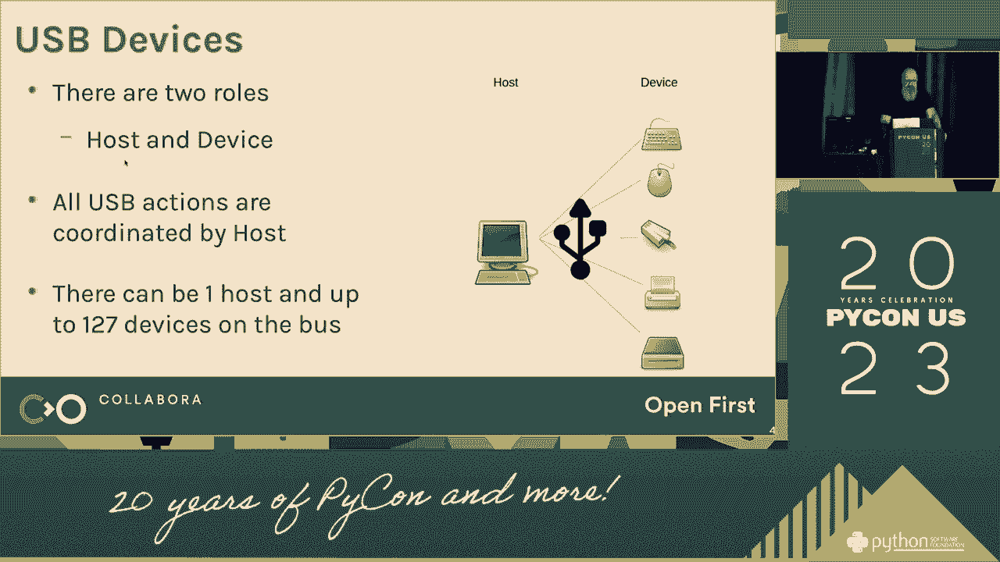
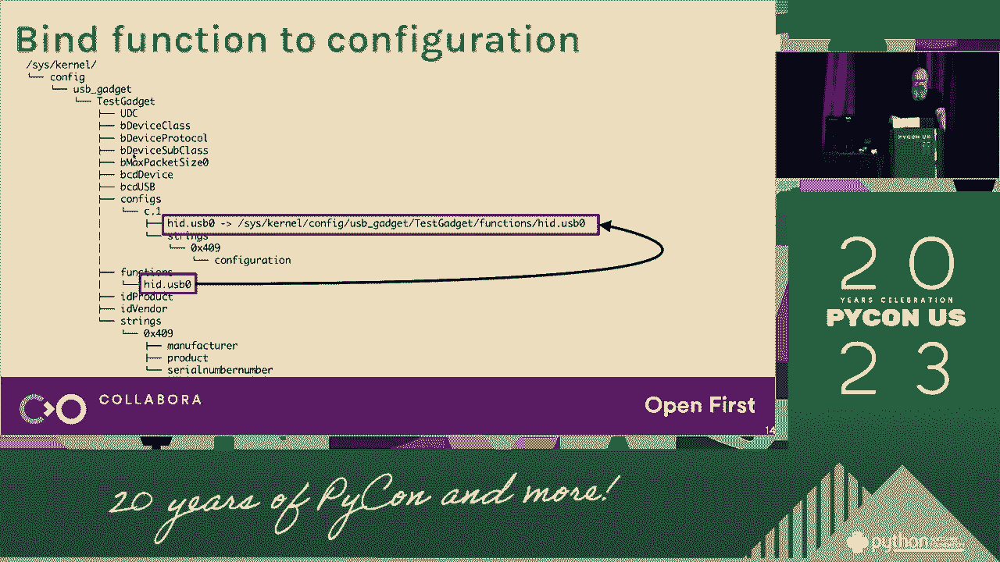
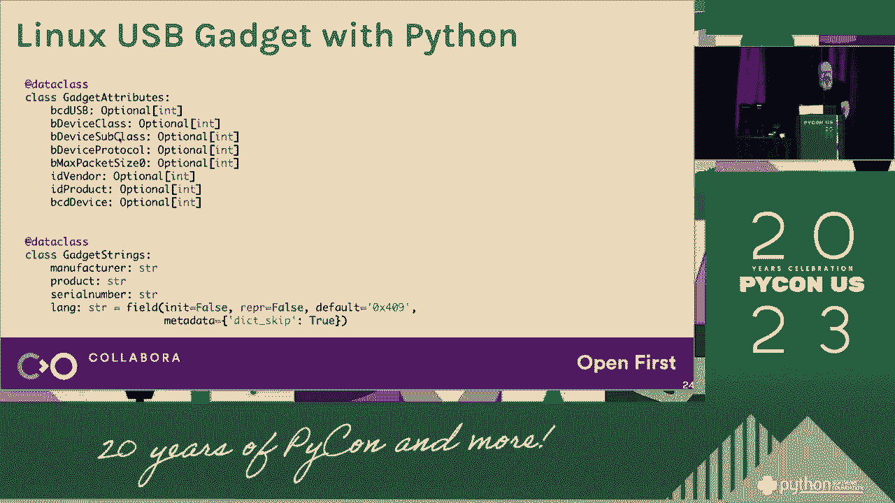
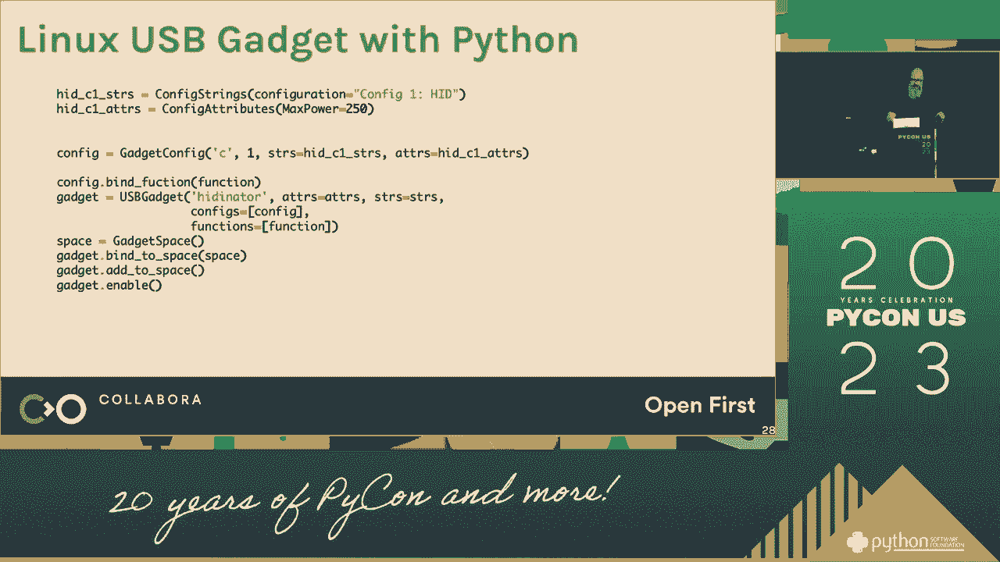
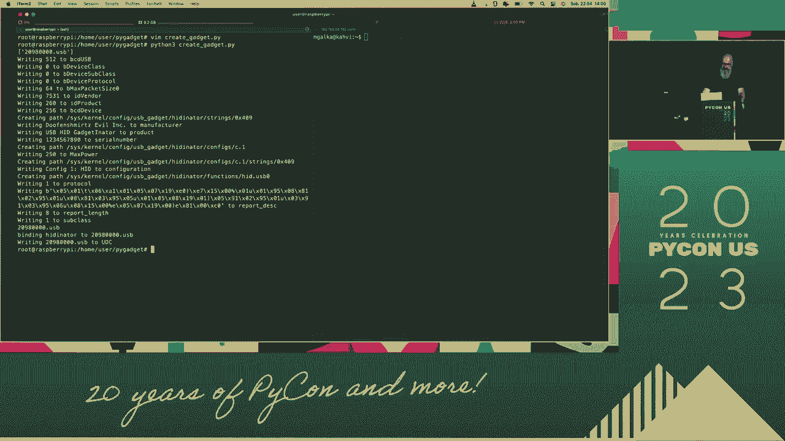
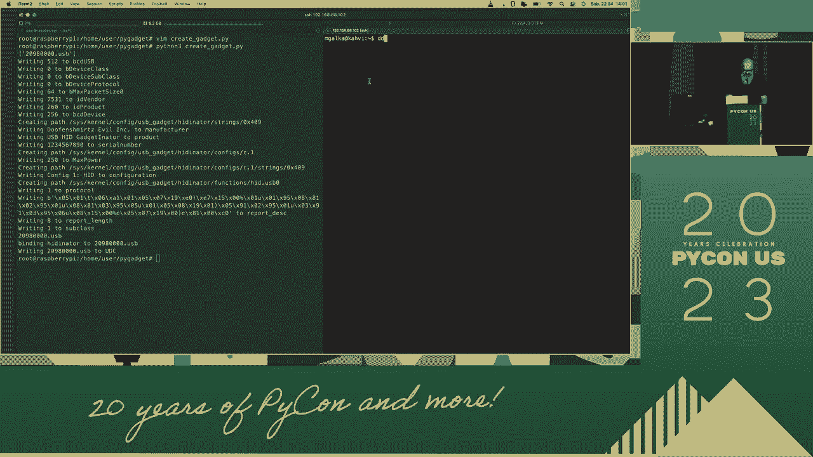
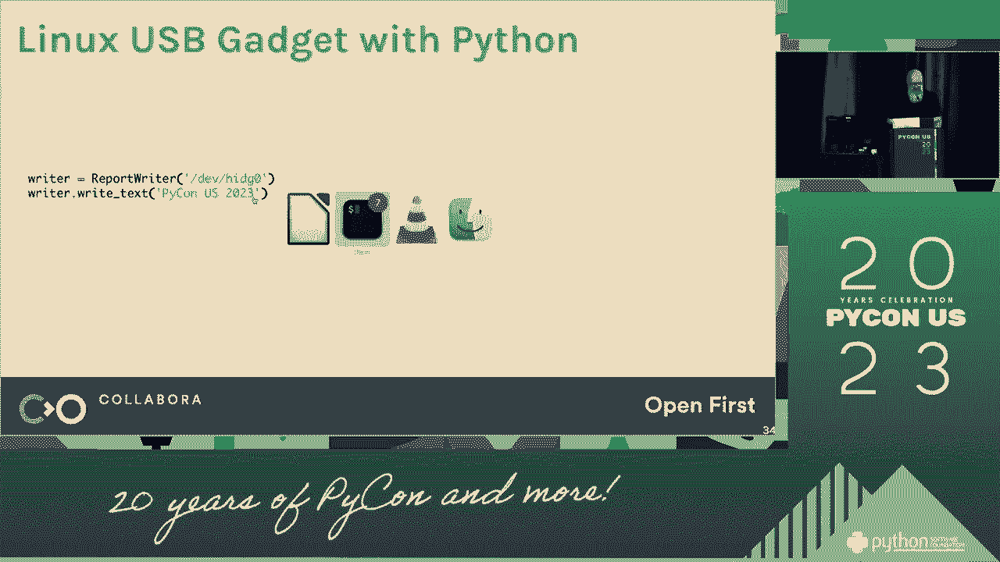
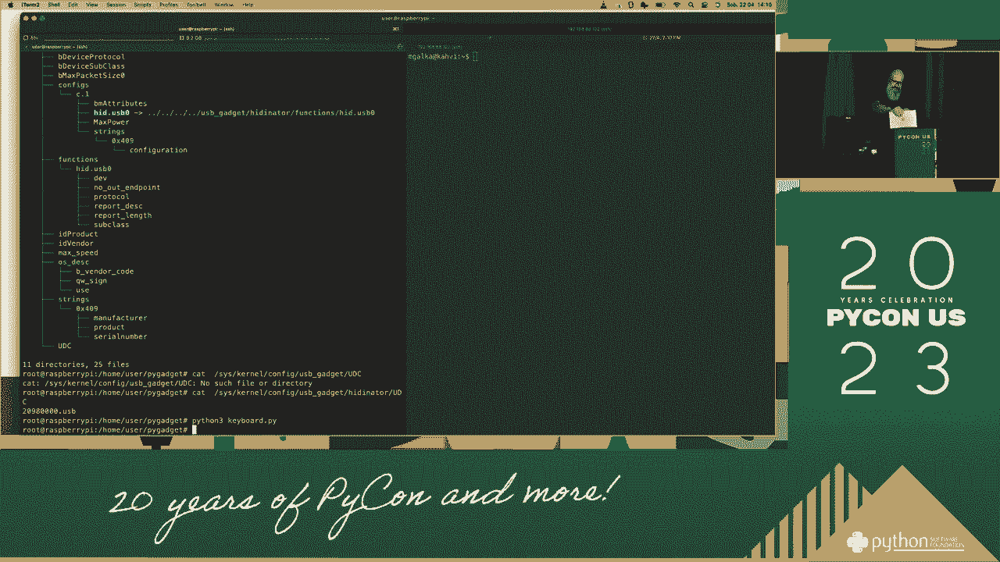

# Python USB 小工具开发：P52：用 Python 创建 USB 小工具

在本节课中，我们将学习如何使用 Python 将一台树莓派或类似的 Linux 单板计算机配置成一个 USB 小工具。这意味着你的设备可以模拟成键盘、鼠标、存储设备等，并通过 USB 接口与主机电脑进行交互。我们将从核心概念讲起，逐步完成配置和代码编写。



## 概述


USB 小工具功能允许一个 USB 设备（如树莓派）模拟成多种 USB 设备类别。Linux 内核通过 `configfs` 文件系统提供了动态配置 USB 小工具的能力。我们将使用 Python 来编写脚本，自动化这一配置过程，并实现一个简单的键盘输入功能。


上一节我们介绍了课程目标，本节中我们来看看实现 USB 小工具需要理解的核心概念。

## USB 小工具核心概念



理解以下概念对后续操作至关重要：


1.  **USB Gadget（小工具）**：指能够通过 USB 连接扮演特定角色（如键盘、鼠标）的设备。
2.  **ConfigFS**：一个位于 `/sys/kernel/config` 的虚拟文件系统，用于在用户空间动态配置内核对象，包括 USB 小工具。
3.  **Function（功能）**：指小设备所模拟的具体功能，例如 `hid`（人机接口设备，用于键盘/鼠标）。
4.  **Configuration（配置）**：一组功能的集合，一个小工具可以拥有多个配置，但一次只能激活一个。

其核心关系可以表示为：**一个 Gadget 包含一个或多个 Configuration，每个 Configuration 包含一个或多个 Function**。


接下来，我们将进入实践环节，了解具体的环境准备步骤。


## 环境准备

在开始编写代码前，需要确保你的 Linux 系统（以树莓派为例）满足以下条件。



以下是需要检查或启用的项目列表：


*   **内核支持**：内核必须编译了 USB Gadget 功能。通常树莓派 OS 已包含。
*   **启用模块**：需要加载 `libcomposite` 内核模块。执行 `sudo modprobe libcomposite` 来加载。
*   **Python 3**：确保系统已安装 Python 3。
*   **权限**：操作 `/sys/kernel/config` 下的文件需要 root 权限，因此我们的脚本需要使用 `sudo` 运行。

准备工作完成后，我们就可以开始设计并编写主要的配置脚本了。



## 编写配置脚本


我们将创建一个 Python 脚本，用于自动设置一个模拟键盘的 USB 小工具。脚本的核心任务是操作 `configfs` 中的目录和文件。

以下是脚本的关键步骤和对应代码：



1.  **定义基础路径和 Gadget 名称**：
    ```python
    import os

    CONFIGFS_PATH = "/sys/kernel/config/usb_gadget"
    GADGET_NAME = "my_keyboard"
    ```
    这段代码定义了 `configfs` 的路径和我们即将创建的小工具名称。


2.  **创建 Gadget 目录并设置基础属性**：
    ```python
    gadget_path = os.path.join(CONFIGFS_PATH, GADGET_NAME)
    os.makedirs(gadget_path, exist_ok=True)

    # 设置 USB 厂商ID和产品ID (例如，0x1d6b 是 Linux Foundation)
    with open(os.path.join(gadget_path, "idVendor"), "w") as f:
        f.write("0x1d6b")
    with open(os.path.join(gadget_path, "idProduct"), "w") as f:
        f.write("0x0104")
    ```
    这里创建了小工具目录，并为其设置了标识符。`0x1d6b` 和 `0x0104` 是一个示例ID。

3.  **创建字符串描述符**：
    ```python
    strings_path = os.path.join(gadget_path, "strings", "0x409")
    os.makedirs(strings_path, exist_ok=True)
    with open(os.path.join(strings_path, "serialnumber"), "w") as f:
        f.write("1234567890")
    with open(os.path.join(strings_path, "manufacturer"), "w") as f:
        f.write("My Company")
    with open(os.path.join(strings_path, "product"), "w") as f:
        f.write("Python USB Keyboard")
    ```
    这部分代码创建了在主机端显示的设备信息，如制造商和产品名称。



4.  **创建 HID 功能（Function）**：
    ```python
    # 创建功能目录
    function_path = os.path.join(gadget_path, "functions", "hid.usb0")
    os.makedirs(function_path, exist_ok=True)

    # 设置协议类型（1 为键盘）和报告描述符长度
    with open(os.path.join(function_path, "protocol"), "w") as f:
        f.write("1")  # 1 代表键盘
    with open(os.path.join(function_path, "subclass"), "w") as f:
        f.write("1")
    with open(os.path.join(function_path, "report_length"), "w") as f:
        f.write("8")  # 键盘报告描述符的长度

    # 写入一个简单的键盘报告描述符
    report_desc = bytes([0x05, 0x01, 0x09, 0x06, 0xA1, 0x01, 0x05, 0x07, 0x19, 0xE0, 0x29, 0xE7, 0x15, 0x00, 0x25, 0x01, 0x75, 0x01, 0x95, 0x08, 0x81, 0x02, 0x95, 0x01, 0x75, 0x08, 0x81, 0x01, 0x95, 0x05, 0x75, 0x01, 0x05, 0x08, 0x19, 0x01, 0x29, 0x05, 0x91, 0x02, 0x95, 0x01, 0x75, 0x03, 0x91, 0x01, 0xC0])
    with open(os.path.join(function_path, "report_desc"), "wb") as f:
        f.write(report_desc)
    ```
    这是最关键的一步，我们创建了一个 `hid` 功能，并将其配置为键盘，同时写入了一个标准的键盘报告描述符。



5.  **创建配置（Configuration）并关联功能**：
    ```python
    # 创建配置目录
    config_path = os.path.join(gadget_path, "configs", "c.1")
    os.makedirs(config_path, exist_ok=True)
    config_strings_path = os.path.join(config_path, "strings", "0x409")
    os.makedirs(config_strings_path, exist_ok=True)
    with open(os.path.join(config_strings_path, "configuration"), "w") as f:
        f.write("Keyboard Config")

    # 将 HID 功能符号链接到配置中
    os.symlink(function_path, os.path.join(config_path, function_path.split("/")[-1]))
    ```
    我们将之前创建的 `hid.usb0` 功能添加到了名为 `c.1` 的配置中。


6.  **绑定到 UDC（USB设备控制器）**：
    ```python
    # 查找可用的 UDC 控制器
    udc_driver = ""
    with open("/sys/class/udc/udc0/uevent", "r") as f: # 路径可能不同，如 /sys/class/udc/*/uevent
        for line in f:
            if line.startswith("UDC_NAME="):
                udc_driver = line.strip().split("=")[1]
                break

    if udc_driver:
        with open(os.path.join(gadget_path, "UDC"), "w") as f:
            f.write(udc_driver)
        print("USB Gadget activated.")
    else:
        print("No UDC driver found.")
    ```
    最后一步是将我们配置好的小工具绑定到实际的硬件 USB 接口上，使其生效。

脚本编写完成后，我们需要知道如何运行和使用它。


## 运行与测试



保存上述代码到一个文件，例如 `setup_keyboard.py`。

1.  使用 root 权限运行脚本：`sudo python3 setup_keyboard.py`。
2.  此时，将树莓派通过 USB 线连接到另一台电脑（确保连接的是数据口，而非仅供电口）。
3.  主机电脑应该会识别出一个新的 USB 键盘设备。
4.  要测试键盘输入，你需要向 `/dev/hidg0` 设备文件写入键盘扫描码。可以编写另一个简单的 Python 脚本来发送按键（例如，按下并释放 ‘a’ 键）。



一个发送 ‘a’ 键的示例代码片段如下：
```python
# send_key.py
with open("/dev/hidg0", "wb") as hid:
    # 按下 ‘a’ 键
    hid.write(b'\x00\x00\x04\x00\x00\x00\x00\x00')
    # 释放所有按键
    hid.write(b'\x00\x00\x00\x00\x00\x00\x00\x00')
```
使用 `sudo python3 send_key.py` 运行，观察主机电脑是否输入了字母 ‘a’。


## 总结

本节课中我们一起学习了如何利用 Linux 的 `configfs` 接口和 Python 脚本，将树莓派配置成一个 USB 键盘小工具。我们涵盖了从核心概念、环境准备、脚本分步编写到最终测试的完整流程。通过操作虚拟文件系统，我们动态创建了小工具、功能、配置并将其激活。掌握这个方法后，你可以进一步探索模拟鼠标、存储设备或复合设备，为你的嵌入式项目增添强大的 USB 交互能力。