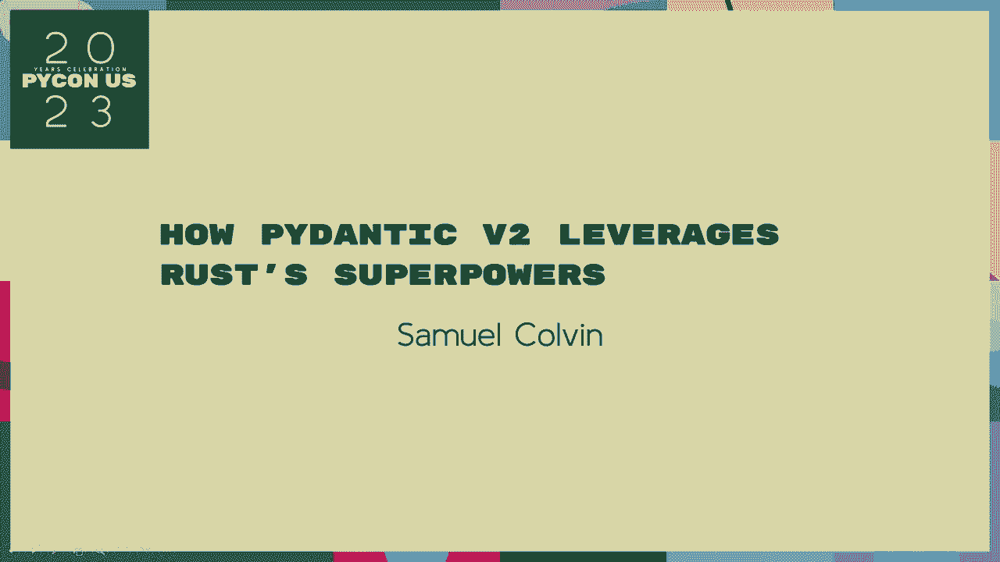
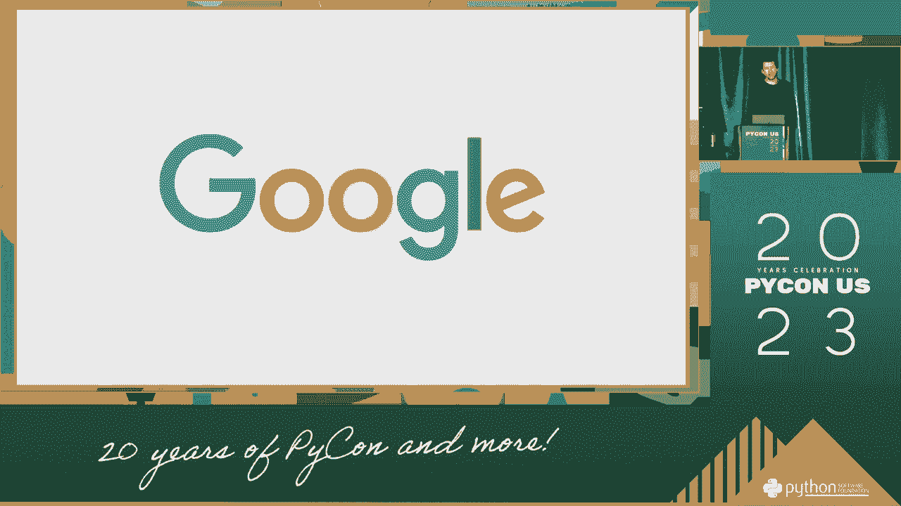

# P53：演讲 - 塞缪尔·科尔文 _ Pydantic V2 如何利用 Rust 的超能力 - VikingDen7 - BV1114y1o7c5

[ 暂停 ]。

[ 暂停 ]。

[ 暂停 ]， [ 暂停 ]， [ 暂停 ]， [ 暂停 ]， [ 暂停 ]， [ 暂停 ]， [ 暂停 ]， [ 暂停 ]， [ 暂停 ]。 [ 暂停 ]， [ 暂停 ]， [ 暂停 ]， [ 暂停 ]， [ 暂停 ]， [ 暂停 ]， [ 暂停 ]， [ 暂停 ]， [ 暂停 ]。 [ 暂停 ]， [ 暂停 ]， [ 暂停 ]， [ 暂停 ]， [ 暂停 ]， [ 暂停 ]， [ 暂停 ]， [ 暂停 ]， [ 暂停 ]。 [ 暂停 ]， [ 暂停 ]， [ 暂停 ]， [ 暂停 ]， [ 暂停 ]， [ 暂停 ]， [ 暂停 ]， [ 暂停 ]， [ 暂停 ]。

[ 暂停 ]， [ 暂停 ]， [ 暂停 ]， [ 暂停 ]， [ 暂停 ]， [ 暂停 ]， [ 暂停 ]， [ 暂停 ]， [ 暂停 ]。 [ 暂停 ]， [ 暂停 ]， [ 暂停 ]， [ 暂停 ]， [ 暂停 ]， [ 暂停 ]， [ 暂停 ]， [ 暂停 ]， [ 暂停 ]。 [ 暂停 ]， [ 暂停 ]， [ 暂停 ]， [ 暂停 ]， [ 暂停 ]， [ 暂停 ]， [ 暂停 ]， [ 暂停 ]， [ 暂停 ]。 [ 暂停 ]， [ 暂停 ]， [ 暂停 ]， [ 暂停 ]， [ 暂停 ]， [ 暂停 ]， [ 暂停 ]， [ 暂停 ]， [ 暂停 ]。

[ 暂停 ]， [ 暂停 ]， [ 暂停 ]， [ 暂停 ]， [ 暂停 ]， [ 暂停 ]， [ 暂停 ]， [ 暂停 ]， [ 暂停 ]。 [ 暂停 ]， [ 暂停 ]， [ 暂停 ]， [ 暂停 ]， [ 暂停 ]， [ 暂停 ]， [ 暂停 ]， [ 暂停 ]， [ 暂停 ]。 [ 暂停 ]， [ 暂停 ]， [ 暂停 ]， [ 暂停 ]， [ 暂停 ]。
