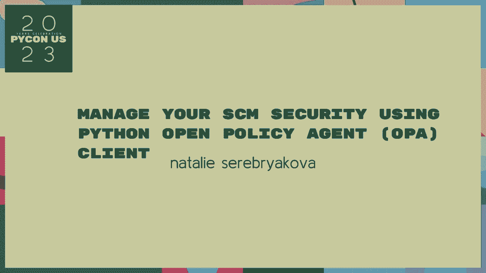
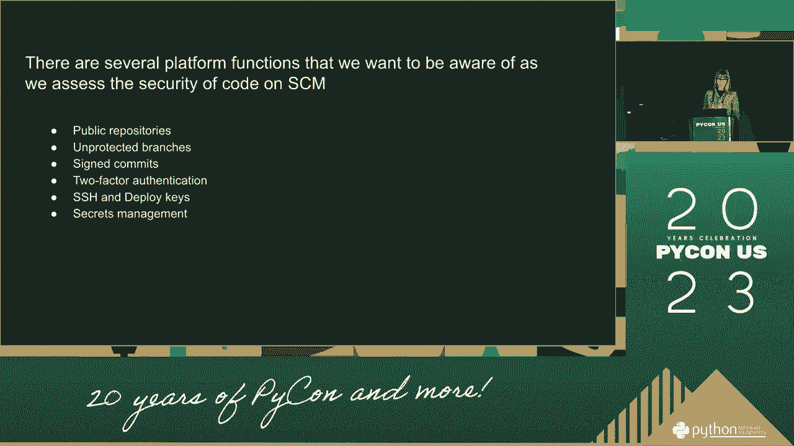
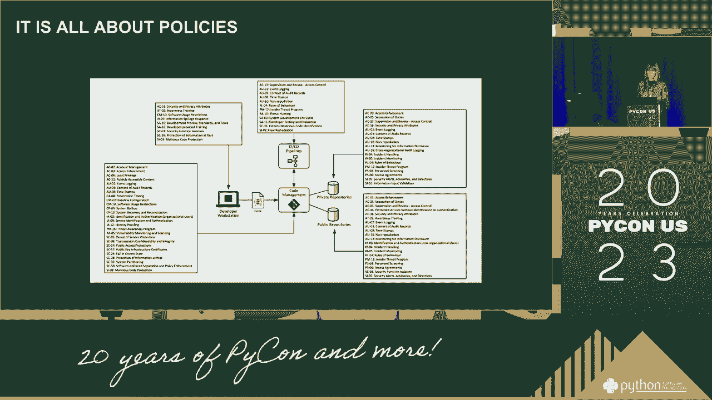

# Python 供应链安全：P54：使用 Python 进行开源策略管理 🔐

在本教程中，我们将学习如何使用 Python 来管理和提升软件供应链（SCM）的安全性。我们将探讨开源策略管理的基本概念，并了解如何通过自动化工具来确保依赖项的安全合规。

---

## 概述 📋



软件供应链安全是现代软件开发的关键环节。它涉及管理项目所依赖的所有外部代码库（即开源包），以防止引入漏洞或恶意代码。手动管理这些依赖项既繁琐又容易出错。因此，利用 Python 进行自动化管理成为一种高效且可靠的解决方案。

上一节我们介绍了供应链安全的重要性，本节中我们来看看如何利用 Python 工具来实现开源策略的自动化管理。

---

## 核心概念与工具 🛠️

在深入实践之前，我们需要理解几个核心概念和将要用到的工具。

**供应链（SCM）**：指软件从开发到交付过程中涉及的所有组件、库、工具和流程。

**开源策略**：指一个组织关于如何使用、选择、审核和更新开源软件的一套规则和标准。

我们将主要使用 Python 包管理器 **pip** 和依赖分析工具。一个基础的依赖检查可以通过以下命令实现：

```bash
pip list --outdated
```

---

## 实施步骤 📝



以下是实施自动化开源策略管理的关键步骤。

### 1. 依赖项清单生成

首先，需要生成项目所有依赖项的完整清单。这可以通过 `pip` 轻松完成。



```bash
pip freeze > requirements.txt
```

生成的文件 `requirements.txt` 列出了所有已安装包及其精确版本。

### 2. 漏洞扫描

生成清单后，下一步是扫描这些依赖项是否存在已知的安全漏洞。我们可以使用像 `safety` 这样的工具。

```bash
# 安装 safety
pip install safety

# 扫描 requirements.txt 文件
safety check -r requirements.txt
```

该命令会检查依赖包是否包含在公共漏洞数据库中，并报告发现的问题。

### 3. 策略合规性检查

除了安全漏洞，还需要确保依赖项符合内部的开源使用策略（例如，许可证限制）。我们可以编写自定义的 Python 脚本来进行校验。

以下是一个简单的示例脚本框架，用于检查许可证：

```python
import pkg_resources

def check_licenses(requirements_file):
    with open(requirements_file, 'r') as f:
        packages = [line.strip().split('==')[0] for line in f]
    
    for dist in pkg_resources.working_set:
        if dist.project_name in packages:
            # 此处应接入实际的许可证检查逻辑
            print(f"{dist.project_name}: {dist._provider.license}")
```

### 4. 集成与自动化


最后，将上述步骤集成到持续集成/持续部署（CI/CD）流水线中。这样，每次代码提交或构建时都会自动执行安全检查，确保问题能被及早发现。

例如，可以在 `.gitlab-ci.yml` 或 GitHub Actions 配置中添加一个安全扫描阶段。


---

## 总结 🎯


本节课中我们一起学习了如何使用 Python 来管理软件供应链安全。我们从生成依赖清单开始，接着进行漏洞扫描和策略合规性检查，最后探讨了如何将这些流程自动化集成到开发工作流中。

通过自动化这些任务，团队可以显著降低因使用不安全或不合规的开源组件而带来的风险，从而构建更可靠、更安全的软件。

记住，供应链安全是一个持续的过程，需要定期更新依赖项并重新评估策略。