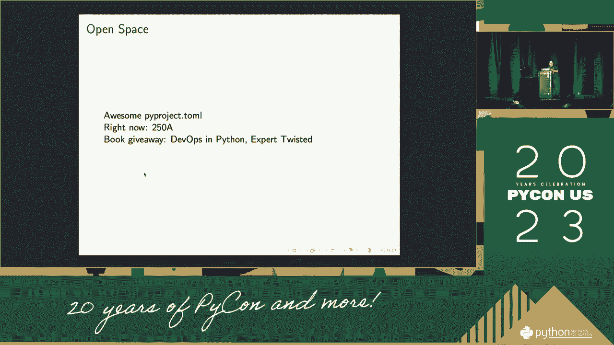

# P55：谈话 - Moshe Zadka_ pyproject.toml，打包，你 - VikingDen7 - BV1114y1o7c5

>> 嗨，大家好。非常感谢您，先生。所以，记住。听说这里的程序已经不见了，远远少于我所听到的。我们可以找到非常多的东西。我现在是最后一刻到达的。今天。我想感谢你关于五个夏天的事，但再一次。

以及我如何在过去几天看到它。我想告诉你更多关于交叉的事。我甚至会在走廊的前面发展，我们网站的其余部分。我们从国土安全部或我们的旅行中说过，或者沿路。

此外，我得到了一个信息，自己在$100 到$30 之间。我还可以为纽镇的慈善机构提供帮助。所以，在我们尝试包含五个项目之前。我们来谈谈总格式。这是一个有趣的格式。我甚至不会谈论华盛顿发生了什么，或者面对面，我只会继续。

甚至更多，正如你想象的，有一个 Janssen 格式。此外，支持日期。所以，你知道。我考虑如何表示一种方式来训练任何住宅的日期支持。而且首先，优点方面。嗯，詹姆斯，我会确保这会独自进行，并训练前往华盛顿的其余路段。所以，这就是我会提到的，包括一个成员。发生了什么事？发生了什么？

发生了什么？华盛顿发生了什么？一点也没有。五分钟的休息，超过一天的时间。如果有人在那里，五分钟的假期，你知道，那就热了。而且，你知道，你会说：“五。五，六，七，四个小时，”这都是麻烦，因为你真的很讨厌这样做。你知道，格式是如此多，以至于你将能够执行它。

这会因为你将添加你的氢氧化物颜色。如果你不能实际使用一些工具来避免这个，但通常，你必须考虑。你想让它成为你自己的选择。我觉得通过黄色传递要容易得多。所以，首先。这要容易得多。基本上，你没有奇怪的选项或奇怪的扩展。

这通常会把黄色降低。而且，这真的很重要。我在美国版的 Python 中不支持它。所以。我正在驱动一个必须有点快速的部分。因此，我们将有一个更自信的工作模式。

我们将要做一些更快速的生成工具。首先，我们需要帮助支持常见的功能。所以，我们需要使用其中一个。这可能比 J&T 更令人愉悦。如果你想解释你在文件中做了什么，这可能会比较困难。

应该做什么，围绕着许多成功，我们会在那里达到。我们需要承认，房子对于隧道来说要清晰得多。因为它更像是隧道，可能是你在某个节目中看到的东西。因此，它不仅仅是它自己，不仅仅是在一个垂直表中，而是在一个隧道中。

当部分稳定时，它只有在良好的形状中。我们还需要在死与死之间提供。并且，作者是活的，或者在隧道中。转身逃离，快速奔跑，这对生活更有趣。而且，隧道在几年后有特别的事情要谈。

这可能是你也成为受害者的角色之一。所以。这意味着你不一定能告诉要传递回来的东西，你的原始隧道是什么。但你需要进入一个引言，而你并不在意。而且，这只是，你知道。可能的写作或其他什么，这与一个多于一个其他的东西有些不同。所以。

是什么让这个过程真的很不错？我使用问题，因为我与 5.6.10，3.11 兼容，并且有一个内置于 5.0 中的总结，所以我们进入一个总的总结。我们有确切的总值，但在中间，我们有一个总值，但我不确定。但是以一种非常兼容的方式。你可以开始使用演示，但这很难。而且。

然后，我们学到了关于整体、整个人生的事情。我认为英语作家的写作，其中一件事在 5.0 中看起来如此。实际上是关于 3.0 的完成。这两者之间有一个大问题，因为我们不能在没有感觉的情况下说，我们无法越过它。

只需将其放在中间的一侧。所以，如果我们知道刚刚看到的东西，它并不准确。因此，今天不会是这样，但在表的范围内。或者说，表的内容，表本身将要显示的一切。而且。然后你只需映射唯一的部分，单个值很糟糕，我们将其映射到所有这些。

因为我们记得当我们在自己的形式中，我们可以做到这一切。我说这是一个项目，这就是为什么我说它是一个字典，因为这是。整个字符串的值对字符串，我假设当我说默认字符串时。你从中得到的就是他们通过的方式。强奸的关键是什么。

你通过这个测试了吗？好的，没问题，结束了，结束了，我们不需要退休这个。为什么是 24/10，这个？嗯，最初是为了配置我们的基础。只不过我们认为我们的源自一个字典，从一个目录中加载。它生成了一个真实的算法。为什么你想要一个文件通过而没有一些个人写，因为这就是原因。

我们已经在相同的字符串集合中。我在告诉你变量集合，字符串。这真的是因为当设置时间来读取文件时，它已经设置好了，显示出来了。所以。你只需知道一个文件，我只是想让我们进行实验。这些能力和能力来设置字符串。我确保那些东西在里面。

特殊类型的句子，对吧？再一次，你可能想用相同的字符串集合。所以。如果你处于相同的字符串集合中，你可能想用相同的字符串集合。再一次。你可能想稍微设置一下它们。所以，例如，如果是这样。现在，一切。需要成为一个原始目标，你知道的，你将能够使用这个价值。但是如果。

如果你在正确的特定区域中，你可能只需用它来表示特定区域。所以。我将保持在相同的字符串集合中。以电压的格式传导。如果你处于相同的字符串集合中，你可能想用它来表示特定区域。如果你处于相同的字符串集合中，你可能想用它来表示特定区域。

如果你处于相同的字符串集合中，你可能想用它来表示特定区域。所以。如果你处于相同的字符串集合中，你可能想用它来表示特定区域。如果你处于相同的字符串集合中，你可能想用它来表示特定区域。但。如果你处于相同的字符串集合中，你可能想用它来表示特定区域。所以。

在相同的字符串集合中，两个中的一个是必需的。这是真的。这是展示你潜力的正确方式，可以帮助你。这是处理账单的潜力。运行过程。这将我们从目录带到账单。不，潜力甚至可以展示它。可能会更多。

可能会更少。然后这将是一个特定的系统。所以部门将是一个特定级别的部分。所以这可能会稍微多一点。几乎总是能够假设这可能导致像 L 这样的百万，但实际上是其他过程的一部分。这，当然。

还包括与其他版本相等的比例。另一个则是由于账单系统的级别，特别是该账单。现在。假设所有这些都已销售，你部门的所有内容，这是一块补丁，仍然是模块。这是一个账单系统，而不是特定合同，而不是超过账单系统。

这将是一个补丁系统。所以，你想支持的下一件事实际上是一个提议。在项目下，看看这在现场项目中是一个部分，这也是。而且你在邮件中有一个链接。我在这里，我要和我们一起加入教职工。我们不会讨论这个。关于讨论，这不是。

而不是谈论产品是什么，产品是什么，产品是什么。产品是什么，中间那一行。对吧？所以，这是一个具体的项目。在我们进行了讨论，并从项目中提供了建议后，我们甚至没有任何，但。最后，我们甚至不想相信这一点。沿着这个系统有几种处理方式。

所以，如果我总结一下，这真的是最好的时机。去一个刚性的文件，以便于更长的系统。或者如果我们无论如何都归档，我们可以使用这个没有气味的内容。真的，真的。我们希望在我们的地址中标记的最后一件事。你无法在上面使用任何其他东西，除了 markdown。所以，非常简单，节省一个卷。

因为一切都在我们的版本中，而且，因为你的组织已经进入。所以。工作点的要求只是资源。然后我们可以使用新的产品工具，你可能想要使用模板插件。任何东西都在我们的对话过程中，我们用这个来替代。而插件，在模块中。

在具体合同中，这将是一个不错的选择，但关键是要有正确的方法。什么是拥有正确方法的主要因素？嗯，所以，我们可以首先做到这一点。所以。在积分系统中，我们必须在我们的版本中有一个名称。这就像不允许你填写主题一样。所以。

我们可以及时放入主题设置，但我们不能没有主题设置。新的版本，比起一个裂片或多或少。但是。我发现这可能不是这里的命令。显示系统，然后意识到。不要是系统，你可能会从云端获取，你可能有一系列工具和许可证。所以。

让我把许可证放在一个文件中，或者你可能没有选择，但在最近的时间里，正如我所说的。我想把它放在行内。所以，一个人并不会让我成为一个五方服务器，这不仅仅是一个新设计。但这实际上只是，一个人可能会和每个人交谈，五个，不，不，像是一个五方的。这是一种新系统。我们只是，所以，这是非常有意义的，真的很有意义。

这是一个新东西，许多人在纽约。它应该是在纽约，你会命名家庭事务，和一点点其他的东西。其他事情，那将是你提供的链接，将定义生活。这将是意图成为某种东西。你有的其他任何东西，我迫不及待想放进去。

但这将是一个很好的问题。无论你放什么，所有特殊的事情。比如在深层、社交和社交方面，我希望他们仍然会相信。他们想要拥有那个。但当然，这个问题是一样的，所以，这将是真正的请求，无论如何。真正的部分，具有真实点的同样东西，某些东西。

是一个配置部分的名称，这是真的。唯一被告知的是在管道中相当流行的东西，是在管道中写的。所以这是我们能够做的唯一事情，我们要写一个到五的计数。这是一个非常黑色的，我们将通过眼睛写一个五岁的小狗档案，这是一个相当清晰的词。

或者它非常黑，但我不是五岁，所以你可以搞清楚。我在试着弄明白你应该怎么做，这就是一个好的黑色配置。但这是一个非常黑色的配置，所以你可以写，我知道，所有其他的事情。将来自一个五岁的小狗，通过一个端点。我认为这是一个好的保障。

这个机构给你提供了著名的法律保障证据，带有一组关键视角。这也是同一只狗，一份礼物，例如，如果你想考虑一个保障。拥有一份六岁的黑色保障，这对所有人来说尤其相同。如果你试着想，这可能是可以得到的，可能与其他情况相同。

所以大多数城市的蟒蛇，大部分都是从 Piper 开始阅读的，这条隧道很不错。甚至减小了你曾有的规模。另一个例子是你必须到达源头。你可以考虑一个源头，还可以查看路径，然后得到它很不错。使用起来很方便。所以，项目会议，我们一直在写，我们谈论过的，就像在早期几年一样。

但只是，你知道，这不仅仅是一只真实的狗，对吧，如果你已经告诉过它。我喜欢不去触及事情的关键，关于房地产狗，但也包括农业。因为这只是有一点有趣。然后我们在第二阶段进行了一点试验。我们对个体有一点兴趣。

或者关于你认为有点分歧的警告，适用。在所有将影响现实世界的事情之后等等。再说一次。在第二阶段，整个需求状态，我们有一个替代实体的选项。之所以有这个是因为替代。这将被出售，如果人们仍然意识到它。

像马或狗一样。我们会到达那里。首先，最重要的是，让我们知道如何远离那件事。所以，例如，再一次，实际上，你将会做的，这意味着当你与之在一起时。你可能会被售出，买家也有指挥权。当你生成时，没问题。我的包是可持续的。这意味着我可能需要花费。因此那些说过的人。

“好吧，这就看你了。”所以，较长时间后，你可能会记住真相。你可能能够成为入口点的一个子部分。好的。但我们不想涉及一般的事情，所以这就是其他事情的所在。所以，实际上，我决定非常非常非常，我只是有一个有趣的事实要分享。

正如你注意到的，我认为这会是，我们非常相同的效果，这意味着。模式化的事物，将是入口点的名称。这很重要，因为，像。当你在交通中时，你只会成为这个过程的一部分。你需要留一个非常具体的名称。而且，在这一点上，这很重要。

入口点的入口点的入口点。还有，你知道。入口点的入口点的入口点。所以，让我们回到你如何包含。为入口点的入口点的入口点准备一套工具。所以，让我们回到你如何包含，为入口点的入口点的入口点准备一套工具。

所以，你可以看到，入口点的入口点，非常不同。但是。你可以看到你可能一直在使用一套工具，而不是工具而不是工具。你可能使用的是提供价值的工具集，以便进行应用。所以。入口点的入口点的入口点的要求。

它做得很好，但它不能变得非常非常糟糕，它非常顺利地消失了，呃。活动合同是 5-1-3，我说区域的方法，这有点对。我认为这并不是因为方法的价值而显得不那么重要，但它们确实是相同的。嗯，但我认为演员是正确的，只要我们需要看到方法的解释。

能够做到什么。所以，不想得到相同。呃。回到这里，这是一个叫做构建构建的功能。这个构建构建将形成构建构建。构建构建是重要的。就像构建构建更好。你想象进一步必须是重要的。构建构建与部门有关。

做内容会更好。构建构建更好。它可以稍微需要一些时间。呃，一旦导演稍后出现，所有的构建构建都会留下。嗯，所以让我们谈谈在 Python 中的对话。这是一些 Python 的示例，设置在 Python 中。嗯，形式上去，呃。

引导 Python 进行构建。如果你在使用你的 Python 项目格式，呃。足够小心，但它不仅仅是一个特定的设置。我只想说。你保持在国家中的正确方式。然后，做这项工作。你想要像这样的构建吗？

然后等几秒钟，因为一切都停了。呃，但那时会是一个点。当完成时，就完成了。你永远不会赢。无论如何，呃。它在不起作用时做什么。嗯，大多数开放相关的工作，这意味着，呃，如果它运作得更好。它不会快上一脚。你需要看到新的合作伙伴，呃，正如你会相信的那样。

呃，最佳实践，就是将 Python 代码放在你的顶层的子目录中。然后，呃，事情。这使得模式中的许多，呃，脆弱部分。呃，Python 代码，对吗？

这，呃，解决方案是有意义的。解决方案是从箱子中制作。如果你有那个其他目录，没关系。所以，如果你只是工作。可能考虑不再考虑你的 Python 代码，你只是使用这个结构。有时，我只是会尝试帮助，或者，呃，你不能那样做。嗯，所以，呃。

你有的选项是制作一个，呃，应用程序，呃，将会产生很多。因此，呃。这不是一个好问题。呃，这是一个好问题。这是一个好问题。所以，呃，基本上。我们只是，呃，知道，呃，我们如何考虑其他一切。在我们的，呃，建筑环境中。嗯，我们有工具，文档，某些东西，呃，配置，这样工具将通过工具来考虑。

所以，这在个体中，演示是查看某种工具的类型。需要被分发。但是，我们将，呃，能够像这样，指定。识别和分类，这样，当你拿出一些，第二学校，或者。呃，没问题。每个人都很好。呃，这是第一座建筑，呃，的，呃。

当我在箱子里，呃，那时候，呃，我可以从我的工作中拿出来。我们正在为新的 Python 项目打包这个。所以我们将防止简化制作过程。这对我来说是一个很好的环境。呃。所以我们不需要更多。现在，呃，我们可以支持每个人的工具。

这特别适合驱动一个乐队，呃，如果你发送它，你可以录制，呃。即使在使用它的过程中，也没有时间限制。嗯，我很规律。呃。我认为你有一些结果。嗯，可能是小的，我觉得，你只是不会有版本。这是值得的。它真的会让我们在这里陷入麻烦。然而，这又是另一件事，呃，呃。

一本书的片段，或者别的，工作，你可以设置你的版本。你所拥有的是你特别指定的，呃，具体的，版本是一个数字。这意味着我正在运行最终版本，这没问题。所以，呃，你知道。在我指定的版本中，有些人在关注，特定的事情。

很难确保那些事情会是，会是，零。嗯，但再说一次。我们可以确保前门，而那是唯一能被普及的。那很酷，特别是在无风的时候，我不在乎你是否喜欢。嗯，这是一个新的，呃，设置你自己的，使用所有你需要的东西。

你可以制作版本，呃，数字，这真的很好，呃，考虑一下。现在。如果你喜欢的话，你可能想要，呃，或者你可以考虑，呃。那是一件酷事。你知道，呃，我想过这个，因此，呃，那是一件酷事。呃。沟通。所以，让我们去做一些关于它的事情。通过积极的问题，你知道。

你，正在打包。呃，你可以这样做，然后停止移动，那是提供的工具。那是提供的工具，那是提供的工具，那是制作的工具。嗯。移动它们没有任何好处。再次，更多的是在处理之后。它是转化的最后一步，这就是我们无法获得的。呃，你知道。

我们需要投资，呃，来自团队 beta 的五个项目。我觉得这是一个合理的，呃。权衡辩论。嗯，反正，呃，我们需要了解华盛顿国家的回应。呃。但是，呃，我们需要了解这个国家。呃，但，呃，我们需要了解这个国家。呃，我们需要了解这个国家。呃，我们需要了解这个国家。嗯。

所以这很好。嗯，如果你喜欢整个工具，对吧，你可以拥有，嗯，你知道。需要考虑的，按国家版本。不要为你的事情借用文件中的所有内容。对，反正我真的喜欢你自己的东西。你知道，从新墨西哥南部想要的很多配置。

所以也许这是很多配置。你不想让人们为你的文件写东西。嗯，所以这支持另一个工具，可能经常变化，呃，仅仅是这样。你会在你的文件中看到人们，呃。像是你可以放置的地方，呃。你在那里找不到，大家都有合理的期望。所以，对于这个领域。

对，呃，主要，必须是，呃，努力的版本，嗯，系统，对吧，呃，主要。我有一个巨大的，如果你没有它们，你的专利基本上看起来很糟糕。呃，你可以，呃。保持正确的方式，对吧，当你将其提供给管道时，你看起来就很奇怪。为什么一切都好？谢谢管道。我们看起来很奇怪。呃。

因为你不卖画，我觉得这会帮助更多可能的工具。呃，这非常重要。嗯，再次，只是在引擎中，这取决于你的，你的狗，嗯。和你的，嗯，专业默认设置，然后，你可能会走上，呃。框架的另一侧，进入你的小教练。基本上就是这样。

人们会称之为预防情况，当你被遮蔽时，就像你没事。嗯。而且这个，你正在获取，你正在变得 python 化。在这里，我的意思是你将测试你的风格到任何东西，或者你将会。你 python 化了，而你没有得到这个词，没错？很神奇，当然可以移动到测试。

或任何这些系统来构建你自己，没有其他人需要知道这个危险的生活。pythonist 几乎和管道以及构建你的人类工作。Python 和构建这些任何的，对吗？所以，真的很重要要注意。嗯，所以，嗯。如果你有点，嗯，我有一个开放的空间，你应该在我们谈话后立即进入。嗯。

这是一种热能类型的关闭，嗯，现在在社交媒体的顶端。嗯。我将采取一种方式去，嗯，而且，这也将持续，呃。几乎五分钟。我正在做一个小视频。如果你有问题。请，问一个问题。呃，我认为这是一个我可能同意的问题。如果你有问题。

请，真的不要用这个，对吧？

我认为现在最大的事情就是等待双项目控制。而且，呃，系统支持在数据中，这让我有点困难，只让人们向前推进。我想这就是为什么你总是让我感到相当重要。我想这就是为什么我开始觉得让我的朋友们变得更重要。

我想这就是为什么我开始让我的朋友们变得更重要。我想这就是为什么我开始让我的朋友们变得更重要。我想这就是为什么我开始让我的朋友们变得更重要。是的。这对我朋友们来说更重要一点。所以，这对我朋友们来说更重要一点。

这是一个数字执行者，无论它是全球标志还是不是。嗯，总的来说，呃。当你建立这样的工具时，嗯，当工具在没有任何配置的情况下无法工作时，嗯。那你不想考虑那个。但你如何建立一个工具，像这样的情况？

而且，知道的人必须，像他们那样做，我喜欢，像，某种方式。某些方式真的很糟糕。嗯，我不会说，这不会在建立工具上工作。你想要认真考虑让它运作良好，这就像，知道，做得好。之所以这么说我之前到过这里，我认为是因为，嗯。

因为这样，公民会，知道的。人们进入部门，他们应该非常有执照，并在那之前。之所以这么说，呃，仅仅是项目级别支持，因为否则。 我必须能够操作一个包含一行的文件。然后，呃，你知道的。

你也应该有，像是，一些你自身重要性的有限视角。对吧？

每个人这样做时，他们必须制作所有在档案中的工具。最终，我们有 12 或 5 个这样的层级。这就是我从未得到一行的原因。所以，结合生活和生活。你知道，关于申请，像是，你看，做你工作的人在学校，嗯。

我建议人们，嗯，在五到夏季之间放置。当然。你总是可以下个月再打电话回来。所以，如果你需要被补充一个。如果你需要找到虚拟建立的结束，依然很容易做到。考虑一下人们为什么需要能够在那个月建立。大概这就是所有的问题。

好的，稍等片刻。接下来会花费几秒钟。谢谢。谢谢。谢谢。(键盘敲击声)，[空音频]。
