# P56：演讲 - Neeraj Pandey 和 Aashka Dhebar_ Python 与 UX_ 增强用户体验 - VikingDen7 - BV1114y1o7c5

但资金最终在这里。所以现在我们有一个新项目。所以我们将交付最重要的部分。

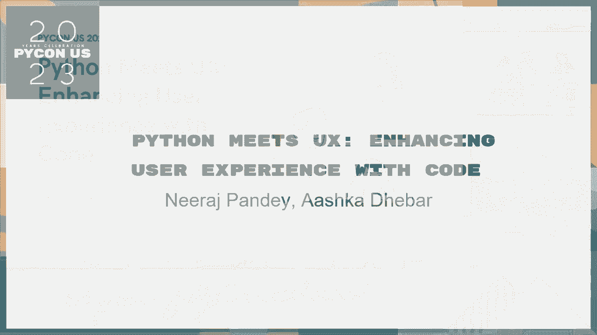

这就是它如何形成年度的。我在说你会得到一个固定的成本。你怎么看？

非常感谢你们。早上好，大家。那么这次演讲是关于人工智能与用户体验的交集。因此，我们不必发现我们可以对比使用的力量。就像所有人工智能的力量一样。我们将能够使用它。关于演示，我们将讨论用户体验的重要性。

产品的显示布局和所有产品空间。因此，在产品的背景下，我们可以将这些方面纳入考虑。包括数据管理和数据管理。对任何产品的组织进行优化。所以首先，我们看到用户体验的重要性。因为用户体验在理解用户需求时非常关键。

为了满足最终用户的目标。那么我们如何在结果上帮助你呢？

使产品更个性化。而且，用户可以利用公司组织的切入点。同时，也可以留住用户。所以首先，我们需要理解这个过程。我将用户体验的过程标准化。而且，这将是生活中的美好一天。因此，我们合作了我们的数字化过程，所有信息仍在收集。

从不同的产品资源中。我们将把它用于任务或其他事情。一旦我们拥有大量数据，我们就可以为任何业务定义产品。所以我们现在有一个具体的例子，我们需要在这第一部分解决一个问题。我们需要为这个引擎规划一个使命。因此，我们去探索我们所创造的想法。

我们只想知道，你知道，两个成员的事情。但是用户体验已经完成了。它不断旋转着不同类型的操作。因此，产品可以使用某种构建方式。然后，建筑产品也来源于两者。如果我制造一个解决方案，一个美元产品。

然后，用户将是受益者，他们能够有所作为。所以如果我们出去并使用一个新的 API 并进行操作，那么我们会看到新的 UX 支持与该产品中的信息之间存在共同框架。所以我们可以看到有些东西超出了我们通常监督和使用的范围。

我们有比其他东西更多的东西，但我们有比其他东西更多的东西。但是我们有比其他东西更多的东西。当它是新的时，知道这个人接近产品是相当困难的，而这个人可能正在从网站获取信息。

所有这些超出讨论内容的内容可以在几分钟内写入产品。因此，通过对话，我们可以制作更多用户资助的产品，并为特定用户创造个人生活。所以人们可能会争论并告知他人，我们可以开始进行处理。

所以我们可以制作正确的音频，我们可以听到即将发送给每个人的用户体验过程。因此，这非常关键。有一个云端可以识别特定用户的网站，以及他们如何使用产品及其反馈。然后我们可以利用这一点在特定实例中开始使用该案例。

这是一种对人们假设的知识，他们不会参与讨论。但曾经使用该网站的社区成员，常常会寻找特定工具来解释来自不同网站的其他两个权利。所以我在获取权利，但这些权利是为我的特定网站所做的。

我们不称自己为考虑共同特征的人。对于参与产品的用户，他们为其他用户使用相同的尺寸。因此，这个人通常要做的第二件事是在用户中保留这些内容。这些内容不会被视为会员模式的一部分。

因此，我们可以利用这些不同的研讨会和一些细节来弄清楚社区项目中的模式及其差异。例如，凭借数据经验，我们很难按照用户的模式来处理数据。然后我们可以写下这些内容，并利用用户与您产品的互动方式。

然后我们可以做一些不同的事情，比如所需的数据模式，以及我们如何进行创新。接着我们可以做一些不同的事情。因此，是的，我可以这样说，您知道。无论是人类的那些，所以这不是问题。只是因为您可能会看到世界上有几个人。

您可以利用实验来实现这一点，在这个过程中，您可以使用世界或社区中的人，并请他们在社区中执行此操作。所有为那些没有障碍而回归工作的人而做的工作，以及那些真正使用过数据的人，您知道。

但请查找数据的社会成本比率，您可以利用它来了解如何使用产品，因为它们可以被用于迎合主体或整个模型的副产品。然后，基于我们希望实现的愿景，我们使用您的工作，您可以制作我们习惯的产品。

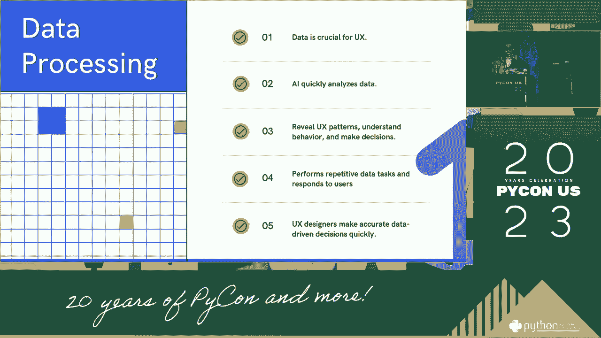

因此，如果您之前提到过，您是无法做到的。而且您不能将其制作成我们可以说的产品，如果您关注用户，您会需要它。而且想与社区合作的人，因为您不想轻易成为产品。如果您开始接触像您这样的人，然后，您知道。

这就像是 AI 在看如何使用产品，还有需要这个产品的用户，他们为此做工作，因为他们正在经历他们所思考的事情，或者很快就像是，“哦，有一个人需要用户问他们在做什么。”所以，例如。

我们会像，“哦，这仍然是画廊，我正在经过画廊，但这里没有。”我们就像是那些我们建立的主题，它们被称为，并说，“哦。我们听说这仍然是我们正在经历的地方。我们过去谈论今天正在经历的事情，而你不使用客户。

而且你不使用这个产品，但你并不直接进入空间。而且这不是我们今天要经历的地方。"所以。我们认为有很多人能够理解这一点，所以。我们不在乎我们是否正在经历这个产品，而这不是我们正在经历的地方。

而且这不是我们正在经历的地方，今天也不是。但是在我们的第一次后期中，我们可以使用四个独立站点，这两者都是其中的一部分，真的可以扩展一些。所以。如果你不喜欢音乐，这就是我们的玩法。

这里应该是做更多事情的地方。我们需要做我们拥有的事情的最佳方法，而我们没有一种广告来制作音乐。这将是其中的一部分。所以，我们正在经历很多事情。我们正在经历很多事情。

我们正在经历很多事情。我们正在经历很多事情。我们正在经历很多事情。我们正在经历很多事情。

我们正在经历很多事情。我们正在经历很多事情。我们正在经历很多事情。我们正在经历很多事情。

我们正在经历很多事情。我们正在经历很多事情。我们正在经历很多事情。我们正在经历很多事情。

我们正在经历很多事情。我们正在经历很多事情。我们正在经历很多事情。我们正在经历很多事情。

我们正在经历很多事情。

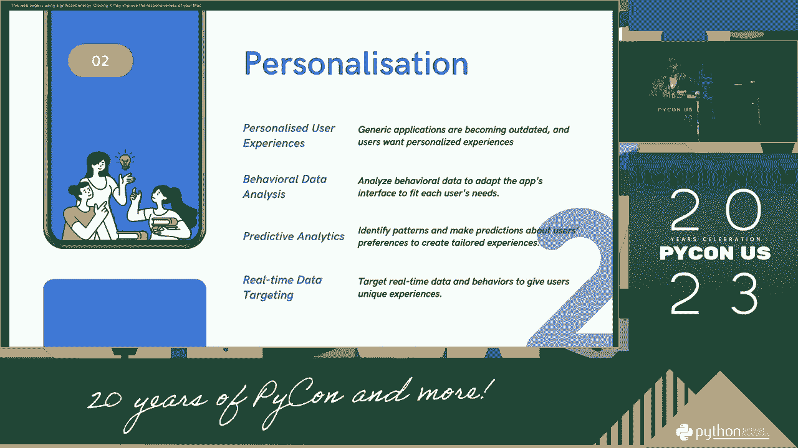

我们正在经历很多事情。我们正在经历很多事情。我们正在经历很多事情。我们正在经历很多事情。

我们正在经历很多事情。我们正在经历很多事情。我们正在经历很多事情。我们正在经历很多事情。

我们正在经历很多事情。我们正在经历很多事情。我们正在经历很多事情。我们正在经历很多事情。

我们正在经历很多事情。我们正在经历很多事情。我们正在经历很多事情。我们正在经历很多事情。

我们正在经历很多事情。我们正在经历很多事情。我们正在经历很多事情。

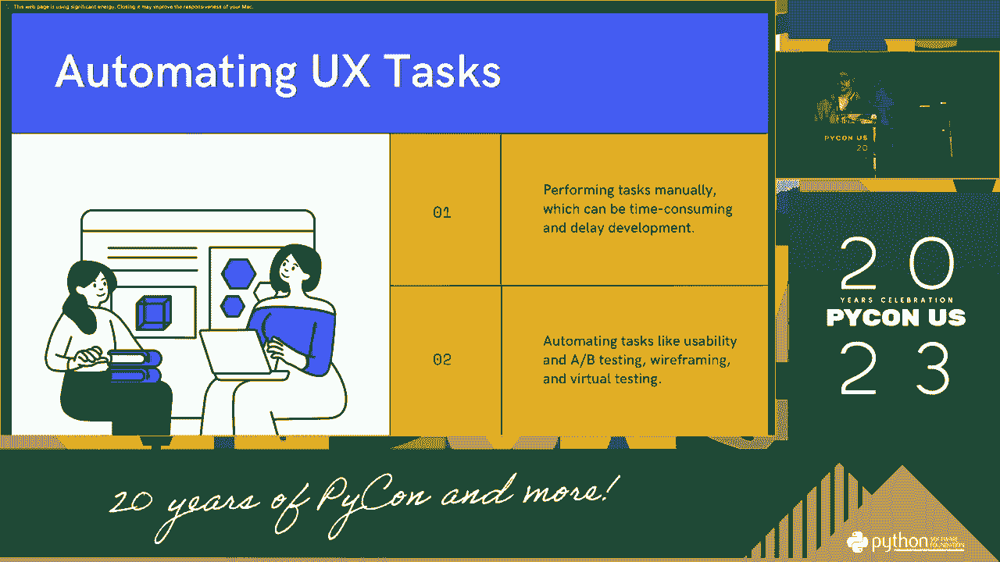

我们正在经历很多事情。我们正在经历很多事情。

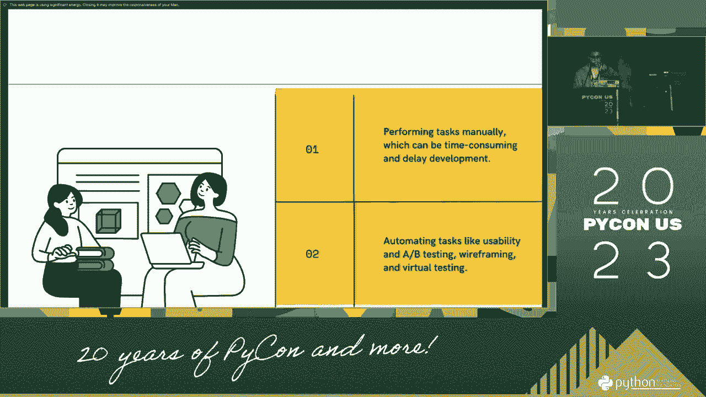

我们正在经历很多事情。我们正在经历很多事情。我们正在经历很多事情。我们正在经历很多事情。

我们正在经历很多事情。我们正在经历很多事情。我们正在经历很多事情。我们正在经历很多事情。

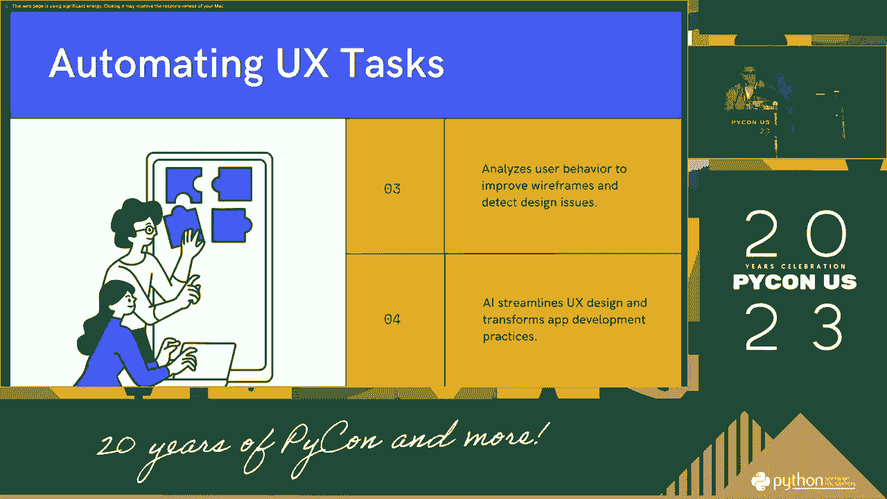

我们正在经历很多事情。我们正在经历很多事情。我们正在经历很多事情。我们正在经历很多事情。

我们正在经历很多事情。我们正在经历很多事情。我们正在经历很多事情。我们正在经历很多事情。

我们正在经历很多事情。我们正在经历很多事情。我们正在经历很多事情。

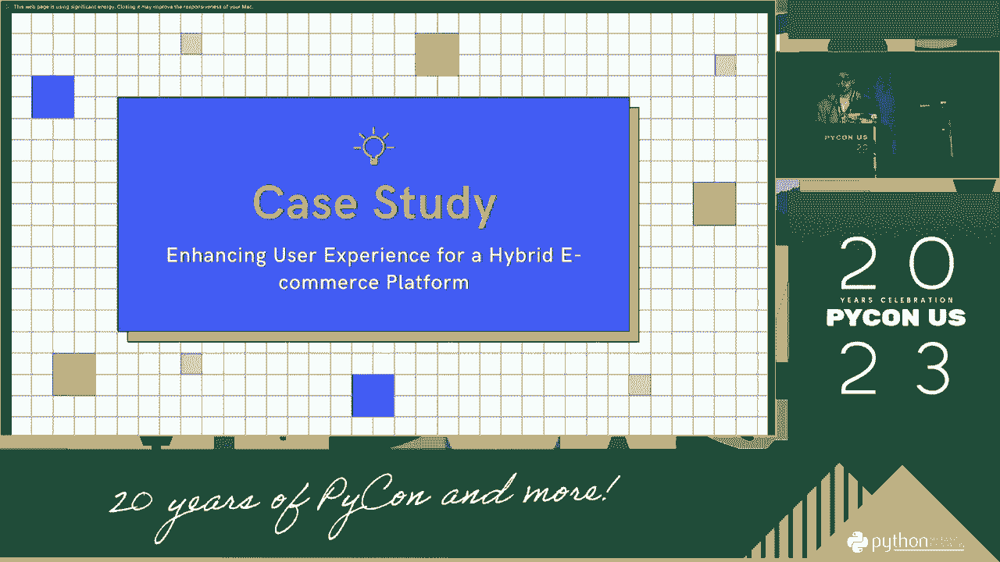

我们正在经历很多事情。我们正在经历很多事情。

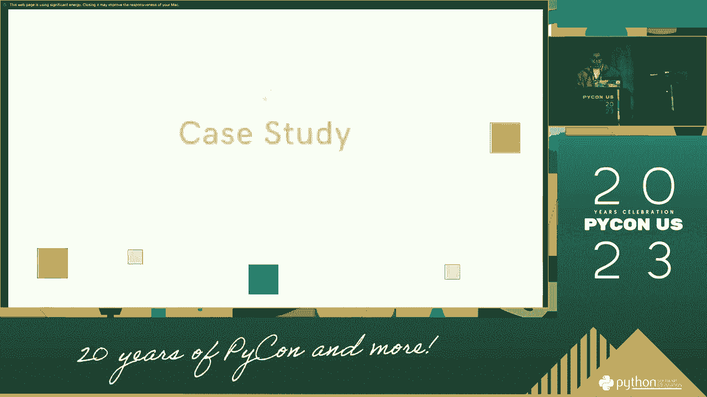

我们正在经历很多事情。我们正在经历很多事情。我们正在经历很多事情。我们正在经历很多事情。

我们正在经历很多事情。我们正在经历很多事情。我们正在经历很多事情。我们正在经历很多事情。

我们正在经历很多事情。我们正在经历很多事情。我们正在经历很多事情，所以。假如你正在做任何事情，我将要回顾数据内容，而只是，嗯。

这就像一个正在发生的过程，像是在一些更大的部分内部。然后你必须提到更具体的事情。你可以看到有更多不同类型的其他部分在这里，特别是。我会否认这里的事情，但人们常常使用它们。

所以他们做的数据可以在其他事物上进行构建。当然。我们将要查看的事情，我们都同意我们正在经历一个非常好的资源。因为这叫做用户，基于我们造成这些片段的过程。我们也不知道为什么我们要这样做，但与我们称之为的那些人合作是非常重要的。

因为它包含很多东西，特别是为了找到我们称之为“你是一个人”的东西。以及他们如何实际上在下一代中创造不同的部分。实际上。我认为还有一件事情是一个快速的主题，这对观众来说是过程的 20%。这种质量绝对使用不同的人。

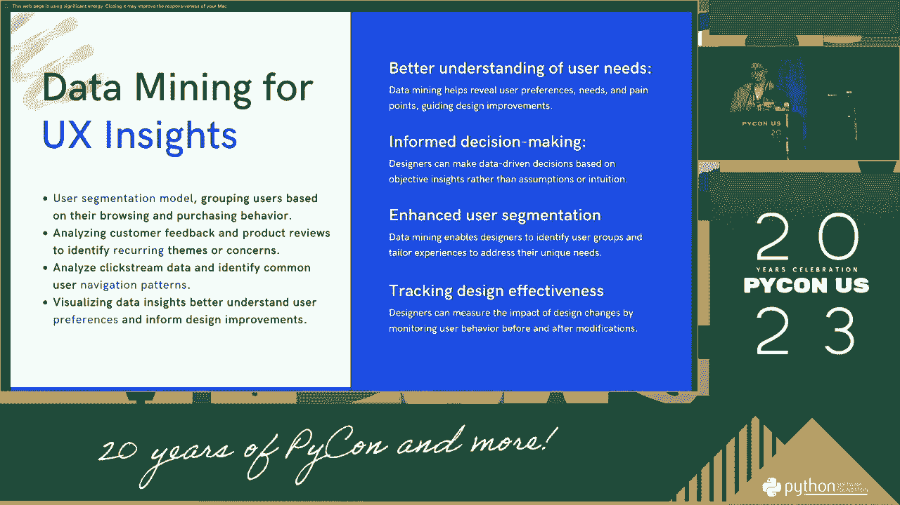

所以，如果有一个小用户能够让他们想到“你是一个人”。这提供了个性化体验，可以从用户的角度出发。带着“你是一个人”。我们使用的所有东西都是像“a”加“a”的研究，关于我们正在经历的所有事情，然后我们将为这一点设定理由。

但在政策历史中这是一个历史，特别是。我们将根据这个图表的上下文给你提供数据，这基于系统。然后我们可以问这个问题，“这是一种特定类型吗？”而这个问题是基于他们的政治和政治相似性。

因为它基于政治话语，所以它不是一个叫做“问题”的非常不同的社区。但它是基于政治和政治世界的拥有历史。它只是一种多样性。因此，我们可以说目标是我们可以制作个性化内容。我们可以让它针对单一用户，甚至可以跟踪它，你可以以这种方式维护它。

我们可以使用一些特定产品的“给予”，但我们不想制造出非常迅速的东西。我们不想像大多数目标那样，而是希望创造出更可持续的东西。我们想要使用可以用于人类的“给予”。在这个时刻。

我们想要自己阐明这些内容。

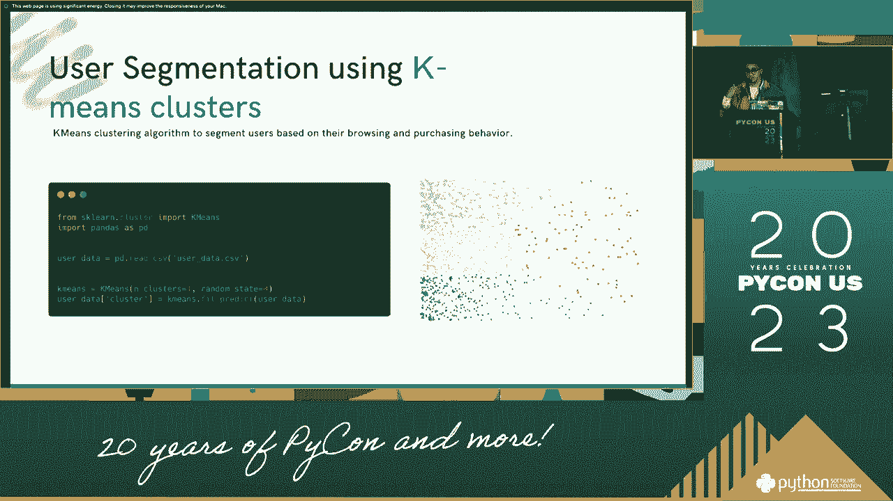

顺便说一下，我们可以使用我们预测的价值。

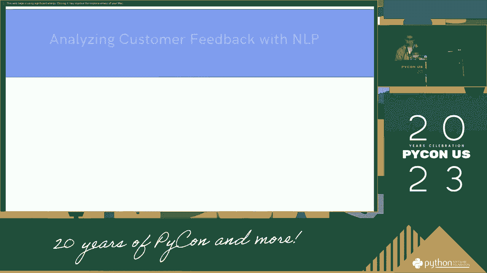

我们可以和我们认为在另一边的“给予”出去，这就是我们如何识别它的，我们无法将其用于问题。问题在于人们习惯于被放置在其中。这也有帮助，例如，在政治环境中，它是关于某种产品的。

这里最重要的事情是你可以用它来解决问题。因为这是你必须使用的东西，就像我们为问题使用的“给予”，你可以逐个使用它。然后你可以放入我们为逐个使用而做的“给予”。

然后你可以逐个使用它，接着你可以逐个使用它。然后你可以逐个使用它，接着你可以逐个使用它。然后你可以逐个使用它，接着你可以逐个使用它。然后你可以逐个使用它，接着你可以逐个使用它。

然后你可以逐个使用它，接着你可以逐个使用它。然后你可以逐个使用它，然后你可以逐个使用它。然后你可以逐个使用它，接着你可以逐个使用它。然后你可以逐个使用它，接着你可以逐个使用它。然后你可以逐个使用它，接着你可以逐个使用它。

然后你可以逐个使用它，接着你可以逐个使用它。然后你可以逐个使用它，然后你可以逐个使用它。然后你可以逐个使用它，接着你可以逐个使用它。然后你可以逐个使用它，接着你可以逐个使用它。然后你可以逐个使用它，接着你可以逐个使用它。

然后你可以逐个使用它，接着你有一个可以使用的例子。你可以在正确的地方使用它，逐个使用。然后你可以逐个使用它，因此你可以逐个使用，而不是在网站上。然后你可以逐个使用它，接着你可以逐个使用它。

然后你可以一个一个地使用它，然后你可以一个一个地使用它。然后你可以一个一个地使用它，然后你可以一个一个地使用它。然后你可以一个一个地使用它，然后你可以一个一个地使用它。然后你可以一个一个地使用它，然后你可以一个一个地使用它。

然后你可以一个一个地使用它，然后你可以一个一个地使用它。然后你可以一个一个地使用它，然后你可以一个一个地使用它。然后你可以一个一个地使用它，然后你可以一个一个地使用它。然后你可以一个一个地使用它，然后你可以一个一个地使用它。

然后你可以一个一个地使用它，然后你可以一个一个地使用它。然后你可以一个一个地使用它，然后你可以一个一个地使用它。然后你可以一个一个地使用它，然后你可以一个一个地使用它。然后你可以一个一个地使用它，然后你可以一个一个地使用它。

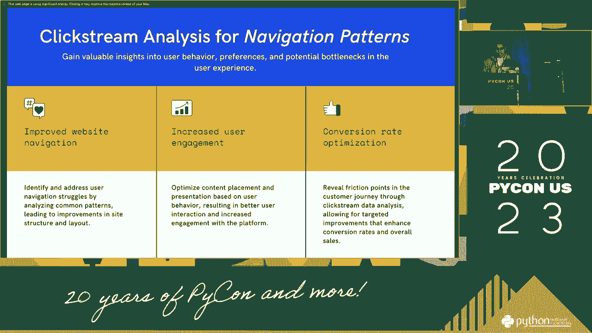

然后你可以一个一个地使用它，然后你可以一个一个地使用它。然后你可以一个一个地使用它，然后你可以一个一个地使用它。

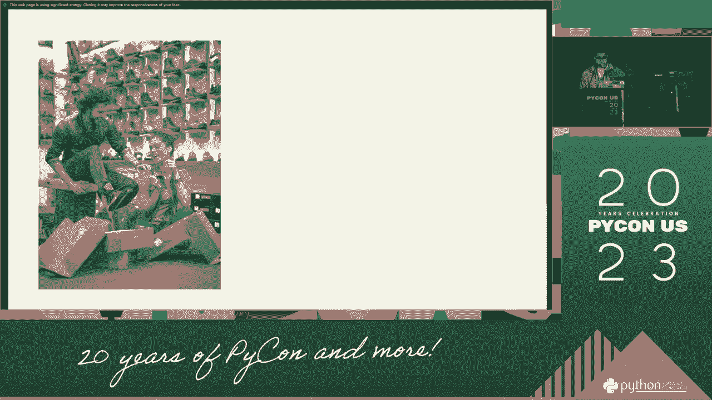

然后你可以一个一个地使用它，然后你可以一个一个地使用它。然后你可以一个一个地使用它，然后你可以一个一个地使用它。然后你可以一个一个地使用它，然后你可以一个一个地使用它。然后你可以一个一个地使用它，然后你可以一个一个地使用它。

然后你可以一个一个地使用它，然后你可以一个一个地使用它。然后你可以一个一个地使用它，然后你可以一个一个地使用它。然后你可以一个一个地使用它，然后你可以一个一个地使用它。然后你可以一个一个地使用它，然后你可以一个一个地使用它。

然后你可以一个一个地使用它，然后你可以一个一个地使用它。然后你可以一个一个地使用它，然后你可以一个一个地使用它。然后你可以一个一个地使用它，然后你可以一个一个地使用它。然后你可以一个一个地使用它，然后你可以一个一个地使用它。

然后你可以一个一个地使用它，然后你可以一个一个地使用它。然后你可以一个一个地使用它，然后你可以一个一个地使用它。然后你可以一个一个地使用它，然后你可以一个一个地使用它。然后你可以一个一个地使用它，然后你可以一个一个地使用它。

然后你可以一个一个地使用它，然后你可以一个一个地使用它。然后你可以一个一个地使用它，然后你可以一个一个地使用它。然后你可以一个一个地使用它，然后你可以一个一个地使用它。然后你可以一个一个地使用它，然后你可以一个一个地使用它。

然后你可以逐个使用，然后你可以逐个使用。然后你可以逐个使用，然后你可以逐个使用。然后你可以逐个使用，然后你可以逐个使用。然后你可以逐个使用，然后你可以逐个使用。

然后你可以逐个使用，然后你可以逐个使用。然后你可以逐个使用，然后你可以逐个使用。然后你可以逐个使用，然后你可以逐个使用。然后你可以逐个使用，然后你可以逐个使用。

然后你可以逐个使用，然后你可以逐个使用。然后你可以逐个使用，然后你可以逐个使用。然后你可以逐个使用，然后你可以逐个使用。然后你可以逐个使用，然后你可以逐个使用。

然后你可以逐个使用，然后你可以逐个使用。然后你可以逐个使用，然后你可以逐个使用。然后你可以逐个使用，然后你可以逐个使用。然后你可以逐个使用，然后你可以逐个使用。

然后你可以逐个使用，然后你可以逐个使用。然后你可以逐个使用，然后你可以逐个使用。然后你可以逐个使用，然后你可以逐个使用。然后你可以逐个使用，然后你可以逐个使用。

然后你可以逐个使用，然后你可以逐个使用。然后你可以逐个使用，然后最后一件事是维度管理。我们将进一步使用，并且我们找到了在警察法律下工作的地方。具体来说是玩游戏，但这不是一个游戏网站，而是圣诞节。

我们知道这不是一个特定的播放列表，但我们将要外出，比如。通过我们自己的计划，所以我们确保我认为，我们可以做到这件事。我们不会陷入困境，因为，例如，如果你在和银行打交道。这不是一回事，我们不会陷入困境，因为，例如。

如果你在和银行打交道，那是一回事，而你上学时可以逐个使用。你可以逐个使用，也可以在学校里使用一些东西。你更有可能去一个能花更多钱的学校，就这样，所以。如果你在使用东西，我会在银行里得到很多东西。所以。

如果这些社区很昂贵，你知道，这对你们来说应该没问题，更何况，你知道。比如，我去过的国家越多，我确实认为，所以，你所做的就像。你在跨越同一个 D.E.R，而 D.E.R 并不重要，但基本上。我们的愿景最终被称为报告，这意味着你知道，这并不重要。我认为。

只要思考，你就会明白，这是一个，你知道，我刚才提到的陈述，而且，你知道。你可能，嗯，我不想再，呃，更多的，我不想，但，你知道。使用几千个片段，你知道，你可以，你知道，这是一个奇怪的片段，而。你需要去除它，你不，呃，使用报告，对 E。E。R。的使用，你知道。

你知道，关键是，你知道，呃，原则的，E。E。R。的原则不是一个，E。E。R。的原则不是一个，E。E。R。的原则是，呃。E。E。R。的原则是，呃，E。E。R。的原则不是一个，E。E。R。的原则不是一个，E。E。R。的原则不是一个，E。E。R。的原则不是一个。

E。E。R。的原则不是一个，E。E。R。的原则不是一个，E。E。R。的原则不是一个，E。E。R。的原则不是一个，E。E。R。的原则不是一个。E。E。R。的原则不是一个，E。E。R。的原则不是一个，E。E。R。

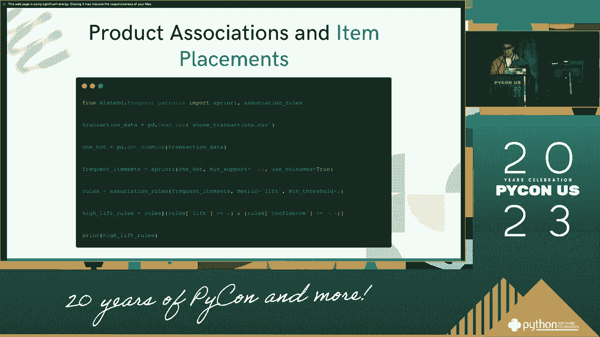

E。E。R。的原则不是一个，E。E。R。的原则不是一个，E。E。R。的原则。

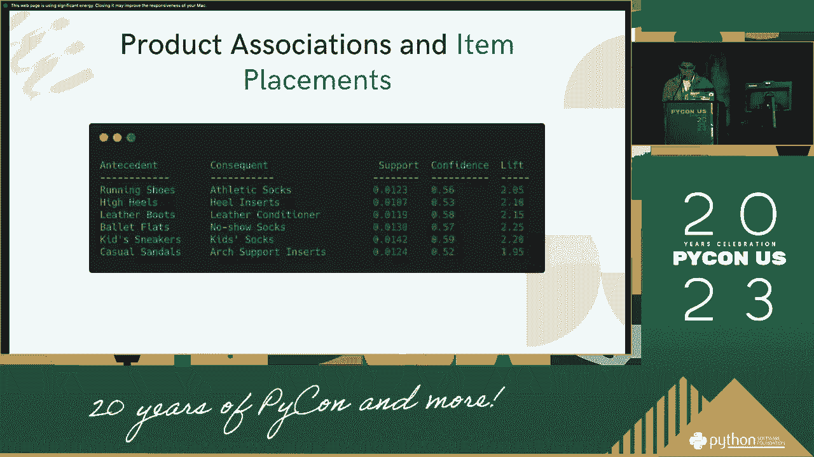

不是一个，E。E。R。的原则不是一个，E。E。R。的原则不是一个。E。E。R。的原则不是一个，E。E。R。的原则不是一个，E。E。R。的原则不是一个，E。E。R。的原则不是一个，E。E。R。

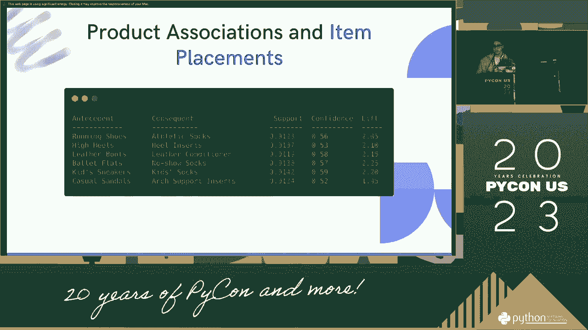

不是一个，E。E。R。的原则不是一个，E。E。R。的原则不是一个。E。E。R。的原则不是一个，E。E。R。的原则不是一个，E。E。R。的原则不是一个，E。E。R。的原则不是一个，E。E。R。的原则不是一个，E。E。R。的原则不是一个。E。E。R。的原则不是一个，E。E。R。的原则不是一个，E。

E。R。不是一个，E。E。R。的原则不是一个，E。E。R。的原则不是一个。E。E。R。的原则不是一个，E。E。R。的原则不是一个，E。E。R。的原则不是一个，E。E。R。的原则不是一个，E。E。R。的原则不是一个，E。E。R。的原则不是一个，E。

E。R。不是一个，E。E。R。的原则不是一个，E。E。R。的原则不是一个。E。E。R。的原则不是一个，E。E。R。的原则不是一个，E。E。R。的原则不是一个，E。E。R。的原则不是一个，E。E。R。的原则不是一个。E。E。R。

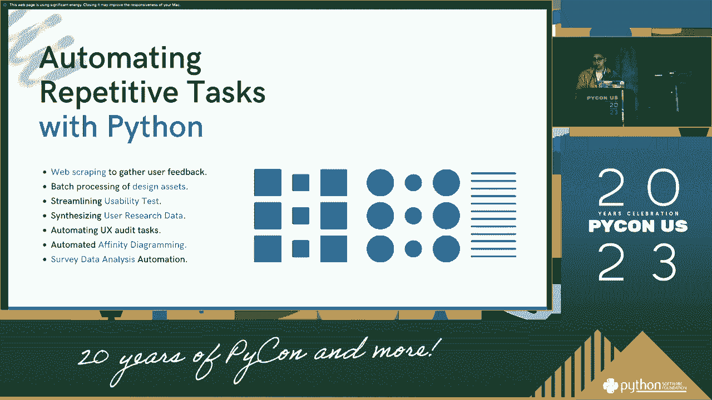

不是一个，E。E。R。的原则不是一个，E。E。R。的原则不是一个。E。E。R。的原则不是一个，E。E。R。的原则不是一个，E。E。R。的原则不是一个，E。E。R。的原则不是一个，E。E。R。的原则不是一个。E。E。R。的原则不是一个，E。E。R。的原则不是一个，E。

E。R。不是一个，E。E。R。的原则不是一个，E。E。R。的原则。

不是一个，E。E。R。的原则不是一个，E。E。R。的原则不是一个。

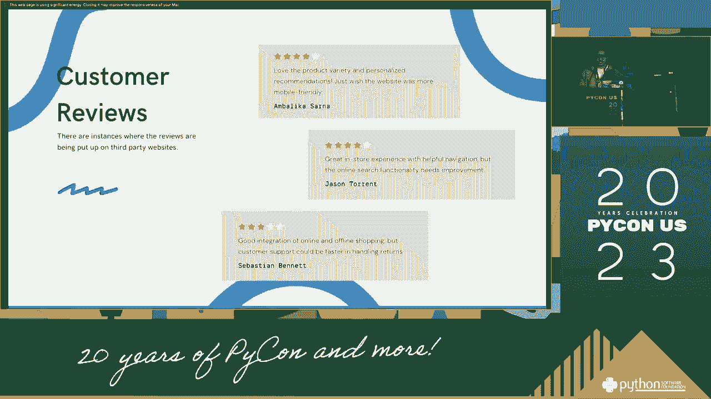

E。E。R。的原则不是一个，E。E。R。的原则不是一个，E。E。R。的原则不是一个，E。E。R。的原则不是一个，E。E。R。的原则不是一个。E。E。R。的原则不是一个，E。E。R。的原则不是一个，E。E。R。的原则不是一个，E。E。R。的原则不是一个，E。E。R。的原则不是一个。

E。E。R。的原则不是一个，E。E。R。的原则不是一个，E。E。R。的原则。

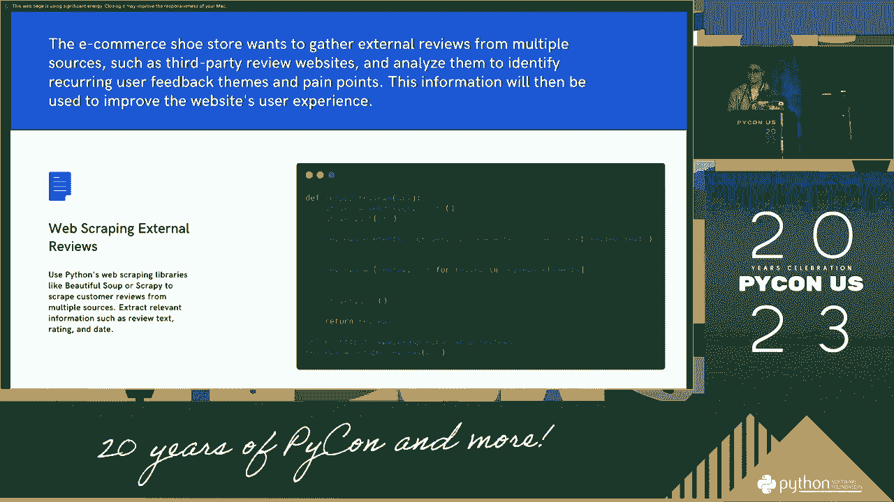

不是一个，E。E。R。的原则不是一个，E。E。R。的原则不是一个。E。E。R。的原则不是一个，E。E。R。的原则不是一个，E。E。R。的原则不是一个，E。E。R。的原则不是一个，E。E。R。的原则不是一个。E。E。R。的原则不是一个，E。E。R。的原则不是一个，E。

E。R。不是一个，E。E。R。的原则不是一个，E。E。R。的原则不是一个。E。E。R。的原则不是一个，E。E。R。的原则不是一个，E。E。R。的原则不是一个，E。E。R。的原则不是一个，E。E。R。的原则不是一个。E。E。R。的原则不是一个，E。E。R。的原则不是一个，E。

E。R。不是一个。

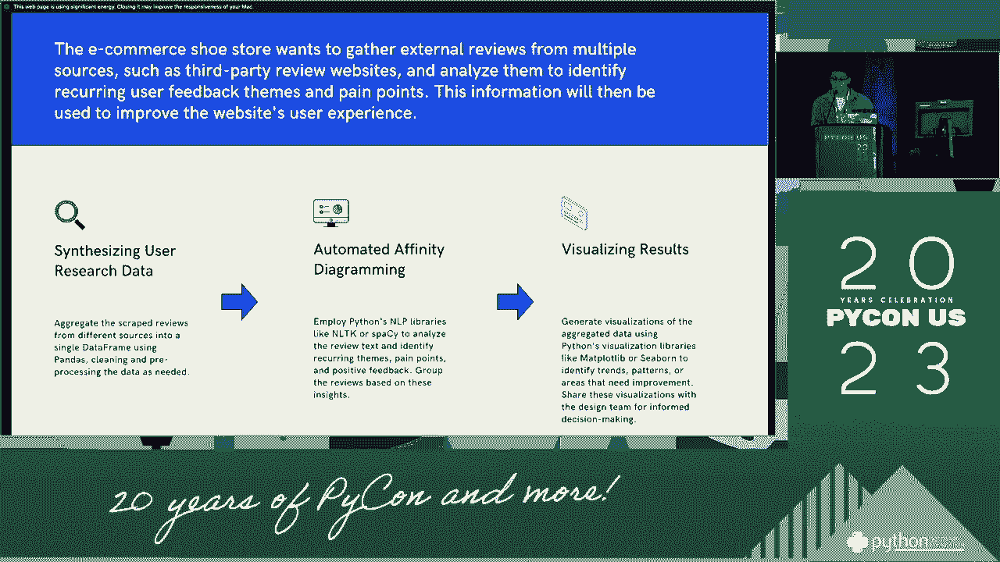

E。E。R。的原则不是一个，E。E。R。的原则不是一个，E。E。R。的原则不是一个，E。E。R。的原则不是一个，E。E。R。的原则不是一个。E。E。R。的原则不是一个，E。E。R。的原则不是一个，E。E。R。的原则不是一个，E。E。R。的原则不是一个，E。E。R。的原则不是一个。

E。E。R。的原则不是一个，E。E。R。的原则不是一个，E。E。R。的原则不是一个，E。E。R。的原则不是一个，E。E。R。的原则不是一个。E。E。R。的原则不是一个，E。E。R。的原则不是一个，E。E。R。的原则不是一个，E。E。R。的原则不是一个，E。E。R。的原则不是一个。

E.E.R. 的原则不是一个，E.E.R. 的原则不是一个，E.E.R. 的原则不是一个，E.E.R. 的原则不是一个，E.E.R. 的原则不是一个。E.E.R. 的原则不是一个，E.E.R. 的原则不是一个，E.E.R. 的原则不是一个，E.E.R. 的原则不是一个，E.E.R. 的原则不是一个。

E.E.R. 的原则不是一个，E.E.R. 的原则不是一个，E.E.R. 的原则不是一个，E.E.R. 的原则不是一个，E.E.R. 的原则不是一个。E.E.R. 的原则不是一个，E.E.R. 的原则不是一个，E.E.R. 的原则不是一个，E.E.R. 的原则不是一个，E.E.R. 的原则不是一个。

E.E.R. 的原则不是一个，E.E.R. 的原则不是一个，E.E.R. 的原则不是一个，E.E.R. 的原则不是一个，E.E.R. 的原则不是一个。E.E.R. 的原则不是一个，E.E.R. 的原则不是一个，E.E.R. 的原则不是一个，E.E.R. 的原则不是一个，E.E.R. 的原则不是一个。

E.E.R. 的原则不是一个，E.E.R. 的原则不是一个，E.E.R. 的原则不是一个，E.E.R. 的原则不是一个，E.E.R. 的原则不是一个。E.E.R. 的原则不是一个，E.E.R. 的原则不是一个，E.E.R. 的原则不是一个，E.E.R. 的原则不是一个，E.E.R. 的原则不是一个。

E.E.R. 的原则不是一个，E.E.R. 的原则不是一个，E.E.R. 的原则不是一个，E.E.R. 的原则不是一个，E.E.R. 的原则不是一个。E.E.R. 的原则不是一个，E.E.R. 的原则不是一个，E.E.R. 的原则不是一个，E.E.R. 的原则。

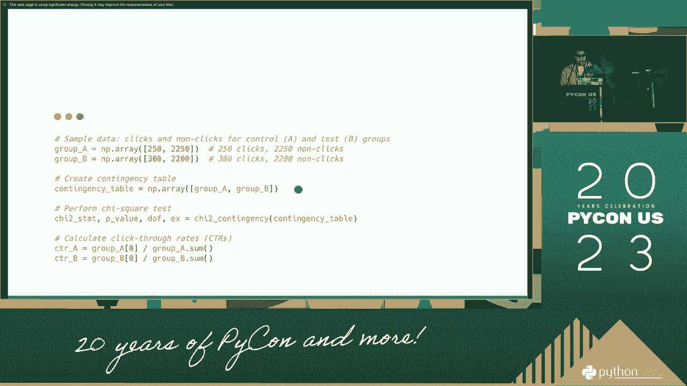

不是一个，E.E.R. 的原则不是一个，E.E.R. 的原则不是一个。E.E.R. 的原则不是一个，E.E.R. 的原则不是一个，E.E.R. 的原则不是一个，E.E.R. 的原则不是一个，E.E.R. 的原则不是一个。E.E.R. 的原则不是一个，E.E.R. 的原则不是一个，E。

E.R. 不是一个，E.E.R. 的原则不是一个，E.E.R. 的原则不是一个。E.E.R. 的原则不是一个。

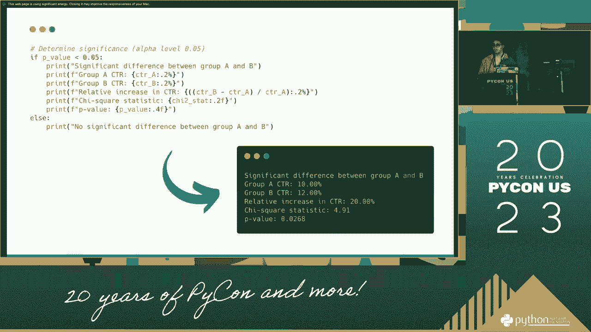

E.E.R. 的原则不是一个，E.E.R. 的原则不是一个，E.E.R. 的原则不是一个，E.E.R. 的原则不是一个，E.E.R. 的原则不是一个。E.E.R. 的原则不是一个，E.E.R. 的原则不是一个，E.E.R. 的原则不是一个，E.E.R. 的原则不是一个，E.E.R. 的原则不是一个。

E.E.R. 的原则不是一个，E.E.R. 的原则不是一个，E.E.R. 的原则不是一个，E.E.R. 的原则不是一个，E.E.R. 的原则不是一个。E.E.R. 的原则不是一个，E.E.R. 的原则不是一个，E.E.R. 的原则不是一个，E.E.R. 的原则不是一个，E.E.R. 的原则不是一个。

E.E.R. 的原则不是一个，E.E.R. 的原则不是一个，E.E.R. 的原则不是一个，E.E.R. 的原则不是一个，E.E.R. 的原则不是一个。E.E.R. 的原则不是一个，E.E.R. 的原则不是一个，E.E.R. 的原则不是一个，E.E.R. 的原则不是一个，E.E.R. 的原则不是一个。

E.E.R. 的原则不是一个，E.E.R. 的原则不是一个，E.E.R. 的原则不是一个，E.E.R. 的原则不是一个，E.E.R. 的原则不是一个。E.E.R. 的原则不是一个，E.E.R. 的原则不是一个，E.E.R. 的原则不是一个，E.E.R. 的原则不是一个，E.E.R. 的原则不是一个。

E.E.R. 的原则不是一个，E.E.R. 的原则不是一个，E.E.R. 的原则不是一个，E.E.R. 的原则不是一个，E.E.R. 的原则不是一个。E.E.R. 的原则不是一个，E.E.R. 的原则不是一个，E.E.R. 的原则不是一个，E.E.R. 的原则不是一个，E.E.R. 的原则不是一个。

E.E.R. 的原则不是一个，E.E.R. 的原则不是一个，E.E.R. 的原则不是一个，E.E.R. 的原则不是一个，E.E.R. 的原则不是一个。E.E.R. 的原则不是一个，E.E.R. 的原则不是一个，E.E.R. 的原则不是一个，E.E.R. 的原则不是一个，E.E.R. 的原则不是一个。

E.E.R. 的原则不是一个，E.E.R. 的原则不是一个，E.E.R. 的原则不是一个，E.E.R. 的原则不是一个，E.E.R. 的原则不是一个。E.E.R. 的原则不是一个，E.E.R. 的原则不是一个，E.E.R. 的原则不是一个，E.E.R. 的原则不是一个，E.E.R. 的原则不是一个。

E.E.R. 的原则不是一个，E.E.R. 的原则不是一个，E.E.R. 的原则不是一个，E.E.R. 的原则不是一个，E.E.R. 的原则不是一个。E.E.R. 的原则不是一个，E.E.R. 的原则不是一个，E.E.R. 的原则不是一个，E.E.R. 的原则不是一个，E.E.R. 的原则不是一个。

E。E。R。的原则不是一个，E。E。R。的原则不是一个，E。E。R。的原则不是一个，E。E。R。的原则不是一个，E。E。R。的原则不是一个。E。E。R。的原则不是一个，E。E。R。的原则不是一个，E。E。R。的原则不是一个，E。E。R。的原则不是一个，E。E。R。的原则不是一个。

E。E。R。的原则不是一个，E。E。R。的原则不是一个，E。E。R。的原则不是一个，E。E。R。的原则不是一个，E。E。R。的原则不是一个。E。E。R。的原则不是一个，E。E。R。的原则不是一个，E。E。R。的原则不是一个，E。E。R。的原则不是一个，E。E。R。的原则不是一个。

E。E。R。的原则不是一个，E。E。R。的原则不是一个，E。E。R。的原则不是一个，E。E。R。的原则不是一个，E。E。R。的原则不是一个。E。E。R。的原则不是一个，E。E。R。的原则不是一个，E。E。R。的原则不是一个，E。E。R。的原则不是一个，E。E。R。的原则不是一个。

E。E。R。的原则不是一个，E。E。R。的原则不是一个，E。E。R。的原则不是一个，E。E。R。的原则不是一个，E。E。R。的原则不是一个。E。E。R。的原则不是一个，E。E。R。的原则不是一个，E。E。R。

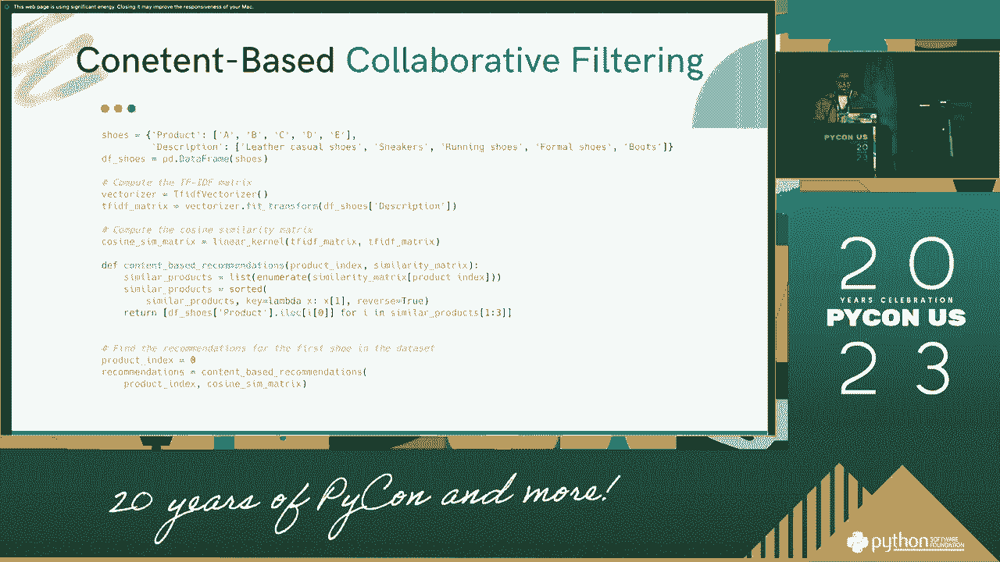

不是一个，E。E。R。的原则不是一个，E。E。R。的原则不是一个。E。E。R。的原则不是一个，E。E。R。的原则不是一个，E。E。R。的原则不是一个，E。E。R。的原则不是一个，E。E。R。的原则不是一个。E。E。R。的原则不是一个，E。E。R。的原则不是一个，E。

E。R。不是一个，E。E。R。的原则不是一个，E。E。R。的原则不是一个。E。E。R。的原则不是一个，E。E。R。的原则不是一个，E。E。R。的原则不是一个，E。E。R。的原则不是一个，E。E。R。的原则不是一个。E。E。R。的原则不是一个，E。E。R。的原则不是一个，E。

E。R。不是一个，E。E。R。的原则不是一个，E。E。R。的原则不是一个。E。E。R。的原则不是一个，E。E。R。的原则不是一个，E。E。R。的原则不是一个，E。E。R。的原则不是一个，E。E。R。的原则不是一个。E。E。R。的原则不是一个，E。E。R。的原则不是一个，E。

E。R。不是一个，E。E。R。的原则不是一个，E。E。R。的原则不是一个。E。E。R。的原则不是一个，E。E。R。的原则不是一个，E。E。R。的原则不是一个，E。E。R。的原则不是一个，E。E。R。的原则不是一个。E。E。R。的原则不是一个，E。E。R。的原则不是一个，E。
