# PyScript入门：P57：为自己构建一个PyScript应用 🚀

在本节课中，我们将学习如何利用PyScript框架，在网页中直接运行Python代码。我们将从基础概念开始，逐步构建一个简单的交互式应用，理解PyScript的核心工作原理。


## 概述

PyScript是一个允许开发者在HTML中嵌入并运行Python代码的框架。它使得在浏览器中创建丰富的数据可视化、机器学习应用等成为可能，而无需复杂的服务器端设置。

---

## PyScript入门：P57-1：PyScript基础概念 💡

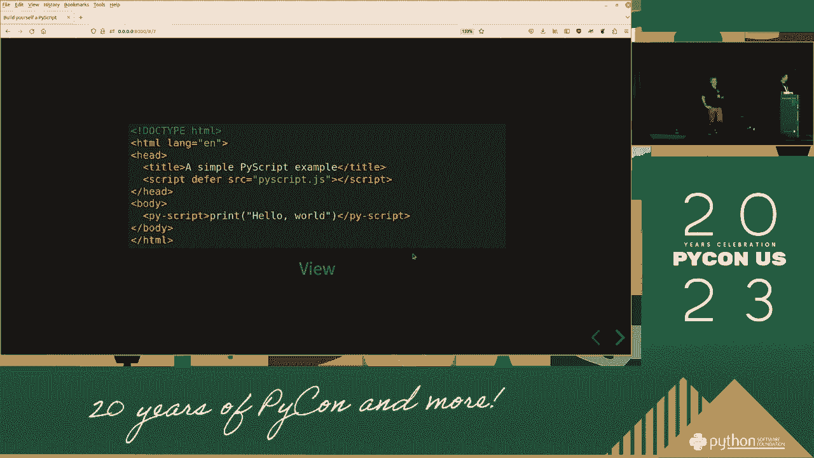

上一节我们介绍了PyScript的总体目标。本节中，我们来看看它的核心概念和基本用法。

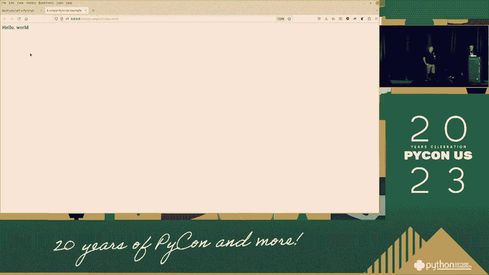

PyScript的核心是允许你在HTML文件中编写Python代码，并通过浏览器执行。这主要通过引入特定的JavaScript库来实现。

一个最基本的PyScript页面结构如下：

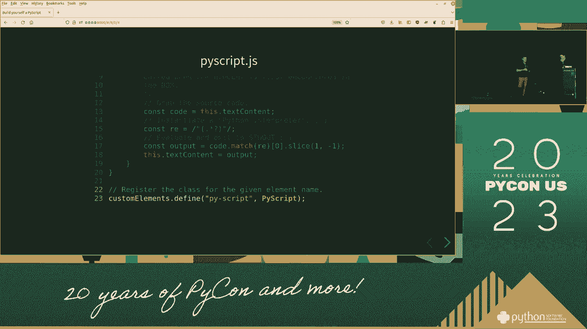

```html
<!DOCTYPE html>
<html lang="en">
<head>
    <link rel="stylesheet" href="https://pyscript.net/latest/pyscript.css" />
    <script defer src="https://pyscript.net/latest/pyscript.js"></script>
</head>
<body>
    <py-script>
        print("Hello, PyScript!")
    </py-script>
</body>
</html>
```

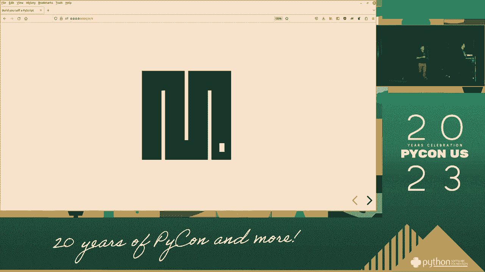

在这个例子中，`<py-script>` 标签内的Python代码会在页面加载时执行，并将结果输出到页面上。

---

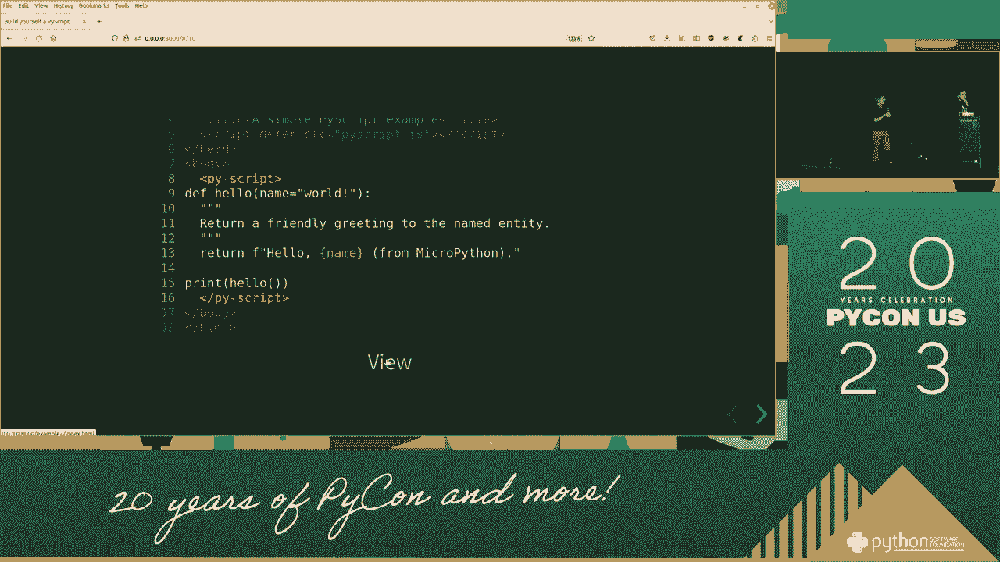

## PyScript入门：P57-2：配置与依赖管理 ⚙️

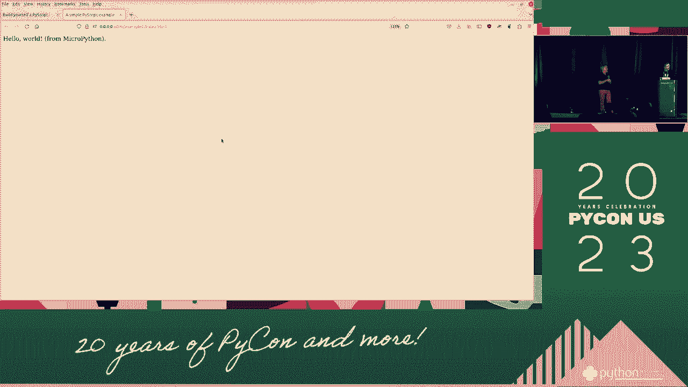

理解了基础用法后，我们需要了解如何配置PyScript环境以及管理项目依赖。

PyScript允许你指定需要使用的Python包。这通过 `<py-config>` 标签完成。以下是配置依赖的示例：

```html
<py-config>
    packages = ["numpy", "matplotlib"]
</py-config>
```

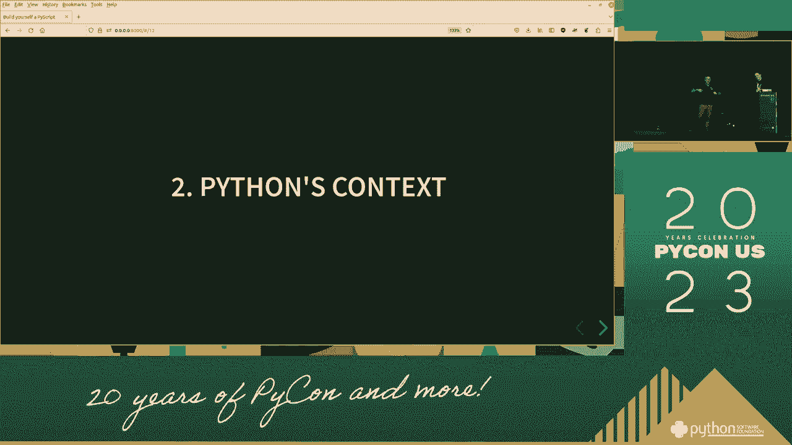

这个配置告诉PyScript运行时，需要预先加载 `numpy` 和 `matplotlib` 这两个库。

---

## PyScript入门：P57-3：与HTML元素交互 🖱️

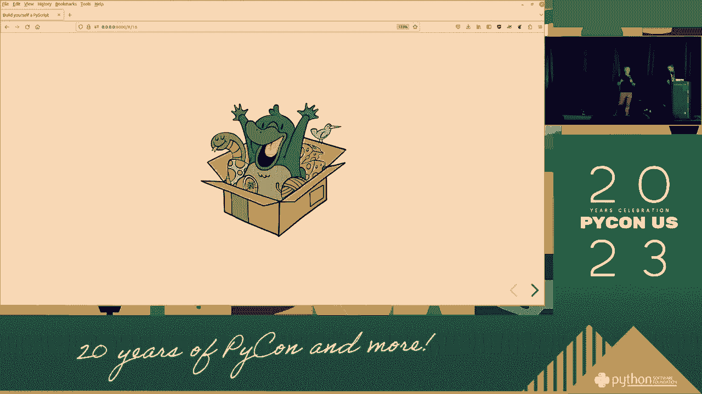

一个强大的功能是让Python代码与网页上的HTML元素进行交互。这包括读取输入框的值、更新页面内容等。

我们可以使用 `Element` 类来获取和操作DOM元素。以下是一个简单的交互示例：

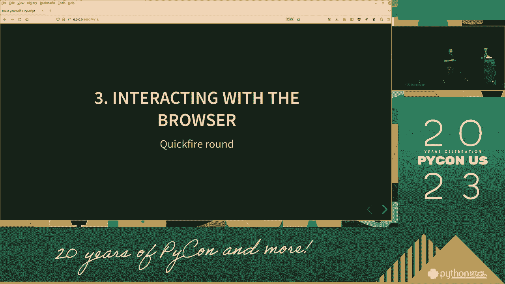

```html
<input type="text" id="name-input" placeholder="输入你的名字">
<button id="greet-btn" py-click="greet()">打招呼</button>
<div id="output"></div>

<py-script>
    from js import document
    from pyodide.ffi import create_proxy

    def greet():
        name = document.getElementById("name-input").value
        if name:
            document.getElementById("output").innerHTML = f"你好，{name}！"
        else:
            document.getElementById("output").innerHTML = "请输入名字。"

    # 为按钮创建事件代理
    button = document.getElementById("greet-btn")
    button.addEventListener("click", create_proxy(greet))
</py-script>
```


在这个例子中，Python函数 `greet()` 会读取输入框的内容，并将问候语输出到 `id` 为 `output` 的 `div` 元素中。

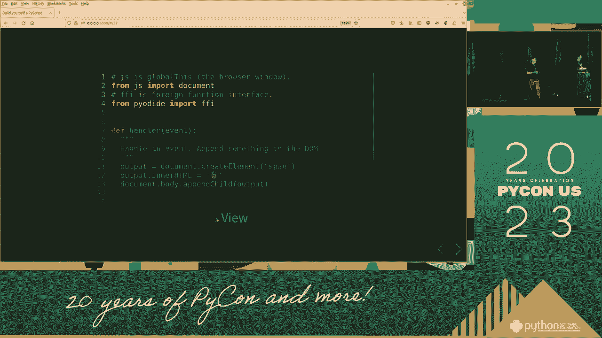

---

## PyScript入门：P57-4：处理数据与可视化 📊


PyScript非常适合进行数据分析和可视化。结合像 `pandas` 和 `matplotlib` 这样的库，可以直接在浏览器中生成图表。


以下是一个使用 `matplotlib` 绘制简单折线图的例子：

```html
<py-config>
    packages = ["matplotlib"]
</py-config>

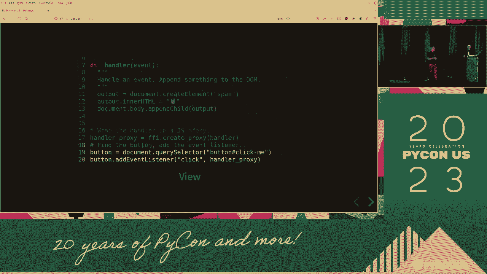

<div id="plot"></div>

<py-script>
    import matplotlib.pyplot as plt
    import numpy as np

    # 生成数据
    x = np.linspace(0, 10, 100)
    y = np.sin(x)

    # 创建图形
    fig, ax = plt.subplots()
    ax.plot(x, y)
    ax.set_title("正弦波图")

    # 将图形显示到指定div中
    pyscript.write("plot", fig)
</py-script>
```

代码首先生成一组数据，然后使用 `matplotlib` 创建图表，最后通过 `pyscript.write()` 函数将图表插入到指定的HTML元素中。


---

## PyScript入门：P57-5：应用部署与注意事项 🚢


构建完应用后，最后一步是部署。由于PyScript完全在客户端运行，你可以像部署任何静态网站一样部署它。


以下是部署时需要注意的几个关键点：
*   **性能**：首次加载需要下载PyScript运行时代码和Python包，页面加载时间可能较长。考虑使用CDN并优化包列表。
*   **兼容性**：确保用户的浏览器支持WebAssembly（现代浏览器基本都支持）。
*   **静态托管**：可以将整个项目（HTML、CSS、JS文件）托管在GitHub Pages、Netlify、Vercel等静态网站托管服务上。

---

## 总结

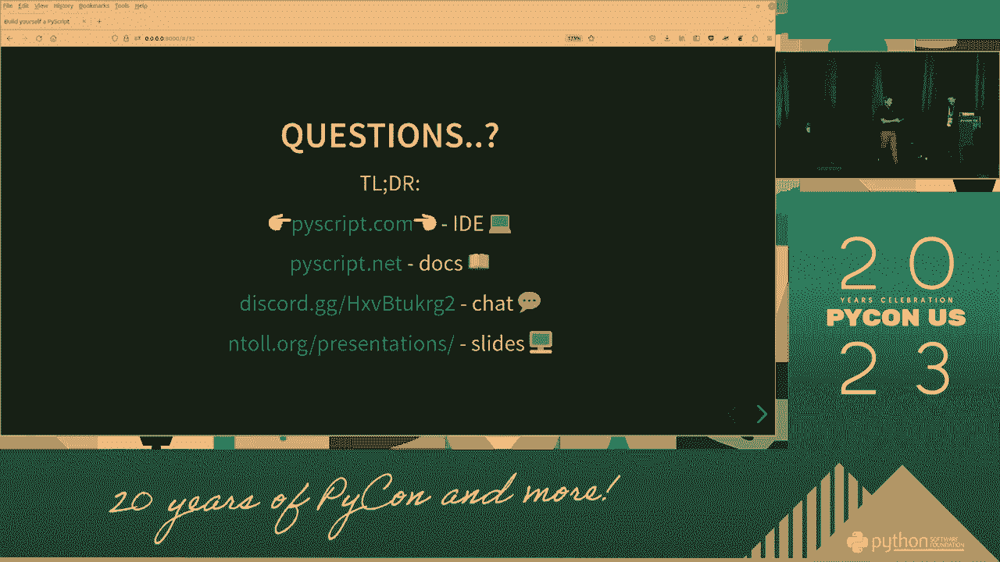

本节课中我们一起学习了PyScript的核心知识。我们从基础概念入手，学会了如何在HTML中嵌入并运行Python代码。接着，我们探索了如何配置环境、管理依赖，并实现了Python与HTML元素的动态交互。最后，我们使用 `matplotlib` 进行了数据可视化，并讨论了部署应用时的注意事项。

通过PyScript，你可以将Python的强大功能直接带到网页前端，为构建交互式数据应用和原型提供了全新的可能性。