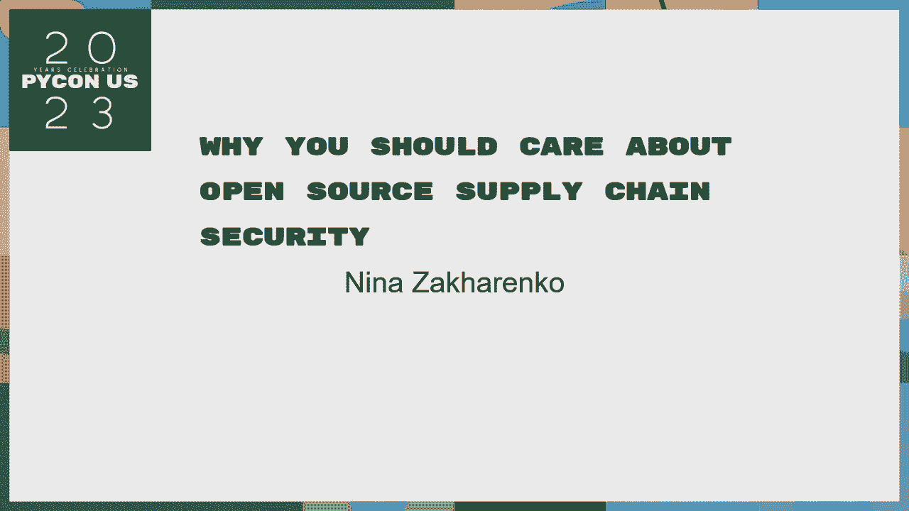
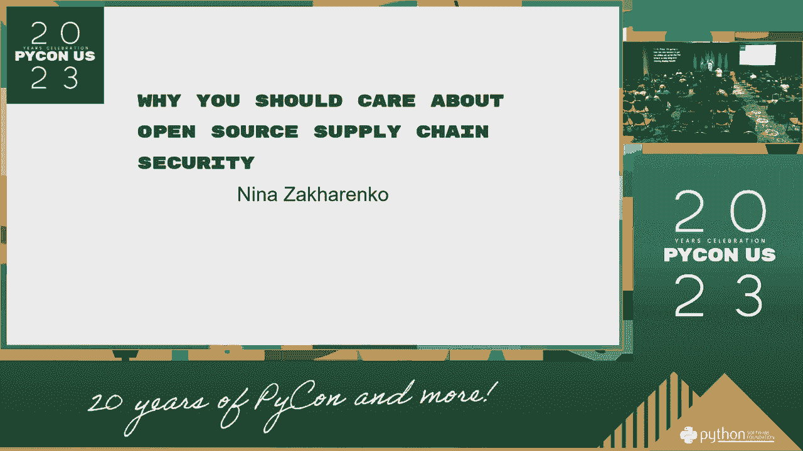
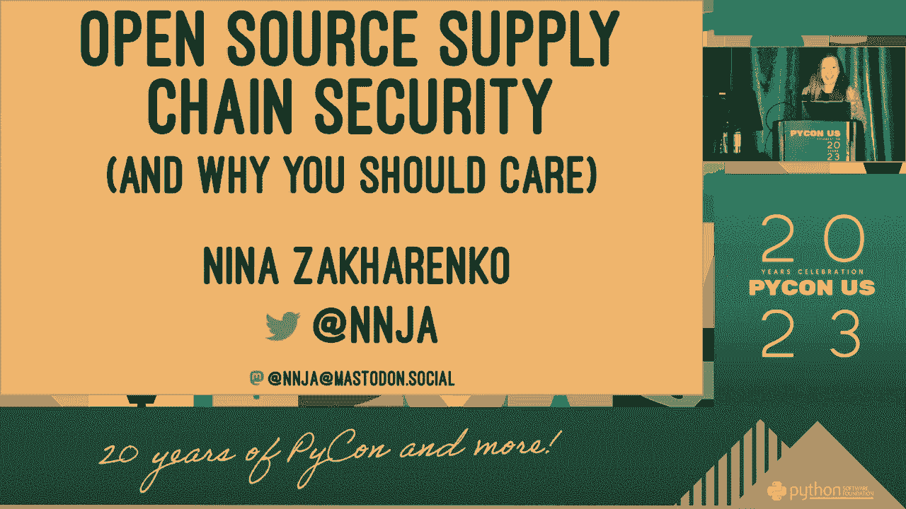
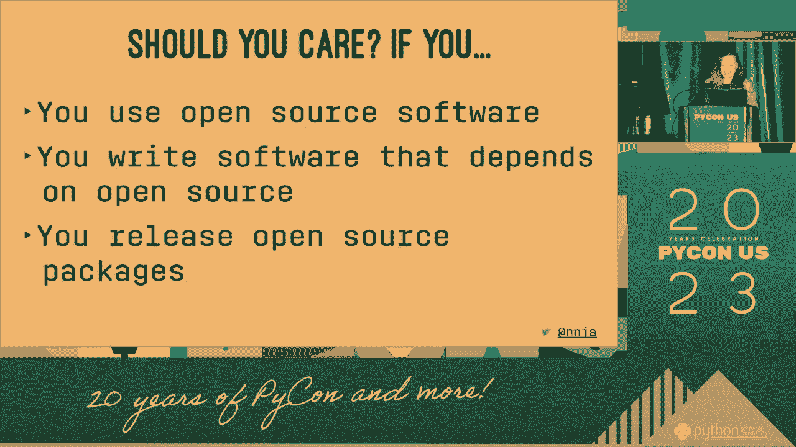
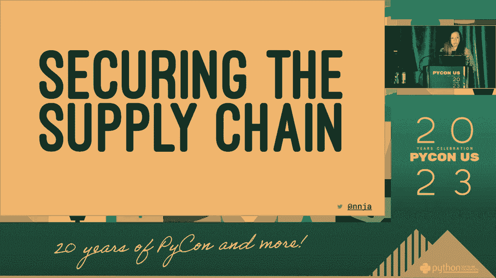
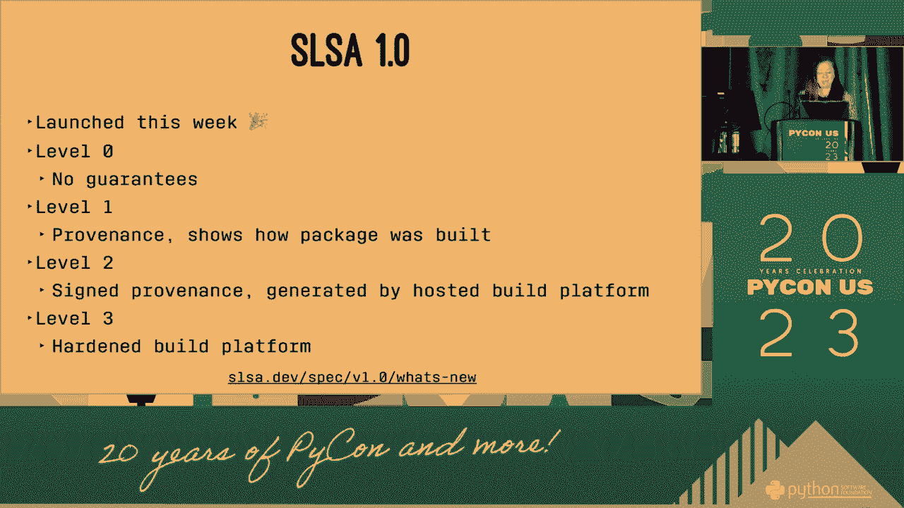
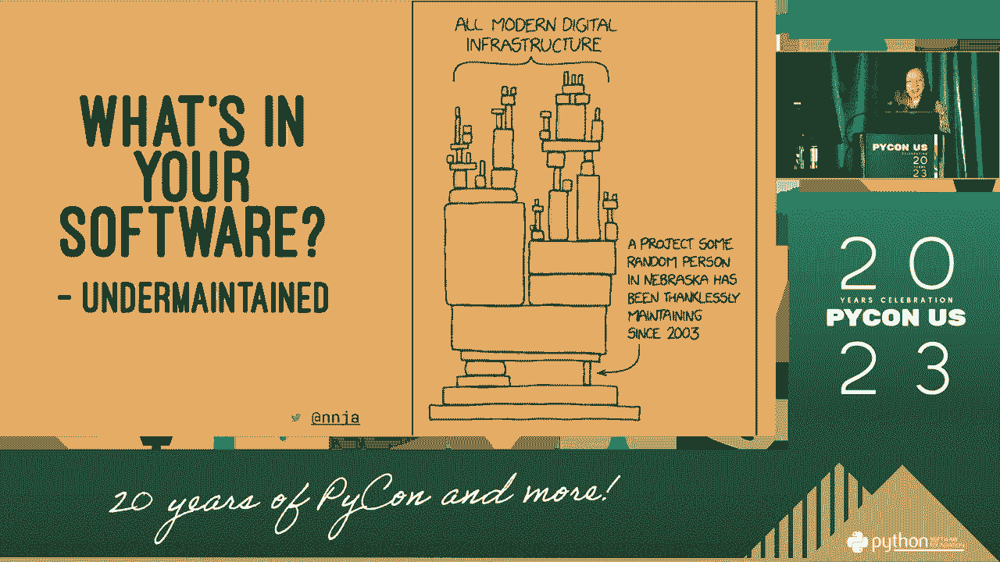
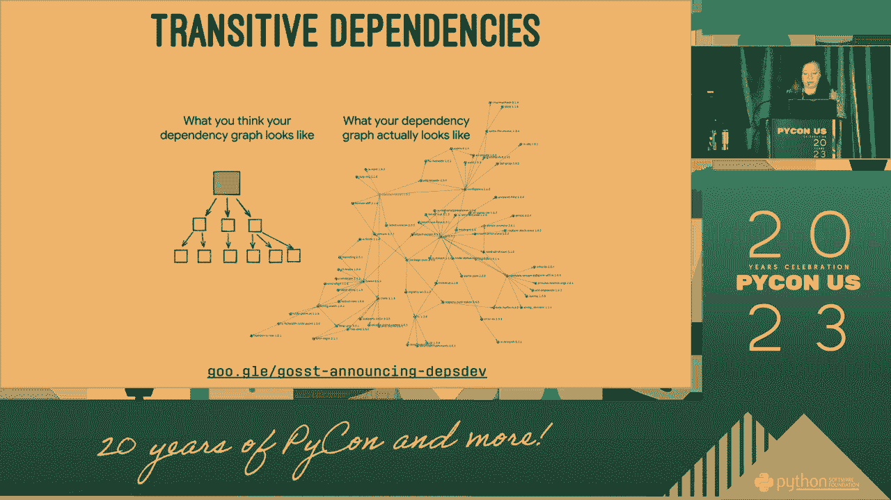

# 开源供应链安全：P58：你为什么应该关心开源供应链安全 🔒





在本节课中，我们将学习开源软件供应链安全的基本概念。我们将探讨什么是软件供应链，为什么它容易受到攻击，以及作为开发者或用户，你可以采取哪些措施来保护自己。理解这些知识对于构建和维护安全的软件至关重要。



## 概述

现代软件开发严重依赖开源组件。一个应用程序可能由数十甚至数百个开源库和框架构建而成。这条从原始开发者到最终用户的复杂链条，就是**软件供应链**。本节课将解释这条供应链中的安全风险，并说明为什么每个人都应该关注它。




---

## 1. 什么是软件供应链？ ⛓️

软件供应链是指软件从开发到交付给最终用户所经历的全部过程和组件。这包括：

*   **上游依赖**：你的项目直接使用的开源库。
*   **间接依赖**：你的上游依赖所依赖的其他库（也称为传递依赖）。
*   **构建工具与流程**：用于编译、测试和打包软件的系统和脚本。
*   **分发渠道**：如应用商店、包管理器（npm, PyPI, Docker Hub等）。

一个简单的依赖关系可以表示为：
```
你的项目 -> 开源库A -> 开源库B -> 开源库C
```
在这个链条中，**开源库C** 就是你的一个间接依赖。

---

上一节我们介绍了软件供应链的构成，它像一张复杂的网。本节中我们来看看，这张网为何会变得脆弱。

## 2. 供应链为何成为攻击目标？ 🎯

软件供应链之所以吸引攻击者，是因为它具有“一次入侵，广泛影响”的特点。攻击者不再需要逐个攻击成千上万的最终用户或企业。

以下是供应链攻击的主要优势：

*   **影响范围广**：入侵一个被广泛使用的开源库，可以潜在影响所有使用它的应用程序和用户。
*   **隐蔽性强**：恶意代码可以隐藏在合法的更新中，难以被传统安全工具发现。
*   **信任被利用**：开发者通常信任来自官方仓库的知名包，这种信任会被攻击者滥用。
*   **防御难度大**：企业很难审查其软件中每一个间接依赖的源代码和安全性。

---

理解了攻击者的动机后，接下来我们看看攻击具体是如何发生的。

## 3. 常见的供应链攻击类型 ⚔️

攻击者会利用供应链中的多个环节进行破坏。以下是几种常见的攻击手法：

*   **依赖混淆攻击**：攻击者向公共包仓库发布一个与公司内部私有包同名的恶意版本。构建系统可能会错误地下载这个恶意公共包。
*   **劫持维护者账户**：通过窃取密码或利用漏洞，控制一个流行开源项目的维护者账户，然后发布带有后门的更新。
*   **投毒官方仓库**：直接入侵如 npm、PyPI 等官方包仓库，篡改热门软件包。
*   **破坏构建过程**：入侵用于自动化构建和发布的持续集成/持续部署（CI/CD）系统，在软件编译过程中注入恶意代码。
*   **替换依赖**：通过篡改项目配置文件（如 `package.json`, `requirements.txt`），将依赖指向一个恶意仓库的版本。

---


面对这些威胁，我们并非无能为力。下一节将介绍一些个人可以采取的基础防护措施。

## 4. 个人可以采取的防护措施 🛡️



作为开发者或用户，你可以通过以下实践来提升安全性：

以下是保护自己的几个关键步骤：

1.  **锁定依赖版本**：使用锁文件（如 `package-lock.json`, `Pipfile.lock`）或精确指定版本号，避免自动更新到可能包含恶意代码的最新版。
    ```json
    // 在 package.json 中，避免使用过于宽泛的版本范围
    "dependencies": {
      "useful-library": "1.4.2" // 好：精确版本
      // "useful-library": "^1.4.0" // 有风险：允许自动更新小版本
    }
    ```
2.  **定期更新与审查**：定期更新依赖以获取安全补丁，同时关注所依赖项目的安全公告和动态。
3.  **使用可信来源**：始终从官方或经过验证的仓库下载软件包。
4.  **实施代码审查**：对项目引入的新依赖，特别是权限较高的依赖，进行基本的代码审查或查看其流行度和维护状况。
5.  **利用安全工具**：使用像 `npm audit`, `snyk`, `dependabot` 这样的工具，自动扫描项目依赖中的已知漏洞。

---

个人的努力很重要，但维护整个生态系统的安全需要更广泛的协作。本节将探讨社区和生态层面的行动。



## 5. 社区与生态系统的责任 🤝



保障开源供应链安全是整个社区的共同责任。

以下是关键参与者可以做的事情：



*   **维护者**：启用双因素认证（2FA）保护账户；对关键贡献进行仔细审查；及时响应安全漏洞报告。
*   **基金会与公司**：为关键开源项目提供资金和安全审计支持；建立漏洞披露和应急响应流程。
*   **包仓库管理者**：加强账户安全策略；推广2FA；对上传的包进行恶意软件扫描。
*   **所有贡献者**：以安全的方式编写代码；负责任地披露发现的漏洞。

---


## 总结

本节课中我们一起学习了开源供应链安全的核心内容。我们首先定义了**软件供应链**，并解释了它因其广泛性和信任基础而成为高价值攻击目标。接着，我们分析了**依赖混淆**、**账户劫持**等常见的供应链攻击手法。最后，我们从个人和社区两个层面，探讨了如何通过锁定版本、使用安全工具、加强账户安全等具体措施来防御这些风险。


记住，在开源的世界里，安全是所有人的共同责任。关注你的依赖，就是保护你的项目和用户的第一步。