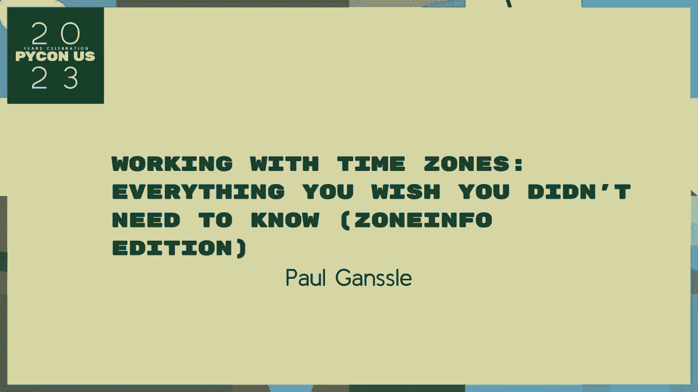
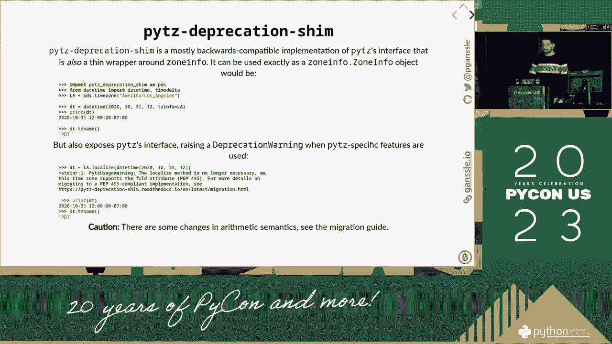

# 时区编程：P61：与时区合作：你希望你不知道的一切 🕐



在本节课中，我们将学习与时区相关的基础概念、常见陷阱以及如何在编程中正确处理它们。我们将从时间的基本定义开始，逐步深入到时区的复杂性，并探讨一些实用的编程模型。


## 时间的基础概念

上一节我们介绍了课程概述，本节中我们来看看时间的基础概念。时间是连续的，但我们在计算机中测量和表示时间时，通常使用离散的选项。这些选项大多是以下三者之一。

时间本身不能包含指令，但我们对时间的表示和操作确实依赖于指令。这是一个非常重要的区别。当你不再是编程新手时，理解这一点至关重要。

## 时区与偏移量的区别

另一个核心概念是时区与偏移量之间的区别。偏移量是指当地时间与协调世界时之间的差值，通常以小时表示，例如 `UTC-5` 表示比 UTC 晚 5 小时。

时区则是一套更复杂的规则，它定义了某个地理区域在历史上和未来所有不同时间点应使用的偏移量。时区规则会因夏令时、政策变化等因素而改变。

## 时区规则的复杂性

并非所有时区都恰好偏离 UTC 整数小时。有些时区有 30 分钟或 45 分钟的偏移。例如，印度标准时间是 `UTC+5:30`，尼泊尔时间是 `UTC+5:45`。

时区规则也会频繁更改。一个地区可能决定永久采用夏令时，或者改变其标准时间的偏移量。这些更改通常由政府立法决定，并且生效日期可能非常突然。

## 模糊时间与不存在的时间

处理时区时，会遇到两个特殊问题：模糊时间和不存在的时间。

*   **模糊时间**：在夏令时切换回标准时间的那个秋季夜晚，时钟会从凌晨 1:59 跳回凌晨 1:00。因此，凌晨 1:30 这个时间会出现两次。在代码中，这被称为模糊时间。
*   **不存在的时间**：在春季切换到夏令时的那天，时钟会从凌晨 1:59 直接跳到凌晨 3:00。因此，凌晨 2:30 这个时间在现实中不存在。在代码中，这被称为不存在的时间。

以下是处理这些情况的通用逻辑：

```python
# 伪代码：处理模糊或不存在的时间
if is_ambiguous(timestamp, timezone):
    # 需要决定使用第一次还是第二次出现
    resolved_time = resolve_ambiguity(timestamp, timezone, which=‘first‘)
elif not exists(timestamp, timezone):
    # 时间不存在，需要向前或向后调整到有效时间
    adjusted_time = adjust_to_valid(timestamp, timezone, direction=‘forward‘)
```

## 编程中的时区模型

在软件中处理时区时，通常有三种模型：

1.  **仅使用 UTC**：在系统内部，所有时间都存储为 UTC。只在需要向用户展示时，才转换为本地时间。这是最推荐的做法，公式可以表示为：`本地时间 = UTC 时间 + 偏移量`。
2.  **使用本地时间加时区信息**：存储一个本地时间戳，并附带其所属的时区标识符（如 “America/New_York”）。这允许你准确还原时间点，但计算和比较更复杂。
3.  **使用带偏移量的时间**：存储一个时间戳和其当前的固定偏移量（如 `2023-10-01T10:00:00-04:00`）。这丢失了时区规则信息，如果该地区的偏移量未来发生变化，此时间点的含义可能会变得不准确。

## 总结



本节课中我们一起学习了时区编程的核心知识。我们明确了时间、偏移量和时区的区别，了解了时区规则的复杂性和动态变化特性。我们探讨了模糊时间和不存在时间这两个关键问题及其处理思路。最后，我们比较了编程中处理时区的几种常见模型，其中在系统内部坚持使用 **UTC** 是最简单、最不容易出错的方法。记住，时区是关于政治和地理的规则，而不仅仅是关于时间的数学。